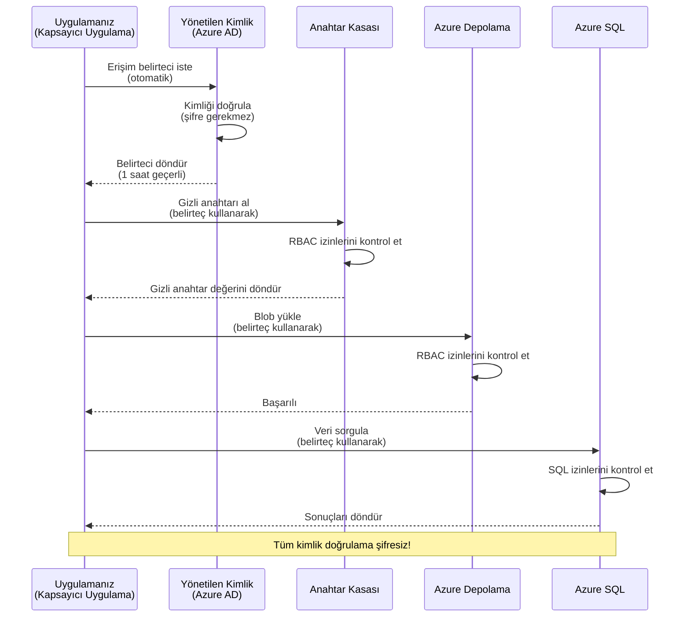
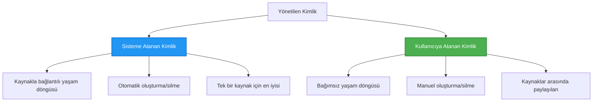

<!--
CO_OP_TRANSLATOR_METADATA:
{
  "original_hash": "e13ff6e1197e0a7462ed0aede7df9f23",
  "translation_date": "2025-11-21T00:42:44+00:00",
  "source_file": "docs/getting-started/authsecurity.md",
  "language_code": "tr"
}
-->
# Kimlik Doğrulama Modelleri ve Yönetilen Kimlik

⏱️ **Tahmini Süre**: 45-60 dakika | 💰 **Maliyet Etkisi**: Ücretsiz (ek ücret yok) | ⭐ **Zorluk Seviyesi**: Orta

**📚 Öğrenme Yolu:**
- ← Önceki: [Yapılandırma Yönetimi](configuration.md) - Ortam değişkenlerini ve sırları yönetme
- 🎯 **Buradasınız**: Kimlik Doğrulama ve Güvenlik (Yönetilen Kimlik, Key Vault, güvenli modeller)
- → Sonraki: [İlk Proje](first-project.md) - İlk AZD uygulamanızı oluşturun
- 🏠 [Kurs Ana Sayfası](../../README.md)

---

## Öğrenecekleriniz

Bu dersi tamamladığınızda:
- Azure kimlik doğrulama modellerini (anahtarlar, bağlantı dizeleri, yönetilen kimlik) anlayacaksınız
- **Yönetilen Kimlik** ile şifresiz kimlik doğrulama uygulayacaksınız
- **Azure Key Vault** entegrasyonu ile sırları güvence altına alacaksınız
- AZD dağıtımları için **rol tabanlı erişim kontrolü (RBAC)** yapılandıracaksınız
- Container Apps ve Azure hizmetlerinde güvenlik en iyi uygulamalarını uygulayacaksınız
- Anahtar tabanlı kimlik doğrulamadan kimlik tabanlı kimlik doğrulamaya geçiş yapacaksınız

## Yönetilen Kimliğin Önemi

### Sorun: Geleneksel Kimlik Doğrulama

**Yönetilen Kimlikten Önce:**
```javascript
// ❌ GÜVENLİK RİSKİ: Kodda sabitlenmiş sırlar
const connectionString = "Server=mydb.database.windows.net;User=admin;Password=P@ssw0rd123";
const storageKey = "xK7mN9pQ2wR5tY8uI0oP3aS6dF1gH4jK...";
const cosmosKey = "C2x7B9n4M1p8Q5w3E6r0T2y5U8i1O4p7...";
```

**Sorunlar:**
- 🔴 **Kodda, yapılandırma dosyalarında, ortam değişkenlerinde açık sırlar**
- 🔴 **Kimlik bilgisi döngüsü** kod değişiklikleri ve yeniden dağıtım gerektirir
- 🔴 **Denetim kabusu** - kim ne zaman neye erişti?
- 🔴 **Dağınıklık** - sırlar birden fazla sistemde dağılmış durumda
- 🔴 **Uyumluluk riskleri** - güvenlik denetimlerinde başarısızlık

### Çözüm: Yönetilen Kimlik

**Yönetilen Kimlikten Sonra:**
```javascript
// ✅ GÜVENLİ: Kodda sır yok
const credential = new DefaultAzureCredential();
const client = new BlobServiceClient(
  "https://mystorageaccount.blob.core.windows.net",
  credential  // Azure kimlik doğrulamayı otomatik olarak yönetir
);
```

**Faydalar:**
- ✅ **Kodda veya yapılandırmada sıfır sır**
- ✅ **Otomatik döngü** - Azure bunu yönetir
- ✅ **Tam denetim izi** Azure AD günlüklerinde
- ✅ **Merkezi güvenlik** - Azure Portal'da yönetim
- ✅ **Uyumluluk hazır** - güvenlik standartlarını karşılar

**Benzerlik**: Geleneksel kimlik doğrulama, farklı kapılar için birden fazla fiziksel anahtar taşımak gibidir. Yönetilen Kimlik ise kim olduğunuz temelinde otomatik olarak erişim sağlayan bir güvenlik kartı gibidir—kaybolacak, kopyalanacak veya döndürülecek anahtar yok.

---

## Mimari Genel Bakış

### Yönetilen Kimlik ile Kimlik Doğrulama Akışı


### Yönetilen Kimlik Türleri


| Özellik | Sistem Atamalı | Kullanıcı Atamalı |
|---------|----------------|-------------------|
| **Yaşam Döngüsü** | Kaynağa bağlı | Bağımsız |
| **Oluşturma** | Kaynakla otomatik | Manuel oluşturma |
| **Silme** | Kaynakla birlikte silinir | Kaynak silindikten sonra devam eder |
| **Paylaşım** | Sadece bir kaynak | Birden fazla kaynak |
| **Kullanım Durumu** | Basit senaryolar | Karmaşık çok kaynaklı senaryolar |
| **AZD Varsayılanı** | ✅ Önerilen | Opsiyonel |

---

## Ön Koşullar

### Gerekli Araçlar

Önceki derslerden bunları zaten yüklemiş olmalısınız:

```bash
# Azure Developer CLI'yi doğrula
azd version
# ✅ Beklenen: azd sürüm 1.0.0 veya daha yüksek

# Azure CLI'yi doğrula
az --version
# ✅ Beklenen: azure-cli 2.50.0 veya daha yüksek
```

### Azure Gereksinimleri

- Aktif Azure aboneliği
- İzinler:
  - Yönetilen kimlikler oluşturma
  - RBAC rolleri atama
  - Key Vault kaynakları oluşturma
  - Container Apps dağıtma

### Bilgi Ön Koşulları

Tamamlamış olmanız gerekenler:
- [Kurulum Kılavuzu](installation.md) - AZD kurulumu
- [AZD Temelleri](azd-basics.md) - Temel kavramlar
- [Yapılandırma Yönetimi](configuration.md) - Ortam değişkenleri

---

## Ders 1: Kimlik Doğrulama Modellerini Anlama

### Model 1: Bağlantı Dizeleri (Eski - Kaçınılmalı)

**Nasıl çalışır:**
```bash
# Bağlantı dizesi kimlik bilgilerini içeriyor
STORAGE_CONNECTION_STRING="DefaultEndpointsProtocol=https;AccountName=myaccount;AccountKey=xK7mN9pQ2wR5..."
COSMOS_CONNECTION_STRING="AccountEndpoint=https://myaccount.documents.azure.com:443/;AccountKey=C2x7..."
SQL_CONNECTION_STRING="Server=myserver.database.windows.net;User=admin;Password=P@ssw0rd..."
```

**Sorunlar:**
- ❌ Ortam değişkenlerinde görünen sırlar
- ❌ Dağıtım sistemlerinde kaydedilir
- ❌ Döndürmek zor
- ❌ Erişim denetim izi yok

**Ne zaman kullanılır:** Sadece yerel geliştirme için, asla üretimde.

---

### Model 2: Key Vault Referansları (Daha İyi)

**Nasıl çalışır:**
```bicep
// Store secret in Key Vault
resource keyVault 'Microsoft.KeyVault/vaults@2023-02-01' = {
  name: 'mykv'
  properties: {
    enableRbacAuthorization: true
  }
}

// Reference in Container App
env: [
  {
    name: 'STORAGE_KEY'
    secretRef: 'storage-key'  // References Key Vault
  }
]
```

**Faydalar:**
- ✅ Sırlar Key Vault'ta güvenli bir şekilde saklanır
- ✅ Merkezi sır yönetimi
- ✅ Kod değişiklikleri olmadan döndürme

**Sınırlamalar:**
- ⚠️ Hala anahtarlar/şifreler kullanılıyor
- ⚠️ Key Vault erişimini yönetmek gerekiyor

**Ne zaman kullanılır:** Bağlantı dizelerinden yönetilen kimliğe geçiş adımı.

---

### Model 3: Yönetilen Kimlik (En İyi Uygulama)

**Nasıl çalışır:**
```bicep
// Enable managed identity
resource containerApp 'Microsoft.App/containerApps@2023-05-01' = {
  name: 'myapp'
  identity: {
    type: 'SystemAssigned'  // Automatically creates identity
  }
}

// Grant permissions
resource roleAssignment 'Microsoft.Authorization/roleAssignments@2022-04-01' = {
  scope: storageAccount
  properties: {
    roleDefinitionId: storageBlobDataContributorRole
    principalId: containerApp.identity.principalId
  }
}
```

**Uygulama kodu:**
```javascript
// Sır gerekmez!
const { DefaultAzureCredential } = require('@azure/identity');
const { BlobServiceClient } = require('@azure/storage-blob');

const credential = new DefaultAzureCredential();
const blobServiceClient = new BlobServiceClient(
  'https://mystorageaccount.blob.core.windows.net',
  credential
);
```

**Faydalar:**
- ✅ Kodda/yapılandırmada sıfır sır
- ✅ Otomatik kimlik bilgisi döngüsü
- ✅ Tam denetim izi
- ✅ RBAC tabanlı izinler
- ✅ Uyumluluk hazır

**Ne zaman kullanılır:** Her zaman, üretim uygulamaları için.

---

## Ders 2: AZD ile Yönetilen Kimlik Uygulama

### Adım Adım Uygulama

Azure Storage ve Key Vault'a erişmek için yönetilen kimlik kullanan güvenli bir Container App oluşturalım.

### Proje Yapısı

```
secure-app/
├── azure.yaml                 # AZD configuration
├── infra/
│   ├── main.bicep            # Main infrastructure
│   ├── core/
│   │   ├── identity.bicep    # Managed identity setup
│   │   ├── keyvault.bicep    # Key Vault configuration
│   │   └── storage.bicep     # Storage with RBAC
│   └── app/
│       └── container-app.bicep
└── src/
    ├── app.js                # Application code
    ├── package.json
    └── Dockerfile
```

### 1. AZD'yi Yapılandırma (azure.yaml)

```yaml
name: secure-app
metadata:
  template: secure-app@1.0.0

services:
  api:
    project: ./src
    language: js
    host: containerapp

# Enable managed identity (AZD handles this automatically)
```

### 2. Altyapı: Yönetilen Kimliği Etkinleştirme

**Dosya: `infra/main.bicep`**

```bicep
targetScope = 'subscription'

param environmentName string
param location string = 'eastus'

var tags = { 'azd-env-name': environmentName }

// Resource group
resource rg 'Microsoft.Resources/resourceGroups@2021-04-01' = {
  name: 'rg-${environmentName}'
  location: location
  tags: tags
}

// Storage Account
module storage './core/storage.bicep' = {
  name: 'storage'
  scope: rg
  params: {
    name: 'st${uniqueString(rg.id)}'
    location: location
    tags: tags
  }
}

// Key Vault
module keyVault './core/keyvault.bicep' = {
  name: 'keyvault'
  scope: rg
  params: {
    name: 'kv-${uniqueString(rg.id)}'
    location: location
    tags: tags
  }
}

// Container App with Managed Identity
module containerApp './app/container-app.bicep' = {
  name: 'container-app'
  scope: rg
  params: {
    name: 'ca-${environmentName}'
    location: location
    tags: tags
    storageAccountName: storage.outputs.name
    keyVaultName: keyVault.outputs.name
  }
}

// Grant Container App access to Storage
module storageRoleAssignment './core/role-assignment.bicep' = {
  name: 'storage-role'
  scope: rg
  params: {
    principalId: containerApp.outputs.identityPrincipalId
    roleDefinitionId: 'ba92f5b4-2d11-453d-a403-e96b0029c9fe'  // Storage Blob Data Contributor
    targetResourceId: storage.outputs.id
  }
}

// Grant Container App access to Key Vault
module kvRoleAssignment './core/role-assignment.bicep' = {
  name: 'kv-role'
  scope: rg
  params: {
    principalId: containerApp.outputs.identityPrincipalId
    roleDefinitionId: '4633458b-17de-408a-b874-0445c86b69e6'  // Key Vault Secrets User
    targetResourceId: keyVault.outputs.id
  }
}

// Outputs
output AZURE_STORAGE_ACCOUNT_NAME string = storage.outputs.name
output AZURE_KEY_VAULT_NAME string = keyVault.outputs.name
output APP_URL string = containerApp.outputs.url
```

### 3. Sistem Atamalı Kimlik ile Container App

**Dosya: `infra/app/container-app.bicep`**

```bicep
param name string
param location string
param tags object = {}
param storageAccountName string
param keyVaultName string

resource containerApp 'Microsoft.App/containerApps@2023-05-01' = {
  name: name
  location: location
  tags: tags
  identity: {
    type: 'SystemAssigned'  // 🔑 Enable managed identity
  }
  properties: {
    configuration: {
      ingress: {
        external: true
        targetPort: 3000
      }
    }
    template: {
      containers: [
        {
          name: 'api'
          image: 'myregistry.azurecr.io/api:latest'
          resources: {
            cpu: json('0.5')
            memory: '1Gi'
          }
          env: [
            {
              name: 'AZURE_STORAGE_ACCOUNT_NAME'
              value: storageAccountName
            }
            {
              name: 'AZURE_KEY_VAULT_NAME'
              value: keyVaultName
            }
            // 🔑 No secrets - managed identity handles authentication!
          ]
        }
      ]
    }
  }
}

// Output the identity for RBAC assignments
output identityPrincipalId string = containerApp.identity.principalId
output id string = containerApp.id
output url string = 'https://${containerApp.properties.configuration.ingress.fqdn}'
```

### 4. RBAC Rol Atama Modülü

**Dosya: `infra/core/role-assignment.bicep`**

```bicep
param principalId string
param roleDefinitionId string  // Azure built-in role ID
param targetResourceId string

resource roleAssignment 'Microsoft.Authorization/roleAssignments@2022-04-01' = {
  name: guid(principalId, roleDefinitionId, targetResourceId)
  scope: resourceId('Microsoft.Resources/resourceGroups', resourceGroup().name)
  properties: {
    roleDefinitionId: subscriptionResourceId('Microsoft.Authorization/roleDefinitions', roleDefinitionId)
    principalId: principalId
    principalType: 'ServicePrincipal'
  }
}

output id string = roleAssignment.id
```

### 5. Yönetilen Kimlik ile Uygulama Kodu

**Dosya: `src/app.js`**

```javascript
const express = require('express');
const { DefaultAzureCredential } = require('@azure/identity');
const { BlobServiceClient } = require('@azure/storage-blob');
const { SecretClient } = require('@azure/keyvault-secrets');

const app = express();
const PORT = process.env.PORT || 3000;

// 🔑 Kimlik bilgilerini başlat (yönetilen kimlik ile otomatik çalışır)
const credential = new DefaultAzureCredential();

// Azure Depolama kurulumu
const storageAccountName = process.env.AZURE_STORAGE_ACCOUNT_NAME;
const blobServiceClient = new BlobServiceClient(
  `https://${storageAccountName}.blob.core.windows.net`,
  credential  // Anahtar gerekmez!
);

// Key Vault kurulumu
const keyVaultName = process.env.AZURE_KEY_VAULT_NAME;
const secretClient = new SecretClient(
  `https://${keyVaultName}.vault.azure.net`,
  credential  // Anahtar gerekmez!
);

// Sağlık kontrolü
app.get('/health', (req, res) => {
  res.json({ status: 'healthy', authentication: 'managed-identity' });
});

// Blob depolamaya dosya yükle
app.post('/upload', async (req, res) => {
  try {
    const containerClient = blobServiceClient.getContainerClient('uploads');
    await containerClient.createIfNotExists();
    
    const blobName = `file-${Date.now()}.txt`;
    const blockBlobClient = containerClient.getBlockBlobClient(blobName);
    
    await blockBlobClient.upload('Hello from managed identity!', 30);
    
    res.json({
      success: true,
      blobName: blobName,
      message: 'File uploaded using managed identity!'
    });
  } catch (error) {
    console.error('Upload error:', error);
    res.status(500).json({ error: error.message });
  }
});

// Key Vault'tan sır al
app.get('/secret/:name', async (req, res) => {
  try {
    const secretName = req.params.name;
    const secret = await secretClient.getSecret(secretName);
    
    res.json({
      name: secretName,
      value: secret.value,
      message: 'Secret retrieved using managed identity!'
    });
  } catch (error) {
    console.error('Secret error:', error);
    res.status(500).json({ error: error.message });
  }
});

// Blob konteynerlerini listele (okuma erişimini gösterir)
app.get('/containers', async (req, res) => {
  try {
    const containers = [];
    for await (const container of blobServiceClient.listContainers()) {
      containers.push(container.name);
    }
    
    res.json({
      containers: containers,
      count: containers.length,
      message: 'Containers listed using managed identity!'
    });
  } catch (error) {
    console.error('List error:', error);
    res.status(500).json({ error: error.message });
  }
});

app.listen(PORT, () => {
  console.log(`Secure API listening on port ${PORT}`);
  console.log('Authentication: Managed Identity (passwordless)');
});
```

**Dosya: `src/package.json`**

```json
{
  "name": "secure-app",
  "version": "1.0.0",
  "dependencies": {
    "express": "^4.18.2",
    "@azure/identity": "^4.0.0",
    "@azure/storage-blob": "^12.17.0",
    "@azure/keyvault-secrets": "^4.7.0"
  },
  "scripts": {
    "start": "node app.js"
  }
}
```

### 6. Dağıt ve Test Et

```bash
# AZD ortamını başlat
azd init

# Altyapı ve uygulamayı dağıt
azd up

# Uygulama URL'sini al
APP_URL=$(azd env get-values | grep APP_URL | cut -d '=' -f2 | tr -d '"')

# Sağlık kontrolünü test et
curl $APP_URL/health
```

**✅ Beklenen çıktı:**
```json
{
  "status": "healthy",
  "authentication": "managed-identity"
}
```

**Blob yükleme testi:**
```bash
curl -X POST $APP_URL/upload
```

**✅ Beklenen çıktı:**
```json
{
  "success": true,
  "blobName": "file-1700404800000.txt",
  "message": "File uploaded using managed identity!"
}
```

**Container listeleme testi:**
```bash
curl $APP_URL/containers
```

**✅ Beklenen çıktı:**
```json
{
  "containers": ["uploads"],
  "count": 1,
  "message": "Containers listed using managed identity!"
}
```

---

## Yaygın Azure RBAC Rolleri

### Yönetilen Kimlik için Dahili Rol Kimlikleri

| Hizmet | Rol Adı | Rol Kimliği | İzinler |
|--------|---------|------------|---------|
| **Depolama** | Storage Blob Data Reader | `2a2b9908-6b94-4a3d-8e5a-a7d8f8cc8a12` | Blob ve container okuma |
| **Depolama** | Storage Blob Data Contributor | `ba92f5b4-2d11-453d-a403-e96b0029c9fe` | Blob okuma, yazma, silme |
| **Depolama** | Storage Queue Data Contributor | `974c5e8b-45b9-4653-ba55-5f855dd0fb88` | Kuyruk mesajlarını okuma, yazma, silme |
| **Key Vault** | Key Vault Secrets User | `4633458b-17de-408a-b874-0445c86b69e6` | Sırları okuma |
| **Key Vault** | Key Vault Secrets Officer | `b86a8fe4-44ce-4948-aee5-eccb2c155cd7` | Sırları okuma, yazma, silme |
| **Cosmos DB** | Cosmos DB Built-in Data Reader | `00000000-0000-0000-0000-000000000001` | Cosmos DB verilerini okuma |
| **Cosmos DB** | Cosmos DB Built-in Data Contributor | `00000000-0000-0000-0000-000000000002` | Cosmos DB verilerini okuma, yazma |
| **SQL Database** | SQL DB Contributor | `9b7fa17d-e63e-47b0-bb0a-15c516ac86ec` | SQL veritabanlarını yönetme |
| **Service Bus** | Azure Service Bus Data Owner | `090c5cfd-751d-490a-894a-3ce6f1109419` | Mesaj gönderme, alma, yönetme |

### Rol Kimliklerini Bulma

```bash
# Tüm yerleşik rolleri listele
az role definition list --query "[].{Name:roleName, ID:name}" --output table

# Belirli bir rolü ara
az role definition list --query "[?contains(roleName, 'Storage Blob')].{Name:roleName, ID:name}" --output table

# Rol detaylarını al
az role definition list --name "Storage Blob Data Contributor"
```

---

## Pratik Egzersizler

### Egzersiz 1: Mevcut Uygulama için Yönetilen Kimliği Etkinleştirme ⭐⭐ (Orta)

**Hedef**: Mevcut bir Container App dağıtımına yönetilen kimlik ekleyin

**Senaryo**: Bağlantı dizeleri kullanan bir Container App'iniz var. Bunu yönetilen kimliğe dönüştürün.

**Başlangıç Noktası**: Şu yapılandırmaya sahip bir Container App:

```bicep
// ❌ Current: Using connection string
env: [
  {
    name: 'STORAGE_CONNECTION_STRING'
    secretRef: 'storage-connection'
  }
]
```

**Adımlar**:

1. **Bicep'te yönetilen kimliği etkinleştirin:**

```bicep
resource containerApp 'Microsoft.App/containerApps@2023-05-01' = {
  name: 'myapp'
  identity: {
    type: 'SystemAssigned'  // Add this
  }
  // ... rest of configuration
}
```

2. **Depolama erişimi verin:**

```bicep
// Get storage account reference
resource storageAccount 'Microsoft.Storage/storageAccounts@2023-01-01' existing = {
  name: storageAccountName
}

// Assign role
resource roleAssignment 'Microsoft.Authorization/roleAssignments@2022-04-01' = {
  name: guid(containerApp.id, 'ba92f5b4-2d11-453d-a403-e96b0029c9fe', storageAccount.id)
  scope: storageAccount
  properties: {
    roleDefinitionId: subscriptionResourceId('Microsoft.Authorization/roleDefinitions', 'ba92f5b4-2d11-453d-a403-e96b0029c9fe')
    principalId: containerApp.identity.principalId
    principalType: 'ServicePrincipal'
  }
}
```

3. **Uygulama kodunu güncelleyin:**

**Önce (bağlantı dizisi):**
```javascript
const { BlobServiceClient } = require('@azure/storage-blob');

const blobServiceClient = BlobServiceClient.fromConnectionString(
  process.env.STORAGE_CONNECTION_STRING
);
```

**Sonra (yönetilen kimlik):**
```javascript
const { DefaultAzureCredential } = require('@azure/identity');
const { BlobServiceClient } = require('@azure/storage-blob');

const credential = new DefaultAzureCredential();
const blobServiceClient = new BlobServiceClient(
  `https://${process.env.STORAGE_ACCOUNT_NAME}.blob.core.windows.net`,
  credential
);
```

4. **Ortam değişkenlerini güncelleyin:**

```bicep
env: [
  {
    name: 'STORAGE_ACCOUNT_NAME'
    value: storageAccountName  // Just the name, no secrets!
  }
  // Remove STORAGE_CONNECTION_STRING
]
```

5. **Dağıt ve test et:**

```bash
# Yeniden dağıt
azd up

# Hâlâ çalıştığını test et
curl https://myapp.azurecontainerapps.io/upload
```

**✅ Başarı Kriterleri:**
- ✅ Uygulama hatasız dağıtılır
- ✅ Depolama işlemleri çalışır (yükleme, listeleme, indirme)
- ✅ Ortam değişkenlerinde bağlantı dizisi yok
- ✅ Azure Portal'da "Kimlik" sekmesinde kimlik görünür

**Doğrulama:**

```bash
# Yönetilen kimliğin etkinleştirildiğini kontrol et
az containerapp show \
  --name myapp \
  --resource-group rg-myapp \
  --query "identity.type"
# ✅ Beklenen: "SystemAssigned"

# Rol atamasını kontrol et
az role assignment list \
  --assignee $(az containerapp show --name myapp --resource-group rg-myapp --query "identity.principalId" -o tsv) \
  --scope /subscriptions/{sub-id}/resourceGroups/rg-myapp/providers/Microsoft.Storage/storageAccounts/mystorageaccount
# ✅ Beklenen: "Storage Blob Data Contributor" rolünü gösterir
```

**Süre**: 20-30 dakika

---

### Egzersiz 2: Kullanıcı Atamalı Kimlik ile Çok Hizmetli Erişim ⭐⭐⭐ (İleri)

**Hedef**: Birden fazla Container App arasında paylaşılan bir kullanıcı atamalı kimlik oluşturun

**Senaryo**: Aynı Depolama hesabına ve Key Vault'a erişmesi gereken 3 mikro hizmetiniz var.

**Adımlar**:

1. **Kullanıcı atamalı kimlik oluşturun:**

**Dosya: `infra/core/identity.bicep`**

```bicep
param name string
param location string
param tags object = {}

resource userAssignedIdentity 'Microsoft.ManagedIdentity/userAssignedIdentities@2023-01-31' = {
  name: name
  location: location
  tags: tags
}

output id string = userAssignedIdentity.id
output principalId string = userAssignedIdentity.properties.principalId
output clientId string = userAssignedIdentity.properties.clientId
```

2. **Kullanıcı atamalı kimliğe roller atayın:**

```bicep
// In main.bicep
module userIdentity './core/identity.bicep' = {
  name: 'user-identity'
  scope: rg
  params: {
    name: 'id-${environmentName}'
    location: location
    tags: tags
  }
}

// Grant Storage access
resource storageRoleAssignment 'Microsoft.Authorization/roleAssignments@2022-04-01' = {
  name: guid(userIdentity.outputs.principalId, 'storage-contributor')
  scope: storageAccount
  properties: {
    roleDefinitionId: subscriptionResourceId('Microsoft.Authorization/roleDefinitions', 'ba92f5b4-2d11-453d-a403-e96b0029c9fe')
    principalId: userIdentity.outputs.principalId
    principalType: 'ServicePrincipal'
  }
}

// Grant Key Vault access
resource kvRoleAssignment 'Microsoft.Authorization/roleAssignments@2022-04-01' = {
  name: guid(userIdentity.outputs.principalId, 'kv-secrets-user')
  scope: keyVault
  properties: {
    roleDefinitionId: subscriptionResourceId('Microsoft.Authorization/roleDefinitions', '4633458b-17de-408a-b874-0445c86b69e6')
    principalId: userIdentity.outputs.principalId
    principalType: 'ServicePrincipal'
  }
}
```

3. **Kimliği birden fazla Container App'e atayın:**

```bicep
resource apiGateway 'Microsoft.App/containerApps@2023-05-01' = {
  name: 'api-gateway'
  identity: {
    type: 'UserAssigned'
    userAssignedIdentities: {
      '${userIdentity.outputs.id}': {}
    }
  }
  // ... rest of config
}

resource productService 'Microsoft.App/containerApps@2023-05-01' = {
  name: 'product-service'
  identity: {
    type: 'UserAssigned'
    userAssignedIdentities: {
      '${userIdentity.outputs.id}': {}
    }
  }
  // ... rest of config
}

resource orderService 'Microsoft.App/containerApps@2023-05-01' = {
  name: 'order-service'
  identity: {
    type: 'UserAssigned'
    userAssignedIdentities: {
      '${userIdentity.outputs.id}': {}
    }
  }
  // ... rest of config
}
```

4. **Uygulama kodu (tüm hizmetler aynı modeli kullanır):**

```javascript
const { DefaultAzureCredential, ManagedIdentityCredential } = require('@azure/identity');

// Kullanıcı atanmış kimlik için, istemci kimliğini belirtin
const credential = new ManagedIdentityCredential(
  process.env.AZURE_CLIENT_ID  // Kullanıcı atanmış kimlik istemci kimliği
);

// Veya DefaultAzureCredential kullanın (otomatik algılar)
const credential = new DefaultAzureCredential();

const blobServiceClient = new BlobServiceClient(
  `https://${process.env.STORAGE_ACCOUNT_NAME}.blob.core.windows.net`,
  credential
);
```

5. **Dağıt ve doğrula:**

```bash
azd up

# Tüm hizmetlerin depolamaya erişebildiğini test edin
curl https://api-gateway.azurecontainerapps.io/upload
curl https://product-service.azurecontainerapps.io/upload
curl https://order-service.azurecontainerapps.io/upload
```

**✅ Başarı Kriterleri:**
- ✅ 3 hizmet arasında paylaşılan bir kimlik
- ✅ Tüm hizmetler Depolama ve Key Vault'a erişebilir
- ✅ Bir hizmeti silerseniz kimlik devam eder
- ✅ Merkezi izin yönetimi

**Kullanıcı Atamalı Kimliğin Faydaları:**
- Yönetilecek tek kimlik
- Hizmetler arasında tutarlı izinler
- Hizmet silinse bile devam eder
- Karmaşık mimariler için daha iyi

**Süre**: 30-40 dakika

---

### Egzersiz 3: Key Vault Sır Döndürme Uygulama ⭐⭐⭐ (İleri)

**Hedef**: Üçüncü taraf API anahtarlarını Key Vault'ta saklayın ve bunlara yönetilen kimlik kullanarak erişin

**Senaryo**: Uygulamanız bir API anahtarı gerektiren bir dış API'yi (OpenAI, Stripe, SendGrid) çağırmalıdır.

**Adımlar**:

1. **RBAC ile Key Vault oluşturun:**

**Dosya: `infra/core/keyvault.bicep`**

```bicep
param name string
param location string
param tags object = {}

resource keyVault 'Microsoft.KeyVault/vaults@2023-02-01' = {
  name: name
  location: location
  tags: tags
  properties: {
    enableRbacAuthorization: true  // Use RBAC instead of access policies
    sku: {
      family: 'A'
      name: 'standard'
    }
    tenantId: subscription().tenantId
    enableSoftDelete: true
    softDeleteRetentionInDays: 90
  }
}

// Allow Container App to read secrets
output id string = keyVault.id
output name string = keyVault.name
output uri string = keyVault.properties.vaultUri
```

2. **Key Vault'ta sırları saklayın:**

```bash
# Anahtar Kasası adını al
KV_NAME=$(azd env get-values | grep AZURE_KEY_VAULT_NAME | cut -d '=' -f2 | tr -d '"')

# Üçüncü taraf API anahtarlarını sakla
az keyvault secret set \
  --vault-name $KV_NAME \
  --name "OpenAI-ApiKey" \
  --value "sk-proj-xxxxxxxxxxxxx"

az keyvault secret set \
  --vault-name $KV_NAME \
  --name "Stripe-ApiKey" \
  --value "sk_live_xxxxxxxxxxxxx"

az keyvault secret set \
  --vault-name $KV_NAME \
  --name "SendGrid-ApiKey" \
  --value "SG.xxxxxxxxxxxxx"
```

3. **Sırları almak için uygulama kodu:**

**Dosya: `src/config.js`**

```javascript
const { DefaultAzureCredential } = require('@azure/identity');
const { SecretClient } = require('@azure/keyvault-secrets');

class Config {
  constructor() {
    this.credential = new DefaultAzureCredential();
    this.secretClient = new SecretClient(
      `https://${process.env.AZURE_KEY_VAULT_NAME}.vault.azure.net`,
      this.credential
    );
    this.cache = {};
  }

  async getSecret(secretName) {
    // Önce önbelleği kontrol et
    if (this.cache[secretName]) {
      return this.cache[secretName];
    }

    try {
      const secret = await this.secretClient.getSecret(secretName);
      this.cache[secretName] = secret.value;
      console.log(`✅ Retrieved secret: ${secretName}`);
      return secret.value;
    } catch (error) {
      console.error(`❌ Failed to get secret ${secretName}:`, error.message);
      throw error;
    }
  }

  async getOpenAIKey() {
    return this.getSecret('OpenAI-ApiKey');
  }

  async getStripeKey() {
    return this.getSecret('Stripe-ApiKey');
  }

  async getSendGridKey() {
    return this.getSecret('SendGrid-ApiKey');
  }
}

module.exports = new Config();
```

4. **Uygulamada sırları kullanın:**

**Dosya: `src/app.js`**

```javascript
const express = require('express');
const config = require('./config');
const { OpenAI } = require('openai');

const app = express();

// OpenAI'yi Key Vault'tan alınan anahtarla başlat
let openaiClient;

async function initializeServices() {
  const openaiKey = await config.getOpenAIKey();
  openaiClient = new OpenAI({ apiKey: openaiKey });
  console.log('✅ Services initialized with secrets from Key Vault');
}

// Başlangıçta çağır
initializeServices().catch(console.error);

app.post('/chat', async (req, res) => {
  try {
    const completion = await openaiClient.chat.completions.create({
      model: 'gpt-4',
      messages: [{ role: 'user', content: 'Hello!' }]
    });
    
    res.json({
      response: completion.choices[0].message.content,
      authentication: 'Key from Key Vault via Managed Identity'
    });
  } catch (error) {
    res.status(500).json({ error: error.message });
  }
});

app.listen(3000, () => {
  console.log('Secure API with Key Vault integration running');
});
```

5. **Dağıt ve test et:**

```bash
azd up

# API anahtarlarının çalıştığını test et
curl -X POST https://myapp.azurecontainerapps.io/chat \
  -H "Content-Type: application/json" \
  -d '{"message":"Hello AI"}'
```

**✅ Başarı Kriterleri:**
- ✅ Kodda veya ortam değişkenlerinde API anahtarları yok
- ✅ Uygulama Key Vault'tan anahtarları alır
- ✅ Üçüncü taraf API'ler düzgün çalışır
- ✅ Anahtarları kod değişiklikleri olmadan döndürebilirsiniz

**Bir sır döndürme:**

```bash
# Anahtar Kasasında gizliyi güncelle
az keyvault secret set \
  --vault-name $KV_NAME \
  --name "OpenAI-ApiKey" \
  --value "sk-proj-NEW_KEY_HERE"

# Yeni anahtarı almak için uygulamayı yeniden başlat
az containerapp revision restart \
  --name myapp \
  --resource-group rg-myapp
```

**Süre**: 25-35 dakika

---

## Bilgi Kontrol Noktası

### 1. Kimlik Doğrulama Modelleri ✓

Bilginizi test edin:

- [ ] **S1**: Üç ana kimlik doğrulama modeli nedir? 
  - **C**: Bağlantı dizeleri (eski), Key Vault referansları (geçiş), Yönetilen Kimlik (en iyi)

- [ ] **S2**: Yönetilen kimlik neden bağlantı dizelerinden daha iyidir?
  - **C**: Kodda sır yok, otomatik döngü, tam denetim izi, RBAC izinleri

- [ ] **S3**: Kullanıcı atamalı kimliği ne zaman sistem atamalı kimlik yerine kullanırsınız?
  - **C**: Kimliği birden fazla kaynak arasında paylaşırken veya kimlik yaşam döngüsü kaynak yaşam döngüsünden bağımsız olduğunda

**Uygulamalı Doğrulama:**
```bash
# Uygulamanızın hangi tür kimlik kullandığını kontrol edin
az containerapp show \
  --name myapp \
  --resource-group rg-myapp \
  --query "identity.type"

# Kimlik için tüm rol atamalarını listeleyin
az role assignment list \
  --assignee $(az containerapp show --name myapp --resource-group rg-myapp --query "identity.principalId" -o tsv)
```

---

### 2. RBAC ve İzinler ✓

Bilginizi test edin:

- [ ] **S1**: "Storage Blob Data Contributor" rolünün kimliği nedir?
  - **C**: `ba92f5b4-2d11-453d-a403-e96b0029c9fe`

- [ ] **S2**: "Key Vault Secrets User" rolü hangi izinleri sağlar?
  - **C**: Sırları yalnızca okuma erişimi (oluşturamaz, güncelleyemez veya silemez)

- [ ] **S3**: Bir Container App'e Azure SQL'e erişim nasıl verilir?
  - **C**: "SQL DB Contributor" rolünü atayın veya SQL için Azure AD kimlik doğrulamasını yapılandırın

**Uygulamalı Doğrulama:**
```bash
# Belirli rolü bul
az role definition list --name "Storage Blob Data Contributor"

# Kimliğinize atanmış rolleri kontrol edin
PRINCIPAL_ID=$(az containerapp show --name myapp --resource-group rg-myapp --query "identity.principalId" -o tsv)
az role assignment list --assignee $PRINCIPAL_ID --output table
```

---

### 3. Key Vault Entegrasyonu ✓

Bilginizi test edin:
- [ ] **S1**: Key Vault için erişim politikaları yerine RBAC nasıl etkinleştirilir?
  - **C**: Bicep'te `enableRbacAuthorization: true` ayarını yapın

- [ ] **S2**: Yönetilen kimlik doğrulamasını hangi Azure SDK kütüphanesi ele alır?
  - **C**: `@azure/identity` ve `DefaultAzureCredential` sınıfı

- [ ] **S3**: Key Vault sırları ne kadar süre önbellekte kalır?
  - **C**: Uygulamaya bağlıdır; kendi önbellek stratejinizi uygulayın

**Uygulamalı Doğrulama:**
```bash
# Anahtar Kasası erişimini test et
az keyvault secret show \
  --vault-name $KV_NAME \
  --name "OpenAI-ApiKey" \
  --query "value"

# RBAC'nin etkin olduğunu kontrol et
az keyvault show \
  --name $KV_NAME \
  --query "properties.enableRbacAuthorization"
# ✅ Beklenen: doğru
```

---

## Güvenlik En İyi Uygulamaları

### ✅ YAPIN:

1. **Üretimde her zaman yönetilen kimlik kullanın**
   ```bicep
   identity: {
     type: 'SystemAssigned'
   }
   ```

2. **En az ayrıcalıklı RBAC rolleri kullanın**
   - Mümkün olduğunda "Reader" rollerini kullanın
   - "Owner" veya "Contributor" rollerinden kaçının, yalnızca gerektiğinde kullanın

3. **Üçüncü taraf anahtarlarını Key Vault'ta saklayın**
   ```javascript
   const apiKey = await secretClient.getSecret('ThirdPartyApiKey');
   ```

4. **Denetim kaydını etkinleştirin**
   ```bicep
   diagnosticSettings: {
     logs: [{ category: 'AuditEvent', enabled: true }]
   }
   ```

5. **Geliştirme, test ve üretim için farklı kimlikler kullanın**
   ```bash
   azd env new dev
   azd env new staging
   azd env new prod
   ```

6. **Sırları düzenli olarak döndürün**
   - Key Vault sırlarına son kullanma tarihleri belirleyin
   - Azure Functions ile otomatik döndürme yapın

### ❌ YAPMAYIN:

1. **Sırları asla kodda sabitlemeyin**
   ```javascript
   // ❌ KÖTÜ
   const apiKey = "sk-proj-xxxxxxxxxxxxx";
   ```

2. **Üretimde bağlantı dizelerini kullanmayın**
   ```javascript
   // ❌ KÖTÜ
   BlobServiceClient.fromConnectionString(process.env.STORAGE_CONNECTION_STRING)
   ```

3. **Aşırı izinler vermeyin**
   ```bicep
   // ❌ BAD - too much access
   roleDefinitionId: 'Owner'
   
   // ✅ GOOD - least privilege
   roleDefinitionId: 'Storage Blob Data Reader'
   ```

4. **Sırları kaydetmeyin**
   ```javascript
   // ❌ KÖTÜ
   console.log('API Key:', apiKey);
   
   // ✅ İYİ
   console.log('API Key retrieved successfully');
   ```

5. **Üretim kimliklerini ortamlar arasında paylaşmayın**
   ```bicep
   // ❌ BAD - same identity for dev and prod
   // ✅ GOOD - separate identities per environment
   ```

---

## Sorun Giderme Kılavuzu

### Sorun: Azure Storage'a erişimde "Yetkisiz" hatası

**Belirtiler:**
```
Error: Unauthorized (403)
AuthorizationPermissionMismatch: This request is not authorized to perform this operation
```

**Teşhis:**

```bash
# Yönetilen kimliğin etkin olup olmadığını kontrol edin
az containerapp show \
  --name myapp \
  --resource-group rg-myapp \
  --query "identity.type"
# ✅ Beklenen: "SystemAssigned" veya "UserAssigned"

# Rol atamalarını kontrol edin
PRINCIPAL_ID=$(az containerapp show --name myapp --resource-group rg-myapp --query "identity.principalId" -o tsv)
az role assignment list --assignee $PRINCIPAL_ID

# Beklenen: "Storage Blob Data Contributor" veya benzer bir rol görülmeli
```

**Çözümler:**

1. **Doğru RBAC rolünü atayın:**
```bash
STORAGE_ID=$(az storage account show --name mystorageaccount --resource-group rg-myapp --query "id" -o tsv)
az role assignment create \
  --assignee $PRINCIPAL_ID \
  --role "Storage Blob Data Contributor" \
  --scope $STORAGE_ID
```

2. **Yayılmayı bekleyin (5-10 dakika sürebilir):**
```bash
# Rol atama durumunu kontrol et
az role assignment list --assignee $PRINCIPAL_ID --scope $STORAGE_ID
```

3. **Uygulama kodunun doğru kimlik bilgilerini kullandığını doğrulayın:**
```javascript
// DefaultAzureCredential kullandığınızdan emin olun
const credential = new DefaultAzureCredential();
```

---

### Sorun: Key Vault erişimi reddedildi

**Belirtiler:**
```
Error: Forbidden (403)
The user, group or application does not have secrets get permission
```

**Teşhis:**

```bash
# Anahtar Kasası RBAC'nin etkinleştirildiğini kontrol edin
az keyvault show \
  --name $KV_NAME \
  --query "properties.enableRbacAuthorization"
# ✅ Beklenen: doğru

# Rol atamalarını kontrol edin
az role assignment list \
  --assignee $PRINCIPAL_ID \
  --scope /subscriptions/{sub-id}/resourceGroups/rg-myapp/providers/Microsoft.KeyVault/vaults/$KV_NAME
```

**Çözümler:**

1. **Key Vault'ta RBAC'yi etkinleştirin:**
```bash
az keyvault update \
  --name $KV_NAME \
  --enable-rbac-authorization true
```

2. **Key Vault Secrets User rolünü atayın:**
```bash
KV_ID=$(az keyvault show --name $KV_NAME --query "id" -o tsv)
az role assignment create \
  --assignee $PRINCIPAL_ID \
  --role "Key Vault Secrets User" \
  --scope $KV_ID
```

---

### Sorun: DefaultAzureCredential yerelde başarısız oluyor

**Belirtiler:**
```
Error: DefaultAzureCredential failed to retrieve a token
CredentialUnavailableError: No credential available
```

**Teşhis:**

```bash
# Giriş yapıp yapmadığınızı kontrol edin
az account show

# Azure CLI kimlik doğrulamasını kontrol edin
az ad signed-in-user show
```

**Çözümler:**

1. **Azure CLI'ye giriş yapın:**
```bash
az login
```

2. **Azure aboneliğini ayarlayın:**
```bash
az account set --subscription "Your Subscription Name"
```

3. **Yerel geliştirme için ortam değişkenlerini kullanın:**
```bash
export AZURE_TENANT_ID="your-tenant-id"
export AZURE_CLIENT_ID="your-client-id"
export AZURE_CLIENT_SECRET="your-client-secret"
```

4. **Yerelde farklı bir kimlik bilgisi kullanın:**
```javascript
const { DefaultAzureCredential, AzureCliCredential } = require('@azure/identity');

// Yerel geliştirme için AzureCliCredential kullanın
const credential = process.env.NODE_ENV === 'production' 
  ? new DefaultAzureCredential()
  : new AzureCliCredential();
```

---

### Sorun: Rol ataması yayılmasının uzun sürmesi

**Belirtiler:**
- Rol başarıyla atanmış
- Hâlâ 403 hataları alınıyor
- Aralıklı erişim (bazen çalışıyor, bazen çalışmıyor)

**Açıklama:**
Azure RBAC değişikliklerinin küresel olarak yayılması 5-10 dakika sürebilir.

**Çözüm:**

```bash
# Bekle ve yeniden dene
echo "Waiting for RBAC propagation..."
sleep 300  # 5 dakika bekle

# Erişimi test et
curl https://myapp.azurecontainerapps.io/upload

# Hala başarısız oluyorsa, uygulamayı yeniden başlat
az containerapp revision restart \
  --name myapp \
  --resource-group rg-myapp
```

---

## Maliyet Düşünceleri

### Yönetilen Kimlik Maliyetleri

| Kaynak | Maliyet |
|--------|---------|
| **Yönetilen Kimlik** | 🆓 **ÜCRETSİZ** - Ücret yok |
| **RBAC Rol Atamaları** | 🆓 **ÜCRETSİZ** - Ücret yok |
| **Azure AD Token Talepleri** | 🆓 **ÜCRETSİZ** - Dahil |
| **Key Vault İşlemleri** | 10.000 işlem başına $0.03 |
| **Key Vault Depolama** | Ayda sır başına $0.024 |

**Yönetilen kimlik maliyet tasarrufu sağlar:**
- ✅ Hizmetten hizmete kimlik doğrulama için Key Vault işlemlerini ortadan kaldırır
- ✅ Güvenlik olaylarını azaltır (sızdırılmış kimlik bilgisi yok)
- ✅ Operasyonel yükü azaltır (manuel döndürme yok)

**Örnek Maliyet Karşılaştırması (aylık):**

| Senaryo | Bağlantı Dizeleri | Yönetilen Kimlik | Tasarruf |
|---------|-------------------|------------------|----------|
| Küçük uygulama (1M istek) | ~$50 (Key Vault + işlemler) | ~$0 | $50/ay |
| Orta uygulama (10M istek) | ~$200 | ~$0 | $200/ay |
| Büyük uygulama (100M istek) | ~$1,500 | ~$0 | $1,500/ay |

---

## Daha Fazla Bilgi Edinin

### Resmi Belgeler
- [Azure Yönetilen Kimlik](https://learn.microsoft.com/entra/identity/managed-identities-azure-resources/overview)
- [Azure RBAC](https://learn.microsoft.com/azure/role-based-access-control/overview)
- [Azure Key Vault](https://learn.microsoft.com/azure/key-vault/general/overview)
- [DefaultAzureCredential](https://learn.microsoft.com/dotnet/api/azure.identity.defaultazurecredential)

### SDK Belgeleri
- [@azure/identity (Node.js)](https://www.npmjs.com/package/@azure/identity)
- [Azure.Identity (C#)](https://www.nuget.org/packages/Azure.Identity/)
- [azure-identity (Python)](https://pypi.org/project/azure-identity/)

### Bu Kursta Sonraki Adımlar
- ← Önceki: [Yapılandırma Yönetimi](configuration.md)
- → Sonraki: [İlk Proje](first-project.md)
- 🏠 [Kurs Ana Sayfası](../../README.md)

### İlgili Örnekler
- [Azure OpenAI Sohbet Örneği](../../../../examples/azure-openai-chat) - Azure OpenAI için yönetilen kimlik kullanır
- [Mikroservisler Örneği](../../../../examples/microservices) - Çoklu hizmet kimlik doğrulama desenleri

---

## Özet

**Öğrendikleriniz:**
- ✅ Üç kimlik doğrulama deseni (bağlantı dizeleri, Key Vault, yönetilen kimlik)
- ✅ AZD'de yönetilen kimliği nasıl etkinleştireceğiniz ve yapılandıracağınız
- ✅ Azure hizmetleri için RBAC rol atamaları
- ✅ Üçüncü taraf sırları için Key Vault entegrasyonu
- ✅ Kullanıcı atanmış ve sistem atanmış kimlikler arasındaki farklar
- ✅ Güvenlik en iyi uygulamaları ve sorun giderme

**Önemli Çıkarımlar:**
1. **Üretimde her zaman yönetilen kimlik kullanın** - Sıfır sır, otomatik döndürme
2. **En az ayrıcalıklı RBAC rolleri kullanın** - Yalnızca gerekli izinleri verin
3. **Üçüncü taraf anahtarlarını Key Vault'ta saklayın** - Merkezi sır yönetimi
4. **Her ortam için ayrı kimlikler kullanın** - Geliştirme, test, üretim izolasyonu
5. **Denetim kaydını etkinleştirin** - Kim neye erişti takip edin

**Sonraki Adımlar:**
1. Yukarıdaki pratik alıştırmaları tamamlayın
2. Mevcut bir uygulamayı bağlantı dizelerinden yönetilen kimliğe taşıyın
3. İlk AZD projenizi güvenlik odaklı olarak oluşturun: [İlk Proje](first-project.md)

---

<!-- CO-OP TRANSLATOR DISCLAIMER START -->
**Feragatname**:  
Bu belge, AI çeviri hizmeti [Co-op Translator](https://github.com/Azure/co-op-translator) kullanılarak çevrilmiştir. Doğruluğu sağlamak için çaba göstersek de, otomatik çeviriler hata veya yanlışlıklar içerebilir. Belgenin orijinal dili, yetkili kaynak olarak kabul edilmelidir. Kritik bilgiler için profesyonel insan çevirisi önerilir. Bu çevirinin kullanımından kaynaklanan yanlış anlamalar veya yanlış yorumlamalar için sorumluluk kabul edilmez.
<!-- CO-OP TRANSLATOR DISCLAIMER END -->