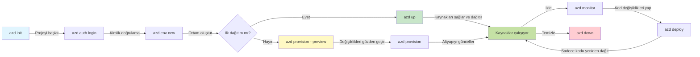
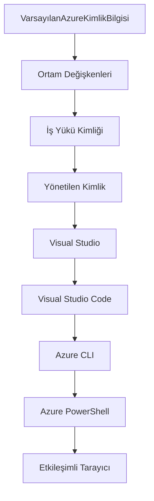

# AZD Temelleri - Azure Developer CLI'yi Anlamak

# AZD Temelleri - Temel Kavramlar ve Temeller

**Bölüm Navigasyonu:**
- **📚 Kurs Ana Sayfası**: [AZD Yeni Başlayanlar İçin](../../README.md)
- **📖 Mevcut Bölüm**: Bölüm 1 - Temel Bilgiler ve Hızlı Başlangıç
- **⬅️ Önceki**: [Kurs Genel Bakış](../../README.md#-chapter-1-foundation--quick-start)
- **➡️ Sonraki**: [Kurulum ve Ayarlar](installation.md)
- **🚀 Sonraki Bölüm**: [Bölüm 2: AI-Öncelikli Geliştirme](../microsoft-foundry/microsoft-foundry-integration.md)

## Giriş

Bu ders, Azure Developer CLI'yi (azd) tanıtır. Bu güçlü komut satırı aracı, yerel geliştirmeden Azure'a dağıtıma kadar olan yolculuğunuzu hızlandırır. Temel kavramları, ana özellikleri öğrenecek ve azd'nin bulut tabanlı uygulama dağıtımını nasıl kolaylaştırdığını anlayacaksınız.

## Öğrenme Hedefleri

Bu dersi tamamladığınızda:
- Azure Developer CLI'nin ne olduğunu ve ana amacını anlayacaksınız
- Şablonlar, ortamlar ve hizmetler gibi temel kavramları öğreneceksiniz
- Şablon tabanlı geliştirme ve Kod Olarak Altyapı gibi anahtar özellikleri keşfedeceksiniz
- azd proje yapısını ve iş akışını anlayacaksınız
- azd'yi geliştirme ortamınıza kurmaya ve yapılandırmaya hazır olacaksınız

## Öğrenme Çıktıları

Bu dersi tamamladıktan sonra:
- azd'nin modern bulut geliştirme iş akışlarındaki rolünü açıklayabileceksiniz
- bir azd proje yapısının bileşenlerini tanımlayabileceksiniz
- şablonların, ortamların ve hizmetlerin nasıl birlikte çalıştığını açıklayabileceksiniz
- azd ile Kod Olarak Altyapı'nın faydalarını anlayabileceksiniz
- farklı azd komutlarını ve amaçlarını tanıyabileceksiniz

## Azure Developer CLI (azd) Nedir?

Azure Developer CLI (azd), yerel geliştirmeden Azure'a dağıtıma kadar olan süreci hızlandırmak için tasarlanmış bir komut satırı aracıdır. Azure üzerinde bulut tabanlı uygulamalar oluşturma, dağıtma ve yönetme sürecini basitleştirir.

### 🎯 Neden AZD Kullanmalı? Gerçek Hayattan Bir Karşılaştırma

Basit bir veritabanına sahip web uygulamasını dağıtmayı karşılaştıralım:

#### ❌ AZD OLMADAN: Manuel Azure Dağıtımı (30+ dakika)

```bash
# Adım 1: Kaynak grubu oluştur
az group create --name myapp-rg --location eastus

# Adım 2: Uygulama Hizmet Planı oluştur
az appservice plan create --name myapp-plan \
  --resource-group myapp-rg \
  --sku B1 --is-linux

# Adım 3: Web Uygulaması oluştur
az webapp create --name myapp-web-unique123 \
  --resource-group myapp-rg \
  --plan myapp-plan \
  --runtime "NODE:18-lts"

# Adım 4: Cosmos DB hesabı oluştur (10-15 dakika)
az cosmosdb create --name myapp-cosmos-unique123 \
  --resource-group myapp-rg \
  --kind MongoDB

# Adım 5: Veritabanı oluştur
az cosmosdb mongodb database create \
  --account-name myapp-cosmos-unique123 \
  --resource-group myapp-rg \
  --name tododb

# Adım 6: Koleksiyon oluştur
az cosmosdb mongodb collection create \
  --account-name myapp-cosmos-unique123 \
  --resource-group myapp-rg \
  --database-name tododb \
  --name todos

# Adım 7: Bağlantı dizesini al
CONN_STR=$(az cosmosdb keys list \
  --name myapp-cosmos-unique123 \
  --resource-group myapp-rg \
  --type connection-strings \
  --query "connectionStrings[0].connectionString" -o tsv)

# Adım 8: Uygulama ayarlarını yapılandır
az webapp config appsettings set \
  --name myapp-web-unique123 \
  --resource-group myapp-rg \
  --settings MONGODB_URI="$CONN_STR"

# Adım 9: Günlük kaydını etkinleştir
az webapp log config --name myapp-web-unique123 \
  --resource-group myapp-rg \
  --application-logging filesystem \
  --detailed-error-messages true

# Adım 10: Application Insights'i ayarla
az monitor app-insights component create \
  --app myapp-insights \
  --location eastus \
  --resource-group myapp-rg

# Adım 11: App Insights'i Web Uygulamasına bağla
INSTRUMENTATION_KEY=$(az monitor app-insights component show \
  --app myapp-insights \
  --resource-group myapp-rg \
  --query "instrumentationKey" -o tsv)

az webapp config appsettings set \
  --name myapp-web-unique123 \
  --resource-group myapp-rg \
  --settings APPINSIGHTS_INSTRUMENTATIONKEY="$INSTRUMENTATION_KEY"

# Adım 12: Uygulamayı yerel olarak oluştur
npm install
npm run build

# Adım 13: Dağıtım paketi oluştur
zip -r app.zip . -x "*.git*" "node_modules/*"

# Adım 14: Uygulamayı dağıt
az webapp deployment source config-zip \
  --resource-group myapp-rg \
  --name myapp-web-unique123 \
  --src app.zip

# Adım 15: Bekle ve çalışmasını um 🙏
# (Otomatik doğrulama yok, manuel test gerekli)
```

**Sorunlar:**
- ❌ 15'ten fazla komut hatırlanmalı ve sırayla çalıştırılmalı
- ❌ 30-45 dakika manuel iş
- ❌ Hatalar yapmak kolay (yazım hataları, yanlış parametreler)
- ❌ Bağlantı dizgileri terminal geçmişinde açıkta kalır
- ❌ Bir şeyler ters giderse otomatik geri alma yok
- ❌ Ekip üyeleri için tekrarlanması zor
- ❌ Her seferinde farklı (tekrarlanabilir değil)

#### ✅ AZD İLE: Otomatik Dağıtım (5 komut, 10-15 dakika)

```bash
# Adım 1: Şablondan başlat
azd init --template todo-nodejs-mongo

# Adım 2: Kimlik doğrulama
azd auth login

# Adım 3: Ortam oluştur
azd env new dev

# Adım 4: Değişiklikleri önizle (isteğe bağlı ancak önerilir)
azd provision --preview

# Adım 5: Her şeyi dağıt
azd up

# ✨ Tamam! Her şey dağıtıldı, yapılandırıldı ve izleniyor
```

**Faydalar:**
- ✅ **5 komut** vs. 15+ manuel adım
- ✅ **10-15 dakika** toplam süre (çoğunlukla Azure'u beklemek)
- ✅ **Sıfır hata** - otomatik ve test edilmiş
- ✅ **Gizli bilgiler güvenli bir şekilde yönetilir** Key Vault ile
- ✅ **Otomatik geri alma** hatalarda
- ✅ **Tamamen tekrarlanabilir** - her seferinde aynı sonuç
- ✅ **Ekip için hazır** - herkes aynı komutlarla dağıtım yapabilir
- ✅ **Kod Olarak Altyapı** - sürüm kontrollü Bicep şablonları
- ✅ **Dahili izleme** - Application Insights otomatik olarak yapılandırılır

### 📊 Zaman ve Hata Azaltma

| Metrik | Manuel Dağıtım | AZD Dağıtımı | İyileştirme |
|:-------|:---------------|:-------------|:------------|
| **Komutlar** | 15+ | 5 | %67 daha az |
| **Zaman** | 30-45 dk | 10-15 dk | %60 daha hızlı |
| **Hata Oranı** | ~%40 | <%5 | %88 azalma |
| **Tutarlılık** | Düşük (manuel) | %100 (otomatik) | Mükemmel |
| **Ekip Onboarding** | 2-4 saat | 30 dakika | %75 daha hızlı |
| **Geri Alma Süresi** | 30+ dk (manuel) | 2 dk (otomatik) | %93 daha hızlı |

## Temel Kavramlar

### Şablonlar
Şablonlar, azd'nin temelini oluşturur. Şunları içerir:
- **Uygulama kodu** - Kaynak kodunuz ve bağımlılıklarınız
- **Altyapı tanımları** - Bicep veya Terraform'da tanımlanmış Azure kaynakları
- **Yapılandırma dosyaları** - Ayarlar ve ortam değişkenleri
- **Dağıtım betikleri** - Otomatik dağıtım iş akışları

### Ortamlar
Ortamlar, farklı dağıtım hedeflerini temsil eder:
- **Geliştirme** - Test ve geliştirme için
- **Staging** - Üretim öncesi ortam
- **Üretim** - Canlı üretim ortamı

Her ortam kendi:
- Azure kaynak grubunu
- Yapılandırma ayarlarını
- Dağıtım durumunu korur

### Hizmetler
Hizmetler, uygulamanızın yapı taşlarıdır:
- **Frontend** - Web uygulamaları, SPAlar
- **Backend** - API'ler, mikro hizmetler
- **Veritabanı** - Veri depolama çözümleri
- **Depolama** - Dosya ve blob depolama

## Anahtar Özellikler

### 1. Şablon Tabanlı Geliştirme
```bash
# Mevcut şablonlara göz atın
azd template list

# Bir şablondan başlatın
azd init --template <template-name>
```

### 2. Kod Olarak Altyapı
- **Bicep** - Azure'un alanına özgü dili
- **Terraform** - Çoklu bulut altyapı aracı
- **ARM Şablonları** - Azure Resource Manager şablonları

### 3. Entegre İş Akışları
```bash
# Tam dağıtım iş akışı
azd up            # Sağlama + Dağıtım bu, ilk kurulum için müdahalesizdir

# 🧪 YENİ: Dağıtımdan önce altyapı değişikliklerini önizleyin (GÜVENLİ)
azd provision --preview    # Altyapı dağıtımını değişiklik yapmadan simüle edin

azd provision     # Altyapıyı güncellerseniz Azure kaynakları oluşturun
azd deploy        # Uygulama kodunu dağıtın veya güncellemeden sonra uygulama kodunu yeniden dağıtın
azd down          # Kaynakları temizle
```

#### 🛡️ Önizleme ile Güvenli Altyapı Planlama
`azd provision --preview` komutu, güvenli dağıtımlar için bir oyun değiştiricidir:
- **Kuru çalıştırma analizi** - Nelerin oluşturulacağını, değiştirileceğini veya silineceğini gösterir
- **Sıfır risk** - Azure ortamınızda gerçek değişiklikler yapılmaz
- **Ekip işbirliği** - Dağıtımdan önce önizleme sonuçlarını paylaşın
- **Maliyet tahmini** - Kaynak maliyetlerini taahhüt etmeden önce anlayın

```bash
# Örnek önizleme iş akışı
azd provision --preview           # Nelerin değişeceğini görün
# Çıktıyı gözden geçirin, ekibinizle tartışın
azd provision                     # Değişiklikleri güvenle uygulayın
```

### 📊 Görsel: AZD Geliştirme İş Akışı


**İş Akışı Açıklaması:**
1. **Init** - Şablon veya yeni proje ile başlayın
2. **Auth** - Azure ile kimlik doğrulama
3. **Ortam** - İzole edilmiş dağıtım ortamı oluşturun
4. **Preview** - 🆕 Her zaman altyapı değişikliklerini önizleyin (güvenli uygulama)
5. **Provision** - Azure kaynaklarını oluşturun/güncelleyin
6. **Deploy** - Uygulama kodunuzu gönderin
7. **Monitor** - Uygulama performansını izleyin
8. **Iterate** - Değişiklik yapın ve kodu yeniden dağıtın
9. **Cleanup** - İşiniz bittiğinde kaynakları kaldırın

### 4. Ortam Yönetimi
```bash
# Ortamlar oluştur ve yönet
azd env new <environment-name>
azd env select <environment-name>
azd env list
```

## 📁 Proje Yapısı

Tipik bir azd proje yapısı:
```
my-app/
├── .azd/                    # azd configuration
│   └── config.json
├── .azure/                  # Azure deployment artifacts
├── .devcontainer/          # Development container config
├── .github/workflows/      # GitHub Actions
├── .vscode/               # VS Code settings
├── infra/                 # Infrastructure code
│   ├── main.bicep        # Main infrastructure template
│   ├── main.parameters.json
│   └── modules/          # Reusable modules
├── src/                  # Application source code
│   ├── api/             # Backend services
│   └── web/             # Frontend application
├── azure.yaml           # azd project configuration
└── README.md
```

## 🔧 Yapılandırma Dosyaları

### azure.yaml
Ana proje yapılandırma dosyası:
```yaml
name: my-awesome-app
metadata:
  template: my-template@1.0.0

services:
  web:
    project: ./src/web
    language: js
    host: appservice
  api:
    project: ./src/api
    language: js
    host: appservice

hooks:
  preprovision:
    shell: pwsh
    run: echo "Preparing to provision..."
```

### .azure/config.json
Ortam özelinde yapılandırma:
```json
{
  "version": 1,
  "defaultEnvironment": "dev",
  "environments": {
    "dev": {
      "subscriptionId": "your-subscription-id",
      "location": "eastus"
    }
  }
}
```

## 🎪 Yaygın İş Akışları ve Uygulamalı Alıştırmalar

> **💡 Öğrenme İpucu:** Bu alıştırmaları sırayla takip ederek AZD becerilerinizi kademeli olarak geliştirin.

### 🎯 Alıştırma 1: İlk Projenizi Başlatın

**Hedef:** Bir AZD projesi oluşturun ve yapısını keşfedin

**Adımlar:**
```bash
# Kanıtlanmış bir şablon kullanın
azd init --template todo-nodejs-mongo

# Oluşturulan dosyaları keşfedin
ls -la  # Gizli olanlar dahil tüm dosyaları görüntüleyin

# Oluşturulan anahtar dosyalar:
# - azure.yaml (ana yapılandırma)
# - infra/ (altyapı kodu)
# - src/ (uygulama kodu)
```

**✅ Başarı:** azure.yaml, infra/ ve src/ dizinlerine sahip olacaksınız

---

### 🎯 Alıştırma 2: Azure'a Dağıtım Yapın

**Hedef:** Baştan sona bir dağıtımı tamamlayın

**Adımlar:**
```bash
# 1. Kimlik doğrulama
az login && azd auth login

# 2. Ortam oluştur
azd env new dev
azd env set AZURE_LOCATION eastus

# 3. Değişiklikleri önizle (TAVSİYE EDİLİR)
azd provision --preview

# 4. Her şeyi dağıt
azd up

# 5. Dağıtımı doğrula
azd show    # Uygulama URL'nizi görüntüleyin
```

**Tahmini Süre:** 10-15 dakika  
**✅ Başarı:** Uygulama URL'si tarayıcıda açılır

---

### 🎯 Alıştırma 3: Birden Fazla Ortam

**Hedef:** Geliştirme ve staging ortamlarına dağıtım yapın

**Adımlar:**
```bash
# Zaten geliştirici var, aşamayı oluştur
azd env new staging
azd env set AZURE_LOCATION westus2
azd up

# Aralarında geçiş yap
azd env list
azd env select dev
```

**✅ Başarı:** Azure Portal'da iki ayrı kaynak grubu

---

### 🛡️ Temiz Başlangıç: `azd down --force --purge`

Tamamen sıfırlamanız gerektiğinde:

```bash
azd down --force --purge
```

**Ne yapar:**
- `--force`: Onay istemlerini atlar
- `--purge`: Tüm yerel durumu ve Azure kaynaklarını siler

**Ne zaman kullanılır:**
- Dağıtım yarıda kaldığında
- Projeleri değiştirirken
- Yeni bir başlangıç gerektiğinde

---

## 🎪 Orijinal İş Akışı Referansı

### Yeni Bir Projeye Başlama
```bash
# Yöntem 1: Mevcut şablonu kullan
azd init --template todo-nodejs-mongo

# Yöntem 2: Sıfırdan başla
azd init

# Yöntem 3: Mevcut dizini kullan
azd init .
```

### Geliştirme Döngüsü
```bash
# Geliştirme ortamını kur
azd auth login
azd env new dev
azd env select dev

# Her şeyi dağıt
azd up

# Değişiklik yap ve yeniden dağıt
azd deploy

# İşiniz bittiğinde temizleyin
azd down --force --purge # Azure Developer CLI'deki komut, ortamınız için bir **sert sıfırlama**dır—özellikle başarısız dağıtımları giderirken, yetim kaynakları temizlerken veya yeni bir yeniden dağıtım için hazırlık yaparken kullanışlıdır.
```

## `azd down --force --purge` Komutunu Anlamak
`azd down --force --purge` komutu, azd ortamınızı ve ilişkili tüm kaynakları tamamen kaldırmanın güçlü bir yoludur. İşte her bayrağın ne yaptığına dair bir açıklama:
```
--force
```
- Onay istemlerini atlar.
- Manuel girişin mümkün olmadığı otomasyon veya betiklerde kullanışlıdır.
- CLI tutarsızlıklar tespit etse bile kaldırma işleminin kesintisiz devam etmesini sağlar.

```
--purge
```
**Tüm ilişkili meta verileri** siler, şunlar dahil:
Ortam durumu
Yerel `.azure` klasörü
Önbelleğe alınmış dağıtım bilgileri
azd'nin önceki dağıtımları "hatırlamasını" engeller, bu da kaynak grupları veya eski kayıt referansları gibi sorunlara neden olabilir.

### Neden her ikisini kullanmalı?
`azd up` ile kalıntı durum veya kısmi dağıtımlar nedeniyle bir duvara çarptığınızda, bu kombinasyon **temiz bir başlangıç** sağlar.

Özellikle Azure portalında manuel kaynak silme işlemlerinden sonra veya şablonları, ortamları ya da kaynak grubu adlandırma kurallarını değiştirirken faydalıdır.

### Birden Fazla Ortamı Yönetme
```bash
# Staging ortamı oluştur
azd env new staging
azd env select staging
azd up

# Geliştirmeye geri dön
azd env select dev

# Ortamları karşılaştır
azd env list
```

## 🔐 Kimlik Doğrulama ve Kimlik Bilgileri

Kimlik doğrulamayı anlamak, başarılı azd dağıtımları için çok önemlidir. Azure, birden fazla kimlik doğrulama yöntemi kullanır ve azd, diğer Azure araçları tarafından kullanılan aynı kimlik bilgisi zincirini kullanır.

### Azure CLI Kimlik Doğrulama (`az login`)

azd'yi kullanmadan önce Azure ile kimlik doğrulaması yapmanız gerekir. En yaygın yöntem Azure CLI kullanmaktır:

```bash
# Etkileşimli giriş (tarayıcı açılır)
az login

# Belirli bir kiracı ile giriş yap
az login --tenant <tenant-id>

# Hizmet sorumlusu ile giriş yap
az login --service-principal -u <app-id> -p <password> --tenant <tenant-id>

# Mevcut giriş durumunu kontrol et
az account show

# Mevcut abonelikleri listele
az account list --output table

# Varsayılan aboneliği ayarla
az account set --subscription <subscription-id>
```

### Kimlik Doğrulama Akışı
1. **Etkileşimli Giriş**: Kimlik doğrulama için varsayılan tarayıcınızı açar
2. **Cihaz Kodu Akışı**: Tarayıcı erişimi olmayan ortamlar için
3. **Hizmet Prensibi**: Otomasyon ve CI/CD senaryoları için
4. **Yönetilen Kimlik**: Azure barındırılan uygulamalar için

### DefaultAzureCredential Zinciri

`DefaultAzureCredential`, belirli bir sırayla birden fazla kimlik bilgisi kaynağını otomatik olarak deneyerek basitleştirilmiş bir kimlik doğrulama deneyimi sağlayan bir kimlik bilgisi türüdür:

#### Kimlik Bilgisi Zinciri Sırası

#### 1. Ortam Değişkenleri
```bash
# Hizmet sorumlusu için ortam değişkenlerini ayarla
export AZURE_CLIENT_ID="<app-id>"
export AZURE_CLIENT_SECRET="<password>"
export AZURE_TENANT_ID="<tenant-id>"
```

#### 2. İş Yükü Kimliği (Kubernetes/GitHub Actions)
Otomatik olarak kullanılır:
- Azure Kubernetes Service (AKS) ile İş Yükü Kimliği
- GitHub Actions ile OIDC federasyonu
- Diğer federasyon kimlik senaryoları

#### 3. Yönetilen Kimlik
Azure kaynakları için:
- Sanal Makineler
- Uygulama Hizmeti
- Azure İşlevleri
- Konteyner Örnekleri

```bash
# Azure kaynağında yönetilen kimlik ile çalışıp çalışmadığını kontrol et
az account show --query "user.type" --output tsv
# Döner: "servicePrincipal" eğer yönetilen kimlik kullanılıyorsa
```

#### 4. Geliştirici Araçları Entegrasyonu
- **Visual Studio**: Oturum açmış hesabı otomatik olarak kullanır
- **VS Code**: Azure Hesap uzantısı kimlik bilgilerini kullanır
- **Azure CLI**: `az login` kimlik bilgilerini kullanır (yerel geliştirme için en yaygın)

### AZD Kimlik Doğrulama Ayarları

```bash
# Yöntem 1: Azure CLI kullanın (Geliştirme için önerilir)
az login
azd auth login  # Mevcut Azure CLI kimlik bilgilerini kullanır

# Yöntem 2: Doğrudan azd kimlik doğrulama
azd auth login --use-device-code  # Başsız ortamlar için

# Yöntem 3: Kimlik doğrulama durumunu kontrol et
azd auth login --check-status

# Yöntem 4: Çıkış yap ve yeniden kimlik doğrula
azd auth logout
azd auth login
```

### Kimlik Doğrulama En İyi Uygulamaları

#### Yerel Geliştirme İçin
```bash
# 1. Azure CLI ile giriş yapın
az login

# 2. Doğru aboneliği doğrulayın
az account show
az account set --subscription "Your Subscription Name"

# 3. Mevcut kimlik bilgileriyle azd kullanın
azd auth login
```

#### CI/CD Boru Hatları İçin
```yaml
# GitHub Actions example
- name: Azure Login
  uses: azure/login@v1
  with:
    creds: ${{ secrets.AZURE_CREDENTIALS }}

- name: Deploy with azd
  run: |
    azd auth login --client-id ${{ secrets.AZURE_CLIENT_ID }} \
                    --client-secret ${{ secrets.AZURE_CLIENT_SECRET }} \
                    --tenant-id ${{ secrets.AZURE_TENANT_ID }}
    azd up --no-prompt
```

#### Üretim Ortamları İçin
- Azure kaynaklarında çalışırken **Yönetilen Kimlik** kullanın
- Otomasyon senaryoları için **Hizmet Prensibi** kullanın
- Kimlik bilgilerini kodda veya yapılandırma dosyalarında saklamaktan kaçının
- Hassas yapılandırma için **Azure Key Vault** kullanın

### Yaygın Kimlik Doğrulama Sorunları ve Çözümleri

#### Sorun: "Abonelik bulunamadı"
```bash
# Çözüm: Varsayılan aboneliği ayarla
az account list --output table
az account set --subscription "<subscription-id>"
azd env set AZURE_SUBSCRIPTION_ID "<subscription-id>"
```

#### Sorun: "Yetersiz izinler"
```bash
# Çözüm: Gerekli rolleri kontrol et ve ata
az role assignment list --assignee $(az account show --query user.name --output tsv)

# Ortak gerekli roller:
# - Katkıda Bulunan (kaynak yönetimi için)
# - Kullanıcı Erişim Yöneticisi (rol atamaları için)
```

#### Sorun: "Token süresi doldu"
```bash
# Çözüm: Yeniden kimlik doğrulama
az logout
az login
azd auth logout
azd auth login
```

### Farklı Senaryolarda Kimlik Doğrulama

#### Yerel Geliştirme
```bash
# Kişisel gelişim hesabı
az login
azd auth login
```

#### Ekip Geliştirme
```bash
# Organizasyon için belirli kiracı kullanın
az login --tenant contoso.onmicrosoft.com
azd auth login
```

#### Çok Kiracılı Senaryolar
```bash
# Kiracılar arasında geçiş yap
az login --tenant tenant1.onmicrosoft.com
# Kiracı 1'e dağıt
azd up

az login --tenant tenant2.onmicrosoft.com  
# Kiracı 2'ye dağıt
azd up
```

### Güvenlik Hususları

1. **Kimlik Bilgisi Depolama**: Kimlik bilgilerini asla kaynak kodda saklamayın
2. **Kapsam Sınırlaması**: Hizmet prensipleri için en az ayrıcalık ilkesini kullanın
3. **Token Döndürme**: Hizmet prensibi sırlarını düzenli olarak döndürün
4. **Denetim Kaydı**: Kimlik doğrulama ve dağıtım etkinliklerini izleyin
5. **Ağ Güvenliği**: Mümkünse özel uç noktalar kullanın

### Kimlik Doğrulama Sorunlarını Giderme

```bash
# Kimlik doğrulama sorunlarını ayıkla
azd auth login --check-status
az account show
az account get-access-token

# Yaygın tanılama komutları
whoami                          # Mevcut kullanıcı bağlamı
az ad signed-in-user show      # Azure AD kullanıcı ayrıntıları
az group list                  # Kaynak erişimini test et
```

## `azd down --force --purge` Komutunu Anlamak

### Keşif
```bash
azd template list              # Şablonlara göz atın
azd template show <template>   # Şablon ayrıntıları
azd init --help               # Başlatma seçenekleri
```

### Proje Yönetimi
```bash
azd show                     # Proje genel bakışı
azd env show                 # Mevcut ortam
azd config list             # Yapılandırma ayarları
```

### İzleme
```bash
azd monitor                  # Azure portalunu açın
azd pipeline config          # CI/CD'yi ayarlayın
azd logs                     # Uygulama günlüklerini görüntüleyin
```

## En İyi Uygulamalar

### 1. Anlamlı İsimler Kullanın
```bash
# İyi
azd env new production-east
azd init --template web-app-secure

# Kaçın
azd env new env1
azd init --template template1
```

### 2. Şablonlardan Yararlanın
- Mevcut şablonlarla başlayın
- İhtiyaçlarınıza göre özelleştirin
- Kuruluşunuz için yeniden kullanılabilir şablonlar oluşturun

### 3. Ortam İzolasyonu
- Geliştirme/staging/üretim için ayrı ortamlar kullanın
- Yerel makineden doğrudan üretime dağıtım yapmayın
- Üretim dağıtımları için CI/CD boru hatlarını kullanın

### 4. Yapılandırma Yönetimi
- Hassas veriler için ortam değişkenlerini kullanın
- Yapılandırmayı sürüm kontrolünde tutun
- Ortama özel ayarları belgeleyin

## Öğrenme İlerlemesi

### Başlangıç Seviyesi (1-2 Hafta)
1. azd'yi kurun ve kimlik doğrulaması yapın
2. Basit bir şablon dağıtın
3. Proje yapısını anlayın
4. Temel komutları öğrenin (up, down, deploy)

### Orta Seviye (3-4 Hafta)
1. Şablonları özelleştirin
2. Birden fazla ortam yönetin
3. Altyapı kodunu anlayın
4. CI/CD boru hatları kurun

### İleri Seviye (5+ Hafta)
1. Özel şablonlar oluşturun
2. Gelişmiş altyapı desenleri
3. Çok bölgeli dağıtımlar
4. Kurumsal
- [Kurulum ve Ayar](installation.md) - Azd'yi yükleyin ve yapılandırın
- [İlk Projeniz](first-project.md) - Uygulamalı bir eğitim tamamlayın
- [Yapılandırma Kılavuzu](configuration.md) - Gelişmiş yapılandırma seçenekleri

**🎯 Bir Sonraki Bölüme Hazır mısınız?**
- [Bölüm 2: AI-Öncelikli Geliştirme](../microsoft-foundry/microsoft-foundry-integration.md) - AI uygulamaları oluşturmaya başlayın

## Ek Kaynaklar

- [Azure Developer CLI Genel Bakış](https://learn.microsoft.com/en-us/azure/developer/azure-developer-cli/)
- [Şablon Galerisi](https://azure.github.io/awesome-azd/)
- [Topluluk Örnekleri](https://github.com/Azure-Samples)

---

## 🙋 Sıkça Sorulan Sorular

### Genel Sorular

**S: AZD ile Azure CLI arasındaki fark nedir?**

C: Azure CLI (`az`), bireysel Azure kaynaklarını yönetmek için kullanılır. AZD (`azd`) ise tüm uygulamaları yönetmek için kullanılır:

```bash
# Azure CLI - Düşük seviyeli kaynak yönetimi
az webapp create --name myapp --resource-group rg
az sql server create --name myserver --resource-group rg
# ...daha fazla komut gerekli

# AZD - Uygulama seviyesinde yönetim
azd up  # Tüm kaynaklarla birlikte tüm uygulamayı dağıtır
```

**Şöyle düşünün:**
- `az` = Tek tek Lego parçalarıyla çalışmak
- `azd` = Tam Lego setleriyle çalışmak

---

**S: AZD kullanmak için Bicep veya Terraform bilmem gerekiyor mu?**

C: Hayır! Şablonlarla başlayabilirsiniz:
```bash
# Mevcut şablonu kullan - IaC bilgisi gerekmez
azd init --template todo-nodejs-mongo
azd up
```

Altyapıyı özelleştirmek için daha sonra Bicep öğrenebilirsiniz. Şablonlar öğrenmek için çalışan örnekler sağlar.

---

**S: AZD şablonlarını çalıştırmanın maliyeti nedir?**

C: Maliyetler şablona göre değişir. Çoğu geliştirme şablonu aylık 50-150 $ arasında maliyetlidir:

```bash
# Dağıtmadan önce maliyetleri önizleyin
azd provision --preview

# Kullanılmadığında her zaman temizleyin
azd down --force --purge  # Tüm kaynakları kaldırır
```

**İpucu:** Ücretsiz katmanları kullanın:
- App Service: F1 (Ücretsiz) katmanı
- Azure OpenAI: Aylık 50.000 token ücretsiz
- Cosmos DB: 1000 RU/s ücretsiz katman

---

**S: AZD'yi mevcut Azure kaynaklarıyla kullanabilir miyim?**

C: Evet, ancak sıfırdan başlamak daha kolaydır. AZD, tüm yaşam döngüsünü yönettiğinde en iyi şekilde çalışır. Mevcut kaynaklar için:

```bash
# Seçenek 1: Mevcut kaynakları içe aktar (ileri düzey)
azd init
# Daha sonra mevcut kaynaklara referans vermek için infra/ dosyasını değiştir

# Seçenek 2: Sıfırdan başla (önerilen)
azd init --template matching-your-stack
azd up  # Yeni bir ortam oluşturur
```

---

**S: Projeyi ekip arkadaşlarımla nasıl paylaşabilirim?**

C: AZD projesini Git'e gönderin (ancak .azure klasörünü göndermeyin):

```bash
# Varsayılan olarak zaten .gitignore içinde
.azure/        # Sırlar ve ortam verilerini içerir
*.env          # Ortam değişkenleri

# Takım üyeleri o zaman:
git clone <your-repo>
azd auth login
azd env new <their-name>-dev
azd up
```

Herkes aynı şablonlardan aynı altyapıyı alır.

---

### Sorun Giderme Soruları

**S: "azd up" yarıda başarısız oldu. Ne yapmalıyım?**

C: Hata mesajını kontrol edin, düzeltin ve tekrar deneyin:

```bash
# Ayrıntılı günlükleri görüntüle
azd show

# Yaygın düzeltmeler:

# 1. Kota aşıldıysa:
azd env set AZURE_LOCATION "westus2"  # Farklı bir bölge deneyin

# 2. Kaynak adı çakışıyorsa:
azd down --force --purge  # Temiz bir başlangıç yapın
azd up  # Tekrar deneyin

# 3. Yetkilendirme süresi dolduysa:
az login
azd auth login
azd up
```

**En yaygın sorun:** Yanlış Azure aboneliği seçilmiş
```bash
az account list --output table
az account set --subscription "<correct-subscription>"
```

---

**S: Sadece kod değişikliklerini altyapıyı yeniden oluşturmadan nasıl dağıtabilirim?**

C: `azd up` yerine `azd deploy` kullanın:

```bash
azd up          # İlk kez: sağlama + dağıtım (yavaş)

# Kod değişiklikleri yapın...

azd deploy      # Sonraki zamanlar: sadece dağıtım (hızlı)
```

Hız karşılaştırması:
- `azd up`: 10-15 dakika (altyapıyı oluşturur)
- `azd deploy`: 2-5 dakika (sadece kod)

---

**S: Altyapı şablonlarını özelleştirebilir miyim?**

C: Evet! `infra/` içindeki Bicep dosyalarını düzenleyin:

```bash
# Azd başlatıldıktan sonra
cd infra/
code main.bicep  # VS Code'da düzenle

# Değişiklikleri önizle
azd provision --preview

# Değişiklikleri uygula
azd provision
```

**İpucu:** Küçük değişikliklerle başlayın - önce SKU'ları değiştirin:
```bicep
// infra/main.bicep
sku: {
  name: 'B1'  // Change to 'P1V2' for production
}
```

---

**S: AZD'nin oluşturduğu her şeyi nasıl silebilirim?**

C: Tek bir komut tüm kaynakları kaldırır:

```bash
azd down --force --purge

# Bu siler:
# - Tüm Azure kaynaklarını
# - Kaynak grubunu
# - Yerel ortam durumunu
# - Önbelleğe alınmış dağıtım verilerini
```

**Bu durumlarda her zaman çalıştırın:**
- Bir şablonun testini bitirdiğinizde
- Farklı bir projeye geçtiğinizde
- Sıfırdan başlamak istediğinizde

**Maliyet tasarrufu:** Kullanılmayan kaynakları silmek = $0 ücret

---

**S: Azure Portal'da kaynakları yanlışlıkla sildim. Ne yapmalıyım?**

C: AZD durumu senkron dışı kalabilir. Temiz bir başlangıç yaklaşımı:

```bash
# 1. Yerel durumu kaldır
azd down --force --purge

# 2. Yeniden başla
azd up

# Alternatif: AZD'nin algılamasına ve düzeltmesine izin ver
azd provision  # Eksik kaynakları oluşturacak
```

---

### İleri Düzey Sorular

**S: AZD'yi CI/CD boru hatlarında kullanabilir miyim?**

C: Evet! GitHub Actions örneği:

```yaml
# .github/workflows/deploy.yml
name: Deploy with AZD

on:
  push:
    branches: [main]

jobs:
  deploy:
    runs-on: ubuntu-latest
    steps:
      - uses: actions/checkout@v2
      
      - name: Install azd
        run: curl -fsSL https://aka.ms/install-azd.sh | bash
      
      - name: Azure Login
        run: |
          azd auth login \
            --client-id ${{ secrets.AZURE_CLIENT_ID }} \
            --client-secret ${{ secrets.AZURE_CLIENT_SECRET }} \
            --tenant-id ${{ secrets.AZURE_TENANT_ID }}
      
      - name: Deploy
        run: azd up --no-prompt
```

---

**S: Gizli bilgiler ve hassas verilerle nasıl başa çıkabilirim?**

C: AZD, Azure Key Vault ile otomatik olarak entegre olur:

```bash
# Sırlar kodda değil, Key Vault'ta saklanır
azd env set DATABASE_PASSWORD "$(openssl rand -base64 32)"

# AZD otomatik olarak:
# 1. Key Vault oluşturur
# 2. Sırları saklar
# 3. Uygulamaya Yönetilen Kimlik aracılığıyla erişim verir
# 4. Çalışma zamanında enjekte eder
```

**Asla göndermeyin:**
- `.azure/` klasörü (ortam verilerini içerir)
- `.env` dosyaları (yerel gizli bilgiler)
- Bağlantı dizeleri

---

**S: Birden fazla bölgeye dağıtım yapabilir miyim?**

C: Evet, bölge başına bir ortam oluşturun:

```bash
# Doğu ABD ortamı
azd env new prod-eastus
azd env set AZURE_LOCATION eastus
azd up

# Batı Avrupa ortamı
azd env new prod-westeurope
azd env set AZURE_LOCATION westeurope
azd up

# Her ortam bağımsızdır
azd env list
```

Gerçek çok bölgeli uygulamalar için, Bicep şablonlarını aynı anda birden fazla bölgeye dağıtacak şekilde özelleştirin.

---

**S: Takıldığımda nereden yardım alabilirim?**

1. **AZD Belgeleri:** https://learn.microsoft.com/azure/developer/azure-developer-cli/
2. **GitHub Sorunları:** https://github.com/Azure/azure-dev/issues
3. **Discord:** [Azure Discord](https://discord.gg/microsoft-azure) - #azure-developer-cli kanalı
4. **Stack Overflow:** `azure-developer-cli` etiketi
5. **Bu Kurs:** [Sorun Giderme Kılavuzu](../troubleshooting/common-issues.md)

**İpucu:** Sormadan önce şu komutu çalıştırın:
```bash
azd show       # Mevcut durumu gösterir
azd version    # Sizin versiyonunuzu gösterir
```
Sorunuzu daha hızlı yanıtlamak için bu bilgileri ekleyin.

---

## 🎓 Sırada Ne Var?

Artık AZD'nin temellerini anlıyorsunuz. Yolunuzu seçin:

### 🎯 Yeni Başlayanlar İçin:
1. **Sonraki:** [Kurulum ve Ayar](installation.md) - AZD'yi bilgisayarınıza yükleyin
2. **Sonra:** [İlk Projeniz](first-project.md) - İlk uygulamanızı dağıtın
3. **Pratik Yapın:** Bu dersteki tüm 3 alıştırmayı tamamlayın

### 🚀 AI Geliştiricileri İçin:
1. **Atlayın:** [Bölüm 2: AI-Öncelikli Geliştirme](../microsoft-foundry/microsoft-foundry-integration.md)
2. **Dağıtın:** `azd init --template get-started-with-ai-chat` ile başlayın
3. **Öğrenin:** Dağıtırken geliştirin

### 🏗️ Deneyimli Geliştiriciler İçin:
1. **Gözden Geçirin:** [Yapılandırma Kılavuzu](configuration.md) - Gelişmiş ayarlar
2. **Keşfedin:** [Kod Olarak Altyapı](../deployment/provisioning.md) - Bicep derinlemesine inceleme
3. **Oluşturun:** Yığınınız için özel şablonlar oluşturun

---

**Bölüm Gezinme:**
- **📚 Kurs Ana Sayfası**: [AZD Yeni Başlayanlar İçin](../../README.md)
- **📖 Mevcut Bölüm**: Bölüm 1 - Temel Bilgiler ve Hızlı Başlangıç  
- **⬅️ Önceki**: [Kurs Genel Bakış](../../README.md#-chapter-1-foundation--quick-start)
- **➡️ Sonraki**: [Kurulum ve Ayar](installation.md)
- **🚀 Sonraki Bölüm**: [Bölüm 2: AI-Öncelikli Geliştirme](../microsoft-foundry/microsoft-foundry-integration.md)

---

<!-- CO-OP TRANSLATOR DISCLAIMER START -->
**Feragatname**:  
Bu belge, AI çeviri hizmeti [Co-op Translator](https://github.com/Azure/co-op-translator) kullanılarak çevrilmiştir. Doğruluk için çaba göstersek de, otomatik çeviriler hata veya yanlışlıklar içerebilir. Belgenin orijinal dili, yetkili kaynak olarak kabul edilmelidir. Kritik bilgiler için profesyonel insan çevirisi önerilir. Bu çevirinin kullanımından kaynaklanan yanlış anlamalar veya yanlış yorumlamalardan sorumlu değiliz.
<!-- CO-OP TRANSLATOR DISCLAIMER END -->