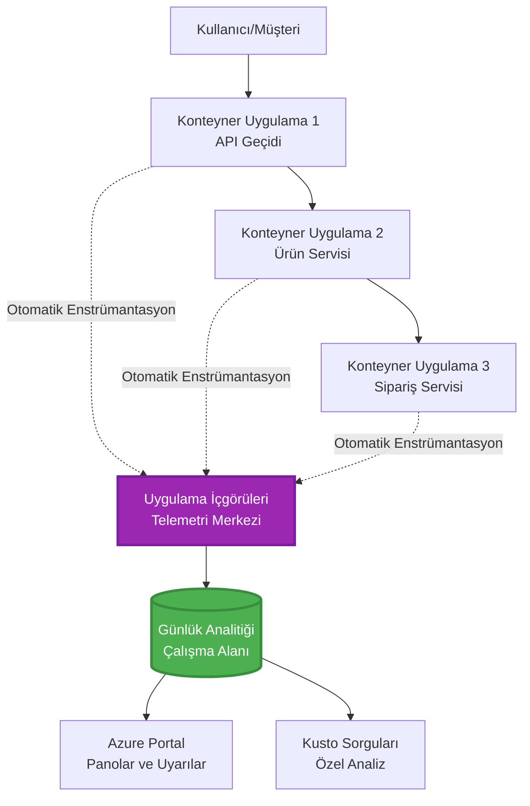
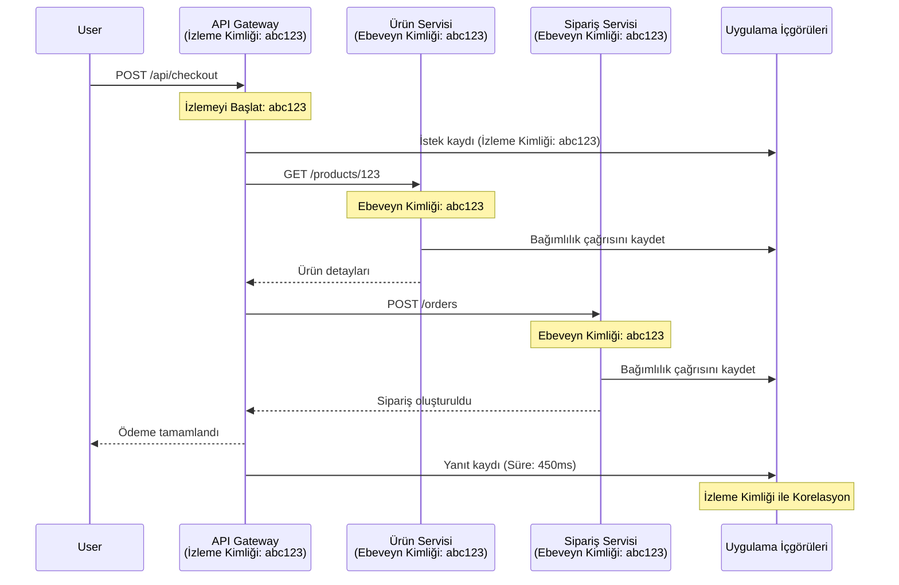

<!--
CO_OP_TRANSLATOR_METADATA:
{
  "original_hash": "e5aa37cdb6378c09099500ac31600b8c",
  "translation_date": "2025-11-21T00:16:36+00:00",
  "source_file": "docs/pre-deployment/application-insights.md",
  "language_code": "tr"
}
-->
# AZD ile Application Insights Entegrasyonu

⏱️ **Tahmini Süre**: 40-50 dakika | 💰 **Maliyet Etkisi**: ~5-15$/ay | ⭐ **Zorluk Seviyesi**: Orta

**📚 Öğrenme Yolu:**
- ← Önceki: [Preflight Checks](preflight-checks.md) - Dağıtım öncesi doğrulama
- 🎯 **Şu Anda Buradasınız**: Application Insights Entegrasyonu (İzleme, telemetri, hata ayıklama)
- → Sonraki: [Deployment Guide](../deployment/deployment-guide.md) - Azure'a dağıtım
- 🏠 [Kurs Ana Sayfası](../../README.md)

---

## Öğrenecekleriniz

Bu dersi tamamladığınızda:
- **Application Insights**'ı AZD projelerine otomatik olarak entegre edeceksiniz
- Mikro hizmetler için **dağıtılmış izleme** yapılandıracaksınız
- **Özel telemetri** (metrikler, olaylar, bağımlılıklar) uygulayacaksınız
- Gerçek zamanlı izleme için **canlı metrikler** ayarlayacaksınız
- AZD dağıtımlarından **uyarılar ve panolar** oluşturacaksınız
- **Telemetri sorguları** ile üretim sorunlarını çözeceksiniz
- **Maliyetleri ve örnekleme** stratejilerini optimize edeceksiniz
- **AI/LLM uygulamalarını** (tokenler, gecikme, maliyetler) izleyeceksiniz

## Neden AZD ile Application Insights Önemlidir?

### Zorluk: Üretim İzlenebilirliği

**Application Insights olmadan:**
```
❌ No visibility into production behavior
❌ Manual log aggregation across services
❌ Reactive debugging (wait for customer complaints)
❌ No performance metrics
❌ Cannot trace requests across services
❌ Unknown failure rates and bottlenecks
```

**Application Insights + AZD ile:**
```
✅ Automatic telemetry collection
✅ Centralized logs from all services
✅ Proactive issue detection
✅ End-to-end request tracing
✅ Performance metrics and insights
✅ Real-time dashboards
✅ AZD provisions everything automatically
```

**Benzerlik**: Application Insights, uygulamanız için bir "kara kutu" uçuş kaydedici + kokpit kontrol paneli gibidir. Gerçek zamanlı olarak neler olduğunu görebilir ve herhangi bir olayı yeniden oynatabilirsiniz.

---

## Mimari Genel Bakış

### AZD Mimarisinde Application Insights


### Otomatik Olarak İzlenenler

| Telemetri Türü | Yakalananlar | Kullanım Alanı |
|----------------|--------------|----------------|
| **İstekler** | HTTP istekleri, durum kodları, süre | API performans izleme |
| **Bağımlılıklar** | Harici çağrılar (DB, API'ler, depolama) | Darboğazları belirleme |
| **Hatalar** | Yakalnmayan hatalar ve yığın izleri | Hata ayıklama |
| **Özel Olaylar** | İş olayları (kayıt, satın alma) | Analitik ve dönüşüm |
| **Metrikler** | Performans sayaçları, özel metrikler | Kapasite planlama |
| **İzler** | Ciddiyetle birlikte günlük mesajları | Hata ayıklama ve denetim |
| **Erişilebilirlik** | Çalışma süresi ve yanıt süresi testleri | SLA izleme |

---

## Ön Koşullar

### Gerekli Araçlar

```bash
# Azure Developer CLI'yi doğrula
azd version
# ✅ Beklenen: azd sürüm 1.0.0 veya daha yüksek

# Azure CLI'yi doğrula
az --version
# ✅ Beklenen: azure-cli 2.50.0 veya daha yüksek
```

### Azure Gereksinimleri

- Aktif bir Azure aboneliği
- Şunları oluşturma izinleri:
  - Application Insights kaynakları
  - Log Analytics çalışma alanları
  - Container Apps
  - Kaynak grupları

### Bilgi Ön Koşulları

Tamamlamış olmalısınız:
- [AZD Basics](../getting-started/azd-basics.md) - Temel AZD kavramları
- [Configuration](../getting-started/configuration.md) - Ortam kurulumu
- [First Project](../getting-started/first-project.md) - Temel dağıtım

---

## Ders 1: AZD ile Otomatik Application Insights

### AZD'nin Application Insights'ı Sağlama Şekli

AZD, dağıtım yaptığınızda Application Insights'ı otomatik olarak oluşturur ve yapılandırır. Nasıl çalıştığını görelim.

### Proje Yapısı

```
monitored-app/
├── azure.yaml                     # AZD configuration
├── infra/
│   ├── main.bicep                # Main infrastructure
│   ├── core/
│   │   └── monitoring.bicep      # Application Insights + Log Analytics
│   └── app/
│       └── api.bicep             # Container App with monitoring
└── src/
    ├── app.py                    # Application with telemetry
    ├── requirements.txt
    └── Dockerfile
```

---

### Adım 1: AZD'yi Yapılandırma (azure.yaml)

**Dosya: `azure.yaml`**

```yaml
name: monitored-app
metadata:
  template: monitored-app@1.0.0

services:
  api:
    project: ./src
    language: python
    host: containerapp

# AZD automatically provisions monitoring!
```

**Hepsi bu kadar!** AZD, varsayılan olarak Application Insights oluşturacaktır. Temel izleme için ekstra yapılandırmaya gerek yok.

---

### Adım 2: İzleme Altyapısı (Bicep)

**Dosya: `infra/core/monitoring.bicep`**

```bicep
param logAnalyticsName string
param applicationInsightsName string
param location string = resourceGroup().location
param tags object = {}

// Log Analytics Workspace (required for Application Insights)
resource logAnalytics 'Microsoft.OperationalInsights/workspaces@2022-10-01' = {
  name: logAnalyticsName
  location: location
  tags: tags
  properties: {
    sku: {
      name: 'PerGB2018'  // Pay-as-you-go pricing
    }
    retentionInDays: 30  // Keep logs for 30 days
    features: {
      enableLogAccessUsingOnlyResourcePermissions: true
    }
  }
}

// Application Insights
resource applicationInsights 'Microsoft.Insights/components@2020-02-02' = {
  name: applicationInsightsName
  location: location
  tags: tags
  kind: 'web'
  properties: {
    Application_Type: 'web'
    WorkspaceResourceId: logAnalytics.id
    IngestionMode: 'LogAnalytics'
    publicNetworkAccessForIngestion: 'Enabled'
    publicNetworkAccessForQuery: 'Enabled'
  }
}

// Outputs for Container Apps
output logAnalyticsWorkspaceId string = logAnalytics.id
output logAnalyticsWorkspaceName string = logAnalytics.name
output applicationInsightsConnectionString string = applicationInsights.properties.ConnectionString
output applicationInsightsInstrumentationKey string = applicationInsights.properties.InstrumentationKey
output applicationInsightsName string = applicationInsights.name
```

---

### Adım 3: Container App'i Application Insights'a Bağlama

**Dosya: `infra/app/api.bicep`**

```bicep
param name string
param location string
param tags object = {}
param containerAppsEnvironmentName string
param applicationInsightsConnectionString string

resource containerApp 'Microsoft.App/containerApps@2023-05-01' = {
  name: name
  location: location
  tags: tags
  properties: {
    configuration: {
      ingress: {
        external: true
        targetPort: 8000
      }
      secrets: [
        {
          name: 'appinsights-connection-string'
          value: applicationInsightsConnectionString
        }
      ]
    }
    template: {
      containers: [
        {
          name: 'api'
          image: 'myregistry.azurecr.io/api:latest'
          resources: {
            cpu: json('0.5')
            memory: '1Gi'
          }
          env: [
            {
              name: 'APPLICATIONINSIGHTS_CONNECTION_STRING'
              secretRef: 'appinsights-connection-string'
            }
            {
              name: 'APPLICATIONINSIGHTS_ENABLED'
              value: 'true'
            }
          ]
        }
      ]
    }
  }
}

output uri string = 'https://${containerApp.properties.configuration.ingress.fqdn}'
```

---

### Adım 4: Telemetri ile Uygulama Kodu

**Dosya: `src/app.py`**

```python
from flask import Flask, request, jsonify
from opencensus.ext.azure.log_exporter import AzureLogHandler
from opencensus.ext.azure.trace_exporter import AzureExporter
from opencensus.ext.flask.flask_middleware import FlaskMiddleware
from opencensus.trace.samplers import ProbabilitySampler
import logging
import os

app = Flask(__name__)

# Uygulama İçgörüleri bağlantı dizesini alın
connection_string = os.environ.get('APPLICATIONINSIGHTS_CONNECTION_STRING')

if connection_string:
    # Dağıtılmış izlemeyi yapılandırın
    middleware = FlaskMiddleware(
        app,
        exporter=AzureExporter(connection_string=connection_string),
        sampler=ProbabilitySampler(rate=1.0)  # Geliştirme için %100 örnekleme
    )
    
    # Günlük kaydını yapılandırın
    logger = logging.getLogger(__name__)
    logger.addHandler(AzureLogHandler(connection_string=connection_string))
    logger.setLevel(logging.INFO)
    
    print("✅ Application Insights enabled")
else:
    logger = logging.getLogger(__name__)
    logger.setLevel(logging.INFO)
    print("⚠️ Application Insights not configured")

@app.route('/health')
def health():
    logger.info('Health check endpoint called')
    return jsonify({'status': 'healthy', 'monitoring': 'enabled'})

@app.route('/api/products')
def get_products():
    logger.info('Fetching products')
    
    # Veritabanı çağrısını simüle edin (otomatik olarak bağımlılık olarak izlenir)
    products = [
        {'id': 1, 'name': 'Laptop', 'price': 999.99},
        {'id': 2, 'name': 'Mouse', 'price': 29.99},
        {'id': 3, 'name': 'Keyboard', 'price': 79.99}
    ]
    
    logger.info(f'Returned {len(products)} products')
    return jsonify(products)

@app.route('/api/error-test')
def error_test():
    """Test error tracking"""
    logger.error('Testing error tracking')
    try:
        raise ValueError('This is a test exception')
    except Exception as e:
        logger.exception('Exception occurred in error-test endpoint')
        return jsonify({'error': str(e)}), 500

@app.route('/api/slow')
def slow_endpoint():
    """Test performance tracking"""
    import time
    logger.info('Slow endpoint called')
    time.sleep(3)  # Yavaş işlemi simüle edin
    logger.warning('Endpoint took 3 seconds to respond')
    return jsonify({'message': 'Slow operation completed'})

if __name__ == '__main__':
    app.run(host='0.0.0.0', port=8000)
```

**Dosya: `src/requirements.txt`**

```txt
Flask==3.0.0
opencensus-ext-azure==1.1.13
opencensus-ext-flask==0.8.1
gunicorn==21.2.0
```

---

### Adım 5: Dağıtım ve Doğrulama

```bash
# AZD'yi başlat
azd init

# Dağıt (Uygulama Insights'ı otomatik olarak sağlar)
azd up

# Uygulama URL'sini al
APP_URL=$(azd env get-values | grep API_URL | cut -d '=' -f2 | tr -d '"')

# Telemetri oluştur
curl $APP_URL/health
curl $APP_URL/api/products
curl $APP_URL/api/error-test
curl $APP_URL/api/slow
```

**✅ Beklenen Çıktı:**
```json
{
  "status": "healthy",
  "monitoring": "enabled"
}
```

---

### Adım 6: Azure Portal'da Telemetriyi Görüntüleme

```bash
# Uygulama İçgörüleri ayrıntılarını alın
azd env get-values | grep APPLICATIONINSIGHTS

# Azure Portal'da aç
az monitor app-insights component show \
  --app $(azd env get-values | grep APPLICATIONINSIGHTS_NAME | cut -d '=' -f2 | tr -d '"') \
  --resource-group $(azd env get-values | grep AZURE_RESOURCE_GROUP | cut -d '=' -f2 | tr -d '"') \
  --query "appId" -o tsv
```

**Azure Portal → Application Insights → Transaction Search'e gidin**

Görmeniz gerekenler:
- ✅ HTTP istekleri ve durum kodları
- ✅ İstek süresi (`/api/slow` için 3+ saniye)
- ✅ `/api/error-test`'ten hata detayları
- ✅ Özel günlük mesajları

---

## Ders 2: Özel Telemetri ve Olaylar

### İş Olaylarını İzleme

Hayati iş olayları için özel telemetri ekleyelim.

**Dosya: `src/telemetry.py`**

```python
from opencensus.ext.azure import metrics_exporter
from opencensus.stats import aggregation as aggregation_module
from opencensus.stats import measure as measure_module
from opencensus.stats import stats as stats_module
from opencensus.stats import view as view_module
from opencensus.tags import tag_map as tag_map_module
from opencensus.ext.azure.log_exporter import AzureLogHandler
from opencensus.ext.azure.trace_exporter import AzureExporter
from opencensus.trace import tracer as tracer_module
import logging
import os

class TelemetryClient:
    """Custom telemetry client for Application Insights"""
    
    def __init__(self, connection_string=None):
        self.connection_string = connection_string or os.environ.get('APPLICATIONINSIGHTS_CONNECTION_STRING')
        
        if not self.connection_string:
            print("⚠️ Application Insights connection string not found")
            return
        
        # Günlükleyiciyi ayarla
        self.logger = logging.getLogger(__name__)
        self.logger.addHandler(AzureLogHandler(connection_string=self.connection_string))
        self.logger.setLevel(logging.INFO)
        
        # Metrik ihracatçısını ayarla
        self.stats = stats_module.stats
        self.view_manager = self.stats.view_manager
        self.stats_recorder = self.stats.stats_recorder
        
        exporter = metrics_exporter.new_metrics_exporter(
            connection_string=self.connection_string
        )
        self.view_manager.register_exporter(exporter)
        
        # İzleyiciyi ayarla
        self.tracer = tracer_module.Tracer(
            exporter=AzureExporter(connection_string=self.connection_string)
        )
        
        print("✅ Custom telemetry client initialized")
    
    def track_event(self, event_name: str, properties: dict = None):
        """Track custom business event"""
        properties = properties or {}
        self.logger.info(
            f"CustomEvent: {event_name}",
            extra={
                'custom_dimensions': {
                    'event_name': event_name,
                    **properties
                }
            }
        )
    
    def track_metric(self, metric_name: str, value: float, properties: dict = None):
        """Track custom metric"""
        properties = properties or {}
        self.logger.info(
            f"CustomMetric: {metric_name} = {value}",
            extra={
                'custom_dimensions': {
                    'metric_name': metric_name,
                    'value': value,
                    **properties
                }
            }
        )
    
    def track_dependency(self, name: str, dependency_type: str, duration: float, success: bool):
        """Track external dependency call"""
        with self.tracer.span(name=name) as span:
            span.add_attribute('dependency.type', dependency_type)
            span.add_attribute('duration', duration)
            span.add_attribute('success', success)

# Global telemetri istemcisi
telemetry = TelemetryClient()
```

### Uygulamayı Özel Olaylarla Güncelleme

**Dosya: `src/app.py` (geliştirilmiş)**

```python
from flask import Flask, request, jsonify
from telemetry import telemetry
import time
import random

app = Flask(__name__)

@app.route('/api/purchase', methods=['POST'])
def purchase():
    """Track purchase event with custom telemetry"""
    data = request.json
    product_id = data.get('product_id')
    quantity = data.get('quantity', 1)
    price = data.get('price', 0)
    
    # İş etkinliğini takip et
    telemetry.track_event('Purchase', {
        'product_id': product_id,
        'quantity': quantity,
        'total_amount': price * quantity,
        'user_id': request.headers.get('X-User-Id', 'anonymous')
    })
    
    # Gelir metriğini takip et
    telemetry.track_metric('Revenue', price * quantity, {
        'product_id': product_id,
        'currency': 'USD'
    })
    
    return jsonify({
        'order_id': f'ORD-{random.randint(1000, 9999)}',
        'status': 'confirmed',
        'total': price * quantity
    })

@app.route('/api/search')
def search():
    """Track search queries"""
    query = request.args.get('q', '')
    
    start_time = time.time()
    
    # Aramayı simüle et (gerçek bir veritabanı sorgusu olurdu)
    results = [{'id': 1, 'name': f'Result for {query}'}]
    
    duration = (time.time() - start_time) * 1000  # Milisaniyeye dönüştür
    
    # Arama etkinliğini takip et
    telemetry.track_event('Search', {
        'query': query,
        'results_count': len(results),
        'duration_ms': duration
    })
    
    # Arama performans metriğini takip et
    telemetry.track_metric('SearchDuration', duration, {
        'query_length': len(query)
    })
    
    return jsonify({'results': results, 'count': len(results)})

@app.route('/api/external-call')
def external_call():
    """Track external API dependency"""
    import requests
    
    start_time = time.time()
    success = True
    
    try:
        # Harici API çağrısını simüle et
        response = requests.get('https://api.example.com/data', timeout=5)
        result = response.json()
    except Exception as e:
        success = False
        result = {'error': str(e)}
    
    duration = (time.time() - start_time) * 1000
    
    # Bağımlılığı takip et
    telemetry.track_dependency(
        name='ExternalAPI',
        dependency_type='HTTP',
        duration=duration,
        success=success
    )
    
    return jsonify(result)

if __name__ == '__main__':
    app.run(host='0.0.0.0', port=8000)
```

### Özel Telemetriyi Test Etme

```bash
# Satın alma etkinliğini takip et
curl -X POST $APP_URL/api/purchase \
  -H "Content-Type: application/json" \
  -H "X-User-Id: user123" \
  -d '{"product_id": 1, "quantity": 2, "price": 29.99}'

# Arama etkinliğini takip et
curl "$APP_URL/api/search?q=laptop"

# Harici bağımlılığı takip et
curl $APP_URL/api/external-call
```

**Azure Portal'da Görüntüleme:**

Application Insights → Logs'a gidin ve şu sorguyu çalıştırın:

```kusto
// View purchase events
traces
| where customDimensions.event_name == "Purchase"
| project 
    timestamp,
    product_id = tostring(customDimensions.product_id),
    total_amount = todouble(customDimensions.total_amount),
    user_id = tostring(customDimensions.user_id)
| order by timestamp desc

// View revenue metrics
traces
| where customDimensions.metric_name == "Revenue"
| summarize TotalRevenue = sum(todouble(customDimensions.value)) by bin(timestamp, 1h)
| render timechart

// View search performance
traces
| where customDimensions.event_name == "Search"
| summarize 
    AvgDuration = avg(todouble(customDimensions.duration_ms)),
    SearchCount = count()
  by bin(timestamp, 5m)
| render timechart
```

---

## Ders 3: Mikro Hizmetler için Dağıtılmış İzleme

### Hizmetler Arası İzlemeyi Etkinleştirme

Mikro hizmetler için Application Insights, hizmetler arasındaki istekleri otomatik olarak ilişkilendirir.

**Dosya: `infra/main.bicep`**

```bicep
targetScope = 'subscription'

param environmentName string
param location string = 'eastus'

var tags = { 'azd-env-name': environmentName }

resource rg 'Microsoft.Resources/resourceGroups@2021-04-01' = {
  name: 'rg-${environmentName}'
  location: location
  tags: tags
}

// Monitoring (shared by all services)
module monitoring './core/monitoring.bicep' = {
  name: 'monitoring'
  scope: rg
  params: {
    logAnalyticsName: 'log-${environmentName}'
    applicationInsightsName: 'appi-${environmentName}'
    location: location
    tags: tags
  }
}

// API Gateway
module apiGateway './app/api-gateway.bicep' = {
  name: 'api-gateway'
  scope: rg
  params: {
    name: 'ca-gateway-${environmentName}'
    location: location
    tags: union(tags, { 'azd-service-name': 'gateway' })
    applicationInsightsConnectionString: monitoring.outputs.applicationInsightsConnectionString
  }
}

// Product Service
module productService './app/product-service.bicep' = {
  name: 'product-service'
  scope: rg
  params: {
    name: 'ca-products-${environmentName}'
    location: location
    tags: union(tags, { 'azd-service-name': 'products' })
    applicationInsightsConnectionString: monitoring.outputs.applicationInsightsConnectionString
  }
}

// Order Service
module orderService './app/order-service.bicep' = {
  name: 'order-service'
  scope: rg
  params: {
    name: 'ca-orders-${environmentName}'
    location: location
    tags: union(tags, { 'azd-service-name': 'orders' })
    applicationInsightsConnectionString: monitoring.outputs.applicationInsightsConnectionString
  }
}

output APPLICATIONINSIGHTS_CONNECTION_STRING string = monitoring.outputs.applicationInsightsConnectionString
output GATEWAY_URL string = apiGateway.outputs.uri
```

### Uçtan Uca İşlemi Görüntüleme


**Uçtan uca izleme sorgusu:**

```kusto
// Find complete request flow
let traceId = "abc123...";  // Get from response header
dependencies
| union requests
| where operation_Id == traceId
| project 
    timestamp,
    type = itemType,
    name,
    duration,
    success,
    cloud_RoleName
| order by timestamp asc
```

---

## Ders 4: Canlı Metrikler ve Gerçek Zamanlı İzleme

### Canlı Metrik Akışını Etkinleştirme

Canlı Metrikler, <1 saniye gecikme ile gerçek zamanlı telemetri sağlar.

**Canlı Metriklere Erişim:**

```bash
# Uygulama İçgörüleri kaynağını al
APPI_NAME=$(azd env get-values | grep APPLICATIONINSIGHTS_NAME | cut -d '=' -f2 | tr -d '"')

# Kaynak grubunu al
RG_NAME=$(azd env get-values | grep AZURE_RESOURCE_GROUP | cut -d '=' -f2 | tr -d '"')

echo "Navigate to: Azure Portal → Resource Groups → $RG_NAME → $APPI_NAME → Live Metrics"
```

**Gerçek zamanlı olarak görecekleriniz:**
- ✅ Gelen istek oranı (istek/sn)
- ✅ Giden bağımlılık çağrıları
- ✅ Hata sayısı
- ✅ CPU ve bellek kullanımı
- ✅ Aktif sunucu sayısı
- ✅ Örnek telemetri

### Test için Yük Oluşturma

```bash
# Canlı metrikleri görmek için yük oluşturun
for i in {1..100}; do
  curl $APP_URL/api/products &
  curl $APP_URL/api/search?q=test$i &
done

# Azure Portal'da canlı metrikleri izleyin
# İstek oranında ani artış görmelisiniz
```

---

## Pratik Egzersizler

### Egzersiz 1: Uyarılar Ayarlama ⭐⭐ (Orta)

**Amaç**: Yüksek hata oranları ve yavaş yanıtlar için uyarılar oluşturun.

**Adımlar:**

1. **Hata oranı için uyarı oluşturun:**

```bash
# Uygulama İçgörüleri kaynak kimliğini alın
APPI_ID=$(az monitor app-insights component show \
  --app $APPI_NAME \
  --resource-group $RG_NAME \
  --query "id" -o tsv)

# Başarısız istekler için metrik uyarısı oluşturun
az monitor metrics alert create \
  --name "High-Error-Rate" \
  --resource-group $RG_NAME \
  --scopes $APPI_ID \
  --condition "count requests/failed > 10" \
  --window-size 5m \
  --evaluation-frequency 1m \
  --description "Alert when error rate exceeds 10 per 5 minutes"
```

2. **Yavaş yanıtlar için uyarı oluşturun:**

```bash
az monitor metrics alert create \
  --name "Slow-Responses" \
  --resource-group $RG_NAME \
  --scopes $APPI_ID \
  --condition "avg requests/duration > 3000" \
  --window-size 5m \
  --evaluation-frequency 1m \
  --description "Alert when average response time exceeds 3 seconds"
```

3. **Bicep ile uyarı oluşturun (AZD için tercih edilen yöntem):**

**Dosya: `infra/core/alerts.bicep`**

```bicep
param applicationInsightsId string
param actionGroupId string = ''
param location string = resourceGroup().location

// High error rate alert
resource errorRateAlert 'Microsoft.Insights/metricAlerts@2018-03-01' = {
  name: 'high-error-rate'
  location: 'global'
  properties: {
    description: 'Alert when error rate exceeds threshold'
    severity: 2
    enabled: true
    scopes: [
      applicationInsightsId
    ]
    evaluationFrequency: 'PT1M'
    windowSize: 'PT5M'
    criteria: {
      'odata.type': 'Microsoft.Azure.Monitor.SingleResourceMultipleMetricCriteria'
      allOf: [
        {
          name: 'Error rate'
          metricName: 'requests/failed'
          operator: 'GreaterThan'
          threshold: 10
          timeAggregation: 'Count'
        }
      ]
    }
    actions: actionGroupId != '' ? [
      {
        actionGroupId: actionGroupId
      }
    ] : []
  }
}

// Slow response alert
resource slowResponseAlert 'Microsoft.Insights/metricAlerts@2018-03-01' = {
  name: 'slow-responses'
  location: 'global'
  properties: {
    description: 'Alert when response time is too high'
    severity: 3
    enabled: true
    scopes: [
      applicationInsightsId
    ]
    evaluationFrequency: 'PT1M'
    windowSize: 'PT5M'
    criteria: {
      'odata.type': 'Microsoft.Azure.Monitor.SingleResourceMultipleMetricCriteria'
      allOf: [
        {
          name: 'Response duration'
          metricName: 'requests/duration'
          operator: 'GreaterThan'
          threshold: 3000
          timeAggregation: 'Average'
        }
      ]
    }
  }
}

output errorAlertId string = errorRateAlert.id
output slowResponseAlertId string = slowResponseAlert.id
```

4. **Uyarıları test edin:**

```bash
# Hatalar oluştur
for i in {1..20}; do
  curl $APP_URL/api/error-test
done

# Yavaş yanıtlar oluştur
for i in {1..10}; do
  curl $APP_URL/api/slow
done

# Uyarı durumunu kontrol et (5-10 dakika bekle)
az monitor metrics alert list \
  --resource-group $RG_NAME \
  --query "[].{Name:name, Enabled:enabled, State:properties.enabled}" \
  --output table
```

**✅ Başarı Kriterleri:**
- ✅ Uyarılar başarıyla oluşturuldu
- ✅ Eşikler aşıldığında uyarılar tetikleniyor
- ✅ Azure Portal'da uyarı geçmişi görüntülenebilir
- ✅ AZD dağıtımı ile entegre

**Süre**: 20-25 dakika

---

### Egzersiz 2: Özel Pano Oluşturma ⭐⭐ (Orta)

**Amaç**: Anahtar uygulama metriklerini gösteren bir pano oluşturun.

**Adımlar:**

1. **Azure Portal'da pano oluşturun:**

Azure Portal → Dashboards → Yeni Pano'ya gidin

2. **Anahtar metrikler için kutucuklar ekleyin:**

- İstek sayısı (son 24 saat)
- Ortalama yanıt süresi
- Hata oranı
- En yavaş 5 işlem
- Kullanıcıların coğrafi dağılımı

3. **Bicep ile pano oluşturun:**

**Dosya: `infra/core/dashboard.bicep`**

```bicep
param dashboardName string
param applicationInsightsId string
param location string = resourceGroup().location

resource dashboard 'Microsoft.Portal/dashboards@2020-09-01-preview' = {
  name: dashboardName
  location: location
  properties: {
    lenses: [
      {
        order: 0
        parts: [
          // Request count
          {
            position: { x: 0, y: 0, rowSpan: 4, colSpan: 6 }
            metadata: {
              type: 'Extension/Microsoft_OperationsManagementSuite_Workspace/PartType/LogsDashboardPart'
              inputs: [
                {
                  name: 'resourceId'
                  value: applicationInsightsId
                }
                {
                  name: 'query'
                  value: '''
                    requests
                    | summarize RequestCount = count() by bin(timestamp, 1h)
                    | render timechart
                  '''
                }
              ]
            }
          }
          // Error rate
          {
            position: { x: 6, y: 0, rowSpan: 4, colSpan: 6 }
            metadata: {
              type: 'Extension/Microsoft_OperationsManagementSuite_Workspace/PartType/LogsDashboardPart'
              inputs: [
                {
                  name: 'resourceId'
                  value: applicationInsightsId
                }
                {
                  name: 'query'
                  value: '''
                    requests
                    | summarize 
                        Total = count(),
                        Failed = countif(success == false)
                    | extend ErrorRate = (Failed * 100.0) / Total
                    | project ErrorRate
                  '''
                }
              ]
            }
          }
        ]
      }
    ]
  }
}

output dashboardId string = dashboard.id
```

4. **Panoyu dağıtın:**

```bash
# Ana.bicep dosyasına ekle
module dashboard './core/dashboard.bicep' = {
  name: 'dashboard'
  scope: rg
  params: {
    dashboardName: 'dashboard-${environmentName}'
    applicationInsightsId: monitoring.outputs.applicationInsightsId
    location: location
  }
}

# Dağıt
azd up
```

**✅ Başarı Kriterleri:**
- ✅ Pano anahtar metrikleri gösteriyor
- ✅ Azure Portal ana sayfasına sabitlenebilir
- ✅ Gerçek zamanlı olarak güncelleniyor
- ✅ AZD ile dağıtılabilir

**Süre**: 25-30 dakika

---

### Egzersiz 3: AI/LLM Uygulamasını İzleme ⭐⭐⭐ (İleri)

**Amaç**: Azure OpenAI kullanımı (tokenler, maliyetler, gecikme) izleme.

**Adımlar:**

1. **AI izleme sarmalayıcı oluşturun:**

**Dosya: `src/ai_telemetry.py`**

```python
from telemetry import telemetry
from openai import AzureOpenAI
import time

class MonitoredAzureOpenAI:
    """Azure OpenAI client with automatic telemetry"""
    
    def __init__(self, api_key, endpoint, api_version="2024-02-01"):
        self.client = AzureOpenAI(
            api_key=api_key,
            api_version=api_version,
            azure_endpoint=endpoint
        )
    
    def chat_completion(self, model: str, messages: list, **kwargs):
        """Track chat completion with telemetry"""
        start_time = time.time()
        
        try:
            # Azure OpenAI'yi çağır
            response = self.client.chat.completions.create(
                model=model,
                messages=messages,
                **kwargs
            )
            
            duration = (time.time() - start_time) * 1000  # ms
            
            # Kullanımı çıkar
            usage = response.usage
            prompt_tokens = usage.prompt_tokens
            completion_tokens = usage.completion_tokens
            total_tokens = usage.total_tokens
            
            # Maliyeti hesapla (GPT-4 fiyatlandırması)
            prompt_cost = (prompt_tokens / 1000) * 0.03  # 1K token başına $0.03
            completion_cost = (completion_tokens / 1000) * 0.06  # 1K token başına $0.06
            total_cost = prompt_cost + completion_cost
            
            # Özel etkinliği takip et
            telemetry.track_event('OpenAI_Request', {
                'model': model,
                'prompt_tokens': prompt_tokens,
                'completion_tokens': completion_tokens,
                'total_tokens': total_tokens,
                'duration_ms': duration,
                'cost_usd': total_cost,
                'success': True
            })
            
            # Metrikleri takip et
            telemetry.track_metric('OpenAI_Tokens', total_tokens, {
                'model': model,
                'type': 'total'
            })
            
            telemetry.track_metric('OpenAI_Cost', total_cost, {
                'model': model,
                'currency': 'USD'
            })
            
            telemetry.track_metric('OpenAI_Duration', duration, {
                'model': model
            })
            
            return response
            
        except Exception as e:
            duration = (time.time() - start_time) * 1000
            
            telemetry.track_event('OpenAI_Request', {
                'model': model,
                'duration_ms': duration,
                'success': False,
                'error': str(e)
            })
            
            raise
```

2. **İzlenen istemciyi kullanın:**

```python
from flask import Flask, request, jsonify
from ai_telemetry import MonitoredAzureOpenAI
import os

app = Flask(__name__)

# İzlenen OpenAI istemcisini başlat
openai_client = MonitoredAzureOpenAI(
    api_key=os.environ['AZURE_OPENAI_API_KEY'],
    endpoint=os.environ['AZURE_OPENAI_ENDPOINT']
)

@app.route('/api/chat', methods=['POST'])
def chat():
    data = request.json
    user_message = data.get('message')
    
    # Otomatik izleme ile çağır
    response = openai_client.chat_completion(
        model='gpt-4',
        messages=[
            {'role': 'user', 'content': user_message}
        ]
    )
    
    return jsonify({
        'response': response.choices[0].message.content,
        'tokens': response.usage.total_tokens
    })
```

3. **AI metriklerini sorgulayın:**

```kusto
// Total AI spend over time
traces
| where customDimensions.event_name == "OpenAI_Request"
| where customDimensions.success == "True"
| summarize TotalCost = sum(todouble(customDimensions.cost_usd)) by bin(timestamp, 1h)
| render timechart

// Token usage by model
traces
| where customDimensions.event_name == "OpenAI_Request"
| summarize 
    TotalTokens = sum(toint(customDimensions.total_tokens)),
    RequestCount = count()
  by Model = tostring(customDimensions.model)

// Average latency
traces
| where customDimensions.event_name == "OpenAI_Request"
| summarize AvgDuration = avg(todouble(customDimensions.duration_ms))
| project AvgDurationSeconds = AvgDuration / 1000

// Cost per request
traces
| where customDimensions.event_name == "OpenAI_Request"
| extend Cost = todouble(customDimensions.cost_usd)
| summarize 
    TotalCost = sum(Cost),
    RequestCount = count(),
    AvgCostPerRequest = avg(Cost)
```

**✅ Başarı Kriterleri:**
- ✅ Her OpenAI çağrısı otomatik olarak izleniyor
- ✅ Token kullanımı ve maliyetler görünür
- ✅ Gecikme izleniyor
- ✅ Bütçe uyarıları ayarlanabilir

**Süre**: 35-45 dakika

---

## Maliyet Optimizasyonu

### Örnekleme Stratejileri

Telemetriyi örnekleyerek maliyetleri kontrol edin:

```python
from opencensus.trace.samplers import ProbabilitySampler

# Geliştirme: %100 örnekleme
sampler = ProbabilitySampler(rate=1.0)

# Üretim: %10 örnekleme (maliyetleri %90 azaltır)
sampler = ProbabilitySampler(rate=0.1)

# Uyarlanabilir örnekleme (otomatik olarak ayarlanır)
from opencensus.trace.samplers import AdaptiveSampler
sampler = AdaptiveSampler()
```

**Bicep'te:**

```bicep
resource applicationInsights 'Microsoft.Insights/components@2020-02-02' = {
  name: applicationInsightsName
  properties: {
    SamplingPercentage: 10  // 10% sampling
  }
}
```

### Veri Saklama

```bicep
resource logAnalytics 'Microsoft.OperationalInsights/workspaces@2022-10-01' = {
  name: logAnalyticsName
  properties: {
    retentionInDays: 30  // Minimum (cheapest)
    // Options: 30, 31, 60, 90, 120, 180, 270, 365, 550, 730
  }
}
```

### Aylık Maliyet Tahminleri

| Veri Hacmi | Saklama Süresi | Aylık Maliyet |
|------------|----------------|---------------|
| 1 GB/ay | 30 gün | ~2-5$ |
| 5 GB/ay | 30 gün | ~10-15$ |
| 10 GB/ay | 90 gün | ~25-40$ |
| 50 GB/ay | 90 gün | ~100-150$ |

**Ücretsiz katman**: 5 GB/ay dahil

---

## Bilgi Kontrol Noktası

### 1. Temel Entegrasyon ✓

Bilginizi test edin:

- [ ] **S1**: AZD Application Insights'ı nasıl sağlar?
  - **C**: `infra/core/monitoring.bicep` içindeki Bicep şablonları aracılığıyla otomatik olarak

- [ ] **S2**: Application Insights'ı etkinleştiren ortam değişkeni nedir?
  - **C**: `APPLICATIONINSIGHTS_CONNECTION_STRING`

- [ ] **S3**: Üç ana telemetri türü nedir?
  - **C**: İstekler (HTTP çağrıları), Bağımlılıklar (harici çağrılar), Hatalar (hatalar)

**Uygulamalı Doğrulama:**
```bash
# Uygulama Insights'in yapılandırıldığını kontrol et
azd env get-values | grep APPLICATIONINSIGHTS

# Telemetri akışını doğrula
az monitor app-insights metrics show \
  --app $APPI_NAME \
  --resource-group $RG_NAME \
  --metric "requests/count"
```

---

### 2. Özel Telemetri ✓

Bilginizi test edin:

- [ ] **S1**: Özel iş olaylarını nasıl izlersiniz?
  - **C**: `custom_dimensions` ile logger veya `TelemetryClient.track_event()` kullanarak

- [ ] **S2**: Olaylar ve metrikler arasındaki fark nedir?
  - **C**: Olaylar belirli olaylardır, metrikler ise sayısal ölçümlerdir

- [ ] **S3**: Telemetriyi hizmetler arasında nasıl ilişkilendirirsiniz?
  - **C**: Application Insights otomatik olarak `operation_Id` kullanır

**Uygulamalı Doğrulama:**
```kusto
// Verify custom events
traces
| where customDimensions.event_name != ""
| summarize count() by tostring(customDimensions.event_name)
```

---

### 3. Üretim İzleme ✓

Bilginizi test edin:

- [ ] **S1**: Örnekleme nedir ve neden kullanılır?
  - **C**: Örnekleme, telemetri verilerinin yalnızca bir yüzdesini yakalayarak veri hacmini (ve maliyeti) azaltır

- [ ] **S2**: Uyarıları nasıl ayarlarsınız?
  - **C**: Application Insights metriklerine dayalı olarak Bicep veya Azure Portal'da metrik uyarıları kullanın

- [ ] **S3**: Log Analytics ve Application Insights arasındaki fark nedir?
  - **C**: Application Insights verileri Log Analytics çalışma alanında saklar; App Insights uygulamaya özel görünümler sağlar

**Uygulamalı Doğrulama:**
```bash
# Örnekleme yapılandırmasını kontrol et
az monitor app-insights component show \
  --app $APPI_NAME \
  --resource-group $RG_NAME \
  --query "properties.SamplingPercentage"
```

---

## En İyi Uygulamalar

### ✅ YAPIN:

1. **İlişkilendirme kimlikleri kullanın**
   ```python
   logger.info('Processing order', extra={
       'custom_dimensions': {
           'order_id': order_id,
           'user_id': user_id
       }
   })
   ```

2. **Kritik metrikler için uyarılar ayarlayın**
   ```bicep
   // Error rate, slow responses, availability
   ```

3. **Yapılandırılmış günlükler kullanın**
   ```python
   # ✅ İYİ: Yapılandırılmış
   logger.info('User signup', extra={'custom_dimensions': {'user_id': 123}})
   
   # ❌ KÖTÜ: Yapılandırılmamış
   logger.info(f'User 123 signed up')
   ```

4. **Bağımlılıkları izleyin**
   ```python
   # Otomatik olarak veritabanı çağrılarını, HTTP isteklerini vb. takip edin.
   ```

5. **Dağıtımlar sırasında Canlı Metrikleri kullanın**

### ❌ YAPMAYIN:

1. **Hassas verileri günlüğe kaydetmeyin**
   ```python
   # ❌ KÖTÜ
   logger.info(f'Login: {username}:{password}')
   
   # ✅ İYİ
   logger.info('Login attempt', extra={'custom_dimensions': {'username': username}})
   ```

2. **Üretimde %100 örnekleme kullanmayın**
   ```python
   # ❌ Pahalı
   sampler = ProbabilitySampler(rate=1.0)
   
   # ✅ Maliyet-etkin
   sampler = ProbabilitySampler(rate=0.1)
   ```

3. **Dead letter kuyruklarını görmezden gelmeyin**

4. **Veri saklama sınırlarını ayarlamayı unutmayın**

---

## Sorun Giderme

### Sorun: Telemetri görünmüyor

**Teşhis:**
```bash
# Bağlantı dizesinin ayarlandığını kontrol et
azd env get-values | grep APPLICATIONINSIGHTS

# Uygulama günlüklerini kontrol et
azd logs api --tail 50
```

**Çözüm:**
```bash
# Bağlantı dizesini Container App'te doğrula
az containerapp show \
  --name $APP_NAME \
  --resource-group $RG_NAME \
  --query "properties.template.containers[0].env" \
  | grep -i applicationinsights
```

---

### Sorun: Yüksek maliyetler

**Teşhis:**
```bash
# Veri alımını kontrol et
az monitor app-insights metrics show \
  --app $APPI_NAME \
  --resource-group $RG_NAME \
  --metric "availabilityResults/count"
```

**Çözüm:**
- Örnekleme oranını azaltın
- Saklama süresini kısaltın
- Ayrıntılı günlükleri kaldırın

---

## Daha Fazla Bilgi Edinin

### Resmi Belgeler
- [Application Insights Genel Bakış](https://learn.microsoft.com/azure/azure-monitor/app/app-insights-overview)
- [Python için Application Insights](https://learn.microsoft.com/azure/azure-monitor/app/opencensus-python)
- [Kusto Sorgu Dili](https://learn.microsoft.com/azure/data-explorer/kusto/query/)
- [AZD İzleme](https://learn.microsoft.com/azure/developer/azure-developer-cli/monitor-your-app)

### Bu Kursta Sonraki Adımlar
- ← Önceki: [Preflight Checks](preflight-checks.md)
- → Sonraki: [Deployment Guide](../deployment/deployment-guide.md)
- 🏠 [Kurs Ana Sayfası](../../README.md)

### İlgili Örnekler
- [Azure OpenAI Örneği](../../../../examples/azure-openai-chat) - AI telemetri
- [Mikro Hizmetler Örneği](../../../../examples/microservices) - Dağıtılmış izleme

---

## Özet

**Öğrendikleriniz:**
- ✅ AZD ile otomatik Application Insights sağlama
- ✅ Özel telemetri (olaylar, metrikler, bağımlılıklar)
- ✅ Mikro hizmetler arasında dağıtılmış izleme
- ✅ Canlı metrikler ve gerçek zamanlı izleme
- ✅ Uyarılar ve panolar
- ✅ AI/LLM uygulama izleme
- ✅ Maliyet optimizasyon stratejileri

**Ana Çıkarımlar:**
1. **AZD izlemeyi otomatik olarak sağlar** - Manuel kurulum gerekmez
2. **Yapılandırılmış günlükler kullanın** - Sorgulamayı kolaylaştırır
3. **İş olaylarını takip edin** - Sadece teknik metrikleri değil
4. **AI maliyetlerini izleyin** - Token ve harcamaları takip edin
5. **Uyarılar ayarlayın** - Tepkisel değil, proaktif olun
6. **Maliyetleri optimize edin** - Örnekleme ve saklama sınırlarını kullanın

**Sonraki Adımlar:**
1. Pratik alıştırmaları tamamlayın
2. AZD projelerinize Application Insights ekleyin
3. Ekibiniz için özel panolar oluşturun
4. [Dağıtım Kılavuzu](../deployment/deployment-guide.md)'nu öğrenin

---

<!-- CO-OP TRANSLATOR DISCLAIMER START -->
**Feragatname**:  
Bu belge, AI çeviri hizmeti [Co-op Translator](https://github.com/Azure/co-op-translator) kullanılarak çevrilmiştir. Doğruluk için çaba göstersek de, otomatik çevirilerin hata veya yanlışlıklar içerebileceğini lütfen unutmayın. Belgenin orijinal dili, yetkili kaynak olarak kabul edilmelidir. Kritik bilgiler için profesyonel insan çevirisi önerilir. Bu çevirinin kullanımından kaynaklanan yanlış anlamalar veya yanlış yorumlamalar için sorumluluk kabul etmiyoruz.
<!-- CO-OP TRANSLATOR DISCLAIMER END -->