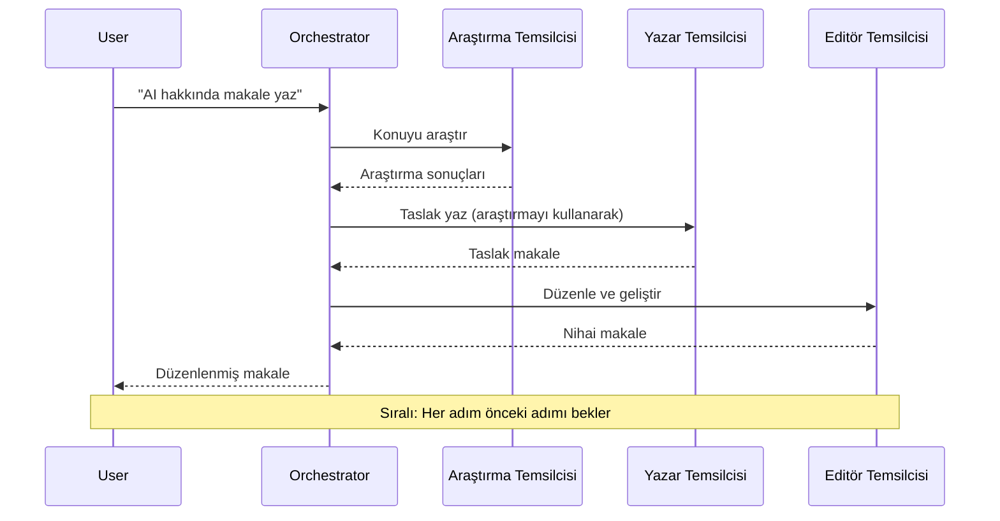
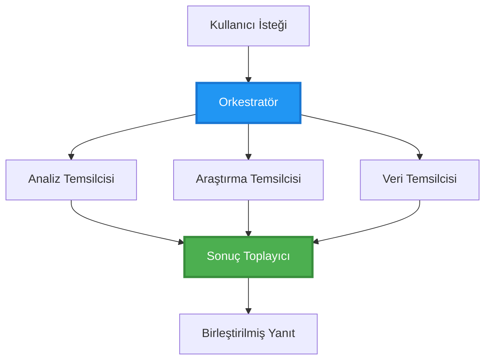
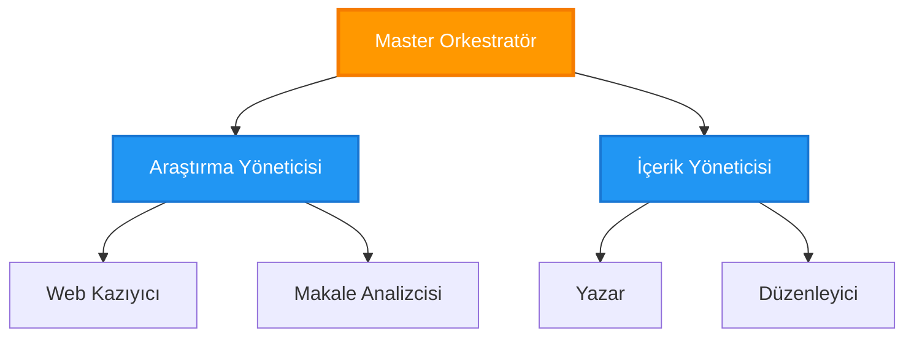
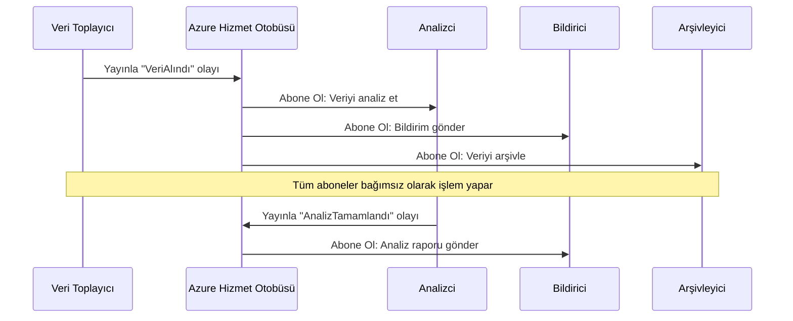
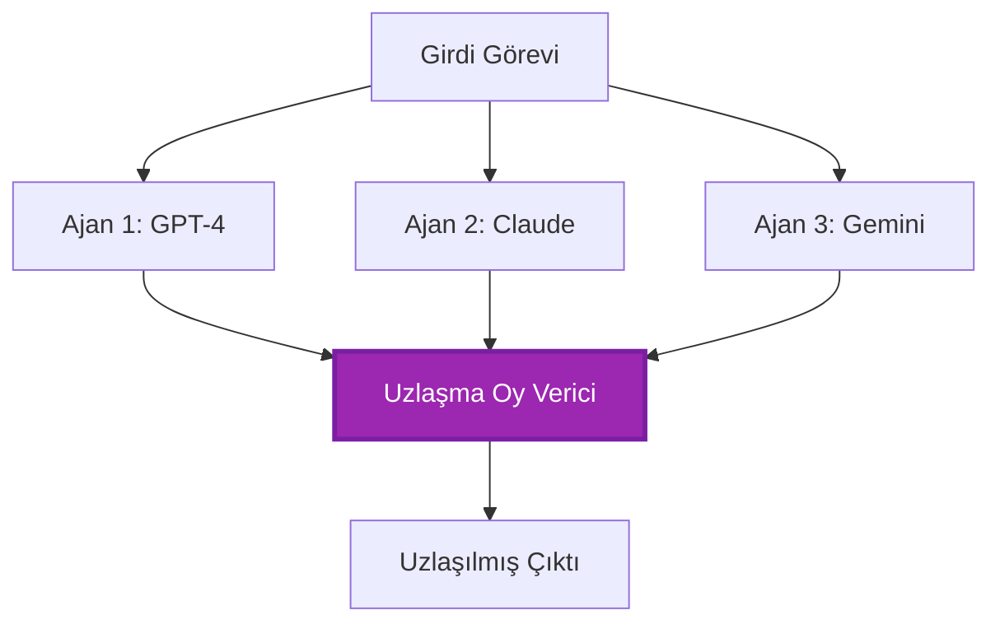
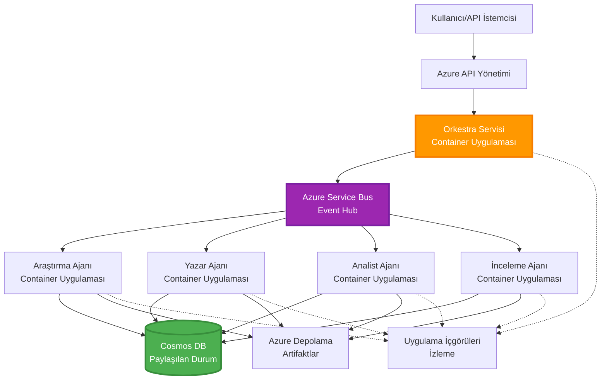

# Çoklu Ajan Koordinasyon Modelleri

⏱️ **Tahmini Süre**: 60-75 dakika | 💰 **Tahmini Maliyet**: ~100-300$/ay | ⭐ **Zorluk Seviyesi**: İleri

**📚 Öğrenme Yolu:**
- ← Önceki: [Kapasite Planlama](capacity-planning.md) - Kaynak boyutlandırma ve ölçeklendirme stratejileri
- 🎯 **Şu Anda Buradasınız**: Çoklu Ajan Koordinasyon Modelleri (Orkestrasyon, iletişim, durum yönetimi)
- → Sonraki: [SKU Seçimi](sku-selection.md) - Doğru Azure hizmetlerini seçmek
- 🏠 [Kurs Ana Sayfası](../../README.md)

---

## Öğrenecekleriniz

Bu dersi tamamladığınızda:
- **Çoklu ajan mimarisi** modellerini ve ne zaman kullanılacağını anlayacaksınız
- **Orkestrasyon modellerini** (merkezi, merkezi olmayan, hiyerarşik) uygulayacaksınız
- **Ajan iletişim** stratejileri tasarlayacaksınız (senkron, asenkron, olay odaklı)
- Dağıtılmış ajanlar arasında **paylaşılan durumu** yöneteceksiniz
- **Çoklu ajan sistemlerini** Azure üzerinde AZD ile dağıtacaksınız
- Gerçek dünya AI senaryoları için **koordinasyon modellerini** uygulayacaksınız
- Dağıtılmış ajan sistemlerini izleyip hata ayıklayacaksınız

## Çoklu Ajan Koordinasyonunun Önemi

### Evrim: Tek Ajan'dan Çoklu Ajan'a

**Tek Ajan (Basit):**
```
User → Agent → Response
```
- ✅ Anlaması ve uygulaması kolay
- ✅ Basit görevler için hızlı
- ❌ Tek bir modelin yetenekleriyle sınırlı
- ❌ Karmaşık görevleri paralel olarak gerçekleştiremez
- ❌ Uzmanlaşma yok

**Çoklu Ajan Sistemi (İleri):**
```
           ┌─────────────┐
           │ Orchestrator│
           └──────┬──────┘
        ┌─────────┼─────────┐
        │         │         │
    ┌───▼──┐  ┌──▼───┐  ┌──▼────┐
    │Agent1│  │Agent2│  │Agent3 │
    │(Plan)│  │(Code)│  │(Review)│
    └──────┘  └──────┘  └───────┘
```
- ✅ Belirli görevler için uzmanlaşmış ajanlar
- ✅ Hız için paralel yürütme
- ✅ Modüler ve sürdürülebilir
- ✅ Karmaşık iş akışlarında daha iyi
- ⚠️ Koordinasyon mantığı gerektirir

**Benzerlik**: Tek ajan, tüm işleri yapan bir kişi gibidir. Çoklu ajan ise her üyenin uzmanlık alanına sahip olduğu bir ekip gibidir (araştırmacı, kodlayıcı, inceleyici, yazar).

---

## Temel Koordinasyon Modelleri

### Model 1: Sıralı Koordinasyon (Sorumluluk Zinciri)

**Ne zaman kullanılır**: Görevlerin belirli bir sırayla tamamlanması gerektiğinde, her ajan önceki çıktıya dayanır.


**Faydalar:**
- ✅ Net veri akışı
- ✅ Hata ayıklaması kolay
- ✅ Tahmin edilebilir yürütme sırası

**Sınırlamalar:**
- ❌ Daha yavaş (paralellik yok)
- ❌ Bir hata tüm zinciri engeller
- ❌ Birbirine bağımlı görevleri yönetemez

**Örnek Kullanım Alanları:**
- İçerik oluşturma hattı (araştırma → yazma → düzenleme → yayınlama)
- Kod üretimi (planlama → uygulama → test → dağıtım)
- Rapor oluşturma (veri toplama → analiz → görselleştirme → özet)

---

### Model 2: Paralel Koordinasyon (Fan-Out/Fan-In)

**Ne zaman kullanılır**: Bağımsız görevler aynı anda çalışabilir, sonuçlar sonunda birleştirilir.


**Faydalar:**
- ✅ Hızlı (paralel yürütme)
- ✅ Hata toleransı yüksek (kısmi sonuçlar kabul edilebilir)
- ✅ Yatay ölçeklenebilir

**Sınırlamalar:**
- ⚠️ Sonuçlar sırasız gelebilir
- ⚠️ Birleştirme mantığı gerektirir
- ⚠️ Karmaşık durum yönetimi

**Örnek Kullanım Alanları:**
- Çok kaynaklı veri toplama (API'ler + veritabanları + web tarama)
- Rekabet analizi (birden fazla model çözüm üretir, en iyisi seçilir)
- Çeviri hizmetleri (aynı anda birden fazla dile çeviri)

---

### Model 3: Hiyerarşik Koordinasyon (Yönetici-Çalışan)

**Ne zaman kullanılır**: Alt görevlerle karmaşık iş akışları, delege edilmesi gereken durumlar.


**Faydalar:**
- ✅ Karmaşık iş akışlarını yönetir
- ✅ Modüler ve sürdürülebilir
- ✅ Net sorumluluk sınırları

**Sınırlamalar:**
- ⚠️ Daha karmaşık mimari
- ⚠️ Daha yüksek gecikme (birden fazla koordinasyon katmanı)
- ⚠️ Gelişmiş orkestrasyon gerektirir

**Örnek Kullanım Alanları:**
- Kurumsal belge işleme (sınıflandırma → yönlendirme → işleme → arşivleme)
- Çok aşamalı veri hatları (alım → temizleme → dönüştürme → analiz → raporlama)
- Karmaşık otomasyon iş akışları (planlama → kaynak tahsisi → yürütme → izleme)

---

### Model 4: Olay Odaklı Koordinasyon (Yayınla-Abone Ol)

**Ne zaman kullanılır**: Ajanların olaylara tepki vermesi gerektiğinde, gevşek bağlanma isteniyorsa.


**Faydalar:**
- ✅ Ajanlar arasında gevşek bağlanma
- ✅ Yeni ajan eklemek kolay (sadece abone olun)
- ✅ Asenkron işlem
- ✅ Dayanıklı (mesaj kalıcılığı)

**Sınırlamalar:**
- ⚠️ Nihai tutarlılık
- ⚠️ Karmaşık hata ayıklama
- ⚠️ Mesaj sıralama zorlukları

**Örnek Kullanım Alanları:**
- Gerçek zamanlı izleme sistemleri (uyarılar, panolar, günlükler)
- Çok kanallı bildirimler (e-posta, SMS, push, Slack)
- Veri işleme hatları (aynı veriyi birden fazla tüketici)

---

### Model 5: Uzlaşma Tabanlı Koordinasyon (Oylama/Çoğunluk)

**Ne zaman kullanılır**: Devam etmeden önce birden fazla ajanın anlaşması gerektiğinde.


**Faydalar:**
- ✅ Daha yüksek doğruluk (birden fazla görüş)
- ✅ Hata toleransı yüksek (azınlık hataları kabul edilebilir)
- ✅ Kalite güvencesi yerleşik

**Sınırlamalar:**
- ❌ Maliyetli (birden fazla model çağrısı)
- ❌ Daha yavaş (tüm ajanları beklemek)
- ⚠️ Çatışma çözümü gerekli

**Örnek Kullanım Alanları:**
- İçerik moderasyonu (birden fazla model içeriği inceler)
- Kod inceleme (birden fazla linter/analiz aracı)
- Tıbbi teşhis (birden fazla AI modeli, uzman doğrulaması)

---

## Mimari Genel Bakış

### Azure'da Tam Çoklu Ajan Sistemi


**Temel Bileşenler:**

| Bileşen | Amaç | Azure Hizmeti |
|---------|------|--------------|
| **API Geçidi** | Giriş noktası, hız sınırlama, kimlik doğrulama | API Management |
| **Orkestratör** | Ajan iş akışlarını koordine eder | Container Apps |
| **Mesaj Kuyruğu** | Asenkron iletişim | Service Bus / Event Hubs |
| **Ajanlar** | Uzmanlaşmış AI çalışanları | Container Apps / Functions |
| **Durum Deposu** | Paylaşılan durum, görev takibi | Cosmos DB |
| **Artefakt Deposu** | Belgeler, sonuçlar, günlükler | Blob Storage |
| **İzleme** | Dağıtılmış izleme, günlükler | Application Insights |

---

## Ön Koşullar

### Gerekli Araçlar

```bash
# Azure Developer CLI'yi doğrula
azd version
# ✅ Beklenen: azd sürüm 1.0.0 veya daha yüksek

# Azure CLI'yi doğrula
az --version
# ✅ Beklenen: azure-cli 2.50.0 veya daha yüksek

# Docker'ı doğrula (yerel test için)
docker --version
# ✅ Beklenen: Docker sürüm 20.10 veya daha yüksek
```

### Azure Gereksinimleri

- Aktif Azure aboneliği
- Şunları oluşturma izni:
  - Container Apps
  - Service Bus ad alanları
  - Cosmos DB hesapları
  - Depolama hesapları
  - Application Insights

### Bilgi Ön Koşulları

Tamamlamış olmalısınız:
- [Yapılandırma Yönetimi](../getting-started/configuration.md)
- [Kimlik Doğrulama ve Güvenlik](../getting-started/authsecurity.md)
- [Mikroservisler Örneği](../../../../examples/microservices)

---

## Uygulama Rehberi

### Proje Yapısı

```
multi-agent-system/
├── azure.yaml                    # AZD configuration
├── infra/
│   ├── main.bicep               # Main infrastructure
│   ├── core/
│   │   ├── servicebus.bicep     # Message queue
│   │   ├── cosmos.bicep         # State store
│   │   ├── storage.bicep        # Artifact storage
│   │   └── monitoring.bicep     # Application Insights
│   └── app/
│       ├── orchestrator.bicep   # Orchestrator service
│       └── agent.bicep          # Agent template
└── src/
    ├── orchestrator/            # Orchestration logic
    │   ├── app.py
    │   ├── workflows.py
    │   └── Dockerfile
    ├── agents/
    │   ├── research/            # Research agent
    │   ├── writer/              # Writer agent
    │   ├── analyst/             # Analyst agent
    │   └── reviewer/            # Reviewer agent
    └── shared/
        ├── state_manager.py     # Shared state logic
        └── message_handler.py   # Message handling
```

---

## Ders 1: Sıralı Koordinasyon Modeli

### Uygulama: İçerik Oluşturma Hattı

Araştırma → Yazma → Düzenleme → Yayınlama sıralı hattını oluşturalım.

### 1. AZD Yapılandırması

**Dosya: `azure.yaml`**

```yaml
name: content-pipeline
metadata:
  template: multi-agent-sequential@1.0.0

services:
  orchestrator:
    project: ./src/orchestrator
    language: python
    host: containerapp
  
  research-agent:
    project: ./src/agents/research
    language: python
    host: containerapp
  
  writer-agent:
    project: ./src/agents/writer
    language: python
    host: containerapp
  
  editor-agent:
    project: ./src/agents/editor
    language: python
    host: containerapp
```

### 2. Altyapı: Koordinasyon için Service Bus

**Dosya: `infra/core/servicebus.bicep`**

```bicep
param name string
param location string
param tags object = {}

resource serviceBusNamespace 'Microsoft.ServiceBus/namespaces@2022-10-01-preview' = {
  name: name
  location: location
  tags: tags
  sku: {
    name: 'Standard'
    tier: 'Standard'
  }
  properties: {
    minimumTlsVersion: '1.2'
  }
}

// Queue for orchestrator → research agent
resource researchQueue 'Microsoft.ServiceBus/namespaces/queues@2022-10-01-preview' = {
  parent: serviceBusNamespace
  name: 'research-tasks'
  properties: {
    maxDeliveryCount: 3
    lockDuration: 'PT5M'
    deadLetteringOnMessageExpiration: true
  }
}

// Queue for research agent → writer agent
resource writerQueue 'Microsoft.ServiceBus/namespaces/queues@2022-10-01-preview' = {
  parent: serviceBusNamespace
  name: 'writer-tasks'
  properties: {
    maxDeliveryCount: 3
    lockDuration: 'PT5M'
  }
}

// Queue for writer agent → editor agent
resource editorQueue 'Microsoft.ServiceBus/namespaces/queues@2022-10-01-preview' = {
  parent: serviceBusNamespace
  name: 'editor-tasks'
  properties: {
    maxDeliveryCount: 3
    lockDuration: 'PT5M'
  }
}

output namespace string = serviceBusNamespace.name
output connectionString string = listKeys('${serviceBusNamespace.id}/AuthorizationRules/RootManageSharedAccessKey', serviceBusNamespace.apiVersion).primaryConnectionString
```

### 3. Paylaşılan Durum Yöneticisi

**Dosya: `src/shared/state_manager.py`**

```python
from azure.cosmos import CosmosClient, PartitionKey
from datetime import datetime
import os

class StateManager:
    """Manages shared state across agents using Cosmos DB"""
    
    def __init__(self):
        endpoint = os.environ['COSMOS_ENDPOINT']
        key = os.environ['COSMOS_KEY']
        
        self.client = CosmosClient(endpoint, key)
        self.database = self.client.get_database_client('agent-state')
        self.container = self.database.get_container_client('tasks')
    
    def create_task(self, task_id: str, task_type: str, input_data: dict):
        """Create a new task"""
        task = {
            'id': task_id,
            'type': task_type,
            'status': 'pending',
            'input': input_data,
            'created_at': datetime.utcnow().isoformat(),
            'steps': []
        }
        self.container.create_item(task)
        return task
    
    def update_task_step(self, task_id: str, step_name: str, result: dict):
        """Update task with completed step"""
        task = self.container.read_item(task_id, partition_key=task_id)
        
        task['steps'].append({
            'name': step_name,
            'completed_at': datetime.utcnow().isoformat(),
            'result': result
        })
        
        self.container.replace_item(task_id, task)
        return task
    
    def complete_task(self, task_id: str, final_result: dict):
        """Mark task as complete"""
        task = self.container.read_item(task_id, partition_key=task_id)
        task['status'] = 'completed'
        task['result'] = final_result
        task['completed_at'] = datetime.utcnow().isoformat()
        self.container.replace_item(task_id, task)
        return task
    
    def get_task(self, task_id: str):
        """Retrieve task state"""
        return self.container.read_item(task_id, partition_key=task_id)
```

### 4. Orkestratör Servisi

**Dosya: `src/orchestrator/app.py`**

```python
from flask import Flask, request, jsonify
from azure.servicebus import ServiceBusClient, ServiceBusMessage
import json
import uuid
import os
from shared.state_manager import StateManager

app = Flask(__name__)
state_manager = StateManager()

# Service Bus bağlantısı
servicebus_connection_str = os.environ['SERVICEBUS_CONNECTION_STRING']
servicebus_client = ServiceBusClient.from_connection_string(servicebus_connection_str)

@app.route('/health', methods=['GET'])
def health():
    return jsonify({'status': 'healthy', 'service': 'orchestrator'})

@app.route('/create-content', methods=['POST'])
def create_content():
    """
    Sequential workflow: Research → Write → Edit → Publish
    """
    data = request.json
    topic = data.get('topic')
    
    if not topic:
        return jsonify({'error': 'Topic required'}), 400
    
    # Durum deposunda görev oluştur
    task_id = str(uuid.uuid4())
    task = state_manager.create_task(
        task_id=task_id,
        task_type='content_creation',
        input_data={'topic': topic}
    )
    
    # Araştırma ajanına mesaj gönder (ilk adım)
    sender = servicebus_client.get_queue_sender('research-tasks')
    message = ServiceBusMessage(
        body=json.dumps({
            'task_id': task_id,
            'topic': topic,
            'next_queue': 'writer-tasks'  # Sonuçları nereye göndereceğiz
        }),
        content_type='application/json'
    )
    
    with sender:
        sender.send_messages(message)
    
    return jsonify({
        'task_id': task_id,
        'status': 'started',
        'workflow': 'sequential',
        'steps': ['research', 'write', 'edit', 'publish'],
        'message': 'Content creation pipeline initiated'
    }), 202

@app.route('/task/<task_id>', methods=['GET'])
def get_task_status(task_id):
    """Check task status"""
    try:
        task = state_manager.get_task(task_id)
        return jsonify(task)
    except Exception as e:
        return jsonify({'error': str(e)}), 404

if __name__ == '__main__':
    app.run(host='0.0.0.0', port=8080)
```

### 5. Araştırma Ajanı

**Dosya: `src/agents/research/app.py`**

```python
from azure.servicebus import ServiceBusClient, ServiceBusMessage
from openai import AzureOpenAI
import json
import os
import time
from shared.state_manager import StateManager

# Müşterileri başlat
state_manager = StateManager()
servicebus_client = ServiceBusClient.from_connection_string(
    os.environ['SERVICEBUS_CONNECTION_STRING']
)

openai_client = AzureOpenAI(
    api_key=os.environ['AZURE_OPENAI_API_KEY'],
    api_version="2024-02-01",
    azure_endpoint=os.environ['AZURE_OPENAI_ENDPOINT']
)

def process_research_task(message_data):
    """Process research request and pass to writer"""
    task_id = message_data['task_id']
    topic = message_data['topic']
    next_queue = message_data['next_queue']
    
    print(f"🔬 Researching: {topic}")
    
    # Araştırma için Azure OpenAI'yi çağır
    response = openai_client.chat.completions.create(
        model="gpt-4",
        messages=[
            {"role": "system", "content": "You are a research assistant. Provide comprehensive research on the given topic."},
            {"role": "user", "content": f"Research this topic thoroughly: {topic}"}
        ],
        max_tokens=1500
    )
    
    research_results = response.choices[0].message.content
    
    # Durumu güncelle
    state_manager.update_task_step(
        task_id=task_id,
        step_name='research',
        result={'research': research_results}
    )
    
    # Bir sonraki ajana (yazıcı) gönder
    sender = servicebus_client.get_queue_sender(next_queue)
    message = ServiceBusMessage(
        body=json.dumps({
            'task_id': task_id,
            'topic': topic,
            'research': research_results,
            'next_queue': 'editor-tasks'
        }),
        content_type='application/json'
    )
    
    with sender:
        sender.send_messages(message)
    
    print(f"✅ Research complete for task {task_id}")

def main():
    """Listen to research queue"""
    receiver = servicebus_client.get_queue_receiver('research-tasks')
    
    print("🔬 Research Agent started, listening for tasks...")
    
    with receiver:
        while True:
            messages = receiver.receive_messages(max_wait_time=5)
            for message in messages:
                try:
                    message_data = json.loads(str(message))
                    process_research_task(message_data)
                    receiver.complete_message(message)
                except Exception as e:
                    print(f"❌ Error processing message: {e}")
                    receiver.abandon_message(message)

if __name__ == '__main__':
    main()
```

### 6. Yazar Ajanı

**Dosya: `src/agents/writer/app.py`**

```python
from azure.servicebus import ServiceBusClient, ServiceBusMessage
from openai import AzureOpenAI
import json
import os
from shared.state_manager import StateManager

state_manager = StateManager()
servicebus_client = ServiceBusClient.from_connection_string(
    os.environ['SERVICEBUS_CONNECTION_STRING']
)

openai_client = AzureOpenAI(
    api_key=os.environ['AZURE_OPENAI_API_KEY'],
    api_version="2024-02-01",
    azure_endpoint=os.environ['AZURE_OPENAI_ENDPOINT']
)

def process_writing_task(message_data):
    """Write article based on research"""
    task_id = message_data['task_id']
    topic = message_data['topic']
    research = message_data['research']
    next_queue = message_data['next_queue']
    
    print(f"✍️ Writing article: {topic}")
    
    # Azure OpenAI'yi makale yazması için çağır
    response = openai_client.chat.completions.create(
        model="gpt-4",
        messages=[
            {"role": "system", "content": "You are a professional writer. Write engaging, well-structured articles."},
            {"role": "user", "content": f"Based on this research:\n\n{research}\n\nWrite a comprehensive article about: {topic}"}
        ],
        max_tokens=2000
    )
    
    article_draft = response.choices[0].message.content
    
    # Durumu güncelle
    state_manager.update_task_step(
        task_id=task_id,
        step_name='writing',
        result={'draft': article_draft}
    )
    
    # Editöre gönder
    sender = servicebus_client.get_queue_sender(next_queue)
    message = ServiceBusMessage(
        body=json.dumps({
            'task_id': task_id,
            'topic': topic,
            'draft': article_draft
        }),
        content_type='application/json'
    )
    
    with sender:
        sender.send_messages(message)
    
    print(f"✅ Article draft complete for task {task_id}")

def main():
    """Listen to writer queue"""
    receiver = servicebus_client.get_queue_receiver('writer-tasks')
    
    print("✍️ Writer Agent started, listening for tasks...")
    
    with receiver:
        while True:
            messages = receiver.receive_messages(max_wait_time=5)
            for message in messages:
                try:
                    message_data = json.loads(str(message))
                    process_writing_task(message_data)
                    receiver.complete_message(message)
                except Exception as e:
                    print(f"❌ Error: {e}")
                    receiver.abandon_message(message)

if __name__ == '__main__':
    main()
```

### 7. Editör Ajanı

**Dosya: `src/agents/editor/app.py`**

```python
from azure.servicebus import ServiceBusClient
from openai import AzureOpenAI
import json
import os
from shared.state_manager import StateManager

state_manager = StateManager()
servicebus_client = ServiceBusClient.from_connection_string(
    os.environ['SERVICEBUS_CONNECTION_STRING']
)

openai_client = AzureOpenAI(
    api_key=os.environ['AZURE_OPENAI_API_KEY'],
    api_version="2024-02-01",
    azure_endpoint=os.environ['AZURE_OPENAI_ENDPOINT']
)

def process_editing_task(message_data):
    """Edit and finalize article"""
    task_id = message_data['task_id']
    topic = message_data['topic']
    draft = message_data['draft']
    
    print(f"📝 Editing article: {topic}")
    
    # Azure OpenAI'yi düzenlemek için çağır
    response = openai_client.chat.completions.create(
        model="gpt-4",
        messages=[
            {"role": "system", "content": "You are an expert editor. Improve grammar, clarity, and structure."},
            {"role": "user", "content": f"Edit and improve this article:\n\n{draft}"}
        ],
        max_tokens=2000
    )
    
    final_article = response.choices[0].message.content
    
    # Görevi tamamlandı olarak işaretle
    state_manager.complete_task(
        task_id=task_id,
        final_result={
            'topic': topic,
            'final_article': final_article,
            'word_count': len(final_article.split())
        }
    )
    
    print(f"✅ Article finalized for task {task_id}")

def main():
    """Listen to editor queue"""
    receiver = servicebus_client.get_queue_receiver('editor-tasks')
    
    print("📝 Editor Agent started, listening for tasks...")
    
    with receiver:
        while True:
            messages = receiver.receive_messages(max_wait_time=5)
            for message in messages:
                try:
                    message_data = json.loads(str(message))
                    process_editing_task(message_data)
                    receiver.complete_message(message)
                except Exception as e:
                    print(f"❌ Error: {e}")
                    receiver.abandon_message(message)

if __name__ == '__main__':
    main()
```

### 8. Dağıtım ve Test

```bash
# Başlat ve dağıt
azd init
azd up

# Orkestratör URL'sini al
ORCHESTRATOR_URL=$(azd env get-values | grep ORCHESTRATOR_URL | cut -d '=' -f2 | tr -d '"')

# İçerik oluştur
curl -X POST $ORCHESTRATOR_URL/create-content \
  -H "Content-Type: application/json" \
  -d '{"topic": "The Future of AI in Healthcare"}'
```

**✅ Beklenen çıktı:**
```json
{
  "task_id": "a1b2c3d4-e5f6-7890-abcd-ef1234567890",
  "status": "started",
  "workflow": "sequential",
  "steps": ["research", "write", "edit", "publish"],
  "message": "Content creation pipeline initiated"
}
```

**Görev ilerlemesini kontrol et:**
```bash
TASK_ID="a1b2c3d4-e5f6-7890-abcd-ef1234567890"
curl $ORCHESTRATOR_URL/task/$TASK_ID
```

**✅ Beklenen çıktı (tamamlandı):**
```json
{
  "id": "a1b2c3d4-e5f6-7890-abcd-ef1234567890",
  "type": "content_creation",
  "status": "completed",
  "steps": [
    {
      "name": "research",
      "completed_at": "2025-11-19T10:30:00Z",
      "result": {"research": "..."}
    },
    {
      "name": "writing",
      "completed_at": "2025-11-19T10:32:00Z",
      "result": {"draft": "..."}
    }
  ],
  "result": {
    "topic": "The Future of AI in Healthcare",
    "final_article": "...",
    "word_count": 1500
  }
}
```

---

## Ders 2: Paralel Koordinasyon Modeli

### Uygulama: Çok Kaynaklı Araştırma Toplayıcı

Birden fazla kaynaktan aynı anda bilgi toplayan paralel bir sistem oluşturalım.

### Paralel Orkestratör

**Dosya: `src/orchestrator/parallel_workflow.py`**

```python
from flask import Flask, request, jsonify
from azure.servicebus import ServiceBusClient, ServiceBusMessage
import json
import uuid
import os
from shared.state_manager import StateManager

app = Flask(__name__)
state_manager = StateManager()

servicebus_client = ServiceBusClient.from_connection_string(
    os.environ['SERVICEBUS_CONNECTION_STRING']
)

@app.route('/research-parallel', methods=['POST'])
def research_parallel():
    """
    Parallel workflow: Multiple agents work simultaneously
    """
    data = request.json
    query = data.get('query')
    
    task_id = str(uuid.uuid4())
    task = state_manager.create_task(
        task_id=task_id,
        task_type='parallel_research',
        input_data={
            'query': query,
            'agents': ['web', 'academic', 'news', 'social']
        }
    )
    
    # Fan-out: Tüm ajanlara aynı anda gönder
    agents = [
        ('web-research-queue', 'web'),
        ('academic-research-queue', 'academic'),
        ('news-research-queue', 'news'),
        ('social-research-queue', 'social')
    ]
    
    for queue_name, agent_type in agents:
        sender = servicebus_client.get_queue_sender(queue_name)
        message = ServiceBusMessage(
            body=json.dumps({
                'task_id': task_id,
                'query': query,
                'agent_type': agent_type,
                'result_queue': 'aggregation-queue'
            }),
            content_type='application/json'
        )
        
        with sender:
            sender.send_messages(message)
    
    return jsonify({
        'task_id': task_id,
        'status': 'started',
        'workflow': 'parallel',
        'agents_dispatched': 4,
        'message': 'Parallel research initiated'
    }), 202

if __name__ == '__main__':
    app.run(host='0.0.0.0', port=8080)
```

### Toplama Mantığı

**Dosya: `src/agents/aggregator/app.py`**

```python
from azure.servicebus import ServiceBusClient
import json
import os
from collections import defaultdict
from shared.state_manager import StateManager

state_manager = StateManager()
servicebus_client = ServiceBusClient.from_connection_string(
    os.environ['SERVICEBUS_CONNECTION_STRING']
)

# Görev başına sonuçları takip et
task_results = defaultdict(list)
expected_agents = 4  # web, akademik, haber, sosyal

def process_result(message_data):
    """Aggregate results from parallel agents"""
    task_id = message_data['task_id']
    agent_type = message_data['agent_type']
    result = message_data['result']
    
    # Sonucu sakla
    task_results[task_id].append({
        'agent': agent_type,
        'data': result
    })
    
    print(f"📊 Received result from {agent_type} agent ({len(task_results[task_id])}/{expected_agents})")
    
    # Tüm ajanların tamamlayıp tamamlamadığını kontrol et (fan-in)
    if len(task_results[task_id]) == expected_agents:
        print(f"✅ All agents completed for task {task_id}. Aggregating...")
        
        # Sonuçları birleştir
        aggregated = {
            'query': message_data['query'],
            'sources': task_results[task_id],
            'summary': generate_summary(task_results[task_id])
        }
        
        # Tamamlandı olarak işaretle
        state_manager.complete_task(task_id, aggregated)
        
        # Temizle
        del task_results[task_id]
        
        print(f"✅ Aggregation complete for task {task_id}")

def generate_summary(results):
    """Generate summary from all sources"""
    summaries = [r['data'].get('summary', '') for r in results]
    return '\n\n'.join(summaries)

def main():
    """Listen to aggregation queue"""
    receiver = servicebus_client.get_queue_receiver('aggregation-queue')
    
    print("📊 Aggregator started, listening for results...")
    
    with receiver:
        while True:
            messages = receiver.receive_messages(max_wait_time=5)
            for message in messages:
                try:
                    message_data = json.loads(str(message))
                    process_result(message_data)
                    receiver.complete_message(message)
                except Exception as e:
                    print(f"❌ Error: {e}")
                    receiver.abandon_message(message)

if __name__ == '__main__':
    main()
```

**Paralel Modelin Faydaları:**
- ⚡ **4 kat daha hızlı** (ajanlar aynı anda çalışır)
- 🔄 **Hata toleransı yüksek** (kısmi sonuçlar kabul edilebilir)
- 📈 **Ölçeklenebilir** (daha fazla ajan kolayca eklenebilir)

---

## Pratik Egzersizler

### Egzersiz 1: Zaman Aşımı Yönetimi Ekle ⭐⭐ (Orta)

**Amaç**: Toplayıcı, yavaş ajanlar için sonsuza kadar beklemesin diye zaman aşımı mantığını uygulayın.

**Adımlar**:

1. **Toplayıcıya zaman aşımı takibi ekleyin:**

```python
from datetime import datetime, timedelta

task_timeouts = {}  # görev_id -> sonlanma_zamanı

def process_result(message_data):
    task_id = message_data['task_id']
    
    # İlk sonuç için zaman aşımı ayarla
    if task_id not in task_timeouts:
        task_timeouts[task_id] = datetime.utcnow() + timedelta(seconds=30)
    
    task_results[task_id].append({
        'agent': message_data['agent_type'],
        'data': message_data['result']
    })
    
    # Tamamlandı mı veya zaman aşımına uğradı mı kontrol et
    if len(task_results[task_id]) == expected_agents or \
       datetime.utcnow() > task_timeouts[task_id]:
        
        print(f"📊 Aggregating with {len(task_results[task_id])}/{expected_agents} results")
        
        aggregated = {
            'query': message_data['query'],
            'sources': task_results[task_id],
            'completed_agents': len(task_results[task_id]),
            'timed_out': len(task_results[task_id]) < expected_agents
        }
        
        state_manager.complete_task(task_id, aggregated)
        
        # Temizlik
        del task_results[task_id]
        del task_timeouts[task_id]
```

2. **Yapay gecikmelerle test edin:**

```python
# Bir ajan içinde, yavaş işlemeyi simüle etmek için gecikme ekle
import time
time.sleep(35)  # 30 saniyelik zaman aşımını aşıyor
```

3. **Dağıtın ve doğrulayın:**

```bash
azd deploy aggregator

# Görevi gönder
curl -X POST $ORCHESTRATOR_URL/research-parallel \
  -H "Content-Type: application/json" \
  -d '{"query": "AI safety research"}'

# 30 saniye sonra sonuçları kontrol et
curl $ORCHESTRATOR_URL/task/$TASK_ID
```

**✅ Başarı Kriterleri:**
- ✅ Görev, ajanlar tamamlanmasa bile 30 saniye sonra tamamlanır
- ✅ Yanıt, kısmi sonuçları gösterir (`"timed_out": true`)
- ✅ Mevcut sonuçlar döndürülür (4 ajandan 3'ü)

**Süre**: 20-25 dakika

---

### Egzersiz 2: Yeniden Deneme Mantığı Uygula ⭐⭐⭐ (İleri)

**Amaç**: Başarısız ajan görevlerini otomatik olarak yeniden denemeden önce pes etmeyin.

**Adımlar**:

1. **Orkestratöre yeniden deneme takibi ekleyin:**

```python
from dataclasses import dataclass
from typing import Dict

@dataclass
class RetryConfig:
    max_retries: int = 3
    backoff_seconds: int = 5

retry_counts: Dict[str, int] = {}  # mesaj_id -> yeniden_deneme_sayısı

def send_with_retry(queue_name: str, message_data: dict, retry_config: RetryConfig):
    """Send message with retry metadata"""
    message_id = message_data.get('message_id', str(uuid.uuid4()))
    message_data['message_id'] = message_id
    message_data['retry_count'] = retry_counts.get(message_id, 0)
    message_data['max_retries'] = retry_config.max_retries
    
    sender = servicebus_client.get_queue_sender(queue_name)
    message = ServiceBusMessage(
        body=json.dumps(message_data),
        content_type='application/json',
        message_id=message_id
    )
    
    with sender:
        sender.send_messages(message)
```

2. **Ajanlara yeniden deneme işleyicisi ekleyin:**

```python
def process_with_retry(message, receiver, process_func):
    """Process message with automatic retry on failure"""
    try:
        message_data = json.loads(str(message))
        
        # Mesajı işle
        process_func(message_data)
        
        # Başarılı - tamamlandı
        receiver.complete_message(message)
        
    except Exception as e:
        message_id = message.message_id
        retry_count = message_data.get('retry_count', 0)
        max_retries = message_data.get('max_retries', 3)
        
        if retry_count < max_retries:
            # Yeniden dene: bırak ve artırılmış sayıyla yeniden sıraya al
            print(f"⚠️ Retry {retry_count + 1}/{max_retries} for message {message_id}")
            
            message_data['retry_count'] = retry_count + 1
            
            # Aynı sıraya gecikmeyle geri gönder
            time.sleep(5 * (retry_count + 1))  # Üstel geri çekilme
            send_with_retry(queue_name, message_data, RetryConfig())
            
            receiver.complete_message(message)  # Orijinali kaldır
        else:
            # Maksimum yeniden deneme aşıldı - ölü mektup kuyruğuna taşı
            print(f"❌ Max retries exceeded for message {message_id}")
            receiver.dead_letter_message(
                message,
                reason="MaxRetriesExceeded",
                error_description=str(e)
            )
```

3. **Dead letter kuyruğunu izleyin:**

```python
def monitor_dead_letters():
    """Check dead letter queue for failed messages"""
    receiver = servicebus_client.get_queue_receiver(
        'research-queue',
        sub_queue='deadletter'
    )
    
    with receiver:
        messages = receiver.receive_messages(max_wait_time=5)
        for message in messages:
            print(f"☠️ Dead letter: {message.message_id}")
            print(f"Reason: {message.dead_letter_reason}")
            print(f"Description: {message.dead_letter_error_description}")
```

**✅ Başarı Kriterleri:**
- ✅ Başarısız görevler otomatik olarak yeniden denenir (maksimum 3 kez)
- ✅ Yeniden denemeler arasında üstel geri çekilme (5s, 10s, 15s)
- ✅ Maksimum yeniden denemeden sonra mesajlar dead letter kuyruğuna gider
- ✅ Dead letter kuyruğu izlenebilir ve yeniden oynatılabilir

**Süre**: 30-40 dakika

---

### Egzersiz 3: Devre Kesici Uygula ⭐⭐⭐ (İleri)

**Amaç**: Başarısız ajanlara yapılan istekleri durdurarak zincirleme hataları önleyin.

**Adımlar**:

1. **Devre kesici sınıfı oluşturun:**

```python
from enum import Enum
from datetime import datetime, timedelta

class CircuitState(Enum):
    CLOSED = "closed"      # Normal çalışma
    OPEN = "open"          # Başarısız, istekleri reddet
    HALF_OPEN = "half_open"  # İyileşip iyileşmediğini test et

class CircuitBreaker:
    def __init__(self, failure_threshold=5, timeout_seconds=60):
        self.failure_threshold = failure_threshold
        self.timeout_seconds = timeout_seconds
        self.failure_count = 0
        self.last_failure_time = None
        self.state = CircuitState.CLOSED
    
    def call(self, func):
        """Execute function with circuit breaker protection"""
        if self.state == CircuitState.OPEN:
            # Zaman aşımının sona erip ermediğini kontrol et
            if datetime.utcnow() - self.last_failure_time > timedelta(seconds=self.timeout_seconds):
                self.state = CircuitState.HALF_OPEN
                print("🔄 Circuit breaker: HALF_OPEN (testing)")
            else:
                raise Exception(f"Circuit breaker OPEN for agent. Try again in {self.timeout_seconds}s")
        
        try:
            result = func()
            
            # Başarılı
            if self.state == CircuitState.HALF_OPEN:
                self.state = CircuitState.CLOSED
                self.failure_count = 0
                print("✅ Circuit breaker: CLOSED (recovered)")
            
            return result
            
        except Exception as e:
            self.failure_count += 1
            self.last_failure_time = datetime.utcnow()
            
            if self.failure_count >= self.failure_threshold:
                self.state = CircuitState.OPEN
                print(f"🔴 Circuit breaker: OPEN (too many failures)")
            
            raise e
```

2. **Ajan çağrılarına uygulayın:**

```python
# Orkestratörde
agent_circuits = {
    'web': CircuitBreaker(failure_threshold=5, timeout_seconds=60),
    'academic': CircuitBreaker(failure_threshold=5, timeout_seconds=60),
    'news': CircuitBreaker(failure_threshold=5, timeout_seconds=60),
    'social': CircuitBreaker(failure_threshold=5, timeout_seconds=60)
}

def send_to_agent(agent_type, message_data):
    """Send with circuit breaker protection"""
    circuit = agent_circuits[agent_type]
    
    try:
        circuit.call(lambda: send_message(agent_type, message_data))
    except Exception as e:
        print(f"⚠️ Skipping {agent_type} agent: {e}")
        # Diğer ajanlarla devam et
```

3. **Devre kesiciyi test edin:**

```bash
# Tekrarlanan hataları simüle et (bir ajanı durdur)
az containerapp stop --name web-research-agent --resource-group rg-agents

# Birden fazla istek gönder
for i in {1..10}; do
  curl -X POST $ORCHESTRATOR_URL/research-parallel \
    -H "Content-Type: application/json" \
    -d '{"query": "test query '$i'"}'
  sleep 2
done

# Günlükleri kontrol et - 5 hatadan sonra devrenin açık olduğunu görmelisin
azd logs orchestrator --tail 50
```

**✅ Başarı Kriterleri:**
- ✅ 5 hatadan sonra devre açılır (istekleri reddeder)
- ✅ 60 saniye sonra devre yarı açık olur (iyileşmeyi test eder)
- ✅ Diğer ajanlar normal şekilde çalışmaya devam eder
- ✅ Ajan iyileştiğinde devre otomatik olarak kapanır

**Süre**: 40-50 dakika

---

## İzleme ve Hata Ayıklama

### Application Insights ile Dağıtılmış İzleme

**Dosya: `src/shared/tracing.py`**

```python
from opencensus.ext.azure.log_exporter import AzureLogHandler
from opencensus.ext.azure.trace_exporter import AzureExporter
from opencensus.trace import config_integration
from opencensus.trace.tracer import Tracer
from opencensus.trace.samplers import AlwaysOnSampler
import logging
import os

# İzlemeyi yapılandır
config_integration.trace_integrations(['requests', 'logging'])

connection_string = os.environ.get('APPLICATIONINSIGHTS_CONNECTION_STRING')

# İzleyici oluştur
tracer = Tracer(
    exporter=AzureExporter(connection_string=connection_string),
    sampler=AlwaysOnSampler()
)

# Günlük kaydını yapılandır
logger = logging.getLogger(__name__)
logger.addHandler(AzureLogHandler(connection_string=connection_string))
logger.setLevel(logging.INFO)

def trace_agent_call(agent_name, task_id, operation):
    """Trace agent operations"""
    with tracer.span(name=f'{agent_name}.{operation}') as span:
        span.add_attribute('agent', agent_name)
        span.add_attribute('task_id', task_id)
        span.add_attribute('operation', operation)
        
        try:
            result = operation()
            span.add_attribute('status', 'success')
            return result
        except Exception as e:
            span.add_attribute('status', 'error')
            span.add_attribute('error', str(e))
            raise
```

### Application Insights Sorguları

**Çoklu ajan iş akışlarını izleyin:**

```kusto
// Trace complete workflow for a task
traces
| where customDimensions.task_id == "a1b2c3d4-..."
| project timestamp, message, customDimensions.agent, customDimensions.operation
| order by timestamp asc
```

**Ajan performans karşılaştırması:**

```kusto
// Compare agent execution times
dependencies
| where name contains "agent"
| summarize 
    avg_duration = avg(duration),
    p95_duration = percentile(duration, 95),
    count = count()
  by agent = tostring(customDimensions.agent)
| order by avg_duration desc
```

**Hata analizi:**

```kusto
// Find which agents fail most
exceptions
| where customDimensions.agent != ""
| summarize 
    failure_count = count(),
    unique_errors = dcount(outerMessage)
  by agent = tostring(customDimensions.agent)
| order by failure_count desc
```

---

## Maliyet Analizi

### Çoklu Ajan Sistemi Maliyetleri (Aylık Tahminler)

| Bileşen | Yapılandırma | Maliyet |
|---------|--------------|---------|
| **Orkestratör** | 1 Container App (1 vCPU, 2GB) | $30-50 |
| **4 Ajan** | 4 Container Apps (0.5 vCPU, 1GB her biri) | $60-120 |
| **Service Bus** | Standart seviye, 10M mesaj | $10-20 |
| **Cosmos DB** | Sunucusuz, 5GB depolama, 1M RUs | $25-50 |
| **Blob Depolama** | 10GB depolama, 100K işlem | $5-10 |
| **Application Insights** | 5GB veri alımı | $10-15 |
| **Azure OpenAI** | GPT-4, 10M token | $100-300 |
| **Toplam** | | **$240-565/ay** |

### Maliyet Optimizasyon Stratejileri

1. **Mümkün olduğunda sunucusuz kullanın:**
   ```bicep
   // Cosmos DB serverless (no minimum cost)
   properties: {
     databaseAccountOfferType: 'Standard'
     capabilities: [{ name: 'EnableServerless' }]
   }
   ```

2. **Ajanları boşta olduğunda sıfıra ölçeklendirin:**
   ```bicep
   scale: {
     minReplicas: 0  // Scale to zero when no messages
     maxReplicas: 10
   }
   ```

3. **Service Bus için toplu işlem kullanın:**
   ```python
   # Mesajları gruplar halinde gönderin (daha ucuz)
   sender.send_messages([message1, message2, message3])
   ```

4. **Sık kullanılan sonuçları önbelleğe alın:**
   ```python
   # Azure Cache for Redis'i kullanın
   if cache.exists(query_hash):
       return cache.get(query_hash)
   ```

---

## En İyi Uygulamalar

### ✅ YAPIN:

1. **İdempotent işlemler kullanın**
   ```python
   # Aracı aynı mesajı birden fazla kez güvenle işleyebilir
   def process_task(task_id):
       if state_manager.task_exists(task_id):
           print(f"Task {task_id} already processed, skipping")
           return
       # Görevi işliyor...
   ```

2. **Kapsamlı günlükleme uygulayın**
   ```python
   logger.info(f"Agent: {agent_name}, Task: {task_id}, Action: {action}")
   ```

3. **Korelasyon kimlikleri kullanın**
   ```python
   # Görev kimliğini tüm iş akışı boyunca ilet
   message_data = {
       'task_id': task_id,  # Korelasyon Kimliği
       'timestamp': datetime.utcnow().isoformat()
   }
   ```

4. **Mesaj TTL (yaşam süresi) ayarlayın**
   ```bicep
   properties: {
     defaultMessageTimeToLive: 'PT1H'  // 1 hour max
   }
   ```

5. **Dead letter kuyruklarını izleyin**
   ```python
   # Başarısız mesajların düzenli takibi
   monitor_dead_letters()
   ```

### ❌ YAPMAYIN:

1. **Döngüsel bağımlılıklar oluşturmayın**
   ```python
   # ❌ KÖTÜ: Ajan A → Ajan B → Ajan A (sonsuz döngü)
   # ✅ İYİ: Açık yönlendirilmiş asiklik grafik (DAG) tanımlayın
   ```

2. **Ajan iş parçacıklarını engellemeyin**
   ```python
   # ❌ KÖTÜ: Senkron bekleme
   while not task_complete:
       time.sleep(1)
   
   # ✅ İYİ: Mesaj kuyruğu geri çağrılarını kullan
   ```

3. **Kısmi hataları görmezden gelmeyin**
   ```python
   # ❌ KÖTÜ: Bir ajan başarısız olursa tüm iş akışını başarısız yap
   # ✅ İYİ: Hata göstergeleriyle birlikte kısmi sonuçlar döndür
   ```

4. **Sonsuz yeniden denemeler kullanmayın**
   ```python
   # ❌ KÖTÜ: sonsuza kadar yeniden dene
   # ✅ İYİ: max_retries = 3, ardından ölü harf
   ```

---
## Sorun Giderme Kılavuzu

### Sorun: Mesajlar kuyrukta takılı kalıyor

**Belirtiler:**
- Mesajlar kuyrukta birikiyor
- Ajanlar işlem yapmıyor
- Görev durumu "beklemede" olarak takılı kalıyor

**Teşhis:**
```bash
# Kuyruk derinliğini kontrol et
az servicebus queue show \
  --namespace-name mybus \
  --name research-tasks \
  --query "countDetails"

# Temsilci sağlığını kontrol et
azd logs research-agent --tail 50
```

**Çözümler:**

1. **Ajan replikalarını artırın:**
   ```bash
   az containerapp update \
     --name research-agent \
     --min-replicas 3 \
     --max-replicas 10
   ```

2. **Ölü mektup kuyruğunu kontrol edin:**
   ```bash
   az servicebus queue show \
     --namespace-name mybus \
     --name research-tasks \
     --query "countDetails.deadLetterMessageCount"
   ```

---

### Sorun: Görev zaman aşımına uğruyor/asla tamamlanmıyor

**Belirtiler:**
- Görev durumu "devam ediyor" olarak kalıyor
- Bazı ajanlar tamamlıyor, diğerleri tamamlamıyor
- Hata mesajı yok

**Teşhis:**
```bash
# Görev durumunu kontrol et
curl $ORCHESTRATOR_URL/task/$TASK_ID

# Application Insights'i kontrol et
# Sorguyu çalıştır: traces | where customDimensions.task_id == "..."
```

**Çözümler:**

1. **Toplayıcıda zaman aşımı uygulayın (Egzersiz 1)**

2. **Ajan hatalarını kontrol edin:**
   ```bash
   azd logs --follow | grep "ERROR\|FAIL"
   ```

3. **Tüm ajanların çalıştığını doğrulayın:**
   ```bash
   az containerapp list \
     --resource-group rg-agents \
     --query "[].{name:name, status:properties.runningStatus}"
   ```

---

## Daha Fazla Bilgi Edinin

### Resmi Belgeler
- [Azure Service Bus](https://learn.microsoft.com/azure/service-bus-messaging/service-bus-messaging-overview)
- [Cosmos DB](https://learn.microsoft.com/azure/cosmos-db/introduction)
- [Container Apps DAPR](https://learn.microsoft.com/azure/container-apps/dapr-overview)
- [Çoklu Ajan Tasarım Kalıpları](https://learn.microsoft.com/azure/architecture/guide/ai/multi-agent-systems)

### Bu Kursta Sonraki Adımlar
- ← Önceki: [Kapasite Planlama](capacity-planning.md)
- → Sonraki: [SKU Seçimi](sku-selection.md)
- 🏠 [Kurs Ana Sayfası](../../README.md)

### İlgili Örnekler
- [Mikroservisler Örneği](../../../../examples/microservices) - Servis iletişim kalıpları
- [Azure OpenAI Örneği](../../../../examples/azure-openai-chat) - AI entegrasyonu

---

## Özet

**Öğrendikleriniz:**
- ✅ Beş koordinasyon kalıbı (sıralı, paralel, hiyerarşik, olay odaklı, uzlaşma)
- ✅ Azure üzerinde çoklu ajan mimarisi (Service Bus, Cosmos DB, Container Apps)
- ✅ Dağıtılmış ajanlar arasında durum yönetimi
- ✅ Zaman aşımı yönetimi, yeniden deneme ve devre kesiciler
- ✅ Dağıtılmış sistemlerin izlenmesi ve hata ayıklanması
- ✅ Maliyet optimizasyon stratejileri

**Önemli Çıkarımlar:**
1. **Doğru kalıbı seçin** - Sıralı, düzenli iş akışları için; paralel, hız için; olay odaklı, esneklik için
2. **Durumu dikkatle yönetin** - Paylaşılan durum için Cosmos DB veya benzeri bir çözüm kullanın
3. **Hataları zarifçe yönetin** - Zaman aşımı, yeniden deneme, devre kesiciler, ölü mektup kuyrukları
4. **Her şeyi izleyin** - Dağıtılmış izleme, hata ayıklama için gereklidir
5. **Maliyetleri optimize edin** - Sıfıra ölçeklendirin, sunucusuz kullanın, önbellek uygulayın

**Sonraki Adımlar:**
1. Pratik egzersizleri tamamlayın
2. Kendi kullanım senaryonuz için bir çoklu ajan sistemi oluşturun
3. Performans ve maliyeti optimize etmek için [SKU Seçimi](sku-selection.md) çalışın

---

<!-- CO-OP TRANSLATOR DISCLAIMER START -->
**Feragatname**:  
Bu belge, AI çeviri hizmeti [Co-op Translator](https://github.com/Azure/co-op-translator) kullanılarak çevrilmiştir. Doğruluk için çaba göstersek de, otomatik çeviriler hata veya yanlışlıklar içerebilir. Belgenin orijinal dili, yetkili kaynak olarak kabul edilmelidir. Kritik bilgiler için profesyonel insan çevirisi önerilir. Bu çevirinin kullanımından kaynaklanan herhangi bir yanlış anlama veya yanlış yorumlama durumunda sorumluluk kabul edilmez.
<!-- CO-OP TRANSLATOR DISCLAIMER END -->