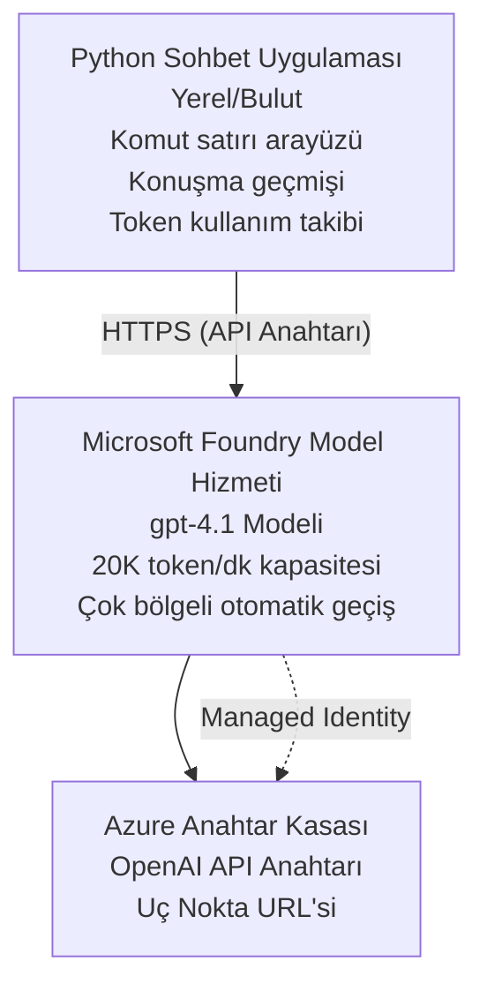

# Microsoft Foundry Models Chat Uygulaması

**Öğrenme Yolu:** Orta seviye ⭐⭐ | **Süre:** 35-45 dakika | **Maliyet:** $50-200/month

Azure Developer CLI (azd) kullanılarak dağıtılmış eksiksiz bir Microsoft Foundry Models sohbet uygulaması. Bu örnek, gpt-4.1 dağıtımını, güvenli API erişimini ve basit bir sohbet arayüzünü gösterir.

## 🎯 Ne Öğreneceksiniz

- Microsoft Foundry Models Hizmetini gpt-4.1 modeli ile dağıtma
- OpenAI API anahtarlarını Key Vault ile güvence altına alma
- Python ile basit bir sohbet arayüzü oluşturma
- Token kullanımını ve maliyetleri izleme
- Oran sınırlaması ve hata yönetimi uygulama

## 📦 Neler Dahil

✅ **Microsoft Foundry Models Service** - gpt-4.1 model dağıtımı  
✅ **Python Chat App** - Basit komut satırı sohbet arayüzü  
✅ **Key Vault Integration** - API anahtar depolama güvenliği  
✅ **ARM Templates** - Altyapı kodu olarak tam şablonlar  
✅ **Cost Monitoring** - Token kullanım takibi  
✅ **Rate Limiting** - Kota tükenmesini önleme  

## Mimari



## Önkoşullar

### Gereksinimler

- **Azure Developer CLI (azd)** - [Kurulum kılavuzu](https://learn.microsoft.com/azure/developer/azure-developer-cli/install-azd)
- **Azure subscription** with OpenAI access - [Erişim talep et](https://aka.ms/oai/access)
- **Python 3.9+** - [Python'ı yükle](https://www.python.org/downloads/)

### Önkoşulları Doğrulayın

```bash
# azd sürümünü kontrol et (1.5.0 veya daha yüksek gerekli)
azd version

# Azure oturumunu doğrula
azd auth login

# Python sürümünü kontrol et
python --version  # veya python3 --version

# OpenAI erişimini doğrula (Azure Portal'da kontrol et)
az cognitiveservices account list-skus \
  --kind OpenAI \
  --location eastus
```

> **⚠️ Önemli:** Microsoft Foundry Models başvuru onayı gerektirir. Başvurmadıysanız, ziyaret edin [aka.ms/oai/access](https://aka.ms/oai/access). Onay genellikle 1-2 iş günü sürer.

## ⏱️ Dağıtım Zaman Çizelgesi

| Aşama | Süre | Ne Olur |
|-------|----------|--------------|
| Prerequisites check | 2-3 minutes | OpenAI kota kullanılabilirliğini doğrulayın |
| Deploy infrastructure | 8-12 minutes | OpenAI, Key Vault ve model dağıtımını oluşturun |
| Configure application | 2-3 minutes | Ortamı ve bağımlılıkları kurun |
| **Toplam** | **12-18 dakika** | gpt-4.1 ile sohbet etmeye hazır |

**Not:** İlk OpenAI dağıtımı, model sağlanması nedeniyle daha uzun sürebilir.

## Hızlı Başlangıç

```bash
# Örneğe gidin
cd examples/azure-openai-chat

# Ortamı başlatın
azd env new myopenai

# Her şeyi dağıtın (altyapı + yapılandırma)
azd up
# Sizden şunlar istenecek:
# 1. Azure aboneliğini seçin
# 2. OpenAI'nin kullanılabilir olduğu bir konum seçin (ör. eastus, eastus2, westus)
# 3. Dağıtım için 12-18 dakika bekleyin

# Python bağımlılıklarını yükleyin
pip install -r requirements.txt

# Sohbete başlayın!
python chat.py
```

**Beklenen Çıktı:**
```
🤖 Microsoft Foundry Models Chat Application
Connected to: gpt-4.1 (eastus)
Type your message (or 'quit' to exit)

You: Hello! Tell me about Microsoft Foundry Models.
Assistant: Microsoft Foundry Models Service provides REST API access to OpenAI's powerful language models including gpt-4.1, GPT-3.5-Turbo, and Embeddings...

[Tokens used: 145 | Estimated cost: $0.0044]
```

## ✅ Dağıtımı Doğrulayın

### Adım 1: Azure Kaynaklarını Kontrol Edin

```bash
# Dağıtılan kaynakları görüntüle
azd show

# Beklenen çıktı şunu gösterir:
# - OpenAI Hizmeti: (kaynak adı)
# - Anahtar Kasası: (kaynak adı)
# - Dağıtım: gpt-4.1
# - Konum: eastus (veya seçtiğiniz bölge)
```

### Adım 2: OpenAI API'sini Test Edin

```bash
# OpenAI uç noktasını ve anahtarını al
OPENAI_ENDPOINT=$(azd env get-value AZURE_OPENAI_ENDPOINT)
OPENAI_KEY=$(azd env get-value AZURE_OPENAI_API_KEY)

# API çağrısını test et
curl "$OPENAI_ENDPOINT/openai/deployments/gpt-4.1/chat/completions?api-version=2024-08-01-preview" \
  -H "Content-Type: application/json" \
  -H "api-key: $OPENAI_KEY" \
  -d '{
    "messages": [{"role": "user", "content": "Say hello!"}],
    "max_tokens": 50
  }'
```

**Beklenen Yanıt:**
```json
{
  "choices": [
    {
      "message": {
        "role": "assistant",
        "content": "Hello! How can I assist you today?"
      }
    }
  ],
  "usage": {
    "prompt_tokens": 8,
    "completion_tokens": 9,
    "total_tokens": 17
  }
}
```

### Adım 3: Key Vault Erişimini Doğrulayın

```bash
# Key Vault'taki gizli değerleri listele
KV_NAME=$(azd env get-value AZURE_KEY_VAULT_NAME)

az keyvault secret list \
  --vault-name $KV_NAME \
  --query "[].name" \
  --output table
```

**Beklenen Gizli Bilgiler:**
- `openai-api-key`
- `openai-endpoint`

**Başarı Kriterleri:**
- ✅ OpenAI servisi gpt-4.1 ile dağıtıldı
- ✅ API çağrısı geçerli bir tamamlama döndürüyor
- ✅ Gizli bilgiler Key Vault'ta saklandı
- ✅ Token kullanım takibi çalışıyor

## Proje Yapısı

```
azure-openai-chat/
├── README.md                   ✅ This guide
├── azure.yaml                  ✅ AZD configuration
├── infra/                      ✅ Infrastructure as Code
│   ├── main.bicep             ✅ Main Bicep template
│   ├── main.parameters.json   ✅ Parameters
│   └── openai.bicep           ✅ OpenAI resource definition
├── src/                        ✅ Application code
│   ├── chat.py                ✅ Chat interface
│   ├── config.py              ✅ Configuration loader
│   └── requirements.txt       ✅ Python dependencies
└── .gitignore                  ✅ Git ignore rules
```

## Uygulama Özellikleri

### Sohbet Arayüzü (`chat.py`)

Sohbet uygulaması şunları içerir:

- **Conversation History** - Mesajlar arasında bağlamı korur
- **Token Counting** - Kullanımı izler ve maliyeti tahmin eder
- **Error Handling** - Oran sınırlamaları ve API hatalarını doğru şekilde ele alır
- **Cost Estimation** - Mesaj başına gerçek zamanlı maliyet hesaplaması
- **Streaming Support** - İsteğe bağlı akışlı yanıtlar

### Komutlar

Sohbet ederken şunları kullanabilirsiniz:
- `quit` veya `exit` - Oturumu sonlandır
- `clear` - Konuşma geçmişini temizle
- `tokens` - Toplam token kullanımını göster
- `cost` - Tahmini toplam maliyeti göster

### Yapılandırma (`config.py`)

Yapılandırmayı ortam değişkenlerinden yükler:
```python
AZURE_OPENAI_ENDPOINT  # Key Vault'tan
AZURE_OPENAI_API_KEY   # Key Vault'tan
AZURE_OPENAI_MODEL     # Varsayılan: gpt-4.1
AZURE_OPENAI_MAX_TOKENS # Varsayılan: 800
```

## Kullanım Örnekleri

### Temel Sohbet

```bash
python chat.py
```

### Özel Model ile Sohbet

```bash
export AZURE_OPENAI_MODEL=gpt-35-turbo
python chat.py
```

### Akış ile Sohbet

```bash
python chat.py --stream
```

### Örnek Konuşma

```
You: Explain Microsoft Foundry Models Service in 3 sentences.
Assistant: Microsoft Foundry Models Service is Microsoft Azure's cloud platform offering 
that provides access to OpenAI's powerful language models. It enables developers 
to integrate capabilities like gpt-4.1 into their applications with enterprise-grade 
security and compliance. The service includes features for content filtering, 
abuse monitoring, and responsible AI practices.

[Tokens used: 89 | Estimated cost: $0.0027]

You: What models are available?
Assistant: Microsoft Foundry Models Service offers several model families including gpt-4.1 
(most capable), GPT-3.5-Turbo (faster and cost-effective), and Embeddings models 
for vector search. Each model has different capabilities, pricing, and token limits.

[Tokens used: 67 | Estimated cost: $0.0020]

Total session: 156 tokens | $0.0047
```

## Maliyet Yönetimi

### Token Fiyatlandırması (gpt-4.1)

| Model | Girdi (her 1K token için) | Çıktı (her 1K token için) |
|-------|----------------------|------------------------|
| gpt-4.1 | $0.03 | $0.06 |
| GPT-3.5-Turbo | $0.0015 | $0.002 |

### Tahmini Aylık Maliyetler

Aşağıdaki kullanım desenlerine göre:

| Kullanım Seviyesi | Mesaj/Gün | Token/Gün | Aylık Maliyet |
|-------------|--------------|------------|--------------|
| **Hafif** | 20 messages | 3,000 tokens | $3-5 |
| **Orta** | 100 messages | 15,000 tokens | $15-25 |
| **Ağır** | 500 messages | 75,000 tokens | $75-125 |

**Temel Altyapı Maliyeti:** $1-2/ay (Key Vault + minimum işlem kaynakları)

### Maliyet Optimizasyonu İpuçları

```bash
# 1. Daha basit görevler için GPT-3.5-Turbo'yu kullanın (20 kat daha ucuz)
export AZURE_OPENAI_MODEL=gpt-35-turbo

# 2. Daha kısa yanıtlar için maksimum token sayısını azaltın
export AZURE_OPENAI_MAX_TOKENS=400

# 3. Token kullanımını izleyin
python chat.py --show-tokens

# 4. Bütçe uyarıları ayarlayın
az consumption budget create \
  --budget-name "openai-budget" \
  --amount 50 \
  --time-grain Monthly
```

## İzleme

### Token Kullanımını Görüntüle

```bash
# Azure Portal'da:
# OpenAI Kaynağı → Ölçümler → "Token Transaction" seçin

# Veya Azure CLI üzerinden:
az monitor metrics list \
  --resource $(azd env get-value AZURE_OPENAI_RESOURCE_ID) \
  --metric "TokenTransaction" \
  --start-time $(date -u -d '1 hour ago' '+%Y-%m-%dT%H:%M:%S') \
  --interval PT1M
```

### API Günlüklerini Görüntüle

```bash
# Tanılama günlüklerini akıt
az monitor diagnostic-settings create \
  --resource $(azd env get-value AZURE_OPENAI_RESOURCE_ID) \
  --name openai-logs \
  --logs '[{"category": "Audit", "enabled": true}]' \
  --workspace $(azd env get-value LOG_ANALYTICS_WORKSPACE_ID)

# Sorgu günlükleri
az monitor log-analytics query \
  --workspace $(azd env get-value LOG_ANALYTICS_WORKSPACE_ID) \
  --analytics-query "AzureDiagnostics | where Category == 'Audit' | top 10 by TimeGenerated"
```

## Sorun Giderme

### Sorun: "Erişim Reddedildi" Hatası

**Belirtiler:** API çağrısı yaparken 403 Forbidden

**Çözümler:**
```bash
# 1. OpenAI erişiminin onaylandığını doğrulayın
az cognitiveservices account show \
  --name $(azd env get-value AZURE_OPENAI_NAME) \
  --resource-group $(azd env get-value AZURE_RESOURCE_GROUP)

# 2. API anahtarının doğru olduğunu kontrol edin
azd env get-value AZURE_OPENAI_API_KEY

# 3. Uç nokta URL biçimini doğrulayın
azd env get-value AZURE_OPENAI_ENDPOINT
# Şu şekilde olmalıdır: https://[name].openai.azure.com/
```

### Sorun: "İstek Limiti Aşıldı"

**Belirtiler:** 429 Çok Fazla İstek

**Çözümler:**
```bash
# 1. Mevcut kotayı kontrol edin
az cognitiveservices account deployment show \
  --name $(azd env get-value AZURE_OPENAI_NAME) \
  --resource-group $(azd env get-value AZURE_RESOURCE_GROUP) \
  --deployment-name gpt-4.1

# 2. Gerekirse kota artışı talep edin
# Azure Portal'a gidin → OpenAI Kaynağı → Kotalar → Artış Talep Et

# 3. Yeniden deneme mantığını uygulayın (zaten chat.py'de)
# Uygulama, üstel geri çekilme ile otomatik olarak yeniden dener
```

### Sorun: "Model Bulunamadı"

**Belirtiler:** Dağıtım için 404 hatası

**Çözümler:**
```bash
# 1. Mevcut dağıtımları listeleyin
az cognitiveservices account deployment list \
  --name $(azd env get-value AZURE_OPENAI_NAME) \
  --resource-group $(azd env get-value AZURE_RESOURCE_GROUP)

# 2. Ortamdaki model adını doğrulayın
echo $AZURE_OPENAI_MODEL

# 3. Doğru dağıtım adına güncelleyin
export AZURE_OPENAI_MODEL=gpt-4.1  # veya gpt-35-turbo
```

### Sorun: Yüksek Gecikme

**Belirtiler:** Yavaş yanıt süreleri (>5 saniye)

**Çözümler:**
```bash
# 1. Bölgesel gecikmeyi kontrol edin
# Kullanıcılara en yakın bölgeye dağıtın

# 2. Daha hızlı yanıtlar için max_tokens değerini azaltın
export AZURE_OPENAI_MAX_TOKENS=400

# 3. Daha iyi kullanıcı deneyimi için akış (streaming) kullanın
python chat.py --stream
```

## Güvenlik En İyi Uygulamaları

### 1. API Anahtarlarını Koruyun

```bash
# Anahtarları asla kaynak kontrolüne kaydetmeyin
# Key Vault kullanın (zaten yapılandırıldı)

# Anahtarları düzenli olarak döndürün
az cognitiveservices account keys regenerate \
  --name $(azd env get-value AZURE_OPENAI_NAME) \
  --resource-group $(azd env get-value AZURE_RESOURCE_GROUP) \
  --key-name key1
```

### 2. İçerik Filtreleme Uygulayın

```python
# Microsoft Foundry Modelleri yerleşik içerik filtrelemesi içerir
# Azure Portal'da yapılandır:
# OpenAI Kaynağı → İçerik Filtreleri → Özel Filtre Oluştur

# Kategoriler: Nefret, Cinsel, Şiddet, Kendine zarar verme
# Düzeyler: Düşük, Orta, Yüksek filtreleme
```

### 3. Yönetilen Kimlik Kullanın (Üretim)

```bash
# Üretim dağıtımları için yönetilen kimlik kullanın
# API anahtarları yerine (Azure'da uygulama barındırmayı gerektirir)

# infra/openai.bicep dosyasını şunu içerecek şekilde güncelle:
# kimlik: { tür: 'SystemAssigned' }
```

## Geliştirme

### Yerel Olarak Çalıştır

```bash
# Bağımlılıkları yükle
pip install -r src/requirements.txt

# Ortam değişkenlerini ayarla
export AZURE_OPENAI_ENDPOINT="https://[name].openai.azure.com/"
export AZURE_OPENAI_API_KEY="your-api-key"
export AZURE_OPENAI_MODEL="gpt-4.1"

# Uygulamayı çalıştır
python src/chat.py
```

### Testleri Çalıştır

```bash
# Test bağımlılıklarını yükle
pip install pytest pytest-cov

# Testleri çalıştır
pytest tests/ -v

# Kod kapsamıyla
pytest tests/ --cov=src --cov-report=html
```

### Model Dağıtımını Güncelle

```bash
# Farklı bir model sürümünü dağıt
az cognitiveservices account deployment create \
  --name $(azd env get-value AZURE_OPENAI_NAME) \
  --resource-group $(azd env get-value AZURE_RESOURCE_GROUP) \
  --deployment-name gpt-35-turbo \
  --model-name gpt-35-turbo \
  --model-version "0613" \
  --model-format OpenAI \
  --sku-capacity 20 \
  --sku-name "Standard"
```

## Temizleme

```bash
# Tüm Azure kaynaklarını sil
azd down --force --purge

# Bu şunları kaldırır:
# - OpenAI Hizmeti
# - Key Vault (90 günlük kurtarma süresiyle)
# - Kaynak Grubu
# - Tüm dağıtımlar ve yapılandırmalar
```

## Sonraki Adımlar

### Bu Örneği Genişletin

1. **Web Arayüzü Ekle** - React/Vue ön yüzü oluşturun
   ```bash
   # azure.yaml dosyasına frontend servis(ini) ekle
   # Azure Static Web Apps'e dağıt
   ```

2. **RAG Uygulayın** - Azure AI Search ile belge araması ekleyin
   ```python
   # Azure AI Search'i entegre et
   # Belgeleri yükle ve vektör indeksi oluştur
   ```

3. **Fonksiyon Çağrısı Ekle** - Araç kullanımını etkinleştirin
   ```python
   # chat.py dosyasında fonksiyonları tanımlayın
   # gpt-4.1'in harici API'leri çağırmasına izin verin
   ```

4. **Çoklu Model Desteği** - Birden fazla model dağıtın
   ```bash
   # gpt-35-turbo ve embeddings modellerini ekle
   # Model yönlendirme mantığını uygula
   ```

### İlgili Örnekler

- **[Retail Multi-Agent](../retail-scenario.md)** - Gelişmiş çoklu ajan mimarisi
- **[Database App](../../../../examples/database-app)** - Kalıcı depolama ekleyin
- **[Container Apps](../../../../examples/container-app)** - Konteynerlenmiş hizmet olarak dağıtın

### Öğrenme Kaynakları

- 📚 [AZD For Beginners Course](../../README.md) - Ana kurs ana sayfası
- 📚 [Microsoft Foundry Models Documentation](https://learn.microsoft.com/azure/ai-services/openai/) - Resmi dokümanlar
- 📚 [OpenAI API Reference](https://platform.openai.com/docs/api-reference) - API ayrıntıları
- 📚 [Responsible AI](https://www.microsoft.com/ai/responsible-ai) - En iyi uygulamalar

## Ek Kaynaklar

### Dokümantasyon
- **[Microsoft Foundry Models Service](https://learn.microsoft.com/azure/ai-services/openai/)** - Tam rehber
- **[gpt-4.1 Models](https://learn.microsoft.com/azure/ai-services/openai/concepts/models)** - Model yetenekleri
- **[Content Filtering](https://learn.microsoft.com/azure/ai-services/openai/concepts/content-filter)** - Güvenlik özellikleri
- **[Azure Developer CLI](https://learn.microsoft.com/azure/developer/azure-developer-cli/)** - azd referansı

### Eğitimler
- **[OpenAI Quickstart](https://learn.microsoft.com/azure/ai-services/openai/quickstart)** - İlk dağıtım
- **[Chat Completions](https://learn.microsoft.com/azure/ai-services/openai/how-to/chatgpt)** - Sohbet uygulamaları oluşturma
- **[Function Calling](https://learn.microsoft.com/azure/ai-services/openai/how-to/function-calling)** - Gelişmiş özellikler

### Araçlar
- **[Microsoft Foundry Models Studio](https://oai.azure.com/)** - Web tabanlı çalışma alanı
- **[Prompt Engineering Guide](https://platform.openai.com/docs/guides/prompt-engineering)** - Daha iyi istemler yazma
- **[Token Calculator](https://platform.openai.com/tokenizer)** - Token kullanımını tahmin edin

### Topluluk
- **[Azure AI Discord](https://discord.gg/azure)** - Topluluktan yardım alın
- **[GitHub Discussions](https://github.com/Azure-Samples/openai/discussions)** - Soru&Cevap forumu
- **[Azure Blog](https://azure.microsoft.com/blog/tag/azure-openai-service/)** - En son güncellemeler

---

**🎉 Tebrikler!** Microsoft Foundry Models'i dağıttınız ve çalışan bir sohbet uygulaması oluşturdunuz. gpt-4.1'in yeteneklerini keşfetmeye başlayın ve farklı istemler ile kullanım senaryolarını deneyin.

**Sorularınız mı var?** [Bir sorun açın](https://github.com/microsoft/AZD-for-beginners/issues) veya [SSS](../../resources/faq.md) bölümüne bakın

**Maliyet Uyarısı:** Testi bitirdiğinizde devam eden ücretlerden kaçınmak için `azd down` komutunu çalıştırmayı unutmayın (aktif kullanım için yaklaşık $50-100/ay).

---

<!-- CO-OP TRANSLATOR DISCLAIMER START -->
**Feragatname**:
Bu belge, AI çeviri hizmeti [Co-op Translator](https://github.com/Azure/co-op-translator) kullanılarak çevrilmiştir. Doğruluk için çaba sarf etsek de, otomatik çevirilerin hata veya yanlışlık içerebileceğini lütfen unutmayınız. Orijinal belge, kendi dilinde yetkili kaynak olarak kabul edilmelidir. Kritik bilgiler için profesyonel insan çevirisi önerilir. Bu çevirinin kullanımı sonucu ortaya çıkabilecek yanlış anlamalardan veya yanlış yorumlamalardan sorumlu değiliz.
<!-- CO-OP TRANSLATOR DISCLAIMER END -->