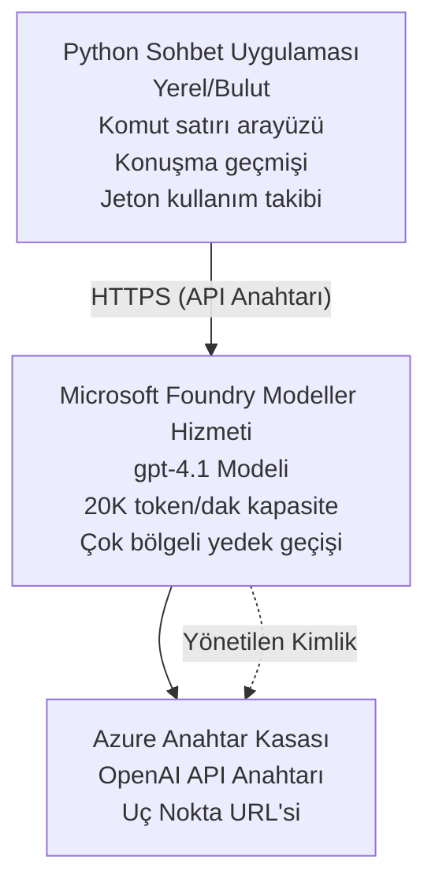

# Microsoft Foundry Models Chat Application

**Learning Path:** Intermediate ⭐⭐ | **Time:** 35-45 minutes | **Cost:** $50-200/month

Azure Developer CLI (azd) kullanılarak dağıtılmış eksiksiz bir Microsoft Foundry Models sohbet uygulaması. Bu örnek, gpt-4.1 dağıtımını, güvenli API erişimini ve basit bir sohbet arayüzünü gösterir.

## 🎯 What You'll Learn

- gpt-4.1 modeli ile Microsoft Foundry Models Service dağıtımı
- OpenAI API anahtarlarını Key Vault ile güvence altına alma
- Python ile basit bir sohbet arayüzü oluşturma
- Token kullanımını ve maliyetleri izleme
- Hız sınırlama ve hata yönetimi uygulama

## 📦 What's Included

✅ **Microsoft Foundry Models Service** - gpt-4.1 model dağıtımı  
✅ **Python Chat App** - Basit komut satırı sohbet arayüzü  
✅ **Key Vault Integration** - API anahtarlarının güvenli depolanması  
✅ **ARM Templates** - Altyapı kodu olarak tam şablonlar  
✅ **Cost Monitoring** - Token kullanım takibi  
✅ **Rate Limiting** - Kota tükenmesini önleme  

## Architecture


## Prerequisites

### Required

- **Azure Developer CLI (azd)** - [Kurulum kılavuzu](https://learn.microsoft.com/azure/developer/azure-developer-cli/install-azd)
- **Azure subscription** with OpenAI access - [Request access](https://aka.ms/oai/access)
- **Python 3.9+** - [Install Python](https://www.python.org/downloads/)

### Verify Prerequisites

```bash
# azd sürümünü kontrol edin (1.5.0 veya daha yüksek gerekir)
azd version

# Azure girişini doğrulayın
azd auth login

# Python sürümünü kontrol edin
python --version  # veya python3 --version

# OpenAI erişimini doğrulayın (Azure Portal'da kontrol edin)
az cognitiveservices account list-skus \
  --kind OpenAI \
  --location eastus
```

> **⚠️ Important:** Microsoft Foundry Models requires application approval. If you haven't applied, visit [aka.ms/oai/access](https://aka.ms/oai/access). Approval typically takes 1-2 business days.

## ⏱️ Deployment Timeline

| Phase | Duration | What Happens |
|-------|----------|--------------|
| Prerequisites check | 2-3 minutes | Verify OpenAI quota availability |
| Deploy infrastructure | 8-12 minutes | Create OpenAI, Key Vault, model deployment |
| Configure application | 2-3 minutes | Set up environment and dependencies |
| **Total** | **12-18 minutes** | Ready to chat with gpt-4.1 |

**Note:** First-time OpenAI deployment may take longer due to model provisioning.

## Quick Start

```bash
# Örneğe gidin
cd examples/azure-openai-chat

# Ortamı başlatın
azd env new myopenai

# Her şeyi dağıtın (altyapı + yapılandırma)
azd up
# Sizden şunlar istenecek:
# 1. Azure aboneliği seçin
# 2. OpenAI kullanılabilirliği olan konumu seçin (örn., eastus, eastus2, westus)
# 3. Dağıtım için 12-18 dakika bekleyin

# Python bağımlılıklarını yükleyin
pip install -r requirements.txt

# Sohbete başlayın!
python chat.py
```

**Expected Output:**
```
🤖 Microsoft Foundry Models Chat Application
Connected to: gpt-4.1 (eastus)
Type your message (or 'quit' to exit)

You: Hello! Tell me about Microsoft Foundry Models.
Assistant: Microsoft Foundry Models Service provides REST API access to OpenAI's powerful language models including gpt-4.1, GPT-3.5-Turbo, and Embeddings...

[Tokens used: 145 | Estimated cost: $0.0044]
```

## ✅ Verify Deployment

### Step 1: Check Azure Resources

```bash
# Dağıtılan kaynakları görüntüleyin
azd show

# Beklenen çıktı şunları gösterir:
# - OpenAI Hizmeti: (kaynak adı)
# - Anahtar Kasası: (kaynak adı)
# - Dağıtım: gpt-4.1
# - Bölge: eastus (veya seçtiğiniz bölge)
```

### Step 2: Test OpenAI API

```bash
# OpenAI uç noktasını ve anahtarını al
OPENAI_ENDPOINT=$(azd env get-value AZURE_OPENAI_ENDPOINT)
OPENAI_KEY=$(azd env get-value AZURE_OPENAI_API_KEY)

# API çağrısını test et
curl "$OPENAI_ENDPOINT/openai/deployments/gpt-4.1/chat/completions?api-version=2024-08-01-preview" \
  -H "Content-Type: application/json" \
  -H "api-key: $OPENAI_KEY" \
  -d '{
    "messages": [{"role": "user", "content": "Say hello!"}],
    "max_tokens": 50
  }'
```

**Expected Response:**
```json
{
  "choices": [
    {
      "message": {
        "role": "assistant",
        "content": "Hello! How can I assist you today?"
      }
    }
  ],
  "usage": {
    "prompt_tokens": 8,
    "completion_tokens": 9,
    "total_tokens": 17
  }
}
```

### Step 3: Verify Key Vault Access

```bash
# Key Vault'taki sırları listele
KV_NAME=$(azd env get-value AZURE_KEY_VAULT_NAME)

az keyvault secret list \
  --vault-name $KV_NAME \
  --query "[].name" \
  --output table
```

**Expected Secrets:**
- `openai-api-key`
- `openai-endpoint`

**Success Criteria:**
- ✅ OpenAI service deployed with gpt-4.1
- ✅ API call returns valid completion
- ✅ Secrets stored in Key Vault
- ✅ Token usage tracking works

## Project Structure

```
azure-openai-chat/
├── README.md                   ✅ This guide
├── azure.yaml                  ✅ AZD configuration
├── infra/                      ✅ Infrastructure as Code
│   ├── main.bicep             ✅ Main Bicep template
│   ├── main.parameters.json   ✅ Parameters
│   └── openai.bicep           ✅ OpenAI resource definition
├── src/                        ✅ Application code
│   ├── chat.py                ✅ Chat interface
│   ├── config.py              ✅ Configuration loader
│   └── requirements.txt       ✅ Python dependencies
└── .gitignore                  ✅ Git ignore rules
```

## Application Features

### Chat Interface (`chat.py`)

Sohbet uygulaması şunları içerir:

- **Conversation History** - Mesajlar arasında bağlamı korur
- **Token Counting** - Kullanımı izler ve maliyet tahmini yapar
- **Error Handling** - Hız limitleri ve API hatalarını zarifçe ele alır
- **Cost Estimation** - Mesaj başına gerçek zamanlı maliyet hesaplama
- **Streaming Support** - Opsiyonel akış yanıtları

### Commands

Sohbet sırasında kullanabileceğiniz komutlar:
- `quit` or `exit` - Oturumu sonlandırır
- `clear` - Konuşma geçmişini temizler
- `tokens` - Toplam token kullanımını gösterir
- `cost` - Tahmini toplam maliyeti gösterir

### Configuration (`config.py`)

Ortam değişkenlerinden yapılandırmayı yükler:
```python
AZURE_OPENAI_ENDPOINT  # Anahtar Kasasından
AZURE_OPENAI_API_KEY   # Anahtar Kasasından
AZURE_OPENAI_MODEL     # Varsayılan: gpt-4.1
AZURE_OPENAI_MAX_TOKENS # Varsayılan: 800
```

## Usage Examples

### Basic Chat

```bash
python chat.py
```

### Chat with Custom Model

```bash
export AZURE_OPENAI_MODEL=gpt-35-turbo
python chat.py
```

### Chat with Streaming

```bash
python chat.py --stream
```

### Example Conversation

```
You: Explain Microsoft Foundry Models Service in 3 sentences.
Assistant: Microsoft Foundry Models Service is Microsoft Azure's cloud platform offering 
that provides access to OpenAI's powerful language models. It enables developers 
to integrate capabilities like gpt-4.1 into their applications with enterprise-grade 
security and compliance. The service includes features for content filtering, 
abuse monitoring, and responsible AI practices.

[Tokens used: 89 | Estimated cost: $0.0027]

You: What models are available?
Assistant: Microsoft Foundry Models Service offers several model families including gpt-4.1 
(most capable), GPT-3.5-Turbo (faster and cost-effective), and Embeddings models 
for vector search. Each model has different capabilities, pricing, and token limits.

[Tokens used: 67 | Estimated cost: $0.0020]

Total session: 156 tokens | $0.0047
```

## Cost Management

### Token Pricing (gpt-4.1)

| Model | Input (per 1K tokens) | Output (per 1K tokens) |
|-------|----------------------|------------------------|
| gpt-4.1 | $0.03 | $0.06 |
| GPT-3.5-Turbo | $0.0015 | $0.002 |

### Estimated Monthly Costs

Based on usage patterns:

| Usage Level | Messages/Day | Tokens/Day | Monthly Cost |
|-------------|--------------|------------|--------------|
| **Light** | 20 messages | 3,000 tokens | $3-5 |
| **Moderate** | 100 messages | 15,000 tokens | $15-25 |
| **Heavy** | 500 messages | 75,000 tokens | $75-125 |

**Base Infrastructure Cost:** $1-2/month (Key Vault + minimal compute)

### Cost Optimization Tips

```bash
# 1. Daha basit görevler için GPT-3.5-Turbo'yu kullanın (20 kat daha ucuz)
export AZURE_OPENAI_MODEL=gpt-35-turbo

# 2. Daha kısa yanıtlar için maksimum token sayısını azaltın
export AZURE_OPENAI_MAX_TOKENS=400

# 3. Token kullanımını izleyin
python chat.py --show-tokens

# 4. Bütçe uyarıları ayarlayın
az consumption budget create \
  --budget-name "openai-budget" \
  --amount 50 \
  --time-grain Monthly
```

## Monitoring

### View Token Usage

```bash
# Azure Portal'da:
# OpenAI Kaynağı → Metrikler → "Token Transaction" seçin

# Veya Azure CLI ile:
az monitor metrics list \
  --resource $(azd env get-value AZURE_OPENAI_RESOURCE_ID) \
  --metric "TokenTransaction" \
  --start-time $(date -u -d '1 hour ago' '+%Y-%m-%dT%H:%M:%S') \
  --interval PT1M
```

### View API Logs

```bash
# Akış tanılama günlükleri
az monitor diagnostic-settings create \
  --resource $(azd env get-value AZURE_OPENAI_RESOURCE_ID) \
  --name openai-logs \
  --logs '[{"category": "Audit", "enabled": true}]' \
  --workspace $(azd env get-value LOG_ANALYTICS_WORKSPACE_ID)

# Sorgu günlükleri
az monitor log-analytics query \
  --workspace $(azd env get-value LOG_ANALYTICS_WORKSPACE_ID) \
  --analytics-query "AzureDiagnostics | where Category == 'Audit' | top 10 by TimeGenerated"
```

## Troubleshooting

### Issue: "Access Denied" Error

**Symptoms:** 403 Forbidden when calling API

**Solutions:**
```bash
# 1. OpenAI erişiminin onaylandığını doğrulayın
az cognitiveservices account show \
  --name $(azd env get-value AZURE_OPENAI_NAME) \
  --resource-group $(azd env get-value AZURE_RESOURCE_GROUP)

# 2. API anahtarının doğru olduğunu kontrol edin
azd env get-value AZURE_OPENAI_API_KEY

# 3. Uç nokta URL biçimini doğrulayın
azd env get-value AZURE_OPENAI_ENDPOINT
# Şu şekilde olmalıdır: https://[name].openai.azure.com/
```

### Issue: "Rate Limit Exceeded"

**Symptoms:** 429 Too Many Requests

**Solutions:**
```bash
# 1. Mevcut kotayı kontrol edin
az cognitiveservices account deployment show \
  --name $(azd env get-value AZURE_OPENAI_NAME) \
  --resource-group $(azd env get-value AZURE_RESOURCE_GROUP) \
  --deployment-name gpt-4.1

# 2. Kota artışı talep edin (gerekirse)
# Azure Portal'a gidin → OpenAI Kaynağı → Kotalar → Artış Talep Et

# 3. Yeniden deneme mantığını uygulayın (zaten chat.py'de)
# Uygulama otomatik olarak üstel geri çekilme ile yeniden dener
```

### Issue: "Model Not Found"

**Symptoms:** 404 error for deployment

**Solutions:**
```bash
# 1. Kullanılabilir dağıtımları listele
az cognitiveservices account deployment list \
  --name $(azd env get-value AZURE_OPENAI_NAME) \
  --resource-group $(azd env get-value AZURE_RESOURCE_GROUP)

# 2. Ortamda model adını doğrulayın
echo $AZURE_OPENAI_MODEL

# 3. Doğru dağıtım adına güncelleyin
export AZURE_OPENAI_MODEL=gpt-4.1  # veya gpt-35-turbo
```

### Issue: High Latency

**Symptoms:** Slow response times (>5 seconds)

**Solutions:**
```bash
# 1. Bölgesel gecikmeyi kontrol edin
# Kullanıcılara en yakın bölgeye dağıtın

# 2. Daha hızlı yanıtlar için max_tokens değerini azaltın
export AZURE_OPENAI_MAX_TOKENS=400

# 3. Daha iyi kullanıcı deneyimi için akış (streaming) kullanın
python chat.py --stream
```

## Security Best Practices

### 1. Protect API Keys

```bash
# Anahtarları asla kaynak kontrolüne eklemeyin
# Key Vault kullanın (zaten yapılandırıldı)

# Anahtarları düzenli olarak değiştirin
az cognitiveservices account keys regenerate \
  --name $(azd env get-value AZURE_OPENAI_NAME) \
  --resource-group $(azd env get-value AZURE_RESOURCE_GROUP) \
  --key-name key1
```

### 2. Implement Content Filtering

```python
# Microsoft Foundry Modelleri yerleşik içerik filtrelemesine sahiptir
# Azure Portal'da yapılandırın:
# OpenAI Kaynağı → İçerik Filtreleri → Özel Filtre Oluştur

# Kategoriler: Nefret, Cinsel, Şiddet, Kendine Zarar
# Düzeyler: Düşük, Orta, Yüksek filtreleme
```

### 3. Use Managed Identity (Production)

```bash
# Üretim dağıtımları için yönetilen kimlik kullanın
# API anahtarları yerine (Azure'da uygulama barındırmayı gerektirir)

# infra/openai.bicep dosyasını şunu içerecek şekilde güncelle:
# identity: { type: 'SystemAssigned' }
```

## Development

### Run Locally

```bash
# Bağımlılıkları yükle
pip install -r src/requirements.txt

# Ortam değişkenlerini ayarla
export AZURE_OPENAI_ENDPOINT="https://[name].openai.azure.com/"
export AZURE_OPENAI_API_KEY="your-api-key"
export AZURE_OPENAI_MODEL="gpt-4.1"

# Uygulamayı çalıştır
python src/chat.py
```

### Run Tests

```bash
# Test bağımlılıklarını yükle
pip install pytest pytest-cov

# Testleri çalıştır
pytest tests/ -v

# Kapsam ile
pytest tests/ --cov=src --cov-report=html
```

### Update Model Deployment

```bash
# Farklı bir model sürümünü dağıt
az cognitiveservices account deployment create \
  --name $(azd env get-value AZURE_OPENAI_NAME) \
  --resource-group $(azd env get-value AZURE_RESOURCE_GROUP) \
  --deployment-name gpt-35-turbo \
  --model-name gpt-35-turbo \
  --model-version "0613" \
  --model-format OpenAI \
  --sku-capacity 20 \
  --sku-name "Standard"
```

## Clean Up

```bash
# Tüm Azure kaynaklarını silin
azd down --force --purge

# Bu şunları kaldırır:
# - OpenAI Hizmeti
# - Key Vault (90 günlük yumuşak silme ile)
# - Kaynak Grubu
# - Tüm dağıtımlar ve yapılandırmalar
```

## Next Steps

### Expand This Example

1. **Add Web Interface** - Build React/Vue frontend
   ```bash
   # Ön uç servisini azure.yaml dosyasına ekle
   # Azure Static Web Apps'e dağıt
   ```

2. **Implement RAG** - Add document search with Azure AI Search
   ```python
   # Azure Cognitive Search'i entegre edin
   # Belgeleri yükleyin ve vektör dizini oluşturun
   ```

3. **Add Function Calling** - Enable tool use
   ```python
   # chat.py içinde fonksiyonları tanımlayın
   # gpt-4.1'in harici API'leri çağırmasına izin verin
   ```

4. **Multi-Model Support** - Deploy multiple models
   ```bash
   # gpt-35-turbo ve embedding modellerini ekle
   # Model yönlendirme mantığını uygula
   ```

### Related Examples

- **[Retail Multi-Agent](../retail-scenario.md)** - Gelişmiş çok ajanlı mimari
- **[Database App](../../../../examples/database-app)** - Kalıcı depolama ekleyin
- **[Container Apps](../../../../examples/container-app)** - Konteyner olarak hizmete dağıtın

### Learning Resources

- 📚 [AZD For Beginners Course](../../README.md) - Ana kurs ana sayfası
- 📚 [Microsoft Foundry Models Documentation](https://learn.microsoft.com/azure/ai-services/openai/) - Resmi dokümantasyon
- 📚 [OpenAI API Reference](https://platform.openai.com/docs/api-reference) - API ayrıntıları
- 📚 [Responsible AI](https://www.microsoft.com/ai/responsible-ai) - En iyi uygulamalar

## Additional Resources

### Documentation
- **[Microsoft Foundry Models Service](https://learn.microsoft.com/azure/ai-services/openai/)** - Tam kılavuz
- **[gpt-4.1 Models](https://learn.microsoft.com/azure/ai-services/openai/concepts/models)** - Model yetenekleri
- **[Content Filtering](https://learn.microsoft.com/azure/ai-services/openai/concepts/content-filter)** - Güvenlik özellikleri
- **[Azure Developer CLI](https://learn.microsoft.com/azure/developer/azure-developer-cli/)** - azd referansı

### Tutorials
- **[OpenAI Quickstart](https://learn.microsoft.com/azure/ai-services/openai/quickstart)** - İlk dağıtım
- **[Chat Completions](https://learn.microsoft.com/azure/ai-services/openai/how-to/chatgpt)** - Sohbet uygulamaları oluşturma
- **[Function Calling](https://learn.microsoft.com/azure/ai-services/openai/how-to/function-calling)** - Gelişmiş özellikler

### Tools
- **[Microsoft Foundry Models Studio](https://oai.azure.com/)** - Web tabanlı oyun alanı
- **[Prompt Engineering Guide](https://platform.openai.com/docs/guides/prompt-engineering)** - Daha iyi istemler yazma
- **[Token Calculator](https://platform.openai.com/tokenizer)** - Token kullanımını tahmin etme

### Community
- **[Azure AI Discord](https://discord.gg/azure)** - Topluluktan yardım alın
- **[GitHub Discussions](https://github.com/Azure-Samples/openai/discussions)** - Soru-cevap forumu
- **[Azure Blog](https://azure.microsoft.com/blog/tag/azure-openai-service/)** - En son güncellemeler

---

**🎉 Success!** You've deployed Microsoft Foundry Models and built a working chat application. Start exploring gpt-4.1's capabilities and experiment with different prompts and use cases.

**Questions?** [Open an issue](https://github.com/microsoft/AZD-for-beginners/issues) or check the [FAQ](../../resources/faq.md)

**Cost Alert:** Remember to run `azd down` when done testing to avoid ongoing charges (~$50-100/month for active usage).

---

<!-- CO-OP TRANSLATOR DISCLAIMER START -->
**Disclaimer**:
Bu belge AI çeviri hizmeti [Co-op Translator](https://github.com/Azure/co-op-translator) kullanılarak çevrilmiştir. Doğruluk için çaba göstersek de, otomatik çevirilerin hatalar veya yanlışlıklar içerebileceğini lütfen göz önünde bulundurun. Orijinal belge kendi dilinde yetkili kaynak olarak kabul edilmelidir. Kritik bilgiler için profesyonel insan çevirisi önerilir. Bu çevirinin kullanımı sonucu ortaya çıkabilecek herhangi bir yanlış anlama veya yanlış yorumlamadan sorumlu değiliz.
<!-- CO-OP TRANSLATOR DISCLAIMER END -->