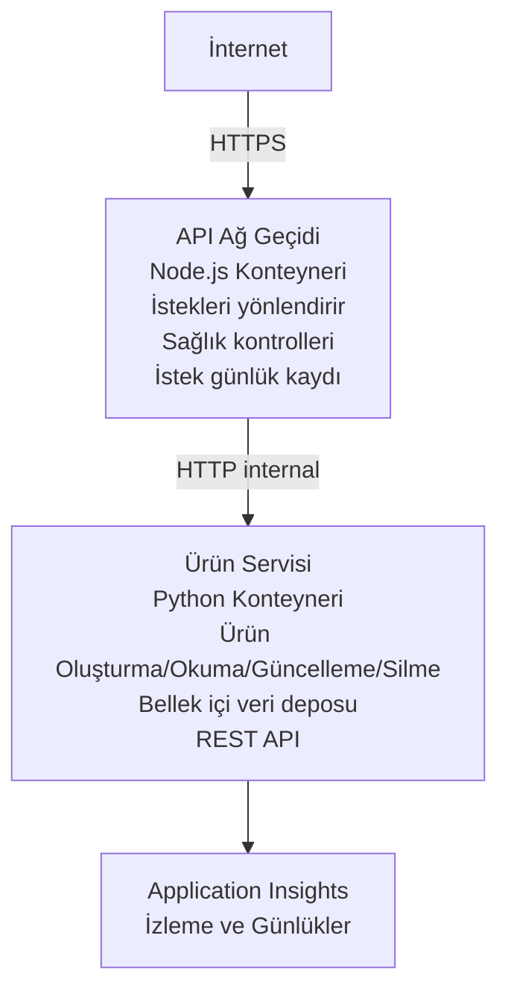

# Mikroservis Mimarisi - Container App Örneği

⏱️ **Tahmini Süre**: 25-35 dakika | 💰 **Tahmini Maliyet**: ~$50-100/ay | ⭐ **Zorluk**: İleri

Azure Container Apps'e AZD CLI kullanılarak dağıtılmış, **basit ama işlevsel** bir mikroservis mimarisi. Bu örnek, pratik bir 2-servis kurulumu ile servisler arası iletişim, konteyner orkestrasyonu ve izlemeyi gösterir.

> **📚 Öğrenme Yaklaşımı**: Bu örnek, gerçekten dağıtabileceğiniz ve öğrenebileceğiniz minimal bir 2-servis mimarisiyle (API Gateway + Backend Servis) başlar. Bu temel üzerinde ustalaştıktan sonra tam bir mikroservis ekosistemine genişleme için rehberlik sağlıyoruz.

## Neler Öğreneceksiniz

Bu örneği tamamlayarak:
- Birden çok konteyneri Azure Container Apps'e dağıtmayı öğreneceksiniz
- Dahili ağ ile servisler arası iletişimi uygulayacaksınız
- Ortama bağlı ölçeklendirme ve sağlık kontrolleri yapılandıracaksınız
- Application Insights ile dağıtık uygulamaları izleyeceksiniz
- Mikroservis dağıtım desenleri ve en iyi uygulamaları anlayacaksınız
- Basitten karmaşığa kademeli genişlemeyi öğreneceksiniz

## Mimari

### Aşama 1: Ne İnşa Ediyoruz (Bu Örnekte Dahil)


**Neden Basit Başlamalıyız?**
- ✅ Hızlı dağıtım ve anlayış (25-35 dakika)
- ✅ Karmaşıklık olmadan temel mikroservis desenlerini öğrenme
- ✅ Değiştirip deneyebileceğiniz çalışan kod
- ✅ Öğrenme maliyeti daha düşük (~$50-100/ay vs $300-1400/ay)
- ✅ Veritabanları ve mesaj kuyruğu eklemeden önce güven kazanma

**Benzetme**: Bunu araba öğrenmeye benzetin. Boş bir otoparkta (2 servis) başlarsınız, temelleri öğrenirsiniz, sonra şehir trafiğine (veritabanlı 5+ servis) geçersiniz.

### Aşama 2: Gelecekte Genişleme (Referans Mimari)

Bir kez 2-servis mimarisinde ustalaştığınızda, genişletebilirsiniz:

```
Full Architecture (Not Included - For Reference)
├── API Gateway (✅ Included)
├── Product Service (✅ Included)
├── Order Service (🔜 Add next)
├── User Service (🔜 Add next)
├── Notification Service (🔜 Add last)
├── Azure Service Bus (🔜 For async communication)
├── Cosmos DB (🔜 For product persistence)
├── Azure SQL (🔜 For order management)
└── Azure Storage (🔜 For file storage)
```

Adım adım talimatlar için sonunda yer alan "Genişleme Rehberi" bölümüne bakın.

## Dahil Özellikler

✅ **Servis Keşfi**: Konteynerler arasında otomatik DNS tabanlı keşif  
✅ **Yük Dengeleme**: Kopyalar arasında yerleşik yük dengeleme  
✅ **Otomatik Ölçeklendirme**: HTTP isteklerine göre servis başına bağımsız ölçeklendirme  
✅ **Sağlık İzleme**: Her iki servis için liveness ve readiness probe'ları  
✅ **Dağıtık Günlükleme**: Application Insights ile merkezi günlükleme  
✅ **Dahili Ağ**: Güvenli servisler arası iletişim  
✅ **Konteyner Orkestrasyonu**: Otomatik dağıtım ve ölçeklendirme  
✅ **Sıfır Kesinti Güncellemeleri**: Revizyon yönetimi ile rolling update'ler  

## Önkoşullar

### Gerekli Araçlar

Başlamadan önce bu araçların yüklü olduğundan emin olun:

1. **[Azure Geliştirici CLI (azd)](https://learn.microsoft.com/azure/developer/azure-developer-cli/install-azd)** (sürüm 1.0.0 veya üstü)
   ```bash
   azd version
   # Beklenen çıktı: azd sürüm 1.0.0 veya daha yüksek
   ```

2. **[Azure CLI](https://learn.microsoft.com/cli/azure/install-azure-cli)** (sürüm 2.50.0 veya üstü)
   ```bash
   az --version
   # Beklenen çıktı: azure-cli 2.50.0 veya daha yüksek
   ```

3. **[Docker](https://www.docker.com/get-started)** (yerel geliştirme/test için - isteğe bağlı)
   ```bash
   docker --version
   # Beklenen çıktı: Docker sürümü 20.10 veya daha yeni
   ```

### Azure Gereksinimleri

- Aktif bir **Azure aboneliği** ([ücretsiz hesap oluşturun](https://azure.microsoft.com/free/))
- Aboneliğinizde kaynak oluşturma izinleri
- Abonelikte veya kaynak grubunda **Contributor** rolü

### Bilgi Önkoşulları

Bu bir **ileri seviye** örnektir. Aşağıdakilere sahip olmalısınız:
- [Basit Flask API örneğini tamamlamış olmak](../../../../../examples/container-app/simple-flask-api) 
- Mikroservis mimarisi hakkında temel anlayış
- REST API'ler ve HTTP hakkında aşinalık
- Konteyner kavramları hakkında anlayış

**Container Apps'e yeni misiniz?** Temelleri öğrenmek için önce [Basit Flask API örneği](../../../../../examples/container-app/simple-flask-api) ile başlayın.

## Hızlı Başlangıç (Adım Adım)

### Adım 1: Klonlayın ve Gezin

```bash
git clone https://github.com/microsoft/AZD-for-beginners.git
cd AZD-for-beginners/examples/container-app/microservices
```

**✓ Başarı Kontrolü**: `azure.yaml` dosyasını gördüğünüzü doğrulayın:
```bash
ls
# Beklenen: README.md, azure.yaml, infra/, src/
```

### Adım 2: Azure ile Kimlik Doğrulama

```bash
azd auth login
```

Bu, Azure kimlik doğrulaması için tarayıcınızı açar. Azure kimlik bilgilerinizle oturum açın.

**✓ Başarı Kontrolü**: Şunları görmelisiniz:
```
Logged in to Azure.
```

### Adım 3: Ortamı Başlatma

```bash
azd init
```

**Göreceğiniz istemler**:
- **Ortam adı**: Kısa bir ad girin (örn., `microservices-dev`)
- **Azure aboneliği**: Aboneliğinizi seçin
- **Azure bölgesi**: Bir bölge seçin (örn., `eastus`, `westeurope`)

**✓ Başarı Kontrolü**: Şunları görmelisiniz:
```
SUCCESS: New project initialized!
```

### Adım 4: Altyapıyı ve Servisleri Dağıtma

```bash
azd up
```

**Ne olur** (8-12 dakika sürer):
1. Container Apps ortamı oluşturulur
2. İzleme için Application Insights oluşturulur
3. API Gateway konteyneri (Node.js) derlenir
4. Product Service konteyneri (Python) derlenir
5. Her iki konteyner Azure'a dağıtılır
6. Ağ ve sağlık kontrolleri yapılandırılır
7. İzleme ve günlükleme ayarlanır

**✓ Başarı Kontrolü**: Şunları görmelisiniz:
```
SUCCESS: Your application was deployed to Azure in X minutes Y seconds.
Endpoint: https://api-gateway-<unique-id>.azurecontainerapps.io
```

**⏱️ Süre**: 8-12 dakika

### Adım 5: Dağıtımı Test Etme

```bash
# Ağ geçidi uç noktasını al
GATEWAY_URL=$(azd env get-values | grep API_GATEWAY_URL | cut -d '=' -f2 | tr -d '"')

# API Gateway sağlığını test et
curl $GATEWAY_URL/health

# Beklenen çıktı:
# {"status":"sağlıklı","service":"api-gateway","timestamp":"2025-11-19T10:30:00Z"}
```

**Ürün servisini gateway üzerinden test et**:
```bash
# Ürünleri listele
curl $GATEWAY_URL/api/products

# Beklenen çıktı:
# [
#   {"id":1,"name":"Dizüstü Bilgisayar","price":999.99,"stock":50},
#   {"id":2,"name":"Fare","price":29.99,"stock":200},
#   {"id":3,"name":"Klavye","price":79.99,"stock":150}
# ]
```

**✓ Başarı Kontrolü**: Her iki uçnokta da hatasız JSON veri döndürmelidir.

---

**🎉 Tebrikler!** Bir mikroservis mimarisini Azure'a dağıttınız!

## Proje Yapısı

Tüm uygulama dosyaları dahil—bu eksiksiz, çalışan bir örnektir:

```
microservices/
│
├── README.md                         # This file
├── azure.yaml                        # AZD configuration
├── .gitignore                        # Git ignore patterns
│
├── infra/                           # Infrastructure as Code (Bicep)
│   ├── main.bicep                   # Main orchestration
│   ├── abbreviations.json           # Naming conventions
│   ├── core/                        # Shared infrastructure
│   │   ├── container-apps-environment.bicep  # Container environment + registry
│   │   └── monitor.bicep            # Application Insights + Log Analytics
│   └── app/                         # Service definitions
│       ├── api-gateway.bicep        # API Gateway container app
│       └── product-service.bicep    # Product Service container app
│
└── src/                             # Application source code
    ├── api-gateway/                 # Node.js API Gateway
    │   ├── app.js                   # Express server with routing
    │   ├── package.json             # Node dependencies
    │   └── Dockerfile               # Container definition
    └── product-service/             # Python Product Service
        ├── main.py                  # Flask API with product data
        ├── requirements.txt         # Python dependencies
        └── Dockerfile               # Container definition
```

**Her Bileşen Ne Yapar:**

**Altyapı (infra/)**:
- `main.bicep`: Tüm Azure kaynaklarını ve bağımlılıklarını orkestre eder
- `core/container-apps-environment.bicep`: Container Apps ortamını ve Azure Container Registry'i oluşturur
- `core/monitor.bicep`: Dağıtık günlükleme için Application Insights'ı ayarlar
- `app/*.bicep`: Ölçeklendirme ve sağlık kontrolleri ile bireysel container app tanımları

**API Gateway (src/api-gateway/)**:
- İstekleri arka uç servislere yönlendiren dışa açık servis
- Günlükleme, hata yönetimi ve istek iletmeyi uygular
- Servisler arası HTTP iletişimini gösterir

**Ürün Servisi (src/product-service/)**:
- Ürün kataloğuna sahip dahili servis (basitlik için bellek içi)
- Sağlık kontrolleri ile REST API
- Arka uç mikroservis deseni örneği

## Servisler Genel Bakış

### API Gateway (Node.js/Express)

**Port**: 8080  
**Erişim**: Dışa açık (harici ingress)  
**Amaç**: Gelen istekleri uygun arka uç servislerine yönlendirir  

**Uç Noktalar**:
- `GET /` - Servis bilgisi
- `GET /health` - Sağlık kontrol uç noktası
- `GET /api/products` - Ürün servisine ilet (tümünü listele)
- `GET /api/products/:id` - Ürün servisine ilet (ID ile getir)

**Temel Özellikler**:
- axios ile istek yönlendirme
- Merkezi günlükleme
- Hata yönetimi ve zaman aşımı yönetimi
- Ortam değişkenleri aracılığıyla servis keşfi
- Application Insights entegrasyonu

**Kod Örneği** (`src/api-gateway/app.js`):
```javascript
// Servis içi iletişim
app.get('/api/products', async (req, res) => {
  const response = await axios.get(`${PRODUCT_SERVICE_URL}/products`);
  res.json(response.data);
});
```

### Ürün Servisi (Python/Flask)

**Port**: 8000  
**Erişim**: Yalnızca dahili (harici ingress yok)  
**Amaç**: Bellek içi veri ile ürün kataloğunu yönetir  

**Uç Noktalar**:
- `GET /` - Servis bilgisi
- `GET /health` - Sağlık kontrol uç noktası
- `GET /products` - Tüm ürünleri listele
- `GET /products/<id>` - ID ile ürünü getir

**Temel Özellikler**:
- Flask ile RESTful API
- Bellek içi ürün deposu (basit, veritabanı gerektirmez)
- Probe'lar ile sağlık izleme
- Yapılandırılmış günlükleme
- Application Insights entegrasyonu

**Veri Modeli**:
```python
{
  "id": 1,
  "name": "Laptop",
  "description": "High-performance laptop",
  "price": 999.99,
  "stock": 50
}
```

**Neden Yalnızca Dahili?**
Ürün servisi herkese açık değildir. Tüm istekler API Gateway üzerinden gitmelidir; bu da sağlar:
- Güvenlik: Kontrol edilen erişim noktası
- Esneklik: Arka ucu değiştirebilme, istemcileri etkilemeden
- İzleme: Merkezi istek günlükleme

## Servis İletişimini Anlama

### Servisler Birbiriyle Nasıl İletişim Kurar

Bu örnekte, API Gateway Ürün Servisi ile **dahili HTTP çağrıları** kullanarak iletişim kurar:

```javascript
// API Ağ Geçidi (src/api-gateway/app.js)
const PRODUCT_SERVICE_URL = process.env.PRODUCT_SERVICE_URL;

// Dahili bir HTTP isteği yap
const response = await axios.get(`${PRODUCT_SERVICE_URL}/products`);
```

**Önemli Noktalar**:

1. **DNS Tabanlı Keşif**: Container Apps otomatik olarak dahili servisler için DNS sağlar
   - Product Service FQDN: `product-service.internal.<environment>.azurecontainerapps.io`
   - Basitleştirilmiş: `http://product-service` (Container Apps bunu çözer)

2. **Herkese Açık Maruz Kalma Yok**: Ürün Servisi Bicep'te `external: false` olarak ayarlanmıştır
   - Sadece Container Apps ortamı içinde erişilebilir
   - İnternetten ulaşılamaz

3. **Ortam Değişkenleri**: Servis URL'leri dağıtım zamanında enjekte edilir
   - Bicep, gateway'e dahili FQDN'i geçirir
   - Uygulama kodunda sabitlenmiş URL yoktur

**Benzetme**: Bunu ofis odalarına benzetin. API Gateway resepsiyon masasıdır (dışa açık) ve Ürün Servisi bir ofis odasıdır (yalnızca dahili). Ziyaretçiler bir odaya ulaşmak için resepsiyondan geçmelidir.

## Dağıtım Seçenekleri

### Tam Dağıtım (Önerilen)

```bash
# Altyapıyı ve her iki servisi dağıtın
azd up
```

Bu dağıtır:
1. Container Apps ortamı
2. Application Insights
3. Container Registry
4. API Gateway konteyneri
5. Ürün Servisi konteyneri

**Süre**: 8-12 dakika

### Bireysel Servisi Dağıtma

```bash
# Sadece bir hizmet dağıtın (ilk azd up'tan sonra)
azd deploy api-gateway

# Ya da ürün hizmetini dağıtın
azd deploy product-service
```

**Kullanım Durumu**: Bir serviste kodu güncellediğinizde sadece o servisi yeniden dağıtmak istediğinizde kullanın.

### Yapılandırmayı Güncelleme

```bash
# Ölçeklendirme parametrelerini değiştir
azd env set GATEWAY_MAX_REPLICAS 30

# Yeni yapılandırma ile yeniden dağıt
azd up
```

## Yapılandırma

### Ölçeklendirme Yapılandırması

Her iki servis de Bicep dosyalarında HTTP tabanlı otomatik ölçeklendirme ile yapılandırılmıştır:

**API Gateway**:
- Minimum replika: 2 (erişilebilirlik için her zaman en az 2)
- Maksimum replika: 20
- Ölçek tetikleyici: replika başına 50 eşzamanlı istek

**Ürün Servisi**:
- Minimum replika: 1 (gerekirse sıfıra ölçeklenebilir)
- Maksimum replika: 10
- Ölçek tetikleyici: replika başına 100 eşzamanlı istek

**Ölçeklendirmeyi Özelleştir** (`infra/app/*.bicep` içinde):
```bicep
scale: {
  minReplicas: 1
  maxReplicas: 10
  rules: [
    {
      name: 'http-scale-rule'
      http: {
        metadata: {
          concurrentRequests: '100'  // Adjust this
        }
      }
    }
  ]
}
```

### Kaynak Tahsisi

**API Gateway**:
- CPU: 1.0 vCPU
- Bellek: 2 GiB
- Sebep: Tüm dış trafiği yönlendirir

**Ürün Servisi**:
- CPU: 0.5 vCPU
- Bellek: 1 GiB
- Sebep: Bellek içi hafif işlemler

### Sağlık Kontrolleri

Her iki servis de liveness ve readiness probe'ları içerir:

```bicep
probes: [
  {
    type: 'Liveness'
    httpGet: {
      path: '/health'
      port: 8080
    }
    initialDelaySeconds: 10
    periodSeconds: 30
  }
  {
    type: 'Readiness'
    httpGet: {
      path: '/health'
      port: 8080
    }
    initialDelaySeconds: 5
    periodSeconds: 10
  }
]
```

**Bu Ne Anlama Geliyor**:
- **Liveness**: Sağlık kontrolü başarısız olursa, Container Apps konteyneri yeniden başlatır
- **Readiness**: Hazır değilse, Container Apps o replikaya trafik yönlendirmeyi durdurur


## İzleme ve Gözlemlenebilirlik

### Servis Günlüklerini Görüntüleme

```bash
# azd monitor kullanarak günlükleri görüntüleyin
azd monitor --logs

# Veya belirli Container Apps için Azure CLI'yi kullanın:
# API Gateway'den günlükleri akış halinde görüntüleyin
az containerapp logs show --name api-gateway --resource-group $RG_NAME --follow

# Ürün servisinin son günlüklerini görüntüleyin
az containerapp logs show --name product-service --resource-group $RG_NAME --tail 100
```

**Beklenen Çıktı**:
```
[api-gateway] API Gateway listening on port 8080
[api-gateway] Product Service URL: http://product-service
[api-gateway] GET /api/products 200 - 45ms
[product-service] Retrieved 5 products
```

### Application Insights Sorguları

Azure Portal'da Application Insights'a erişin, ardından bu sorguları çalıştırın:

**Yavaş İstekleri Bul**:
```kusto
requests
| where timestamp > ago(1h)
| where duration > 1000  // Requests taking >1 second
| summarize count() by name, cloud_RoleName
| order by count_ desc
```

**Servisler Arası Çağrıları İzle**:
```kusto
dependencies
| where timestamp > ago(1h)
| where type == "Http"
| project timestamp, name, target, duration, success
| order by timestamp desc
```

**Servise Göre Hata Oranı**:
```kusto
exceptions
| where timestamp > ago(24h)
| summarize errorCount = count() by cloud_RoleName, type
| order by errorCount desc
```

**Zamana Göre İstek Hacmi**:
```kusto
requests
| where timestamp > ago(1h)
| summarize requestCount = count() by bin(timestamp, 5m), cloud_RoleName
| render timechart
```

### İzleme Panosuna Erişim

```bash
# Application Insights ayrıntılarını al
azd env get-values | grep APPLICATIONINSIGHTS

# Azure Portal'da izlemeyi aç
az monitor app-insights component show \
  --app $(azd env get-values | grep APPLICATIONINSIGHTS_CONNECTION_STRING | cut -d '=' -f2) \
  --resource-group $(azd env get-values | grep AZURE_RESOURCE_GROUP | cut -d '=' -f2) \
  --query "appId" -o tsv
```

### Canlı Metrikler

1. Azure Portal'da Application Insights'a gidin
2. "Live Metrics"e tıklayın
3. Gerçek zamanlı istekleri, hataları ve performansı görün
4. Şunu çalıştırarak test edin: `curl $(azd env get-values | grep API_GATEWAY_URL | cut -d '=' -f2 | tr -d '"')/api/products`

## Pratik Alıştırmalar

[Not: Ayrıntılı adım adım alıştırmalar, dağıtım doğrulama, veri değiştirme, otomatik ölçeklendirme testleri, hata yönetimi ve üçüncü bir servis eklemeyi içeren tam alıştırmalar için yukarıdaki "Pratik Alıştırmalar" bölümüne bakın.]

## Maliyet Analizi

### Tahmini Aylık Maliyetler (Bu 2-Servis Örneği İçin)

| Kaynak | Yapılandırma | Tahmini Maliyet |
|----------|--------------|----------------|
| API Gateway | 2-20 replika, 1 vCPU, 2GB RAM | $30-150 |
| Product Service | 1-10 replika, 0.5 vCPU, 1GB RAM | $15-75 |
| Container Registry | Basic tier | $5 |
| Application Insights | 1-2 GB/month | $5-10 |
| Log Analytics | 1 GB/month | $3 |
| **Toplam** | | **$58-243/month** |

**Kullanıma Göre Maliyet Dağılımı**:
- **Hafif trafik** (test/öğrenme): ~$60/ay
- **Orta trafik** (küçük üretim): ~$120/ay
- **Yüksek trafik** (yoğun dönemler): ~$240/ay

### Maliyet Optimizasyonu İpuçları

1. **Geliştirme için Sıfıra Ölçeklendir**:
   ```bicep
   scale: {
     minReplicas: 0  // Save $30-40/month when not in use
     maxReplicas: 10
   }
   ```

2. **Cosmos DB için Tüketim Planını Kullanın** (eklediğinizde):
   - Sadece kullandığınız kadar ödeyin
   - Minimum ücret yok

3. **Application Insights Örneklemesini Ayarlayın**:
   ```javascript
   appInsights.defaultClient.config.samplingPercentage = 50; // İsteklerin %50'sini örnekle
   ```

4. **Kullanılmadığında Temizleyin**:
   ```bash
   azd down
   ```

### Ücretsiz Katman Seçenekleri

Öğrenme/test için şu seçenekleri düşünün:
- Azure ücretsiz kredilerini kullanın (ilk 30 gün)
- Replikaları minimumda tutun
- Test sonrası silin (süregelen ücret olmasın)

---

## Temizlik

Süregelen ücretlerden kaçınmak için tüm kaynakları silin:

```bash
azd down --force --purge
```

**Onay İstemi**:
```
? Total resources to delete: 6, are you sure you want to continue? (y/N)
```

Onaylamak için `y` yazın.

**Neler Silinir**:
- Container Apps Environment
- Her iki Container App (gateway ve product service)
- Container Registry
- Application Insights
- Log Analytics Workspace
- Resource Group

**✓ Temizliği Doğrula**:
```bash
az group list --query "[?starts_with(name,'rg-microservices')]" --output table
```

Boş dönmelidir.

---

## Genişletme Rehberi: 2 Hizmetten 5+ Hizmete

Bu 2-servis mimarisini ustalaştıktan sonra, genişletme şu şekilde yapılır:

### Aşama 1: Veritabanı Kalıcılığı Ekle (Sonraki Adım)

**Ürün Servisi için Cosmos DB Ekle**:

1. Oluşturun `infra/core/cosmos.bicep`:
   ```bicep
   resource cosmosAccount 'Microsoft.DocumentDB/databaseAccounts@2023-04-15' = {
     name: name
     location: location
     kind: 'GlobalDocumentDB'
     properties: {
       databaseAccountOfferType: 'Standard'
       locations: [{ locationName: location, failoverPriority: 0 }]
     }
   }
   ```

2. Ürün servisini bellekteki veriler yerine Cosmos DB kullanacak şekilde güncelleyin

3. Tahmini ek maliyet: ~$25/ay (serverless)

### Aşama 2: Üçüncü Hizmeti Ekle (Sipariş Yönetimi)

**Sipariş Servisini Oluşturun**:

1. Yeni klasör: `src/order-service/` (Python/Node.js/C#)
2. Yeni Bicep: `infra/app/order-service.bicep`
3. API Gateway'i `/api/orders` yoluna yönlendirecek şekilde güncelleyin
4. Sipariş kalıcılığı için Azure SQL Database ekleyin

**Mimari şu hale gelir**:
```
API Gateway → Product Service (Cosmos DB)
           → Order Service (Azure SQL)
```

### Aşama 3: Asenkron İletişim Ekle (Service Bus)

**Olay Tabanlı Mimari Uygulayın**:

1. Azure Service Bus ekleyin: `infra/core/servicebus.bicep`
2. Ürün Servisi "ProductCreated" olaylarını yayınlar
3. Sipariş Servisi ürün olaylarına abone olur
4. Olayları işlemek için Bildirim Servisi ekleyin

**Desen**: İstek/Cevap (HTTP) + Olay Tabanlı (Service Bus)

### Aşama 4: Kullanıcı Kimlik Doğrulaması Ekle

**Kullanıcı Servisini Uygulayın**:

1. Oluşturun `src/user-service/` (Go/Node.js)
2. Azure AD B2C veya özel JWT kimlik doğrulaması ekleyin
3. API Gateway tokenları doğrular
4. Servisler kullanıcı izinlerini kontrol eder

### Aşama 5: Prodüksiyon Hazırlığı

**Bu Bileşenleri Ekleyin**:
- Azure Front Door (küresel yük dengeleme)
- Azure Key Vault (gizli yönetimi)
- Azure Monitor Workbooks (özelleştirilmiş panolar)
- CI/CD Pipeline (GitHub Actions)
- Blue-Green Dağıtımlar
- Tüm servisler için Managed Identity

**Tam Prodüksiyon Mimarisi Maliyeti**: ~$300-1,400/ay

---

## Daha Fazla Bilgi

### İlgili Dokümantasyon
- [Azure Container Apps Dokümantasyonu](https://learn.microsoft.com/azure/container-apps/)
- [Mikroservis Mimarisi Rehberi](https://learn.microsoft.com/azure/architecture/guide/architecture-styles/microservices)
- [Dağıtık İzleme için Application Insights](https://learn.microsoft.com/azure/azure-monitor/app/distributed-tracing)
- [Azure Developer CLI Dokümantasyonu](https://learn.microsoft.com/azure/developer/azure-developer-cli/)

### Bu Kurstaki Sonraki Adımlar
- ← Önceki: [Basit Flask API](../../../../../examples/container-app/simple-flask-api) - Yeni başlayanlar için tek konteyner örneği
- → Sonraki: [AI Entegrasyon Rehberi](../../../../../examples/docs/ai-foundry) - AI yetenekleri ekleyin
- 🏠 [Kurs Ana Sayfası](../../README.md)

### Karşılaştırma: Hangi Durumda Ne Kullanılır

**Tek Konteyner Uygulama** (Basit Flask API örneği):
- ✅ Basit uygulamalar
- ✅ Monolitik mimari
- ✅ Hızlı dağıtım
- ❌ Sınırlı ölçeklenebilirlik
- **Maliyet**: ~$15-50/ay

**Mikroservisler** (Bu örnek):
- ✅ Karmaşık uygulamalar
- ✅ Hizmet başına bağımsız ölçeklendirme
- ✅ Ekip özerkliği (farklı servisler, farklı ekipler)
- ❌ Yönetimi daha karmaşık
- **Maliyet**: ~$60-250/ay

**Kubernetes (AKS)**:
- ✅ Maksimum kontrol ve esneklik
- ✅ Çoklu bulut taşınabilirliği
- ✅ İleri seviye ağ özellikleri
- ❌ Kubernetes uzmanlığı gerektirir
- **Maliyet**: ~$150-500/ay minimum

**Öneri**: Bu örnekte olduğu gibi Container Apps ile başlayın; Kubernetes'e özgü özelliklere ihtiyacınız olursa AKS'ye geçin.

---

## Sıkça Sorulan Sorular

**Q: Neden 5+' yerine sadece 2 hizmet var?**  
A: Eğitimsel ilerleme. Temelleri (servis iletişimi, izleme, ölçeklendirme) basit bir örnekle ustalaşın, sonra karmaşıklığı ekleyin. Burada öğrendiğiniz desenler 100 servislik mimarilere uygulanır.

**Q: Daha fazla hizmet ekleyebilir miyim?**  
A: Kesinlikle! Yukarıdaki genişletme rehberini takip edin. Her yeni servis aynı deseni izler: src klasörü oluşturun, Bicep dosyası oluşturun, azure.yaml'i güncelleyin, deploy edin.

**Q: Bu prodüksiyon hazır mı?**  
A: Sağlam bir temel. Prodüksiyon için ekleyin: managed identity, Key Vault, kalıcı veritabanları, CI/CD pipeline, izleme uyarıları ve yedekleme stratejisi.

**Q: Neden Dapr veya başka bir servis mesh kullanmıyoruz?**  
A: Öğrenme için basit tutun. Native Container Apps ağını anladıktan sonra, gelişmiş senaryolar için Dapr ekleyebilirsiniz.

**Q: Lokal olarak nasıl hata ayıklarım?**  
A: Servisleri Docker ile yerel olarak çalıştırın:
```bash
cd src/api-gateway
docker build -t local-gateway .
docker run -p 8080:8080 -e PRODUCT_SERVICE_URL=http://localhost:8000 local-gateway
```

**Q: Farklı programlama dilleri kullanabilir miyim?**  
A: Evet! Bu örnek Node.js (gateway) + Python (product service) gösterir. Konteynerlerde çalışabilen herhangi bir dili karıştırabilirsiniz.

**Q: Azure kredim yoksa ne yapmalıyım?**  
A: Azure ücretsiz katmanını kullanın (yeni hesaplarda ilk 30 gün) veya kısa test süreleri için dağıtın ve hemen silin.

---

> **🎓 Öğrenme Yol Haritası Özeti**: Çok hizmetli bir mimariyi otomatik ölçekleme, dahili ağ, merkezi izleme ve prodüksiyon hazır desenlerle dağıtmayı öğrendiniz. Bu temel sizi karmaşık dağıtık sistemler ve kurumsal mikroservis mimarilerine hazırlar.

**📚 Kurs Gezinmesi:**
- ← Önceki: [Basit Flask API](../../../../../examples/container-app/simple-flask-api)
- → Sonraki: [Veritabanı Entegrasyon Örneği](../../../../../examples/database-app)
- 🏠 [Kurs Ana Sayfası](../../../README.md)
- 📖 [Container Apps En İyi Uygulamaları](../../../docs/chapter-04-infrastructure/deployment-guide.md)

---

<!-- CO-OP TRANSLATOR DISCLAIMER START -->
**Feragatname**:
Bu belge, AI çeviri hizmeti [Co-op Translator](https://github.com/Azure/co-op-translator) kullanılarak çevrilmiştir. Doğruluk için çaba göstersek de, otomatik çevirilerin hatalar veya yanlışlıklar içerebileceğini lütfen unutmayın. Orijinal belge, kendi ana dilindeki haliyle yetkili kaynak olarak kabul edilmelidir. Kritik bilgiler için profesyonel insan çevirisi önerilir. Bu çevirinin kullanılması sonucu ortaya çıkabilecek herhangi bir yanlış anlaşılma veya yanlış yorumdan sorumlu değiliz.
<!-- CO-OP TRANSLATOR DISCLAIMER END -->