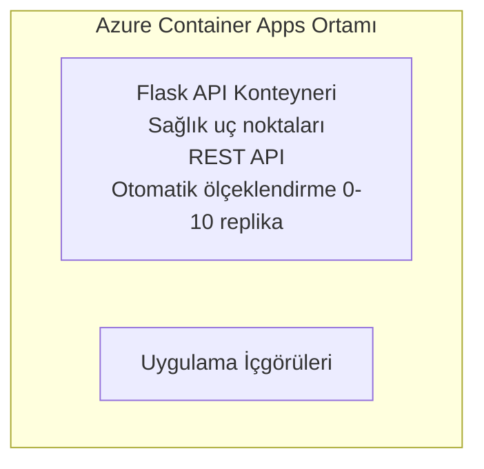

# Basit Flask API - Container App Örneği

**Öğrenme Yolu:** Başlangıç ⭐ | **Süre:** 25-35 dakika | **Maliyet:** $0-15/ay

Tam, çalışan bir Python Flask REST API'si, Azure Developer CLI (azd) kullanılarak Azure Container Apps'e dağıtıldı. Bu örnek kapsayıcı dağıtımını, otomatik ölçeklendirmeyi ve izleme temellerini gösterir.

## 🎯 Neleri Öğreneceksiniz

- Konteynerleştirilmiş bir Python uygulamasını Azure'a dağıtma
- Sıfıra ölçeklendirme (scale-to-zero) ile otomatik ölçeklendirmeyi yapılandırma
- Sağlık probları ve hazır olma kontrolleri uygulama
- Uygulama günlüklerini ve metriklerini izleme
- Hızlı dağıtım için Azure Developer CLI kullanma

## 📦 Neler Dahil

✅ **Flask Uygulaması** - CRUD işlemleriyle tam REST API (`src/app.py`)  
✅ **Dockerfile** - Üretime hazır kapsayıcı yapılandırması  
✅ **Bicep Altyapısı** - Container Apps ortamı ve API dağıtımı  
✅ **AZD Yapılandırması** - Tek komutla dağıtım kurulumu  
✅ **Sağlık Probları** - Canlılık (liveness) ve hazır olma (readiness) kontrolleri yapılandırıldı  
✅ **Otomatik ölçeklendirme** - HTTP yüküne göre 0-10 replika  

## Mimari



## Ön Koşullar

### Gereksinimler
- **Azure Developer CLI (azd)** - [Kurulum kılavuzu](https://learn.microsoft.com/azure/developer/azure-developer-cli/install-azd)
- **Azure aboneliği** - [Ücretsiz hesap](https://azure.microsoft.com/free/)
- **Docker Desktop** - [Docker'ı yükleyin](https://www.docker.com/products/docker-desktop/) (yerel test için)

### Ön Koşulları Doğrulayın

```bash
# azd sürümünü kontrol edin (1.5.0 veya daha yeni gerekli)
azd version

# Azure girişini doğrulayın
azd auth login

# Docker'ı kontrol edin (isteğe bağlı, yerel test için)
docker --version
```

## ⏱️ Dağıtım Zaman Çizelgesi

| Aşama | Süre | Neler Olur |
|-------|----------|--------------||
| Ortam kurulumu | 30 saniye | azd ortamı oluşturulur |
| Kapsayıcı oluşturma | 2-3 dakika | Flask uygulamasının Docker imajı oluşturulur |
| Altyapı sağlama | 3-5 dakika | Container Apps, kayıt defteri, izleme oluşturulur |
| Uygulamayı dağıtma | 2-3 dakika | İmaj itilir ve Container Apps'e dağıtılır |
| **Toplam** | **8-12 dakika** | Dağıtım tamamlandı ve hazır |

## Hızlı Başlangıç

```bash
# Örneğe git
cd examples/container-app/simple-flask-api

# Ortamı başlat (benzersiz bir ad seç)
azd env new myflaskapi

# Her şeyi dağıt (altyapı + uygulama)
azd up
# Aşağıdakiler istenecek:
# 1. Azure aboneliğini seçin
# 2. Bölge seçin (ör. eastus2)
# 3. Dağıtım için 8-12 dakika bekleyin

# API uç noktanızı alın
azd env get-values

# API'yi test edin
curl $(azd env get-value API_ENDPOINT)/health
```

**Beklenen Çıktı:**
```json
{
  "status": "healthy",
  "timestamp": "2025-11-19T10:30:00Z",
  "service": "simple-flask-api",
  "version": "1.0.0"
}
```

## ✅ Dağıtımı Doğrulayın

### 1. Adım: Dağıtım Durumunu Kontrol Et

```bash
# Dağıtılan hizmetleri görüntüle
azd show

# Beklenen çıktı şunu gösterir:
# - Hizmet: api
# - Uç nokta: https://ca-api-[env].xxx.azurecontainerapps.io
# - Durum: Çalışıyor
```

### 2. Adım: API Uç Noktalarını Test Edin

```bash
# API uç noktasını al
API_URL=$(azd env get-value API_ENDPOINT)

# Sağlığı test et
curl $API_URL/health

# Kök uç noktayı test et
curl $API_URL/

# Bir öğe oluştur
curl -X POST $API_URL/api/items \
  -H "Content-Type: application/json" \
  -d '{"name": "Test Item", "description": "My first item"}'

# Tüm öğeleri al
curl $API_URL/api/items
```

**Başarı Kriterleri:**
- ✅ Sağlık uç noktası HTTP 200 döndürür
- ✅ Kök uç nokta API bilgilerini gösterir
- ✅ POST yeni öğe oluşturur ve HTTP 201 döndürür
- ✅ GET oluşturulan öğeleri döndürür

### 3. Adım: Günlükleri Görüntüleyin

```bash
# azd monitor kullanarak canlı günlükleri aktarın
azd monitor --logs

# Veya Azure CLI'yi kullanın:
az containerapp logs show --name api --resource-group $RG_NAME --follow

# Şunları görmelisiniz:
# - Gunicorn başlatma mesajları
# - HTTP istek günlükleri
# - Uygulama bilgi günlükleri
```

## Proje Yapısı

```
simple-flask-api/
├── azure.yaml              # AZD configuration
├── infra/
│   ├── main.bicep         # Main infrastructure
│   ├── main.parameters.json
│   └── app/
│       ├── container-env.bicep
│       └── api.bicep
└── src/
    ├── app.py             # Flask application
    ├── requirements.txt
    └── Dockerfile
```

## API Uç Noktaları

| Uç Nokta | Yöntem | Açıklama |
|----------|--------|-------------|
| `/health` | GET | Sağlık kontrolü |
| `/api/items` | GET | Tüm öğeleri listele |
| `/api/items` | POST | Yeni öğe oluştur |
| `/api/items/{id}` | GET | Belirli öğeyi al |
| `/api/items/{id}` | PUT | Öğeyi güncelle |
| `/api/items/{id}` | DELETE | Öğeyi sil |

## Yapılandırma

### Ortam Değişkenleri

```bash
# Özel yapılandırmayı ayarla
azd env set PORT 8000
azd env set LOG_LEVEL info
azd env set MAX_REPLICAS 20
```

### Ölçeklendirme Yapılandırması

API, HTTP trafiğine göre otomatik olarak ölçeklenir:
- **Minimum Replika Sayısı**: 0 (boşta iken sıfıra ölçeklenir)
- **Maksimum Replika Sayısı**: 10
- **Replika Başına Eşzamanlı İstekler**: 50

## Geliştirme

### Yerel Olarak Çalıştırma

```bash
# Bağımlılıkları yükle
cd src
pip install -r requirements.txt

# Uygulamayı çalıştır
python app.py

# Yerel olarak test et
curl http://localhost:8000/health
```

### Kapsayıcıyı Oluşturma ve Test Etme

```bash
# Docker imajı oluştur
docker build -t flask-api:local ./src

# Konteyneri yerel olarak çalıştır
docker run -p 8000:8000 flask-api:local

# Konteyneri test et
curl http://localhost:8000/health
```

## Dağıtım

### Tam Dağıtım

```bash
# Altyapıyı ve uygulamayı dağıt
azd up
```

### Yalnızca Kod ile Dağıtım

```bash
# Sadece uygulama kodunu dağıtın (altyapı değişmeden)
azd deploy api
```

### Yapılandırmayı Güncelleme

```bash
# Ortam değişkenlerini güncelle
azd env set API_KEY "new-api-key"

# Yeni yapılandırmayla yeniden dağıt
azd deploy api
```

## İzleme

### Günlükleri Görüntüle

```bash
# azd monitor kullanarak canlı günlükleri akış halinde izleyin
azd monitor --logs

# Veya Container Apps için Azure CLI'yi kullanın:
az containerapp logs show --name api --resource-group $RG_NAME --follow

# Son 100 satırı görüntüleyin
az containerapp logs show --name api --resource-group $RG_NAME --tail 100
```

### Metrikleri İzleme

```bash
# Azure Monitor panosunu aç
azd monitor --overview

# Belirli metrikleri görüntüle
az monitor metrics list \
  --resource $(azd show --output json | jq -r '.services.api.resourceId') \
  --metric "Requests,ResponseTime"
```

## Test Etme

### Sağlık Kontrolü

```bash
curl $(azd show --output json | jq -r '.services.api.endpoint')/health
```

Beklenen yanıt:
```json
{
  "status": "healthy",
  "timestamp": "2025-11-19T10:30:00Z"
}
```

### Öğe Oluşturma

```bash
curl -X POST $(azd show --output json | jq -r '.services.api.endpoint')/api/items \
  -H "Content-Type: application/json" \
  -d '{"name": "Test Item", "description": "A test item"}'
```

### Tüm Öğeleri Getir

```bash
curl $(azd show --output json | jq -r '.services.api.endpoint')/api/items
```

## Maliyet Optimizasyonu

Bu dağıtım sıfıra ölçeklendirmeyi (scale-to-zero) kullanır, dolayısıyla API istekleri işlerken ödeme yaparsınız:

- **Boşta Kalma Maliyeti**: Yaklaşık $0/ay (sıfıra ölçeklendirilir)
- **Aktif maliyet**: Yaklaşık $0.000024/saniye her replika için
- **Beklenen aylık maliyet** (hafif kullanım): $5-15

### Maliyetleri Daha da Azaltma

```bash
# Geliştirme için maksimum replika sayısını azalt
azd env set MAX_REPLICAS 3

# Daha kısa boşta kalma zaman aşımı kullan
azd env set SCALE_TO_ZERO_TIMEOUT 300  # 5 dakika
```

## Sorun Giderme

### Kapsayıcı Başlamıyor

```bash
# Azure CLI kullanarak konteyner günlüklerini kontrol edin
az containerapp logs show --name api --resource-group $RG_NAME --tail 100

# Docker görüntüsünün yerel olarak oluşturulduğunu doğrulayın
docker build -t test ./src
```

### API Erişilemiyor

```bash
# Ingress'in harici olduğunu doğrulayın
az containerapp show --name api --resource-group rg-simple-flask-api \
  --query properties.configuration.ingress.external
```

### Yüksek Yanıt Süreleri

```bash
# CPU/Bellek kullanımını kontrol et
az monitor metrics list \
  --resource $(azd show --output json | jq -r '.services.api.resourceId') \
  --metric "CPUPercentage,MemoryPercentage"

# Gerekirse kaynakları ölçeklendir
az containerapp update --name api --resource-group rg-simple-flask-api \
  --cpu 1.0 --memory 2Gi
```

## Temizleme

```bash
# Tüm kaynakları sil
azd down --force --purge
```

## Sonraki Adımlar

### Bu Örneği Genişletin

1. **Veritabanı Ekle** - Azure Cosmos DB veya SQL Veritabanını entegre edin
   ```bash
   # infra/main.bicep dosyasına Cosmos DB modülü ekle
   # app.py dosyasını veritabanı bağlantısıyla güncelle
   ```

2. **Kimlik Doğrulama Ekle** - Microsoft Entra ID veya API anahtarlarını uygulayın
   ```python
   # app.py dosyasına kimlik doğrulama ara yazılımı ekle
   from functools import wraps
   ```

3. **CI/CD Kur** - GitHub Actions iş akışı
   ```yaml
   # Create .github/workflows/deploy.yml
   name: Deploy to Azure
   on: [push]
   ```

4. **Yönetilen Kimlik Ekle** - Azure hizmetlerine güvenli erişim sağlayın
   ```bicep
   # Update infra/app/api.bicep
   identity: { type: 'SystemAssigned' }
   ```

### İlgili Örnekler

- **[Veritabanı Uygulaması](../../../../../examples/database-app)** - SQL Veritabanı ile tam örnek
- **[Mikroservisler](../../../../../examples/container-app/microservices)** - Çok servisli mimari
- **[Container Apps Ana Rehberi](../README.md)** - Tüm kapsayıcı desenleri

### Öğrenme Kaynakları

- 📚 [AZD Yeni Başlayanlar Kursu](../../../README.md) - Ana kurs ana sayfası
- 📚 [Container Apps Desenleri](../README.md) - Daha fazla dağıtım deseni
- 📚 [AZD Şablon Galerisi](https://azure.github.io/awesome-azd/) - Topluluk şablonları

## Ek Kaynaklar

### Dokümantasyon
- **[Flask Dokümantasyonu](https://flask.palletsprojects.com/)** - Flask framework kılavuzu
- **[Azure Container Apps](https://learn.microsoft.com/azure/container-apps/)** - Resmi Azure dokümanları
- **[Azure Developer CLI](https://learn.microsoft.com/azure/developer/azure-developer-cli/)** - azd komut referansı

### Eğitimler
- **[Container Apps Hızlı Başlangıç](https://learn.microsoft.com/azure/container-apps/quickstart-portal)** - İlk uygulamanızı dağıtma
- **[Azure'da Python](https://learn.microsoft.com/azure/developer/python/)** - Python geliştirme kılavuzu
- **[Bicep Dili](https://learn.microsoft.com/azure/azure-resource-manager/bicep/)** - Altyapı olarak kod

### Araçlar
- **[Azure Portal](https://portal.azure.com)** - Kaynakları görsel olarak yönetin
- **[VS Code Azure Uzantısı](https://marketplace.visualstudio.com/items?itemName=ms-azuretools.vscode-azurecontainerapps)** - IDE entegrasyonu

---

**🎉 Tebrikler!** Otomatik ölçeklendirme ve izleme ile üretime hazır bir Flask API'sini Azure Container Apps'e dağıttınız.

**Sorularınız mı var?** [Bir issue açın](https://github.com/microsoft/AZD-for-beginners/issues) veya [SSS](../../../resources/faq.md) kısmına bakın

---

<!-- CO-OP TRANSLATOR DISCLAIMER START -->
**Feragatname**:
Bu belge, AI çeviri hizmeti [Co-op Translator](https://github.com/Azure/co-op-translator) kullanılarak çevrilmiştir. Doğruluk için çaba sarf etsek de, otomatik çevirilerin hata veya yanlışlık içerebileceğini lütfen unutmayınız. Orijinal belge, kendi dilinde yetkili kaynak olarak kabul edilmelidir. Kritik bilgiler için profesyonel insan çevirisi önerilir. Bu çevirinin kullanımı sonucu ortaya çıkabilecek yanlış anlamalardan veya yanlış yorumlamalardan sorumlu değiliz.
<!-- CO-OP TRANSLATOR DISCLAIMER END -->