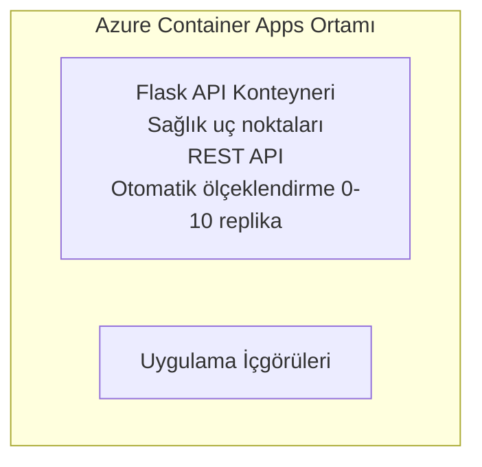

# Basit Flask API - Container App Örneği

**Öğrenme Yolu:** Beginner ⭐ | **Süre:** 25-35 dakika | **Maliyet:** $0-15/ay

Azure Container Apps'e Azure Developer CLI (azd) kullanılarak dağıtılmış, eksiksiz çalışan bir Python Flask REST API. Bu örnek konteyner dağıtımını, otomatik ölçeklendirmeyi ve izleme temel kavramlarını gösterir.

## 🎯 Neler Öğreneceksiniz

- Azure'a konteynerleştirilmiş bir Python uygulaması dağıtma
- Sıfıra ölçekleme (scale-to-zero) ile otomatik ölçeklendirme yapılandırma
- Sağlık yoklamaları ve hazır olma kontrolleri uygulama
- Uygulama günlüklerini ve metriklerini izleme
- Hızlı dağıtım için Azure Developer CLI'yi kullanma

## 📦 Neler Dahil

✅ **Flask Application** - CRUD işlemleri ile eksiksiz REST API (`src/app.py`)  
✅ **Dockerfile** - Üretim hazırı konteyner yapılandırması  
✅ **Bicep Infrastructure** - Container Apps ortamı ve API dağıtımı  
✅ **AZD Configuration** - Tek komutla dağıtım yapılandırması  
✅ **Health Probes** - Liveness ve readiness kontrolleri yapılandırıldı  
✅ **Auto-scaling** - HTTP yüküne göre 0-10 replika

## Architecture


## Önkoşullar

### Gerekli
- **Azure Developer CLI (azd)** - [Kurulum kılavuzu](https://learn.microsoft.com/azure/developer/azure-developer-cli/install-azd)
- **Azure subscription** - [Ücretsiz hesap](https://azure.microsoft.com/free/)
- **Docker Desktop** - [Docker'ı yükleyin](https://www.docker.com/products/docker-desktop/) (yerel test için)

### Önkoşulları Doğrulayın

```bash
# azd sürümünü kontrol et (1.5.0 veya daha yüksek gerekli)
azd version

# Azure girişini doğrula
azd auth login

# Docker'ı kontrol et (isteğe bağlı, yerel test için)
docker --version
```

## ⏱️ Dağıtım Zaman Çizelgesi

| Aşama | Süre | Ne Olur |
|-------|----------|--------------||
| Environment setup | 30 seconds | Create azd environment |
| Build container | 2-3 minutes | Docker build Flask app |
| Provision infrastructure | 3-5 minutes | Create Container Apps, registry, monitoring |
| Deploy application | 2-3 minutes | Push image and deploy to Container Apps |
| **Total** | **8-12 minutes** | Complete deployment ready |

## Hızlı Başlangıç

```bash
# Örneğe gidin
cd examples/container-app/simple-flask-api

# Ortamı başlatın (benzersiz bir ad seçin)
azd env new myflaskapi

# Her şeyi dağıtın (altyapı + uygulama)
azd up
# Sizden şunlar istenecek:
# 1. Azure aboneliğini seçin
# 2. Konumu seçin (örn. eastus2)
# 3. Dağıtım için 8-12 dakika bekleyin

# API uç noktanızı alın
azd env get-values

# API'yi test edin
curl $(azd env get-value API_ENDPOINT)/health
```

**Beklenen Çıktı:**
```json
{
  "status": "healthy",
  "timestamp": "2025-11-19T10:30:00Z",
  "service": "simple-flask-api",
  "version": "1.0.0"
}
```

## ✅ Dağıtımı Doğrulayın

### Adım 1: Dağıtım Durumunu Kontrol Edin

```bash
# Dağıtılan hizmetleri görüntüle
azd show

# Beklenen çıktı şunları gösterir:
# - Hizmet: api
# - Uç nokta: https://ca-api-[env].xxx.azurecontainerapps.io
# - Durum: Çalışıyor
```

### Adım 2: API Uç Noktalarını Test Edin

```bash
# API uç noktasını al
API_URL=$(azd env get-value API_ENDPOINT)

# Sağlığı test et
curl $API_URL/health

# Kök uç noktayı test et
curl $API_URL/

# Bir öğe oluştur
curl -X POST $API_URL/api/items \
  -H "Content-Type: application/json" \
  -d '{"name": "Test Item", "description": "My first item"}'

# Tüm öğeleri al
curl $API_URL/api/items
```

**Başarı Kriterleri:**
- ✅ Sağlık uç noktası HTTP 200 döndürür
- ✅ Kök uç nokta API bilgilerini gösterir
- ✅ POST yeni öğe oluşturur ve HTTP 201 döndürür
- ✅ GET oluşturulan öğeleri döndürür

### Adım 3: Günlükleri Görüntüleyin

```bash
# azd monitor kullanarak canlı günlükleri yayınlayın
azd monitor --logs

# Veya Azure CLI'yi kullanın:
az containerapp logs show --name api --resource-group $RG_NAME --follow

# Şunları görmelisiniz:
# - Gunicorn başlatma mesajları
# - HTTP istek günlükleri
# - Uygulama bilgi günlükleri
```

## Proje Yapısı

```
simple-flask-api/
├── azure.yaml              # AZD configuration
├── infra/
│   ├── main.bicep         # Main infrastructure
│   ├── main.parameters.json
│   └── app/
│       ├── container-env.bicep
│       └── api.bicep
└── src/
    ├── app.py             # Flask application
    ├── requirements.txt
    └── Dockerfile
```

## API Uç Noktaları

| Uç Nokta | Yöntem | Açıklama |
|----------|--------|-------------|
| `/health` | GET | Sağlık kontrolü |
| `/api/items` | GET | Tüm öğeleri listele |
| `/api/items` | POST | Yeni öğe oluştur |
| `/api/items/{id}` | GET | Belirli öğeyi al |
| `/api/items/{id}` | PUT | Öğeyi güncelle |
| `/api/items/{id}` | DELETE | Öğeyi sil |

## Yapılandırma

### Ortam Değişkenleri

```bash
# Özel yapılandırma ayarla
azd env set PORT 8000
azd env set LOG_LEVEL info
azd env set MAX_REPLICAS 20
```

### Ölçeklendirme Yapılandırması

API HTTP trafiğine göre otomatik olarak ölçeklenir:
- **Min Replicas**: 0 (boşta iken sıfıra ölçeklenir)
- **Max Replicas**: 10
- **Concurrent Requests per Replica**: 50

## Geliştirme

### Yerelde Çalıştır

```bash
# Bağımlılıkları yükle
cd src
pip install -r requirements.txt

# Uygulamayı çalıştır
python app.py

# Yerel olarak test et
curl http://localhost:8000/health
```

### Konteyneri Derleyin ve Test Edin

```bash
# Docker görüntüsü oluştur
docker build -t flask-api:local ./src

# Konteyneri yerel olarak çalıştır
docker run -p 8000:8000 flask-api:local

# Konteyneri test et
curl http://localhost:8000/health
```

## Dağıtım

### Tam Dağıtım

```bash
# Altyapıyı ve uygulamayı dağıt
azd up
```

### Sadece Kod ile Dağıtım

```bash
# Yalnızca uygulama kodunu dağıtın (altyapı değişmeden)
azd deploy api
```

### Yapılandırmayı Güncelle

```bash
# Ortam değişkenlerini güncelle
azd env set API_KEY "new-api-key"

# Yeni yapılandırmayla yeniden dağıt
azd deploy api
```

## İzleme

### Günlükleri Görüntüle

```bash
# azd monitor kullanarak canlı günlükleri akış şeklinde izle
azd monitor --logs

# Ya da Container Apps için Azure CLI'yi kullan:
az containerapp logs show --name api --resource-group $RG_NAME --follow

# Son 100 satırı görüntüle
az containerapp logs show --name api --resource-group $RG_NAME --tail 100
```

### Metrikleri İzleyin

```bash
# Azure Monitor panosunu aç
azd monitor --overview

# Belirli metrikleri görüntüle
az monitor metrics list \
  --resource $(azd show --output json | jq -r '.services.api.resourceId') \
  --metric "Requests,ResponseTime"
```

## Test Etme

### Sağlık Kontrolü

```bash
curl $(azd show --output json | jq -r '.services.api.endpoint')/health
```

Beklenen cevap:
```json
{
  "status": "healthy",
  "timestamp": "2025-11-19T10:30:00Z"
}
```

### Öğe Oluştur

```bash
curl -X POST $(azd show --output json | jq -r '.services.api.endpoint')/api/items \
  -H "Content-Type: application/json" \
  -d '{"name": "Test Item", "description": "A test item"}'
```

### Tüm Öğeleri Al

```bash
curl $(azd show --output json | jq -r '.services.api.endpoint')/api/items
```

## Maliyet Optimizasyonu

Bu dağıtım sıfıra ölçeklemeyi kullanır, böylece API istekleri işlerken ödeme yaparsınız:

- **Boşta maliyet**: ~$0/ay (sıfıra ölçeklenir)
- **Aktif maliyet**: ~$0.000024/saniye başına replika
- **Beklenen aylık maliyet** (hafif kullanım): $5-15

### Maliyetleri Daha da Azaltın

```bash
# Geliştirme için maksimum replika sayısını azalt
azd env set MAX_REPLICAS 3

# Daha kısa boşta kalma zaman aşımını kullan
azd env set SCALE_TO_ZERO_TIMEOUT 300  # 5 dakika
```

## Sorun Giderme

### Konteyner Başlamıyor

```bash
# Azure CLI kullanarak kapsayıcı günlüklerini kontrol edin
az containerapp logs show --name api --resource-group $RG_NAME --tail 100

# Docker görüntülerinin yerel olarak oluşturulduğunu doğrulayın
docker build -t test ./src
```

### API Erişilemiyor

```bash
# ingress'in harici olduğunu doğrulayın
az containerapp show --name api --resource-group rg-simple-flask-api \
  --query properties.configuration.ingress.external
```

### Yüksek Yanıt Süreleri

```bash
# CPU/Bellek kullanımını kontrol et
az monitor metrics list \
  --resource $(azd show --output json | jq -r '.services.api.resourceId') \
  --metric "CPUPercentage,MemoryPercentage"

# Gerekirse kaynakları ölçeklendir
az containerapp update --name api --resource-group rg-simple-flask-api \
  --cpu 1.0 --memory 2Gi
```

## Temizleme

```bash
# Tüm kaynakları sil
azd down --force --purge
```

## Sonraki Adımlar

### Bu Örneği Genişletin

1. **Add Database** - Azure Cosmos DB veya SQL Database ile entegre edin
   ```bash
   # Cosmos DB modülünü infra/main.bicep dosyasına ekle
   # Veritabanı bağlantısıyla app.py dosyasını güncelle
   ```

2. **Add Authentication** - Azure AD veya API anahtarlarını uygulayın
   ```python
   # app.py dosyasına kimlik doğrulama ara yazılımı ekle
   from functools import wraps
   ```

3. **Set Up CI/CD** - GitHub Actions iş akışı
   ```yaml
   # Create .github/workflows/deploy.yml
   name: Deploy to Azure
   on: [push]
   ```

4. **Add Managed Identity** - Azure hizmetlerine güvenli erişim sağlayın
   ```bicep
   # Update infra/app/api.bicep
   identity: { type: 'SystemAssigned' }
   ```

### İlgili Örnekler

- **[Database App](../../../../../examples/database-app)** - SQL Database ile eksiksiz örnek
- **[Microservices](../../../../../examples/container-app/microservices)** - Çok servisli mimari
- **[Container Apps Master Guide](../README.md)** - Tüm konteyner desenleri

### Öğrenme Kaynakları

- 📚 [AZD For Beginners Course](../../../README.md) - Ana kurs sayfası
- 📚 [Container Apps Patterns](../README.md) - Daha fazla dağıtım deseni
- 📚 [AZD Templates Gallery](https://azure.github.io/awesome-azd/) - Topluluk şablonları

## Ek Kaynaklar

### Dokümantasyon
- **[Flask Documentation](https://flask.palletsprojects.com/)** - Flask çerçeve kılavuzu
- **[Azure Container Apps](https://learn.microsoft.com/azure/container-apps/)** - Resmi Azure dokümanları
- **[Azure Developer CLI](https://learn.microsoft.com/azure/developer/azure-developer-cli/)** - azd komut referansı

### Eğitimler
- **[Container Apps Quickstart](https://learn.microsoft.com/azure/container-apps/quickstart-portal)** - İlk uygulamanızı dağıtın
- **[Python on Azure](https://learn.microsoft.com/azure/developer/python/)** - Python geliştirme kılavuzu
- **[Bicep Language](https://learn.microsoft.com/azure/azure-resource-manager/bicep/)** - Altyapı kodu

### Araçlar
- **[Azure Portal](https://portal.azure.com)** - Kaynakları görsel olarak yönetin
- **[VS Code Azure Extension](https://marketplace.visualstudio.com/items?itemName=ms-azuretools.vscode-azurecontainerapps)** - IDE entegrasyonu

---

**🎉 Tebrikler!** Otomatik ölçeklendirme ve izlemeye sahip üretim hazır bir Flask API'sini Azure Container Apps'e dağıttınız.

**Sorularınız mı var?** [Bir issue açın](https://github.com/microsoft/AZD-for-beginners/issues) veya [SSS](../../../resources/faq.md)'ye göz atın.

---

<!-- CO-OP TRANSLATOR DISCLAIMER START -->
**Feragatname**:
Bu belge, yapay zeka çeviri hizmeti [Co-op Translator](https://github.com/Azure/co-op-translator) kullanılarak çevrilmiştir. Doğruluğu sağlamaya çalışsak da, otomatik çevirilerin hatalar veya yanlışlıklar içerebileceğini lütfen unutmayın. Orijinal belgenin kendi dilindeki sürümü, yetkili kaynak olarak kabul edilmelidir. Kritik bilgiler için profesyonel insan çevirisi tavsiye edilir. Bu çevirinin kullanımından kaynaklanan herhangi bir yanlış anlama veya yanlış yorumdan sorumlu değiliz.
<!-- CO-OP TRANSLATOR DISCLAIMER END -->