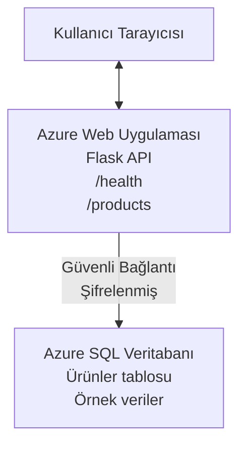

# Deploying a Microsoft SQL Database and Web App with AZD

⏱️ **Tahmini Süre**: 20-30 dakika | 💰 **Tahmini Maliyet**: ~$15-25/ay | ⭐ **Zorluk**: Orta

Bu **tam, çalışan örnek**, [Azure Developer CLI (azd)](https://learn.microsoft.com/azure/developer/azure-developer-cli/) kullanarak bir Python Flask web uygulamasını Microsoft SQL Veritabanı ile Azure'a nasıl dağıtacağınızı göstermektedir. Tüm kod dahil ve test edilmiştir—harici bir bağımlılık gerekmiyor.

## Neler Öğreneceksiniz

Bu örneği tamamlayarak şunları yapacaksınız:
- Altyapı-kod olarak çok katmanlı bir uygulama (web uygulaması + veritabanı) dağıtma
- Gizli bilgileri kaynak koda sabitlemeden güvenli veritabanı bağlantıları yapılandırma
- Application Insights ile uygulama sağlığını izleme
- AZD CLI ile Azure kaynaklarını verimli şekilde yönetme
- Güvenlik, maliyet optimizasyonu ve gözlemlenebilirlik için Azure en iyi uygulamalarını takip etme

## Senaryo Özeti
- **Web Uygulaması**: Veritabanı bağlantısına sahip Python Flask REST API
- **Veritabanı**: Örnek verilerle Azure SQL Database
- **Altyapı**: Bicep kullanılarak sağlanır (modüler, yeniden kullanılabilir şablonlar)
- **Dağıtım**: `azd` komutları ile tam otomatik
- **İzleme**: Günlükler ve telemetri için Application Insights

## Önkoşullar

### Gerekli Araçlar

Başlamadan önce bu araçların yüklü olduğunu doğrulayın:

1. **[Azure CLI](https://learn.microsoft.com/cli/azure/install-azure-cli)** (sürüm 2.50.0 veya üzeri)
   ```sh
   az --version
   # Beklenen çıktı: azure-cli 2.50.0 veya daha yüksek
   ```

2. **[Azure Developer CLI (azd)](https://learn.microsoft.com/azure/developer/azure-developer-cli/install-azd)** (sürüm 1.0.0 veya üzeri)
   ```sh
   azd version
   # Beklenen çıktı: azd sürüm 1.0.0 veya daha yüksek
   ```

3. **[Python 3.8+](https://www.python.org/downloads/)** (yerel geliştirme için)
   ```sh
   python --version
   # Beklenen çıktı: Python 3.8 veya daha yüksek
   ```

4. **[Docker](https://www.docker.com/get-started)** (isteğe bağlı, yerel konteynerleştirilmiş geliştirme için)
   ```sh
   docker --version
   # Beklenen çıktı: Docker sürümü 20.10 veya daha yeni
   ```

### Azure Gereksinimleri

- Aktif bir **Azure aboneliği** ([ücretsiz bir hesap oluşturun](https://azure.microsoft.com/free/))
- Aboneliğinizde kaynak oluşturma izinleri
- Abonelik veya kaynak grubu üzerinde **Owner** veya **Contributor** rolü

### Gereken Bilgi Düzeyi

Bu bir **orta seviye** örnektir. Aşağıdaki konulara hakim olmalısınız:
- Temel komut satırı işlemleri
- Bulutun temel kavramları (kaynaklar, kaynak grupları)
- Web uygulamaları ve veritabanlarının temel işleyişi

**AZD'ye yeni misiniz?** Önce [Başlarken kılavuzu](../../docs/chapter-01-foundation/azd-basics.md) ile başlayın.

## Mimari

Bu örnek, bir web uygulaması ve SQL veritabanından oluşan iki katmanlı bir mimari dağıtır:


**Kaynak Dağıtımı:**
- **Kaynak Grubu**: Tüm kaynakların kapsayıcısı
- **App Service Plan**: Linux tabanlı barındırma (maliyet verimliliği için B1 kademesi)
- **Web Uygulaması**: Flask uygulaması ile Python 3.11 çalışma zamanı
- **SQL Server**: TLS 1.2 minimum gereksinimli yönetilen veritabanı sunucusu
- **SQL Database**: Basic kademe (2GB, geliştirme/test için uygun)
- **Application Insights**: İzleme ve günlükleme
- **Log Analytics Workspace**: Merkezi günlük depolama

**Benzetme**: Bunu bir restoran (web uygulaması) ve bir walk-in dondurucu (veritabanı) gibi düşünün. Müşteriler menüden sipariş verir (API uç noktaları), mutfak (Flask uygulaması) malzemeleri (verileri) dondurucudan alır. Restoran yöneticisi (Application Insights) olup biteni izler.

## Klasör Yapısı

Tüm dosyalar bu örnekte dahildir—harici bağımlılık gerekmiyor:

```
examples/database-app/
│
├── README.md                    # This file
├── azure.yaml                   # AZD configuration file
├── .env.sample                  # Sample environment variables
├── .gitignore                   # Git ignore patterns
│
├── infra/                       # Infrastructure as Code (Bicep)
│   ├── main.bicep              # Main orchestration template
│   ├── abbreviations.json      # Azure naming conventions
│   └── resources/              # Modular resource templates
│       ├── sql-server.bicep    # SQL Server configuration
│       ├── sql-database.bicep  # Database configuration
│       ├── app-service-plan.bicep  # Hosting plan
│       ├── app-insights.bicep  # Monitoring setup
│       └── web-app.bicep       # Web application
│
└── src/
    └── web/                    # Application source code
        ├── app.py              # Flask REST API
        ├── requirements.txt    # Python dependencies
        └── Dockerfile          # Container definition
```

**Her Dosyanın Görevi:**
- **azure.yaml**: AZD'ye ne dağıtılacağını ve nereye dağıtılacağını söyler
- **infra/main.bicep**: Tüm Azure kaynaklarını koordine eder
- **infra/resources/*.bicep**: Bireysel kaynak tanımları (yeniden kullanım için modüler)
- **src/web/app.py**: Veritabanı mantığıyla Flask uygulaması
- **requirements.txt**: Python paket bağımlılıkları
- **Dockerfile**: Dağıtım için konteynerleştirme talimatları

## Hızlı Başlangıç (Adım Adım)

### Adım 1: Klonlayın ve Dizine Gidin

```sh
git clone https://github.com/microsoft/AZD-for-beginners.git
cd AZD-for-beginners/examples/database-app
```

**✓ Başarı Kontrolü**: `azure.yaml` ve `infra/` klasörünü gördüğünüzü doğrulayın:
```sh
ls
# Beklenen: README.md, azure.yaml, infra/, src/
```

### Adım 2: Azure ile Kimlik Doğrulaması Yapın

```sh
azd auth login
```

Bu, Azure kimlik doğrulaması için tarayıcınızı açar. Azure kimlik bilgilerinize giriş yapın.

**✓ Başarı Kontrolü**: Şunları görmelisiniz:
```
Logged in to Azure.
```

### Adım 3: Ortamı Başlatın

```sh
azd init
```

**Ne olur**: AZD dağıtımınız için yerel bir yapılandırma oluşturur.

**Görüntüleyeceğiniz istemler**:
- **Ortam adı**: Kısa bir ad girin (ör. `dev`, `myapp`)
- **Azure aboneliği**: Listeden aboneliğinizi seçin
- **Azure bölgesi**: Bir bölge seçin (ör. `eastus`, `westeurope`)

**✓ Başarı Kontrolü**: Şunları görmelisiniz:
```
SUCCESS: New project initialized!
```

### Adım 4: Azure Kaynaklarını Sağlayın

```sh
azd provision
```

**Ne olur**: AZD tüm altyapıyı dağıtır (5-8 dakika sürer):
1. Kaynak grubu oluşturur
2. SQL Server ve Veritabanı oluşturur
3. App Service Plan oluşturur
4. Web Uygulaması oluşturur
5. Application Insights oluşturur
6. Ağ ve güvenlik yapılandırmasını yapar

**İstenilecek bilgiler**:
- **SQL yönetici kullanıcı adı**: Bir kullanıcı adı girin (ör. `sqladmin`)
- **SQL yönetici parolası**: Güçlü bir parola girin (bunu kaydedin!)

**✓ Başarı Kontrolü**: Şunları görmelisiniz:
```
SUCCESS: Your application was provisioned in Azure in X minutes Y seconds.
You can view the resources created under the resource group rg-<env-name> in Azure Portal:
https://portal.azure.com/#@/resource/subscriptions/.../resourceGroups/rg-<env-name>
```

**⏱️ Süre**: 5-8 dakika

### Adım 5: Uygulamayı Dağıtın

```sh
azd deploy
```

**Ne olur**: AZD Flask uygulamanızı derler ve dağıtır:
1. Python uygulamasını paketler
2. Docker konteynerini oluşturur
3. Azure Web App'e gönderir
4. Veritabanını örnek verilerle başlatır
5. Uygulamayı başlatır

**✓ Başarı Kontrolü**: Şunları görmelisiniz:
```
SUCCESS: Your application was deployed to Azure in X minutes Y seconds.
You can view the resources created under the resource group rg-<env-name> in Azure Portal:
https://portal.azure.com/#@/resource/subscriptions/.../resourceGroups/rg-<env-name>
```

**⏱️ Süre**: 3-5 dakika

### Adım 6: Uygulamayı Tarayıcıda Açın

```sh
azd browse
```

Bu, dağıtılmış web uygulamanızı tarayıcıda `https://app-<unique-id>.azurewebsites.net` adresinde açar

**✓ Başarı Kontrolü**: JSON çıktısı görmelisiniz:
```json
{
  "message": "Welcome to the Database App API",
  "endpoints": {
    "/": "This help message",
    "/health": "Health check endpoint",
    "/products": "List all products",
    "/products/<id>": "Get product by ID"
  }
}
```

### Adım 7: API Uç Noktalarını Test Edin

**Sağlık Kontrolü** (veritabanı bağlantısını doğrulayın):
```sh
curl https://app-<your-id>.azurewebsites.net/health
```

**Beklenen Yanıt**:
```json
{
  "status": "healthy",
  "database": "connected"
}
```

**Ürünleri Listele** (örnek veriler):
```sh
curl https://app-<your-id>.azurewebsites.net/products
```

**Beklenen Yanıt**:
```json
[
  {
    "id": 1,
    "name": "Laptop",
    "description": "High-performance laptop",
    "price": 1299.99,
    "created_at": "2025-11-19T10:30:00"
  },
  ...
]
```

**Tek Ürün Al**:
```sh
curl https://app-<your-id>.azurewebsites.net/products/1
```

**✓ Başarı Kontrolü**: Tüm uç noktalar hata olmadan JSON veri döndürmelidir.

---

**🎉 Tebrikler!** AZD kullanarak Azure'a başarıyla bir veritabanı ile birlikte bir web uygulaması dağıttınız.

## Yapılandırmaya Derinlemesine Bakış

### Ortam Değişkenleri

Gizli bilgiler Azure App Service yapılandırması aracılığıyla güvenli şekilde yönetilir—**kaynak kodda asla sabitlenmez**.

**AZD tarafından Otomatik Olarak Yapılandırılanlar**:
- `SQL_CONNECTION_STRING`: Şifrelenmiş kimlik bilgileriyle veritabanı bağlantısı
- `APPLICATIONINSIGHTS_CONNECTION_STRING`: İzleme telemetri uç noktası
- `SCM_DO_BUILD_DURING_DEPLOYMENT`: Otomatik bağımlılık yüklemeyi etkinleştirir

**Gizli Bilgiler Nerede Saklanır**:
1. `azd provision` sırasında SQL kimlik bilgilerini güvenli istemlerle sağlarsınız
2. AZD bunları yerel `.azure/<env-name>/.env` dosyanıza kaydeder (git-ignored)
3. AZD bunları Azure App Service yapılandırmasına enjekte eder (dinlenme halinde şifrelenmiş)
4. Uygulama çalışma zamanında bunları `os.getenv()` ile okur

### Yerel Geliştirme

Yerel test için örnekten bir `.env` dosyası oluşturun:

```sh
cp .env.sample .env
# .env dosyasını yerel veritabanı bağlantınızla düzenleyin
```

**Yerel Geliştirme İş Akışı**:
```sh
# Bağımlılıkları yükle
cd src/web
pip install -r requirements.txt

# Ortam değişkenlerini ayarla
export SQL_CONNECTION_STRING="your-local-connection-string"

# Uygulamayı çalıştır
python app.py
```

**Yerelde test edin**:
```sh
curl http://localhost:8000/health
# Beklenen: {"status": "healthy", "database": "connected"}
```

### Kod Olarak Altyapı

Tüm Azure kaynakları **Bicep şablonlarında** tanımlanmıştır (`infra/` klasörü):

- **Modüler Tasarım**: Her kaynak türü yeniden kullanılabilirlik için kendi dosyasına sahiptir
- **Parametrelenmiş**: SKU'ları, bölgeleri, adlandırma kurallarını özelleştirebilirsiniz
- **En İyi Uygulamalar**: Azure adlandırma standartları ve güvenlik varsayılanlarına uyar
- **Sürüm Kontrolü**: Altyapı değişiklikleri Git'te izlenir

**Özelleştirme Örneği**:
Veritabanı kademesini değiştirmek için `infra/resources/sql-database.bicep` dosyasını düzenleyin:
```bicep
sku: {
  name: 'Standard'  // Changed from 'Basic'
  tier: 'Standard'
  capacity: 10
}
```

## Güvenlik En İyi Uygulamaları

Bu örnek Azure güvenlik en iyi uygulamalarını takip eder:

### 1. **Kaynak Kodunda Gizli Bilgi Yok**
- ✅ Kimlik bilgiler Azure App Service yapılandırmasında saklanır (şifrelenmiş)
- ✅ `.env` dosyaları `.gitignore` ile Git'ten hariç tutulur
- ✅ Gizli bilgiler provisioning sırasında güvenli parametrelerle iletilir

### 2. **Şifrelenmiş Bağlantılar**
- ✅ SQL Server için en az TLS 1.2
- ✅ Web App için yalnızca HTTPS zorunlu
- ✅ Veritabanı bağlantıları şifreli kanallar kullanır

### 3. **Ağ Güvenliği**
- ✅ SQL Server güvenlik duvarı sadece Azure hizmetlerine izin verecek şekilde yapılandırıldı
- ✅ Genel ağ erişimi kısıtlandı (Private Endpoints ile daha da kısıtlanabilir)
- ✅ Web App üzerinde FTPS devre dışı bırakıldı

### 4. **Kimlik Doğrulama ve Yetkilendirme**
- ⚠️ **Mevcut**: SQL kimlik doğrulaması (kullanıcı adı/parola)
- ✅ **Üretim Önerisi**: Parolasız kimlik doğrulama için Azure Managed Identity kullanın

**Yönetilen Kimliğe Yükseltme (üretim için)**:
1. Web App üzerinde yönetilen kimliği etkinleştirin
2. Kimliğe SQL izinleri verin
3. Bağlantı dizesini yönetilen kimlik kullanacak şekilde güncelleyin
4. Parola tabanlı kimlik doğrulamayı kaldırın

### 5. **Denetim ve Uyumluluk**
- ✅ Application Insights tüm istekleri ve hataları günlükler
- ✅ SQL Database denetimi etkin (uyumluluk için yapılandırılabilir)
- ✅ Tüm kaynaklar yönetişim için etiketlendi

**Üretim Öncesi Güvenlik Kontrol Listesi**:
- [ ] Azure Defender for SQL'i etkinleştirin
- [ ] SQL Database için Private Endpoints yapılandırın
- [ ] Web Application Firewall (WAF) etkinleştirin
- [ ] Gizli döndürme için Azure Key Vault uygulayın
- [ ] Azure AD kimlik doğrulamayı yapılandırın
- [ ] Tüm kaynaklar için teşhis günlüklerini etkinleştirin

## Maliyet Optimizasyonu

**Tahmini Aylık Maliyetler** (Kasım 2025 itibarıyla):

| Kaynak | SKU/Kademe | Tahmini Maliyet |
|----------|----------|----------------|
| App Service Plan | B1 (Basic) | ~$13/month |
| SQL Database | Basic (2GB) | ~$5/month |
| Application Insights | Pay-as-you-go | ~$2/month (low traffic) |
| **Toplam** | | **~$20/month** |

**💡 Maliyet Tasarrufu İpuçları**:

1. **Öğrenme için Ücretsiz Katmanı Kullanın**:
   - App Service: F1 kademesi (ücretsiz, sınırlı saat)
   - SQL Database: Azure SQL Database serverless kullanın
   - Application Insights: Aylık 5GB ücretsiz ingestion

2. **Kullanılmadığında Kaynakları Durdurun**:
   ```sh
   # Web uygulamasını durdur (veritabanı yine de ücretlendirilmeye devam eder)
   az webapp stop --name <app-name> --resource-group <rg-name>
   
   # Gerektiğinde yeniden başlat
   az webapp start --name <app-name> --resource-group <rg-name>
   ```

3. **Testten Sonra Her Şeyi Silin**:
   ```sh
   azd down
   ```
   Bu, TÜM kaynakları kaldırır ve ücretleri durdurur.

4. **Geliştirme vs. Üretim SKU'ları**:
   - **Geliştirme**: Bu örnekte kullanılan Basic kademe
   - **Üretim**: Yedeklilik için Standard/Premium kademeleri

**Maliyet İzleme**:
- Maliyetleri [Azure Cost Management](https://portal.azure.com/#view/Microsoft_Azure_CostManagement) içinde görüntüleyin
- Şaşırtıcı faturaları önlemek için maliyet uyarıları ayarlayın
- İzleme için tüm kaynakları `azd-env-name` ile etiketleyin

**Ücretsiz Katman Alternatifi**:
Öğrenme amaçlı olarak `infra/resources/app-service-plan.bicep` dosyasını değiştirebilirsiniz:
```bicep
sku: {
  name: 'F1'  // Free tier
  tier: 'Free'
}
```
**Not**: Ücretsiz katmanın sınırlamaları vardır (günde 60 dk/CPU, sürekli açık değil).

## İzleme ve Gözlemlenebilirlik

### Application Insights Entegrasyonu

Bu örnek kapsamlı izleme için **Application Insights** içerir:

**Neler İzleniyor**:
- ✅ HTTP istekleri (gecikme, durum kodları, uç noktalar)
- ✅ Uygulama hataları ve istisnalar
- ✅ Flask uygulamasından özel günlükleme
- ✅ Veritabanı bağlantı sağlığı
- ✅ Performans metrikleri (CPU, bellek)

**Application Insights'a Erişim**:
1. [Azure Portal](https://portal.azure.com) açın
2. Kaynak grubunuza gidin (`rg-<env-name>`)
3. Application Insights kaynağına tıklayın (`appi-<unique-id>`)

**Yararlı Sorgular** (Application Insights → Günlükler):

**Tüm İstekleri Görüntüle**:
```kusto
requests
| where timestamp > ago(1h)
| order by timestamp desc
| project timestamp, name, url, resultCode, duration
```

**Hataları Bul**:
```kusto
exceptions
| where timestamp > ago(24h)
| order by timestamp desc
| project timestamp, type, outerMessage, operation_Name
```

**Sağlık Uç Noktasını Kontrol Et**:
```kusto
requests
| where name contains "health"
| summarize count() by resultCode, bin(timestamp, 1h)
```

### SQL Veritabanı Denetimi

**SQL Database denetimi etkin** olup şunları izler:
- Veritabanı erişim desenleri
- Başarısız giriş denemeleri
- Şema değişiklikleri
- Veri erişimi (uyumluluk için)

**Denetim Günlüklerine Erişim**:
1. Azure Portal → SQL Database → Auditing
2. Log Analytics workspace içinde günlükleri görüntüleyin

### Gerçek Zamanlı İzleme

**Canlı Metrikleri Görüntüle**:
1. Application Insights → Live Metrics
2. Gerçek zamanlı olarak istekleri, hataları ve performansı görün

**Uyarılar Ayarlayın**:
Kritik olaylar için uyarılar oluşturun:
- 5 dakika içinde HTTP 500 hatası > 5
- Veritabanı bağlantı hataları
- Yüksek yanıt süreleri (>2 saniye)

**Örnek Uyarı Oluşturma**:
```sh
az monitor metrics alert create \
  --name "High-Response-Time" \
  --resource-group <rg-name> \
  --scopes <app-insights-resource-id> \
  --condition "avg requests/duration > 2000" \
  --description "Alert when response time exceeds 2 seconds"
```

## Sorun Giderme
### Yaygın Sorunlar ve Çözümler

#### 1. `azd provision` "Location not available" hatasıyla başarısız oluyor

**Belirti**:
```
Error: The subscription is not registered for the resource type 'components' in the location 'centralus'.
```

**Çözüm**:
Farklı bir Azure bölgesi seçin veya kaynak sağlayıcısını kaydedin:
```sh
az provider register --namespace Microsoft.Insights
```

#### 2. Dağıtım Sırasında SQL Bağlantısı Hatası

**Belirti**:
```
pyodbc.OperationalError: ('08001', '[08001] [Microsoft][ODBC Driver 18 for SQL Server]TCP Provider...')
```

**Çözüm**:
- SQL Server güvenlik duvarının Azure hizmetlerine izin verdiğini doğrulayın (otomatik olarak yapılandırılır)
- `azd provision` sırasında SQL yönetici parolasının doğru girildiğini kontrol edin
- SQL Server'ın tamamen sağlandığından emin olun (2-3 dakika sürebilir)

**Bağlantıyı Doğrulayın**:
```sh
# Azure Portal'dan SQL Veritabanı → Sorgu Düzenleyicisi'ne gidin
# Kimlik bilgilerinizi kullanarak bağlanmayı deneyin
```

#### 3. Web Uygulaması "Application Error" Gösteriyor

**Belirti**:
Tarayıcı genel bir hata sayfası gösterir.

**Çözüm**:
Uygulama günlüklerini kontrol edin:
```sh
# Son günlükleri görüntüle
az webapp log tail --name <app-name> --resource-group <rg-name>
```

**Yaygın nedenler**:
- Eksik ortam değişkenleri (App Service → Yapılandırma bölümünü kontrol edin)
- Python paket kurulumunun başarısız olması (dağıtım günlüklerini kontrol edin)
- Veritabanı başlatma hatası (SQL bağlantısını kontrol edin)

#### 4. `azd deploy` "Build Error" ile Başarısız Oluyor

**Belirti**:
```
Error: Failed to build project
```

**Çözüm**:
- `requirements.txt` dosyasında sözdizimi hatası olmadığından emin olun
- Python 3.11'in `infra/resources/web-app.bicep` içinde belirtildiğini kontrol edin
- Dockerfile'ın doğru temel görüntüyü kullandığını doğrulayın

**Yerelde hata ayıklayın**:
```sh
cd src/web
docker build -t test-app .
docker run -p 8000:8000 test-app
```

#### 5. AZD Komutlarını Çalıştırırken "Unauthorized"

**Belirti**:
```
ERROR: (Unauthorized) The client '<id>' with object id '<id>' does not have authorization
```

**Çözüm**:
Azure ile yeniden kimlik doğrulaması yapın:
```sh
azd auth login
az login
```

Abonelikte doğru izinlere (Contributor rolü) sahip olduğunuzu doğrulayın.

#### 6. Yüksek Veritabanı Maliyetleri

**Belirti**:
Beklenmeyen Azure faturası.

**Çözüm**:
- Testten sonra `azd down` komutunu çalıştırıp çalıştırmadığınızı kontrol edin
- SQL Database'in Basic katmanı kullandığını doğrulayın (Premium değil)
- Azure Cost Management'ta maliyetleri gözden geçirin
- Maliyet uyarıları kurun

### Yardım Alma

**Tüm AZD Ortam Değişkenlerini Görüntüle**:
```sh
azd env get-values
```

**Dağıtım Durumunu Kontrol Et**:
```sh
az webapp show --name <app-name> --resource-group <rg-name> --query state
```

**Uygulama Günlüklerine Erişin**:
```sh
az webapp log download --name <app-name> --resource-group <rg-name> --log-file app-logs.zip
```

**Daha Fazla Yardıma mı İhtiyacınız Var?**
- [AZD Sorun Giderme Rehberi](../../docs/chapter-07-troubleshooting/common-issues.md)
- [Azure App Service Sorun Giderme](https://learn.microsoft.com/azure/app-service/troubleshoot-diagnostic-logs)
- [Azure SQL Sorun Giderme](https://learn.microsoft.com/azure/azure-sql/database/troubleshoot-common-errors-issues)

## Pratik Alıştırmalar

### Alıştırma 1: Dağıtımınızı Doğrulayın (Başlangıç)

**Hedef**: Tüm kaynakların dağıtıldığını ve uygulamanın çalıştığını doğrulayın.

**Adımlar**:
1. Kaynak grubunuzdaki tüm kaynakları listeleyin:
   ```sh
   az resource list --resource-group rg-<env-name> --output table
   ```
   **Beklenen**: 6-7 kaynak (Web App, SQL Server, SQL Database, App Service Plan, Application Insights, Log Analytics)

2. Tüm API uç noktalarını test edin:
   ```sh
   curl https://app-<your-id>.azurewebsites.net/
   curl https://app-<your-id>.azurewebsites.net/health
   curl https://app-<your-id>.azurewebsites.net/products
   curl https://app-<your-id>.azurewebsites.net/products/1
   ```
   **Beklenen**: Hepsi hatasız geçerli JSON döndürür

3. Application Insights'ı kontrol edin:
   - Azure Portal'da Application Insights'a gidin
   - "Live Metrics" bölümüne gidin
   - Web uygulamasında tarayıcınızı yenileyin
   **Beklenen**: Gerçek zamanlı olarak isteklerin göründüğünü görün

**Başarı Kriterleri**: Tüm 6-7 kaynak mevcut, tüm uç noktalar veri döndürüyor, Live Metrics etkinlik gösteriyor.

---

### Alıştırma 2: Yeni Bir API Uç Noktası Ekleyin (Orta)

**Hedef**: Flask uygulamasını yeni bir uç nokta ile genişletin.

**Başlangıç Kodu**: Mevcut uç noktalar `src/web/app.py` içinde

**Adımlar**:
1. `src/web/app.py` dosyasını düzenleyin ve `get_product()` fonksiyonundan sonra yeni bir uç nokta ekleyin:
   ```python
   @app.route('/products/search/<keyword>')
   def search_products(keyword):
       """Search products by name or description."""
       try:
           conn = get_db_connection()
           cursor = conn.cursor()
           cursor.execute(
               "SELECT id, name, description, price, created_at FROM products WHERE name LIKE ? OR description LIKE ?",
               (f'%{keyword}%', f'%{keyword}%')
           )
           
           products = []
           for row in cursor.fetchall():
               products.append({
                   'id': row[0],
                   'name': row[1],
                   'description': row[2],
                   'price': float(row[3]) if row[3] else None,
                   'created_at': row[4].isoformat() if row[4] else None
               })
           
           cursor.close()
           conn.close()
           
           logger.info(f"Search for '{keyword}' returned {len(products)} results")
           return jsonify(products), 200
           
       except Exception as e:
           logger.error(f"Error searching products: {str(e)}")
           return jsonify({'error': str(e)}), 500
   ```

2. Güncellenmiş uygulamayı dağıtın:
   ```sh
   azd deploy
   ```

3. Yeni uç noktayı test edin:
   ```sh
   curl https://app-<your-id>.azurewebsites.net/products/search/laptop
   ```
   **Beklenen**: "laptop" ile eşleşen ürünleri döndürür

**Başarı Kriterleri**: Yeni uç nokta çalışır, filtrelenmiş sonuçları döndürür, Application Insights günlüklerinde görünür.

---

### Alıştırma 3: İzleme ve Uyarılar Ekleyin (İleri)

**Hedef**: Uyarılarla proaktif izleme kurun.

**Adımlar**:
1. HTTP 500 hataları için bir uyarı oluşturun:
   ```sh
   # Application Insights kaynak kimliğini al
   AI_ID=$(az monitor app-insights component show \
     --app appi-<your-id> \
     --resource-group rg-<env-name> \
     --query id -o tsv)
   
   # Uyarı oluştur
   az monitor metrics alert create \
     --name "High-Error-Rate" \
     --resource-group rg-<env-name> \
     --scopes $AI_ID \
     --condition "count requests/failed > 5" \
     --window-size 5m \
     --evaluation-frequency 1m \
     --description "Alert when >5 failed requests in 5 minutes"
   ```

2. Hatalar oluşturarak uyarıyı tetikleyin:
   ```sh
   # Mevcut olmayan bir ürünü talep et
   for i in {1..10}; do curl https://app-<your-id>.azurewebsites.net/products/999; done
   ```

3. Uyarının tetiklenip tetiklenmediğini kontrol edin:
   - Azure Portal → Uyarılar → Uyarı Kuralları
   - E-postanızı kontrol edin (yapılandırıldıysa)

**Başarı Kriterleri**: Uyarı kuralı oluşturuldu, hatalarda tetikleniyor, bildirimler alınıyor.

---

### Alıştırma 4: Veritabanı Şema Değişiklikleri (İleri)

**Hedef**: Yeni bir tablo ekleyin ve uygulamayı bunu kullanacak şekilde değiştirin.

**Adımlar**:
1. Azure Portal Sorgu Düzenleyicisi aracılığıyla SQL Database'e bağlanın

2. Yeni bir `categories` tablosu oluşturun:
   ```sql
   CREATE TABLE categories (
       id INT PRIMARY KEY IDENTITY(1,1),
       name NVARCHAR(50) NOT NULL,
       description NVARCHAR(200)
   );
   
   INSERT INTO categories (name, description) VALUES
   ('Electronics', 'Electronic devices and accessories'),
   ('Office Supplies', 'Office equipment and supplies');
   
   -- Add category to products table
   ALTER TABLE products ADD category_id INT;
   UPDATE products SET category_id = 1; -- Set all to Electronics
   ```

3. Yanıtlar içine kategori bilgisi eklemek için `src/web/app.py`'yi güncelleyin

4. Dağıtın ve test edin

**Başarı Kriterleri**: Yeni tablo mevcut, ürünler kategori bilgisi gösteriyor, uygulama çalışmaya devam ediyor.

---

### Alıştırma 5: Önbellekleme Uygulayın (Uzman)

**Hedef**: Performansı artırmak için Azure Redis Cache ekleyin.

**Adımlar**:
1. `infra/main.bicep` dosyasına Redis Cache ekleyin
2. Ürün sorgularını önbelleğe almak için `src/web/app.py`'yi güncelleyin
3. Application Insights ile performans artışını ölçün
4. Önbellekleme öncesi/sonrası yanıt sürelerini karşılaştırın

**Başarı Kriterleri**: Redis dağıtıldı, önbellekleme çalışıyor, yanıt süreleri %50'den fazla iyileşti.

**İpucu**: Başlamak için [Azure Cache for Redis dokümantasyonu](https://learn.microsoft.com/azure/azure-cache-for-redis/) adresine bakın.

---

## Temizlik

Süregelen ücretlerden kaçınmak için işiniz bitince tüm kaynakları silin:

```sh
azd down
```

**Onay istemi**:
```
? Total resources to delete: 7, are you sure you want to continue? (y/N)
```

Onaylamak için `y` yazın.

**✓ Başarı Kontrolü**: 
- Tüm kaynaklar Azure Portal'dan silinmiş
- Süregelen ücret yok
- Yerel `.azure/<env-name>` klasörü silinebilir

**Alternatif** (altyapıyı koru, verileri sil):
```sh
# Sadece kaynak grubunu sil (AZD yapılandırmasını koru)
az group delete --name rg-<env-name> --yes
```
## Daha Fazla Bilgi

### İlgili Belgeler
- [Azure Developer CLI Dokümantasyonu](https://learn.microsoft.com/azure/developer/azure-developer-cli/)
- [Azure SQL Database Dokümantasyonu](https://learn.microsoft.com/azure/azure-sql/database/)
- [Azure App Service Dokümantasyonu](https://learn.microsoft.com/azure/app-service/)
- [Application Insights Dokümantasyonu](https://learn.microsoft.com/azure/azure-monitor/app/app-insights-overview)
- [Bicep Dil Referansı](https://learn.microsoft.com/azure/azure-resource-manager/bicep/)

### Bu Kurstaki Sonraki Adımlar
- **[Container Apps Example](../../../../examples/container-app)**: Azure Container Apps ile mikroservisleri dağıtın
- **[AI Integration Guide](../../../../docs/ai-foundry)**: Uygulamanıza yapay zeka yetenekleri ekleyin
- **[Deployment Best Practices](../../docs/chapter-04-infrastructure/deployment-guide.md)**: Üretim dağıtım desenleri

### İleri Konular
- **Managed Identity**: Parolaları kaldırın ve Azure AD kimlik doğrulamasını kullanın
- **Private Endpoints**: Veritabanı bağlantılarını bir sanal ağ içinde güvence altına alın
- **CI/CD Entegrasyonu**: Dağıtımları GitHub Actions veya Azure DevOps ile otomatikleştirin
- **Çoklu Ortam**: dev, staging ve production ortamlarını kurun
- **Veritabanı Geçişleri**: Şema versiyonlaması için Alembic veya Entity Framework kullanın

### Diğer Yaklaşımlarla Karşılaştırma

**AZD vs. ARM Templates**:
- ✅ AZD: Daha yüksek seviyede soyutlama, daha basit komutlar
- ⚠️ ARM: Daha ayrıntılı, daha ince ayarlı kontrol

**AZD vs. Terraform**:
- ✅ AZD: Azure'a özgü, Azure hizmetleriyle entegre
- ⚠️ Terraform: Çoklu bulut desteği, daha geniş bir ekosistem

**AZD vs. Azure Portal**:
- ✅ AZD: Tekrarlanabilir, sürüm kontrollü, otomatikleştirilebilir
- ⚠️ Portal: Elle tıklamalar, yeniden üretmesi zor

**AZD'yi şu şekilde düşünün**: Azure için Docker Compose—karmaşık dağıtımlar için basitleştirilmiş yapılandırma.

---

## Sıkça Sorulan Sorular

**Q: Can I use a different programming language?**  
A: Evet! `src/web/` klasörünü Node.js, C#, Go veya istediğiniz bir dil ile değiştirin. `azure.yaml` ve Bicep'i buna göre güncelleyin.

**Q: How do I add more databases?**  
A: `infra/main.bicep` içinde başka bir SQL Database modülü ekleyin veya Azure Database hizmetlerinden PostgreSQL/MySQL kullanın.

**Q: Can I use this for production?**  
A: Bu bir başlangıç noktasıdır. Üretim için: managed identity, private endpoints, yedeklilik, yedekleme stratejisi, WAF ve gelişmiş izlemeyi ekleyin.

**Q: What if I want to use containers instead of code deployment?**  
A: Docker konteynerlerini tümüyle kullanan [Container Apps Example](../../../../examples/container-app) örneğine bakın.

**Q: How do I connect to the database from my local machine?**  
A: SQL Server güvenlik duvarına IP adresinizi ekleyin:
```sh
az sql server firewall-rule create \
  --resource-group rg-<env-name> \
  --server sql-<unique-id> \
  --name AllowMyIP \
  --start-ip-address <your-ip> \
  --end-ip-address <your-ip>
```

**Q: Can I use an existing database instead of creating a new one?**  
A: Evet, mevcut bir SQL Server'a referans verecek şekilde `infra/main.bicep`'i değiştirin ve bağlantı dizesi parametrelerini güncelleyin.

---

> **Not:** Bu örnek, AZD kullanarak bir veritabanı ile bir web uygulaması dağıtmak için en iyi uygulamaları göstermektedir. Çalışan kod, kapsamlı belgeler ve öğrenmeyi pekiştiren pratik alıştırmalar içerir. Üretim dağıtımları için, kuruluşunuza özel güvenlik, ölçeklendirme, uyumluluk ve maliyet gereksinimlerini gözden geçirin.

**📚 Kurs Gezinimi:**
- ← Önceki: [Container Apps Example](../../../../examples/container-app)
- → Sonraki: [AI Integration Guide](../../../../docs/ai-foundry)
- 🏠 [Kurs Ana Sayfası](../../README.md)

---

<!-- CO-OP TRANSLATOR DISCLAIMER START -->
**Disclaimer**:
Bu belge, yapay zeka çeviri hizmeti [Co-op Translator](https://github.com/Azure/co-op-translator) kullanılarak çevrilmiştir. Doğruluk için çaba göstermemize rağmen, otomatik çevirilerin hatalar veya yanlışlıklar içerebileceğini lütfen unutmayın. Orijinal belge, kendi dilindeki haliyle yetkili kaynak olarak kabul edilmelidir. Kritik bilgiler için profesyonel insan çevirisi önerilir. Bu çevirinin kullanımından kaynaklanan herhangi bir yanlış anlama veya yanlış yorumlamadan sorumlu değiliz.
<!-- CO-OP TRANSLATOR DISCLAIMER END -->