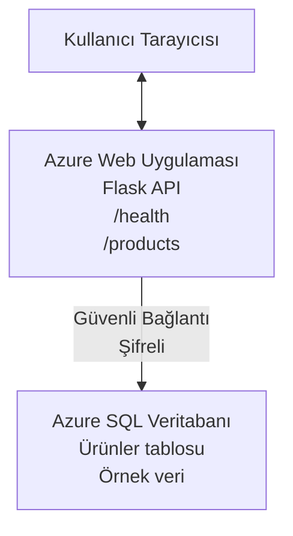

# Deploying a Microsoft SQL Database and Web App with AZD

⏱️ **Estimated Time**: 20-30 minutes | 💰 **Estimated Cost**: ~$15-25/month | ⭐ **Complexity**: Intermediate

This **complete, working example** demonstrates how to use the [Azure Developer CLI (azd)](https://learn.microsoft.com/azure/developer/azure-developer-cli/) to deploy a Python Flask web application with a Microsoft SQL Database to Azure. All code is included and tested—no external dependencies required.

## What You'll Learn

By completing this example, you will:
- Deploy a multi-tier application (web app + database) using infrastructure-as-code
- Configure secure database connections without hardcoding secrets
- Monitor application health with Application Insights
- Manage Azure resources efficiently with AZD CLI
- Follow Azure best practices for security, cost optimization, and observability

## Scenario Overview
- **Web App**: Python Flask REST API with database connectivity
- **Database**: Azure SQL Database with sample data
- **Infrastructure**: Provisioned using Bicep (modular, reusable templates)
- **Deployment**: Fully automated with `azd` commands
- **Monitoring**: Application Insights for logs and telemetry

## Prerequisites

### Required Tools

Before starting, verify you have these tools installed:

1. **[Azure CLI](https://learn.microsoft.com/cli/azure/install-azure-cli)** (version 2.50.0 or higher)
   ```sh
   az --version
   # Beklenen çıktı: azure-cli 2.50.0 veya daha yeni
   ```

2. **[Azure Developer CLI (azd)](https://learn.microsoft.com/azure/developer/azure-developer-cli/install-azd)** (version 1.0.0 or higher)
   ```sh
   azd version
   # Beklenen çıktı: azd sürüm 1.0.0 veya daha yeni
   ```

3. **[Python 3.8+](https://www.python.org/downloads/)** (for local development)
   ```sh
   python --version
   # Beklenen çıktı: Python 3.8 veya daha yüksek
   ```

4. **[Docker](https://www.docker.com/get-started)** (optional, for local containerized development)
   ```sh
   docker --version
   # Beklenen çıktı: Docker sürümü 20.10 veya daha yüksek
   ```

### Azure Requirements

- An active **Azure subscription** ([create a free account](https://azure.microsoft.com/free/))
- Permissions to create resources in your subscription
- **Owner** or **Contributor** role on the subscription or resource group

### Knowledge Prerequisites

This is an **intermediate-level** example. You should be familiar with:
- Basic command-line operations
- Fundamental cloud concepts (resources, resource groups)
- Basic understanding of web applications and databases

**New to AZD?** Start with the [Getting Started guide](../../docs/chapter-01-foundation/azd-basics.md) first.

## Architecture

This example deploys a two-tier architecture with a web application and SQL database:


**Resource Deployment:**
- **Resource Group**: Container for all resources
- **App Service Plan**: Linux-based hosting (B1 tier for cost efficiency)
- **Web App**: Python 3.11 runtime with Flask application
- **SQL Server**: Managed database server with TLS 1.2 minimum
- **SQL Database**: Basic tier (2GB, suitable for development/testing)
- **Application Insights**: Monitoring and logging
- **Log Analytics Workspace**: Centralized log storage

**Analogy**: Think of this like a restaurant (web app) with a walk-in freezer (database). Customers order from the menu (API endpoints), and the kitchen (Flask app) retrieves ingredients (data) from the freezer. The restaurant manager (Application Insights) tracks everything that happens.

## Folder Structure

All files are included in this example—no external dependencies required:

```
examples/database-app/
│
├── README.md                    # This file
├── azure.yaml                   # AZD configuration file
├── .env.sample                  # Sample environment variables
├── .gitignore                   # Git ignore patterns
│
├── infra/                       # Infrastructure as Code (Bicep)
│   ├── main.bicep              # Main orchestration template
│   ├── abbreviations.json      # Azure naming conventions
│   └── resources/              # Modular resource templates
│       ├── sql-server.bicep    # SQL Server configuration
│       ├── sql-database.bicep  # Database configuration
│       ├── app-service-plan.bicep  # Hosting plan
│       ├── app-insights.bicep  # Monitoring setup
│       └── web-app.bicep       # Web application
│
└── src/
    └── web/                    # Application source code
        ├── app.py              # Flask REST API
        ├── requirements.txt    # Python dependencies
        └── Dockerfile          # Container definition
```

**What Each File Does:**
- **azure.yaml**: Tells AZD what to deploy and where
- **infra/main.bicep**: Orchestrates all Azure resources
- **infra/resources/*.bicep**: Individual resource definitions (modular for reuse)
- **src/web/app.py**: Flask application with database logic
- **requirements.txt**: Python package dependencies
- **Dockerfile**: Containerization instructions for deployment

## Quickstart (Step-by-Step)

### Step 1: Clone and Navigate

```sh
git clone https://github.com/microsoft/AZD-for-beginners.git
cd AZD-for-beginners/examples/database-app
```

**✓ Success Check**: Verify you see `azure.yaml` and `infra/` folder:
```sh
ls
# Beklenen: README.md, azure.yaml, infra/, src/
```

### Step 2: Authenticate with Azure

```sh
azd auth login
```

This opens your browser for Azure authentication. Sign in with your Azure credentials.

**✓ Success Check**: You should see:
```
Logged in to Azure.
```

### Step 3: Initialize the Environment

```sh
azd init
```

**What happens**: AZD creates a local configuration for your deployment.

**Prompts you'll see**:
- **Environment name**: Enter a short name (e.g., `dev`, `myapp`)
- **Azure subscription**: Select your subscription from the list
- **Azure location**: Choose a region (e.g., `eastus`, `westeurope`)

**✓ Success Check**: You should see:
```
SUCCESS: New project initialized!
```

### Step 4: Provision Azure Resources

```sh
azd provision
```

**What happens**: AZD deploys all infrastructure (takes 5-8 minutes):
1. Creates resource group
2. Creates SQL Server and Database
3. Creates App Service Plan
4. Creates Web App
5. Creates Application Insights
6. Configures networking and security

**You'll be prompted for**:
- **SQL admin username**: Enter a username (e.g., `sqladmin`)
- **SQL admin password**: Enter a strong password (save this!)

**✓ Success Check**: You should see:
```
SUCCESS: Your application was provisioned in Azure in X minutes Y seconds.
You can view the resources created under the resource group rg-<env-name> in Azure Portal:
https://portal.azure.com/#@/resource/subscriptions/.../resourceGroups/rg-<env-name>
```

**⏱️ Time**: 5-8 minutes

### Step 5: Deploy the Application

```sh
azd deploy
```

**What happens**: AZD builds and deploys your Flask application:
1. Packages the Python application
2. Builds the Docker container
3. Pushes to Azure Web App
4. Initializes the database with sample data
5. Starts the application

**✓ Success Check**: You should see:
```
SUCCESS: Your application was deployed to Azure in X minutes Y seconds.
You can view the resources created under the resource group rg-<env-name> in Azure Portal:
https://portal.azure.com/#@/resource/subscriptions/.../resourceGroups/rg-<env-name>
```

**⏱️ Time**: 3-5 minutes

### Step 6: Browse the Application

```sh
azd browse
```

This opens your deployed web app in the browser at `https://app-<unique-id>.azurewebsites.net`

**✓ Success Check**: You should see JSON output:
```json
{
  "message": "Welcome to the Database App API",
  "endpoints": {
    "/": "This help message",
    "/health": "Health check endpoint",
    "/products": "List all products",
    "/products/<id>": "Get product by ID"
  }
}
```

### Step 7: Test the API Endpoints

**Health Check** (verify database connection):
```sh
curl https://app-<your-id>.azurewebsites.net/health
```

**Expected Response**:
```json
{
  "status": "healthy",
  "database": "connected"
}
```

**List Products** (sample data):
```sh
curl https://app-<your-id>.azurewebsites.net/products
```

**Expected Response**:
```json
[
  {
    "id": 1,
    "name": "Laptop",
    "description": "High-performance laptop",
    "price": 1299.99,
    "created_at": "2025-11-19T10:30:00"
  },
  ...
]
```

**Get Single Product**:
```sh
curl https://app-<your-id>.azurewebsites.net/products/1
```

**✓ Success Check**: All endpoints return JSON data without errors.

---

**🎉 Congratulations!** You've successfully deployed a web application with a database to Azure using AZD.

## Configuration Deep-Dive

### Environment Variables

Secrets are managed securely via Azure App Service configuration—**never hardcoded in source code**.

**Configured Automatically by AZD**:
- `SQL_CONNECTION_STRING`: Database connection with encrypted credentials
- `APPLICATIONINSIGHTS_CONNECTION_STRING`: Monitoring telemetry endpoint
- `SCM_DO_BUILD_DURING_DEPLOYMENT`: Enables automatic dependency installation

**Where Secrets Are Stored**:
1. During `azd provision`, you provide SQL credentials via secure prompts
2. AZD stores these in your local `.azure/<env-name>/.env` file (git-ignored)
3. AZD injects them into Azure App Service configuration (encrypted at rest)
4. Application reads them via `os.getenv()` at runtime

### Local Development

For local testing, create a `.env` file from the sample:

```sh
cp .env.sample .env
# Yerel veritabanı bağlantınızla .env dosyasını düzenleyin
```

**Local Development Workflow**:
```sh
# Bağımlılıkları yükleyin
cd src/web
pip install -r requirements.txt

# Ortam değişkenlerini ayarlayın
export SQL_CONNECTION_STRING="your-local-connection-string"

# Uygulamayı çalıştırın
python app.py
```

**Test locally**:
```sh
curl http://localhost:8000/health
# Beklenen: {"status": "healthy", "database": "connected"}
```

### Infrastructure as Code

All Azure resources are defined in **Bicep templates** (`infra/` folder):

- **Modular Design**: Each resource type has its own file for reusability
- **Parameterized**: Customize SKUs, regions, naming conventions
- **Best Practices**: Follows Azure naming standards and security defaults
- **Version Controlled**: Infrastructure changes are tracked in Git

**Customization Example**:
To change the database tier, edit `infra/resources/sql-database.bicep`:
```bicep
sku: {
  name: 'Standard'  // Changed from 'Basic'
  tier: 'Standard'
  capacity: 10
}
```

## Security Best Practices

This example follows Azure security best practices:

### 1. **No Secrets in Source Code**
- ✅ Credentials stored in Azure App Service configuration (encrypted)
- ✅ `.env` files excluded from Git via `.gitignore`
- ✅ Secrets passed via secure parameters during provisioning

### 2. **Encrypted Connections**
- ✅ TLS 1.2 minimum for SQL Server
- ✅ HTTPS-only enforced for Web App
- ✅ Database connections use encrypted channels

### 3. **Network Security**
- ✅ SQL Server firewall configured to allow Azure services only
- ✅ Public network access restricted (can be further locked down with Private Endpoints)
- ✅ FTPS disabled on Web App

### 4. **Authentication & Authorization**
- ⚠️ **Current**: SQL authentication (username/password)
- ✅ **Production Recommendation**: Use Azure Managed Identity for passwordless authentication

**To Upgrade to Managed Identity** (for production):
1. Enable managed identity on Web App
2. Grant identity SQL permissions
3. Update connection string to use managed identity
4. Remove password-based authentication

### 5. **Auditing & Compliance**
- ✅ Application Insights logs all requests and errors
- ✅ SQL Database auditing enabled (can be configured for compliance)
- ✅ All resources tagged for governance

**Security Checklist Before Production**:
- [ ] Enable Azure Defender for SQL
- [ ] Configure Private Endpoints for SQL Database
- [ ] Enable Web Application Firewall (WAF)
- [ ] Implement Azure Key Vault for secret rotation
- [ ] Configure Azure AD authentication
- [ ] Enable diagnostic logging for all resources

## Cost Optimization

**Estimated Monthly Costs** (as of November 2025):

| Resource | SKU/Tier | Estimated Cost |
|----------|----------|----------------|
| App Service Plan | B1 (Basic) | ~$13/month |
| SQL Database | Basic (2GB) | ~$5/month |
| Application Insights | Pay-as-you-go | ~$2/month (low traffic) |
| **Total** | | **~$20/month** |

**💡 Cost-Saving Tips**:

1. **Use Free Tier for Learning**:
   - App Service: F1 tier (free, limited hours)
   - SQL Database: Use Azure SQL Database serverless
   - Application Insights: 5GB/month free ingestion

2. **Stop Resources When Not in Use**:
   ```sh
   # Web uygulamasını durdur (veritabanı yine de ücretlendirilmeye devam eder)
   az webapp stop --name <app-name> --resource-group <rg-name>
   
   # Gerektiğinde yeniden başlat
   az webapp start --name <app-name> --resource-group <rg-name>
   ```

3. **Delete Everything After Testing**:
   ```sh
   azd down
   ```
   This removes ALL resources and stops charges.

4. **Development vs. Production SKUs**:
   - **Development**: Basic tier (used in this example)
   - **Production**: Standard/Premium tier with redundancy

**Cost Monitoring**:
- View costs in [Azure Cost Management](https://portal.azure.com/#view/Microsoft_Azure_CostManagement)
- Set up cost alerts to avoid surprises
- Tag all resources with `azd-env-name` for tracking

**Free Tier Alternative**:
For learning purposes, you can modify `infra/resources/app-service-plan.bicep`:
```bicep
sku: {
  name: 'F1'  // Free tier
  tier: 'Free'
}
```
**Not**: Free tier has limitations (60 min/day CPU, no always-on).

## Monitoring & Observability

### Application Insights Integration

This example includes **Application Insights** for comprehensive monitoring:

**What's Monitored**:
- ✅ HTTP requests (latency, status codes, endpoints)
- ✅ Application errors and exceptions
- ✅ Custom logging from Flask app
- ✅ Database connection health
- ✅ Performance metrics (CPU, memory)

**Access Application Insights**:
1. Open [Azure Portal](https://portal.azure.com)
2. Navigate to your resource group (`rg-<env-name>`)
3. Click on Application Insights resource (`appi-<unique-id>`)

**Useful Queries** (Application Insights → Logs):

**View All Requests**:
```kusto
requests
| where timestamp > ago(1h)
| order by timestamp desc
| project timestamp, name, url, resultCode, duration
```

**Find Errors**:
```kusto
exceptions
| where timestamp > ago(24h)
| order by timestamp desc
| project timestamp, type, outerMessage, operation_Name
```

**Check Health Endpoint**:
```kusto
requests
| where name contains "health"
| summarize count() by resultCode, bin(timestamp, 1h)
```

### SQL Database Auditing

**SQL Database auditing is enabled** to track:
- Database access patterns
- Failed login attempts
- Schema changes
- Data access (for compliance)

**Access Audit Logs**:
1. Azure Portal → SQL Database → Auditing
2. View logs in Log Analytics workspace

### Real-Time Monitoring

**View Live Metrics**:
1. Application Insights → Live Metrics
2. See requests, failures, and performance in real-time

**Set Up Alerts**:
Create alerts for critical events:
- HTTP 500 errors > 5 in 5 minutes
- Database connection failures
- High response times (>2 seconds)

**Example Alert Creation**:
```sh
az monitor metrics alert create \
  --name "High-Response-Time" \
  --resource-group <rg-name> \
  --scopes <app-insights-resource-id> \
  --condition "avg requests/duration > 2000" \
  --description "Alert when response time exceeds 2 seconds"
```

## Troubleshooting
### Yaygın Sorunlar ve Çözümler

#### 1. `azd provision` "Location not available" hatasıyla başarısız oluyor

**Belirti**:
```
Error: The subscription is not registered for the resource type 'components' in the location 'centralus'.
```

**Çözüm**:
Farklı bir Azure bölgesi seçin veya kaynak sağlayıcısını kaydedin:
```sh
az provider register --namespace Microsoft.Insights
```

#### 2. Dağıtım Sırasında SQL Bağlantısı Başarısız Oluyor

**Belirti**:
```
pyodbc.OperationalError: ('08001', '[08001] [Microsoft][ODBC Driver 18 for SQL Server]TCP Provider...')
```

**Çözüm**:
- SQL Server güvenlik duvarının Azure hizmetlerine izin verdiğini doğrulayın (otomatik olarak yapılandırılır)
- SQL yönetici parolasının `azd provision` sırasında doğru girildiğini kontrol edin
- SQL Server'ın tamamen oluşturulduğundan emin olun (2-3 dakika sürebilir)

**Bağlantıyı Doğrulayın**:
```sh
# Azure Portal'dan SQL Veritabanı → Sorgu düzenleyicisine gidin
# Kimlik bilgilerinizi kullanarak bağlanmayı deneyin
```

#### 3. Web Uygulaması "Uygulama Hatası" Gösteriyor

**Belirti**:
Tarayıcı genel bir hata sayfası gösterir.

**Çözüm**:
Uygulama günlüklerini kontrol edin:
```sh
# Son günlükleri görüntüle
az webapp log tail --name <app-name> --resource-group <rg-name>
```

**Olası nedenler**:
- Eksik ortam değişkenleri (App Service → Configuration kontrol edin)
- Python paket kurulumu başarısız oldu (dağıtım günlüklerini kontrol edin)
- Veritabanı başlatma hatası (SQL bağlantısını kontrol edin)

#### 4. `azd deploy` "Derleme Hatası" ile Başarısız Oluyor

**Belirti**:
```
Error: Failed to build project
```

**Çözüm**:
- requirements.txt dosyasında sözdizimi hatası olmadığından emin olun
- Python 3.11'in `infra/resources/web-app.bicep` içinde belirtildiğini kontrol edin
- Dockerfile'ın doğru temel görüntüyü içerdiğini doğrulayın

**Yerelde Hata Ayıklama**:
```sh
cd src/web
docker build -t test-app .
docker run -p 8000:8000 test-app
```

#### 5. AZD Komutlarını Çalıştırırken "Unauthorized" Hatası

**Belirti**:
```
ERROR: (Unauthorized) The client '<id>' with object id '<id>' does not have authorization
```

**Çözüm**:
Azure ile yeniden kimlik doğrulaması yapın:
```sh
# AZD iş akışları için gerekli
azd auth login

# Azure CLI komutlarını doğrudan kullanıyorsanız isteğe bağlı
az login
```

Doğru izinlere (Contributor rolü) sahip olduğunuzu abonelik üzerinde doğrulayın.

#### 6. Yüksek Veritabanı Maliyetleri

**Belirti**:
Beklenmeyen Azure faturası.

**Çözüm**:
- Testten sonra `azd down` komutunu çalıştırmayı unutup unutmadığınızı kontrol edin
- SQL Veritabanının Basic katmanını kullandığını doğrulayın (Premium değil)
- Azure Cost Management'ta maliyetleri gözden geçirin
- Maliyet uyarıları kurun

### Yardım

**Tüm AZD Ortam Değişkenlerini Görüntüleyin**:
```sh
azd env get-values
```

**Dağıtım Durumunu Kontrol Edin**:
```sh
az webapp show --name <app-name> --resource-group <rg-name> --query state
```

**Uygulama Günlüklerine Erişin**:
```sh
az webapp log download --name <app-name> --resource-group <rg-name> --log-file app-logs.zip
```

**Daha Fazla Yardıma mı ihtiyacınız var?**
- [AZD Sorun Giderme Rehberi](../../docs/chapter-07-troubleshooting/common-issues.md)
- [Azure App Service Sorun Giderme](https://learn.microsoft.com/azure/app-service/troubleshoot-diagnostic-logs)
- [Azure SQL Sorun Giderme](https://learn.microsoft.com/azure/azure-sql/database/troubleshoot-common-errors-issues)

## Pratik Alıştırmalar

### Alıştırma 1: Dağıtımınızı Doğrulayın (Başlangıç)

**Hedef**: Tüm kaynakların dağıtıldığını ve uygulamanın çalıştığını doğrulayın.

**Adımlar**:
1. Kaynak grubunuzdaki tüm kaynakları listeleyin:
   ```sh
   az resource list --resource-group rg-<env-name> --output table
   ```
   **Beklenen**: 6-7 kaynak (Web App, SQL Server, SQL Database, App Service Plan, Application Insights, Log Analytics)

2. Tüm API uç noktalarını test edin:
   ```sh
   curl https://app-<your-id>.azurewebsites.net/
   curl https://app-<your-id>.azurewebsites.net/health
   curl https://app-<your-id>.azurewebsites.net/products
   curl https://app-<your-id>.azurewebsites.net/products/1
   ```
   **Beklenen**: Hepsi hatasız geçerli JSON döndürür

3. Application Insights'ı kontrol edin:
   - Azure Portal'da Application Insights'a gidin
   - "Live Metrics" bölümüne gidin
   - Web uygulamasında tarayıcınızı yenileyin
   **Beklenen**: Gerçek zamanlı olarak isteklerin görünmesi

**Başarı Kriterleri**: Tüm 6-7 kaynak mevcut, tüm uç noktalar veri döndürüyor, Live Metrics etkinlik gösteriyor.

---

### Alıştırma 2: Yeni Bir API Uç Noktası Ekle (Orta Seviye)

**Hedef**: Flask uygulamasını yeni bir uç nokta ile genişletin.

**Başlangıç Kodu**: Mevcut uç noktalar `src/web/app.py`

**Adımlar**:
1. `src/web/app.py` dosyasını düzenleyin ve `get_product()` fonksiyonundan sonra yeni bir uç nokta ekleyin:
   ```python
   @app.route('/products/search/<keyword>')
   def search_products(keyword):
       """Search products by name or description."""
       try:
           conn = get_db_connection()
           cursor = conn.cursor()
           cursor.execute(
               "SELECT id, name, description, price, created_at FROM products WHERE name LIKE ? OR description LIKE ?",
               (f'%{keyword}%', f'%{keyword}%')
           )
           
           products = []
           for row in cursor.fetchall():
               products.append({
                   'id': row[0],
                   'name': row[1],
                   'description': row[2],
                   'price': float(row[3]) if row[3] else None,
                   'created_at': row[4].isoformat() if row[4] else None
               })
           
           cursor.close()
           conn.close()
           
           logger.info(f"Search for '{keyword}' returned {len(products)} results")
           return jsonify(products), 200
           
       except Exception as e:
           logger.error(f"Error searching products: {str(e)}")
           return jsonify({'error': str(e)}), 500
   ```

2. Güncellenmiş uygulamayı dağıtın:
   ```sh
   azd deploy
   ```

3. Yeni uç noktayı test edin:
   ```sh
   curl https://app-<your-id>.azurewebsites.net/products/search/laptop
   ```
   **Beklenen**: "laptop" ile eşleşen ürünleri döndürür

**Başarı Kriterleri**: Yeni uç nokta çalışıyor, filtrelenmiş sonuçları döndürüyor, Application Insights günlüklerinde görünür.

---

### Alıştırma 3: İzleme ve Uyarılar Ekle (İleri Seviye)

**Hedef**: Uyarılarla proaktif izleme kurun.

**Adımlar**:
1. HTTP 500 hataları için bir uyarı oluşturun:
   ```sh
   # Application Insights kaynak kimliğini al
   AI_ID=$(az monitor app-insights component show \
     --app appi-<your-id> \
     --resource-group rg-<env-name> \
     --query id -o tsv)
   
   # Uyarı oluştur
   az monitor metrics alert create \
     --name "High-Error-Rate" \
     --resource-group rg-<env-name> \
     --scopes $AI_ID \
     --condition "count requests/failed > 5" \
     --window-size 5m \
     --evaluation-frequency 1m \
     --description "Alert when >5 failed requests in 5 minutes"
   ```

2. Hatalar oluşturarak uyarıyı tetikleyin:
   ```sh
   # Mevcut olmayan bir ürünü talep et
   for i in {1..10}; do curl https://app-<your-id>.azurewebsites.net/products/999; done
   ```

3. Uyarının tetiklenip tetiklenmediğini kontrol edin:
   - Azure Portal → Alerts → Alert Rules
   - E-postanızı kontrol edin (ayarlanmışsa)

**Başarı Kriterleri**: Uyarı kuralı oluşturulmuş, hatalarda tetikleniyor, bildirimler alınıyor.

---

### Alıştırma 4: Veritabanı Şema Değişiklikleri (İleri Seviye)

**Hedef**: Yeni bir tablo ekleyin ve uygulamayı bunu kullanacak şekilde değiştirin.

**Adımlar**:
1. Azure Portal Query Editor aracılığıyla SQL Veritabanına bağlanın

2. Yeni bir `categories` tablosu oluşturun:
   ```sql
   CREATE TABLE categories (
       id INT PRIMARY KEY IDENTITY(1,1),
       name NVARCHAR(50) NOT NULL,
       description NVARCHAR(200)
   );
   
   INSERT INTO categories (name, description) VALUES
   ('Electronics', 'Electronic devices and accessories'),
   ('Office Supplies', 'Office equipment and supplies');
   
   -- Add category to products table
   ALTER TABLE products ADD category_id INT;
   UPDATE products SET category_id = 1; -- Set all to Electronics
   ```

3. Yanıtlara kategori bilgisi eklemek için `src/web/app.py` dosyasını güncelleyin

4. Dağıtın ve test edin

**Başarı Kriterleri**: Yeni tablo mevcut, ürünler kategori bilgisi gösteriyor, uygulama hâlâ çalışıyor.

---

### Alıştırma 5: Önbellekleme Uygulayın (Uzman)

**Hedef**: Performansı artırmak için Azure Redis Cache ekleyin.

**Adımlar**:
1. Redis Cache'i `infra/main.bicep` dosyasına ekleyin
2. Ürün sorgularını önbelleğe almak için `src/web/app.py`'yi güncelleyin
3. Performans iyileşmesini Application Insights ile ölçün
4. Önbellekleme öncesi/sonrası yanıt sürelerini karşılaştırın

**Başarı Kriterleri**: Redis dağıtıldı, önbellekleme çalışıyor, yanıt süreleri %50'den fazla iyileşiyor.

**İpucu**: Başlamak için [Azure Cache for Redis belgeleri](https://learn.microsoft.com/azure/azure-cache-for-redis/).

---

## Temizlik

Süregelen ücretlerden kaçınmak için işiniz bittiğinde tüm kaynakları silin:

```sh
azd down
```

**Onay istemi**:
```
? Total resources to delete: 7, are you sure you want to continue? (y/N)
```

Onaylamak için `y` yazın.

**✓ Başarı Kontrolü**: 
- Tüm kaynaklar Azure Portal'dan silindi
- Devam eden ücret yok
- Yerel `.azure/<env-name>` klasörü silinebilir

**Alternatif** (altyapıyı koru, verileri sil):
```sh
# Sadece kaynak grubunu sil (AZD yapılandırmasını koru)
az group delete --name rg-<env-name> --yes
```
## Daha Fazla Bilgi

### İlgili Belgeler
- [Azure Developer CLI Belgeleri](https://learn.microsoft.com/azure/developer/azure-developer-cli/)
- [Azure SQL Database Belgeleri](https://learn.microsoft.com/azure/azure-sql/database/)
- [Azure App Service Belgeleri](https://learn.microsoft.com/azure/app-service/)
- [Application Insights Belgeleri](https://learn.microsoft.com/azure/azure-monitor/app/app-insights-overview)
- [Bicep Dil Referansı](https://learn.microsoft.com/azure/azure-resource-manager/bicep/)

### Bu Kursta Sonraki Adımlar
- **[Container Apps Örneği](../../../../examples/container-app)**: Azure Container Apps ile mikroservisleri dağıtın
- **[AI Entegrasyon Rehberi](../../../../docs/ai-foundry)**: Uygulamanıza yapay zeka yetenekleri ekleyin
- **[Dağıtım En İyi Uygulamaları](../../docs/chapter-04-infrastructure/deployment-guide.md)**: Üretim dağıtım desenleri

### İleri Konular
- **Managed Identity**: Parolaları kaldırın ve Azure AD kimlik doğrulamasını kullanın
- **Private Endpoints**: Sanal ağ içinde veritabanı bağlantılarını güvence altına alın
- **CI/CD Integration**: Dağıtımları GitHub Actions veya Azure DevOps ile otomatikleştirin
- **Multi-Environment**: Geliştirme, hazırlık (staging) ve üretim ortamlarını kurun
- **Database Migrations**: Şema sürümlendirmesi için Alembic veya Entity Framework kullanın

### Diğer Yaklaşımlarla Karşılaştırma

**AZD vs. ARM Şablonları**:
- ✅ AZD: Daha yüksek düzeyde soyutlama, daha basit komutlar
- ⚠️ ARM: Daha ayrıntılı, daha detaylı kontrol

**AZD vs. Terraform**:
- ✅ AZD: Azure'e özgü, Azure hizmetleriyle entegre
- ⚠️ Terraform: Çoklu bulut desteği, daha büyük bir ekosistem

**AZD vs. Azure Portalı**:
- ✅ AZD: Tekrarlanabilir, sürüm kontrollü, otomatikleştirilebilir
- ⚠️ Portal: Manuel tıklamalar, tekrar üretmesi zor

**AZD'yi şu şekilde düşünün**: Azure için Docker Compose — karmaşık dağıtımlar için basitleştirilmiş yapılandırma.

---

## Sıkça Sorulan Sorular

**Q: Farklı bir programlama dili kullanabilir miyim?**  
A: Evet! `src/web/` dizinini Node.js, C#, Go veya başka bir dil ile değiştirin. `azure.yaml` ve Bicep'i buna göre güncelleyin.

**Q: Daha fazla veritabanı nasıl ekleyebilirim?**  
A: `infra/main.bicep` içinde başka bir SQL Database modülü ekleyin veya Azure Database hizmetlerinden PostgreSQL/MySQL kullanın.

**Q: Bunu üretim için kullanabilir miyim?**  
A: Bu bir başlangıç noktasıdır. Üretim için: yönetilen kimlik (managed identity), private endpoints, yedeklilik, yedekleme stratejisi, WAF ve gelişmiş izleme ekleyin.

**Q: Kod dağıtımı yerine konteyner kullanmak istersem ne olur?**  
A: Docker konteynerlerini kullanan [Container Apps Örneği](../../../../examples/container-app) örneğine bakın.

**Q: Yerel makinemden veritabanına nasıl bağlanırım?**  
A: IP'nizi SQL Server güvenlik duvarına ekleyin:
```sh
az sql server firewall-rule create \
  --resource-group rg-<env-name> \
  --server sql-<unique-id> \
  --name AllowMyIP \
  --start-ip-address <your-ip> \
  --end-ip-address <your-ip>
```

**Q: Yeni bir tane oluşturmak yerine mevcut bir veritabanını kullanabilir miyim?**  
A: Evet, mevcut bir SQL Server'a referans verecek şekilde `infra/main.bicep`'i değiştirin ve bağlantı dizesi parametrelerini güncelleyin.

---

> **Not:** Bu örnek AZD kullanarak veritabanlı bir web uygulamasını dağıtmak için en iyi uygulamaları gösterir. Çalışan kod, kapsamlı dokümantasyon ve öğrenmeyi pekiştirmek için pratik alıştırmalar içerir. Üretim dağıtımları için, organizasyonunuzun güvenlik, ölçeklendirme, uyumluluk ve maliyet gereksinimlerini gözden geçirin.

**📚 Kurs Gezintisi:**
- ← Önceki: [Container Apps Örneği](../../../../examples/container-app)
- → Sonraki: [AI Entegrasyon Rehberi](../../../../docs/ai-foundry)
- 🏠 [Kurs Ana Sayfası](../../README.md)

---

<!-- CO-OP TRANSLATOR DISCLAIMER START -->
**Feragatname**:
Bu belge, [Co-op Translator](https://github.com/Azure/co-op-translator) adlı yapay zeka çeviri hizmeti kullanılarak çevrilmiştir. Doğruluk için çabalıyor olsak da, otomatik çevirilerin hatalar veya yanlışlıklar içerebileceğini lütfen unutmayın. Orijinal belgenin kaynak dilindeki sürümü yetkili kaynak olarak kabul edilmelidir. Kritik bilgiler için profesyonel insan çevirisi önerilir. Bu çevirinin kullanımı nedeniyle oluşabilecek herhangi bir yanlış anlama veya yanlış yorumdan sorumlu değiliz.
<!-- CO-OP TRANSLATOR DISCLAIMER END -->