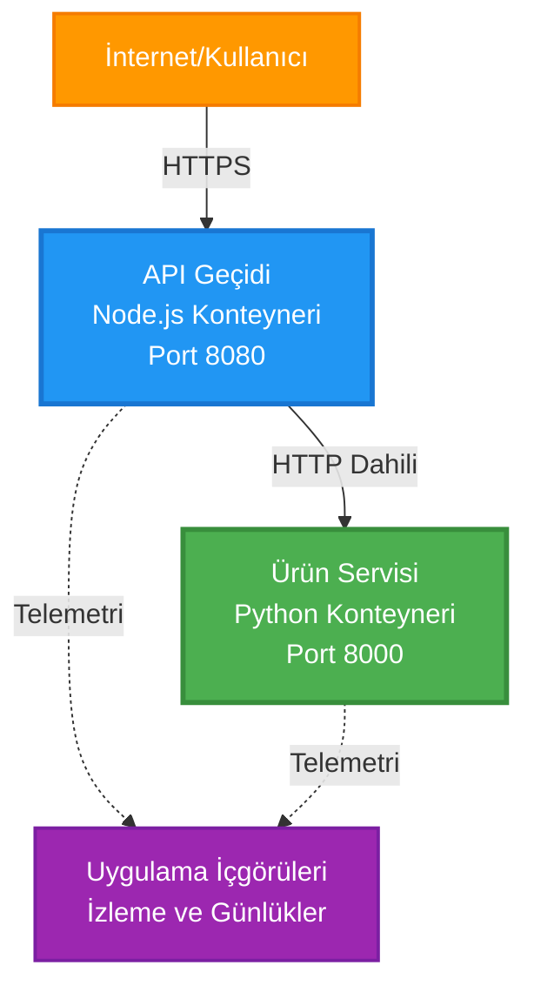
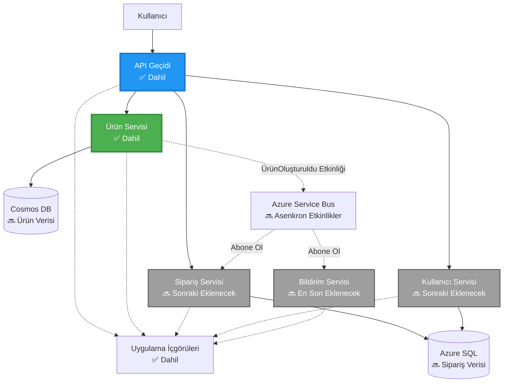
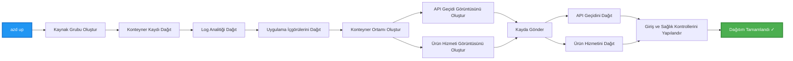
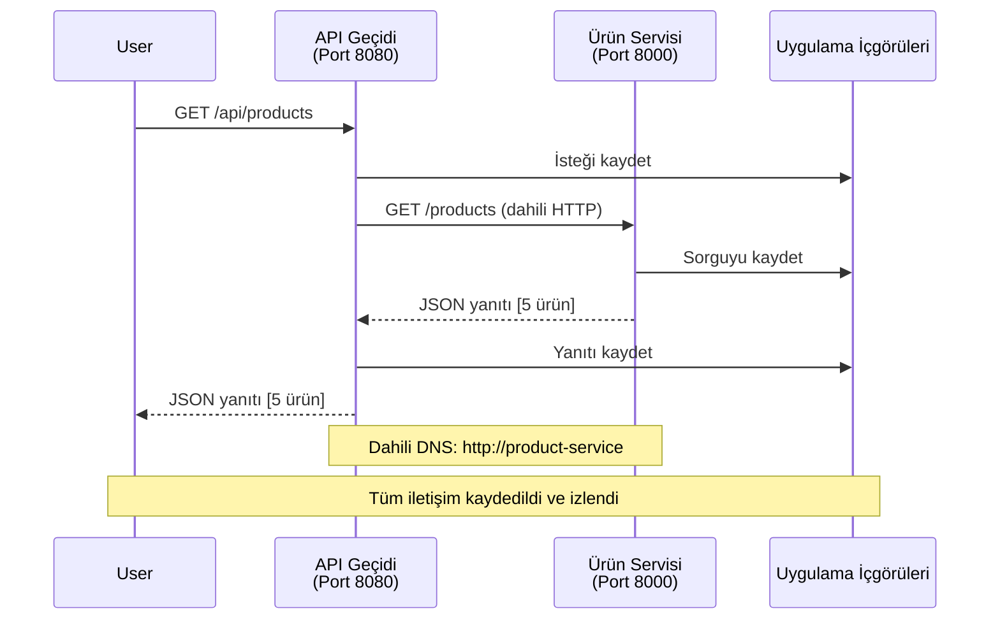

# Mikroservis Mimarisi - Konteyner Uygulama Örneği

⏱️ **Tahmini Süre**: 25-35 dakika | 💰 **Tahmini Maliyet**: ~50-100$/ay | ⭐ **Zorluk Seviyesi**: İleri

**📚 Öğrenme Yolu:**
- ← Önceki: [Basit Flask API](../../../../examples/container-app/simple-flask-api) - Tek konteyner temelleri
- 🎯 **Buradasınız**: Mikroservis Mimarisi (2 servis temeli)
- → Sonraki: [AI Entegrasyonu](../../../../docs/ai-foundry) - Servislerinize zeka ekleyin
- 🏠 [Kurs Ana Sayfası](../../README.md)

---

AZD CLI kullanarak Azure Container Apps'e dağıtılan **basitleştirilmiş ama işlevsel** bir mikroservis mimarisi. Bu örnek, servisler arası iletişim, konteyner orkestrasyonu ve izleme ile pratik bir 2 servis kurulumunu gösterir.

> **📚 Öğrenme Yaklaşımı**: Bu örnek, gerçekten dağıtabileceğiniz ve öğrenebileceğiniz minimal bir 2 servis mimarisi (API Gateway + Backend Servis) ile başlar. Bu temeli öğrendikten sonra, tam bir mikroservis ekosistemine genişletme konusunda rehberlik sağlıyoruz.

## Öğrenecekleriniz

Bu örneği tamamlayarak:
- Azure Container Apps'e birden fazla konteyner dağıtmayı
- Dahili ağ ile servisler arası iletişim uygulamayı
- Ortam tabanlı ölçeklendirme ve sağlık kontrolleri yapılandırmayı
- Application Insights ile dağıtılmış uygulamaları izlemeyi
- Mikroservis dağıtım desenlerini ve en iyi uygulamaları anlamayı
- Basitten karmaşık mimarilere doğru kademeli genişlemeyi öğrenmeyi başaracaksınız.

## Mimari

### Aşama 1: İnşa Ettiğimiz Şey (Bu Örnekte Dahil)


**Bileşen Detayları:**

| Bileşen | Amaç | Erişim | Kaynaklar |
|---------|------|--------|-----------|
| **API Gateway** | Harici istekleri arka uç servislere yönlendirir | Genel (HTTPS) | 1 vCPU, 2GB RAM, 2-20 kopya |
| **Ürün Servisi** | Bellek içi veri ile ürün kataloğunu yönetir | Sadece Dahili | 0.5 vCPU, 1GB RAM, 1-10 kopya |
| **Application Insights** | Merkezi günlük kaydı ve dağıtılmış izleme | Azure Portal | 1-2 GB/ay veri alımı |

**Neden Basit Başlıyoruz?**
- ✅ Hızlıca dağıt ve anla (25-35 dakika)
- ✅ Karmaşıklık olmadan temel mikroservis desenlerini öğren
- ✅ Değiştirip deneyebileceğiniz çalışan kod
- ✅ Öğrenme maliyeti daha düşük (~50-100$/ay vs 300-1400$/ay)
- ✅ Veritabanları ve mesaj kuyrukları eklemeden önce güven kazanın

**Benzetme**: Bunu araba kullanmayı öğrenmek gibi düşünün. Boş bir otoparkta (2 servis) başlarsınız, temelleri öğrenirsiniz, sonra şehir trafiğine geçersiniz (5+ servis, veritabanları ile).

### Aşama 2: Gelecekteki Genişleme (Referans Mimari)

2 servis mimarisini öğrendikten sonra genişletebilirsiniz:


Son bölümdeki "Genişleme Rehberi" kısmına bakarak adım adım talimatları takip edebilirsiniz.

## Dahil Edilen Özellikler

✅ **Servis Keşfi**: Konteynerler arasında otomatik DNS tabanlı keşif  
✅ **Yük Dengeleme**: Kopyalar arasında yerleşik yük dengeleme  
✅ **Otomatik Ölçeklendirme**: HTTP isteklerine göre her servis için bağımsız ölçeklendirme  
✅ **Sağlık İzleme**: Her iki servis için canlılık ve hazır olma kontrolleri  
✅ **Dağıtılmış Günlük Kaydı**: Application Insights ile merkezi günlük kaydı  
✅ **Dahili Ağ**: Güvenli servisler arası iletişim  
✅ **Konteyner Orkestrasyonu**: Otomatik dağıtım ve ölçeklendirme  
✅ **Kesintisiz Güncellemeler**: Revizyon yönetimi ile aşamalı güncellemeler  

## Ön Koşullar

### Gerekli Araçlar

Başlamadan önce aşağıdaki araçların kurulu olduğundan emin olun:

1. **[Azure Developer CLI (azd)](https://learn.microsoft.com/azure/developer/azure-developer-cli/install-azd)** (sürüm 1.0.0 veya üstü)
   ```bash
   azd version
   # Beklenen çıktı: azd sürüm 1.0.0 veya daha yüksek
   ```

2. **[Azure CLI](https://learn.microsoft.com/cli/azure/install-azure-cli)** (sürüm 2.50.0 veya üstü)
   ```bash
   az --version
   # Beklenen çıktı: azure-cli 2.50.0 veya daha yüksek
   ```

3. **[Docker](https://www.docker.com/get-started)** (yerel geliştirme/test için - isteğe bağlı)
   ```bash
   docker --version
   # Beklenen çıktı: Docker sürümü 20.10 veya daha yüksek
   ```

### Kurulumunuzu Doğrulayın

Hazır olduğunuzu doğrulamak için şu komutları çalıştırın:

```bash
# Azure Developer CLI'yi kontrol et
azd version
# ✅ Beklenen: azd sürüm 1.0.0 veya daha yüksek

# Azure CLI'yi kontrol et
az --version
# ✅ Beklenen: azure-cli 2.50.0 veya daha yüksek

# Docker'ı kontrol et (isteğe bağlı)
docker --version
# ✅ Beklenen: Docker sürüm 20.10 veya daha yüksek
```

**Başarı Kriteri**: Tüm komutlar minimum sürümleri karşılayan veya aşan sürüm numaraları döndürür.

### Azure Gereksinimleri

- Aktif bir **Azure aboneliği** ([ücretsiz hesap oluşturun](https://azure.microsoft.com/free/))
- Aboneliğinizde kaynak oluşturma izinleri
- Abonelik veya kaynak grubunda **Katkıda Bulunan** rolü

### Bilgi Ön Koşulları

Bu **ileri seviye** bir örnektir. Şunları bilmelisiniz:
- [Basit Flask API örneğini](../../../../examples/container-app/simple-flask-api) tamamlamış olmak
- Mikroservis mimarisini temel düzeyde anlamak
- REST API'ler ve HTTP hakkında bilgi sahibi olmak
- Konteyner kavramlarını anlamak

**Konteyner Uygulamalarına Yeni mi Başlıyorsunuz?** Önce [Basit Flask API örneği](../../../../examples/container-app/simple-flask-api) ile başlayarak temelleri öğrenin.

## Hızlı Başlangıç (Adım Adım)

### Adım 1: Klonlayın ve Gezin

```bash
git clone https://github.com/microsoft/AZD-for-beginners.git
cd AZD-for-beginners/examples/microservices
```

**✓ Başarı Kontrolü**: `azure.yaml` dosyasını gördüğünüzden emin olun:
```bash
ls
# Beklenen: README.md, azure.yaml, infra/, src/
```

### Adım 2: Azure ile Kimlik Doğrulama

```bash
azd auth login
```

Bu, Azure kimlik doğrulaması için tarayıcınızı açar. Azure kimlik bilgilerinizle oturum açın.

**✓ Başarı Kontrolü**: Şunu görmelisiniz:
```
Logged in to Azure.
```

### Adım 3: Ortamı Başlatın

```bash
azd init
```

**Göreceğiniz İstemler**:
- **Ortam adı**: Kısa bir ad girin (ör. `microservices-dev`)
- **Azure aboneliği**: Aboneliğinizi seçin
- **Azure konumu**: Bir bölge seçin (ör. `eastus`, `westeurope`)

**✓ Başarı Kontrolü**: Şunu görmelisiniz:
```
SUCCESS: New project initialized!
```

### Adım 4: Altyapı ve Servisleri Dağıtın

```bash
azd up
```

**Ne olur** (8-12 dakika sürer):


**✓ Başarı Kontrolü**: Şunu görmelisiniz:
```
SUCCESS: Your application was deployed to Azure in X minutes Y seconds.
Endpoint: https://api-gateway-<unique-id>.azurecontainerapps.io
```

**⏱️ Süre**: 8-12 dakika

### Adım 5: Dağıtımı Test Edin

```bash
# Ağ geçidi uç noktasını al
GATEWAY_URL=$(azd env get-values | grep API_GATEWAY_URL | cut -d '=' -f2 | tr -d '"')

# API Gateway sağlığını test et
curl $GATEWAY_URL/health
```

**✅ Beklenen Çıktı:**
```json
{
  "status": "healthy",
  "service": "api-gateway",
  "timestamp": "2025-11-19T10:30:00Z"
}
```

**Ürün servisini geçit üzerinden test edin**:
```bash
# Ürünleri listele
curl $GATEWAY_URL/api/products
```

**✅ Beklenen Çıktı:**
```json
[
  {"id":1,"name":"Laptop","price":999.99,"stock":50},
  {"id":2,"name":"Mouse","price":29.99,"stock":200},
  {"id":3,"name":"Keyboard","price":79.99,"stock":150}
]
```

**✓ Başarı Kontrolü**: Her iki uç nokta JSON verilerini hatasız döndürür.

---

**🎉 Tebrikler!** Azure'a bir mikroservis mimarisi dağıttınız!

## Proje Yapısı

Tüm uygulama dosyaları dahildir—bu, eksiksiz ve çalışan bir örnektir:

```
microservices/
│
├── README.md                         # This file
├── azure.yaml                        # AZD configuration
├── .gitignore                        # Git ignore patterns
│
├── infra/                           # Infrastructure as Code (Bicep)
│   ├── main.bicep                   # Main orchestration
│   ├── abbreviations.json           # Naming conventions
│   ├── core/                        # Shared infrastructure
│   │   ├── container-apps-environment.bicep  # Container environment + registry
│   │   └── monitor.bicep            # Application Insights + Log Analytics
│   └── app/                         # Service definitions
│       ├── api-gateway.bicep        # API Gateway container app
│       └── product-service.bicep    # Product Service container app
│
└── src/                             # Application source code
    ├── api-gateway/                 # Node.js API Gateway
    │   ├── app.js                   # Express server with routing
    │   ├── package.json             # Node dependencies
    │   └── Dockerfile               # Container definition
    └── product-service/             # Python Product Service
        ├── main.py                  # Flask API with product data
        ├── requirements.txt         # Python dependencies
        └── Dockerfile               # Container definition
```

**Her Bileşenin Yaptığı Şey:**

**Altyapı (infra/)**:
- `main.bicep`: Tüm Azure kaynaklarını ve bağımlılıklarını düzenler
- `core/container-apps-environment.bicep`: Container Apps ortamını ve Azure Container Registry'yi oluşturur
- `core/monitor.bicep`: Dağıtılmış günlük kaydı için Application Insights'ı ayarlar
- `app/*.bicep`: Ölçeklendirme ve sağlık kontrolleri ile bireysel konteyner uygulama tanımları

**API Gateway (src/api-gateway/)**:
- Arka uç servislere istekleri yönlendiren genel erişimli servis
- Günlük kaydı, hata yönetimi ve istek yönlendirme uygular
- Servisler arası HTTP iletişimini gösterir

**Ürün Servisi (src/product-service/)**:
- Bellek içi ürün kataloğu ile dahili servis (basitlik için veritabanı yok)
- Sağlık kontrolleri ile REST API
- Arka uç mikroservis desenine örnek

## Servisler Genel Bakış

### API Gateway (Node.js/Express)

**Port**: 8080  
**Erişim**: Genel (harici giriş)  
**Amaç**: Gelen istekleri uygun arka uç servislere yönlendirir  

**Uç Noktalar**:
- `GET /` - Servis bilgisi
- `GET /health` - Sağlık kontrol uç noktası
- `GET /api/products` - Ürün servisine yönlendirme (tümünü listele)
- `GET /api/products/:id` - Ürün servisine yönlendirme (ID ile al)

**Ana Özellikler**:
- Axios ile istek yönlendirme
- Merkezi günlük kaydı
- Hata yönetimi ve zaman aşımı yönetimi
- Ortam değişkenleri ile servis keşfi
- Application Insights entegrasyonu

**Kod Vurgusu** (`src/api-gateway/app.js`):
```javascript
// Dahili hizmet iletişimi
app.get('/api/products', async (req, res) => {
  const response = await axios.get(`${PRODUCT_SERVICE_URL}/products`, {
    timeout: 5000
  });
  res.json(response.data);
});
```

### Ürün Servisi (Python/Flask)

**Port**: 8000  
**Erişim**: Sadece Dahili (harici giriş yok)  
**Amaç**: Bellek içi veri ile ürün kataloğunu yönetir  

**Uç Noktalar**:
- `GET /` - Servis bilgisi
- `GET /health` - Sağlık kontrol uç noktası
- `GET /products` - Tüm ürünleri listele
- `GET /products/<id>` - ID ile ürün al

**Ana Özellikler**:
- Flask ile RESTful API
- Basitlik için veritabanı gerektirmeyen bellek içi ürün deposu
- Problar ile sağlık izleme
- Yapılandırılmış günlük kaydı
- Application Insights entegrasyonu

**Veri Modeli**:
```python
{
  "id": 1,
  "name": "Laptop",
  "description": "High-performance laptop",
  "price": 999.99,
  "stock": 50
}
```

**Neden Sadece Dahili?**
Ürün servisi genel olarak erişime açık değildir. Tüm istekler API Gateway üzerinden geçmelidir, bu da:
- Güvenlik: Kontrollü erişim noktası
- Esneklik: Arka ucu değiştirebilme
- İzleme: Merkezi istek günlük kaydı sağlar

## Servis İletişimini Anlama

### Servisler Birbirleriyle Nasıl İletişim Kurar


Bu örnekte, API Gateway, Ürün Servisi ile **dahili HTTP çağrıları** kullanarak iletişim kurar:

```javascript
// API Geçidi (src/api-gateway/app.js)
const PRODUCT_SERVICE_URL = process.env.PRODUCT_SERVICE_URL;

// Dahili HTTP isteği yap
const response = await axios.get(`${PRODUCT_SERVICE_URL}/products`);
```

**Ana Noktalar**:

1. **DNS Tabanlı Keşif**: Container Apps, dahili servisler için otomatik olarak DNS sağlar
   - Ürün Servisi FQDN: `product-service.internal.<environment>.azurecontainerapps.io`
   - Basitleştirilmiş hali: `http://product-service` (Container Apps bunu çözer)

2. **Genel Erişim Yok**: Ürün Servisi Bicep'te `external: false` olarak ayarlanmıştır
   - Sadece Container Apps ortamında erişilebilir
   - İnternetten erişilemez

3. **Ortam Değişkenleri**: Servis URL'leri dağıtım sırasında enjekte edilir
   - Bicep, dahili FQDN'yi geçide iletir
   - Uygulama kodunda sabit URL'ler yok

**Benzetme**: Bunu ofis odaları gibi düşünün. API Gateway bir resepsiyon masasıdır (genel erişimli), Ürün Servisi ise bir ofis odasıdır (sadece dahili). Ziyaretçiler herhangi bir ofise ulaşmak için resepsiyondan geçmelidir.

## Dağıtım Seçenekleri

### Tam Dağıtım (Önerilen)

```bash
# Altyapıyı ve her iki hizmeti dağıt
azd up
```

Bu şunları dağıtır:
1. Container Apps ortamı
2. Application Insights
3. Container Registry
4. API Gateway konteyneri
5. Ürün Servisi konteyneri

**Süre**: 8-12 dakika

### Bireysel Servis Dağıtımı

```bash
# Yalnızca bir hizmet dağıtın (ilk azd up işleminden sonra)
azd deploy api-gateway

# Veya ürün hizmetini dağıtın
azd deploy product-service
```

**Kullanım Durumu**: Bir serviste kod güncellediğinizde ve yalnızca o servisi yeniden dağıtmak istediğinizde.

### Yapılandırmayı Güncelleme

```bash
# Ölçeklendirme parametrelerini değiştir
azd env set GATEWAY_MAX_REPLICAS 30

# Yeni yapılandırma ile yeniden dağıt
azd up
```

## Yapılandırma

### Ölçeklendirme Yapılandırması

Her iki servis de Bicep dosyalarında HTTP tabanlı otomatik ölçeklendirme ile yapılandırılmıştır:

**API Gateway**:
- Minimum kopya: 2 (her zaman en az 2 kullanılabilirlik için)
- Maksimum kopya: 20
- Ölçek tetikleyici: Kopya başına 50 eşzamanlı istek

**Ürün Servisi**:
- Minimum kopya: 1 (gerekirse sıfıra ölçeklenebilir)
- Maksimum kopya: 10
- Ölçek tetikleyici: Kopya başına 100 eşzamanlı istek

**Ölçeklendirmeyi Özelleştirme** (`infra/app/*.bicep` içinde):
```bicep
scale: {
  minReplicas: 1
  maxReplicas: 10
  rules: [
    {
      name: 'http-scale-rule'
      http: {
        metadata: {
          concurrentRequests: '100'  // Adjust this
        }
      }
    }
  ]
}
```

### Kaynak Tahsisi

**API Gateway**:
- CPU: 1.0 vCPU
- Bellek: 2 GiB
- Sebep: Tüm harici trafiği işler

**Ürün Servisi**:
- CPU: 0.5 vCPU
- Bellek: 1 GiB
- Sebep: Hafif bellek içi işlemler

### Sağlık Kontrolleri

Her iki servis canlılık ve hazır olma problarını içerir:

```bicep
probes: [
  {
    type: 'Liveness'
    httpGet: {
      path: '/health'
      port: 8080
    }
    initialDelaySeconds: 10
    periodSeconds: 30
  }
  {
    type: 'Readiness'
    httpGet: {
      path: '/health'
      port: 8080
    }
    initialDelaySeconds: 5
    periodSeconds: 10
  }
]
```

**Bu Ne Anlama Geliyor**:
- **Canlılık**: Sağlık kontrolü başarısız olursa, Container Apps konteyneri yeniden başlatır
- **Hazır Olma**: Hazır değilse, Container Apps o kopyaya trafik yönlendirmeyi durdurur

## İzleme ve Gözlemlenebilirlik

### Servis Günlüklerini Görüntüleme

```bash
# API Gateway'den günlükleri akıt
azd logs api-gateway --follow

# Son ürün hizmeti günlüklerini görüntüle
azd logs product-service --tail 100

# Her iki hizmetten tüm günlükleri görüntüle
azd logs --follow
```

**Beklenen Çıktı**:
```
[api-gateway] API Gateway listening on port 8080
[api-gateway] Product Service URL: http://product-service
[api-gateway] GET /api/products 200 - 45ms
[product-service] Retrieved 5 products
```

### Application Insights Sorguları

Azure Portal'da Application Insights'a erişin, ardından şu sorguları çalıştırın:

**Yavaş İstekleri Bul**:
```kusto
requests
| where timestamp > ago(1h)
| where duration > 1000  // Requests taking >1 second
| summarize count() by name, cloud_RoleName
| order by count_ desc
```

**Servisler Arası Çağrıları İzle**:
```kusto
dependencies
| where timestamp > ago(1h)
| where type == "Http"
| project timestamp, name, target, duration, success
| order by timestamp desc
```

**Servis Başına Hata Oranı**:
```kusto
exceptions
| where timestamp > ago(24h)
| summarize errorCount = count() by cloud_RoleName, type
| order by errorCount desc
```

**Zaman İçinde İstek Hacmi**:
```kusto
requests
| where timestamp > ago(1h)
| summarize requestCount = count() by bin(timestamp, 5m), cloud_RoleName
| render timechart
```

### İzleme Panosuna Erişim

```bash
# Uygulama İçgörüleri ayrıntılarını alın
azd env get-values | grep APPLICATIONINSIGHTS

# Azure Portal izlemeyi açın
az monitor app-insights component show \
  --app $(azd env get-values | grep APPLICATIONINSIGHTS_CONNECTION_STRING | cut -d '=' -f2) \
  --resource-group $(azd env get-values | grep AZURE_RESOURCE_GROUP | cut -d '=' -f2) \
  --query "appId" -o tsv
```

### Canlı Metrikler

1. Azure Portal'da Application Insights'a gidin
2. "Canlı Metrikler"e tıklayın
3. Gerçek zamanlı istekleri, hataları ve performansı görün
4. Test etmek için şunu çalıştırın: `curl $(azd env get-values | grep API_GATEWAY_URL | cut -d '=' -f2 | tr -d '"')/api/products`

## Pratik Egzersizler

### Egzersiz 1: Yeni Bir Ürün Uç Noktası Ekleyin ⭐ (Kolay)

**Amaç**: Yeni ürünler oluşturmak için bir POST uç noktası ekleyin

**Başlangıç Noktası**: `src/product-service/main.py`

**Adımlar**:

1. `main.py` içinde `get_product` fonksiyonundan sonra şu uç noktayı ekleyin:

```python
@app.route('/products', methods=['POST'])
def create_product():
    """Create a new product"""
    data = request.get_json()
    
    # Gerekli alanları doğrula
    if not data or 'name' not in data or 'price' not in data:
        return jsonify({'error': 'Missing required fields: name, price'}), 400
    
    new_id = max(p['id'] for p in products) + 1
    new_product = {
        'id': new_id,
        'name': data['name'],
        'description': data.get('description', ''),
        'price': float(data['price']),
        'stock': int(data.get('stock', 0))
    }
    products.append(new_product)
    logger.info(f"Created product {new_id}")
    return jsonify(new_product), 201
```

2. API Gateway'e POST rotası ekleyin (`src/api-gateway/app.js`):

```javascript
// Bunu GET /api/products rotasından sonra ekleyin
app.post('/api/products', async (req, res) => {
  try {
    console.log(`Forwarding POST request to ${PRODUCT_SERVICE_URL}/products`);
    const response = await axios.post(`${PRODUCT_SERVICE_URL}/products`, req.body, {
      timeout: 5000
    });
    res.status(201).json(response.data);
  } catch (error) {
    console.error('Error calling product service:', error.message);
    res.status(503).json({
      error: 'Product service unavailable',
      message: error.message
    });
  }
});
```

3. Her iki servisi yeniden dağıtın:

```bash
azd deploy product-service
azd deploy api-gateway
```

4. Yeni uç noktayı test edin:

```bash
GATEWAY_URL=$(azd env get-values | grep API_GATEWAY_URL | cut -d '=' -f2 | tr -d '"')

# Yeni bir ürün oluştur
curl -X POST $GATEWAY_URL/api/products \
  -H "Content-Type: application/json" \
  -d '{"name":"USB Cable","price":9.99,"stock":500}'
```

**✅ Beklenen çıktı:**
```json
{"id":6,"name":"USB Cable","description":"","price":9.99,"stock":500}
```

5. Listede göründüğünü doğrulayın:

```bash
curl $GATEWAY_URL/api/products
# Şimdi yeni USB Kablosu dahil olmak üzere 6 ürün göstermelidir.
```

**Başarı Kriterleri**:
- ✅ POST isteği HTTP 201 döndürür
- ✅ Yeni ürün GET /api/products listesinde görünür
- ✅ Ürün otomatik artan bir ID'ye sahiptir

**Süre**: 10-15 dakika

---

### Alıştırma 2: Otomatik Ölçeklendirme Kurallarını Değiştir ⭐⭐ (Orta)

**Hedef**: Product Service'in daha agresif ölçeklenmesini sağlamak

**Başlangıç Noktası**: `infra/app/product-service.bicep`

**Adımlar**:

1. `infra/app/product-service.bicep` dosyasını açın ve `scale` bloğunu bulun (yaklaşık 95. satır)

2. Şu şekilde değiştirin:
```bicep
scale: {
  minReplicas: 1
  maxReplicas: 10
  rules: [
    {
      name: 'http-scale-rule'
      http: {
        metadata: {
          concurrentRequests: '100'  // OLD
        }
      }
    }
  ]
}
```

Şuna:
```bicep
scale: {
  minReplicas: 2  // Always have 2 running
  maxReplicas: 20  // Allow more scaling
  rules: [
    {
      name: 'http-scale-rule'
      http: {
        metadata: {
          concurrentRequests: '20'  // Scale at lower threshold
        }
      }
    }
  ]
}
```

3. Altyapıyı yeniden dağıtın:

```bash
azd up
```

4. Yeni ölçeklendirme yapılandırmasını doğrulayın:

```bash
az containerapp show \
  --name $(azd env get-values | grep PRODUCT_SERVICE | head -1 | cut -d '/' -f5) \
  --resource-group $(azd env get-values | grep AZURE_RESOURCE_GROUP | cut -d '=' -f2 | tr -d '"') \
  --query "properties.template.scale" -o json
```

**✅ Beklenen çıktı:**
```json
{
  "minReplicas": 2,
  "maxReplicas": 20,
  "rules": [...]
}
```

5. Yük ile otomatik ölçeklendirmeyi test edin:

```bash
# Eşzamanlı istekler oluştur
for i in {1..500}; do curl $GATEWAY_URL/api/products & done

# Ölçeklendirme olayını izle
azd logs product-service --follow
# Şunu ara: Container Apps ölçeklendirme olayları
```

**Başarı Kriterleri**:
- ✅ Product Service her zaman en az 2 kopya çalıştırır
- ✅ Yük altında 2'den fazla kopyaya ölçeklenir
- ✅ Azure Portal yeni ölçeklendirme kurallarını gösterir

**Süre**: 15-20 dakika

---

### Alıştırma 3: Özel İzleme Sorgusu Ekle ⭐⭐ (Orta)

**Hedef**: Ürün API performansını izlemek için özel bir Application Insights sorgusu oluşturun

**Adımlar**:

1. Azure Portal'da Application Insights'a gidin:
   - Azure Portal'a gidin
   - Kaynak grubunuzu bulun (rg-microservices-*)
   - Application Insights kaynağına tıklayın

2. Sol menüde "Logs" seçeneğine tıklayın

3. Bu sorguyu oluşturun:

```kusto
requests
| where timestamp > ago(1h)
| where name contains "products"
| summarize 
    RequestCount = count(),
    AvgDuration = avg(duration),
    P95Duration = percentile(duration, 95),
    SuccessRate = 100.0 * countif(success == true) / count()
  by bin(timestamp, 5m)
| render timechart
```

4. Sorguyu çalıştırmak için "Run" butonuna tıklayın

5. Sorguyu kaydedin:
   - "Save" butonuna tıklayın
   - Ad: "Product API Performance"
   - Kategori: "Performance"

6. Test trafiği oluşturun:

```bash
for i in {1..100}; do curl $GATEWAY_URL/api/products; sleep 1; done
```

7. Verileri görmek için sorguyu yenileyin

**✅ Beklenen çıktı:**
- Zaman içinde istek sayısını gösteren grafik
- Ortalama süre < 500ms
- Başarı oranı = %100
- 5 dakikalık zaman aralıkları

**Başarı Kriterleri**:
- ✅ Sorgu 100+ isteği gösterir
- ✅ Başarı oranı %100'dür
- ✅ Ortalama süre < 500ms
- ✅ Grafik 5 dakikalık zaman aralıklarını gösterir

**Öğrenim Çıktısı**: Özel sorgularla servis performansını nasıl izleyeceğinizi anlayın

**Süre**: 10-15 dakika

---

### Alıştırma 4: Yeniden Deneme Mantığı Uygula ⭐⭐⭐ (İleri Seviye)

**Hedef**: Product Service geçici olarak kullanılamadığında API Gateway'e yeniden deneme mantığı ekleyin

**Başlangıç Noktası**: `src/api-gateway/app.js`

**Adımlar**:

1. Yeniden deneme kütüphanesini yükleyin:

```bash
cd src/api-gateway
npm install axios-retry --save
cd ../..
```

2. `src/api-gateway/app.js` dosyasını güncelleyin (axios importundan sonra ekleyin):

```javascript
const axiosRetry = require('axios-retry');

// Yeniden deneme mantığını yapılandır
axiosRetry(axios, {
  retries: 3,
  retryDelay: (retryCount) => {
    return retryCount * 1000; // 1s, 2s, 3s
  },
  retryCondition: (error) => {
    // Ağ hatalarında veya 5xx yanıtlarında yeniden dene
    return axiosRetry.isNetworkOrIdempotentRequestError(error) ||
           (error.response && error.response.status >= 500);
  }
});

console.log('Retry logic configured: 3 retries with exponential backoff');
```

3. API Gateway'i yeniden dağıtın:

```bash
azd deploy api-gateway
```

4. Servis hatasını simüle ederek yeniden deneme davranışını test edin:

```bash
# Ürün hizmetini 0'a ölçeklendir (hata simülasyonu yap)
az containerapp update \
  --name $(azd env get-values | grep PRODUCT_SERVICE | head -1 | cut -d '/' -f5) \
  --resource-group $(azd env get-values | grep AZURE_RESOURCE_GROUP | cut -d '=' -f2 | tr -d '"') \
  --min-replicas 0 \
  --max-replicas 0

# Ürünlere erişmeye çalış (3 kez yeniden deneyecek)
time curl -v $GATEWAY_URL/api/products
# Gözlemle: Yanıt ~6 saniye sürer (1s + 2s + 3s yeniden denemeler)

# Ürün hizmetini geri yükle
az containerapp update \
  --name $(azd env get-values | grep PRODUCT_SERVICE | head -1 | cut -d '/' -f5) \
  --resource-group $(azd env get-values | grep AZURE_RESOURCE_GROUP | cut -d '=' -f2 | tr -d '"') \
  --min-replicas 1 \
  --max-replicas 10
```

5. Yeniden deneme günlüklerini görüntüleyin:

```bash
azd logs api-gateway --tail 50
# Yeniden deneme girişimi mesajlarını arayın
```

**✅ Beklenen davranış:**
- İstekler başarısız olmadan önce 3 kez yeniden denenir
- Her yeniden deneme daha uzun bekler (1s, 2s, 3s)
- Servis yeniden başlatıldıktan sonra başarılı istekler
- Günlükler yeniden deneme girişimlerini gösterir

**Başarı Kriterleri**:
- ✅ İstekler başarısız olmadan önce 3 kez yeniden denenir
- ✅ Her yeniden deneme daha uzun bekler (üstel geri çekilme)
- ✅ Servis yeniden başlatıldıktan sonra başarılı istekler
- ✅ Günlükler yeniden deneme girişimlerini gösterir

**Öğrenim Çıktısı**: Mikroservislerde dayanıklılık desenlerini anlayın (devre kesiciler, yeniden denemeler, zaman aşımı)

**Süre**: 20-25 dakika

---

## Bilgi Kontrol Noktası

Bu örneği tamamladıktan sonra bilginizi doğrulayın:

### 1. Servis İletişimi ✓

Bilginizi test edin:
- [ ] API Gateway'in Product Service'i nasıl keşfettiğini açıklayabilir misiniz? (DNS tabanlı servis keşfi)
- [ ] Product Service kapalıysa ne olur? (Gateway 503 hatası döndürür)
- [ ] Üçüncü bir servisi nasıl eklerdiniz? (Yeni bir Bicep dosyası oluşturun, main.bicep'e ekleyin, src klasörü oluşturun)

**Uygulamalı Doğrulama**:
```bash
# Hizmet arızasını simüle et
az containerapp update --name <product-service-name> --min-replicas 0 --max-replicas 0
curl $GATEWAY_URL/api/products
# ✅ Beklenen: 503 Hizmet Kullanılamıyor

# Hizmeti geri yükle
az containerapp update --name <product-service-name> --min-replicas 1 --max-replicas 10
```

### 2. İzleme ve Gözlemlenebilirlik ✓

Bilginizi test edin:
- [ ] Dağıtılmış günlükleri nerede görürsünüz? (Azure Portal'da Application Insights)
- [ ] Yavaş istekleri nasıl takip edersiniz? (Kusto sorgusu: `requests | where duration > 1000`)
- [ ] Hangi servisin hataya neden olduğunu nasıl belirlerdiniz? (Günlüklerde `cloud_RoleName` alanını kontrol edin)

**Uygulamalı Doğrulama**:
```bash
# Yavaş bir istek simülasyonu oluştur
curl "$GATEWAY_URL/api/products?delay=2000"

# Yavaş istekler için Application Insights sorgula
# Azure Portal → Application Insights → Günlükler'e git
# Çalıştır: requests | where duration > 1000 | project timestamp, name, duration, cloud_RoleName
```

### 3. Ölçeklendirme ve Performans ✓

Bilginizi test edin:
- [ ] Otomatik ölçeklendirmeyi ne tetikler? (HTTP eşzamanlı istek kuralları: gateway için 50, ürün için 100)
- [ ] Şu anda kaç kopya çalışıyor? (`az containerapp revision list` ile kontrol edin)
- [ ] Product Service'i 5 kopyaya nasıl ölçeklendirirsiniz? (Bicep'te minReplicas'ı güncelleyin)

**Uygulamalı Doğrulama**:
```bash
# Otomatik ölçeklendirmeyi test etmek için yük oluştur
for i in {1..1000}; do curl $GATEWAY_URL/api/products & done

# Çoğaltmaların arttığını izle
azd logs api-gateway --follow
# ✅ Beklenen: Günlüklerde ölçeklendirme olaylarını gör
```

**Başarı Kriterleri**: Tüm soruları yanıtlayabilir ve uygulamalı komutlarla doğrulayabilirsiniz.

---

## Maliyet Analizi

### Tahmini Aylık Maliyetler (Bu 2 Servis Örneği İçin)

| Kaynak | Yapılandırma | Tahmini Maliyet |
|--------|--------------|-----------------|
| API Gateway | 2-20 kopya, 1 vCPU, 2GB RAM | $30-150 |
| Product Service | 1-10 kopya, 0.5 vCPU, 1GB RAM | $15-75 |
| Container Registry | Temel seviye | $5 |
| Application Insights | 1-2 GB/ay | $5-10 |
| Log Analytics | 1 GB/ay | $3 |
| **Toplam** | | **$58-243/ay** |

### Kullanıma Göre Maliyet Dağılımı

**Hafif trafik** (test/öğrenme): ~60$/ay
- API Gateway: 2 kopya × 24/7 = $30
- Product Service: 1 kopya × 24/7 = $15
- İzleme + Kayıt = $13

**Orta trafik** (küçük üretim): ~120$/ay
- API Gateway: Ortalama 5 kopya = $75
- Product Service: Ortalama 3 kopya = $45
- İzleme + Kayıt = $13

**Yoğun trafik** (yoğun dönemler): ~240$/ay
- API Gateway: Ortalama 15 kopya = $225
- Product Service: Ortalama 8 kopya = $120
- İzleme + Kayıt = $13

### Maliyet Optimizasyon İpuçları

1. **Geliştirme için Sıfıra Ölçeklendirin**:
   ```bicep
   scale: {
     minReplicas: 0  // Save $30-40/month when not in use
     maxReplicas: 10
   }
   ```

2. **Cosmos DB için Tüketim Planı Kullanın** (eklediğinizde):
   - Sadece kullandığınız kadar ödeyin
   - Minimum ücret yok

3. **Application Insights Örnekleme Ayarlayın**:
   ```javascript
   appInsights.defaultClient.config.samplingPercentage = 50; // Taleplerin %50'sini örnekle
   ```

4. **Gerekmediğinde Temizlik Yapın**:
   ```bash
   azd down --force --purge
   ```

### Ücretsiz Katman Seçenekleri

Öğrenme/test için şunları düşünün:
- ✅ Azure ücretsiz kredilerini kullanın (yeni hesaplarla ilk 30 gün için $200)
- ✅ Minimum kopyalara bağlı kalın (maliyetleri ~%50 azaltır)
- ✅ Testten sonra silin (devam eden ücret yok)
- ✅ Öğrenme oturumları arasında sıfıra ölçeklendirin

**Örnek**: Bu örneği 2 saat/gün × 30 gün çalıştırmak = ~5$/ay yerine 60$/ay

---

## Sorun Giderme Hızlı Referansı

### Sorun: `azd up` "Abonelik bulunamadı" hatasıyla başarısız oluyor

**Çözüm**:
```bash
# Abonelikle tekrar giriş yapın
az account set --subscription <your-subscription-id>
azd env set AZURE_SUBSCRIPTION_ID <your-subscription-id>
azd up
```

### Sorun: API Gateway 503 "Product service unavailable" döndürüyor

**Teşhis**:
```bash
# Ürün hizmeti günlüklerini kontrol et
azd logs product-service --tail 50

# Ürün hizmeti sağlığını kontrol et
az containerapp show \
  --name $(azd env get-values | grep PRODUCT_SERVICE | head -1 | cut -d '/' -f5) \
  --resource-group $(azd env get-values | grep AZURE_RESOURCE_GROUP | cut -d '=' -f2 | tr -d '"') \
  --query "properties.runningStatus"
```

**Yaygın Nedenler**:
1. Product service başlamadı (Python hataları için günlükleri kontrol edin)
2. Sağlık kontrolü başarısız ( `/health` uç noktasının çalıştığını doğrulayın)
3. Container görüntüsü oluşturulamadı (görüntü için kayıt defterini kontrol edin)

### Sorun: Otomatik ölçeklendirme çalışmıyor

**Teşhis**:
```bash
# Mevcut replika sayısını kontrol et
az containerapp revision list \
  --name $(azd env get-values | grep API_GATEWAY | head -1 | cut -d '/' -f5) \
  --resource-group $(azd env get-values | grep AZURE_RESOURCE_GROUP | cut -d '=' -f2 | tr -d '"') \
  --query "[].properties.replicas"

# Test için yük oluştur
for i in {1..1000}; do curl $GATEWAY_URL/api/products & done

# Ölçeklendirme olaylarını izle
azd logs api-gateway --follow | grep -i scale
```

**Yaygın Nedenler**:
1. Ölçeklendirme kuralını tetiklemek için yük yeterince yüksek değil (50 eşzamanlı istekten fazla gerekli)
2. Maksimum kopya sayısına ulaşıldı (Bicep yapılandırmasını kontrol edin)
3. Bicep'te ölçeklendirme kuralı yanlış yapılandırılmış (concurrentRequests değerini doğrulayın)

### Sorun: Application Insights günlükleri göstermiyor

**Teşhis**:
```bash
# Bağlantı dizesinin ayarlandığını doğrula
azd env get-values | grep APPLICATIONINSIGHTS

# Hizmetlerin telemetri gönderip göndermediğini kontrol et
az monitor app-insights component show \
  --app $(azd env get-values | grep APPLICATIONINSIGHTS_NAME | cut -d '=' -f2 | tr -d '"') \
  --resource-group $(azd env get-values | grep AZURE_RESOURCE_GROUP | cut -d '=' -f2 | tr -d '"') \
  --query "properties.InstrumentationKey"
```

**Yaygın Nedenler**:
1. Bağlantı dizesi konteynere iletilmedi (çevre değişkenlerini kontrol edin)
2. Application Insights SDK yapılandırılmadı (kodda importları doğrulayın)
3. Telemetriyi engelleyen güvenlik duvarı (nadir, ağ kurallarını kontrol edin)

### Sorun: Docker yerel olarak oluşturulamıyor

**Teşhis**:
```bash
# API Gateway yapısını test et
cd src/api-gateway
docker build -t test-gateway .

# Ürün Servisi yapısını test et
cd ../product-service
docker build -t test-product .
```

**Yaygın Nedenler**:
1. package.json/requirements.txt dosyasında eksik bağımlılıklar
2. Dockerfile sözdizimi hataları
3. Bağımlılıkları indirirken ağ sorunları

**Hala Çözülemedi mi?** [Yaygın Sorunlar Kılavuzu](../../docs/troubleshooting/common-issues.md) veya [Azure Container Apps Sorun Giderme](https://learn.microsoft.com/azure/container-apps/troubleshooting) adresine bakın

---

## Temizlik

Devam eden ücretlerden kaçınmak için tüm kaynakları silin:

```bash
azd down --force --purge
```

**Onay İstemi**:
```
? Total resources to delete: 6, are you sure you want to continue? (y/N)
```

Onaylamak için `y` yazın.

**Silinenler**:
- Container Apps Ortamı
- Her iki Container App (gateway ve product service)
- Container Registry
- Application Insights
- Log Analytics Workspace
- Kaynak Grubu

**✓ Temizliği Doğrula**:
```bash
az group list --query "[?starts_with(name,'rg-microservices')]" --output table
```

Boş döndürmelidir.

---

## Genişletme Kılavuzu: 2'den 5+ Servise

Bu 2 servis mimarisini öğrendikten sonra genişletme adımları:

### Aşama 1: Veritabanı Kalıcılığı Ekle (Sonraki Adım)

**Product Service için Cosmos DB ekleyin**:

1. `infra/core/cosmos.bicep` oluşturun:
   ```bicep
   resource cosmosAccount 'Microsoft.DocumentDB/databaseAccounts@2023-04-15' = {
     name: name
     location: location
     kind: 'GlobalDocumentDB'
     properties: {
       databaseAccountOfferType: 'Standard'
       consistencyPolicy: { defaultConsistencyLevel: 'Session' }
       locations: [{ locationName: location, failoverPriority: 0 }]
     }
   }
   ```

2. Ürün servisini Azure Cosmos DB Python SDK kullanacak şekilde güncelleyin (hafıza içi veri yerine)

3. Tahmini ek maliyet: ~25$/ay (sunucusuz)

### Aşama 2: Üçüncü Servisi Ekleyin (Sipariş Yönetimi)

**Order Service oluşturun**:

1. Yeni klasör: `src/order-service/` (Python/Node.js/C#)
2. Yeni Bicep: `infra/app/order-service.bicep`
3. API Gateway'i `/api/orders` yönlendirecek şekilde güncelleyin
4. Sipariş kalıcılığı için Azure SQL Database ekleyin

**Mimari şu hale gelir**:
```
API Gateway → Product Service (Cosmos DB)
           → Order Service (Azure SQL)
```

### Aşama 3: Asenkron İletişim Ekle (Service Bus)

**Olay Tabanlı Mimari Uygulayın**:

1. Azure Service Bus ekleyin: `infra/core/servicebus.bicep`
2. Product Service "ProductCreated" olaylarını yayınlar
3. Order Service ürün olaylarına abone olur
4. Olayları işlemek için Notification Service ekleyin

**Desen**: İstek/Cevap (HTTP) + Olay Tabanlı (Service Bus)

### Aşama 4: Kullanıcı Kimlik Doğrulama Ekleyin

**User Service uygulayın**:

1. `src/user-service/` oluşturun (Go/Node.js)
2. Azure AD B2C veya özel JWT kimlik doğrulama ekleyin
3. API Gateway, yönlendirmeden önce tokenları doğrular
4. Servisler kullanıcı izinlerini kontrol eder

### Aşama 5: Üretim Hazırlığı

**Şu Bileşenleri Ekleyin**:
- ✅ Azure Front Door (küresel yük dengeleme)
- ✅ Azure Key Vault (gizli yönetimi)
- ✅ Azure Monitor Workbooks (özel panolar)
- ✅ CI/CD Pipeline (GitHub Actions)
- ✅ Mavi-Yeşil Dağıtımlar
- ✅ Tüm servisler için Yönetilen Kimlik

**Tam Üretim Mimarisi Maliyeti**: ~300-1,400$/ay

---

## Daha Fazla Bilgi Edinin

### İlgili Belgeler
- [Azure Container Apps Belgeleri](https://learn.microsoft.com/azure/container-apps/)
- [Mikroservis Mimari Kılavuzu](https://learn.microsoft.com/azure/architecture/guide/architecture-styles/microservices)
- [Dağıtılmış İzleme için Application Insights](https://learn.microsoft.com/azure/azure-monitor/app/distributed-tracing)
- [Azure Developer CLI Belgeleri](https://learn.microsoft.com/azure/developer/azure-developer-cli/)

### Bu Kursta Sonraki Adımlar
- ← Önceki: [Basit Flask API](../../../../examples/container-app/simple-flask-api) - Başlangıç tek konteyner örneği
- → Sonraki: [AI Entegrasyon Kılavuzu](../../../../docs/ai-foundry) - AI yetenekleri ekleyin
- 🏠 [Kurs Ana Sayfası](../../README.md)

### Karşılaştırma: Ne Zaman Ne Kullanılır

| Özellik | Tek Konteyner | Mikroservisler (Bu) | Kubernetes (AKS) |
|---------|---------------|---------------------|------------------|
| **Kullanım Durumu** | Basit uygulamalar | Karmaşık uygulamalar | Kurumsal uygulamalar |
| **Ölçeklenebilirlik** | Tek servis | Servis başına ölçeklendirme | Maksimum esneklik |
| **Karmaşıklık** | Düşük | Orta | Yüksek |
| **Ekip Boyutu** | 1-3 geliştirici | 3-10 geliştirici | 10+ geliştirici |
| **Maliyet** | ~15-50$/ay | ~60-250$/ay | ~150-500$/ay |
| **Dağıtım Süresi** | 5-10 dakika | 8-12 dakika | 15-30 dakika |
| **En İyisi İçin** | MVP'ler, prototipler | Üretim uygulamaları | Çoklu bulut, gelişmiş ağ oluşturma |

**Öneri**: Container Apps ile başlayın (bu örnek), yalnızca Kubernetes'e özgü özelliklere ihtiyacınız varsa AKS'ye geçin.

---

## Sıkça Sorulan Sorular

**S: Neden 5+ hizmet yerine sadece 2 hizmet?**  
C: Eğitimsel ilerleme. Karmaşıklık eklemeden önce basit bir örnekle temel bilgileri (hizmet iletişimi, izleme, ölçeklendirme) öğrenin. Burada öğrendiğiniz kalıplar, 100 hizmetli mimarilere uygulanabilir.

**S: Kendim daha fazla hizmet ekleyebilir miyim?**  
C: Kesinlikle! Yukarıdaki genişletme rehberini takip edin. Her yeni hizmet aynı deseni izler: src klasörü oluşturun, Bicep dosyası oluşturun, azure.yaml dosyasını güncelleyin, dağıtın.

**S: Bu üretime hazır mı?**  
C: Sağlam bir temel. Üretim için şunları ekleyin: yönetilen kimlik, Key Vault, kalıcı veritabanları, CI/CD hattı, izleme uyarıları ve yedekleme stratejisi.

**S: Neden Dapr veya başka bir hizmet ağı kullanmıyoruz?**  
C: Öğrenme için basit tutun. Yerel Container Apps ağ oluşturmayı anladıktan sonra, gelişmiş senaryolar için (durum yönetimi, pub/sub, bağlamalar) Dapr'ı ekleyebilirsiniz.

**S: Yerelde nasıl hata ayıklayabilirim?**  
C: Hizmetleri Docker ile yerelde çalıştırın:  
```bash
cd src/api-gateway
docker build -t local-gateway .
docker run -p 8080:8080 -e PRODUCT_SERVICE_URL=http://localhost:8000 local-gateway
```
  
**S: Farklı programlama dilleri kullanabilir miyim?**  
C: Evet! Bu örnek Node.js (gateway) + Python (ürün hizmeti) gösteriyor. C#, Go, Java, Ruby, PHP gibi konteynerlerde çalışan herhangi bir dili karıştırabilirsiniz.

**S: Azure kredim yoksa ne yapabilirim?**  
C: Azure ücretsiz katmanını kullanın (yeni hesaplarla ilk 30 gün için $200 kredi alırsınız) veya kısa test süreleri için dağıtım yapıp hemen silin. Bu örneğin maliyeti yaklaşık $2/gün.

**S: Bu, Azure Kubernetes Service (AKS)'den nasıl farklı?**  
C: Container Apps daha basit (Kubernetes bilgisi gerekmez) ancak daha az esnek. AKS size tam Kubernetes kontrolü sağlar ancak daha fazla uzmanlık gerektirir. Container Apps ile başlayın, gerekirse AKS'ye geçin.

**S: Mevcut Azure hizmetleriyle bunu kullanabilir miyim?**  
C: Evet! Mevcut veritabanlarına, depolama hesaplarına, Service Bus'a vb. bağlanabilirsiniz. Yeni kaynaklar oluşturmak yerine mevcut kaynaklara referans vermek için Bicep dosyalarını güncelleyin.

---

> **🎓 Öğrenme Yolculuğu Özeti**: Otomatik ölçeklendirme, dahili ağ oluşturma, merkezi izleme ve üretime hazır kalıplarla çok hizmetli bir mimariyi dağıtmayı öğrendiniz. Bu temel, karmaşık dağıtık sistemler ve kurumsal mikro hizmet mimarileri için sizi hazırlar.

**📚 Kurs Navigasyonu:**
- ← Önceki: [Basit Flask API](../../../../examples/container-app/simple-flask-api)
- → Sonraki: [Veritabanı Entegrasyonu Örneği](../../../../database-app)
- 🏠 [Kurs Ana Sayfası](../../README.md)
- 📖 [Container Apps En İyi Uygulamalar](../../docs/deployment/deployment-guide.md)

---

**✨ Tebrikler!** Mikro hizmetler örneğini tamamladınız. Artık Azure Container Apps üzerinde dağıtık uygulamalar oluşturmayı, dağıtmayı ve izlemeyi biliyorsunuz. Yapay zeka yetenekleri eklemeye hazır mısınız? [AI Entegrasyon Rehberi](../../../../docs/ai-foundry) bölümüne göz atın!

---

<!-- CO-OP TRANSLATOR DISCLAIMER START -->
**Feragatname**:  
Bu belge, AI çeviri hizmeti [Co-op Translator](https://github.com/Azure/co-op-translator) kullanılarak çevrilmiştir. Doğruluk için çaba göstersek de, otomatik çeviriler hata veya yanlışlıklar içerebilir. Belgenin orijinal dili, yetkili kaynak olarak kabul edilmelidir. Kritik bilgiler için profesyonel insan çevirisi önerilir. Bu çevirinin kullanımından kaynaklanan yanlış anlamalar veya yanlış yorumlamalardan sorumlu değiliz.
<!-- CO-OP TRANSLATOR DISCLAIMER END -->