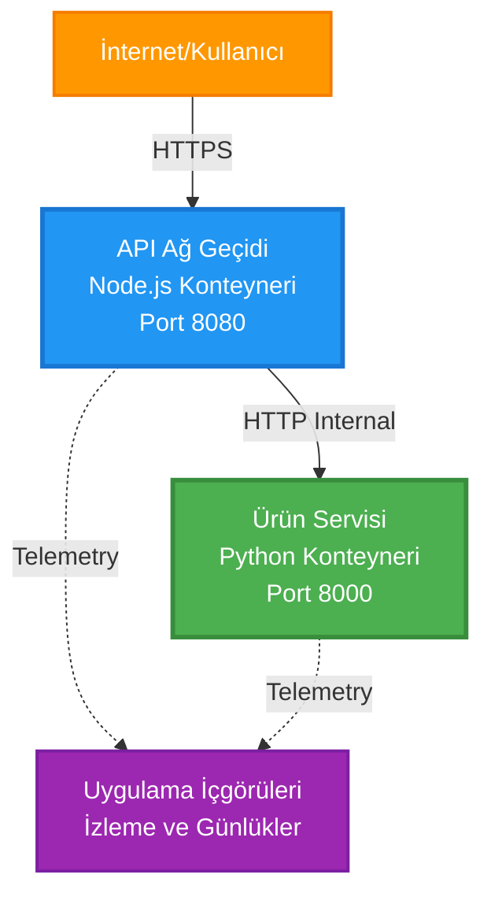
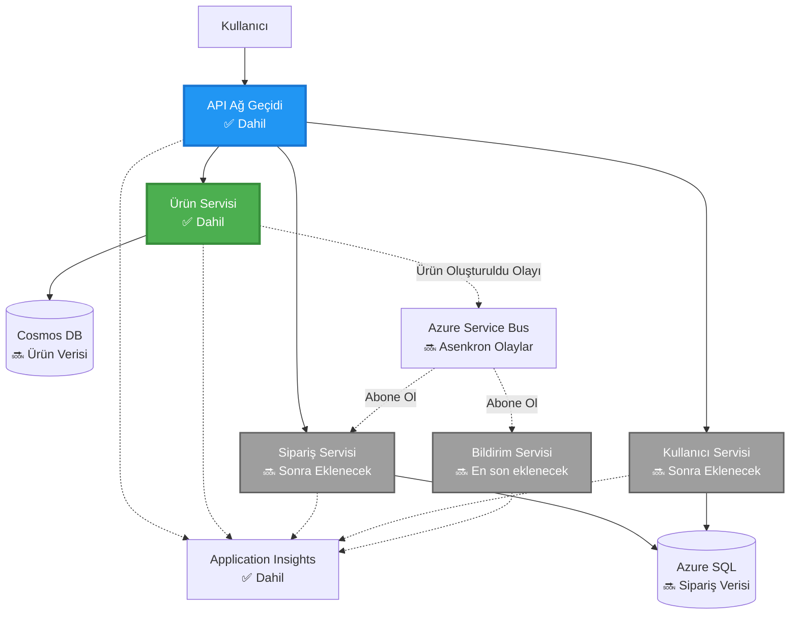
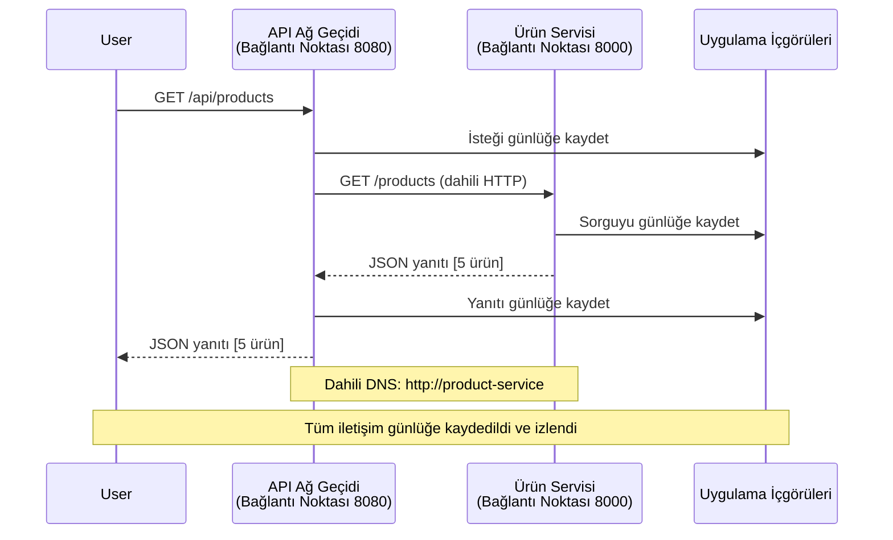

# Mikroservis Mimarisi - Container App Örneği

⏱️ **Tahmini Süre**: 25-35 dakika | 💰 **Tahmini Maliyet**: ~$50-100/ay | ⭐ **Zorluk**: İleri Düzey

**📚 Öğrenme Yolu:**
- ← Önceki: [Simple Flask API](../../../../examples/container-app/simple-flask-api) - Tek konteyner temelleri
- 🎯 **Buradasınız**: Mikroservis Mimarisi (2 hizmet temeli)
- → Sonraki: [AI Integration](../../../../docs/ai-foundry) - Hizmetlerinize zeka ekleyin
- 🏠 [Kurs Ana Sayfası](../../README.md)

---

AZD CLI kullanılarak Azure Container Apps'e dağıtılmış **basitleştirilmiş ama işlevsel** bir mikroservis mimarisi. Bu örnek, hizmetler arası iletişimi, konteyner orkestrasyonunu ve izlemeyi pratik bir 2 hizmetlik kurulum ile gösterir.

> **📚 Öğrenme Yaklaşımı**: Bu örnek, dağıtılabilir ve öğrenilebilecek minimal bir 2 hizmetlik mimari (API Gateway + Backend Service) ile başlar. Bu temeli öğrendikten sonra, tam bir mikroservis ekosistemine genişletme için rehberlik sağlanır.

## Neler Öğreneceksiniz

Bu örneği tamamlayarak:
- Azure Container Apps'e birden çok konteyner dağıtmayı öğreneceksiniz
- İç ağ ile hizmetler arası iletişimi uygulayacaksınız
- Ortam tabanlı ölçekleme ve sağlık kontrollerini yapılandıracaksınız
- Dağıtık uygulamaları Application Insights ile izleyeceksiniz
- Mikroservis dağıtım desenlerini ve en iyi uygulamaları anlayacaksınız
- Basitten karmaşığa doğru kademeli genişlemeyi öğreneceksiniz

## Mimari

### Aşama 1: İnşa Ettiklerimiz (Bu Örnek İçinde)


```mermaid
graph TB
    Internet[İnternet/Kullanıcı]
    Gateway[API Ağ Geçidi<br/>Node.js Konteyneri<br/>Port 8080]
    Product[Ürün Servisi<br/>Python Konteyneri<br/>Port 8000]
    AppInsights[Uygulama İçgörüleri<br/>İzleme ve Günlükler]
    
    Internet -->|HTTPS| Gateway
    Gateway -->|HTTP Internal| Product
    Gateway -.->|Telemetry| AppInsights
    Product -.->|Telemetry| AppInsights
    
    style Gateway fill:#2196F3,stroke:#1976D2,stroke-width:3px,color:#fff
    style Product fill:#4CAF50,stroke:#388E3C,stroke-width:3px,color:#fff
    style Internet fill:#FF9800,stroke:#F57C00,stroke-width:2px,color:#fff
    style AppInsights fill:#9C27B0,stroke:#7B1FA2,stroke-width:2px,color:#fff
```
**Bileşen Ayrıntıları:**

| Bileşen | Amaç | Erişim | Kaynaklar |
|-----------|---------|--------|-----------|
| **API Gateway** | Harici istekleri backend hizmetlere yönlendirir | Genel (HTTPS) | 1 vCPU, 2GB RAM, 2-20 replika |
| **Product Service** | Bellek içi verilerle ürün kataloğunu yönetir | Sadece dahili | 0.5 vCPU, 1GB RAM, 1-10 replika |
| **Application Insights** | Merkezi günlükleme ve dağıtık izleme | Azure Portalu | 1-2 GB/ay veri alımı |

**Neden Basit Başlamak?**
- ✅ Hızlıca dağıtın ve anlayın (25-35 dakika)
- ✅ Karmaşıklık olmadan temel mikroservis desenlerini öğrenin
- ✅ Değiştirebileceğiniz ve deney yapabileceğiniz çalışan kod
- ✅ Öğrenme için daha düşük maliyet (~$50-100/ay vs $300-1400/ay)
- ✅ Veritabanları ve mesaj kuyrukları eklemeden önce güven kazanın

**Benzetme**: Bunu araba sürmeyi öğrenmeye benzetin. Boş bir otoparkla (2 hizmet) başlarsınız, temelleri öğrenir, sonra şehir trafiğine (veritabanlı 5+ hizmet) geçersiniz.

### Aşama 2: Gelecekte Genişleme (Referans Mimari)

Once you master the 2-service architecture, you can expand to:


```mermaid
graph TB
    User[Kullanıcı]
    Gateway[API Ağ Geçidi<br/>✅ Dahil]
    Product[Ürün Servisi<br/>✅ Dahil]
    Order[Sipariş Servisi<br/>🔜 Sonra Eklenecek]
    UserSvc[Kullanıcı Servisi<br/>🔜 Sonra Eklenecek]
    Notify[Bildirim Servisi<br/>🔜 En son eklenecek]
    
    CosmosDB[(Cosmos DB<br/>🔜 Ürün Verisi)]
    AzureSQL[(Azure SQL<br/>🔜 Sipariş Verisi)]
    ServiceBus[Azure Service Bus<br/>🔜 Asenkron Olaylar]
    AppInsights[Application Insights<br/>✅ Dahil]
    
    User --> Gateway
    Gateway --> Product
    Gateway --> Order
    Gateway --> UserSvc
    
    Product --> CosmosDB
    Order --> AzureSQL
    UserSvc --> AzureSQL
    
    Product -.->|Ürün Oluşturuldu Olayı| ServiceBus
    ServiceBus -.->|Abone Ol| Notify
    ServiceBus -.->|Abone Ol| Order
    
    Gateway -.-> AppInsights
    Product -.-> AppInsights
    Order -.-> AppInsights
    UserSvc -.-> AppInsights
    Notify -.-> AppInsights
    
    style Product fill:#4CAF50,stroke:#388E3C,stroke-width:3px,color:#fff
    style Gateway fill:#2196F3,stroke:#1976D2,stroke-width:3px,color:#fff
    style Order fill:#9E9E9E,stroke:#616161,stroke-width:2px,color:#fff
    style UserSvc fill:#9E9E9E,stroke:#616161,stroke-width:2px,color:#fff
    style Notify fill:#9E9E9E,stroke:#616161,stroke-width:2px,color:#fff
```
Adım adım talimatlar için belgenin sonundaki "Genişleme Rehberi" bölümüne bakın.

## Dahil Olan Özellikler

✅ **Hizmet Keşfi**: Konteynerler arasında otomatik DNS tabanlı keşif  
✅ **Yük Dengeleme**: Replikalar arasında yerleşik yük dengeleme  
✅ **Otomatik ölçekleme**: HTTP isteklerine dayalı her hizmet için bağımsız ölçeklendirme  
✅ **Sağlık İzleme**: Her iki hizmet için canlılık (liveness) ve hazırbulunuşluk (readiness) denetimleri  
✅ **Dağıtık Günlükleme**: Application Insights ile merkezi günlükleme  
✅ **İç Ağ**: Güvenli hizmetler arası iletişim  
✅ **Konteyner Orkestrasyonu**: Otomatik dağıtım ve ölçeklendirme  
✅ **Sıfır Kesinti Güncellemeleri**: Revizyon yönetimi ile kademeli güncellemeler  

## Önkoşullar

### Gerekli Araçlar

Başlamadan önce, bu araçların kurulu olduğunu doğrulayın:

1. **[Azure Developer CLI (azd)](https://learn.microsoft.com/azure/developer/azure-developer-cli/install-azd)** (sürüm 1.0.0 veya üstü)
   ```bash
   azd version
   # Beklenen çıktı: azd sürüm 1.0.0 veya daha yeni
   ```

2. **[Azure CLI](https://learn.microsoft.com/cli/azure/install-azure-cli)** (sürüm 2.50.0 veya üstü)
   ```bash
   az --version
   # Beklenen çıktı: azure-cli 2.50.0 veya daha yeni
   ```

3. **[Docker](https://www.docker.com/get-started)** (yerel geliştirme/test için - isteğe bağlı)
   ```bash
   docker --version
   # Beklenen çıktı: Docker sürümü 20.10 veya daha yüksek
   ```

### Kurulumunuzu Doğrulayın

Hazır olduğunuzu doğrulamak için bu komutları çalıştırın:

```bash
# Azure Developer CLI'yi kontrol edin
azd version
# ✅ Beklenen: azd sürümü 1.0.0 veya üstü

# Azure CLI'yi kontrol edin
az --version
# ✅ Beklenen: azure-cli 2.50.0 veya üstü

# Docker'ı kontrol edin (isteğe bağlı)
docker --version
# ✅ Beklenen: Docker sürümü 20.10 veya üstü
```

**Başarı Kriteri**: Tüm komutlar minimum sürümleri sağlayan veya aşan sürüm numaraları döndürmelidir.

### Azure Gereksinimleri

- Aktif bir **Azure aboneliği** ([ücretsiz hesap oluşturun](https://azure.microsoft.com/free/))
- Aboneliğinizde kaynak oluşturma izinleri
- **Contributor** rolü abonelikte veya kaynak grubunda

### Bilgi Önkoşulları

Bu **ileri düzey** bir örnektir. Şunlara sahip olmalısınız:
- [Simple Flask API örneğini](../../../../examples/container-app/simple-flask-api) tamamlamış olmak
- Mikroservis mimarisi hakkında temel anlayış
- REST API'leri ve HTTP hakkında aşinalık
- Konteyner kavramları hakkında anlayış

**Container Apps'e yeni misiniz?** Temelleri öğrenmek için önce [Simple Flask API örneği](../../../../examples/container-app/simple-flask-api) 'ne başlayın.

## Hızlı Başlangıç (Adım Adım)

### Adım 1: Klonlayın ve Gezin

```bash
git clone https://github.com/microsoft/AZD-for-beginners.git
cd AZD-for-beginners/examples/microservices
```

**✓ Başarı Kontrolü**: `azure.yaml` dosyasını gördüğünüzü doğrulayın:
```bash
ls
# Beklenen: README.md, azure.yaml, infra/, src/
```

### Adım 2: Azure ile Kimlik Doğrulama

```bash
azd auth login
```

Bu, Azure kimlik doğrulaması için tarayıcınızı açar. Azure kimlik bilgilerinizi kullanarak oturum açın.

**✓ Başarı Kontrolü**: Şunu görmelisiniz:
```
Logged in to Azure.
```

### Adım 3: Ortamı Başlatma

```bash
azd init
```

**Görüntüleyeceğiniz istemler**:
- **Ortam adı**: Kısa bir ad girin (ör. `microservices-dev`)
- **Azure aboneliği**: Aboneliğinizi seçin
- **Azure lokasyonu**: Bir bölge seçin (ör. `eastus`, `westeurope`)

**✓ Başarı Kontrolü**: Şunu görmelisiniz:
```
SUCCESS: New project initialized!
```

### Adım 4: Altyapı ve Hizmetleri Dağıtma

```bash
azd up
```

**Neler olur** (8-12 dakika sürer):


```mermaid
graph LR
    A[azd up] --> B[Kaynak Grubu Oluştur]
    B --> C[Konteyner Kayıt Defteri Dağıt]
    C --> D[Log Analytics Dağıt]
    D --> E[App Insights Dağıt]
    E --> F[Konteyner Ortamı Oluştur]
    F --> G[API Ağ Geçidi İmajı Oluştur]
    F --> H[Ürün Servisi İmajı Oluştur]
    G --> I[Kayıt Defterine Gönder]
    H --> I
    I --> J[API Ağ Geçidini Dağıt]
    I --> K[Ürün Servisini Dağıt]
    J --> L[Ingress ve Sağlık Kontrollerini Yapılandır]
    K --> L
    L --> M[Dağıtım Tamamlandı ✓]
    
    style A fill:#2196F3,stroke:#1976D2,stroke-width:3px,color:#fff
    style M fill:#4CAF50,stroke:#388E3C,stroke-width:3px,color:#fff
```
**✓ Başarı Kontrolü**: Şunu görmelisiniz:
```
SUCCESS: Your application was deployed to Azure in X minutes Y seconds.
Endpoint: https://api-gateway-<unique-id>.azurecontainerapps.io
```

**⏱️ Süre**: 8-12 dakika

### Adım 5: Dağıtımı Test Etme

```bash
# Ağ geçidi uç noktasını al
GATEWAY_URL=$(azd env get-values | grep API_GATEWAY_URL | cut -d '=' -f2 | tr -d '"')

# API Gateway sağlık durumunu test et
curl $GATEWAY_URL/health
```

**✅ Beklenen çıktı:**
```json
{
  "status": "healthy",
  "service": "api-gateway",
  "timestamp": "2025-11-19T10:30:00Z"
}
```

**Ürün hizmetini gateway üzerinden test etme**:
```bash
# Ürünleri listele
curl $GATEWAY_URL/api/products
```

**✅ Beklenen çıktı:**
```json
[
  {"id":1,"name":"Laptop","price":999.99,"stock":50},
  {"id":2,"name":"Mouse","price":29.99,"stock":200},
  {"id":3,"name":"Keyboard","price":79.99,"stock":150}
]
```

**✓ Başarı Kontrolü**: Her iki uç nokta da hatasız JSON veri döndürmelidir.

---

**🎉 Tebrikler!** Azure'a bir mikroservis mimarisi dağıttınız!

## Proje Yapısı

Tüm uygulama dosyaları dahil—bu tam, çalışan bir örnektir:

```
microservices/
│
├── README.md                         # This file
├── azure.yaml                        # AZD configuration
├── .gitignore                        # Git ignore patterns
│
├── infra/                           # Infrastructure as Code (Bicep)
│   ├── main.bicep                   # Main orchestration
│   ├── abbreviations.json           # Naming conventions
│   ├── core/                        # Shared infrastructure
│   │   ├── container-apps-environment.bicep  # Container environment + registry
│   │   └── monitor.bicep            # Application Insights + Log Analytics
│   └── app/                         # Service definitions
│       ├── api-gateway.bicep        # API Gateway container app
│       └── product-service.bicep    # Product Service container app
│
└── src/                             # Application source code
    ├── api-gateway/                 # Node.js API Gateway
    │   ├── app.js                   # Express server with routing
    │   ├── package.json             # Node dependencies
    │   └── Dockerfile               # Container definition
    └── product-service/             # Python Product Service
        ├── main.py                  # Flask API with product data
        ├── requirements.txt         # Python dependencies
        └── Dockerfile               # Container definition
```

**Her Bileşenin Rolü:**

**Altyapı (infra/)**:
- `main.bicep`: Tüm Azure kaynaklarını ve bağımlılıklarını koordine eder
- `core/container-apps-environment.bicep`: Container Apps ortamını ve Azure Container Registry'yi oluşturur
- `core/monitor.bicep`: Dağıtık günlükleme için Application Insights'ı kurar
- `app/*.bicep`: Ölçekleme ve sağlık kontrolleri ile bireysel container app tanımları

**API Gateway (src/api-gateway/)**:
- İstekleri backend hizmetlerine yönlendiren halka açık hizmet
- Günlükleme, hata yönetimi ve istek iletimini uygular
- Hizmetler arası HTTP iletişimini gösterir

**Ürün Hizmeti (src/product-service/)**:
- Ürün kataloğuna sahip dahili hizmet (basitlik için bellek içi)
- Sağlık kontrolleri ile REST API
- Backend mikroservis deseninin örneği

## Hizmetlerin Genel Bakışı

### API Gateway (Node.js/Express)

**Port**: 8080  
**Erişim**: Genel (harici ingress)  
**Amaç**: Gelen istekleri uygun backend hizmetlerine yönlendirir  

**Uç Noktalar**:
- `GET /` - Hizmet bilgisi
- `GET /health` - Sağlık kontrol uç noktası
- `GET /api/products` - Ürün hizmetine ilet (tümünü listele)
- `GET /api/products/:id` - Ürün hizmetine ilet (ID ile al)

**Ana Özellikler**:
- Axios ile istek yönlendirme
- Merkezi günlükleme
- Hata yönetimi ve zaman aşımı yönetimi
- Ortam değişkenleri aracılığıyla hizmet keşfi
- Application Insights entegrasyonu

**Kod Öne Çıkanı** (`src/api-gateway/app.js`):
```javascript
// Dahili servis iletişimi
app.get('/api/products', async (req, res) => {
  const response = await axios.get(`${PRODUCT_SERVICE_URL}/products`, {
    timeout: 5000
  });
  res.json(response.data);
});
```

### Ürün Hizmeti (Python/Flask)

**Port**: 8000  
**Erişim**: Sadece dahili (harici ingress yok)  
**Amaç**: Bellek içi verilerle ürün kataloğunu yönetir  

**Uç Noktalar**:
- `GET /` - Hizmet bilgisi
- `GET /health` - Sağlık kontrol uç noktası
- `GET /products` - Tüm ürünleri listele
- `GET /products/<id>` - ID ile ürünü al

**Ana Özellikler**:
- Flask ile RESTful API
- Bellek içi ürün deposu (basit, veritabanı gerekmez)
- Sağlık izleme için denetimler
- Yapılandırılmış günlükleme
- Application Insights entegrasyonu

**Veri Modeli**:
```python
{
  "id": 1,
  "name": "Laptop",
  "description": "High-performance laptop",
  "price": 999.99,
  "stock": 50
}
```

**Neden Sadece Dahili?**
Ürün hizmeti herkese açık olarak sunulmaz. Tüm istekler API Gateway üzerinden gitmelidir, bu da şunları sağlar:
- Güvenlik: Kontrol edilen erişim noktası
- Esneklik: İstemcilere etki etmeden backend'i değiştirme imkanı
- İzleme: Merkezi istek günlükleme

## Hizmet İletişimini Anlama

### Hizmetler Birbiriyle Nasıl Konuşur


```mermaid
sequenceDiagram
    participant User
    participant Gateway as API Ağ Geçidi<br/>(Bağlantı Noktası 8080)
    participant Product as Ürün Servisi<br/>(Bağlantı Noktası 8000)
    participant AI as Uygulama İçgörüleri
    
    User->>Gateway: GET /api/products
    Gateway->>AI: İsteği günlüğe kaydet
    Gateway->>Product: GET /products (dahili HTTP)
    Product->>AI: Sorguyu günlüğe kaydet
    Product-->>Gateway: JSON yanıtı [5 ürün]
    Gateway->>AI: Yanıtı günlüğe kaydet
    Gateway-->>User: JSON yanıtı [5 ürün]
    
    Note over Gateway,Product: Dahili DNS: http://product-service
    Note over User,AI: Tüm iletişim günlüğe kaydedildi ve izlendi
```
Bu örnekte, API Gateway **dahili HTTP çağrıları** kullanarak Ürün Hizmeti ile iletişim kurar:

```javascript
// API Ağ Geçidi (src/api-gateway/app.js)
const PRODUCT_SERVICE_URL = process.env.PRODUCT_SERVICE_URL;

// Dahili HTTP isteği yap
const response = await axios.get(`${PRODUCT_SERVICE_URL}/products`);
```

**Ana Noktalar**:

1. **DNS Tabanlı Keşif**: Container Apps dahili hizmetler için otomatik olarak DNS sağlar
   - Ürün Hizmeti FQDN'si: `product-service.internal.<environment>.azurecontainerapps.io`
   - Basitleştirilmiş olarak: `http://product-service` (Container Apps bunu çözer)

2. **Kamuya Açıklık Yok**: Ürün Hizmeti Bicep içinde `external: false` olarak ayarlanmıştır
   - Sadece Container Apps ortamı içinde erişilebilir
   - İnternetten ulaşılamaz

3. **Ortam Değişkenleri**: Hizmet URL'leri dağıtım sırasında enjekte edilir
   - Bicep geçerli iç FQDN'yi gateway'e geçirir
   - Uygulama kodunda sabitlenmiş URL yoktur

**Benzetme**: Bunu ofis odalarına benzetin. API Gateway resepsiyon masasıdır (halka açık), Ürün Hizmeti ise bir ofis odasıdır (sadece dahili). Ziyaretçiler herhangi bir ofise ulaşmak için resepsiyondan geçmelidir.

## Dağıtım Seçenekleri

### Tam Dağıtım (Önerilen)

```bash
# Altyapıyı ve her iki servisi dağıtın.
azd up
```

Bu dağıtır:
1. Container Apps ortamı
2. Application Insights
3. Container Registry
4. API Gateway konteyneri
5. Ürün Hizmeti konteyneri

**Süre**: 8-12 dakika

### Bireysel Hizmeti Dağıtma

```bash
# Sadece bir servis dağıtın (ilk azd up'tan sonra)
azd deploy api-gateway

# Veya ürün servisini dağıtın
azd deploy product-service
```

**Kullanım Durumu**: Bir hizmette kodu güncellediğinizde ve sadece o hizmeti yeniden dağıtmak istediğinizde.

### Yapılandırmayı Güncelleme

```bash
# Ölçeklendirme parametrelerini değiştir
azd env set GATEWAY_MAX_REPLICAS 30

# Yeni yapılandırmayla yeniden dağıt
azd up
```

## Yapılandırma

### Ölçeklendirme Yapılandırması

Her iki hizmet de Bicep dosyalarında HTTP tabanlı otomatik ölçekleme ile yapılandırılmıştır:

**API Gateway**:
- Min replikalar: 2 (kullanılabilirlik için her zaman en az 2)
- Max replikalar: 20
- Ölçek tetikleyicisi: replika başına 50 eşzamanlı istek

**Ürün Hizmeti**:
- Min replikalar: 1 (gerektiğinde sıfıra kadar ölçeklenebilir)
- Max replikalar: 10
- Ölçek tetikleyicisi: replika başına 100 eşzamanlı istek

**Ölçeklendirmeyi Özelleştirin** (`infra/app/*.bicep` içinde):
```bicep
scale: {
  minReplicas: 1
  maxReplicas: 10
  rules: [
    {
      name: 'http-scale-rule'
      http: {
        metadata: {
          concurrentRequests: '100'  // Adjust this
        }
      }
    }
  ]
}
```

### Kaynak Tahsisi

**API Gateway**:
- CPU: 1.0 vCPU
- Bellek: 2 GiB
- Sebep: Tüm dış trafiği yönetir

**Ürün Hizmeti**:
- CPU: 0.5 vCPU
- Bellek: 1 GiB
- Sebep: Hafif bellek içi işlemler

### Sağlık Kontrolleri

Her iki hizmet de liveness ve readiness denetimleri içerir:

```bicep
probes: [
  {
    type: 'Liveness'
    httpGet: {
      path: '/health'
      port: 8080
    }
    initialDelaySeconds: 10
    periodSeconds: 30
  }
  {
    type: 'Readiness'
    httpGet: {
      path: '/health'
      port: 8080
    }
    initialDelaySeconds: 5
    periodSeconds: 10
  }
]
```

**Bu Ne Anlama Gelir**:
- **Liveness**: Sağlık kontrolü başarısız olursa, Container Apps konteyneri yeniden başlatır
- **Readiness**: Hazır değilse, Container Apps o replikaya trafik yönlendirmeyi durdurur

## İzleme ve Gözlemlenebilirlik

### Hizmet Günlüklerini Görüntüleme

```bash
# azd monitor kullanarak günlükleri görüntüleyin
azd monitor --logs

# Veya belirli Container Apps için Azure CLI'yi kullanın:
# API Gateway'den günlükleri akış halinde izleyin
az containerapp logs show --name api-gateway --resource-group $RG_NAME --follow

# Son ürün hizmeti günlüklerini görüntüleyin
az containerapp logs show --name product-service --resource-group $RG_NAME --tail 100
```

**Beklenen Çıktı**:
```
[api-gateway] API Gateway listening on port 8080
[api-gateway] Product Service URL: http://product-service
[api-gateway] GET /api/products 200 - 45ms
[product-service] Retrieved 5 products
```

### Application Insights Sorguları

Azure Portal'da Application Insights'e erişin, sonra şu sorguları çalıştırın:

**Yavaş İstekleri Bul**:
```kusto
requests
| where timestamp > ago(1h)
| where duration > 1000  // Requests taking >1 second
| summarize count() by name, cloud_RoleName
| order by count_ desc
```

**Hizmetler Arası Çağrıları İzle**:
```kusto
dependencies
| where timestamp > ago(1h)
| where type == "Http"
| project timestamp, name, target, duration, success
| order by timestamp desc
```

**Hizmet Bazında Hata Oranı**:
```kusto
exceptions
| where timestamp > ago(24h)
| summarize errorCount = count() by cloud_RoleName, type
| order by errorCount desc
```

**Zaman İçindeki İstek Hacmi**:
```kusto
requests
| where timestamp > ago(1h)
| summarize requestCount = count() by bin(timestamp, 5m), cloud_RoleName
| render timechart
```

### İzleme Panosuna Erişim

```bash
# Application Insights ayrıntılarını al
azd env get-values | grep APPLICATIONINSIGHTS

# Azure Portal'da İzleme sayfasını aç
az monitor app-insights component show \
  --app $(azd env get-values | grep APPLICATIONINSIGHTS_CONNECTION_STRING | cut -d '=' -f2) \
  --resource-group $(azd env get-values | grep AZURE_RESOURCE_GROUP | cut -d '=' -f2) \
  --query "appId" -o tsv
```

### Canlı Metrikler

1. Azure Portal'da Application Insights'a gidin
2. "Live Metrics"e tıklayın
3. Gerçek zamanlı istekleri, hataları ve performansı görün
4. Şu komutu çalıştırarak test edin: `curl $(azd env get-values | grep API_GATEWAY_URL | cut -d '=' -f2 | tr -d '"')/api/products`

## Pratik Alıştırmalar

### Alıştırma 1: Yeni Bir Ürün Uç Noktası Ekle ⭐ (Kolay)

**Hedef**: Yeni ürünler oluşturmak için bir POST uç noktası ekleyin

**Başlangıç Noktası**: `src/product-service/main.py`

**Adımlar**:

1. `main.py` içindeki `get_product` fonksiyonundan sonra bu uç noktayı ekleyin:

```python
@app.route('/products', methods=['POST'])
def create_product():
    """Create a new product"""
    data = request.get_json()
    
    # Gerekli alanları doğrulayın
    if not data or 'name' not in data or 'price' not in data:
        return jsonify({'error': 'Missing required fields: name, price'}), 400
    
    new_id = max(p['id'] for p in products) + 1
    new_product = {
        'id': new_id,
        'name': data['name'],
        'description': data.get('description', ''),
        'price': float(data['price']),
        'stock': int(data.get('stock', 0))
    }
    products.append(new_product)
    logger.info(f"Created product {new_id}")
    return jsonify(new_product), 201
```

2. API Gateway'e POST rotası ekleyin (`src/api-gateway/app.js`):

```javascript
// Bunu GET /api/products rotasından sonra ekleyin.
app.post('/api/products', async (req, res) => {
  try {
    console.log(`Forwarding POST request to ${PRODUCT_SERVICE_URL}/products`);
    const response = await axios.post(`${PRODUCT_SERVICE_URL}/products`, req.body, {
      timeout: 5000
    });
    res.status(201).json(response.data);
  } catch (error) {
    console.error('Error calling product service:', error.message);
    res.status(503).json({
      error: 'Product service unavailable',
      message: error.message
    });
  }
});
```

3. Her iki servisi yeniden dağıtın:

```bash
azd deploy product-service
azd deploy api-gateway
```

4. Yeni uç noktayı test edin:

```bash
GATEWAY_URL=$(azd env get-values | grep API_GATEWAY_URL | cut -d '=' -f2 | tr -d '"')

# Yeni bir ürün oluşturun.
curl -X POST $GATEWAY_URL/api/products \
  -H "Content-Type: application/json" \
  -d '{"name":"USB Cable","price":9.99,"stock":500}'
```

**✅ Beklenen çıktı:**
```json
{"id":6,"name":"USB Cable","description":"","price":9.99,"stock":500}
```

5. Listede göründüğünü doğrulayın:

```bash
curl $GATEWAY_URL/api/products
# Artık yeni USB Kablosu da dahil olmak üzere 6 ürün göstermeli
```

**Başarı Kriterleri**:
- ✅ POST isteği HTTP 201 döndürür
- ✅ Yeni ürün GET /api/products listesinde görünür
- ✅ Ürünün otomatik artan bir ID'si var

**Süre**: 10-15 dakika

---

### Egzersiz 2: Otomatik Ölçeklendirme Kurallarını Değiştir ⭐⭐ (Orta)

**Hedef**: Ürün Servisini daha agresif ölçeklenecek şekilde değiştirin

**Başlangıç Noktası**: `infra/app/product-service.bicep`

**Adımlar**:

1. `infra/app/product-service.bicep` dosyasını açın ve `scale` bloğunu bulun (yaklaşık satır 95)

2. Şundan değiştirin:
```bicep
scale: {
  minReplicas: 1
  maxReplicas: 10
  rules: [
    {
      name: 'http-scale-rule'
      http: {
        metadata: {
          concurrentRequests: '100'  // OLD
        }
      }
    }
  ]
}
```

Şuna:
```bicep
scale: {
  minReplicas: 2  // Always have 2 running
  maxReplicas: 20  // Allow more scaling
  rules: [
    {
      name: 'http-scale-rule'
      http: {
        metadata: {
          concurrentRequests: '20'  // Scale at lower threshold
        }
      }
    }
  ]
}
```

3. Altyapıyı yeniden dağıtın:

```bash
azd up
```

4. Yeni ölçeklendirme yapılandırmasını doğrulayın:

```bash
az containerapp show \
  --name $(azd env get-values | grep PRODUCT_SERVICE | head -1 | cut -d '/' -f5) \
  --resource-group $(azd env get-values | grep AZURE_RESOURCE_GROUP | cut -d '=' -f2 | tr -d '"') \
  --query "properties.template.scale" -o json
```

**✅ Beklenen çıktı:**
```json
{
  "minReplicas": 2,
  "maxReplicas": 20,
  "rules": [...]
}
```

5. Yük ile otomatik ölçeklendirmeyi test edin:

```bash
# Eşzamanlı istekler oluştur
for i in {1..500}; do curl $GATEWAY_URL/api/products & done

# Azure CLI kullanarak ölçeklenmenin gerçekleşmesini izle
az containerapp logs show --name product-service --resource-group $RG_NAME --follow
# Ara: Container Apps ölçeklendirme olayları
```

**Başarı Kriterleri**:
- ✅ Product Service her zaman en az 2 replika çalıştırır
- ✅ Yük altında 2'den fazla replikaya ölçeklenir
- ✅ Azure Portal yeni ölçeklendirme kurallarını gösterir

**Süre**: 15-20 dakika

---

### Egzersiz 3: Özel İzleme Sorgusu Ekle ⭐⭐ (Orta)

**Hedef**: Ürün API performansını izlemek için özel bir Application Insights sorgusu oluşturun

**Adımlar**:

1. Azure Portal'da Application Insights'a gidin:
   - Azure Portal'a gidin
   - Resource group'unuzu bulun (rg-microservices-*)
   - Application Insights kaynağına tıklayın

2. Sol menüde "Logs" öğesine tıklayın

3. Bu sorguyu oluşturun:

```kusto
requests
| where timestamp > ago(1h)
| where name contains "products"
| summarize 
    RequestCount = count(),
    AvgDuration = avg(duration),
    P95Duration = percentile(duration, 95),
    SuccessRate = 100.0 * countif(success == true) / count()
  by bin(timestamp, 5m)
| render timechart
```

4. Sorguyu çalıştırmak için "Run" düğmesine tıklayın

5. Sorguyu kaydedin:
   - "Save"e tıklayın
   - İsim: "Product API Performance"
   - Kategori: "Performance"

6. Test trafiği oluşturun:

```bash
for i in {1..100}; do curl $GATEWAY_URL/api/products; sleep 1; done
```

7. Verileri görmek için sorguyu yenileyin

**✅ Beklenen çıktı:**
- Zaman içinde istek sayılarını gösteren grafik
- Ortalama süre < 500ms
- Başarı oranı = %100
- 5 dakikalık zaman dilimleri

**Başarı Kriterleri**:
- ✅ Sorgu 100+ istek gösterir
- ✅ Başarı oranı %100
- ✅ Ortalama süre < 500ms
- ✅ Grafik 5 dakikalık zaman dilimlerini gösterir

**Öğrenim Çıktısı**: Hizmet performansını özel sorgularla nasıl izleyeceğinizi anlayın

**Süre**: 10-15 dakika

---

### Egzersiz 4: Yeniden Deneme Mantığını Uygulayın ⭐⭐⭐ (İleri)

**Hedef**: Product Service geçici olarak kullanılamadığında API Gateway'e yeniden deneme mantığı ekleyin

**Başlangıç Noktası**: `src/api-gateway/app.js`

**Adımlar**:

1. Retry (yeniden deneme) kütüphanesini yükleyin:

```bash
cd src/api-gateway
npm install axios-retry --save
cd ../..
```

2. `src/api-gateway/app.js` dosyasını güncelleyin (axios import'undan sonra ekleyin):

```javascript
const axiosRetry = require('axios-retry');

// Yeniden deneme mantığını yapılandır
axiosRetry(axios, {
  retries: 3,
  retryDelay: (retryCount) => {
    return retryCount * 1000; // 1s, 2s, 3s
  },
  retryCondition: (error) => {
    // Ağ hatalarında veya 5xx yanıtlarında yeniden dene
    return axiosRetry.isNetworkOrIdempotentRequestError(error) ||
           (error.response && error.response.status >= 500);
  }
});

console.log('Retry logic configured: 3 retries with exponential backoff');
```

3. API Gateway'i yeniden dağıtın:

```bash
azd deploy api-gateway
```

4. Servis hatasını simüle ederek yeniden deneme davranışını test edin:

```bash
# Ürün servisini 0'a ölçeklendir (arızayı simüle et)
az containerapp update \
  --name $(azd env get-values | grep PRODUCT_SERVICE | head -1 | cut -d '/' -f5) \
  --resource-group $(azd env get-values | grep AZURE_RESOURCE_GROUP | cut -d '=' -f2 | tr -d '"') \
  --min-replicas 0 \
  --max-replicas 0

# Ürünlere erişmeye çalış (3 kez yeniden deneyecek)
time curl -v $GATEWAY_URL/api/products
# Gözlemle: Yanıt yaklaşık 6 saniye sürer (1s + 2s + 3s yeniden denemeler)

# Ürün servisini geri yükle
az containerapp update \
  --name $(azd env get-values | grep PRODUCT_SERVICE | head -1 | cut -d '/' -f5) \
  --resource-group $(azd env get-values | grep AZURE_RESOURCE_GROUP | cut -d '=' -f2 | tr -d '"') \
  --min-replicas 1 \
  --max-replicas 10
```

5. Yeniden deneme günlüklerini görüntüleyin:

```bash
az containerapp logs show --name api-gateway --resource-group $RG_NAME --tail 50
# Ara: Yeniden deneme girişimi mesajları
```

**✅ Beklenen davranış:**
- İstekler başarısız olmadan önce 3 kez yeniden denenir
- Her yeniden denemede bekleme süresi artar (1s, 2s, 3s)
- Servis yeniden başladıktan sonra istekler başarılı olur
- Günlükler yeniden deneme girişimlerini gösterir

**Başarı Kriterleri**:
- ✅ İstekler başarısız olmadan önce 3 kez yeniden denenir
- ✅ Her yeniden denemede bekleme süresi artar (üstel geri çekilme)
- ✅ Servis yeniden başladıktan sonra istekler başarılı olur
- ✅ Günlükler yeniden deneme girişimlerini gösterir

**Öğrenim Çıktısı**: Mikroservislerde dayanıklılık kalıplarını anlayın (devre kesiciler, yeniden denemeler, zaman aşımı)

**Süre**: 20-25 dakika

---

## Bilgi Kontrol Noktası

Bu örneği tamamladıktan sonra anlayışınızı doğrulayın:

### 1. Servis İletişimi ✓

Bilginizi test edin:
- [ ] API Gateway'in Product Service'i nasıl keşfettiğini açıklayabilir misiniz? (DNS tabanlı servis keşfi)
- [ ] Product Service kapalıysa ne olur? (Gateway 503 hatası döndürür)
- [ ] Üçüncü bir servisi nasıl eklersiniz? (Yeni bir Bicep dosyası oluşturun, main.bicep'e ekleyin, src klasörü oluşturun)

**Pratik Doğrulama:**
```bash
# Hizmet arızasını simüle et
az containerapp update --name <product-service-name> --min-replicas 0 --max-replicas 0
curl $GATEWAY_URL/api/products
# ✅ Beklenen: 503 Hizmet Kullanılamıyor

# Hizmeti geri yükle
az containerapp update --name <product-service-name> --min-replicas 1 --max-replicas 10
```

### 2. İzleme ve Gözlemlenebilirlik ✓

Bilginizi test edin:
- [ ] Dağıtılmış günlükleri nerede görürsünüz? (Azure Portal'da Application Insights)
- [ ] Yavaş istekleri nasıl takip edersiniz? (Kusto sorgusu: `requests | where duration > 1000`)
- [ ] Hangi servis hataya sebep oldu tespit edebilir misiniz? (Günlüklerde `cloud_RoleName` alanını kontrol edin)

**Pratik Doğrulama:**
```bash
# Yavaş istek simülasyonu oluşturun
curl "$GATEWAY_URL/api/products?delay=2000"

# Application Insights'te yavaş istekleri sorgulayın
# Azure Portal → Application Insights → Günlükler
# Çalıştır: requests | where duration > 1000 | project timestamp, name, duration, cloud_RoleName
```

### 3. Ölçeklendirme ve Performans ✓

Bilginizi test edin:
- [ ] Otomatik ölçeklendirmeyi ne tetikler? (HTTP eşzamanlı istek kuralları: gateway için 50, product için 100)
- [ ] Şu anda kaç replika çalışıyor? (`az containerapp revision list` ile kontrol edin)
- [ ] Product Service'i 5 replikaya nasıl ölçeklendirirsiniz? (Bicep'te minReplicas'i güncelleyin)

**Pratik Doğrulama:**
```bash
# Otomatik ölçeklendirmeyi test etmek için yük oluşturun
for i in {1..1000}; do curl $GATEWAY_URL/api/products & done

# Azure CLI ile replika sayısının artışını izleyin
az containerapp logs show --name api-gateway --resource-group $RG_NAME --follow
# ✅ Beklenen: Günlüklerde ölçeklendirme olaylarını görün
```

**Başarı Kriterleri**: Tüm soruları cevaplayabilmeli ve pratik komutlarla doğrulayabilmelisiniz.

---

## Maliyet Analizi

### Tahmini Aylık Maliyetler (Bu 2-Servis Örneği İçin)

| Kaynak | Yapılandırma | Tahmini Maliyet |
|----------|--------------|----------------|
| API Gateway | 2-20 replika, 1 vCPU, 2GB RAM | $30-150 |
| Product Service | 1-10 replika, 0.5 vCPU, 1GB RAM | $15-75 |
| Container Registry | Basic tier | $5 |
| Application Insights | 1-2 GB/ay | $5-10 |
| Log Analytics | 1 GB/ay | $3 |
| **Toplam** | | **$58-243/ay** |

### Kullanıma Göre Maliyet Dağılımı

**Hafif trafik** (test/öğrenme): ~$60/ay
- API Gateway: 2 replika × 24/7 = $30
- Product Service: 1 replika × 24/7 = $15
- İzleme + Registry = $13

**Orta trafik** (küçük üretim): ~$120/ay
- API Gateway: ortalama 5 replika = $75
- Product Service: ortalama 3 replika = $45
- İzleme + Registry = $13

**Yoğun trafik** (yoğun dönemler): ~$240/ay
- API Gateway: ortalama 15 replika = $225
- Product Service: ortalama 8 replika = $120
- İzleme + Registry = $13

### Maliyet Optimizasyonu İpuçları

1. **Geliştirme için Sıfıra Ölçeklendirme**:
   ```bicep
   scale: {
     minReplicas: 0  // Save $30-40/month when not in use
     maxReplicas: 10
   }
   ```

2. **Cosmos DB için Tüketim Planı kullanın** (eklediğinizde):
   - Yalnızca kullandığınız kadar ödeyin
   - Minimum ücret yok

3. **Application Insights örneklemesini ayarlayın**:
   ```javascript
   appInsights.defaultClient.config.samplingPercentage = 50; // İsteklerin %50'sini örnekle
   ```

4. **Kullanılmadığında Temizleyin**:
   ```bash
   azd down --force --purge
   ```

### Ücretsiz Katman Seçenekleri

Öğrenme/test için şu seçenekleri değerlendirin:
- ✅ Azure ücretsiz kredilerini kullanın (yeni hesaplarda ilk 30 gün için $200)
- ✅ Minimum replika sayısında kalın (maliyeti ~%50 azaltır)
- ✅ Testten sonra silin (süregelen ücret yok)
- ✅ Öğrenme oturumları arasında sıfıra ölçeklendirin

**Örnek**: Bu örneği günde 2 saat × 30 gün çalıştırmak = ~$5/ay yerine $60/ay

---

## Sorun Giderme Hızlı Başvuru

### Problem: `azd up` "Subscription not found" hatasıyla başarısız oluyor

**Çözüm**:
```bash
# Açık abonelikle tekrar giriş yapın
az account set --subscription <your-subscription-id>
azd env set AZURE_SUBSCRIPTION_ID <your-subscription-id>
azd up
```

### Problem: API Gateway 503 "Product service unavailable" döndürüyor

**Teşhis**:
```bash
# Azure CLI kullanarak ürün hizmeti günlüklerini kontrol edin
az containerapp logs show --name product-service --resource-group $RG_NAME --tail 50

# Ürün hizmetinin sağlığını kontrol edin
az containerapp show \
  --name $(azd env get-values | grep PRODUCT_SERVICE | head -1 | cut -d '/' -f5) \
  --resource-group $(azd env get-values | grep AZURE_RESOURCE_GROUP | cut -d '=' -f2 | tr -d '"') \
  --query "properties.runningStatus"
```

**Yaygın Nedenler**:
1. Product servis başlamadı (Python hatalarını kontrol etmek için günlükleri inceleyin)
2. Sağlık kontrolü başarısız ( `/health` uç noktasının çalıştığını doğrulayın)
3. Container image build başarısız oldu (imaj için registry'yi kontrol edin)

### Problem: Otomatik ölçeklendirme çalışmıyor

**Teşhis**:
```bash
# Mevcut replika sayısını kontrol et
az containerapp revision list \
  --name $(azd env get-values | grep API_GATEWAY | head -1 | cut -d '/' -f5) \
  --resource-group $(azd env get-values | grep AZURE_RESOURCE_GROUP | cut -d '=' -f2 | tr -d '"') \
  --query "[].properties.replicas"

# Test etmek için yük oluştur
for i in {1..1000}; do curl $GATEWAY_URL/api/products & done

# Azure CLI kullanarak ölçeklendirme olaylarını izle
az containerapp logs show --name api-gateway --resource-group $RG_NAME --follow | grep -i scale
```

**Yaygın Nedenler**:
1. Ölçek kuralını tetikleyecek kadar yük yok (50'den fazla eşzamanlı istek gerekli)
2. Maksimum replika zaten ulaşıldı (Bicep yapılandırmasını kontrol edin)
3. Bicep'te ölçek kuralı yanlış yapılandırılmış (concurrentRequests değerini doğrulayın)

### Problem: Application Insights günlükleri göstermiyor

**Teşhis**:
```bash
# Bağlantı dizesinin ayarlı olduğunu doğrulayın
azd env get-values | grep APPLICATIONINSIGHTS

# Hizmetlerin telemetri gönderip göndermediğini kontrol edin
az monitor app-insights component show \
  --app $(azd env get-values | grep APPLICATIONINSIGHTS_NAME | cut -d '=' -f2 | tr -d '"') \
  --resource-group $(azd env get-values | grep AZURE_RESOURCE_GROUP | cut -d '=' -f2 | tr -d '"') \
  --query "properties.InstrumentationKey"
```

**Yaygın Nedenler**:
1. Bağlantı dizesi konteynıra geçirilmemiş (ortam değişkenlerini kontrol edin)
2. Application Insights SDK yapılandırılmamış (kod içindeki importları doğrulayın)
3. Telemetriyi engelleyen bir güvenlik duvarı (nadir, ağ kurallarını kontrol edin)

### Problem: Docker build yerel olarak başarısız oluyor

**Teşhis**:
```bash
# API Gateway derlemesini test et
cd src/api-gateway
docker build -t test-gateway .

# Ürün Servisi derlemesini test et
cd ../product-service
docker build -t test-product .
```

**Yaygın Nedenler**:
1. package.json/requirements.txt içinde eksik bağımlılıklar
2. Dockerfile sözdizimi hataları
3. Bağımlılıkları indirirken ağ sorunları

**Hala Takıldınız mı?** Bkz. [Common Issues Guide](../../docs/chapter-07-troubleshooting/common-issues.md) veya [Azure Container Apps Troubleshooting](https://learn.microsoft.com/azure/container-apps/troubleshooting)

---

## Temizlik

Süregelen ücretlerden kaçınmak için tüm kaynakları silin:

```bash
azd down --force --purge
```

**Onay İstemi**:
```
? Total resources to delete: 6, are you sure you want to continue? (y/N)
```

Onaylamak için `y` yazın.

**Silinecekler**:
- Container Apps Ortamı
- Her iki Container App (gateway & product service)
- Container Registry
- Application Insights
- Log Analytics Workspace
- Resource Group

**✓ Temizliği Doğrulayın**:
```bash
az group list --query "[?starts_with(name,'rg-microservices')]" --output table
```

Boş döndürmelidir.

---

## Genişleme Rehberi: 2'den 5+'e Hizmetler

Bu 2-servis mimarisini öğrendikten sonra, nasıl genişleteceğiniz şöyle:

### Aşama 1: Veritabanı Kalıcılığı Ekle (Sonraki Adım)

**Product Service için Cosmos DB ekleyin**:

1. `infra/core/cosmos.bicep` oluşturun:
   ```bicep
   resource cosmosAccount 'Microsoft.DocumentDB/databaseAccounts@2023-04-15' = {
     name: name
     location: location
     kind: 'GlobalDocumentDB'
     properties: {
       databaseAccountOfferType: 'Standard'
       consistencyPolicy: { defaultConsistencyLevel: 'Session' }
       locations: [{ locationName: location, failoverPriority: 0 }]
     }
   }
   ```

2. Product servisini bellekte tutulan veriler yerine Azure Cosmos DB Python SDK'sını kullanacak şekilde güncelleyin

3. Tahmini ek maliyet: ~$25/ay (serverless)

### Aşama 2: Üçüncü Servisi Ekle (Sipariş Yönetimi)

**Order Service oluşturun**:

1. Yeni klasör: `src/order-service/` (Python/Node.js/C#)
2. Yeni Bicep: `infra/app/order-service.bicep`
3. API Gateway'i `/api/orders` yolunu yönlendirecek şekilde güncelleyin
4. Sipariş kalıcılığı için Azure SQL Database ekleyin

**Mimari şu hale gelir**:
```
API Gateway → Product Service (Cosmos DB)
           → Order Service (Azure SQL)
```

### Aşama 3: Asenkron İletişim Ekle (Service Bus)

**Olay Tabanlı Mimarinin Uygulanması**:

1. Azure Service Bus ekleyin: `infra/core/servicebus.bicep`
2. Product Service "ProductCreated" olaylarını yayınlar
3. Order Service ürün olaylarına abone olur
4. Olayları işlemek için Notification Service ekleyin

**Model**: İstek/Cevap (HTTP) + Olay Tabanlı (Service Bus)

### Aşama 4: Kullanıcı Doğrulaması Ekleyin

**User Service'i uygulayın**:

1. `src/user-service/` oluşturun (Go/Node.js)
2. Azure AD B2C veya özel JWT kimlik doğrulaması ekleyin
3. API Gateway yönlendirme öncesi token'ları doğrular
4. Servisler kullanıcı izinlerini kontrol eder

### Aşama 5: Üretime Hazırlık

**Bu Bileşenleri Ekleyin**:
- ✅ Azure Front Door (küresel yük dengeleme)
- ✅ Azure Key Vault (secret yönetimi)
- ✅ Azure Monitor Workbooks (özel panolar)
- ✅ CI/CD Pipeline (GitHub Actions)
- ✅ Blue-Green Dağıtımları
- ✅ Tüm servisler için Managed Identity

**Tam Üretim Mimarisi Maliyeti**: ~$300-1,400/ay

---

## Daha Fazla Bilgi

### İlgili Dokümantasyon
- [Azure Container Apps Documentation](https://learn.microsoft.com/azure/container-apps/)
- [Microservices Architecture Guide](https://learn.microsoft.com/azure/architecture/guide/architecture-styles/microservices)
- [Application Insights for Distributed Tracing](https://learn.microsoft.com/azure/azure-monitor/app/distributed-tracing)
- [Azure Developer CLI Documentation](https://learn.microsoft.com/azure/developer/azure-developer-cli/)

### Bu Kurstaki Sonraki Adımlar
- ← Önceki: [Simple Flask API](../../../../examples/container-app/simple-flask-api) - Başlangıç tek konteyner örneği
- → Sonraki: [AI Integration Guide](../../../../docs/ai-foundry) - AI yetenekleri ekleyin
- 🏠 [Course Home](../../README.md)

### Karşılaştırma: Ne Zaman Hangi Seçenek Kullanılır

| Özellik | Tek Konteyner | Mikroservisler (Bu) | Kubernetes (AKS) |
|---------|-----------------|---------------------|------------------|
| Kullanım Durumu | Basit uygulamalar | Karmaşık uygulamalar | Kurumsal uygulamalar |
| Ölçeklenebilirlik | Tek servis | Servis başına ölçeklendirme | Maksimum esneklik |
| Karmaşıklık | Düşük | Orta | Yüksek |
| Ekip Büyüklüğü | 1-3 geliştirici | 3-10 geliştirici | 10+ geliştirici |
| Maliyet | ~$15-50/ay | ~$60-250/ay | ~$150-500/ay |
| Dağıtım Süresi | 5-10 dakika | 8-12 dakika | 15-30 dakika |
| **En Uygun** | MVP'ler, prototipler | Üretim uygulamaları | Çoklu bulut, gelişmiş ağ |

**Öneri**: Container Apps ile başlayın (bu örnek), yalnızca Kubernetes'e özgü özelliklere ihtiyacınız varsa AKS'ye geçin.

---

## Sıkça Sorulan Sorular

**S: Neden 5+ yerine sadece 2 hizmet?**  
C: Eğitsel ilerleme. Karmaşıklığı eklemeden önce temel konuları (hizmet iletişimi, izleme, ölçeklendirme) basit bir örnekle öğrenin. Burada öğrendiğiniz kalıplar 100 hizmetli mimarilere de uygulanır.

**S: Kendim daha fazla hizmet ekleyebilir miyim?**  
C: Kesinlikle! Yukarıdaki genişletme kılavuzunu izleyin. Her yeni hizmet aynı deseni izler: src klasörü oluşturun, Bicep dosyası oluşturun, azure.yaml dosyasını güncelleyin, dağıtın.

**S: Bu üretime hazır mı?**  
C: Sağlam bir temel. Üretim için ekleyin: managed identity, Key Vault, kalıcı veritabanları, CI/CD hattı, izleme uyarıları ve yedekleme stratejisi.

**S: Neden Dapr veya başka bir servis mesh kullanmıyoruz?**  
C: Öğrenme için basit tutun. Yerel Container Apps ağını anladıktan sonra gelişmiş senaryolar (durum yönetimi, pub/sub, bindings) için Dapr ekleyebilirsiniz.

**S: Yerelde nasıl hata ayıklarım?**  
C: Hizmetleri yerel olarak Docker ile çalıştırın:  
```bash
cd src/api-gateway
docker build -t local-gateway .
docker run -p 8080:8080 -e PRODUCT_SERVICE_URL=http://localhost:8000 local-gateway
```

**S: Farklı programlama dilleri kullanabilir miyim?**  
C: Evet! Bu örnek Node.js (ağ geçidi) + Python (ürün servisi) gösteriyor. Konteynerlerde çalışabilen herhangi bir dili karıştırabilirsiniz: C#, Go, Java, Ruby, PHP, vb.

**S: Azure kredim yoksa ne olur?**  
C: Azure ücretsiz katmanını kullanın (yeni hesaplarda ilk 30 gün için $200 kredi verilir) veya kısa test süreleri için dağıtın ve hemen silin. Bu örnek ~ $2/gün tutar.

**S: Bu, Azure Kubernetes Service (AKS)'ten nasıl farklı?**  
C: Container Apps daha basittir (Kubernetes bilgisi gerekmez) fakat daha az esnektir. AKS size tam Kubernetes kontrolü sağlar ancak daha fazla uzmanlık gerektirir. Gerekirse Container Apps ile başlayın, sonra AKS'ye geçin.

**S: Bunu mevcut Azure hizmetleriyle kullanabilir miyim?**  
C: Evet! Mevcut veritabanlarına, depolama hesaplarına, Service Bus'a vb. bağlanabilirsiniz. Yeni kaynaklar oluşturmak yerine mevcut kaynaklara referans vermek için Bicep dosyalarını güncelleyin.

---

> **🎓 Öğrenme Yolu Özeti**: Otomatik ölçeklendirme, dahili ağ, merkezi izleme ve üretime hazır kalıplarla çok hizmetli bir mimari dağıtmayı öğrendiniz. Bu temel sizi karmaşık dağıtık sistemler ve kurumsal mikroservis mimarilerine hazırlar.

**📚 Ders Navigasyonu:**
- ← Önceki: [Basit Flask API](../../../../examples/container-app/simple-flask-api)
- → Sonraki: [Veritabanı Entegrasyon Örneği](../../../../database-app)
- 🏠 [Kurs Ana Sayfası](../../README.md)
- 📖 [Container Apps En İyi Uygulamaları](../../docs/chapter-04-infrastructure/deployment-guide.md)

---

**✨ Tebrikler!** Mikroservis örneğini tamamladınız. Artık Azure Container Apps üzerinde dağıtık uygulamaları nasıl oluşturacağınızı, dağıtacağınızı ve izleyeceğinizi anlıyorsunuz. AI yetenekleri eklemeye hazır mısınız? Bakın: [AI Entegrasyon Kılavuzu](../../../../docs/ai-foundry)!

---

<!-- CO-OP TRANSLATOR DISCLAIMER START -->
**Feragatname**:
Bu belge, yapay zekâ çeviri hizmeti [Co-op Translator](https://github.com/Azure/co-op-translator) kullanılarak çevrilmiştir. Doğruluk için çaba göstermemize rağmen, otomatik çevirilerin hata veya yanlışlık içerebileceğini lütfen unutmayın. Orijinal belge, kendi dilindeki haliyle yetkili kaynak olarak kabul edilmelidir. Kritik bilgiler için profesyonel insan çevirisi önerilir. Bu çevirinin kullanılması sonucu ortaya çıkabilecek herhangi bir yanlış anlama veya yanlış yorumlamadan sorumlu değiliz.
<!-- CO-OP TRANSLATOR DISCLAIMER END -->