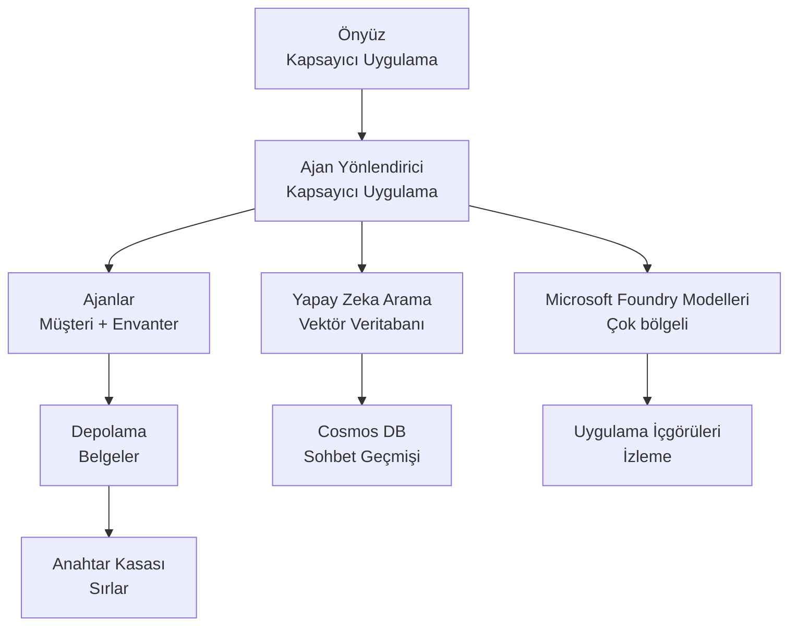

# Perakende Çok Ajanlı Çözüm - Altyapı Şablonu

**Bölüm 5: Üretim Dağıtım Paketi**
- **📚 Kurs Ana Sayfası**: [AZD For Beginners](../../README.md)
- **📖 İlgili Bölüm**: [Bölüm 5: Çok Ajanlı Yapay Zeka Çözümleri](../../README.md#-chapter-5-multi-agent-ai-solutions-advanced)
- **📝 Senaryo Rehberi**: [Tam Mimari](../retail-scenario.md)
- **🎯 Hızlı Dağıtım**: [Tek Tıkla Dağıtım](#-quick-deployment)

> **⚠️ SADECE ALTYAPI ŞABLONU**  
> Bu ARM şablonu çok ajanlı bir sistem için **Azure kaynaklarını** dağıtır.  
>  
> **Dağıtılanlar (15-25 dakika):**
> - ✅ Microsoft Foundry Modelleri (gpt-4.1, gpt-4.1-mini, 3 bölgede embeddings)
> - ✅ AI Search servisi (boş, indeks oluşturulmaya hazır)
> - ✅ Container Apps (yer tutucu görüntüler, kodunuz için hazır)
> - ✅ Depolama, Cosmos DB, Key Vault, Application Insights
>  
> **DAHİL OLMAYANLAR (geliştirme gerektirir):**
> - ❌ Ajan uygulama kodu (Müşteri Ajanı, Envanter Ajanı)
> - ❌ Yönlendirme mantığı ve API uç noktaları
> - ❌ Ön uç sohbet kullanıcı arayüzü
> - ❌ Arama indeks şemaları ve veri boru hatları
> - ❌ **Tahmini geliştirme çabası: 80-120 saat**
>  
> **Bu şablonu kullanın eğer:**
> - ✅ Çok ajanlı bir proje için Azure altyapısı sağlamak istiyorsunuz
> - ✅ Ajan uygulamasını ayrı olarak geliştirmeyi planlıyorsunuz
> - ✅ Üretime hazır bir altyapı temel hattına ihtiyacınız var
>  
> **Kullanmayın eğer:**
> - ❌ Anında çalışan bir çok ajanlı demo bekliyorsanız
> - ❌ Tam uygulama kod örnekleri arıyorsanız

## Genel Bakış

Bu dizin, çok ajanlı bir müşteri destek sistemi için **altyapı temelini** dağıtmak üzere kapsamlı bir Azure Resource Manager (ARM) şablonu içerir. Şablon, gerekli tüm Azure hizmetlerini uygun şekilde yapılandırılmış ve birbirine bağlanmış olarak sağlar; uygulama geliştirmeye hazırdır.

**Dağıtımdan sonra sahip olacağınız:** Üretime hazır Azure altyapısı  
**Sistemi tamamlamak için ihtiyacınız olanlar:** Ajan kodu, ön uç UI ve veri yapılandırması (bkz. [Tam Mimari](../retail-scenario.md))

## 🎯 Neler Dağıtılır

### Temel Altyapı (Dağıtım Sonrası Durum)

✅ **Microsoft Foundry Modelleri Servisleri** (API çağrılarına hazır)
  - Birincil bölge: gpt-4.1 dağıtımı (20K TPM kapasitesi)
  - İkincil bölge: gpt-4.1-mini dağıtımı (10K TPM kapasitesi)
  - Üçüncül bölge: Metin embeddings modeli (30K TPM kapasitesi)
  - Değerlendirme bölgesi: gpt-4.1 grader modeli (15K TPM kapasitesi)
  - **Durum:** Tam işlevsel - hemen API çağrıları yapabilirsiniz

✅ **Azure AI Search** (Boş - yapılandırmaya hazır)
  - Vektör arama yetenekleri etkin
  - Standart katman, 1 bölüm, 1 kopya
  - **Durum:** Servis çalışıyor, ancak indeks oluşturulması gerekiyor
  - **Gereken eylem:** Şemanızla arama indeksi oluşturun

✅ **Azure Depolama Hesabı** (Boş - yüklemelere hazır)
  - Blob konteynerleri: `documents`, `uploads`
  - Güvenli yapılandırma (sadece HTTPS, genel erişim yok)
  - **Durum:** Dosya almaya hazır
  - **Gereken eylem:** Ürün verilerinizi ve belgelerinizi yükleyin

⚠️ **Container Apps Ortamı** (Yer tutucu görüntüler dağıtıldı)
  - Ajan yönlendirici uygulaması (nginx varsayılan görüntüsü)
  - Ön uç uygulaması (nginx varsayılan görüntüsü)
  - Otomatik ölçeklendirme yapılandırıldı (0-10 örnek)
  - **Durum:** Yer tutucu konteynerler çalışıyor
  - **Gereken eylem:** Ajan uygulamalarınızı oluşturup dağıtın

✅ **Azure Cosmos DB** (Boş - veri için hazır)
  - Veritabanı ve konteyner ön yapılandırıldı
  - Düşük gecikme işlemleri için optimize edildi
  - Otomatik temizlik için TTL etkin
  - **Durum:** Sohbet geçmişini depolamaya hazır

✅ **Azure Key Vault** (İsteğe bağlı - gizli bilgiler için hazır)
  - Soft delete etkin
  - Yönetilen kimlikler için RBAC yapılandırıldı
  - **Durum:** API anahtarları ve bağlantı dizelerini depolamaya hazır

✅ **Application Insights** (İsteğe bağlı - izleme aktif)
  - Log Analytics çalışma alanına bağlı
  - Özel metrikler ve uyarılar yapılandırıldı
  - **Durum:** Uygulamalarınızdan telemetri almaya hazır

✅ **Document Intelligence** (API çağrıları için hazır)
  - Üretim iş yükleri için S0 katmanı
  - **Durum:** Yüklenen belgeleri işlemeye hazır

✅ **Bing Search API** (API çağrıları için hazır)
  - Gerçek zamanlı aramalar için S1 katmanı
  - **Durum:** Web arama sorguları için hazır

### Dağıtım Modları

| Parametre | OpenAI Kapasitesi | Konteyner Örnekleri | Arama Katmanı | Depolama Yedekliliği | En Uygun |
|------|-----------------|---------------------|-------------|-------------------|----------|
| **Minimal** | 10K-20K TPM | 0-2 kopya | Basic | LRS (Yerel) | Geliştirme/test, öğrenme, kavram kanıtı |
| **Standard** | 30K-60K TPM | 2-5 kopya | Standard | ZRS (Bölge) | Üretim, orta trafik (<10K kullanıcı) |
| **Premium** | 80K-150K TPM | 5-10 kopya, bölge-yedekli | Premium | GRS (Coğrafi) | Kurumsal, yüksek trafik (>10K kullanıcı), %99.99 SLA |

**Maliyet Etkisi:**
- **Minimal → Standard:** ~4x maliyet artışı ($100-370/mo → $420-1,450/mo)
- **Standard → Premium:** ~3x maliyet artışı ($420-1,450/mo → $1,150-3,500/mo)
- **Seçim için:** Beklenen yük, SLA gereksinimleri, bütçe sınırlamaları

**Kapasite Planlaması:**
- **TPM (Dakikadaki Tokenler):** Tüm model dağıtımlarının toplamı
- **Konteyner Örnekleri:** Otomatik ölçeklendirme aralığı (min-maks kopya)
- **Arama Katmanı:** Sorgu performansını ve indeks boyutu sınırlarını etkiler

## 📋 Gereksinimler

### Gerekli Araçlar
1. **Azure CLI** (sürüm 2.50.0 veya üstü)
   ```bash
   az --version  # Sürümü kontrol et
   az login      # Kimlik doğrula
   ```

2. **Etkin Azure aboneliği** - Sahip (Owner) veya Katkıda Bulunan (Contributor) erişimi
   ```bash
   az account show  # Aboneliği doğrula
   ```

### Gerekli Azure Kotaları

Dağıtımdan önce hedef bölgelerinizde yeterli kotaların olduğundan emin olun:

```bash
# Bölgenizde Microsoft Foundry modellerinin kullanılabilirliğini kontrol edin
az cognitiveservices account list-skus \
  --kind OpenAI \
  --location eastus2

# OpenAI kotasını doğrulayın (gpt-4.1 için örnek)
az cognitiveservices usage list \
  --location eastus2 \
  --query "[?name.value=='OpenAI.Standard.gpt-4.1']"

# Container Apps kotasını kontrol edin
az provider show \
  --namespace Microsoft.App \
  --query "resourceTypes[?resourceType=='managedEnvironments'].locations"
```

**Minimum Gereken Kotalar:**
- **Microsoft Foundry Modelleri:** Bölgeler arasında 3-4 model dağıtımı
  - gpt-4.1: 20K TPM (Dakikadaki Tokenler)
  - gpt-4.1-mini: 10K TPM
  - text-embedding-ada-002: 30K TPM
  - **Not:** gpt-4.1 bazı bölgelerde bekleme listesi olabilir - kontrol edin [model kullanılabilirliği](https://learn.microsoft.com/azure/ai-services/openai/concepts/models)
- **Container Apps:** Yönetilen ortam + 2-10 konteyner örneği
- **AI Search:** Standart katman (Vektör arama için Basic yetersiz)
- **Cosmos DB:** Standart sağlanan throughput

**Eğer kota yetersizse:**
1. Azure Portal → Quotas → Artış talep edin
2. Veya Azure CLI kullanın:
   ```bash
   az support tickets create \
     --ticket-name "OpenAI-Quota-Increase" \
     --severity "minimal" \
     --description "Request quota increase for Microsoft Foundry Models gpt-4.1 in eastus2"
   ```
3. Kullanılabilirliği olan alternatif bölgeleri düşünün

## 🚀 Hızlı Dağıtım

### Seçenek 1: Azure CLI kullanarak

```bash
# Şablon dosyalarını klonlayın veya indirin
git clone <repository-url>
cd examples/retail-multiagent-arm-template

# Dağıtım betiğini çalıştırılabilir yapın
chmod +x deploy.sh

# Varsayılan ayarlarla dağıtın
./deploy.sh -g myResourceGroup

# Üretim için premium özelliklerle dağıtın
./deploy.sh -g myProdRG -e prod -m premium -l eastus2
```

### Seçenek 2: Azure Portal kullanarak

[](https://portal.azure.com/#create/Microsoft.Template/uri/https%3A%2F%2Fraw.githubusercontent.com%2Fmicrosoft%2Fazd-for-beginners%2Fmain%2Fexamples%2Fretail-multiagent-arm-template%2Fazuredeploy.json)

### Seçenek 3: Azure CLI'yi doğrudan kullanarak

```bash
# Kaynak grubu oluştur
az group create --name myResourceGroup --location eastus2

# Şablonu dağıt
az deployment group create \
  --resource-group myResourceGroup \
  --template-file azuredeploy.json \
  --parameters azuredeploy.parameters.json
```

## ⏱️ Dağıtım Zaman Çizelgesi

### Beklenenler

| Aşama | Süre | Neler Olur |
|-------|----------|--------------||
| **Template Validation** | 30-60 seconds | Azure validates ARM template syntax and parameters |
| **Resource Group Setup** | 10-20 seconds | Creates resource group (if needed) |
| **OpenAI Provisioning** | 5-8 minutes | Creates 3-4 OpenAI accounts and deploys models |
| **Container Apps** | 3-5 minutes | Creates environment and deploys placeholder containers |
| **Search & Storage** | 2-4 minutes | Provisions AI Search service and storage accounts |
| **Cosmos DB** | 2-3 minutes | Creates database and configures containers |
| **Monitoring Setup** | 2-3 minutes | Sets up Application Insights and Log Analytics |
| **RBAC Configuration** | 1-2 minutes | Configures managed identities and permissions |
| **Total Deployment** | **15-25 minutes** | Complete infrastructure ready |

**Dağıtım Sonrası:**
- ✅ **Altyapı Hazır:** Tüm Azure servisleri sağlandı ve çalışıyor
- ⏱️ **Uygulama Geliştirme:** 80-120 saat (sizin sorumluluğunuz)
- ⏱️ **İndeks Yapılandırması:** 15-30 dakika (şemanız gereklidir)
- ⏱️ **Veri Yükleme:** Veri kümesine bağlı olarak değişir
- ⏱️ **Test & Doğrulama:** 2-4 saat

---

## ✅ Dağıtım Başarısını Doğrulayın

### Adım 1: Kaynak Sağlanmasını Kontrol Edin (2 dakika)

```bash
# Tüm kaynakların başarıyla dağıtıldığını doğrulayın
az resource list \
  --resource-group myResourceGroup \
  --query "[?provisioningState!='Succeeded'].{Name:name, Status:provisioningState, Type:type}" \
  --output table
```

**Beklenen:** Boş tablo (tüm kaynaklar "Succeeded" durumunu gösterir)

### Adım 2: Microsoft Foundry Modelleri Dağıtımlarını Doğrulayın (3 dakika)

```bash
# Tüm OpenAI hesaplarını listele
az cognitiveservices account list \
  --resource-group myResourceGroup \
  --query "[?kind=='OpenAI'].{Name:name, Location:location, Status:properties.provisioningState}" \
  --output table

# Birincil bölge için model dağıtımlarını kontrol et
OPENAI_NAME=$(az cognitiveservices account list \
  --resource-group myResourceGroup \
  --query "[?kind=='OpenAI'] | [0].name" -o tsv)

az cognitiveservices account deployment list \
  --name $OPENAI_NAME \
  --resource-group myResourceGroup \
  --output table
```

**Beklenen:** 
- 3-4 OpenAI hesabı (birincil, ikincil, üçüncül, değerlendirme bölgeleri)
- Hesap başına 1-2 model dağıtımı (gpt-4.1, gpt-4.1-mini, text-embedding-ada-002)

### Adım 3: Altyapı Uç Noktalarını Test Edin (5 dakika)

```bash
# Konteyner Uygulaması URL'lerini Al
az containerapp list \
  --resource-group myResourceGroup \
  --query "[].{Name:name, URL:properties.configuration.ingress.fqdn, Status:properties.runningStatus}" \
  --output table

# Yönlendirici uç noktasını test et (yer tutucu bir resim yanıt verecek)
ROUTER_URL=$(az containerapp show \
  --name retail-router \
  --resource-group myResourceGroup \
  --query "properties.configuration.ingress.fqdn" -o tsv)

echo "Testing: https://$ROUTER_URL"
curl -I https://$ROUTER_URL || echo "Container running (placeholder image - expected)"
```

**Beklenen:** 
- Container Apps "Running" durumunu gösterir
- Yer tutucu nginx HTTP 200 veya 404 yanıtı verir (henüz uygulama kodu yok)

### Adım 4: Microsoft Foundry Modelleri API Erişimini Doğrulayın (3 dakika)

```bash
# OpenAI uç noktasını ve anahtarını al
OPENAI_ENDPOINT=$(az cognitiveservices account show \
  --name $OPENAI_NAME \
  --resource-group myResourceGroup \
  --query "properties.endpoint" -o tsv)

OPENAI_KEY=$(az cognitiveservices account keys list \
  --name $OPENAI_NAME \
  --resource-group myResourceGroup \
  --query "key1" -o tsv)

# gpt-4.1 dağıtımını test et
curl "${OPENAI_ENDPOINT}openai/deployments/gpt-4.1/chat/completions?api-version=2024-08-01-preview" \
  -H "Content-Type: application/json" \
  -H "api-key: $OPENAI_KEY" \
  -d '{
    "messages": [{"role": "user", "content": "Say hello"}],
    "max_tokens": 10
  }'
```

**Beklenen:** Chat tamamlaması içeren JSON yanıtı (OpenAI'nin çalıştığını doğrular)

### Neler Çalışıyor vs. Neler Çalışmıyor

**✅ Dağıtım Sonrası Çalışanlar:**
- Microsoft Foundry Modelleri dağıtıldı ve API çağrılarını kabul ediyor
- AI Search servisi çalışıyor (boş, henüz indeks yok)
- Container Apps çalışıyor (yer tutucu nginx görüntüleri)
- Depolama hesapları erişilebilir ve yüklemelere hazır
- Cosmos DB veri işlemleri için hazır
- Application Insights altyapı telemetrisi topluyor
- Key Vault gizli bilgi depolamaya hazır

**❌ Henüz Çalışmayanlar (Geliştirme Gerektirir):**
- Ajan uç noktaları (uygulama kodu dağıtılmadı)
- Sohbet işlevselliği (ön uç + arka uç uygulanması gerekir)
- Arama sorguları (henüz arama indeksi oluşturulmadı)
- Belge işleme hattı (veri yüklenmedi)
- Özel telemetri (uygulama enstrümantasyonu gerekli)

**Sonraki Adımlar:** Bakınız [Dağıtım Sonrası Yapılandırma](#-post-deployment-next-steps) uygulamanızı geliştirmek ve dağıtmak için

---

## ⚙️ Yapılandırma Seçenekleri

### Şablon Parametreleri

| Parametre | Tür | Varsayılan | Açıklama |
|-----------|------|---------|-------------|
| `projectName` | string | "retail" | Tüm kaynak adları için önek |
| `location` | string | Resource group location | Birincil dağıtım bölgesi |
| `secondaryLocation` | string | "westus2" | Çok bölgeli dağıtım için ikincil bölge |
| `tertiaryLocation` | string | "francecentral" | Embedding modeli için bölge |
| `environmentName` | string | "dev" | Ortam tanımı (dev/staging/prod) |
| `deploymentMode` | string | "standard" | Dağıtım yapılandırması (minimal/standard/premium) |
| `enableMultiRegion` | bool | true | Çok bölgeli dağıtımı etkinleştir |
| `enableMonitoring` | bool | true | Application Insights ve günlüklemeyi etkinleştir |
| `enableSecurity` | bool | true | Key Vault ve gelişmiş güvenliği etkinleştir |

### Parametreleri Özelleştirme

Düzenleyin `azuredeploy.parameters.json`:

```json
{
  "$schema": "https://schema.management.azure.com/schemas/2019-04-01/deploymentParameters.json#",
  "contentVersion": "1.0.0.0",
  "parameters": {
    "projectName": {
      "value": "mycompany"
    },
    "environmentName": {
      "value": "prod"
    },
    "deploymentMode": {
      "value": "premium"
    },
    "location": {
      "value": "eastus2"
    }
  }
}
```

## 🏗️ Mimari Genel Bakış


## 📖 Dağıtım Betiği Kullanımı

`deploy.sh` betiği etkileşimli bir dağıtım deneyimi sağlar:

```bash
# Yardımı göster
./deploy.sh --help

# Temel dağıtım
./deploy.sh -g myResourceGroup

# Özel ayarlarla gelişmiş dağıtım
./deploy.sh \
  -g myProductionRG \
  -p companyname \
  -e prod \
  -m premium \
  -l eastus2

# Çoklu bölge olmadan geliştirme dağıtımı
./deploy.sh \
  -g myDevRG \
  -e dev \
  -m minimal \
  --no-multi-region \
  --no-security
```

### Betik Özellikleri

- ✅ **Gereksinimler doğrulaması** (Azure CLI, giriş durumu, şablon dosyaları)
- ✅ **Kaynak grubu yönetimi** (yoksa oluşturur)
- ✅ **Dağıtım öncesi şablon doğrulaması**
- ✅ **Renkli çıktı ile ilerleme izleme**
- ✅ **Dağıtım çıktılarını gösterme**
- ✅ **Dağıtım sonrası rehberlik**

## 📊 Dağıtımı İzleme

### Dağıtım Durumunu Kontrol Et

```bash
# Dağıtımları listele
az deployment group list --resource-group myResourceGroup --output table

# Dağıtım ayrıntılarını al
az deployment group show \
  --resource-group myResourceGroup \
  --name retail-deployment-YYYYMMDD-HHMMSS

# Dağıtım ilerlemesini izle
az deployment group create \
  --resource-group myResourceGroup \
  --template-file azuredeploy.json \
  --parameters azuredeploy.parameters.json \
  --verbose
```

### Dağıtım Çıktıları

Başarılı dağıtımdan sonra aşağıdaki çıktılar kullanılabilir:

- **Ön Uç URL'si**: Web arayüzü için genel uç nokta
- **Yönlendirici URL'si**: Ajan yönlendirici için API uç noktası
- **OpenAI Uç Noktaları**: Birincil ve ikincil OpenAI servis uç noktaları
- **Arama Servisi**: Azure AI Search servis uç noktası
- **Depolama Hesabı**: Belgeler için depolama hesabı adı
- **Key Vault**: Key Vault adı (etkinse)
- **Application Insights**: İzleme servisi adı (etkinse)

## 🔧 Dağıtım Sonrası: Sonraki Adımlar
> **📝 Önemli:** Altyapı dağıtıldı, ancak uygulama kodunu geliştirip dağıtmanız gerekiyor.

### Aşama 1: Ajan Uygulamaları Geliştirme (Sizin Sorumluluğunuz)

ARM şablonu, yer tutucu nginx görüntüleriyle **boş Container Uygulamaları** oluşturur. Şunları yapmalısınız:

**Gerekli Geliştirme:**
1. **Ajan Uygulaması** (30-40 saat)
   - gpt-4.1 entegrasyonlu müşteri hizmetleri ajanı
   - gpt-4.1-mini entegrasyonlu envanter ajanı
   - Ajan yönlendirme mantığı

2. **Ön Uç Geliştirme** (20-30 saat)
   - Sohbet arayüzü UI (React/Vue/Angular)
   - Dosya yükleme işlevselliği
   - Yanıtların render edilmesi ve biçimlendirilmesi

3. **Arka Uç Servisleri** (12-16 saat)
   - FastAPI veya Express yönlendiricisi
   - Kimlik doğrulama ara katmanı
   - Telemetri entegrasyonu

Bkz: [Mimari Kılavuz](../retail-scenario.md) ayrıntılı uygulama desenleri ve kod örnekleri için

### Aşama 2: AI Arama Dizini Yapılandırması (15-30 dakika)

Veri modelinize uygun bir arama dizini oluşturun:

```bash
# Arama hizmeti ayrıntılarını alın
SEARCH_NAME=$(az search service list \
  --resource-group myResourceGroup \
  --query "[0].name" -o tsv)

SEARCH_KEY=$(az search admin-key show \
  --service-name $SEARCH_NAME \
  --resource-group myResourceGroup \
  --query "primaryKey" -o tsv)

# Şemanızla bir dizin oluşturun (örnek)
curl -X POST "https://${SEARCH_NAME}.search.windows.net/indexes?api-version=2023-11-01" \
  -H "Content-Type: application/json" \
  -H "api-key: ${SEARCH_KEY}" \
  -d '{
    "name": "products",
    "fields": [
      {"name": "id", "type": "Edm.String", "key": true},
      {"name": "title", "type": "Edm.String", "searchable": true},
      {"name": "content", "type": "Edm.String", "searchable": true},
      {"name": "category", "type": "Edm.String", "filterable": true},
      {"name": "content_vector", "type": "Collection(Edm.Single)", 
       "searchable": true, "dimensions": 1536, "vectorSearchProfile": "default"}
    ],
    "vectorSearch": {
      "algorithms": [{"name": "default", "kind": "hnsw"}],
      "profiles": [{"name": "default", "algorithm": "default"}]
    }
  }'
```

**Kaynaklar:**
- [AI Arama İndeksi Şema Tasarımı](https://learn.microsoft.com/azure/search/search-what-is-an-index)
- [Vektör Arama Yapılandırması](https://learn.microsoft.com/azure/search/vector-search-how-to-create-index)

### Aşama 3: Verilerinizi Yükleyin (Süre değişir)

Ürün verileriniz ve belgeleriniz olduğunda:

```bash
# Depolama hesabı ayrıntılarını alın
STORAGE_NAME=$(az storage account list \
  --resource-group myResourceGroup \
  --query "[0].name" -o tsv)

STORAGE_KEY=$(az storage account keys list \
  --account-name $STORAGE_NAME \
  --resource-group myResourceGroup \
  --query "[0].value" -o tsv)

# Belgelerinizi yükleyin
az storage blob upload-batch \
  --destination documents \
  --source /path/to/your/product/docs \
  --account-name $STORAGE_NAME \
  --account-key $STORAGE_KEY

# Örnek: Tek dosya yükleyin
az storage blob upload \
  --container-name documents \
  --name "product-manual.pdf" \
  --file /path/to/product-manual.pdf \
  --account-name $STORAGE_NAME \
  --account-key $STORAGE_KEY
```

### Aşama 4: Uygulamalarınızı Oluşturun ve Dağıtın (8-12 saat)

Ajan kodunuzu geliştirdikten sonra:

```bash
# 1. Azure Container Registry oluşturun (gerekirse)
az acr create \
  --name myregistry \
  --resource-group myResourceGroup \
  --sku Basic

# 2. Agent yönlendirici imajını oluşturun ve gönderin
docker build -t myregistry.azurecr.io/agent-router:v1 /path/to/your/router/code
az acr login --name myregistry
docker push myregistry.azurecr.io/agent-router:v1

# 3. Ön uç imajını oluşturun ve gönderin
docker build -t myregistry.azurecr.io/frontend:v1 /path/to/your/frontend/code
docker push myregistry.azurecr.io/frontend:v1

# 4. Container Apps'i imajlarınızla güncelleyin
az containerapp update \
  --name retail-router \
  --resource-group myResourceGroup \
  --image myregistry.azurecr.io/agent-router:v1

az containerapp update \
  --name retail-frontend \
  --resource-group myResourceGroup \
  --image myregistry.azurecr.io/frontend:v1

# 5. Ortam değişkenlerini yapılandırın
az containerapp update \
  --name retail-router \
  --resource-group myResourceGroup \
  --set-env-vars \
    OPENAI_ENDPOINT=secretref:openai-endpoint \
    OPENAI_KEY=secretref:openai-key \
    SEARCH_ENDPOINT=secretref:search-endpoint \
    SEARCH_KEY=secretref:search-key
```

### Aşama 5: Uygulamanızı Test Edin (2-4 saat)

```bash
# Uygulamanızın URL'sini alın
ROUTER_URL=$(az containerapp show \
  --name retail-router \
  --resource-group myResourceGroup \
  --query "properties.configuration.ingress.fqdn" -o tsv)

# Test ajan uç noktası (kodunuz dağıtıldıktan sonra)
curl -X POST "https://${ROUTER_URL}/chat" \
  -H "Content-Type: application/json" \
  -d '{
    "message": "Hello, I need help with my order",
    "agent": "customer"
  }'

# Uygulama günlüklerini kontrol edin
az containerapp logs show \
  --name retail-router \
  --resource-group myResourceGroup \
  --follow
```

### Uygulama Kaynakları

**Mimari & Tasarım:**
- 📖 [Tam Mimari Kılavuz](../retail-scenario.md) - Ayrıntılı uygulama desenleri
- 📖 [Çok Ajanlı Tasarım Desenleri](https://learn.microsoft.com/azure/architecture/ai-ml/guide/multi-agent-systems)

**Kod Örnekleri:**
- 🔗 [Microsoft Foundry Modelleri Sohbet Örneği](https://github.com/Azure-Samples/azure-search-openai-demo) - RAG deseni
- 🔗 [Semantic Kernel](https://github.com/microsoft/semantic-kernel) - Ajan çerçevesi (C#)
- 🔗 [LangChain Azure](https://github.com/langchain-ai/langchain) - Ajan orkestrasyonu (Python)
- 🔗 [AutoGen](https://github.com/microsoft/autogen) - Çok ajanlı sohbetler

**Tahmini Toplam Çaba:**
- Altyapı dağıtımı: 15-25 dakika (✅ Tamamlandı)
- Uygulama geliştirme: 80-120 saat (🔨 Sizin işiniz)
- Test ve optimizasyon: 15-25 saat (🔨 Sizin işiniz)

## 🛠️ Sorun Giderme

### Yaygın Sorunlar

#### 1. Microsoft Foundry Models Kotası Aşıldı

```bash
# Mevcut kota kullanımını kontrol et
az cognitiveservices usage list --location eastus2

# Kota artışı talep et
az support tickets create \
  --ticket-name "OpenAI-Quota-Increase" \
  --severity "minimal" \
  --description "Request quota increase for Microsoft Foundry Models in region X"
```

#### 2. Container Apps Dağıtımı Başarısız Oldu

```bash
# Konteyner uygulamasının günlüklerini kontrol et
az containerapp logs show \
  --name retail-router \
  --resource-group myResourceGroup \
  --follow

# Konteyner uygulamayı yeniden başlat
az containerapp revision restart \
  --name retail-router \
  --resource-group myResourceGroup
```

#### 3. Arama Hizmeti Başlatma

```bash
# Arama hizmeti durumunu doğrulayın
az search service show \
  --name <search-service-name> \
  --resource-group myResourceGroup

# Arama hizmeti bağlantısını test edin
curl -X GET "https://<search-service-name>.search.windows.net/indexes?api-version=2023-11-01" \
  -H "api-key: <search-admin-key>"
```

### Dağıtım Doğrulama

```bash
# Tüm kaynakların oluşturulduğunu doğrula
az resource list \
  --resource-group myResourceGroup \
  --output table

# Kaynakların sağlığını kontrol et
az resource list \
  --resource-group myResourceGroup \
  --query "[?provisioningState!='Succeeded'].{Name:name, Status:provisioningState, Type:type}" \
  --output table
```

## 🔐 Güvenlik Hususları

### Anahtar Yönetimi
- Tüm gizli anahtarlar Azure Key Vault'ta depolanır (etkinleştirildiğinde)
- Container uygulamaları kimlik doğrulama için yönetilen kimlik kullanır
- Depolama hesapları güvenli varsayılanlara sahiptir (yalnızca HTTPS, genel blob erişimi yok)

### Ağ Güvenliği
- Container uygulamaları mümkün olduğunda dahili ağ kullanır
- Arama hizmeti özel uç noktalar seçeneğiyle yapılandırıldı
- Cosmos DB minimum gerekli izinlerle yapılandırıldı

### RBAC Yapılandırması
```bash
# Yönetilen kimlik için gerekli rolleri atayın
az role assignment create \
  --assignee <container-app-managed-identity> \
  --role "Cognitive Services OpenAI User" \
  --scope <openai-resource-id>
```

## 💰 Maliyet Optimizasyonu

### Maliyet Tahminleri (Aylık, USD)

| Mod | OpenAI | Container Uygulamaları | Arama | Depolama | Toplam Tahmin |
|------|--------|----------------|--------|---------|------------|
| Minimal | $50-200 | $20-50 | $25-100 | $5-20 | $100-370 |
| Standart | $200-800 | $100-300 | $100-300 | $20-50 | $420-1450 |
| Premium | $500-2000 | $300-800 | $300-600 | $50-100 | $1150-3500 |

### Maliyet İzleme

```bash
# Bütçe uyarıları ayarlayın
az consumption budget create \
  --account-name <subscription-id> \
  --budget-name "retail-budget" \
  --amount 500 \
  --time-grain Monthly \
  --start-date 2024-01-01 \
  --end-date 2024-12-31
```

## 🔄 Güncellemeler ve Bakım

### Şablon Güncellemeleri
- ARM şablon dosyalarını sürüm kontrolüne alın
- Değişiklikleri önce geliştirme ortamında test edin
- Güncellemeler için artımlı dağıtım modunu kullanın

### Kaynak Güncellemeleri
```bash
# Yeni parametrelerle güncelle
az deployment group create \
  --resource-group myResourceGroup \
  --template-file azuredeploy.json \
  --parameters azuredeploy.parameters.json \
  --mode Incremental
```

### Yedekleme ve Kurtarma
- Cosmos DB otomatik yedekleme etkinleştirildi
- Key Vault yumuşak silme etkinleştirildi
- Container uygulama revizyonları geri alma için korunur

## 📞 Destek

- **Şablon Sorunları**: [GitHub Issues](https://github.com/microsoft/azd-for-beginners/issues)
- **Azure Desteği**: [Azure Destek Portalı](https://portal.azure.com/#blade/Microsoft_Azure_Support/HelpAndSupportBlade)
- **Topluluk**: [Azure AI Discord](https://discord.gg/microsoft-azure)

---

**⚡ Çok ajanlı çözümünüzü dağıtmaya hazır mısınız?**

Başlamak için: `./deploy.sh -g myResourceGroup`

---

<!-- CO-OP TRANSLATOR DISCLAIMER START -->
**Disclaimer**:
Bu belge, yapay zeka çeviri hizmeti [Co-op Translator](https://github.com/Azure/co-op-translator) kullanılarak çevrilmiştir. Doğruluk için çaba göstersek de, otomatik çevirilerin hatalar veya yanlışlıklar içerebileceğini lütfen unutmayın. Orijinal belgenin kendi dilindeki sürümü otoritatif kaynak olarak kabul edilmelidir. Kritik bilgiler için profesyonel insan çevirisi tavsiye edilir. Bu çevirinin kullanılması nedeniyle ortaya çıkabilecek herhangi bir yanlış anlama veya yanlış yorumdan sorumlu tutulamayız.
<!-- CO-OP TRANSLATOR DISCLAIMER END -->