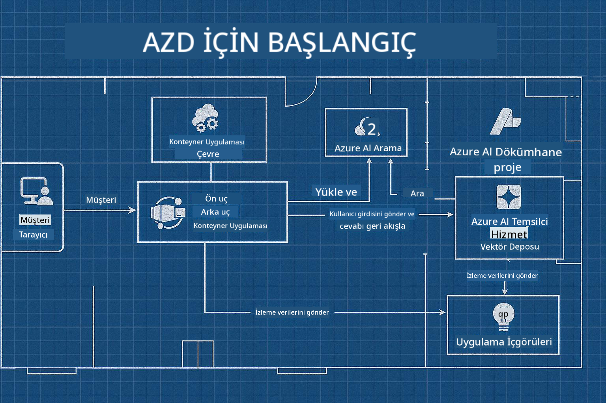

<!--
CO_OP_TRANSLATOR_METADATA:
{
  "original_hash": "245d24997bbcf2bae93bb2a503845d37",
  "translation_date": "2025-09-23T11:53:59+00:00",
  "source_file": "workshop/README.md",
  "language_code": "tr"
}
-->
# AZD for AI Geliştiricileri Atölyesi

## AZD Şablonları

Kendi senaryonuza uygun, kurumsal düzeyde bir AI Uygulama çözümü oluşturmak, kendi evinizi inşa etmek gibidir. Kendiniz tasarlayabilir, tuğla tuğla inşa edebilir ve tüm yönetim ve geliştirme yönergelerine uygun olmasını sağlama sorumluluğunu üstlenebilirsiniz.

**YA DA ....**

Bir mimarla çalışabilir ve size bir başlangıç evi için bir _plan_ verebilir, ardından ihtiyaçlarınıza uygun şekilde _özelleştirebilirsiniz_. Bu, **evinizi** özel kılan şeylere odaklanmanızı sağlar ve temel elektrik, tesisat ve diğer bağımlılıkların uzmanlar tarafından sizin için halledilmesine olanak tanır.

**[AI Uygulama Şablonları](https://ai.azure.com/templates)** yaklaşımı tam olarak budur - temel ihtiyaçlarınıza ve bağımlılıklarınıza bağlı olarak farklı türde AI uygulama "evleri" inşa etmek için bir dizi plan.

## Şablon Özelleştirme

Şablonlar [Azure AI Foundry](https://ai.azure.com) ile çalışacak şekilde tasarlanmıştır. Bu platformu, işinizi halletmek için ihtiyaç duyduğunuz tüm kaynaklara, araçlara ve uzmanlığa erişimi olan "inşaat müteahhitiniz" olarak düşünebilirsiniz!

Tek yapmanız gereken [başlangıç şablonlarınızı](https://learn.microsoft.com/en-us/azure/ai-foundry/how-to/develop/ai-template-get-started) seçmek. Örneğin, AI Arama, Red Teaming, Değerlendirmeler, İzleme, Takip ve daha fazlası gibi özelliklerle donatılmış bir "Agentic AI Evi" oluşturmak için _AI Ajanlarıyla Başlangıç_ şablonuna odaklanacağız.



Tek yapmanız gereken, özelleştirme sürecinde size rehberlik edecek bir mimarla zaman ayarlamak. [GitHub Copilot for Azure](https://learn.microsoft.com/en-us/azure/developer/github-copilot-azure/get-started) bu rehber olabilir. Sadece onunla "sohbet ederek":

- Şablonunuzdaki Azure özelliklerini öğrenin
- Azure kaynaklarını dağıtın
- Dağıtımınız hakkında bilgi alın
- Sorunları teşhis edin ve çözün!

Bu atölyede, mevcut şablonu _parçalayıp_ (ne sunduğunu öğrenmek için), ardından _özelleştirerek_ (gereksinimlerimizi karşılamak için) adım adım ilerleyeceğiz.

AI Şablonları **işi halleder** - atölyeyi tamamlayarak **onu kendinize ait hale getirmeyi** öğreneceksiniz.

----

**Atölye Navigasyonu**
- **📚 Kurs Ana Sayfası**: [AZD Yeni Başlayanlar İçin](../README.md)
- **📖 İlgili Bölümler**: [Bölüm 1](../README.md#-chapter-1-foundation--quick-start), [Bölüm 2](../README.md#-chapter-2-ai-first-development-recommended-for-ai-developers) ve [Bölüm 5](../README.md#-chapter-5-multi-agent-ai-solutions-advanced) konularını kapsar
- **🛠️ Uygulamalı Laboratuvar**: [AI Atölye Laboratuvarı](../docs/ai-foundry/ai-workshop-lab.md)
- **🚀 Sonraki Adımlar**: [Atölye Laboratuvar Modülleri](../../../workshop)

Azure Developer CLI (AZD) ile AI uygulama dağıtımına odaklanan uygulamalı atölyeye hoş geldiniz. Bu atölye, AZD temellerinden üretime hazır AI çözümleri dağıtmaya kadar sizi yönlendirmek için tasarlanmıştır.

## Atölye Genel Bakış

**Süre:** 2-3 saat  
**Seviye:** Başlangıçtan Orta seviyeye  
**Ön Koşullar:** Azure, komut satırı araçları ve AI kavramları hakkında temel bilgi

### Öğrenecekleriniz

- **AZD Temelleri**: AZD ile Kod Olarak Altyapıyı Anlama
- 🤖 **AI Hizmet Entegrasyonu**: Azure OpenAI, AI Arama ve diğer AI hizmetlerini dağıtma
- **Konteyner Dağıtımı**: AI uygulamaları için Azure Container Apps kullanımı
- **Güvenlik En İyi Uygulamaları**: Yönetilen Kimlik ve güvenli yapılandırmalar uygulama
- **İzleme ve Gözlemlenebilirlik**: AI iş yükleri için Application Insights kurma
- **Üretim Kalıpları**: Kurumsal düzeyde dağıtım stratejileri

## Atölye Yapısı

### Modül 1: AZD Temelleri (30 dakika)
- AZD'nin kurulumu ve yapılandırılması
- AZD proje yapısını anlama
- İlk AZD dağıtımınız
- **Laboratuvar**: Basit bir web uygulaması dağıtın

### Modül 2: Azure OpenAI Entegrasyonu (45 dakika)
- Azure OpenAI kaynaklarını kurma
- Model dağıtım stratejileri
- API erişimi ve kimlik doğrulama yapılandırması
- **Laboratuvar**: GPT-4 ile bir sohbet uygulaması dağıtın

### Modül 3: RAG Uygulamaları (45 dakika)
- Azure AI Arama entegrasyonu
- Azure Document Intelligence ile belge işleme
- Vektör gömme ve anlamsal arama
- **Laboratuvar**: Bir belge Soru-Cevap sistemi oluşturun

### Modül 4: Üretim Dağıtımı (30 dakika)
- Container Apps yapılandırması
- Ölçeklendirme ve performans optimizasyonu
- İzleme ve günlük kaydı
- **Laboratuvar**: Gözlemlenebilirlik ile üretime dağıtım yapın

### Modül 5: İleri Düzey Kalıplar (15 dakika)
- Çoklu ortam dağıtımları
- CI/CD entegrasyonu
- Maliyet optimizasyon stratejileri
- **Kapanış**: Üretim hazır olma kontrol listesi

## Ön Koşullar

### Gerekli Araçlar

Lütfen atölyeden önce bu araçları yükleyin:

```bash
# Azure Developer CLI
curl -fsSL https://aka.ms/install-azd.sh | bash

# Azure CLI
curl -sL https://aka.ms/InstallAzureCLIDeb | sudo bash

# Git
sudo apt-get install git

# Docker
curl -fsSL https://get.docker.com -o get-docker.sh
sudo sh get-docker.sh

# Python 3.10+
sudo apt-get install python3.10 python3.10-venv python3-pip
```

### Azure Hesap Kurulumu

1. **Azure Aboneliği**: [Ücretsiz kaydolun](https://azure.microsoft.com/free/)
2. **Azure OpenAI Erişimi**: [Erişim talep edin](https://aka.ms/oai/access)
3. **Gerekli İzinler**:
   - Abonelik veya kaynak grubunda Katkıda Bulunan rolü
   - Kullanıcı Erişim Yöneticisi (RBAC atamaları için)

### Ön Koşulları Doğrulama

Kurulumunuzu doğrulamak için bu komut dosyasını çalıştırın:

```bash
#!/bin/bash
echo "Verifying workshop prerequisites..."

# Check AZD installation
if command -v azd &> /dev/null; then
    echo "✅ Azure Developer CLI: $(azd --version)"
else
    echo "❌ Azure Developer CLI not found"
fi

# Check Azure CLI
if command -v az &> /dev/null; then
    echo "✅ Azure CLI: $(az --version | head -n1)"
else
    echo "❌ Azure CLI not found"
fi

# Check Docker
if command -v docker &> /dev/null; then
    echo "✅ Docker: $(docker --version)"
else
    echo "❌ Docker not found"
fi

# Check Python
if command -v python3 &> /dev/null; then
    echo "✅ Python: $(python3 --version)"
else
    echo "❌ Python 3 not found"
fi

# Check Azure login
if az account show &> /dev/null; then
    echo "✅ Azure: Logged in as $(az account show --query user.name -o tsv)"
else
    echo "❌ Azure: Not logged in (run 'az login')"
fi

echo "Setup verification complete!"
```

## Atölye Materyalleri

### Laboratuvar Egzersizleri

Her modül, başlangıç kodu ve adım adım talimatlarla uygulamalı laboratuvarlar içerir:

- **[lab-1-azd-basics/](../../../workshop/lab-1-azd-basics)** - İlk AZD dağıtımınız
- **[lab-2-openai-chat/](../../../workshop/lab-2-openai-chat)** - Azure OpenAI ile sohbet uygulaması
- **[lab-3-rag-search/](../../../workshop/lab-3-rag-search)** - AI Arama ile RAG uygulaması
- **[lab-4-production/](../../../workshop/lab-4-production)** - Üretim dağıtım kalıpları
- **[lab-5-advanced/](../../../workshop/lab-5-advanced)** - İleri düzey dağıtım senaryoları

### Referans Materyaller

- **[AI Foundry Entegrasyon Kılavuzu](../docs/ai-foundry/azure-ai-foundry-integration.md)** - Kapsamlı entegrasyon kalıpları
- **[AI Model Dağıtım Kılavuzu](../docs/ai-foundry/ai-model-deployment.md)** - Model dağıtım en iyi uygulamaları
- **[Üretim AI Uygulamaları](../docs/ai-foundry/production-ai-practices.md)** - Kurumsal dağıtım kalıpları
- **[AI Sorun Giderme Kılavuzu](../docs/troubleshooting/ai-troubleshooting.md)** - Yaygın sorunlar ve çözümleri

### Örnek Şablonlar

Yaygın AI senaryoları için hızlı başlangıç şablonları:

```
workshop/templates/
├── minimal-chat/          # Basic OpenAI chat app
├── rag-application/       # RAG with AI Search
├── multi-model/          # Multiple AI services
└── production-ready/     # Enterprise template
```

## Başlarken

### Seçenek 1: GitHub Codespaces (Önerilen)

Atölyeye başlamak için en hızlı yol:

[](https://github.com/codespaces/new?hide_repo_select=true&ref=main&repo=YOUR_REPO_ID)

### Seçenek 2: Yerel Geliştirme

1. **Atölye deposunu klonlayın:**
```bash
git clone https://github.com/YOUR_ORG/AZD-for-beginners.git
cd AZD-for-beginners/workshop
```

2. **Azure'a giriş yapın:**
```bash
az login
azd auth login
```

3. **Laboratuvar 1 ile başlayın:**
```bash
cd lab-1-azd-basics
cat README.md  # Follow the instructions
```

### Seçenek 3: Eğitmenli Atölye

Eğitmenli bir oturuma katılıyorsanız:

- 🎥 **Atölye Kaydı**: [Talep üzerine mevcut](https://aka.ms/azd-ai-workshop)
- 💬 **Discord Topluluğu**: [Canlı destek için katılın](https://aka.ms/foundry/discord)
- **Atölye Geri Bildirimi**: [Deneyiminizi paylaşın](https://aka.ms/azd-workshop-feedback)

## Atölye Zaman Çizelgesi

### Kendi Kendine Öğrenme (3 saat)

```
⏰ 00:00 - 00:30  Module 1: AZD Foundations
⏰ 00:30 - 01:15  Module 2: Azure OpenAI Integration
⏰ 01:15 - 02:00  Module 3: RAG Applications
⏰ 02:00 - 02:30  Module 4: Production Deployment
⏰ 02:30 - 02:45  Module 5: Advanced Patterns
⏰ 02:45 - 03:00  Q&A and Next Steps
```

### Eğitmenli Oturum (2.5 saat)

```
⏰ 00:00 - 00:15  Welcome & Prerequisites Check
⏰ 00:15 - 00:40  Module 1: Live Demo + Lab
⏰ 00:40 - 01:20  Module 2: OpenAI Integration
⏰ 01:20 - 01:30  Break
⏰ 01:30 - 02:10  Module 3: RAG Applications
⏰ 02:10 - 02:30  Module 4: Production Patterns
⏰ 02:30 - 02:45  Module 5: Advanced Topics
⏰ 02:45 - 03:00  Q&A and Resources
```

## Başarı Kriterleri

Atölye sonunda şunları yapabileceksiniz:

✅ **AI uygulamaları dağıtın** AZD şablonlarını kullanarak  
✅ **Azure OpenAI hizmetlerini yapılandırın** uygun güvenlikle  
✅ **RAG uygulamaları oluşturun** Azure AI Arama entegrasyonu ile  
✅ **Üretim kalıplarını uygulayın** kurumsal AI iş yükleri için  
✅ **AI uygulama dağıtımlarını izleyin ve sorun giderin**  
✅ **Maliyet optimizasyonu stratejilerini uygulayın** AI iş yükleri için  

## Topluluk ve Destek

### Atölye Sırasında

- 🙋 **Sorular**: Atölye sohbetini kullanın veya el kaldırın
- 🐛 **Sorunlar**: [Sorun giderme kılavuzunu](../docs/troubleshooting/ai-troubleshooting.md) kontrol edin
- **İpuçları**: Diğer katılımcılarla keşiflerinizi paylaşın

### Atölye Sonrasında

- 💬 **Discord**: [Azure AI Foundry Topluluğu](https://aka.ms/foundry/discord)
- **GitHub Sorunları**: [Şablon sorunlarını bildirin](https://github.com/YOUR_ORG/AZD-for-beginners/issues)
- 📧 **Geri Bildirim**: [Atölye değerlendirme formu](https://aka.ms/azd-workshop-feedback)

## Sonraki Adımlar

### Öğrenmeye Devam Edin

1. **İleri Düzey Senaryolar**: [çok bölgeli dağıtımları](../docs/ai-foundry/production-ai-practices.md#multi-region-deployment) keşfedin
2. **CI/CD Entegrasyonu**: [GitHub Actions iş akışlarını](../docs/deployment/github-actions.md) kurun
3. **Özel Şablonlar**: Kendi [AZD şablonlarınızı](../docs/getting-started/custom-templates.md) oluşturun

### Projelerinizde Uygulayın

1. **Değerlendirme**: [hazırlık kontrol listemizi](./production-readiness-checklist.md) kullanın
2. **Şablonlar**: [AI'ye özel şablonlarımızla](../../../workshop/templates) başlayın
3. **Destek**: [Azure AI Foundry Discord'a](https://aka.ms/foundry/discord) katılın

### Başarılarınızı Paylaşın

- ⭐ **Depoyu yıldızlayın** eğer bu atölye size yardımcı olduysa
- 🐦 **Sosyal medyada paylaşın** #AzureDeveloperCLI #AzureAI ile
- 📝 **Bir blog yazısı yazın** AI dağıtım yolculuğunuz hakkında

---

## Atölye Geri Bildirimi

Geri bildiriminiz, atölye deneyimini geliştirmemize yardımcı olur:

| Alan | Derecelendirme (1-5) | Yorumlar |
|------|----------------------|----------|
| İçerik Kalitesi | ⭐⭐⭐⭐⭐ | |
| Uygulamalı Laboratuvarlar | ⭐⭐⭐⭐⭐ | |
| Dokümantasyon | ⭐⭐⭐⭐⭐ | |
| Zorluk Seviyesi | ⭐⭐⭐⭐⭐ | |
| Genel Deneyim | ⭐⭐⭐⭐⭐ | |

**Geri bildirim gönderin**: [Atölye Değerlendirme Formu](https://aka.ms/azd-workshop-feedback)

---

**Önceki:** [AI Sorun Giderme Kılavuzu](../docs/troubleshooting/ai-troubleshooting.md) | **Sonraki:** [Laboratuvar 1: AZD Temelleri ile başlayın](../../../workshop/lab-1-azd-basics)

**AZD ile AI uygulamaları oluşturmaya hazır mısınız?**

[Laboratuvar 1'e Başlayın: AZD Temelleri →](./lab-1-azd-basics/README.md)

---

