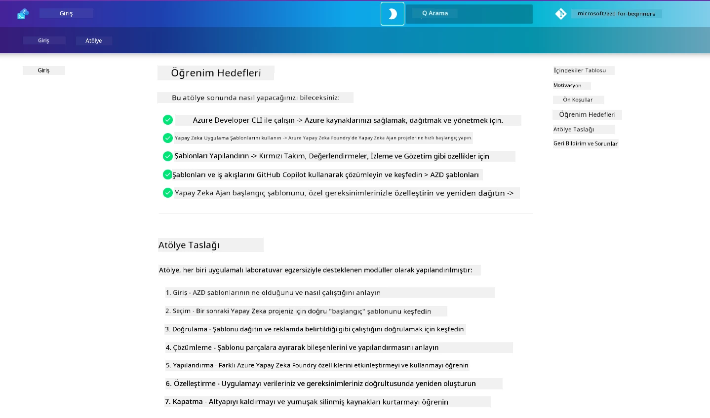

<div align="center">
  <div style="background: linear-gradient(135deg, #0078d4, #106ebe); border-radius: 10px; padding: 20px; margin: 20px 0; box-shadow: 0 4px 15px rgba(0, 120, 212, 0.3); border: 2px solid #005a9e;">
    <h2 style="color: white; margin: 0; font-size: 24px; text-shadow: 1px 1px 2px rgba(0,0,0,0.3);">
      🎯 AZD Yapay Zeka Geliştiricileri Atölyesi
    </h2>
    <p style="color: white; margin: 10px 0 0 0; font-size: 16px; text-shadow: 1px 1px 2px rgba(0,0,0,0.3);">
      <strong>Azure Developer CLI ile AI uygulamaları oluşturmak için uygulamalı bir atölye.</strong><br>
      AZD şablonlarını ve AI dağıtım iş akışlarını ustalaşmak için 7 modülü tamamlayın.
    </p>
    <div style="margin-top: 15px;">
      <span style="background: rgba(255,255,255,0.2); padding: 5px 10px; border-radius: 15px; color: white; font-size: 14px;">
        📅 Son Güncelleme: Mart 2026
      </span>
    </div>
  </div>
</div>

# AZD Yapay Zeka Geliştiricileri Atölyesi

Azure Developer CLI (AZD) öğrenmeye yönelik, AI uygulama dağıtımına odaklanan uygulamalı atölyeye hoş geldiniz. Bu atölye size AZD şablonlarını uygulamalı olarak 3 adımda anlamanızı sağlar:

1. **Keşif** - sizin için doğru şablonu bulun.
1. **Dağıtım** - dağıtın ve çalıştığını doğrulayın
1. **Özelleştirme** - değiştirin ve size ait hale getirin!

Bu atölye boyunca ayrıca uçtan uca geliştirme yolculuğunuzu hızlandırmaya yardımcı olacak temel geliştirici araçları ve iş akışları tanıtılacaktır.

<br/>

## Tarayıcı Tabanlı Kılavuz

Atölye dersleri Markdown halinde. Onları doğrudan GitHub'da gezinebilir - veya ekran görüntüsünde gösterildiği gibi tarayıcı tabanlı bir önizleme başlatabilirsiniz.



Bu seçeneği kullanmak için - depoyu profilinize fork edin ve GitHub Codespaces'i başlatın. VS Code terminali aktif olduğunda, şu komutu yazın:

This browser preview works in GitHub Codespaces, dev containers, or a local clone with Python and MkDocs installed.

```bash title="" linenums="0"
mkdocs serve > /dev/null 2>&1 &
```

Birkaç saniye içinde bir açılır ileti göreceksiniz. `Tarayıcıda Aç` seçeneğini seçin. Web tabanlı kılavuz şimdi yeni bir tarayıcı sekmesinde açılacaktır. Bu önizlemenin bazı faydaları:

1. **Yerleşik arama** - anahtar kelimeleri veya dersleri hızlıca bulun.
1. **Kopyala simgesi** - kod bloklarının üzerine gelince bu seçeneği görürsünüz
1. **Tema değiştirici** - koyu ve açık temalar arasında geçiş yapın
1. **Yardım alın** - katılmak için altbilgideki Discord simgesine tıklayın!

<br/>

## Atölye Genel Bakışı

**Süre:** 3-4 saat  
**Seviye:** Başlangıçtan Orta Düzeye  
**Önkoşullar:** Azure, yapay zeka kavramları, VS Code ve komut satırı araçlarına aşinalık.

Bu, yaparak öğrenme yöntemine dayalı bir uygulamalı atölyedir. Egzersizleri tamamladıktan sonra, Güvenlik ve Verimlilik en iyi uygulamalarına yönelik öğrenme yolculuğunuza devam etmek için AZD For Beginners müfredatını gözden geçirmenizi öneririz.

| Süre| Modül  | Amaç |
|:---|:---|:---|
| 15 dk | [Giriş](docs/instructions/0-Introduction.md) | Temeli oluşturun, hedefleri anlayın |
| 30 dk | [AI Şablonunu Seç](docs/instructions/1-Select-AI-Template.md) | Seçenekleri keşfedin ve başlangıç şablonunu seçin | 
| 30 dk | [AI Şablonunu Doğrula](docs/instructions/2-Validate-AI-Template.md) | Varsayılan çözümü Azure'a dağıtın |
| 30 dk | [AI Şablonunu Parçalarına Ayır](docs/instructions/3-Deconstruct-AI-Template.md) | Yapıyı ve yapılandırmayı keşfedin |
| 30 dk | [AI Şablonunu Yapılandır](docs/instructions/4-Configure-AI-Template.md) | Kullanılabilir özellikleri etkinleştirin ve deneyin |
| 30 dk | [AI Şablonunu Özelleştir](docs/instructions/5-Customize-AI-Template.md) | Şablonu ihtiyaçlarınıza göre uyarlayın |
| 30 dk | [Altyapıyı Kaldır](docs/instructions/6-Teardown-Infrastructure.md) | Kaynakları temizleyin ve serbest bırakın |
| 15 dk | [Kapanış ve Sonraki Adımlar](docs/instructions/7-Wrap-up.md) | Öğrenme kaynakları, Atölye meydan okuması |

<br/>

## Neler Öğreneceksiniz

AZD Şablonunu, Microsoft Foundry üzerinde uçtan uca geliştirme için çeşitli yetenekleri ve araçları keşfetmek üzere bir öğrenme oyun alanı olarak düşünün. Bu atölyenin sonunda, bu bağlamdaki çeşitli araçlar ve kavramlar hakkında sezgisel bir anlayışa sahip olmanız beklenir.

| Kavram  | Amaç |
|:---|:---|
| **Azure Developer CLI** | Araç komutlarını ve iş akışlarını anlayın|
| **AZD Templates**| Proje yapısını ve yapılandırmayı anlayın|
| **Azure AI Agent**| Microsoft Foundry projesi için sağlama ve dağıtma  |
| **Azure AI Search**| Ajanlarla bağlam mühendisliğini etkinleştirin |
| **Observability**| İzleme, takip ve değerlendirmeleri keşfedin |
| **Red Teaming**| Adversarial testleri ve hafifletmeleri keşfedin |

<br/>

## Atölye Yapısı

Atölye, resmi [Getting Started with AI Agents](https://github.com/Azure-Samples/get-started-with-ai-agents) başlangıç şablonunu temel alarak, sizin için şablon keşfinden dağıtıma, parçalarına ayırmaya ve özelleştirmeye kadar bir yolculuğa çıkarmak üzere yapılandırılmıştır.

### [Modül 1: AI Şablonunu Seç](docs/instructions/1-Select-AI-Template.md) (30 dk)

- AI Şablonları nedir?
- AI Şablonlarını nerede bulabilirim?
- AI Ajanları oluşturmayı nasıl başlatabilirim?
- **Laboratuvar**: Codespaces veya bir geliştirme konteynerinde hızlı başlangıç

### [Modül 2: AI Şablonunu Doğrula](docs/instructions/2-Validate-AI-Template.md) (30 dk)

- AI Şablonu Mimarisi nedir?
- AZD Geliştirme İş Akışı nedir?
- AZD geliştirmede nasıl yardım alabilirim?
- **Laboratuvar**: AI Ajanları şablonunu dağıtma ve doğrulama

### [Modül 3: AI Şablonunu Parçalarına Ayır](docs/instructions/3-Deconstruct-AI-Template.md) (30 dk)

- Ortamınızı `.azure/` içinde keşfedin 
- Kaynak kurulumunuzu `infra/` içinde keşfedin 
- AZD yapılandırmanızı `azure.yaml`s içinde keşfedin
- **Laboratuvar**: Ortam Değişkenlerini Değiştirin & Yeniden Dağıtın

### [Modül 4: AI Şablonunu Yapılandır](docs/instructions/4-Configure-AI-Template.md) (30 dk)
- Keşfet: Retrieval Augmented Generation
- Keşfet: Agent Evaluation & Red Teaming
- Keşfet: Tracing & Monitoring
- **Laboratuvar**: AI Ajanı ve Observability'yi Keşfet 

### [Modül 5: AI Şablonunu Özelleştir](docs/instructions/5-Customize-AI-Template.md) (30 dk)
- Tanımla: Senaryo Gereksinimleri ile PRD
- Yapılandır: AZD için Ortam Değişkenleri
- Uygula: Ek görevler için yaşam döngüsü kancaları
- **Laboratuvar**: Şablonu kendi senaryoma göre özelleştir

### [Modül 6: Altyapıyı Kaldır](docs/instructions/6-Teardown-Infrastructure.md) (30 dk)
- Özet: AZD Şablonları nedir?
- Özet: Neden Azure Developer CLI kullanılır?
- Sonraki Adımlar: Farklı bir şablonu deneyin!
- **Laboratuvar**: Altyapıyı kaldırma & temizleme

<br/>

## Atölye Meydan Okuması

Kendinize daha fazla meydan okumak mı istiyorsunuz? İşte bazı proje önerileri - veya fikirlerinizi bizimle paylaşın!!

| Proje | Açıklama |
|:---|:---|
|1. **Karmaşık Bir AI Şablonunu Parçalara Ayırın** | Belirttiğimiz iş akışını ve araçları kullanın; farklı bir AI çözüm şablonunu dağıtıp, doğrulayıp ve özelleştirmeye çalışın. _Ne öğrendiniz?_|
|2. **Senaryonuza Göre Özelleştirin**  | Farklı bir senaryo için PRD (Product Requirements Document) yazmayı deneyin. Sonra Agent Model içindeki şablon deposunda GitHub Copilot'u kullanın - ve size bir özelleştirme iş akışı oluşturmasını isteyin. _Ne öğrendiniz? Bu öneriler üzerinde nasıl geliştirme yapabilirsiniz?_|
| | |

## Geri bildiriminiz var mı?

1. Bu depoda bir issue açın - kolaylık olması için `Workshop` etiketi ekleyin.
1. Microsoft Foundry Discord'una katılın - akranlarınızla bağlantı kurun!


| | | 
|:---|:---|
| **📚 Kurs Ana Sayfası**| [AZD Yeni Başlayanlar](../README.md)|
| **📖 Belgeler** | [AI şablonlarıyla Başlarken](https://learn.microsoft.com/en-us/azure/ai-foundry/how-to/develop/ai-template-get-started)|
| **🛠️ AI Şablonları** | [Microsoft Foundry Şablonları](https://ai.azure.com/templates) |
|**🚀 Sonraki Adımlar** | [Atölyeye Başla](#atölye-genel-bakışı) |
| | |

<br/>

---

**Gezinme:** [Ana Ders](../README.md) | [Giriş](docs/instructions/0-Introduction.md) | [Modül 1: Şablonu Seç](docs/instructions/1-Select-AI-Template.md)

**AZD ile AI uygulamaları geliştirmeye başlamaya hazır mısınız?**

[Atölyeyi Başlat: Giriş →](docs/instructions/0-Introduction.md)

---

<!-- CO-OP TRANSLATOR DISCLAIMER START -->
**Feragatname**:
Bu belge, yapay zeka çeviri hizmeti [Co-op Translator](https://github.com/Azure/co-op-translator) kullanılarak çevrilmiştir. Doğruluk için çaba sarf etsek de, otomatik çevirilerin hata veya yanlışlık içerebileceğini lütfen unutmayın. Orijinal belge, kendi dilindeki sürümü yetkili kaynak olarak kabul edilmelidir. Kritik bilgiler için profesyonel insan çevirisi önerilir. Bu çevirinin kullanımı sonucu ortaya çıkan herhangi bir yanlış anlama veya yanlış yorumlamadan sorumlu değiliz.
<!-- CO-OP TRANSLATOR DISCLAIMER END -->