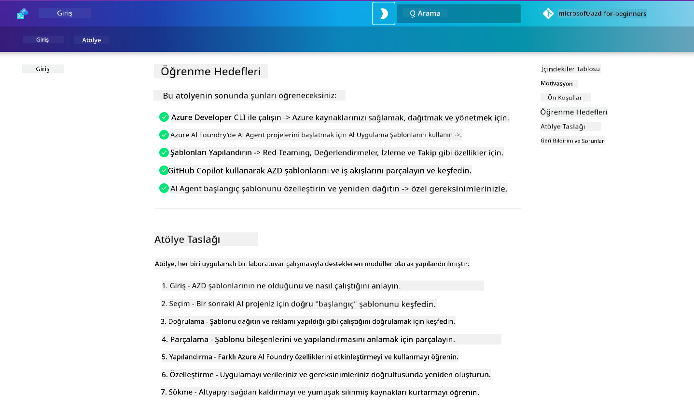

<!--
CO_OP_TRANSLATOR_METADATA:
{
  "original_hash": "9cc966416ab431c38b2ab863884b196c",
  "translation_date": "2025-09-24T14:51:49+00:00",
  "source_file": "workshop/README.md",
  "language_code": "tr"
}
-->
# AZD for AI Geliştiricileri Atölyesi

Azure Developer CLI (AZD) ile AI uygulama dağıtımına odaklanan uygulamalı atölyeye hoş geldiniz. Bu atölye, AZD şablonlarını 3 adımda öğrenmenize yardımcı olur:

1. **Keşif** - size uygun olan şablonu bulun.
1. **Dağıtım** - dağıtın ve çalıştığını doğrulayın.
1. **Özelleştirme** - değiştirin ve kendi ihtiyaçlarınıza göre uyarlayın!

Atölye boyunca, uçtan uca geliştirme sürecinizi kolaylaştıracak temel geliştirici araçları ve iş akışlarıyla da tanışacaksınız.

<br/>

## Tarayıcı Tabanlı Kılavuz

Atölye dersleri Markdown formatında hazırlanmıştır. Derslere doğrudan GitHub üzerinden erişebilir veya aşağıdaki ekran görüntüsünde gösterildiği gibi tarayıcı tabanlı bir önizleme başlatabilirsiniz.



Bu seçeneği kullanmak için, depoyu profilinize çatallayın ve GitHub Codespaces'i başlatın. VS Code terminali aktif olduğunda şu komutu yazın:

```bash title="" linenums="0"
mkdocs serve > /dev/null 2>&1 &
```

Birkaç saniye içinde bir açılır pencere göreceksiniz. `Tarayıcıda aç` seçeneğini seçin. Web tabanlı kılavuz yeni bir tarayıcı sekmesinde açılacaktır. Bu önizlemenin bazı avantajları:

1. **Yerleşik arama** - anahtar kelimeleri veya dersleri hızlıca bulun.
1. **Kopyalama simgesi** - kod bloklarının üzerine geldiğinizde bu seçeneği görün.
1. **Tema geçişi** - karanlık ve açık temalar arasında geçiş yapın.
1. **Yardım alın** - alt kısımdaki Discord simgesine tıklayarak katılın!

<br/>

## Atölye Genel Bakış

**Süre:** 3-4 saat  
**Seviye:** Başlangıçtan Orta seviyeye  
**Ön Koşullar:** Azure, AI kavramları, VS Code ve komut satırı araçlarına aşinalık.

Bu uygulamalı bir atölyedir; öğrenmek için yaparak ilerleyeceksiniz. Egzersizleri tamamladıktan sonra, Güvenlik ve Verimlilik en iyi uygulamalarını öğrenmek için AZD For Beginners müfredatını gözden geçirmenizi öneririz.

| Süre | Modül  | Amaç |
|:---|:---|:---|
| 15 dk | [Giriş](docs/instructions/0-Introduction.md) | Hedefleri anlayın, başlangıç yapın |
| 30 dk | [AI Şablonu Seçimi](docs/instructions/1-Select-AI-Template.md) | Seçenekleri keşfedin ve başlangıç yapın | 
| 30 dk | [AI Şablonunu Doğrulama](docs/instructions/2-Validate-AI-Template.md) | Varsayılan çözümü Azure'a dağıtın |
| 30 dk | [AI Şablonunu Parçalama](docs/instructions/3-Deconstruct-AI-Template.md) | Yapıyı ve konfigürasyonu keşfedin |
| 30 dk | [AI Şablonunu Yapılandırma](docs/instructions/4-Configure-AI-Template.md) | Mevcut özellikleri etkinleştirin ve deneyin |
| 30 dk | [AI Şablonunu Özelleştirme](docs/instructions/5-Customize-AI-Template.md) | Şablonu ihtiyaçlarınıza göre uyarlayın |
| 30 dk | [Altyapıyı Kaldırma](docs/instructions/6-Teardown-Infrastructure.md) | Temizlik yapın ve kaynakları serbest bırakın |
| 15 dk | [Kapanış ve Sonraki Adımlar](docs/instructions/7-Wrap-up.md) | Öğrenme kaynakları, Atölye meydan okuması |

<br/>

## Neler Öğreneceksiniz

AZD Şablonunu, Azure AI Foundry üzerinde uçtan uca geliştirme için çeşitli yetenekleri ve araçları keşfetmek üzere bir öğrenme alanı olarak düşünün. Atölye sonunda, bu bağlamdaki çeşitli araçlar ve kavramlar hakkında sezgisel bir anlayışa sahip olmalısınız.

| Kavram  | Amaç |
|:---|:---|
| **Azure Developer CLI** | Araç komutlarını ve iş akışlarını anlayın |
| **AZD Şablonları**| Proje yapısını ve konfigürasyonu anlayın |
| **Azure AI Agent**| Azure AI Foundry projesini oluşturun ve dağıtın |
| **Azure AI Search**| Agent'larla bağlam mühendisliğini etkinleştirin |
| **Gözlemlenebilirlik**| İzleme, değerlendirme ve takip yöntemlerini keşfedin |
| **Red Teaming**| Saldırgan testleri ve önlemleri keşfedin |

<br/>

## Atölye Yapısı

Atölye, resmi [Getting Started with AI Agents](https://github.com/Azure-Samples/get-started-with-ai-agents) başlangıç şablonunu temel alarak, şablon keşfinden dağıtıma, parçalamaya ve özelleştirmeye kadar bir yolculuğa çıkmanızı sağlar.

### [Modül 1: AI Şablonu Seçimi](docs/instructions/1-Select-AI-Template.md) (30 dk)

- AI Şablonları nedir?
- AI Şablonlarını nerede bulabilirim?
- AI Agent'ları nasıl oluşturmaya başlayabilirim?
- **Lab**: GitHub Codespaces ile hızlı başlangıç

### [Modül 2: AI Şablonunu Doğrulama](docs/instructions/2-Validate-AI-Template.md) (30 dk)

- AI Şablon Mimarisi nedir?
- AZD Geliştirme İş Akışı nedir?
- AZD Geliştirme konusunda nasıl yardım alabilirim?
- **Lab**: AI Agent şablonunu dağıtın ve doğrulayın

### [Modül 3: AI Şablonunu Parçalama](docs/instructions/3-Deconstruct-AI-Template.md) (30 dk)

- `.azure/` ortamınızı keşfedin 
- `infra/` kaynak kurulumunuzu keşfedin 
- `azure.yaml` dosyalarındaki AZD konfigürasyonunuzu keşfedin
- **Lab**: Ortam Değişkenlerini Değiştirin ve Yeniden Dağıtın

### [Modül 4: AI Şablonunu Yapılandırma](docs/instructions/4-Configure-AI-Template.md) (30 dk)
- Keşfedin: Retrieval Augmented Generation
- Keşfedin: Agent Değerlendirme ve Red Teaming
- Keşfedin: İzleme ve Takip
- **Lab**: AI Agent + Gözlemlenebilirlik keşfi 

### [Modül 5: AI Şablonunu Özelleştirme](docs/instructions/5-Customize-AI-Template.md) (30 dk)
- Tanımlayın: Senaryo Gereksinimleri ile PRD
- Yapılandırın: AZD için Ortam Değişkenleri
- Uygulayın: Ek görevler için Yaşam Döngüsü Kancaları
- **Lab**: Şablonu kendi senaryoma göre özelleştirme

### [Modül 6: Altyapıyı Kaldırma](docs/instructions/6-Teardown-Infrastructure.md) (30 dk)
- Özet: AZD Şablonları nedir?
- Özet: Neden Azure Developer CLI kullanmalıyız?
- Sonraki Adımlar: Farklı bir şablonu deneyin!
- **Lab**: Altyapıyı kaldırın ve temizleyin

<br/>

## Atölye Meydan Okuması

Kendinizi daha fazla zorlamak ister misiniz? İşte bazı proje önerileri - veya kendi fikirlerinizi bizimle paylaşabilirsiniz!

| Proje | Açıklama |
|:---|:---|
|1. **Karmaşık Bir AI Şablonunu Parçalama** | Belirttiğimiz iş akışı ve araçları kullanarak farklı bir AI çözüm şablonunu dağıtın, doğrulayın ve özelleştirin. _Ne öğrendiniz?_|
|2. **Kendi Senaryonuzla Özelleştirme**  | Farklı bir senaryo için bir PRD (Ürün Gereksinimleri Belgesi) yazmayı deneyin. Ardından GitHub Copilot'u şablon deposunda Agent Model modunda kullanarak özelleştirme iş akışı oluşturmasını isteyin. _Ne öğrendiniz? Bu önerileri nasıl geliştirebilirsiniz?_|
| | |

## Geri Bildiriminiz Var mı?

1. Bu depoda bir sorun gönderin - `Workshop` etiketi ekleyerek kolaylık sağlayın.
1. Azure AI Foundry Discord'a katılın - akranlarınızla bağlantı kurun!


| | | 
|:---|:---|
| **📚 Kurs Ana Sayfası**| [AZD For Beginners](../README.md)|
| **📖 Dokümantasyon** | [AI şablonlarıyla başlama](https://learn.microsoft.com/en-us/azure/ai-foundry/how-to/develop/ai-template-get-started)|
| **🛠️AI Şablonları** | [Azure AI Foundry Şablonları](https://ai.azure.com/templates) |
|**🚀 Sonraki Adımlar** | [Meydan Okumayı Kabul Et](../../../workshop) |
| | |

<br/>

---

**Önceki:** [AI Sorun Giderme Kılavuzu](../docs/troubleshooting/ai-troubleshooting.md) | **Sonraki:** [Lab 1: AZD Temelleri ile Başlayın](../../../workshop/lab-1-azd-basics)

**AZD ile AI uygulamaları oluşturmaya hazır mısınız?**

[Lab 1: AZD Temellerine Başlayın →](./lab-1-azd-basics/README.md)

---

