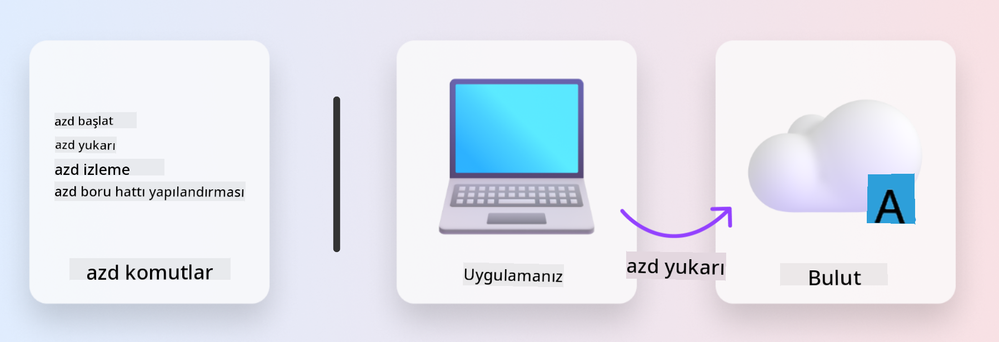
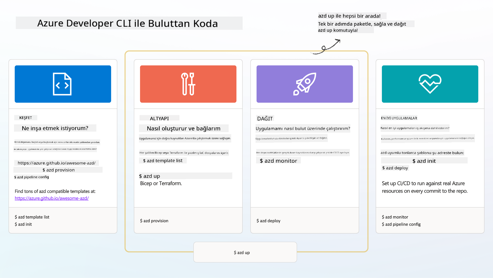

<!--
CO_OP_TRANSLATOR_METADATA:
{
  "original_hash": "06d6207eff634aefcaa41739490a5324",
  "translation_date": "2025-09-24T14:55:49+00:00",
  "source_file": "workshop/docs/instructions/1-Select-AI-Template.md",
  "language_code": "tr"
}
-->
# 1. Bir Şablon Seçin

!!! tip "BU MODÜLÜN SONUNDA ŞUNLARI YAPABİLECEKSİNİZ"

    - [ ] AZD şablonlarının ne olduğunu açıklayın
    - [ ] AI için AZD şablonlarını keşfedin ve kullanın
    - [ ] AI Agents şablonuyla başlayın
    - [ ] **Lab 1:** GitHub Codespaces ile AZD Hızlı Başlangıç

---

## 1. Bir İnşaatçı Analojisi

Sıfırdan modern, kurumsal düzeyde bir AI uygulaması oluşturmak göz korkutucu olabilir. Bu, yeni evinizi kendi başınıza, tuğla tuğla inşa etmeye benzer. Evet, yapılabilir! Ancak istenen sonuca ulaşmanın en etkili yolu değildir!

Bunun yerine, genellikle mevcut bir _tasarım planıyla_ başlar ve kişisel gereksinimlerimize göre özelleştirmek için bir mimarla çalışırız. Akıllı uygulamalar oluştururken de tam olarak bu yaklaşımı benimsemeliyiz. Öncelikle, sorun alanınıza uygun bir tasarım mimarisi bulun. Ardından, çözümü belirli senaryonuza göre özelleştirmek ve geliştirmek için bir çözüm mimarıyla çalışın.

Peki bu tasarım planlarını nerede bulabiliriz? Ve bu planları kendi başımıza özelleştirmeyi ve dağıtmayı öğretecek bir mimarı nasıl bulabiliriz? Bu atölyede, bu soruları yanıtlayarak sizi üç teknolojiyle tanıştırıyoruz:

1. [Azure Developer CLI](https://aka.ms/azd) - yerel geliştirmeden (inşa etme) bulut dağıtımına (gönderme) geçiş sürecini hızlandıran açık kaynaklı bir araç.
1. [Azure AI Foundry Templates](https://ai.azure.com/templates) - bir AI çözüm mimarisini dağıtmak için örnek kod, altyapı ve yapılandırma dosyalarını içeren standartlaştırılmış açık kaynaklı depolar.
1. [GitHub Copilot Agent Mode](https://code.visualstudio.com/docs/copilot/chat/chat-agent-mode) - Azure bilgisine dayalı bir kodlama ajanı, kod tabanında gezinmemize ve değişiklik yapmamıza doğal dil kullanarak rehberlik edebilir.

Bu araçlarla artık doğru şablonu _keşfedebilir_, çalıştığını doğrulamak için _dağıtabilir_ ve belirli senaryolarımıza uygun hale getirmek için _özelleştirebiliriz_. Haydi, bu araçların nasıl çalıştığını öğrenelim.

---

## 2. Azure Developer CLI

[Azure Developer CLI](https://learn.microsoft.com/en-us/azure/developer/azure-developer-cli/) (veya `azd`), IDE (geliştirme) ve CI/CD (devops) ortamlarında tutarlı bir şekilde çalışan geliştirici dostu komutlarla koddan buluta geçiş sürecinizi hızlandırabilecek açık kaynaklı bir komut satırı aracıdır.

`azd` ile dağıtım süreciniz şu kadar basit olabilir:

- `azd init` - Mevcut bir AZD şablonundan yeni bir AI projesi başlatır.
- `azd up` - Altyapıyı sağlar ve uygulamanızı tek adımda dağıtır.
- `azd monitor` - Dağıtılan uygulamanız için gerçek zamanlı izleme ve tanılama sağlar.
- `azd pipeline config` - Azure'a otomatik dağıtım için CI/CD boru hatlarını yapılandırır.

**🎯 | EGZERSİZ**: <br/> GitHub Codespaces ortamınızda `azd` komut satırı aracını keşfedin. Aracın neler yapabileceğini görmek için şu komutu yazarak başlayın:

```bash title="" linenums="0"
azd help
```



---

## 3. AZD Şablonu

`azd` bunu gerçekleştirebilmek için sağlanacak altyapıyı, uygulanacak yapılandırma ayarlarını ve dağıtılacak uygulamayı bilmelidir. İşte burada [AZD şablonları](https://learn.microsoft.com/en-us/azure/developer/azure-developer-cli/azd-templates?tabs=csharp) devreye girer.

AZD şablonları, çözüm mimarisini dağıtmak için gerekli altyapı ve yapılandırma dosyalarıyla örnek kodu birleştiren açık kaynaklı depolardır. 
_Bir Kod Olarak Altyapı_ (IaC) yaklaşımı kullanarak, şablon kaynak tanımları ve yapılandırma ayarlarının (uygulama kaynak kodu gibi) sürüm kontrolüne tabi olmasını sağlarlar - bu da o projeyi kullanan kullanıcılar arasında yeniden kullanılabilir ve tutarlı iş akışları oluşturur.

_Kendi_ senaryonuz için bir AZD şablonu oluştururken veya yeniden kullanırken şu soruları göz önünde bulundurun:

1. Ne inşa ediyorsunuz? → Bu senaryo için başlangıç kodu içeren bir şablon var mı?
1. Çözümünüz nasıl mimarileştirildi? → Gerekli kaynaklara sahip bir şablon var mı?
1. Çözümünüz nasıl dağıtılıyor? → `azd deploy` ile ön/son işleme kancalarını düşünün!
1. Daha fazla nasıl optimize edebilirsiniz? → Dahili izleme ve otomasyon boru hatlarını düşünün!

**🎯 | EGZERSİZ**: <br/> 
[Awesome AZD](https://azure.github.io/awesome-azd/) galerisini ziyaret edin ve mevcut 250+ şablonu keşfetmek için filtreleri kullanın. _Kendi_ senaryo gereksinimlerinize uygun bir şablon bulup bulamayacağınıza bakın.



---

## 4. AI Uygulama Şablonları

---

