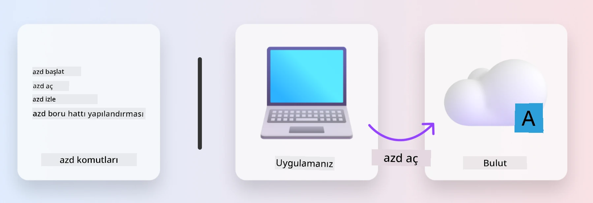
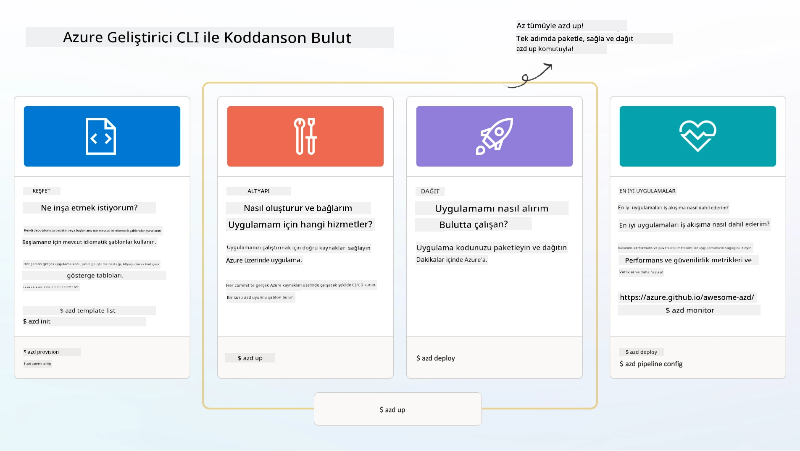

# 1. Bir Şablon Seçin

!!! tip "MODÜLÜN SONUNDA ŞUNLARI YAPABİLİRSİNİZ"

    - [ ] AZD şablonlarının ne olduğunu açıklayın
    - [ ] AI için AZD şablonlarını keşfedin ve kullanın
    - [ ] AI Agents şablonuyla başlayın
    - [ ] **Lab 1:** Codespaces veya bir geliştirme konteynerinde AZD Hızlı Başlangıç

---

## 1. Bir İnşaatçı Benzetmesi

Modern, kurumsal düzeyde bir AI uygulamasını _sıfırdan_ oluşturmak göz korkutucu olabilir. Bu, yeni evinizi tek başınıza tuğla tuğla inşa etmeye benziyor. Evet, yapılabilir! Ancak arzu edilen sonuca ulaşmanın en etkili yolu değildir!

Bunun yerine, genellikle mevcut bir _tasarım planı_ ile başlarız ve kişisel gereksinimlerimize göre özelleştirmek için bir mimarla çalışırız. Zeki uygulamalar oluştururken de izlenecek yol tam olarak budur. Önce problem alanınıza uyan iyi bir tasarım mimarisi bulun. Ardından çözümü belirli senaryonuza göre özelleştirmek ve geliştirmek için bir çözüm mimarıyla çalışın.

Peki bu tasarım planlarını nerede bulabiliriz? Ve bu planları nasıl özelleştirip kendi başımıza dağıtmayı öğretecek bir mimarı nasıl buluruz? Bu atölyede, sizi üç teknolojiyle tanıştırarak bu soruları yanıtlıyoruz:

1. [Azure Developer CLI](https://aka.ms/azd) - yerel geliştirmeden (derleme) buluta dağıtıma (gönderim) kadar geliştiricinin yolunu hızlandıran açık kaynaklı bir araç.
1. [Microsoft Foundry Templates](https://ai.azure.com/templates) - bir AI çözüm mimarisini dağıtmak için örnek kod, altyapı ve yapılandırma dosyalarını içeren standartlaştırılmış açık kaynak depoları.
1. [GitHub Copilot Agent Mode](https://code.visualstudio.com/docs/copilot/chat/chat-agent-mode) - kod tabanında gezinmemize ve değişiklik yapmamıza doğal dil kullanarak rehberlik edebilen, Azure bilgisine dayanan bir kodlama ajanı.

Elinizde bu araçlarla artık doğru şablonu _keşfedebilir_, çalıştığını doğrulamak için _dağıtabilir_ ve belirli senaryonuza uyacak şekilde _özelleştirebilirsiniz_. Hadi detaylara girelim ve bunların nasıl çalıştığını öğrenelim.

---

## 2. Azure Developer CLI

The [Azure Developer CLI](https://learn.microsoft.com/en-us/azure/developer/azure-developer-cli/) (or `azd`) is an open-source commandline tool that can speed up your code-to-cloud journey with a set of developer-friendly commands that work consistently across your IDE (development) and CI/CD (devops) environments.

With `azd`, your deployment journey can be as simple as:

- `azd init` - Initializes a new AI project from an existing AZD template.
- `azd up` - Provisions infrastructure and deploy your application in one step.
- `azd monitor` - Get real-time monitoring and diagnostics for your deployed application.
- `azd pipeline config` - Setup CI/CD pipelines to automate deployment to Azure.

**🎯 | EGZERSİZ**: <br/> Bulunduğunuz atölye ortamında `azd` komut satırı aracını keşfedin. Bu ortam GitHub Codespaces, bir geliştirme konteyneri veya ön koşulların yüklü olduğu yerel bir kopya olabilir. Araçta neler yapabildiğini görmek için şu komutu yazarak başlayın:

```bash title="" linenums="0"
azd help
```



---

## 3. AZD Şablonu

For `azd` to achieve this, it needs to know the infrastructure to provision, the configuration settings to enforce, and the application to deploy. This is where [AZD templates](https://learn.microsoft.com/en-us/azure/developer/azure-developer-cli/azd-templates?tabs=csharp) come in. 

AZD şablonları, örnek kodu dağıtım için gerekli altyapı ve yapılandırma dosyalarıyla birleştiren açık kaynaklı depolardır.
_Birim olarak Kod Olarak Altyapı_ yaklaşımı kullanılarak, şablon kaynak tanımları ve yapılandırma ayarları sürüm kontrolünde (uygulama kaynak kodu gibi) tutulabilir - bu da proje kullanıcıları arasında yeniden kullanılabilir ve tutarlı iş akışları oluşturur.

_Kendi_ senaryonuz için bir AZD şablonu oluştururken veya yeniden kullanırken şu soruları düşünün:

1. Ne inşa ediyorsunuz? → Bu senaryo için başlangıç kodu olan bir şablon var mı?
1. Çözümünüz nasıl mimarize edildi? → Gerekli kaynaklara sahip bir şablon var mı?
1. Çözümünüz nasıl dağıtılıyor? → Ön/son işleme kancalarıyla `azd deploy`'u düşünün!
1. Bunu daha nasıl optimize edebilirsiniz? → Yerleşik izleme ve otomasyon boru hatlarını düşünün!

**🎯 | EGZERSİZ**: <br/> 
[Awesome AZD](https://azure.github.io/awesome-azd/) galerisini ziyaret edin ve şu anda kullanılabilir olan 250+'den fazla şablonu keşfetmek için filtreleri kullanın. Kendi senaryo gereksinimlerinize uygun bir şablon bulup bulamayacağınıza bakın.



---

## 4. Yapay Zeka Uygulama Şablonları

Yapay zekâ destekli uygulamalar için Microsoft, **Microsoft Foundry** ve **Foundry Agents** içeren özel şablonlar sağlar. Bu şablonlar, zeki, üretime hazır uygulamalar oluşturma yolunuzu hızlandırır.

### Microsoft Foundry & Foundry Agents Şablonları

Aşağıdan bir şablon seçip dağıtın. Her şablon [Awesome AZD](https://azure.github.io/awesome-azd/) üzerinde mevcuttur ve tek bir komutla başlatılabilir.

| Template | Description | Deploy Command |
|----------|-------------|----------------|
| **[AI Chat with RAG](https://azure.github.io/awesome-azd/?tags=ai&tags=rag)** | Retrieval Augmented Generation kullanarak Microsoft Foundry ile sohbet uygulaması | `azd init -t azure-samples/azure-search-openai-demo` |
| **[Foundry Agent Service Starter](https://azure.github.io/awesome-azd/?tags=ai&tags=agents)** | Otonom görev yürütme için Foundry Agents ile AI ajanları oluşturma | `azd init -t azure-samples/foundry-agent-service-starter` |
| **[Multi-Agent Orchestration](https://azure.github.io/awesome-azd/?tags=ai&tags=agents)** | Karmaşık iş akışları için birden çok Foundry Agent'ı koordine etme | `azd init -t azure-samples/multi-agent-orchestration` |
| **[AI Document Intelligence](https://azure.github.io/awesome-azd/?tags=ai&tags=document)** | Microsoft Foundry modelleriyle belgeleri çıkarma ve analiz etme | `azd init -t azure-samples/ai-document-processing` |
| **[Conversational AI Bot](https://azure.github.io/awesome-azd/?tags=ai&tags=bot)** | Microsoft Foundry entegrasyonu ile zeki sohbet botları oluşturma | `azd init -t azure-samples/ai-chat-protocol` |
| **[AI Image Generation](https://azure.github.io/awesome-azd/?tags=ai&tags=dalle)** | Microsoft Foundry aracılığıyla DALL-E kullanarak görüntü oluşturma | `azd init -t azure-samples/ai-image-generation` |
| **[Semantic Kernel Agent](https://azure.github.io/awesome-azd/?tags=ai&tags=semantic-kernel)** | Foundry Agents ile Semantic Kernel kullanan AI ajanları | `azd init -t azure-samples/semantic-kernel-agent` |
| **[AutoGen Multi-Agent](https://azure.github.io/awesome-azd/?tags=ai&tags=autogen)** | AutoGen çerçevesi kullanılarak çoklu ajan sistemleri | `azd init -t azure-samples/autogen-multi-agent` |

### Hızlı Başlangıç

1. **Şablonlara göz atın**: Ziyaret edin [https://azure.github.io/awesome-azd/](https://azure.github.io/awesome-azd/) ve `AI`, `Agents` veya `Microsoft Foundry` ile filtreleyin
2. **Şablonunuzu seçin**: Kullanım durumunuza uygun olanı seçin
3. **Başlatın**: Seçtiğiniz şablon için `azd init` komutunu çalıştırın
4. **Dağıtın**: Provision ve dağıtım için `azd up` çalıştırın

**🎯 | EGZERSİZ**: <br/>
Senaryonuza göre yukarıdaki şablonlardan birini seçin:

- **Bir sohbet botu mu inşa ediyorsunuz?** → **AI Chat with RAG** veya **Conversational AI Bot** ile başlayın
- **Otonom ajanlara mı ihtiyacınız var?** → **Foundry Agent Service Starter** veya **Multi-Agent Orchestration**'ı deneyin
- **Belgeleri mi işliyorsunuz?** → **AI Document Intelligence**'ı kullanın
- **AI kodlama yardımı mı istiyorsunuz?** → **Semantic Kernel Agent** veya **AutoGen Multi-Agent**'ı keşfedin

```bash title="Example: Deploy the AI Chat with RAG template" linenums="0"
azd init -t azure-samples/azure-search-openai-demo
azd up
```

!!! info "Daha Fazla Şablonu Keşfedin"
    The [Awesome AZD Gallery](https://azure.github.io/awesome-azd/) contains 250+ templates. Use the filters to find templates matching your specific requirements for language, framework, and Azure services.

---

<!-- CO-OP TRANSLATOR DISCLAIMER START -->
**Feragatname**:
Bu belge, AI çeviri hizmeti [Co-op Translator](https://github.com/Azure/co-op-translator) kullanılarak çevrilmiştir. Doğruluğa özen göstersek de, otomatik çevirilerin hata veya yanlışlıklara sahip olabileceğini lütfen unutmayın. Belgenin orijinal dilindeki sürümü yetkili kaynak olarak kabul edilmelidir. Kritik bilgiler için profesyonel insan çevirisi önerilir. Bu çevirinin kullanımı sonucunda ortaya çıkabilecek herhangi bir yanlış anlama veya yanlış yorumdan sorumlu değiliz.
<!-- CO-OP TRANSLATOR DISCLAIMER END -->