# 2. Bir Şablonu Doğrulama

> `azd 1.23.12` ile Mart 2026'da doğrulandı.

!!! tip "BU MODÜLÜN SONUNDA YAPABİLECEKSİNİZ"

    - [ ] AI Çözüm Mimarisini Analiz Etmek
    - [ ] AZD Dağıtım İş Akışını Anlamak
    - [ ] AZD kullanımı konusunda yardım almak için GitHub Copilot'u kullanmak
    - [ ] **Lab 2:** AI Agents şablonunu dağıtmak ve doğrulamak

---


## 1. Giriş

[Azure Developer CLI](https://learn.microsoft.com/en-us/azure/developer/azure-developer-cli/) veya `azd`, Azure'a uygulama oluşturma ve dağıtma sırasında geliştirici iş akışını kolaylaştıran açık kaynaklı bir komut satırı aracıdır.

[AZD Şablonları](https://learn.microsoft.com/azure/developer/azure-developer-cli/azd-templates), örnek uygulama kodu, altyapı-yazılımı varlıkları ve uyumlu bir çözüm mimarisi için `azd` yapılandırma dosyalarını içeren standartlaştırılmış depolardır. Altyapıyı sağlamak, bir `azd provision` komutu kadar basit hale gelir - `azd up` kullanmak ise altyapıyı sağlarken uygulamanızı tek seferde dağıtmanızı sağlar!

Bunun bir sonucu olarak, uygulama geliştirme sürecinizi başlatmak, uygulama ve altyapı ihtiyaçlarınıza en yakın gelen uygun _AZD Başlangıç şablonunu_ bulmak ve ardından senaryonuza uyacak şekilde depoyu özelleştirmek kadar basit olabilir.

Başlamadan önce, Azure Developer CLI'nin yüklü olduğundan emin olalım.

1. VS Code terminalini açın ve şu komutu yazın:

      ```bash title="" linenums="0"
      azd version
      ```

1. Şuna benzer bir şey görmelisiniz!

      ```bash title="" linenums="0"
      azd version 1.23.12 (commit <current-build>)
      ```

**Artık azd ile bir şablon seçmeye ve dağıtmaya hazırsınız**

---

## 2. Şablon Seçimi

Microsoft Foundry platformu, _çok ajanlı iş akışı otomasyonu_ ve _çok modlu içerik işleme_ gibi popüler çözüm senaryolarını kapsayan [önerilen AZD şablonları seti](https://learn.microsoft.com/en-us/azure/ai-foundry/how-to/develop/ai-template-get-started) ile birlikte gelir. Bu şablonları Microsoft Foundry portalını ziyaret ederek de keşfedebilirsiniz.

1. [https://ai.azure.com/templates](https://ai.azure.com/templates) adresini ziyaret edin
1. İstendiğinde Microsoft Foundry portalına giriş yapın - şuna benzer bir şey görürsünüz.

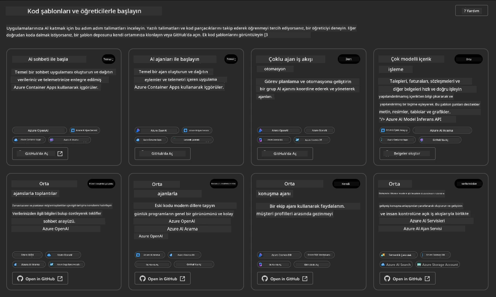


**Basic** seçenekleri başlangıç şablonlarınızdır:

1. [ ] [Get Started with AI Chat](https://github.com/Azure-Samples/get-started-with-ai-chat) — temel bir sohbet uygulamasını _verilerinizle birlikte_ Azure Container Apps'e dağıtır. Temel bir AI sohbet botu senaryosunu keşfetmek için bunu kullanın.
1. [X] [Get Started with AI Agents](https://github.com/Azure-Samples/get-started-with-ai-agents) — Foundry Agents ile standart bir AI Ajanı dağıtır. Araçlar ve modeller içeren ajan tabanlı AI çözümlerini öğrenmek için bunu kullanın.

İkinci bağlantıyı yeni bir tarayıcı sekmesinde açın (veya ilgili kart için `Open in GitHub`'a tıklayın). Bu AZD Şablonunun deposunu görmelisiniz. README'yi keşfetmek için bir dakika ayırın. Uygulama mimarisi şöyle görünüyor:

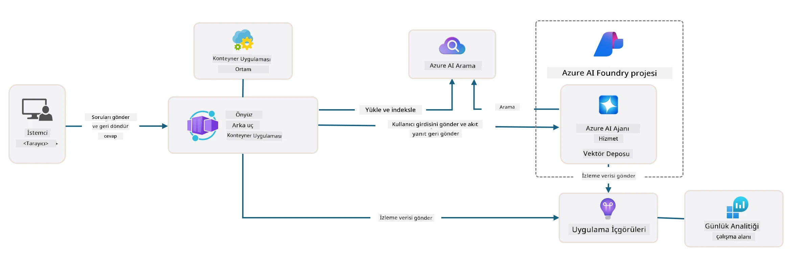

---

## 3. Şablon Etkinleştirme

Bu şablonu dağıtmaya çalışalım ve geçerli olduğundan emin olalım. [Getting Started](https://github.com/Azure-Samples/get-started-with-ai-agents?tab=readme-ov-file#getting-started) bölümündeki yönergeleri takip edeceğiz.

1. Şablon deposu için bir çalışma ortamı seçin:

      - **GitHub Codespaces**: [bu bağlantıya](https://github.com/codespaces/new/Azure-Samples/get-started-with-ai-agents) tıklayın ve `Create codespace` onaylayın
      - **Yerel klon veya dev container**: `Azure-Samples/get-started-with-ai-agents` deposunu klonlayın ve VS Code'da açın

1. VS Code terminali hazır olana kadar bekleyin, sonra şu komutu yazın:

   ```bash title="" linenums="0"
   azd up
   ```

Bu komutun tetikleyeceği iş akışı adımlarını tamamlayın:

1. Azure'a oturum açmanız istenecek - kimlik doğrulama talimatlarını izleyin
1. Kendiniz için benzersiz bir ortam adı girin - ör. ben `nitya-mshack-azd` kullandım
1. Bu, `.azure/` klasörü oluşturacaktır - ortam adıyla bir alt klasör göreceksiniz
1. Bir abonelik adı seçmeniz istenecek - varsayılanı seçin
1. Bir konum girmeniz istenecek - `East US 2` kullanın

Şimdi, sağlama (provisioning) tamamlanana kadar bekleyin. **Bu 10-15 dakika sürer**

1. Tamamlandığında, konsolunuz şu gibi bir BAŞARI mesajı gösterecektir:
      ```bash title="" linenums="0"
      SUCCESS: Your up workflow to provision and deploy to Azure completed in 10 minutes 17 seconds.
      ```
1. Azure Portal'ınız şimdi o ortam adıyla sağlanmış bir kaynak grubuna sahip olacak:

      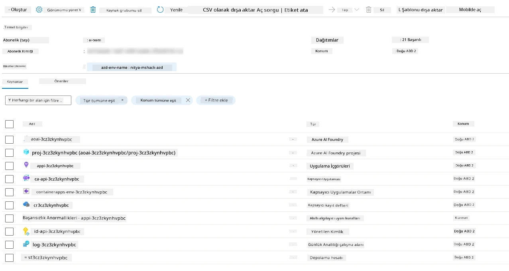

1. **Artık dağıtılan altyapıyı ve uygulamayı doğrulamaya hazırsınız**.

---

## 4. Şablon Doğrulama

1. Azure Portal [Resource Groups](https://portal.azure.com/#browse/resourcegroups) sayfasını ziyaret edin - istendiğinde oturum açın
1. Ortam adınız için RG'ye tıklayın - yukarıdaki sayfayı görmelisiniz

      - Azure Container Apps kaynağına tıklayın
      - _Essentials_ bölümündeki (üst sağ) Application Url'e tıklayın

1. Şuna benzer barındırılan bir uygulama ön yüzü UI'sı görmelisiniz:

   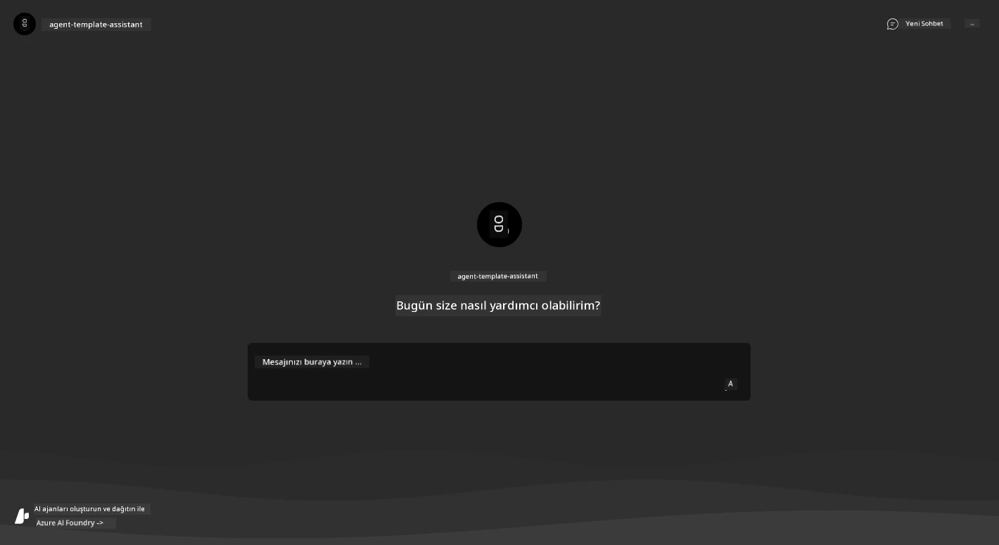

1. Birkaç [örnek soru](https://github.com/Azure-Samples/get-started-with-ai-agents/blob/main/docs/sample_questions.md) sormayı deneyin

      1. Sorun: ```What is the capital of France?``` 
      1. Sorun: ```What's the best tent under $200 for two people, and what features does it include?```

1. Aşağıda gösterilene benzer cevaplar almalısınız. _Peki bu nasıl çalışıyor?_ 

      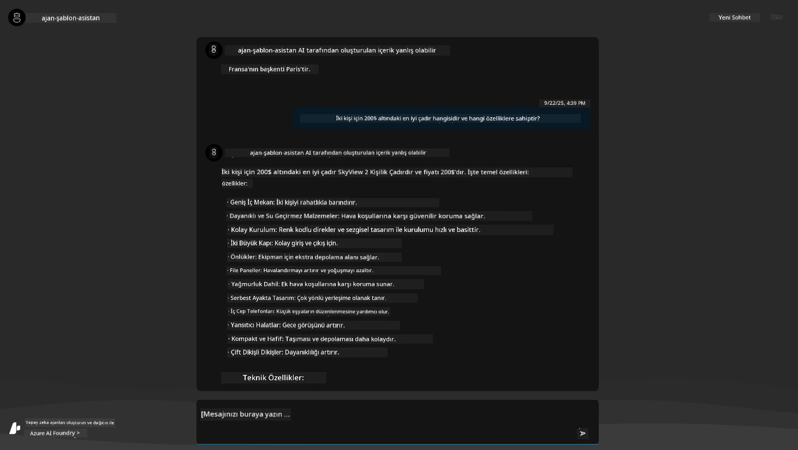

---

## 5. Ajan Doğrulama

Azure Container App, bu şablon için Microsoft Foundry projesinde sağlanan AI Ajana bağlanan bir uç nokta dağıtır. Bunun ne anlama geldiğine bir göz atalım.

1. Azure Portal kaynak grubunuzun _Overview_ sayfasına geri dönün

1. Listede `Microsoft Foundry` kaynağına tıklayın

1. Şunu görmelisiniz. `Go to Microsoft Foundry Portal` düğmesine tıklayın. 
   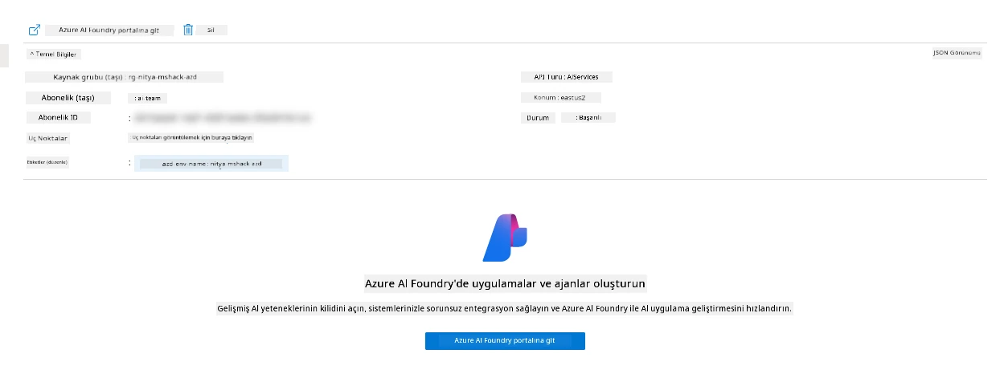

1. AI uygulamanız için Foundry Proje sayfasını görmelisiniz
   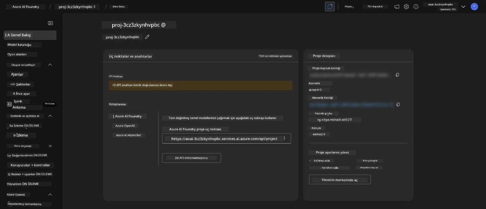

1. `Agents`'a tıklayın - projenizde sağlanmış varsayılan Ajanı görürsünüz
   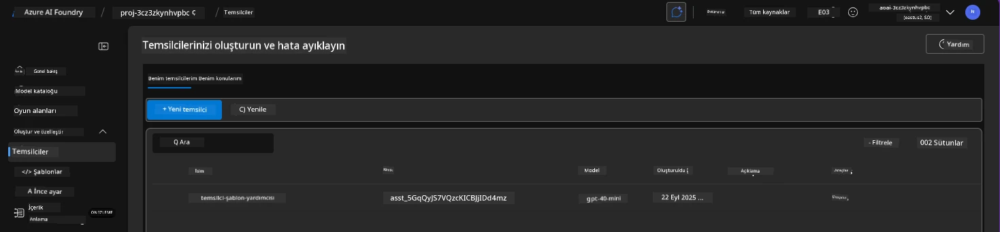

1. Seçin - ve Ajan ayrıntılarını görürsünüz. Aşağıdakilere dikkat edin:

      - Ajan varsayılan olarak File Search kullanır (her zaman)
      - Ajanın `Knowledge` kısmı, 32 dosya yüklendiğini gösterir (dosya araması için)
      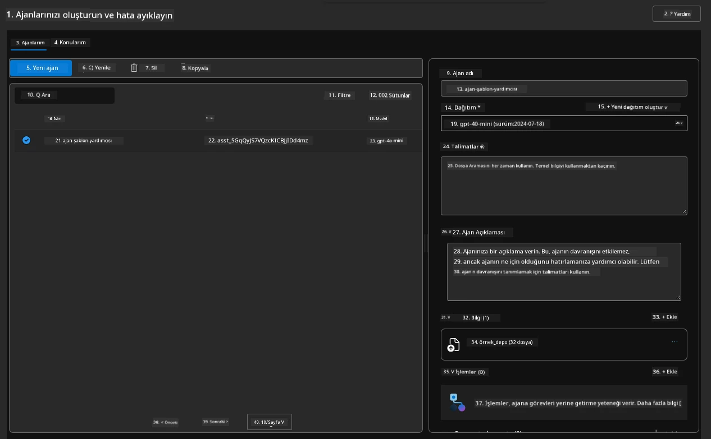

1. Sol menüde `Data+indexes` seçeneğini arayın ve ayrıntılar için tıklayın. 

      - Bilgi için yüklenen 32 veri dosyasını görmelisiniz.
      - Bunlar `src/files` altındaki 12 müşteri dosyası ve 20 ürün dosyasına karşılık gelir 
      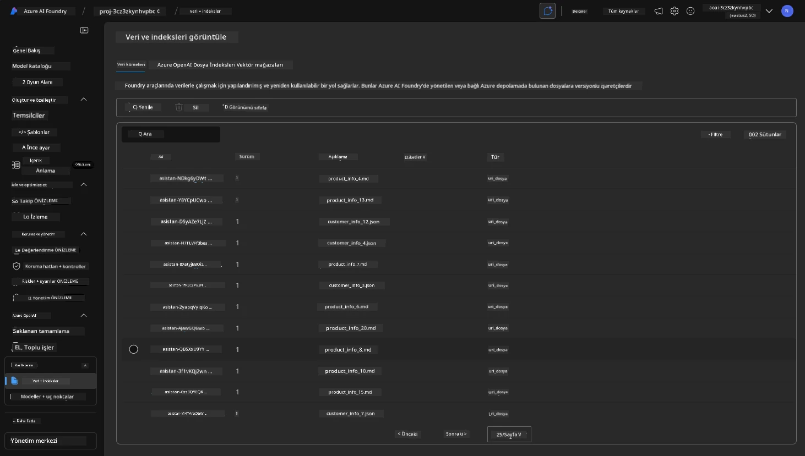

**Ajan işlemini doğruladınız!**

1. Ajan yanıtları bu dosyalardaki bilgiye dayanmaktadır. 
1. Artık bu verilerle ilgili sorular sorabilir ve dayanaklı yanıtlar alabilirsiniz.
1. Örnek: `customer_info_10.json`, "Amanda Perez" tarafından yapılan 3 satın almayı açıklar

Container App uç noktası içeren tarayıcı sekmesine geri dönün ve sorun: `What products does Amanda Perez own?`. Şuna benzer bir şey görmelisiniz:

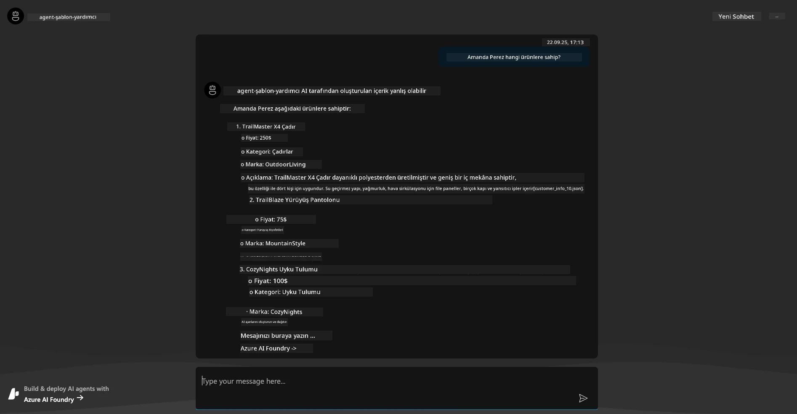

---

## 6. Ajan Oyun Alanı

Microsoft Foundry'nin yeteneklerine dair biraz daha sezgi oluşturmak için, Ajanı Agents Playground'da çalıştıralım.

1. Microsoft Foundry'de `Agents` sayfasına geri dönün - varsayılan ajanı seçin
1. `Try in Playground` seçeneğine tıklayın - şu şekilde bir Playground UI elde etmelisiniz
1. Aynı soruyu sorun: `What products does Amanda Perez own?`

    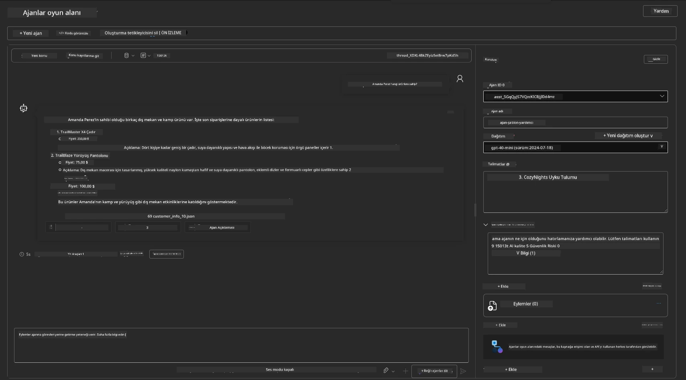

Aynı (veya benzer) yanıtı alırsınız - ancak ayrıca ajan uygulamanızın kalite, maliyet ve performansını anlamak için kullanabileceğiniz ek bilgiler elde edersiniz. Örneğin:

1. Yanıtın, yanıtı "dayandırmak" için kullanılan veri dosyalarını referans gösterdiğini unutmayın
1. Bu dosya etiketlerinin herhangi birinin üzerine gelin - veriler sorgunuza ve gösterilen yanıta uyuyor mu?

Yanıtın altında bir _istatistik_ satırı da görürsünüz.

1. Herhangi bir metrik üzerine gelin - ör., Safety. Şuna benzer bir şey görürsünüz
1. Değerlendirilen puan, yanıtın güvenlik seviyesine dair sezginizle eşleşiyor mu?

      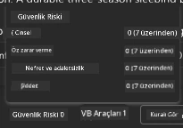

---

## 7. Yerleşik Gözlemlenebilirlik

Gözlemlenebilirlik, uygulamanızı onun operasyonlarını anlamak, hata ayıklamak ve optimize etmek için kullanılabilecek veriler üretmek üzere enstrümante etmekle ilgilidir. Bunu anlamak için:

1. `View Run Info` düğmesine tıklayın - bu görünümü görmelisiniz. Bu, çalışan bir örnek olarak [Agent tracing](https://learn.microsoft.com/en-us/azure/ai-foundry/how-to/develop/trace-agents-sdk#view-trace-results-in-the-azure-ai-foundry-agents-playground) gösterimidir. _Bu görünümü üst düzey menüde Thread Logs'a tıklayarak da alabilirsiniz_.

   - Çalışma adımlarını ve ajan tarafından kullanılan araçları inceleyin
   - Yanıt için toplam Token sayısını (çıktı token kullanımına karşı) anlayın
   - Gecikmeyi ve yürütmede zamanın nerede harcandığını anlayın

      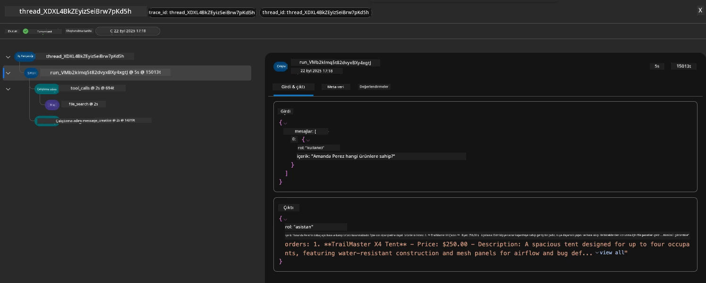

1. Çalışma için hata ayıklama bağlamı sağlayabilecek ek öznitelikleri görmek için `Metadata` sekmesine tıklayın.   

      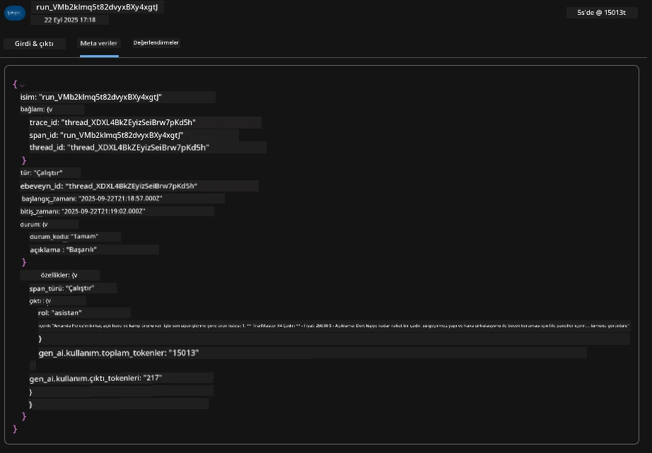


1. `Evaluations` sekmesine tıklayarak ajan yanıtı için yapılan otomatik değerlendirmeleri görün. Bunlar güvenlik değerlendirmeleri (ör., kendine zarar verme) ve ajan-spesifik değerlendirmeleri (ör., Niyet çözümü, Görev uyumu) içerir.

      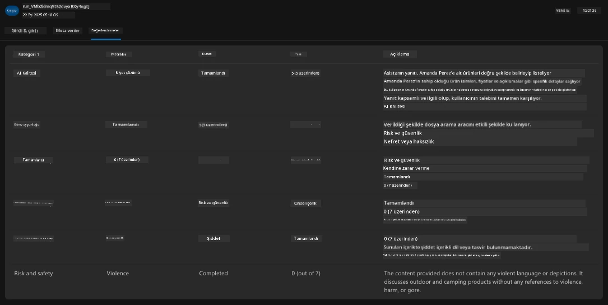

1. Son olarak, kenar çubuğu menüsünden `Monitoring` sekmesine tıklayın.

      - Görüntülenen sayfada `Resource usage` sekmesini seçin - ve metrikleri görün.
      - Token (maliyet) ve yük (istekler) açısından uygulama kullanımını izleyin.
      - Uygulama gecikmesini ilk byte'a (girdi işleme) ve son byte'a (çıktı) kadar izleyin.

      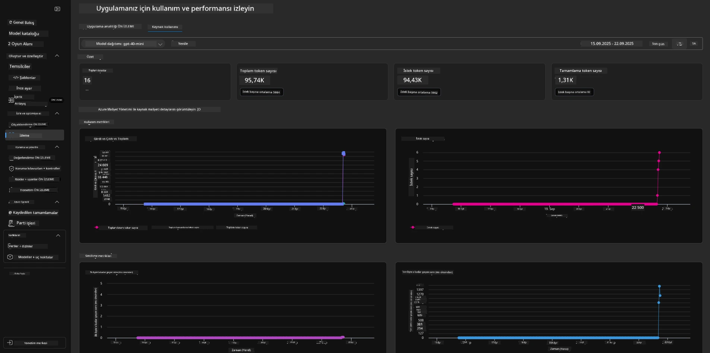

---

## 8. Ortam Değişkenleri

Şimdiye kadar tarayıcıda dağıtım sürecini gezdik - ve altyapımızın sağlandığını ve uygulamanın çalışır durumda olduğunu doğruladık. Ancak uygulama ile _kod-öncelikli_ çalışmak için, bu kaynaklarla çalışmak için gereken ilgili değişkenlerle yerel geliştirme ortamımızı yapılandırmamız gerekir. `azd` kullanmak bunu kolaylaştırır.

1. Azure Developer CLI, uygulama dağıtımları için yapılandırma ayarlarını depolamak ve yönetmek üzere [ortam değişkenlerini kullanır](https://learn.microsoft.com/en-us/azure/developer/azure-developer-cli/manage-environment-variables?tabs=bash).

1. Ortam değişkenleri `.azure/<env-name>/.env` içinde saklanır - bu, bunları dağıtım sırasında kullanılan `env-name` ortamına özgü kılar ve aynı repo içindeki farklı dağıtım hedefleri arasında ortamları izole etmenize yardımcı olur.

1. Ortam değişkenleri, `azd` belirli bir komutu yürütürken (ör., `azd up`) otomatik olarak yüklenir. `azd`'nin _OS düzeyindeki_ ortam değişkenlerini (ör., shell'de ayarlanmış olanları) otomatik olarak okumadığını unutmayın - bunun yerine betiklerde bilgi aktarmak için `azd set env` ve `azd get env` kullanın.


Birkaç komutu deneyelim:

1. Bu ortamdaki `azd` için ayarlanmış tüm ortam değişkenlerini alın:

      ```bash title="" linenums="0"
      azd env get-values
      ```
      
      Şuna benzer bir şey görürsünüz:

      ```bash title="" linenums="0"
      AZURE_AI_AGENT_DEPLOYMENT_NAME="gpt-4.1-mini"
      AZURE_AI_AGENT_NAME="agent-template-assistant"
      AZURE_AI_EMBED_DEPLOYMENT_NAME="text-embedding-3-small"
      AZURE_AI_EMBED_DIMENSIONS=100
      ...
      ```

1. Belirli bir değeri alın - ör., `AZURE_AI_AGENT_MODEL_NAME` değerini ayarlayıp ayarlamadığımızı öğrenmek istiyorum

      ```bash title="" linenums="0"
      azd env get-value AZURE_AI_AGENT_MODEL_NAME 
      ```
      
      Şuna benzer bir şey görürsünüz - varsayılan olarak ayarlanmamıştı!

      ```bash title="" linenums="0"
      ERROR: key 'AZURE_AI_AGENT_MODEL_NAME' not found in the environment values
      ```

1. `azd` için yeni bir ortam değişkeni ayarlayın. Burada, ajan model adını güncelliyoruz. _Not: yapılan değişiklikler `.azure/<env-name>/.env` dosyasında hemen yansıtılacaktır._

      ```bash title="" linenums="0"
      azd env set AZURE_AI_AGENT_MODEL_NAME gpt-4.1
      azd env set AZURE_AI_AGENT_MODEL_VERSION 2025-04-14
      azd env set AZURE_AI_AGENT_DEPLOYMENT_CAPACITY 150
      ```

      Şimdi değerin ayarlandığını görmeliyiz:

      ```bash title="" linenums="0"
      azd env get-value AZURE_AI_AGENT_MODEL_NAME 
      ```

1. Bazı kaynakların kalıcı olduğunu (ör., model dağıtımları) ve yeniden dağıtım için yalnızca `azd up`'dan daha fazlasını gerektirebileceğini unutmayın. Orijinal dağıtımı söküp değişen ortam değişkenleriyle yeniden dağıtmayı deneyelim.

1. **Yenileme** Daha önce bir azd şablonu kullanarak altyapı dağıttıysanız - yerel ortam değişkenlerinizin durumunu mevcut Azure dağıtımınızın durumuna göre bu komutla _yenileyebilirsiniz_:

      ```bash title="" linenums="0"
      azd env refresh
      ```

      Bu, iki veya daha fazla yerel geliştirme ortamı (ör., birden fazla geliştiricinin olduğu bir ekip) arasında ortam değişkenlerini _senkronize_ etmek için güçlü bir yol - dağıtılmış altyapının ortam değişkenleri durumunun gerçek kaynağı olarak hizmet etmesine izin verir. Ekip üyeleri sadece değişkenleri _yeniler_ ve tekrar senkronize olurlar.

---

## 9. Tebrikler 🏆

Az önce uçtan uca bir iş akışını tamamladınız; şunları yaptınız:

- [X] Kullanmak istediğiniz AZD Template'i seçtiniz
- [X] Şablonu desteklenen bir geliştirme ortamında açtınız
- [X] Template'i dağıttınız ve çalıştığını doğruladınız

---

<!-- CO-OP TRANSLATOR DISCLAIMER START -->
**Disclaimer**:
Bu belge AI çeviri hizmeti [Co-op Translator](https://github.com/Azure/co-op-translator) kullanılarak çevrilmiştir. Doğruluk için çaba göstermemize rağmen, otomatik çevirilerin hatalar veya yanlışlıklar içerebileceğini lütfen unutmayın. Orijinal belge, ana dilindeki haliyle yetkili kaynak olarak kabul edilmelidir. Kritik bilgiler için profesyonel insan çevirisi önerilir. Bu çevirinin kullanımı sonucunda ortaya çıkabilecek herhangi bir yanlış anlama veya yanlış yorumdan sorumlu değiliz.
<!-- CO-OP TRANSLATOR DISCLAIMER END -->