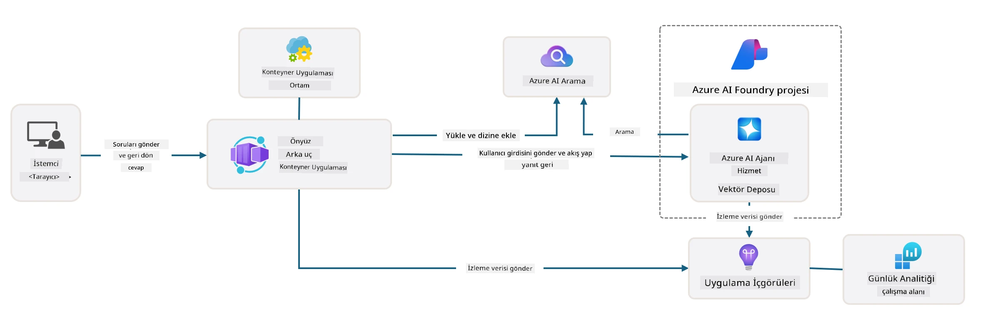

# 3. Bir Şablonu Parçalarına Ayır

!!! tip "BU MODÜLÜN SONUNDA ŞUNLARI YAPABİLECEKSİNİZ"

    - [ ] Azure yardımı için MCP sunucularıyla GitHub Copilot'u etkinleştirin
    - [ ] AZD şablon klasör yapısını ve bileşenlerini anlayın
    - [ ] Altyapı olarak kod (Bicep) organizasyon modellerini keşfedin
    - [ ] **Lab 3:** GitHub Copilot'u kullanarak depo mimarisini keşfedin ve anlayın 

---


With AZD templates and the Azure Developer CLI (`azd`) we can quickly jumpstart our AI development journey with standardized repositories that provide sample code, infrastructure and configuration files - in the form of a ready-to-deploy _starter_ project.

**Ama şimdi, proje yapısını ve kod tabanını anlamamız gerekiyor - ve AZD şablonunu herhangi bir ön deneyim veya AZD bilgisi olmadan özelleştirebilmeliyiz!**

---

## 1. GitHub Copilot'u Etkinleştirin

### 1.1 GitHub Copilot Chat'i Yükleyin

It's time to explore [GitHub Copilot Agent Modu](https://code.visualstudio.com/docs/copilot/chat/chat-agent-mode). Now, we can use natural language to describe our task at a high level, and get assistance in execution. For this lab, we'll use the [Copilot Ücretsiz planı](https://github.com/github-copilot/signup) which has a monthly limit for completions and chat interactions.

The extension can be installed from the marketplace, and it is often already available in Codespaces or dev container environments. _Click `Open Chat` from the Copilot icon drop-down - and type a prompt like `What can you do?`_ - you may be prompted to log in. **GitHub Copilot Chat hazır**.

### 1.2. MCP Sunucularını Yükleyin

For Agent mode to be effective, it needs access to the right tools to help it retrieve knowledge or take actions. This is where MCP servers can help. We'll configure the following servers:

1. [Azure MCP Sunucusu](../../../../../workshop/docs/instructions)
1. [Microsoft Docs MCP Sunucusu](../../../../../workshop/docs/instructions)

To activate these:

1. Create a file called `.vscode/mcp.json` if it does not exist
1. Copy the following into that file - and start the servers!
   ```json title=".vscode/mcp.json"
   {
      "servers": {
         "Azure MCP Server": {
            "command": "npx",
            "args": [
            "-y",
            "@azure/mcp@latest",
            "server",
            "start"
            ]
         },
         "microsoft.docs.mcp": {
            "type": "http",
            "url": "https://learn.microsoft.com/api/mcp"
         }
      }
   }
   ```

??? warning " `npx` yüklü değil hatası alabilirsiniz (çözüm için genişletmek üzere tıklayın)"

      Bunu düzeltmek için `.devcontainer/devcontainer.json` dosyasını açın ve features bölümüne aşağıdaki satırı ekleyin. Ardından konteyneri yeniden oluşturun. Artık `npx` yüklü olmalıdır.

      ```title="" linenums="0"
         "features": {
            "ghcr.io/devcontainers/features/node:1": {},
            ...
         },
      ```

---

### 1.3 GitHub Copilot Chat'i Test Edin

**Önce VS Code komut satırından Azure ile kimlik doğrulamak için `azd auth login` komutunu kullanın. Azure CLI komutlarını doğrudan çalıştırmayı planlıyorsanız sadece `az login`'i de kullanın.**

You should now be able to query your Azure subscription status, and ask questions about deployed resources or configuration. Try these prompts:

1. `List my Azure resource groups`
1. `#foundry list my current deployments`

You can also ask questions about Azure documentation and get responses grounded in the Microsoft Docs MCP server. Try these prompts:

1. `#microsoft_docs_search What is Azure Developer CLI?`
1. `#microsoft_docs_search Show me a Python tutorial to chat with deployed model`

Or you can ask for code snippets to complete a task. Try this prompt.

1. `Give me a Python code example that uses AAD for an interactive chat client`

In `Ask` mode, this will provide code that you can copy-paste and try out. In `Agent` mode, this might go a step further and create the relevant resources for you - including setup scripts and documentation - to help you execute that task.

**Artık şablon deposunu keşfetmeye başlamak için donanımlısınız**

---

## 2. Mimarinin Yapısını Çözümleme

??? prompt "SOR: docs/images/architecture.png içindeki uygulama mimarisini 1 paragrafta açıklayın"

      Bu uygulama, Azure üzerinde modern bir ajan tabanlı mimariyi gösteren yapay zeka destekli bir sohbet uygulamasıdır. Çözüm, kullanıcı girdilerini işleyen ve AI ajanı aracılığıyla zeki yanıtlar üreten ana uygulama kodunu barındıran bir Azure Container App etrafında toplanır.
      
      Mimari, AI yetenekleri için temel olan Microsoft Foundry Projesi'ni kullanır ve gpt-4.1-mini gibi dil modellerini ve ajan işlevselliğini sağlayan Azure AI Hizmetlerine bağlanır. Kullanıcı etkileşimleri, React tabanlı bir ön yüz üzerinden FastAPI arka uca akar; arka uç, bağlamsal yanıtlar üretmek için AI ajan servisiyle iletişim kurar.
      
      Sistem, ajanların yüklenen belgelerden bilgi almasını ve alıntı yapmasını sağlayan dosya araması veya Azure AI Search servisi aracılığıyla bilgi alma yeteneklerini içerir. Operasyonel mükemmellik için mimari, izleme, günlükleme ve performans optimizasyonu için Application Insights ve Log Analytics Workspace üzerinden kapsamlı bir izleme içerir.
      
      Azure Storage, uygulama verileri ve dosya yüklemeleri için blob depolama sağlar, Managed Identity ise kimlik bilgilerini saklamadan Azure kaynakları arasında güvenli erişim sağlar. Tüm çözüm, talebe göre otomatik ölçeklenen konteyner tabanlı uygulama ile birlikte yerleşik güvenlik, izleme ve CI/CD yetenekleri sunarak ölçeklenebilirlik ve sürdürülebilirlik için tasarlanmıştır.



---

## 3. Depo Yapısı

!!! prompt "SOR: Şablon klasör yapısını açıklayın. Görsel hiyerarşik bir diyagram ile başlayın."

??? info "YANIT: Görsel Hiyerarşik Diyagram"

      ```bash title="" 
      get-started-with-ai-agents/
      ├── 📋 Yapılandırma ve Kurulum
      │   ├── azure.yaml                    # Azure Developer CLI yapılandırması
      │   ├── docker-compose.yaml           # Yerel geliştirme konteynerleri
      │   ├── pyproject.toml                # Python proje yapılandırması
      │   ├── requirements-dev.txt          # Geliştirme bağımlılıkları
      │   └── .devcontainer/                # VS Code dev container kurulumu
      │
      ├── 🏗️ Altyapı (infra/)
      │   ├── main.bicep                    # Ana altyapı şablonu
      │   ├── api.bicep                     # API'ye özgü kaynaklar
      │   ├── main.parameters.json          # Altyapı parametreleri
      │   └── core/                         # Modüler altyapı bileşenleri
      │       ├── ai/                       # AI servis yapılandırmaları
      │       ├── host/                     # Barındırma altyapısı
      │       ├── monitor/                  # İzleme ve günlükleme
      │       ├── search/                   # Azure AI Search kurulumu
      │       ├── security/                 # Güvenlik ve kimlik
      │       └── storage/                  # Depolama hesabı yapılandırmaları
      │
      ├── 💻 Uygulama Kaynakları (src/)
      │   ├── api/                          # Arka uç API
      │   │   ├── main.py                   # FastAPI uygulama girişi
      │   │   ├── routes.py                 # API rota tanımları
      │   │   ├── search_index_manager.py   # Arama işlevselliği
      │   │   ├── data/                     # API veri işlemleri
      │   │   ├── static/                   # Statik web varlıkları
      │   │   └── templates/                # HTML şablonları
      │   ├── frontend/                     # React/TypeScript ön yüzü
      │   │   ├── package.json              # Node.js bağımlılıkları
      │   │   ├── vite.config.ts            # Vite yapılandırma ayarları
      │   │   └── src/                      # Ön yüz kaynak kodu
      │   ├── data/                         # Örnek veri dosyaları
      │   │   └── embeddings.csv            # Ön hesaplanmış embedding'ler
      │   ├── files/                        # Bilgi tabanı dosyaları
      │   │   ├── customer_info_*.json      # Müşteri veri örnekleri
      │   │   └── product_info_*.md         # Ürün dokümantasyonu
      │   ├── Dockerfile                    # Konteyner yapılandırması
      │   └── requirements.txt              # Python bağımlılıkları
      │
      ├── 🔧 Otomasyon ve Betikler (scripts/)
      │   ├── postdeploy.sh/.ps1           # Dağıtımdan sonra kurulum
      │   ├── setup_credential.sh/.ps1     # Kimlik bilgisi yapılandırması
      │   ├── validate_env_vars.sh/.ps1    # Ortam değişkenleri doğrulama
      │   └── resolve_model_quota.sh/.ps1  # Model kota yönetimi
      │
      ├── 🧪 Test & Değerlendirme
      │   ├── tests/                        # Birim ve entegrasyon testleri
      │   │   └── test_search_index_manager.py
      │   ├── evals/                        # Ajan değerlendirme çerçevesi
      │   │   ├── evaluate.py               # Değerlendirme çalıştırıcısı
      │   │   ├── eval-queries.json         # Test sorguları
      │   │   └── eval-action-data-path.json
      │   ├── sandbox/                      # Geliştirme oyun alanı
      │   │   ├── 1-quickstart.py           # Başlangıç örnekleri
      │   │   └── aad-interactive-chat.py   # Kimlik doğrulama örnekleri
      │   └── airedteaming/                 # Yapay Zeka güvenliği değerlendirmesi
      │       └── ai_redteaming.py          # Kırmızı takım testleri
      │
      ├── 📚 Dokümantasyon (docs/)
      │   ├── deployment.md                 # Dağıtım kılavuzu
      │   ├── local_development.md          # Yerel kurulum talimatları
      │   ├── troubleshooting.md            # Yaygın sorunlar ve çözüm yolları
      │   ├── azure_account_setup.md        # Azure önkoşulları
      │   └── images/                       # Dokümantasyon varlıkları
      │
      └── 📄 Proje Meta Verileri
         ├── README.md                     # Proje genel bakışı
         ├── CODE_OF_CONDUCT.md           # Topluluk kuralları
         ├── CONTRIBUTING.md              # Katkıda bulunma rehberi
         ├── LICENSE                      # Lisans şartları
         └── next-steps.md                # Dağıtımdan sonra rehberlik
      ```

### 3.1. Temel Uygulama Mimarisi

This template follows a **full-stack web application** pattern with:

- **Arka uç**: Azure AI entegrasyonu ile Python FastAPI
- **Ön yüz**: TypeScript/React ile Vite yapı sistemi
- **Altyapı**: Bulut kaynakları için Azure Bicep şablonları
- **Konteynerleştirme**: Tutarlı dağıtımlar için Docker

### 3.2 Altyapı Olarak Kod (Bicep)

The infrastructure layer uses **Azure Bicep** templates organized modularly:

   - **`main.bicep`**: Tüm Azure kaynaklarını orkestre eder
   - **`core/` modülleri**: Farklı hizmetler için yeniden kullanılabilir bileşenler
      - AI hizmetleri (Microsoft Foundry Modelleri, AI Search)
      - Konteyner barındırma (Azure Container Apps)
      - İzleme (Application Insights, Log Analytics)
      - Güvenlik (Key Vault, Managed Identity)

### 3.3 Uygulama Kaynakları (`src/`)

**Arka uç API (`src/api/`)**:

- FastAPI tabanlı REST API
- Foundry Ajanları entegrasyonu
- Bilgi erişimi için arama dizini yönetimi
- Dosya yükleme ve işleme yetenekleri

**Ön yüz (`src/frontend/`)**:

- Modern React/TypeScript SPA
- Hızlı geliştirme ve optimize edilmiş derlemeler için Vite
- Ajan etkileşimleri için sohbet arayüzü

**Bilgi Tabanı (`src/files/`)**:

- Örnek müşteri ve ürün verileri
- Dosya tabanlı bilgi erişimini gösterir
- JSON ve Markdown formatı örnekleri


### 3.4 DevOps ve Otomasyon

**Betikler (`scripts/`)**:

- Çapraz platform PowerShell ve Bash betikleri
- Ortam doğrulaması ve kurulumu
- Dağıtımdan sonra yapılandırma
- Model kota yönetimi

**Azure Developer CLI Entegrasyonu**:

- `azure.yaml` `azd` iş akışları için yapılandırma
- Otomatik sağlama ve dağıtım
- Ortam değişkenleri yönetimi

### 3.5 Test & Kalite Güvencesi

**Değerlendirme Çerçevesi (`evals/`)**:

- Ajan performans değerlendirmesi
- Sorgu-yanıt kalite testi
- Otomatik değerlendirme hattı

**Yapay Zeka Güvenliği (`airedteaming/`)**:

- Yapay zeka güvenliği için kırmızı takım testleri
- Güvenlik açığı taraması
- Sorumlu Yapay Zeka uygulamaları

---

## 4. Tebrikler 🏆

Depoyu keşfetmek için MCP sunucuları ile GitHub Copilot Chat'i başarıyla kullandınız.

- [X] Azure için GitHub Copilot'u etkinleştirdiniz
- [X] Uygulama Mimarisi'ni anladınız
- [X] AZD şablon yapısını keşfettiniz

Bu, bu şablon için _altyapı olarak kod_ varlıklarına dair bir fikir verir. Sonraki bölümde AZD için yapılandırma dosyasına bakacağız.

---

<!-- CO-OP TRANSLATOR DISCLAIMER START -->
**Sorumluluk Reddi**:
Bu belge [Co-op Translator](https://github.com/Azure/co-op-translator) adlı yapay zeka çeviri hizmeti kullanılarak çevrilmiştir. Doğruluk için çaba gösteriyor olsak da, otomatik çevirilerin hata veya yanlışlıklar içerebileceğini lütfen unutmayın. Orijinal belge, kendi dilindeki versiyonuyla yetkili kaynak olarak kabul edilmelidir. Kritik bilgiler için profesyonel insan çevirisi önerilir. Bu çevirinin kullanımı sonucunda ortaya çıkabilecek herhangi bir yanlış anlama veya yanlış yorumlamadan sorumlu değiliz.
<!-- CO-OP TRANSLATOR DISCLAIMER END -->