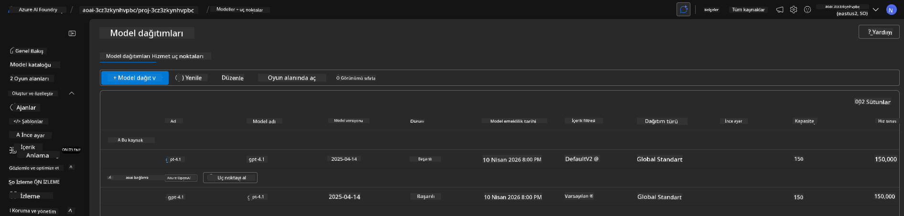

<!--
CO_OP_TRANSLATOR_METADATA:
{
  "original_hash": "6539a34c770f3ceff282370d72ee74dc",
  "translation_date": "2025-09-24T14:56:23+00:00",
  "source_file": "workshop/docs/instructions/6-Teardown-Infrastructure.md",
  "language_code": "tr"
}
-->
# 6. Altyapıyı Kaldırma

!!! tip "BU MODÜLÜN SONUNDA ŞUNLARI YAPABİLECEKSİNİZ"

    - [ ] Madde
    - [ ] Madde
    - [ ] Madde

---

## Ekstra Egzersizler

Projeyi kaldırmadan önce, birkaç dakika ayırarak açık uçlu bir keşif yapabilirsiniz.

!!! danger "NITYA-TODO: Denemek için bazı öneriler oluştur"

---

## Altyapıyı Devre Dışı Bırakma

1. Altyapıyı kaldırmak şu kadar kolaydır:
      
      ```bash title="" linenums="0"
      azd down --purge
      ```
1. `--purge` bayrağı, yumuşak silinmiş Cognitive Service kaynaklarını da temizleyerek bu kaynaklar tarafından tutulan kotayı serbest bırakır. İşlem tamamlandığında aşağıdaki gibi bir şey göreceksiniz:
      
      ```bash title="" linenums="0"
      ? Total resources to delete: 11, are you sure you want to continue? Yes
      Deleting your resources can take some time.
      (✓) Done: Deleted resource group rg-nitya-mshack-azd
      (✓) Done: Purging Cognitive Account: aoai-3cz3zkynhvpbc

      SUCCESS: Your application was removed from Azure in 11 minutes 4 seconds.
      ```

1. (Opsiyonel) Eğer şimdi `azd up` komutunu tekrar çalıştırırsanız, ortam değişkeni yerel `.azure` klasöründe değiştirildiği (ve kaydedildiği) için gpt-4.1 modelinin dağıtıldığını fark edeceksiniz.

      İşte model dağıtımları **öncesi**:

      

      Ve işte **sonrası**:
      

---

