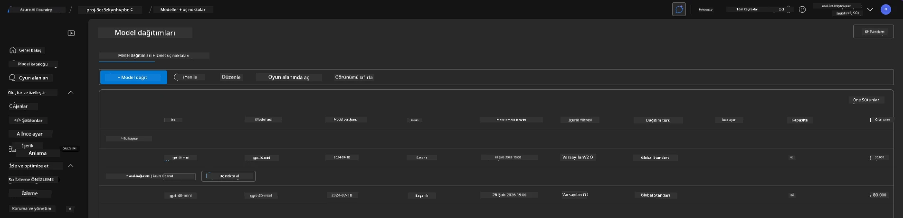
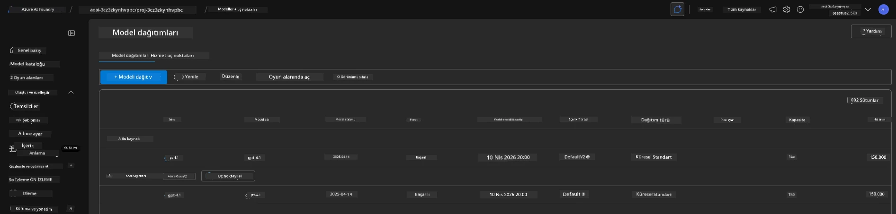

# 6. Teardown Infrastructure

!!! tip "BU MODÜLÜN SONUNDA ŞUNLARI YAPABİLECEKSİNİZ"

    - [ ] Kaynak temizliği ve maliyet yönetiminin önemini anlayın
    - [ ] Altyapıyı güvenle kaldırmak için `azd down` kullanın
    - [ ] Gerekirse soft silinmiş Cognitive Services kaynaklarını geri yükleyin
    - [ ] **Laboratuvar 6:** Azure kaynaklarını temizleyin ve kaldırılmayı doğrulayın

---

## Bonus Exercises

Before we tear down the project, take a few minutes to do some open-ended exploration.

!!! info "Bu Keşif İpuçlarını Deneyin"

    **GitHub Copilot ile Deney Yapın:**
    
    1. Ask: `Çoklu ajan senaryoları için başka hangi AZD şablonlarını deneyebilirim?`
    2. Ask: `Bir sağlık kullanım durumu için ajan talimatlarını nasıl özelleştirebilirim?`
    3. Ask: `Hangi ortam değişkenleri maliyet optimizasyonunu kontrol eder?`
    
    **Azure Portalını Keşfedin:**
    
    1. Dağıtımınız için Application Insights metriklerini inceleyin
    2. Sağlanan kaynaklar için maliyet analizini kontrol edin
    3. Microsoft Foundry portalının ajan oyun alanını bir kez daha keşfedin

---

## Deprovision Infra

1. Tearing down infrastructure is as easy as:
      
      ```bash title="" linenums="0"
      azd down --purge
      ```
1. The `--purge` flag ensures that it also purges soft-deleted Cognitive Service resources, thereby releasing quota held by these resources. Once complete you will see something like this:
      
      ```bash title="" linenums="0"
      ? Total resources to delete: 11, are you sure you want to continue? Yes
      Deleting your resources can take some time.
      (✓) Done: Deleted resource group rg-nitya-mshack-azd
      (✓) Done: Purging Cognitive Account: aoai-3cz3zkynhvpbc

      SUCCESS: Your application was removed from Azure in 11 minutes 4 seconds.
      ```

1. (Optional) If you now run `azd up` again, you will notice the gpt-4.1 model gets deployed since the environment variable was changed (and saved) in the local `.azure` folder. 

      Here is the model deployments **before**:

      

      And here it is **after**:
      

---

<!-- CO-OP TRANSLATOR DISCLAIMER START -->
Feragatname:
Bu belge, yapay zeka çeviri hizmeti [Co-op Translator](https://github.com/Azure/co-op-translator) kullanılarak çevrilmiştir. Doğruluk için çaba göstermemize rağmen, otomatik çevirilerin hatalar veya yanlışlıklar içerebileceğini lütfen unutmayın. Orijinal belge, yerel dilindeki haliyle yetkili kaynak olarak kabul edilmelidir. Kritik bilgiler için profesyonel insan çevirisi önerilir. Bu çevirinin kullanımı nedeniyle ortaya çıkabilecek herhangi bir yanlış anlaşılma veya yanlış yorumlamadan sorumlu değiliz.
<!-- CO-OP TRANSLATOR DISCLAIMER END -->