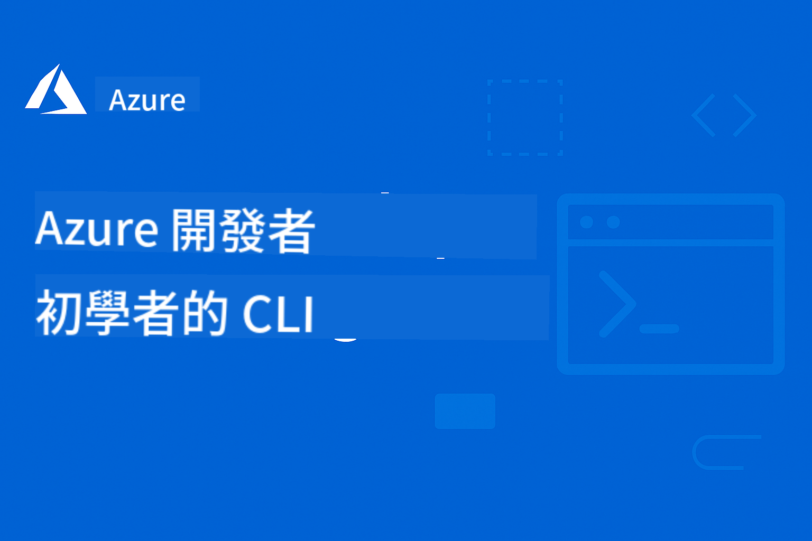

<!--
CO_OP_TRANSLATOR_METADATA:
{
  "original_hash": "6dbd1fe0dee10a4def58fdc663c59e1d",
  "translation_date": "2025-11-18T17:07:02+00:00",
  "source_file": "README.md",
  "language_code": "tw"
}
-->
# AZD 初學者指南：結構化學習旅程

 

[](https://GitHub.com/microsoft/azd-for-beginners/watchers/)
[](https://GitHub.com/microsoft/azd-for-beginners/network/)
[](https://GitHub.com/microsoft/azd-for-beginners/stargazers/)

[](https://discord.gg/microsoft-azure)
[](https://discord.gg/nTYy5BXMWG)

## 開始學習這門課程

按照以下步驟開始您的 AZD 學習旅程：

1. **Fork 此儲存庫**：點擊 [](https://GitHub.com/microsoft/azd-for-beginners/fork)
2. **Clone 此儲存庫**：`git clone https://github.com/microsoft/azd-for-beginners.git`
3. **加入社群**：[Azure Discord 社群](https://discord.com/invite/ByRwuEEgH4) 獲取專家支援
4. **選擇您的學習路徑**：從下方選擇符合您經驗水平的章節

### 多語言支援

#### 自動翻譯（隨時保持最新）

<!-- CO-OP TRANSLATOR LANGUAGES TABLE START -->
[阿拉伯文](../ar/README.md) | [孟加拉文](../bn/README.md) | [保加利亞文](../bg/README.md) | [緬甸文](../my/README.md) | [中文（簡體）](../zh/README.md) | [中文（繁體，香港）](../hk/README.md) | [中文（繁體，澳門）](../mo/README.md) | [中文（繁體，台灣）](./README.md) | [克羅埃西亞文](../hr/README.md) | [捷克文](../cs/README.md) | [丹麥文](../da/README.md) | [荷蘭文](../nl/README.md) | [愛沙尼亞文](../et/README.md) | [芬蘭文](../fi/README.md) | [法文](../fr/README.md) | [德文](../de/README.md) | [希臘文](../el/README.md) | [希伯來文](../he/README.md) | [印地文](../hi/README.md) | [匈牙利文](../hu/README.md) | [印尼文](../id/README.md) | [義大利文](../it/README.md) | [日文](../ja/README.md) | [韓文](../ko/README.md) | [立陶宛文](../lt/README.md) | [馬來文](../ms/README.md) | [馬拉地文](../mr/README.md) | [尼泊爾文](../ne/README.md) | [尼日利亞皮欽語](../pcm/README.md) | [挪威文](../no/README.md) | [波斯文（法爾西）](../fa/README.md) | [波蘭文](../pl/README.md) | [葡萄牙文（巴西）](../br/README.md) | [葡萄牙文（葡萄牙）](../pt/README.md) | [旁遮普文（古木基文）](../pa/README.md) | [羅馬尼亞文](../ro/README.md) | [俄文](../ru/README.md) | [塞爾維亞文（西里爾文）](../sr/README.md) | [斯洛伐克文](../sk/README.md) | [斯洛文尼亞文](../sl/README.md) | [西班牙文](../es/README.md) | [斯瓦希里文](../sw/README.md) | [瑞典文](../sv/README.md) | [他加祿文（菲律賓語）](../tl/README.md) | [泰米爾文](../ta/README.md) | [泰文](../th/README.md) | [土耳其文](../tr/README.md) | [烏克蘭文](../uk/README.md) | [烏爾都文](../ur/README.md) | [越南文](../vi/README.md)
<!-- CO-OP TRANSLATOR LANGUAGES TABLE END -->

## 課程概覽

透過結構化章節學習 Azure Developer CLI (azd)，逐步掌握技能。**特別著重於整合 Azure AI Foundry 的 AI 應用程式部署。**

### 為什麼這門課程對現代開發者至關重要

根據 Azure AI Foundry Discord 社群的洞察，**45% 的開發者希望使用 AZD 進行 AI 工作負載**，但面臨以下挑戰：
- 複雜的多服務 AI 架構
- 生產環境 AI 部署的最佳實踐  
- Azure AI 服務的整合與配置
- AI 工作負載的成本優化
- AI 部署特定問題的排除

### 學習目標

完成這門結構化課程後，您將能夠：
- **掌握 AZD 基礎**：核心概念、安裝與配置
- **部署 AI 應用程式**：使用 AZD 整合 Azure AI Foundry 服務
- **實現基礎設施即代碼**：使用 Bicep 模板管理 Azure 資源
- **排除部署問題**：解決常見問題並進行除錯
- **優化生產環境**：安全性、擴展性、監控與成本管理
- **構建多代理解決方案**：部署複雜的 AI 架構

## 📚 學習章節

*根據您的經驗水平和目標選擇學習路徑*

### 🚀 第 1 章：基礎與快速入門
**先決條件**：Azure 訂閱、基本命令列知識  
**時長**：30-45 分鐘  
**難度**：⭐

#### 您將學到什麼
- 了解 Azure Developer CLI 的基礎知識
- 在您的平台上安裝 AZD
- 完成您的第一次成功部署

#### 學習資源
- **🎯 從這裡開始**：[什麼是 Azure Developer CLI？](../..)
- **📖 理論**：[AZD 基礎](docs/getting-started/azd-basics.md) - 核心概念與術語
- **⚙️ 設置**：[安裝與設置](docs/getting-started/installation.md) - 平台特定指南
- **🛠️ 實作**：[您的第一個專案](docs/getting-started/first-project.md) - 步驟教學
- **📋 快速參考**：[命令速查表](resources/cheat-sheet.md)

#### 實作練習
```bash
# Quick installation check
azd version

# Deploy your first application
azd init --template todo-nodejs-mongo
azd up
```

**💡 章節成果**：成功使用 AZD 部署一個簡單的網頁應用程式到 Azure

---

### 🤖 第 2 章：以 AI 為核心的開發（推薦給 AI 開發者）
**先決條件**：完成第 1 章  
**時長**：1-2 小時  
**難度**：⭐⭐

#### 您將學到什麼
- 使用 AZD 整合 Azure AI Foundry
- 部署 AI 驅動的應用程式
- 了解 AI 服務配置

#### 學習資源
- **🎯 從這裡開始**：[Azure AI Foundry 整合](docs/ai-foundry/azure-ai-foundry-integration.md)
- **📖 模式**：[AI 模型部署](docs/ai-foundry/ai-model-deployment.md) - 部署與管理 AI 模型
- **🛠️ 工作坊**：[AI 工作坊實驗室](docs/ai-foundry/ai-workshop-lab.md) - 讓您的 AI 解決方案適配 AZD
- **🎥 互動指南**：[工作坊材料](workshop/README.md) - 使用 MkDocs 的瀏覽器學習 * DevContainer 環境
- **📋 模板**：[Azure AI Foundry 模板](../..)

#### 實作練習
```bash
# Deploy your first AI application
azd init --template azure-search-openai-demo
azd up

# Try additional AI templates
azd init --template openai-chat-app-quickstart
azd init --template agent-openai-python-prompty
```

**💡 章節成果**：部署並配置一個具備 RAG 功能的 AI 驅動聊天應用程式

---

### ⚙️ 第 3 章：配置與身份驗證
**先決條件**：完成第 1 章  
**時長**：45-60 分鐘  
**難度**：⭐⭐

#### 您將學到什麼
- 環境配置與管理
- 身份驗證與安全性最佳實踐
- 資源命名與組織

#### 學習資源
- **📖 配置**：[配置指南](docs/getting-started/configuration.md) - 環境設置
- **🔐 安全性**：身份驗證模式與受管理身份
- **📝 範例**：[資料庫應用範例](../../examples/database-app) - 配置模式

#### 實作練習
- 配置多個環境（開發、測試、正式）
- 設置受管理身份驗證
- 實現特定於環境的配置

**💡 章節成果**：管理多個環境並實現正確的身份驗證與安全性

---

### 🏗️ 第 4 章：基礎設施即代碼與部署
**先決條件**：完成第 1-3 章  
**時長**：1-1.5 小時  
**難度**：⭐⭐⭐

#### 您將學到什麼
- 高級部署模式
- 使用 Bicep 的基礎設施即代碼
- 資源配置策略

#### 學習資源
- **📖 部署**：[部署指南](docs/deployment/deployment-guide.md) - 完整工作流程
- **🏗️ 配置**：[資源配置](docs/deployment/provisioning.md) - Azure 資源管理
- **📝 範例**：[容器應用範例](../../examples/container-app) - 容器化部署

#### 實作練習
- 創建自定義 Bicep 模板
- 部署多服務應用程式
- 實現藍綠部署策略

**💡 章節成果**：使用自定義基礎設施模板部署複雜的多服務應用程式

---

### 🎯 第 5 章：多代理 AI 解決方案（進階）
**先決條件**：完成第 1-2 章  
**時長**：2-3 小時  
**難度**：⭐⭐⭐⭐

#### 您將學到什麼
- 多代理架構模式
- 代理協調與協作
- 生產就緒的 AI 部署

#### 學習資源
- **🤖 精選專案**：[零售多代理解決方案](examples/retail-scenario.md) - 完整實現
- **🛠️ ARM 模板**：[ARM 模板包](../../examples/retail-multiagent-arm-template) - 一鍵部署
- **📖 架構**：多代理協作模式

#### 實作練習
```bash
# Deploy the complete retail multi-agent solution
cd examples/retail-multiagent-arm-template
./deploy.sh

# Explore agent configurations
az deployment group show --resource-group <rg-name> --name <deployment-name>
```

**💡 章節成果**：部署並管理具備客戶與庫存代理的生產就緒多代理 AI 解決方案

---

### 🔍 第 6 章：部署前驗證與規劃
**先決條件**：完成第 4 章  
**時長**：1 小時  
**難度**：⭐⭐

#### 您將學到什麼
- 容量規劃與資源驗證
- SKU 選擇策略
- 部署前檢查與自動化

#### 學習資源
- **📊 規劃**：[容量規劃](docs/pre-deployment/capacity-planning.md) - 資源驗證
- **💰 選擇**：[SKU 選擇](docs/pre-deployment/sku-selection.md) - 成本效益選擇
- **✅ 驗證**：[部署前檢查](docs/pre-deployment/preflight-checks.md) - 自動化腳本

#### 實作練習
- 執行容量驗證腳本
- 優化 SKU 選擇以降低成本
- 實現自動化部署前檢查

**💡 章節成果**：在執行前驗證並優化部署

---

### 🚨 第 7 章：故障排除與除錯
**先決條件**：完成任一部署章節  
**時長**：1-1.5 小時  
**難度**：⭐⭐

#### 您將學到什麼
- 系統化的除錯方法
- 常見問題與解決方案
- AI 特定的故障排除

#### 學習資源
- **🔧 常見問題**：[常見問題](docs/troubleshooting/common-issues.md) - FAQ 與解決方案
- **🕵️ 除錯**：[除錯指南](docs/troubleshooting/debugging.md) - 步驟策略
- **🤖 AI 問題**：[AI 特定故障排除](docs/troubleshooting/ai-troubleshooting.md) - AI 服務問題

#### 實作練習
- 診斷部署失敗
- 解決身份驗證問題
- 除錯 AI 服務連接性

**💡 章節成果**：能夠獨立診斷並解決常見部署問題

---

### 🏢 第 8 章：生產與企業模式
**先決條件**：完成第 1-4 章  

**持續時間**：2-3 小時  
**複雜度**：⭐⭐⭐⭐

#### 您將學到的內容
- 生產環境部署策略
- 企業級安全模式
- 監控與成本優化

#### 學習資源
- **🏭 生產環境**：[生產 AI 最佳實踐](docs/ai-foundry/production-ai-practices.md) - 企業模式
- **📝 範例**：[微服務範例](../../examples/microservices) - 複雜架構
- **📊 監控**：Application Insights 整合

#### 實作練習
- 實作企業級安全模式
- 設置全面的監控
- 在適當的治理下部署至生產環境

**💡 章節成果**：部署具備完整生產能力的企業級應用程式

---

## 🎓 工作坊概覽：實作學習體驗

### 互動式工作坊材料
**透過瀏覽器工具與指導練習進行全面的實作學習**

我們的工作坊材料提供結構化的互動學習體驗，與上述基於章節的課程相輔相成。此工作坊適合自學與講師指導的課程。

#### 🛠️ 工作坊特色
- **瀏覽器介面**：完整的 MkDocs 支援，包含搜尋、複製與主題功能
- **GitHub Codespaces 整合**：一鍵設置開發環境
- **結構化學習路徑**：7 步驟指導練習（總計 3.5 小時）
- **探索 → 部署 → 自訂**：漸進式方法論
- **互動式 DevContainer 環境**：預先配置的工具與依賴項

#### 📚 工作坊結構
工作坊採用 **探索 → 部署 → 自訂** 的方法論：

1. **探索階段**（45 分鐘）
   - 探索 Azure AI Foundry 模板與服務
   - 瞭解多代理架構模式
   - 檢視部署需求與前置條件

2. **部署階段**（2 小時）
   - 實作 AI 應用程式的部署，使用 AZD
   - 配置 Azure AI 服務與端點
   - 實作安全性與身份驗證模式

3. **自訂階段**（45 分鐘）
   - 修改應用程式以適應特定使用案例
   - 優化生產環境部署
   - 實作監控與成本管理

#### 🚀 開始工作坊
```bash
# Option 1: GitHub Codespaces (Recommended)
# Click "Code" → "Create codespace on main" in the repository

# Option 2: Local Development
git clone https://github.com/microsoft/azd-for-beginners.git
cd azd-for-beginners/workshop
# Follow the setup instructions in workshop/README.md
```

#### 🎯 工作坊學習成果
完成工作坊後，參與者將能：
- **部署生產 AI 應用程式**：使用 AZD 與 Azure AI Foundry 服務
- **掌握多代理架構**：實作協調的 AI 代理解決方案
- **實作安全最佳實踐**：配置身份驗證與存取控制
- **優化規模化**：設計具成本效益且高效能的部署
- **排除部署問題**：獨立解決常見問題

#### 📖 工作坊資源
- **🎥 互動指南**：[工作坊材料](workshop/README.md) - 瀏覽器學習環境
- **📋 分步指導**：[指導練習](../../workshop/docs/instructions) - 詳細操作說明
- **🛠️ AI 工作坊實驗室**：[AI 工作坊實驗室](docs/ai-foundry/ai-workshop-lab.md) - 專注於 AI 的練習
- **💡 快速開始**：[工作坊設置指南](workshop/README.md#quick-start) - 環境配置

**適合對象**：企業培訓、大學課程、自學與開發者訓練營。

---

## 📖 什麼是 Azure Developer CLI？

Azure Developer CLI (azd) 是一個以開發者為中心的命令列介面，加速應用程式在 Azure 上的建置與部署過程。它提供：

- **基於模板的部署** - 使用預建模板處理常見應用程式模式
- **基礎架構即程式碼** - 使用 Bicep 或 Terraform 管理 Azure 資源  
- **整合工作流程** - 無縫配置、部署與監控應用程式
- **開發者友好** - 最佳化開發者生產力與體驗

### **AZD + Azure AI Foundry：AI 部署的完美組合**

**為什麼選擇 AZD 用於 AI 解決方案？** AZD 解決了 AI 開發者面臨的主要挑戰：

- **AI 就緒模板** - 預配置的 Azure OpenAI、Cognitive Services 與 ML 工作負載模板
- **安全的 AI 部署** - 內建 AI 服務的安全模式、API 金鑰與模型端點  
- **生產 AI 模式** - 可擴展且具成本效益的 AI 應用程式部署最佳實踐
- **端到端 AI 工作流程** - 從模型開發到生產部署，包含適當的監控
- **成本優化** - 智慧資源分配與擴展策略
- **Azure AI Foundry 整合** - 無縫連接 AI Foundry 模型目錄與端點

---

## 🎯 模板與範例庫

### 精選：Azure AI Foundry 模板
**如果您正在部署 AI 應用程式，從這裡開始！**

| 模板 | 章節 | 複雜度 | 服務 |
|----------|---------|------------|----------|
| [**開始使用 AI 聊天**](https://github.com/Azure-Samples/get-started-with-ai-chat) | 第 2 章 | ⭐⭐ | AzureOpenAI + Azure AI 模型推理 API + Azure AI 搜尋 + Azure 容器應用程式 + Application Insights |
| [**開始使用 AI 代理**](https://github.com/Azure-Samples/get-started-with-ai-agents) | 第 2 章 | ⭐⭐ | Azure AI 代理服務 + AzureOpenAI + Azure AI 搜尋 + Azure 容器應用程式 + Application Insights|
| [**多代理工作流程自動化**](https://github.com/Azure-Samples/get-started-with-ai-chat) | 第 5 章 | ⭐⭐⭐ | AzureOpenAI + Azure AI 代理服務 + Semantic Kernel + Azure CosmosDB + Azure 容器應用程式|
| [**從數據生成文件**](https://github.com/Azure-Samples/get-started-with-ai-chat) | 第 4 章 | ⭐⭐⭐  | AzureOpenAI + Azure AI 搜尋 + Azure AI 服務 + Azure CosmosDB|
| [**改善客戶會議的代理**](https://github.com/Azure-Samples/get-started-with-ai-chat) | 第 5 章 | ⭐⭐⭐| AzureOpenAI + Azure AI 搜尋 + Azure CosmosDB + Azure SQL 資料庫 |
| [**使用代理現代化您的代碼**](https://github.com/Azure-Samples/get-started-with-ai-chat) | 第 5 章 | ⭐⭐⭐ | AzureOpenAI + Azure 代理服務 + Semantic Kernel + Azure CosmosDB + Azure 容器應用程式|
| [**構建您的對話代理**](https://github.com/Azure-Samples/get-started-with-ai-chat) | 第 4 章 | ⭐⭐⭐ | AI Language + AzureOpenAI + AI 搜尋 + Azure 儲存體 + Azure 容器註冊表|
| [**從對話數據中解鎖洞察**](https://github.com/Azure-Samples/get-started-with-ai-chat) | 第 8 章 | ⭐⭐⭐ | AzureOpenAI + AI 搜尋 + Semantic Kernel + Azure 代理服務 + AI AI 內容理解|
| [**多模態內容處理**](https://github.com/Azure-Samples/get-started-with-ai-chat) | 第 8 章 | ⭐⭐⭐⭐ | AzureOpenAI + Azure 內容理解 + Azure CosmosDB + Azure 容器應用程式|

### 精選：完整學習場景
**生產就緒應用程式模板，對應學習章節**

| 模板 | 學習章節 | 複雜度 | 關鍵學習 |
|----------|------------------|------------|--------------|
| [**openai-chat-app-quickstart**](https://github.com/Azure-Samples/openai-chat-app-quickstart) | 第 2 章 | ⭐ | 基本 AI 部署模式 |
| [**azure-search-openai-demo**](https://github.com/Azure-Samples/azure-search-openai-demo) | 第 2 章 | ⭐⭐ | 使用 Azure AI 搜尋的 RAG 實作 |
| [**ai-document-processing**](https://github.com/Azure-Samples/ai-document-processing) | 第 4 章 | ⭐⭐ | 文件智能整合 |
| [**agent-openai-python-prompty**](https://github.com/Azure-Samples/agent-openai-python-prompty) | 第 5 章 | ⭐⭐⭐ | 代理框架與功能調用 |
| [**contoso-chat**](https://github.com/Azure-Samples/contoso-chat) | 第 8 章 | ⭐⭐⭐ | 企業 AI 編排 |
| [**retail-multi-agent-solution**](examples/retail-scenario.md) | 第 5 章 | ⭐⭐⭐⭐ | 客戶與庫存代理的多代理架構 |

### 按範例類型學習

#### 簡單應用程式（第 1-2 章）
- [簡單 Web 應用程式](../../examples/simple-web-app) - 基本部署模式
- [靜態網站](../../examples/static-site) - 靜態內容部署
- [基本 API](../../examples/basic-api) - REST API 部署

#### 資料庫整合（第 3-4 章）  
- [資料庫應用程式](../../examples/database-app) - 資料庫連接模式
- [數據處理](../../examples/data-processing) - ETL 工作流程部署

#### 高級模式（第 4-8 章）
- [容器應用程式](../../examples/container-app) - 容器化部署
- [微服務](../../examples/microservices) - 多服務架構  
- [企業解決方案](../../examples/enterprise) - 生產就緒模式

### 外部模板集合
- [**官方 AZD 模板庫**](https://azure.github.io/awesome-azd/) - 精選官方與社群模板
- [**Azure Developer CLI 模板**](https://learn.microsoft.com/en-us/azure/developer/azure-developer-cli/azd-templates) - Microsoft Learn 模板文件
- [**範例目錄**](examples/README.md) - 本地學習範例與詳細說明

---

## 📚 學習資源與參考資料

### 快速參考
- [**命令速查表**](resources/cheat-sheet.md) - 按章節組織的關鍵 azd 命令
- [**術語表**](resources/glossary.md) - Azure 與 azd 術語  
- [**常見問題**](resources/faq.md) - 按學習章節組織的常見問題
- [**學習指南**](resources/study-guide.md) - 全面的練習題目

### 實作工作坊
- [**AI 工作坊實驗室**](docs/ai-foundry/ai-workshop-lab.md) - 讓您的 AI 解決方案可用 AZD 部署（2-3 小時）
- [**互動式工作坊指南**](workshop/README.md) - 使用 MkDocs 與 DevContainer 環境的瀏覽器工作坊
- [**結構化學習路徑**](../../workshop/docs/instructions) - 7 步驟指導練習（探索 → 部署 → 自訂）
- [**AZD 初學者工作坊**](workshop/README.md) - 完整的實作工作坊材料，支援 GitHub Codespaces 整合

### 外部學習資源
- [Azure Developer CLI 文件](https://learn.microsoft.com/en-us/azure/developer/azure-developer-cli/)
- [Azure 架構中心](https://learn.microsoft.com/en-us/azure/architecture/)
- [Azure 價格計算器](https://azure.microsoft.com/pricing/calculator/)
- [Azure 狀態](https://status.azure.com/)

---

## 🎓 課程完成與認證

### 進度追蹤
透過每章節追蹤您的學習進度：

- [ ] **第 1 章**：基礎與快速開始 ✅
- [ ] **第 2 章**：AI 優先開發 ✅  
- [ ] **第 3 章**：配置與身份驗證 ✅
- [ ] **第 4 章**：基礎架構即程式碼與部署 ✅
- [ ] **第 5 章**：多代理 AI 解決方案 ✅
- [ ] **第 6 章**：部署前驗證與規劃 ✅
- [ ] **第 7 章**：故障排除與調試 ✅
- [ ] **第 8 章**：生產與企業模式 ✅

### 學習驗證
完成每章節後，驗證您的知識：
1. **實作練習**：完成該章節的實作部署
2. **知識檢查**：檢視該章節的常見問題部分
3. **社群討論**：在 Azure Discord 分享您的經驗
4. **下一章節**：進入下一個複雜度級別

### 課程完成的好處
完成所有章節後，您將擁有：
- **生產經驗**：將真實的 AI 應用程式部署至 Azure
- **專業技能**：企業級部署能力  
- **社群認可**：成為 Azure 開發者社群的活躍成員
- **職業發展**：具備 AZD 與 AI 部署的熱門專業技能

---

## 🤝 社群與支援

### 獲取幫助與支援
- **技術問題**：[回報錯誤與請求功能](https://github.com/microsoft/azd-for-beginners/issues)
- **學習問題**：[Microsoft Azure Discord 社群](https://discord.gg/microsoft-azure) 和 [](https://discord.gg/nTYy5BXMWG)
- **AI 特定幫助**：加入 [](https://discord.gg/nTYy5BXMWG)
- **文件**：[官方 Azure Developer CLI 文件](https://learn.microsoft.com/en-us/azure/developer/azure-developer-cli/)

### 來自 Azure AI Foundry Discord 的社群洞察

**#Azure 頻道的最新投票結果：**
- **45%** 的開發者希望使用 AZD 處理 AI 工作負載
- **主要挑戰**：多服務部署、憑證管理、生產準備  
- **最受歡迎的需求**：AI 特定模板、故障排除指南、最佳實踐

**加入我們的社群以：**
- 分享您的 AZD + AI 經驗並獲得幫助
- 獲取新 AI 模板的早期預覽
- 貢獻於 AI 部署最佳實踐  
- 影響未來 AI + AZD 功能開發  

### 貢獻課程內容  
我們歡迎您的貢獻！請閱讀我們的 [貢獻指南](CONTRIBUTING.md) 以了解更多細節：  
- **內容改進**：提升現有章節和範例  
- **新增範例**：添加真實世界的情境和範本  
- **翻譯**：協助維護多語言支持  
- **錯誤回報**：提升準確性與清晰度  
- **社群標準**：遵守我們包容性的社群準則  

---

## 📄 課程資訊  

### 授權  
本專案依 MIT 授權條款授權 - 詳情請參閱 [LICENSE](../../LICENSE) 文件。  

### 相關 Microsoft 學習資源  

我們的團隊製作了其他全面的學習課程：  

<!-- CO-OP TRANSLATOR OTHER COURSES START -->
### Azure / Edge / MCP / Agents  
[](https://github.com/microsoft/AZD-for-beginners?WT.mc_id=academic-105485-koreyst)  
[](https://github.com/microsoft/edgeai-for-beginners?WT.mc_id=academic-105485-koreyst)  
[](https://github.com/microsoft/mcp-for-beginners?WT.mc_id=academic-105485-koreyst)  
[](https://github.com/microsoft/ai-agents-for-beginners?WT.mc_id=academic-105485-koreyst)  

---

### 生成式 AI 系列  
[](https://github.com/microsoft/generative-ai-for-beginners?WT.mc_id=academic-105485-koreyst)  
[-9333EA?style=for-the-badge&labelColor=E5E7EB&color=9333EA)](https://github.com/microsoft/Generative-AI-for-beginners-dotnet?WT.mc_id=academic-105485-koreyst)  
[-C084FC?style=for-the-badge&labelColor=E5E7EB&color=C084FC)](https://github.com/microsoft/generative-ai-for-beginners-java?WT.mc_id=academic-105485-koreyst)  
[-E879F9?style=for-the-badge&labelColor=E5E7EB&color=E879F9)](https://github.com/microsoft/generative-ai-with-javascript?WT.mc_id=academic-105485-koreyst)  

---

### 核心學習  
[](https://aka.ms/ml-beginners?WT.mc_id=academic-105485-koreyst)  
[](https://aka.ms/datascience-beginners?WT.mc_id=academic-105485-koreyst)  
[](https://aka.ms/ai-beginners?WT.mc_id=academic-105485-koreyst)  
[](https://github.com/microsoft/Security-101?WT.mc_id=academic-96948-sayoung)  
[](https://aka.ms/webdev-beginners?WT.mc_id=academic-105485-koreyst)  
[](https://aka.ms/iot-beginners?WT.mc_id=academic-105485-koreyst)  
[](https://github.com/microsoft/xr-development-for-beginners?WT.mc_id=academic-105485-koreyst)  

---

### Copilot 系列  
[](https://aka.ms/GitHubCopilotAI?WT.mc_id=academic-105485-koreyst)  
[](https://github.com/microsoft/mastering-github-copilot-for-dotnet-csharp-developers?WT.mc_id=academic-105485-koreyst)  
[](https://github.com/microsoft/CopilotAdventures?WT.mc_id=academic-105485-koreyst)  
<!-- CO-OP TRANSLATOR OTHER COURSES END -->

---

## 🗺️ 課程導航  

**🚀 準備好開始學習了嗎？**  

**初學者**：從 [第 1 章：基礎與快速入門](../..) 開始  
**AI 開發者**：跳到 [第 2 章：AI 優先開發](../..)  
**有經驗的開發者**：從 [第 3 章：配置與驗證](../..) 開始  

**下一步**：[開始第 1 章 - AZD 基礎](docs/getting-started/azd-basics.md) →  

---

<!-- CO-OP TRANSLATOR DISCLAIMER START -->
**免責聲明**：  
本文件使用 AI 翻譯服務 [Co-op Translator](https://github.com/Azure/co-op-translator) 進行翻譯。我們致力於提供準確的翻譯，但請注意，自動翻譯可能包含錯誤或不準確之處。應以原文文件為權威來源。對於關鍵資訊，建議尋求專業人工翻譯。我們對因使用本翻譯而引起的任何誤解或誤釋不承擔責任。
<!-- CO-OP TRANSLATOR DISCLAIMER END -->