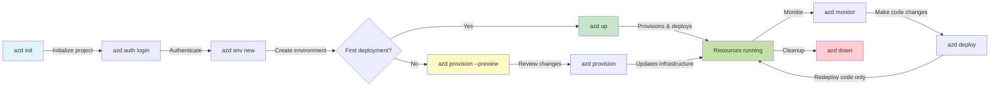
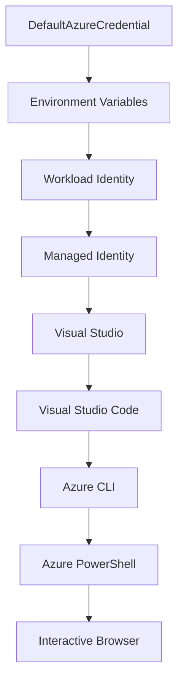

<!--
CO_OP_TRANSLATOR_METADATA:
{
  "original_hash": "e855e899d2705754fe85b04190edd0f0",
  "translation_date": "2025-11-19T10:22:00+00:00",
  "source_file": "docs/getting-started/azd-basics.md",
  "language_code": "tw"
}
-->
# AZD 基礎 - 認識 Azure Developer CLI

# AZD 基礎 - 核心概念與基本原理

**章節導覽：**
- **📚 課程首頁**：[AZD 初學者指南](../../README.md)
- **📖 本章內容**：第 1 章 - 基礎與快速入門
- **⬅️ 上一章**：[課程概覽](../../README.md#-chapter-1-foundation--quick-start)
- **➡️ 下一章**：[安裝與設定](installation.md)
- **🚀 下一章節**：[第 2 章：AI 優先開發](../microsoft-foundry/microsoft-foundry-integration.md)

## 簡介

本課程將介紹 Azure Developer CLI (azd)，這是一個強大的命令列工具，能加速從本地開發到 Azure 部署的過程。您將學習基本概念、核心功能，並了解 azd 如何簡化雲端原生應用程式的部署。

## 學習目標

完成本課程後，您將能夠：
- 了解 Azure Developer CLI 的用途及主要目標
- 學習模板、環境與服務的核心概念
- 探索模板驅動開發與基礎架構即程式碼的關鍵功能
- 理解 azd 專案結構與工作流程
- 為您的開發環境安裝與設定 azd 做好準備

## 學習成果

完成本課程後，您將能夠：
- 解釋 azd 在現代雲端開發工作流程中的角色
- 識別 azd 專案結構的組成部分
- 描述模板、環境與服務如何協同運作
- 理解使用 azd 的基礎架構即程式碼的優勢
- 認識不同的 azd 命令及其用途

## 什麼是 Azure Developer CLI (azd)？

Azure Developer CLI (azd) 是一個命令列工具，旨在加速從本地開發到 Azure 部署的過程。它簡化了在 Azure 上建置、部署和管理雲端原生應用程式的流程。

### 🎯 為什麼要使用 AZD？現實世界的比較

讓我們比較一下部署一個簡單的帶有資料庫的網頁應用程式：

#### ❌ 沒有 AZD：手動 Azure 部署（30 分鐘以上）

```bash
# Step 1: Create resource group
az group create --name myapp-rg --location eastus

# Step 2: Create App Service Plan
az appservice plan create --name myapp-plan \
  --resource-group myapp-rg \
  --sku B1 --is-linux

# Step 3: Create Web App
az webapp create --name myapp-web-unique123 \
  --resource-group myapp-rg \
  --plan myapp-plan \
  --runtime "NODE:18-lts"

# Step 4: Create Cosmos DB account (10-15 minutes)
az cosmosdb create --name myapp-cosmos-unique123 \
  --resource-group myapp-rg \
  --kind MongoDB

# Step 5: Create database
az cosmosdb mongodb database create \
  --account-name myapp-cosmos-unique123 \
  --resource-group myapp-rg \
  --name tododb

# Step 6: Create collection
az cosmosdb mongodb collection create \
  --account-name myapp-cosmos-unique123 \
  --resource-group myapp-rg \
  --database-name tododb \
  --name todos

# Step 7: Get connection string
CONN_STR=$(az cosmosdb keys list \
  --name myapp-cosmos-unique123 \
  --resource-group myapp-rg \
  --type connection-strings \
  --query "connectionStrings[0].connectionString" -o tsv)

# Step 8: Configure app settings
az webapp config appsettings set \
  --name myapp-web-unique123 \
  --resource-group myapp-rg \
  --settings MONGODB_URI="$CONN_STR"

# Step 9: Enable logging
az webapp log config --name myapp-web-unique123 \
  --resource-group myapp-rg \
  --application-logging filesystem \
  --detailed-error-messages true

# Step 10: Set up Application Insights
az monitor app-insights component create \
  --app myapp-insights \
  --location eastus \
  --resource-group myapp-rg

# Step 11: Link App Insights to Web App
INSTRUMENTATION_KEY=$(az monitor app-insights component show \
  --app myapp-insights \
  --resource-group myapp-rg \
  --query "instrumentationKey" -o tsv)

az webapp config appsettings set \
  --name myapp-web-unique123 \
  --resource-group myapp-rg \
  --settings APPINSIGHTS_INSTRUMENTATIONKEY="$INSTRUMENTATION_KEY"

# Step 12: Build application locally
npm install
npm run build

# Step 13: Create deployment package
zip -r app.zip . -x "*.git*" "node_modules/*"

# Step 14: Deploy application
az webapp deployment source config-zip \
  --resource-group myapp-rg \
  --name myapp-web-unique123 \
  --src app.zip

# Step 15: Wait and pray it works 🙏
# (No automated validation, manual testing required)
```

**問題：**
- ❌ 需要記住並執行超過 15 條命令
- ❌ 30-45 分鐘的手動操作
- ❌ 容易出錯（打字錯誤、參數錯誤）
- ❌ 連接字串暴露在終端機歷史記錄中
- ❌ 如果出錯，無法自動回滾
- ❌ 團隊成員難以複製
- ❌ 每次都不同（不可重現）

#### ✅ 使用 AZD：自動化部署（5 條命令，10-15 分鐘）

```bash
# Step 1: Initialize from template
azd init --template todo-nodejs-mongo

# Step 2: Authenticate
azd auth login

# Step 3: Create environment
azd env new dev

# Step 4: Preview changes (optional but recommended)
azd provision --preview

# Step 5: Deploy everything
azd up

# ✨ Done! Everything is deployed, configured, and monitored
```

**優勢：**
- ✅ **5 條命令** 對比 15+ 手動步驟
- ✅ **10-15 分鐘** 總時間（主要是等待 Azure）
- ✅ **零錯誤** - 自動化且經過測試
- ✅ **安全管理機密** - 使用 Key Vault
- ✅ **自動回滾** - 發生錯誤時自動回復
- ✅ **完全可重現** - 每次結果相同
- ✅ **適合團隊** - 任何人都能使用相同命令進行部署
- ✅ **基礎架構即程式碼** - 版本控制的 Bicep 模板
- ✅ **內建監控** - 自動配置 Application Insights

### 📊 時間與錯誤減少

| 指標 | 手動部署 | AZD 部署 | 改善 |
|:-------|:------------------|:---------------|:------------|
| **命令數量** | 15+ | 5 | 減少 67% |
| **時間** | 30-45 分鐘 | 10-15 分鐘 | 快 60% |
| **錯誤率** | ~40% | <5% | 減少 88% |
| **一致性** | 低（手動） | 100%（自動化） | 完美 |
| **團隊上手時間** | 2-4 小時 | 30 分鐘 | 快 75% |
| **回滾時間** | 30+ 分鐘（手動） | 2 分鐘（自動化） | 快 93% |

## 核心概念

### 模板
模板是 azd 的基礎。它們包含：
- **應用程式程式碼** - 您的原始碼與相依性
- **基礎架構定義** - 使用 Bicep 或 Terraform 定義的 Azure 資源
- **配置檔案** - 設定與環境變數
- **部署腳本** - 自動化部署工作流程

### 環境
環境代表不同的部署目標：
- **開發** - 用於測試與開發
- **測試** - 預生產環境
- **生產** - 線上生產環境

每個環境都維護自己的：
- Azure 資源群組
- 配置設定
- 部署狀態

### 服務
服務是應用程式的構建模組：
- **前端** - 網頁應用程式、單頁應用程式 (SPA)
- **後端** - API、微服務
- **資料庫** - 資料儲存解決方案
- **儲存** - 檔案與 Blob 儲存

## 關鍵功能

### 1. 模板驅動開發
```bash
# Browse available templates
azd template list

# Initialize from a template
azd init --template <template-name>
```

### 2. 基礎架構即程式碼
- **Bicep** - Azure 的領域專用語言
- **Terraform** - 多雲基礎架構工具
- **ARM 模板** - Azure Resource Manager 模板

### 3. 整合工作流程
```bash
# Complete deployment workflow
azd up            # Provision + Deploy this is hands off for first time setup

# 🧪 NEW: Preview infrastructure changes before deployment (SAFE)
azd provision --preview    # Simulate infrastructure deployment without making changes

azd provision     # Create Azure resources if you update the infrastructure use this
azd deploy        # Deploy application code or redeploy application code once update
azd down          # Clean up resources
```

#### 🛡️ 使用預覽進行安全的基礎架構規劃
`azd provision --preview` 命令是安全部署的革命性工具：
- **模擬分析** - 顯示將被建立、修改或刪除的內容
- **零風險** - 不會對 Azure 環境進行實際更改
- **團隊協作** - 在部署前分享預覽結果
- **成本估算** - 在承諾前了解資源成本

```bash
# Example preview workflow
azd provision --preview           # See what will change
# Review the output, discuss with team
azd provision                     # Apply changes with confidence
```

### 📊 圖解：AZD 開發工作流程



**工作流程說明：**
1. **初始化** - 從模板或新專案開始
2. **驗證** - 與 Azure 驗證
3. **環境** - 建立獨立的部署環境
4. **預覽** - 🆕 始終先預覽基礎架構變更（安全實踐）
5. **配置** - 建立/更新 Azure 資源
6. **部署** - 推送您的應用程式程式碼
7. **監控** - 觀察應用程式效能
8. **迭代** - 進行更改並重新部署程式碼
9. **清理** - 完成後移除資源

### 4. 環境管理
```bash
# Create and manage environments
azd env new <environment-name>
azd env select <environment-name>
azd env list
```

## 📁 專案結構

一個典型的 azd 專案結構：
```
my-app/
├── .azd/                    # azd configuration
│   └── config.json
├── .azure/                  # Azure deployment artifacts
├── .devcontainer/          # Development container config
├── .github/workflows/      # GitHub Actions
├── .vscode/               # VS Code settings
├── infra/                 # Infrastructure code
│   ├── main.bicep        # Main infrastructure template
│   ├── main.parameters.json
│   └── modules/          # Reusable modules
├── src/                  # Application source code
│   ├── api/             # Backend services
│   └── web/             # Frontend application
├── azure.yaml           # azd project configuration
└── README.md
```

## 🔧 配置檔案

### azure.yaml
主要的專案配置檔案：
```yaml
name: my-awesome-app
metadata:
  template: my-template@1.0.0

services:
  web:
    project: ./src/web
    language: js
    host: appservice
  api:
    project: ./src/api
    language: js
    host: appservice

hooks:
  preprovision:
    shell: pwsh
    run: echo "Preparing to provision..."
```

### .azure/config.json
特定環境的配置：
```json
{
  "version": 1,
  "defaultEnvironment": "dev",
  "environments": {
    "dev": {
      "subscriptionId": "your-subscription-id",
      "location": "eastus"
    }
  }
}
```

## 🎪 常見工作流程與實作練習

> **💡 學習提示：** 按順序完成這些練習，以逐步提升您的 AZD 技能。

### 🎯 練習 1：初始化您的第一個專案

**目標：** 建立一個 AZD 專案並探索其結構

**步驟：**
```bash
# Use a proven template
azd init --template todo-nodejs-mongo

# Explore the generated files
ls -la  # View all files including hidden ones

# Key files created:
# - azure.yaml (main config)
# - infra/ (infrastructure code)
# - src/ (application code)
```

**✅ 成功：** 您擁有 azure.yaml、infra/ 和 src/ 目錄

---

### 🎯 練習 2：部署到 Azure

**目標：** 完成端到端部署

**步驟：**
```bash
# 1. Authenticate
az login && azd auth login

# 2. Create environment
azd env new dev
azd env set AZURE_LOCATION eastus

# 3. Preview changes (RECOMMENDED)
azd provision --preview

# 4. Deploy everything
azd up

# 5. Verify deployment
azd show    # View your app URL
```

**預計時間：** 10-15 分鐘  
**✅ 成功：** 應用程式 URL 在瀏覽器中打開

---

### 🎯 練習 3：多個環境

**目標：** 部署到開發與測試環境

**步驟：**
```bash
# Already have dev, create staging
azd env new staging
azd env set AZURE_LOCATION westus2
azd up

# Switch between them
azd env list
azd env select dev
```

**✅ 成功：** Azure 入口網站中有兩個獨立的資源群組

---

### 🛡️ 清理：`azd down --force --purge`

當您需要完全重置時：

```bash
azd down --force --purge
```

**作用：**
- `--force`：無需確認提示
- `--purge`：刪除所有本地狀態與 Azure 資源

**使用時機：**
- 部署中途失敗
- 切換專案
- 需要全新開始

---

## 🎪 原始工作流程參考

### 開始新專案
```bash
# Method 1: Use existing template
azd init --template todo-nodejs-mongo

# Method 2: Start from scratch
azd init

# Method 3: Use current directory
azd init .
```

### 開發週期
```bash
# Set up development environment
azd auth login
azd env new dev
azd env select dev

# Deploy everything
azd up

# Make changes and redeploy
azd deploy

# Clean up when done
azd down --force --purge # command in the Azure Developer CLI is a **hard reset** for your environment—especially useful when you're troubleshooting failed deployments, cleaning up orphaned resources, or prepping for a fresh redeploy.
```

## 理解 `azd down --force --purge`
`azd down --force --purge` 命令是一種強大的方式，可以完全拆除您的 azd 環境及所有相關資源。以下是每個標誌的作用：
```
--force
```
- 跳過確認提示。
- 適用於無法進行手動輸入的自動化或腳本。
- 確保即使 CLI 偵測到不一致，也能不中斷地進行拆除。

```
--purge
```
刪除 **所有相關的中繼資料**，包括：
環境狀態
本地 `.azure` 資料夾
快取的部署資訊
防止 azd "記住" 先前的部署，避免出現資源群組不匹配或過時的註冊表引用等問題。

### 為什麼要同時使用？
當您因殘留狀態或部分部署而在使用 `azd up` 時遇到困難時，這個組合能確保 **全新開始**。

特別是在 Azure 入口網站中手動刪除資源後，或切換模板、環境或資源群組命名約定時非常有用。

### 管理多個環境
```bash
# Create staging environment
azd env new staging
azd env select staging
azd up

# Switch back to dev
azd env select dev

# Compare environments
azd env list
```

## 🔐 驗證與憑證

理解驗證對於成功的 azd 部署至關重要。Azure 使用多種驗證方法，而 azd 利用與其他 Azure 工具相同的憑證鏈。

### Azure CLI 驗證 (`az login`)

在使用 azd 之前，您需要先與 Azure 驗證。最常見的方法是使用 Azure CLI：

```bash
# Interactive login (opens browser)
az login

# Login with specific tenant
az login --tenant <tenant-id>

# Login with service principal
az login --service-principal -u <app-id> -p <password> --tenant <tenant-id>

# Check current login status
az account show

# List available subscriptions
az account list --output table

# Set default subscription
az account set --subscription <subscription-id>
```

### 驗證流程
1. **互動式登入**：在您的預設瀏覽器中開啟驗證
2. **設備代碼流程**：適用於無法使用瀏覽器的環境
3. **服務主體**：適用於自動化與 CI/CD 場景
4. **受管理的身分識別**：適用於 Azure 託管的應用程式

### DefaultAzureCredential 鏈

`DefaultAzureCredential` 是一種憑證類型，通過自動嘗試多個憑證來源以特定順序提供簡化的驗證體驗：

#### 憑證鏈順序


#### 1. 環境變數
```bash
# Set environment variables for service principal
export AZURE_CLIENT_ID="<app-id>"
export AZURE_CLIENT_SECRET="<password>"
export AZURE_TENANT_ID="<tenant-id>"
```

#### 2. 工作負載身分識別（Kubernetes/GitHub Actions）
自動用於：
- Azure Kubernetes Service (AKS) 與工作負載身分識別
- GitHub Actions 與 OIDC 聯邦
- 其他聯邦身分識別場景

#### 3. 受管理的身分識別
適用於 Azure 資源，例如：
- 虛擬機器
- 應用服務
- Azure Functions
- 容器實例

```bash
# Check if running on Azure resource with managed identity
az account show --query "user.type" --output tsv
# Returns: "servicePrincipal" if using managed identity
```

#### 4. 開發工具整合
- **Visual Studio**：自動使用已登入的帳戶
- **VS Code**：使用 Azure 帳戶擴展憑證
- **Azure CLI**：使用 `az login` 憑證（本地開發最常見）

### AZD 驗證設定

```bash
# Method 1: Use Azure CLI (Recommended for development)
az login
azd auth login  # Uses existing Azure CLI credentials

# Method 2: Direct azd authentication
azd auth login --use-device-code  # For headless environments

# Method 3: Check authentication status
azd auth login --check-status

# Method 4: Logout and re-authenticate
azd auth logout
azd auth login
```

### 驗證最佳實踐

#### 對於本地開發
```bash
# 1. Login with Azure CLI
az login

# 2. Verify correct subscription
az account show
az account set --subscription "Your Subscription Name"

# 3. Use azd with existing credentials
azd auth login
```

#### 對於 CI/CD 管線
```yaml
# GitHub Actions example
- name: Azure Login
  uses: azure/login@v1
  with:
    creds: ${{ secrets.AZURE_CREDENTIALS }}

- name: Deploy with azd
  run: |
    azd auth login --client-id ${{ secrets.AZURE_CLIENT_ID }} \
                    --client-secret ${{ secrets.AZURE_CLIENT_SECRET }} \
                    --tenant-id ${{ secrets.AZURE_TENANT_ID }}
    azd up --no-prompt
```

#### 對於生產環境
- 在 Azure 資源上使用 **受管理的身分識別**
- 對於自動化場景使用 **服務主體**
- 避免將憑證存儲在程式碼或配置檔案中
- 使用 **Azure Key Vault** 儲存敏感配置

### 常見驗證問題與解決方案

#### 問題："未找到訂閱"
```bash
# Solution: Set default subscription
az account list --output table
az account set --subscription "<subscription-id>"
azd env set AZURE_SUBSCRIPTION_ID "<subscription-id>"
```

#### 問題："權限不足"
```bash
# Solution: Check and assign required roles
az role assignment list --assignee $(az account show --query user.name --output tsv)

# Common required roles:
# - Contributor (for resource management)
# - User Access Administrator (for role assignments)
```

#### 問題："令牌已過期"
```bash
# Solution: Re-authenticate
az logout
az login
azd auth logout
azd auth login
```

### 不同場景下的驗證

#### 本地開發
```bash
# Personal development account
az login
azd auth login
```

#### 團隊開發
```bash
# Use specific tenant for organization
az login --tenant contoso.onmicrosoft.com
azd auth login
```

#### 多租戶場景
```bash
# Switch between tenants
az login --tenant tenant1.onmicrosoft.com
# Deploy to tenant 1
azd up

az login --tenant tenant2.onmicrosoft.com  
# Deploy to tenant 2
azd up
```

### 安全考量

1. **憑證存儲**：絕不要將憑證存儲在原始碼中
2. **範圍限制**：對服務主體使用最小權限原則
3. **令牌輪替**：定期輪替服務主體密碼
4. **審計追蹤**：監控驗證與部署活動
5. **網路安全**：盡可能使用私有端點

### 驗證疑難排解

```bash
# Debug authentication issues
azd auth login --check-status
az account show
az account get-access-token

# Common diagnostic commands
whoami                          # Current user context
az ad signed-in-user show      # Azure AD user details
az group list                  # Test resource access
```

## 理解 `azd down --force --purge`

### 探索
```bash
azd template list              # Browse templates
azd template show <template>   # Template details
azd init --help               # Initialization options
```

### 專案管理
```bash
azd show                     # Project overview
azd env show                 # Current environment
azd config list             # Configuration settings
```

### 監控
```bash
azd monitor                  # Open Azure portal
azd pipeline config          # Set up CI/CD
azd logs                     # View application logs
```

## 最佳實踐

### 1. 使用有意義的名稱
```bash
# Good
azd env new production-east
azd init --template web-app-secure

# Avoid
azd env new env1
azd init --template template1
```

### 2. 利用模板
- 從現有模板開始
- 根據需求進行自訂
- 為您的組織建立可重用的模板

### 3. 環境隔離
- 為開發/測試/生產使用獨立的環境
- 切勿直接從本地機器部署到生產環境
- 對生產部署使用 CI/CD 管線

### 4. 配置管理
- 使用環境變數儲存敏感資料
- 將配置保存在版本控制中
- 記錄環境特定的設定

## 學習進度

### 初學者（第 1-2 週）
1. 安裝 azd 並驗證
2. 部署一個簡單的模板
3. 理解專案結構
4. 學習基本命令（up, down, deploy）

### 中級（第 3-4 週）
1. 自訂模板
2. 管理多個環境
3. 理解基礎架構程式碼
4. 設置 CI/CD 管線

### 高級（第 5 週以上）
1. 建立自訂模板
2. 高級基礎架構模式
3. 多區域部署
4. 企業級配置

## 下一步

**📖 繼續學習第 1 章內容：**
- [安裝與設定](installation.md) - 安裝並設定 azd
- [你的第一個專案](first-project.md) - 完整的實作教學
- [設定指南](configuration.md) - 進階設定選項

**🎯 準備好進入下一章了嗎？**
- [第 2 章：AI 優先開發](../microsoft-foundry/microsoft-foundry-integration.md) - 開始建立 AI 應用程式

## 其他資源

- [Azure Developer CLI 概覽](https://learn.microsoft.com/en-us/azure/developer/azure-developer-cli/)
- [範本庫](https://azure.github.io/awesome-azd/)
- [社群範例](https://github.com/Azure-Samples)

---

## 🙋 常見問題解答

### 一般問題

**問：AZD 和 Azure CLI 有什麼不同？**

答：Azure CLI (`az`) 用於管理單一 Azure 資源，而 AZD (`azd`) 用於管理整個應用程式：

```bash
# Azure CLI - Low-level resource management
az webapp create --name myapp --resource-group rg
az sql server create --name myserver --resource-group rg
# ...many more commands needed

# AZD - Application-level management
azd up  # Deploys entire app with all resources
```

**這樣想：**
- `az` = 操作單個樂高積木
- `azd` = 處理完整的樂高套件

---

**問：使用 AZD 需要了解 Bicep 或 Terraform 嗎？**

答：不需要！可以從範本開始：
```bash
# Use existing template - no IaC knowledge needed
azd init --template todo-nodejs-mongo
azd up
```

之後可以學習 Bicep 來自訂基礎架構。範本提供了可學習的實作範例。

---

**問：執行 AZD 範本需要多少費用？**

答：費用依範本而異。大多數開發範本每月費用約 $50-150：

```bash
# Preview costs before deploying
azd provision --preview

# Always cleanup when not using
azd down --force --purge  # Removes all resources
```

**專業提示：** 使用免費層級（如有提供）：
- App Service：F1（免費）層級
- Azure OpenAI：每月 50,000 個免費 token
- Cosmos DB：每秒 1000 RU 的免費層級

---

**問：可以將 AZD 用於現有的 Azure 資源嗎？**

答：可以，但從頭開始會更簡單。AZD 最適合管理完整的生命週期。對於現有資源：

```bash
# Option 1: Import existing resources (advanced)
azd init
# Then modify infra/ to reference existing resources

# Option 2: Start fresh (recommended)
azd init --template matching-your-stack
azd up  # Creates new environment
```

---

**問：如何與團隊成員分享我的專案？**

答：將 AZD 專案提交到 Git（但不要提交 .azure 資料夾）：

```bash
# Already in .gitignore by default
.azure/        # Contains secrets and environment data
*.env          # Environment variables

# Team members then:
git clone <your-repo>
azd auth login
azd env new <their-name>-dev
azd up
```

每個人都能從相同的範本獲得相同的基礎架構。

---

### 疑難排解問題

**問：執行 "azd up" 失敗了一半，該怎麼辦？**

答：檢查錯誤，修正後重試：

```bash
# View detailed logs
azd show

# Common fixes:

# 1. If quota exceeded:
azd env set AZURE_LOCATION "westus2"  # Try different region

# 2. If resource name conflict:
azd down --force --purge  # Clean slate
azd up  # Retry

# 3. If auth expired:
az login
azd auth login
azd up
```

**最常見的問題：** 選擇了錯誤的 Azure 訂閱
```bash
az account list --output table
az account set --subscription "<correct-subscription>"
```

---

**問：如何只部署程式碼變更而不重新配置？**

答：使用 `azd deploy` 而非 `azd up`：

```bash
azd up          # First time: provision + deploy (slow)

# Make code changes...

azd deploy      # Subsequent times: deploy only (fast)
```

速度比較：
- `azd up`：10-15 分鐘（配置基礎架構）
- `azd deploy`：2-5 分鐘（僅部署程式碼）

---

**問：可以自訂基礎架構範本嗎？**

答：可以！編輯 `infra/` 資料夾中的 Bicep 檔案：

```bash
# After azd init
cd infra/
code main.bicep  # Edit in VS Code

# Preview changes
azd provision --preview

# Apply changes
azd provision
```

**提示：** 從小處開始 - 先更改 SKU：
```bicep
// infra/main.bicep
sku: {
  name: 'B1'  // Change to 'P1V2' for production
}
```

---

**問：如何刪除 AZD 建立的所有內容？**

答：一個指令即可移除所有資源：

```bash
azd down --force --purge

# This deletes:
# - All Azure resources
# - Resource group
# - Local environment state
# - Cached deployment data
```

**務必在以下情況執行：**
- 測試範本完成後
- 切換到不同專案時
- 想要重新開始時

**節省成本：** 刪除未使用的資源 = $0 費用

---

**問：如果我不小心在 Azure Portal 中刪除了資源怎麼辦？**

答：AZD 狀態可能會不同步。採用清除重建的方法：

```bash
# 1. Remove local state
azd down --force --purge

# 2. Start fresh
azd up

# Alternative: Let AZD detect and fix
azd provision  # Will create missing resources
```

---

### 進階問題

**問：可以在 CI/CD 管線中使用 AZD 嗎？**

答：可以！GitHub Actions 範例：

```yaml
# .github/workflows/deploy.yml
name: Deploy with AZD

on:
  push:
    branches: [main]

jobs:
  deploy:
    runs-on: ubuntu-latest
    steps:
      - uses: actions/checkout@v2
      
      - name: Install azd
        run: curl -fsSL https://aka.ms/install-azd.sh | bash
      
      - name: Azure Login
        run: |
          azd auth login \
            --client-id ${{ secrets.AZURE_CLIENT_ID }} \
            --client-secret ${{ secrets.AZURE_CLIENT_SECRET }} \
            --tenant-id ${{ secrets.AZURE_TENANT_ID }}
      
      - name: Deploy
        run: azd up --no-prompt
```

---

**問：如何處理機密和敏感資料？**

答：AZD 自動整合 Azure Key Vault：

```bash
# Secrets are stored in Key Vault, not in code
azd env set DATABASE_PASSWORD "$(openssl rand -base64 32)"

# AZD automatically:
# 1. Creates Key Vault
# 2. Stores secret
# 3. Grants app access via Managed Identity
# 4. Injects at runtime
```

**切勿提交：**
- `.azure/` 資料夾（包含環境資料）
- `.env` 檔案（本地機密）
- 連接字串

---

**問：可以部署到多個區域嗎？**

答：可以，為每個區域建立環境：

```bash
# East US environment
azd env new prod-eastus
azd env set AZURE_LOCATION eastus
azd up

# West Europe environment
azd env new prod-westeurope
azd env set AZURE_LOCATION westeurope
azd up

# Each environment is independent
azd env list
```

對於真正的多區域應用程式，自訂 Bicep 範本以同時部署到多個區域。

---

**問：如果遇到問題，該去哪裡尋求幫助？**

1. **AZD 文件：** https://learn.microsoft.com/azure/developer/azure-developer-cli/
2. **GitHub 問題：** https://github.com/Azure/azure-dev/issues
3. **Discord：** [Azure Discord](https://discord.gg/microsoft-azure) - #azure-developer-cli 頻道
4. **Stack Overflow：** 標籤 `azure-developer-cli`
5. **本課程：** [疑難排解指南](../troubleshooting/common-issues.md)

**專業提示：** 提問前，執行：
```bash
azd show       # Shows current state
azd version    # Shows your version
```

在問題中包含這些資訊以加速協助。

---

## 🎓 接下來呢？

你現在已了解 AZD 的基本概念。選擇你的路徑：

### 🎯 初學者：
1. **下一步：** [安裝與設定](installation.md) - 在你的電腦上安裝 AZD
2. **接著：** [你的第一個專案](first-project.md) - 部署你的第一個應用程式
3. **練習：** 完成本課程中的所有 3 個練習

### 🚀 AI 開發者：
1. **跳到：** [第 2 章：AI 優先開發](../microsoft-foundry/microsoft-foundry-integration.md)
2. **部署：** 從 `azd init --template get-started-with-ai-chat` 開始
3. **學習：** 在部署過程中學習

### 🏗️ 有經驗的開發者：
1. **檢閱：** [設定指南](configuration.md) - 進階設定
2. **探索：** [基礎架構即程式碼](../deployment/provisioning.md) - 深入了解 Bicep
3. **建立：** 為你的技術堆疊創建自訂範本

---

**章節導航：**
- **📚 課程首頁：** [AZD 初學者指南](../../README.md)
- **📖 當前章節：** 第 1 章 - 基礎與快速入門  
- **⬅️ 上一章：** [課程概覽](../../README.md#-chapter-1-foundation--quick-start)
- **➡️ 下一章：** [安裝與設定](installation.md)
- **🚀 下一章節：** [第 2 章：AI 優先開發](../microsoft-foundry/microsoft-foundry-integration.md)

---

<!-- CO-OP TRANSLATOR DISCLAIMER START -->
**免責聲明**：  
本文件已使用 AI 翻譯服務 [Co-op Translator](https://github.com/Azure/co-op-translator) 進行翻譯。儘管我們致力於提供準確的翻譯，請注意自動翻譯可能包含錯誤或不準確之處。原始文件的母語版本應被視為權威來源。對於關鍵資訊，建議使用專業人工翻譯。我們對因使用此翻譯而產生的任何誤解或錯誤解釋不承擔責任。
<!-- CO-OP TRANSLATOR DISCLAIMER END -->