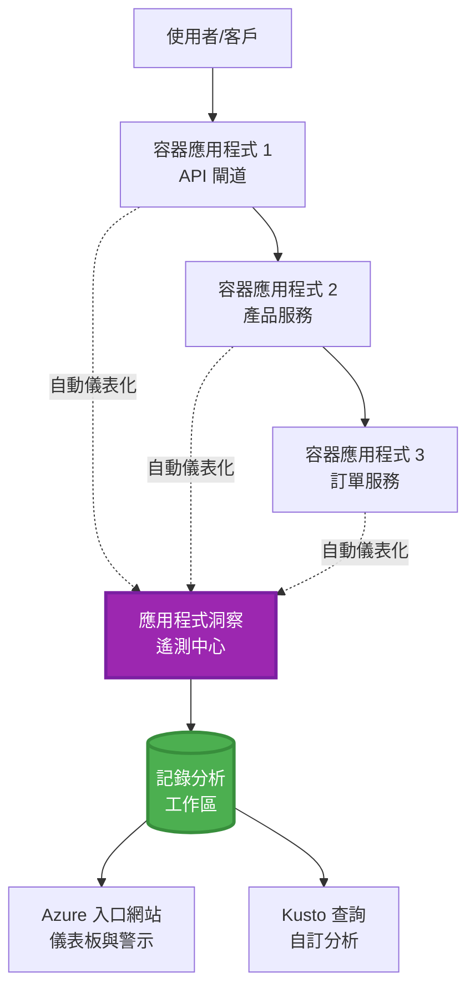
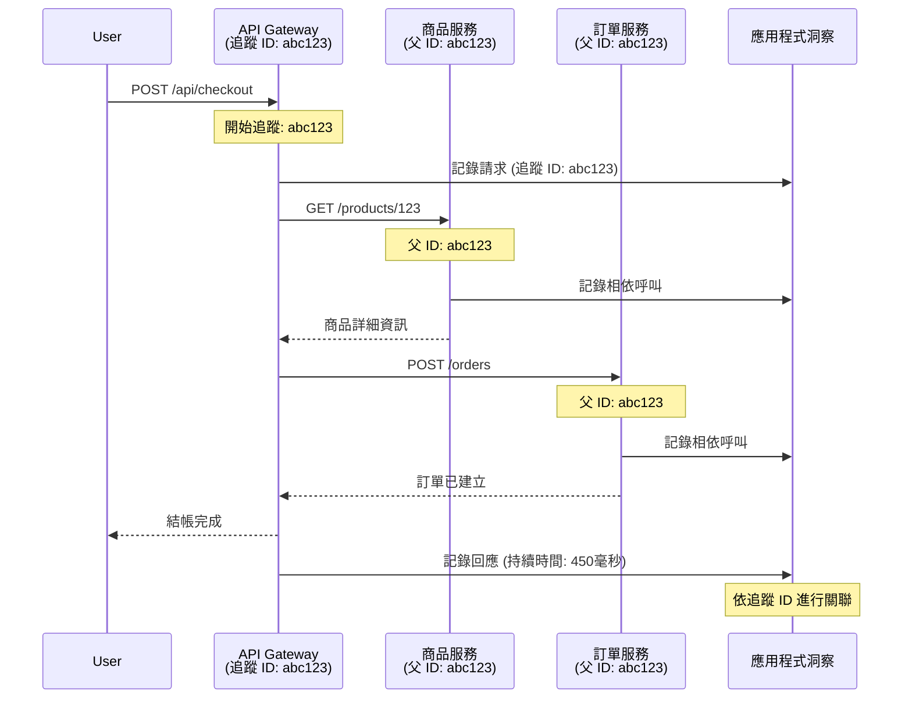

<!--
CO_OP_TRANSLATOR_METADATA:
{
  "original_hash": "e5aa37cdb6378c09099500ac31600b8c",
  "translation_date": "2025-11-19T16:40:17+00:00",
  "source_file": "docs/pre-deployment/application-insights.md",
  "language_code": "tw"
}
-->
# 與 AZD 整合 Application Insights

⏱️ **預估時間**：40-50 分鐘 | 💰 **成本影響**：每月約 $5-15 | ⭐ **複雜度**：中級

**📚 學習路徑：**
- ← 上一章：[部署前檢查](preflight-checks.md) - 部署前驗證
- 🎯 **目前位置**：Application Insights 整合（監控、遙測、除錯）
- → 下一章：[部署指南](../deployment/deployment-guide.md) - 部署至 Azure
- 🏠 [課程首頁](../../README.md)

---

## 你將學到的內容

完成本課程後，你將能：
- 自動將 **Application Insights** 整合至 AZD 專案
- 配置 **分散式追蹤** 用於微服務
- 實現 **自訂遙測**（指標、事件、依賴項）
- 設置 **即時指標** 進行即時監控
- 從 AZD 部署中建立 **警示和儀表板**
- 使用 **遙測查詢** 除錯生產問題
- 優化 **成本和抽樣策略**
- 監控 **AI/LLM 應用程式**（Token 使用量、延遲、成本）

## 為什麼 AZD 與 Application Insights 的整合很重要

### 挑戰：生產環境的可觀測性

**沒有 Application Insights：**
```
❌ No visibility into production behavior
❌ Manual log aggregation across services
❌ Reactive debugging (wait for customer complaints)
❌ No performance metrics
❌ Cannot trace requests across services
❌ Unknown failure rates and bottlenecks
```

**有 Application Insights + AZD：**
```
✅ Automatic telemetry collection
✅ Centralized logs from all services
✅ Proactive issue detection
✅ End-to-end request tracing
✅ Performance metrics and insights
✅ Real-time dashboards
✅ AZD provisions everything automatically
```

**比喻**：Application Insights 就像是應用程式的「黑盒子」飛行記錄器 + 駕駛艙儀表板。你可以即時看到所有發生的事情，並重播任何事件。

---

## 架構概述

### AZD 架構中的 Application Insights


### 自動監控的內容

| 遙測類型 | 捕捉內容 | 使用案例 |
|----------|----------|----------|
| **請求** | HTTP 請求、狀態碼、持續時間 | API 性能監控 |
| **依賴項** | 外部調用（資料庫、API、儲存） | 找出瓶頸 |
| **例外** | 未處理的錯誤及堆疊追蹤 | 除錯失敗 |
| **自訂事件** | 業務事件（註冊、購買） | 分析及漏斗 |
| **指標** | 性能計數器、自訂指標 | 容量規劃 |
| **追蹤** | 帶有嚴重性等級的日誌訊息 | 除錯及審計 |
| **可用性** | 上線時間及回應時間測試 | SLA 監控 |

---

## 先決條件

### 必需工具

```bash
# 驗證 Azure Developer CLI
azd version
# ✅ 預期：azd 版本 1.0.0 或更高

# 驗證 Azure CLI
az --version
# ✅ 預期：azure-cli 2.50.0 或更高
```

### Azure 要求

- 活躍的 Azure 訂閱
- 創建以下資源的權限：
  - Application Insights 資源
  - Log Analytics 工作區
  - Container Apps
  - 資源群組

### 知識要求

你應該已完成：
- [AZD 基礎](../getting-started/azd-basics.md) - AZD 核心概念
- [配置](../getting-started/configuration.md) - 環境設置
- [第一個專案](../getting-started/first-project.md) - 基本部署

---

## 第一課：AZD 自動整合 Application Insights

### AZD 如何配置 Application Insights

AZD 在部署時會自動創建並配置 Application Insights。以下是運作方式。

### 專案結構

```
monitored-app/
├── azure.yaml                     # AZD configuration
├── infra/
│   ├── main.bicep                # Main infrastructure
│   ├── core/
│   │   └── monitoring.bicep      # Application Insights + Log Analytics
│   └── app/
│       └── api.bicep             # Container App with monitoring
└── src/
    ├── app.py                    # Application with telemetry
    ├── requirements.txt
    └── Dockerfile
```

---

### 步驟 1：配置 AZD（azure.yaml）

**檔案：`azure.yaml`**

```yaml
name: monitored-app
metadata:
  template: monitored-app@1.0.0

services:
  api:
    project: ./src
    language: python
    host: containerapp

# AZD automatically provisions monitoring!
```

**完成了！** AZD 預設會創建 Application Insights。基本監控不需要額外配置。

---

### 步驟 2：監控基礎架構（Bicep）

**檔案：`infra/core/monitoring.bicep`**

```bicep
param logAnalyticsName string
param applicationInsightsName string
param location string = resourceGroup().location
param tags object = {}

// Log Analytics Workspace (required for Application Insights)
resource logAnalytics 'Microsoft.OperationalInsights/workspaces@2022-10-01' = {
  name: logAnalyticsName
  location: location
  tags: tags
  properties: {
    sku: {
      name: 'PerGB2018'  // Pay-as-you-go pricing
    }
    retentionInDays: 30  // Keep logs for 30 days
    features: {
      enableLogAccessUsingOnlyResourcePermissions: true
    }
  }
}

// Application Insights
resource applicationInsights 'Microsoft.Insights/components@2020-02-02' = {
  name: applicationInsightsName
  location: location
  tags: tags
  kind: 'web'
  properties: {
    Application_Type: 'web'
    WorkspaceResourceId: logAnalytics.id
    IngestionMode: 'LogAnalytics'
    publicNetworkAccessForIngestion: 'Enabled'
    publicNetworkAccessForQuery: 'Enabled'
  }
}

// Outputs for Container Apps
output logAnalyticsWorkspaceId string = logAnalytics.id
output logAnalyticsWorkspaceName string = logAnalytics.name
output applicationInsightsConnectionString string = applicationInsights.properties.ConnectionString
output applicationInsightsInstrumentationKey string = applicationInsights.properties.InstrumentationKey
output applicationInsightsName string = applicationInsights.name
```

---

### 步驟 3：將 Container App 連接至 Application Insights

**檔案：`infra/app/api.bicep`**

```bicep
param name string
param location string
param tags object = {}
param containerAppsEnvironmentName string
param applicationInsightsConnectionString string

resource containerApp 'Microsoft.App/containerApps@2023-05-01' = {
  name: name
  location: location
  tags: tags
  properties: {
    configuration: {
      ingress: {
        external: true
        targetPort: 8000
      }
      secrets: [
        {
          name: 'appinsights-connection-string'
          value: applicationInsightsConnectionString
        }
      ]
    }
    template: {
      containers: [
        {
          name: 'api'
          image: 'myregistry.azurecr.io/api:latest'
          resources: {
            cpu: json('0.5')
            memory: '1Gi'
          }
          env: [
            {
              name: 'APPLICATIONINSIGHTS_CONNECTION_STRING'
              secretRef: 'appinsights-connection-string'
            }
            {
              name: 'APPLICATIONINSIGHTS_ENABLED'
              value: 'true'
            }
          ]
        }
      ]
    }
  }
}

output uri string = 'https://${containerApp.properties.configuration.ingress.fqdn}'
```

---

### 步驟 4：應用程式代碼與遙測

**檔案：`src/app.py`**

```python
from flask import Flask, request, jsonify
from opencensus.ext.azure.log_exporter import AzureLogHandler
from opencensus.ext.azure.trace_exporter import AzureExporter
from opencensus.ext.flask.flask_middleware import FlaskMiddleware
from opencensus.trace.samplers import ProbabilitySampler
import logging
import os

app = Flask(__name__)

# 獲取應用程式洞察連接字串
connection_string = os.environ.get('APPLICATIONINSIGHTS_CONNECTION_STRING')

if connection_string:
    # 配置分散式追蹤
    middleware = FlaskMiddleware(
        app,
        exporter=AzureExporter(connection_string=connection_string),
        sampler=ProbabilitySampler(rate=1.0)  # 開發環境 100% 取樣
    )
    
    # 配置日誌記錄
    logger = logging.getLogger(__name__)
    logger.addHandler(AzureLogHandler(connection_string=connection_string))
    logger.setLevel(logging.INFO)
    
    print("✅ Application Insights enabled")
else:
    logger = logging.getLogger(__name__)
    logger.setLevel(logging.INFO)
    print("⚠️ Application Insights not configured")

@app.route('/health')
def health():
    logger.info('Health check endpoint called')
    return jsonify({'status': 'healthy', 'monitoring': 'enabled'})

@app.route('/api/products')
def get_products():
    logger.info('Fetching products')
    
    # 模擬資料庫呼叫（自動追蹤為依賴項）
    products = [
        {'id': 1, 'name': 'Laptop', 'price': 999.99},
        {'id': 2, 'name': 'Mouse', 'price': 29.99},
        {'id': 3, 'name': 'Keyboard', 'price': 79.99}
    ]
    
    logger.info(f'Returned {len(products)} products')
    return jsonify(products)

@app.route('/api/error-test')
def error_test():
    """Test error tracking"""
    logger.error('Testing error tracking')
    try:
        raise ValueError('This is a test exception')
    except Exception as e:
        logger.exception('Exception occurred in error-test endpoint')
        return jsonify({'error': str(e)}), 500

@app.route('/api/slow')
def slow_endpoint():
    """Test performance tracking"""
    import time
    logger.info('Slow endpoint called')
    time.sleep(3)  # 模擬慢速操作
    logger.warning('Endpoint took 3 seconds to respond')
    return jsonify({'message': 'Slow operation completed'})

if __name__ == '__main__':
    app.run(host='0.0.0.0', port=8000)
```

**檔案：`src/requirements.txt`**

```txt
Flask==3.0.0
opencensus-ext-azure==1.1.13
opencensus-ext-flask==0.8.1
gunicorn==21.2.0
```

---

### 步驟 5：部署並驗證

```bash
# 初始化 AZD
azd init

# 部署（自動配置 Application Insights）
azd up

# 獲取應用程式 URL
APP_URL=$(azd env get-values | grep API_URL | cut -d '=' -f2 | tr -d '"')

# 生成遙測數據
curl $APP_URL/health
curl $APP_URL/api/products
curl $APP_URL/api/error-test
curl $APP_URL/api/slow
```

**✅ 預期輸出：**
```json
{
  "status": "healthy",
  "monitoring": "enabled"
}
```

---

### 步驟 6：在 Azure Portal 中查看遙測

```bash
# 取得應用程式洞察詳細資訊
azd env get-values | grep APPLICATIONINSIGHTS

# 在 Azure 入口網站中開啟
az monitor app-insights component show \
  --app $(azd env get-values | grep APPLICATIONINSIGHTS_NAME | cut -d '=' -f2 | tr -d '"') \
  --resource-group $(azd env get-values | grep AZURE_RESOURCE_GROUP | cut -d '=' -f2 | tr -d '"') \
  --query "appId" -o tsv
```

**前往 Azure Portal → Application Insights → Transaction Search**

你應該看到：
- ✅ HTTP 請求及狀態碼
- ✅ 請求持續時間（`/api/slow` 超過 3 秒）
- ✅ `/api/error-test` 的例外詳情
- ✅ 自訂日誌訊息

---

## 第二課：自訂遙測及事件

### 追蹤業務事件

讓我們為業務關鍵事件添加自訂遙測。

**檔案：`src/telemetry.py`**

```python
from opencensus.ext.azure import metrics_exporter
from opencensus.stats import aggregation as aggregation_module
from opencensus.stats import measure as measure_module
from opencensus.stats import stats as stats_module
from opencensus.stats import view as view_module
from opencensus.tags import tag_map as tag_map_module
from opencensus.ext.azure.log_exporter import AzureLogHandler
from opencensus.ext.azure.trace_exporter import AzureExporter
from opencensus.trace import tracer as tracer_module
import logging
import os

class TelemetryClient:
    """Custom telemetry client for Application Insights"""
    
    def __init__(self, connection_string=None):
        self.connection_string = connection_string or os.environ.get('APPLICATIONINSIGHTS_CONNECTION_STRING')
        
        if not self.connection_string:
            print("⚠️ Application Insights connection string not found")
            return
        
        # 設置記錄器
        self.logger = logging.getLogger(__name__)
        self.logger.addHandler(AzureLogHandler(connection_string=self.connection_string))
        self.logger.setLevel(logging.INFO)
        
        # 設置指標匯出器
        self.stats = stats_module.stats
        self.view_manager = self.stats.view_manager
        self.stats_recorder = self.stats.stats_recorder
        
        exporter = metrics_exporter.new_metrics_exporter(
            connection_string=self.connection_string
        )
        self.view_manager.register_exporter(exporter)
        
        # 設置追蹤器
        self.tracer = tracer_module.Tracer(
            exporter=AzureExporter(connection_string=self.connection_string)
        )
        
        print("✅ Custom telemetry client initialized")
    
    def track_event(self, event_name: str, properties: dict = None):
        """Track custom business event"""
        properties = properties or {}
        self.logger.info(
            f"CustomEvent: {event_name}",
            extra={
                'custom_dimensions': {
                    'event_name': event_name,
                    **properties
                }
            }
        )
    
    def track_metric(self, metric_name: str, value: float, properties: dict = None):
        """Track custom metric"""
        properties = properties or {}
        self.logger.info(
            f"CustomMetric: {metric_name} = {value}",
            extra={
                'custom_dimensions': {
                    'metric_name': metric_name,
                    'value': value,
                    **properties
                }
            }
        )
    
    def track_dependency(self, name: str, dependency_type: str, duration: float, success: bool):
        """Track external dependency call"""
        with self.tracer.span(name=name) as span:
            span.add_attribute('dependency.type', dependency_type)
            span.add_attribute('duration', duration)
            span.add_attribute('success', success)

# 全域遙測客戶端
telemetry = TelemetryClient()
```

### 更新應用程式以包含自訂事件

**檔案：`src/app.py`（增強版）**

```python
from flask import Flask, request, jsonify
from telemetry import telemetry
import time
import random

app = Flask(__name__)

@app.route('/api/purchase', methods=['POST'])
def purchase():
    """Track purchase event with custom telemetry"""
    data = request.json
    product_id = data.get('product_id')
    quantity = data.get('quantity', 1)
    price = data.get('price', 0)
    
    # 追蹤商業事件
    telemetry.track_event('Purchase', {
        'product_id': product_id,
        'quantity': quantity,
        'total_amount': price * quantity,
        'user_id': request.headers.get('X-User-Id', 'anonymous')
    })
    
    # 追蹤收入指標
    telemetry.track_metric('Revenue', price * quantity, {
        'product_id': product_id,
        'currency': 'USD'
    })
    
    return jsonify({
        'order_id': f'ORD-{random.randint(1000, 9999)}',
        'status': 'confirmed',
        'total': price * quantity
    })

@app.route('/api/search')
def search():
    """Track search queries"""
    query = request.args.get('q', '')
    
    start_time = time.time()
    
    # 模擬搜尋（將是實際的資料庫查詢）
    results = [{'id': 1, 'name': f'Result for {query}'}]
    
    duration = (time.time() - start_time) * 1000  # 轉換為毫秒
    
    # 追蹤搜尋事件
    telemetry.track_event('Search', {
        'query': query,
        'results_count': len(results),
        'duration_ms': duration
    })
    
    # 追蹤搜尋效能指標
    telemetry.track_metric('SearchDuration', duration, {
        'query_length': len(query)
    })
    
    return jsonify({'results': results, 'count': len(results)})

@app.route('/api/external-call')
def external_call():
    """Track external API dependency"""
    import requests
    
    start_time = time.time()
    success = True
    
    try:
        # 模擬外部 API 呼叫
        response = requests.get('https://api.example.com/data', timeout=5)
        result = response.json()
    except Exception as e:
        success = False
        result = {'error': str(e)}
    
    duration = (time.time() - start_time) * 1000
    
    # 追蹤依賴性
    telemetry.track_dependency(
        name='ExternalAPI',
        dependency_type='HTTP',
        duration=duration,
        success=success
    )
    
    return jsonify(result)

if __name__ == '__main__':
    app.run(host='0.0.0.0', port=8000)
```

### 測試自訂遙測

```bash
# 追蹤購買事件
curl -X POST $APP_URL/api/purchase \
  -H "Content-Type: application/json" \
  -H "X-User-Id: user123" \
  -d '{"product_id": 1, "quantity": 2, "price": 29.99}'

# 追蹤搜尋事件
curl "$APP_URL/api/search?q=laptop"

# 追蹤外部依賴
curl $APP_URL/api/external-call
```

**在 Azure Portal 中查看：**

前往 Application Insights → Logs，然後執行：

```kusto
// View purchase events
traces
| where customDimensions.event_name == "Purchase"
| project 
    timestamp,
    product_id = tostring(customDimensions.product_id),
    total_amount = todouble(customDimensions.total_amount),
    user_id = tostring(customDimensions.user_id)
| order by timestamp desc

// View revenue metrics
traces
| where customDimensions.metric_name == "Revenue"
| summarize TotalRevenue = sum(todouble(customDimensions.value)) by bin(timestamp, 1h)
| render timechart

// View search performance
traces
| where customDimensions.event_name == "Search"
| summarize 
    AvgDuration = avg(todouble(customDimensions.duration_ms)),
    SearchCount = count()
  by bin(timestamp, 5m)
| render timechart
```

---

## 第三課：微服務的分散式追蹤

### 啟用跨服務追蹤

對於微服務，Application Insights 會自動關聯跨服務的請求。

**檔案：`infra/main.bicep`**

```bicep
targetScope = 'subscription'

param environmentName string
param location string = 'eastus'

var tags = { 'azd-env-name': environmentName }

resource rg 'Microsoft.Resources/resourceGroups@2021-04-01' = {
  name: 'rg-${environmentName}'
  location: location
  tags: tags
}

// Monitoring (shared by all services)
module monitoring './core/monitoring.bicep' = {
  name: 'monitoring'
  scope: rg
  params: {
    logAnalyticsName: 'log-${environmentName}'
    applicationInsightsName: 'appi-${environmentName}'
    location: location
    tags: tags
  }
}

// API Gateway
module apiGateway './app/api-gateway.bicep' = {
  name: 'api-gateway'
  scope: rg
  params: {
    name: 'ca-gateway-${environmentName}'
    location: location
    tags: union(tags, { 'azd-service-name': 'gateway' })
    applicationInsightsConnectionString: monitoring.outputs.applicationInsightsConnectionString
  }
}

// Product Service
module productService './app/product-service.bicep' = {
  name: 'product-service'
  scope: rg
  params: {
    name: 'ca-products-${environmentName}'
    location: location
    tags: union(tags, { 'azd-service-name': 'products' })
    applicationInsightsConnectionString: monitoring.outputs.applicationInsightsConnectionString
  }
}

// Order Service
module orderService './app/order-service.bicep' = {
  name: 'order-service'
  scope: rg
  params: {
    name: 'ca-orders-${environmentName}'
    location: location
    tags: union(tags, { 'azd-service-name': 'orders' })
    applicationInsightsConnectionString: monitoring.outputs.applicationInsightsConnectionString
  }
}

output APPLICATIONINSIGHTS_CONNECTION_STRING string = monitoring.outputs.applicationInsightsConnectionString
output GATEWAY_URL string = apiGateway.outputs.uri
```

### 查看端到端交易


**查詢端到端追蹤：**

```kusto
// Find complete request flow
let traceId = "abc123...";  // Get from response header
dependencies
| union requests
| where operation_Id == traceId
| project 
    timestamp,
    type = itemType,
    name,
    duration,
    success,
    cloud_RoleName
| order by timestamp asc
```

---

## 第四課：即時指標及即時監控

### 啟用即時指標流

即時指標提供 <1 秒延遲的即時遙測。

**訪問即時指標：**

```bash
# 取得 Application Insights 資源
APPI_NAME=$(azd env get-values | grep APPLICATIONINSIGHTS_NAME | cut -d '=' -f2 | tr -d '"')

# 取得資源群組
RG_NAME=$(azd env get-values | grep AZURE_RESOURCE_GROUP | cut -d '=' -f2 | tr -d '"')

echo "Navigate to: Azure Portal → Resource Groups → $RG_NAME → $APPI_NAME → Live Metrics"
```

**即時看到的內容：**
- ✅ 輸入請求速率（請求/秒）
- ✅ 輸出依賴調用
- ✅ 例外次數
- ✅ CPU 和記憶體使用率
- ✅ 活躍伺服器數量
- ✅ 抽樣遙測

### 生成負載進行測試

```bash
# 產生負載以查看即時指標
for i in {1..100}; do
  curl $APP_URL/api/products &
  curl $APP_URL/api/search?q=test$i &
done

# 在 Azure Portal 中查看即時指標
# 您應該會看到請求速率激增
```

---

## 實作練習

### 練習 1：設置警示 ⭐⭐（中級）

**目標**：為高錯誤率及慢回應設置警示。

**步驟：**

1. **創建錯誤率警示：**

```bash
# 取得 Application Insights 資源 ID
APPI_ID=$(az monitor app-insights component show \
  --app $APPI_NAME \
  --resource-group $RG_NAME \
  --query "id" -o tsv)

# 為失敗的請求建立度量警報
az monitor metrics alert create \
  --name "High-Error-Rate" \
  --resource-group $RG_NAME \
  --scopes $APPI_ID \
  --condition "count requests/failed > 10" \
  --window-size 5m \
  --evaluation-frequency 1m \
  --description "Alert when error rate exceeds 10 per 5 minutes"
```

2. **創建慢回應警示：**

```bash
az monitor metrics alert create \
  --name "Slow-Responses" \
  --resource-group $RG_NAME \
  --scopes $APPI_ID \
  --condition "avg requests/duration > 3000" \
  --window-size 5m \
  --evaluation-frequency 1m \
  --description "Alert when average response time exceeds 3 seconds"
```

3. **通過 Bicep 創建警示（AZD 的首選方式）：**

**檔案：`infra/core/alerts.bicep`**

```bicep
param applicationInsightsId string
param actionGroupId string = ''
param location string = resourceGroup().location

// High error rate alert
resource errorRateAlert 'Microsoft.Insights/metricAlerts@2018-03-01' = {
  name: 'high-error-rate'
  location: 'global'
  properties: {
    description: 'Alert when error rate exceeds threshold'
    severity: 2
    enabled: true
    scopes: [
      applicationInsightsId
    ]
    evaluationFrequency: 'PT1M'
    windowSize: 'PT5M'
    criteria: {
      'odata.type': 'Microsoft.Azure.Monitor.SingleResourceMultipleMetricCriteria'
      allOf: [
        {
          name: 'Error rate'
          metricName: 'requests/failed'
          operator: 'GreaterThan'
          threshold: 10
          timeAggregation: 'Count'
        }
      ]
    }
    actions: actionGroupId != '' ? [
      {
        actionGroupId: actionGroupId
      }
    ] : []
  }
}

// Slow response alert
resource slowResponseAlert 'Microsoft.Insights/metricAlerts@2018-03-01' = {
  name: 'slow-responses'
  location: 'global'
  properties: {
    description: 'Alert when response time is too high'
    severity: 3
    enabled: true
    scopes: [
      applicationInsightsId
    ]
    evaluationFrequency: 'PT1M'
    windowSize: 'PT5M'
    criteria: {
      'odata.type': 'Microsoft.Azure.Monitor.SingleResourceMultipleMetricCriteria'
      allOf: [
        {
          name: 'Response duration'
          metricName: 'requests/duration'
          operator: 'GreaterThan'
          threshold: 3000
          timeAggregation: 'Average'
        }
      ]
    }
  }
}

output errorAlertId string = errorRateAlert.id
output slowResponseAlertId string = slowResponseAlert.id
```

4. **測試警示：**

```bash
# 產生錯誤
for i in {1..20}; do
  curl $APP_URL/api/error-test
done

# 產生緩慢回應
for i in {1..10}; do
  curl $APP_URL/api/slow
done

# 檢查警報狀態（等待5-10分鐘）
az monitor metrics alert list \
  --resource-group $RG_NAME \
  --query "[].{Name:name, Enabled:enabled, State:properties.enabled}" \
  --output table
```

**✅ 成功標準：**
- ✅ 成功創建警示
- ✅ 當超過閾值時警示觸發
- ✅ 可在 Azure Portal 中查看警示歷史
- ✅ 與 AZD 部署集成

**時間**：20-25 分鐘

---

### 練習 2：創建自訂儀表板 ⭐⭐（中級）

**目標**：建立顯示關鍵應用程式指標的儀表板。

**步驟：**

1. **通過 Azure Portal 創建儀表板：**

前往：Azure Portal → Dashboards → New Dashboard

2. **添加關鍵指標的圖塊：**

- 請求數量（過去 24 小時）
- 平均回應時間
- 錯誤率
- 最慢的 5 個操作
- 使用者的地理分佈

3. **通過 Bicep 創建儀表板：**

**檔案：`infra/core/dashboard.bicep`**

```bicep
param dashboardName string
param applicationInsightsId string
param location string = resourceGroup().location

resource dashboard 'Microsoft.Portal/dashboards@2020-09-01-preview' = {
  name: dashboardName
  location: location
  properties: {
    lenses: [
      {
        order: 0
        parts: [
          // Request count
          {
            position: { x: 0, y: 0, rowSpan: 4, colSpan: 6 }
            metadata: {
              type: 'Extension/Microsoft_OperationsManagementSuite_Workspace/PartType/LogsDashboardPart'
              inputs: [
                {
                  name: 'resourceId'
                  value: applicationInsightsId
                }
                {
                  name: 'query'
                  value: '''
                    requests
                    | summarize RequestCount = count() by bin(timestamp, 1h)
                    | render timechart
                  '''
                }
              ]
            }
          }
          // Error rate
          {
            position: { x: 6, y: 0, rowSpan: 4, colSpan: 6 }
            metadata: {
              type: 'Extension/Microsoft_OperationsManagementSuite_Workspace/PartType/LogsDashboardPart'
              inputs: [
                {
                  name: 'resourceId'
                  value: applicationInsightsId
                }
                {
                  name: 'query'
                  value: '''
                    requests
                    | summarize 
                        Total = count(),
                        Failed = countif(success == false)
                    | extend ErrorRate = (Failed * 100.0) / Total
                    | project ErrorRate
                  '''
                }
              ]
            }
          }
        ]
      }
    ]
  }
}

output dashboardId string = dashboard.id
```

4. **部署儀表板：**

```bash
# 添加到 main.bicep
module dashboard './core/dashboard.bicep' = {
  name: 'dashboard'
  scope: rg
  params: {
    dashboardName: 'dashboard-${environmentName}'
    applicationInsightsId: monitoring.outputs.applicationInsightsId
    location: location
  }
}

# 部署
azd up
```

**✅ 成功標準：**
- ✅ 儀表板顯示關鍵指標
- ✅ 可固定至 Azure Portal 首頁
- ✅ 即時更新
- ✅ 可通過 AZD 部署

**時間**：25-30 分鐘

---

### 練習 3：監控 AI/LLM 應用程式 ⭐⭐⭐（高級）

**目標**：追蹤 Azure OpenAI 使用情況（Token、成本、延遲）。

**步驟：**

1. **創建 AI 監控包裝器：**

**檔案：`src/ai_telemetry.py`**

```python
from telemetry import telemetry
from openai import AzureOpenAI
import time

class MonitoredAzureOpenAI:
    """Azure OpenAI client with automatic telemetry"""
    
    def __init__(self, api_key, endpoint, api_version="2024-02-01"):
        self.client = AzureOpenAI(
            api_key=api_key,
            api_version=api_version,
            azure_endpoint=endpoint
        )
    
    def chat_completion(self, model: str, messages: list, **kwargs):
        """Track chat completion with telemetry"""
        start_time = time.time()
        
        try:
            # 呼叫 Azure OpenAI
            response = self.client.chat.completions.create(
                model=model,
                messages=messages,
                **kwargs
            )
            
            duration = (time.time() - start_time) * 1000  # 毫秒
            
            # 提取使用量
            usage = response.usage
            prompt_tokens = usage.prompt_tokens
            completion_tokens = usage.completion_tokens
            total_tokens = usage.total_tokens
            
            # 計算成本（GPT-4 價格）
            prompt_cost = (prompt_tokens / 1000) * 0.03  # 每 1K tokens $0.03
            completion_cost = (completion_tokens / 1000) * 0.06  # 每 1K tokens $0.06
            total_cost = prompt_cost + completion_cost
            
            # 追蹤自訂事件
            telemetry.track_event('OpenAI_Request', {
                'model': model,
                'prompt_tokens': prompt_tokens,
                'completion_tokens': completion_tokens,
                'total_tokens': total_tokens,
                'duration_ms': duration,
                'cost_usd': total_cost,
                'success': True
            })
            
            # 追蹤指標
            telemetry.track_metric('OpenAI_Tokens', total_tokens, {
                'model': model,
                'type': 'total'
            })
            
            telemetry.track_metric('OpenAI_Cost', total_cost, {
                'model': model,
                'currency': 'USD'
            })
            
            telemetry.track_metric('OpenAI_Duration', duration, {
                'model': model
            })
            
            return response
            
        except Exception as e:
            duration = (time.time() - start_time) * 1000
            
            telemetry.track_event('OpenAI_Request', {
                'model': model,
                'duration_ms': duration,
                'success': False,
                'error': str(e)
            })
            
            raise
```

2. **使用監控的客戶端：**

```python
from flask import Flask, request, jsonify
from ai_telemetry import MonitoredAzureOpenAI
import os

app = Flask(__name__)

# 初始化受監控的 OpenAI 客戶端
openai_client = MonitoredAzureOpenAI(
    api_key=os.environ['AZURE_OPENAI_API_KEY'],
    endpoint=os.environ['AZURE_OPENAI_ENDPOINT']
)

@app.route('/api/chat', methods=['POST'])
def chat():
    data = request.json
    user_message = data.get('message')
    
    # 使用自動監控進行呼叫
    response = openai_client.chat_completion(
        model='gpt-4',
        messages=[
            {'role': 'user', 'content': user_message}
        ]
    )
    
    return jsonify({
        'response': response.choices[0].message.content,
        'tokens': response.usage.total_tokens
    })
```

3. **查詢 AI 指標：**

```kusto
// Total AI spend over time
traces
| where customDimensions.event_name == "OpenAI_Request"
| where customDimensions.success == "True"
| summarize TotalCost = sum(todouble(customDimensions.cost_usd)) by bin(timestamp, 1h)
| render timechart

// Token usage by model
traces
| where customDimensions.event_name == "OpenAI_Request"
| summarize 
    TotalTokens = sum(toint(customDimensions.total_tokens)),
    RequestCount = count()
  by Model = tostring(customDimensions.model)

// Average latency
traces
| where customDimensions.event_name == "OpenAI_Request"
| summarize AvgDuration = avg(todouble(customDimensions.duration_ms))
| project AvgDurationSeconds = AvgDuration / 1000

// Cost per request
traces
| where customDimensions.event_name == "OpenAI_Request"
| extend Cost = todouble(customDimensions.cost_usd)
| summarize 
    TotalCost = sum(Cost),
    RequestCount = count(),
    AvgCostPerRequest = avg(Cost)
```

**✅ 成功標準：**
- ✅ 每次 OpenAI 調用自動追蹤
- ✅ Token 使用量及成本可見
- ✅ 延遲被監控
- ✅ 可設置預算警示

**時間**：35-45 分鐘

---

## 成本優化

### 抽樣策略

通過抽樣遙測控制成本：

```python
from opencensus.trace.samplers import ProbabilitySampler

# 開發：100% 取樣
sampler = ProbabilitySampler(rate=1.0)

# 生產：10% 取樣（降低成本 90%）
sampler = ProbabilitySampler(rate=0.1)

# 自適應取樣（自動調整）
from opencensus.trace.samplers import AdaptiveSampler
sampler = AdaptiveSampler()
```

**在 Bicep 中：**

```bicep
resource applicationInsights 'Microsoft.Insights/components@2020-02-02' = {
  name: applicationInsightsName
  properties: {
    SamplingPercentage: 10  // 10% sampling
  }
}
```

### 資料保留

```bicep
resource logAnalytics 'Microsoft.OperationalInsights/workspaces@2022-10-01' = {
  name: logAnalyticsName
  properties: {
    retentionInDays: 30  // Minimum (cheapest)
    // Options: 30, 31, 60, 90, 120, 180, 270, 365, 550, 730
  }
}
```

### 每月成本估算

| 資料量 | 保留期 | 每月成本 |
|--------|--------|----------|
| 1 GB/月 | 30 天 | ~$2-5 |
| 5 GB/月 | 30 天 | ~$10-15 |
| 10 GB/月 | 90 天 | ~$25-40 |
| 50 GB/月 | 90 天 | ~$100-150 |

**免費層**：包含 5 GB/月

---

## 知識檢查點

### 1. 基本整合 ✓

測試你的理解：

- [ ] **Q1**：AZD 如何配置 Application Insights？
  - **A**：通過 `infra/core/monitoring.bicep` 中的 Bicep 模板自動完成

- [ ] **Q2**：哪個環境變數啟用 Application Insights？
  - **A**：`APPLICATIONINSIGHTS_CONNECTION_STRING`

- [ ] **Q3**：三個主要的遙測類型是什麼？
  - **A**：請求（HTTP 調用）、依賴項（外部調用）、例外（錯誤）

**實作驗證：**
```bash
# 檢查是否已配置 Application Insights
azd env get-values | grep APPLICATIONINSIGHTS

# 驗證遙測是否正在傳送
az monitor app-insights metrics show \
  --app $APPI_NAME \
  --resource-group $RG_NAME \
  --metric "requests/count"
```

---

### 2. 自訂遙測 ✓

測試你的理解：

- [ ] **Q1**：如何追蹤自訂業務事件？
  - **A**：使用帶有 `custom_dimensions` 的 logger 或 `TelemetryClient.track_event()`

- [ ] **Q2**：事件與指標的區別是什麼？
  - **A**：事件是離散的發生，指標是數值測量

- [ ] **Q3**：如何關聯跨服務的遙測？
  - **A**：Application Insights 自動使用 `operation_Id` 進行關聯

**實作驗證：**
```kusto
// Verify custom events
traces
| where customDimensions.event_name != ""
| summarize count() by tostring(customDimensions.event_name)
```

---

### 3. 生產監控 ✓

測試你的理解：

- [ ] **Q1**：什麼是抽樣？為什麼要使用它？
  - **A**：抽樣通過僅捕捉部分遙測來減少資料量（及成本）

- [ ] **Q2**：如何設置警示？
  - **A**：根據 Application Insights 指標，在 Bicep 或 Azure Portal 中設置指標警示

- [ ] **Q3**：Log Analytics 與 Application Insights 的區別是什麼？
  - **A**：Application Insights 將資料存儲在 Log Analytics 工作區；App Insights 提供應用程式特定的視圖

**實作驗證：**
```bash
# 檢查取樣配置
az monitor app-insights component show \
  --app $APPI_NAME \
  --resource-group $RG_NAME \
  --query "properties.SamplingPercentage"
```

---

## 最佳實踐

### ✅ 建議：

1. **使用關聯 ID**
   ```python
   logger.info('Processing order', extra={
       'custom_dimensions': {
           'order_id': order_id,
           'user_id': user_id
       }
   })
   ```

2. **為關鍵指標設置警示**
   ```bicep
   // Error rate, slow responses, availability
   ```

3. **使用結構化日誌**
   ```python
   # ✅ 好的：結構化
   logger.info('User signup', extra={'custom_dimensions': {'user_id': 123}})
   
   # ❌ 不好的：非結構化
   logger.info(f'User 123 signed up')
   ```

4. **監控依賴項**
   ```python
   # 自動追蹤資料庫呼叫、HTTP請求等。
   ```

5. **在部署期間使用即時指標**

### ❌ 避免：

1. **不要記錄敏感資料**
   ```python
   # ❌ 不好
   logger.info(f'Login: {username}:{password}')
   
   # ✅ 好
   logger.info('Login attempt', extra={'custom_dimensions': {'username': username}})
   ```

2. **不要在生產環境中使用 100% 抽樣**
   ```python
   # ❌ 昂貴
   sampler = ProbabilitySampler(rate=1.0)
   
   # ✅ 划算
   sampler = ProbabilitySampler(rate=0.1)
   ```

3. **不要忽略死信佇列**

4. **不要忘記設置資料保留限制**

---

## 疑難排解

### 問題：沒有遙測出現

**診斷：**
```bash
# 檢查連接字串是否已設定
azd env get-values | grep APPLICATIONINSIGHTS

# 檢查應用程式日誌
azd logs api --tail 50
```

**解決方案：**
```bash
# 驗證容器應用程式中的連接字串
az containerapp show \
  --name $APP_NAME \
  --resource-group $RG_NAME \
  --query "properties.template.containers[0].env" \
  | grep -i applicationinsights
```

---

### 問題：成本過高

**診斷：**
```bash
# 檢查資料攝取
az monitor app-insights metrics show \
  --app $APPI_NAME \
  --resource-group $RG_NAME \
  --metric "availabilityResults/count"
```

**解決方案：**
- 降低抽樣率
- 縮短保留期
- 移除冗長日誌

---

## 延伸學習

### 官方文件
- [Application Insights 概述](https://learn.microsoft.com/azure/azure-monitor/app/app-insights-overview)
- [Python 的 Application Insights](https://learn.microsoft.com/azure/azure-monitor/app/opencensus-python)
- [Kusto 查詢語言](https://learn.microsoft.com/azure/data-explorer/kusto/query/)
- [AZD 監控](https://learn.microsoft.com/azure/developer/azure-developer-cli/monitor-your-app)

### 本課程的下一步
- ← 上一章：[部署前檢查](preflight-checks.md)
- → 下一章：[部署指南](../deployment/deployment-guide.md)
- 🏠 [課程首頁](../../README.md)

### 相關範例
- [Azure OpenAI 範例](../../../../examples/azure-openai-chat) - AI 遙測
- [微服務範例](../../../../examples/microservices) - 分散式追蹤

---

## 總結

**你已學到：**
- ✅ 使用 AZD 自動配置 Application Insights
- ✅ 自訂遙測（事件、指標、依賴項）
- ✅ 微服務的分散式追蹤
- ✅ 即時指標及即時監控
- ✅ 警示及儀表板
- ✅ AI/LLM 應用程式監控  
- ✅ 成本優化策略  

**重點摘要：**  
1. **AZD 自動配置監控** - 無需手動設定  
2. **使用結構化日誌** - 使查詢更簡單  
3. **追蹤業務事件** - 不僅僅是技術指標  
4. **監控 AI 成本** - 追蹤 tokens 和支出  
5. **設置警報** - 主動應對，而非被動反應  
6. **優化成本** - 使用抽樣和保留限制  

**下一步：**  
1. 完成實作練習  
2. 將 Application Insights 添加到您的 AZD 專案中  
3. 為您的團隊建立自訂儀表板  
4. 學習 [部署指南](../deployment/deployment-guide.md)  

---

<!-- CO-OP TRANSLATOR DISCLAIMER START -->
**免責聲明**：  
本文件使用 AI 翻譯服務 [Co-op Translator](https://github.com/Azure/co-op-translator) 進行翻譯。雖然我們致力於提供準確的翻譯，但請注意，自動翻譯可能包含錯誤或不準確之處。原始文件的母語版本應被視為權威來源。對於關鍵資訊，建議使用專業人工翻譯。我們對因使用此翻譯而引起的任何誤解或誤釋不承擔責任。
<!-- CO-OP TRANSLATOR DISCLAIMER END -->