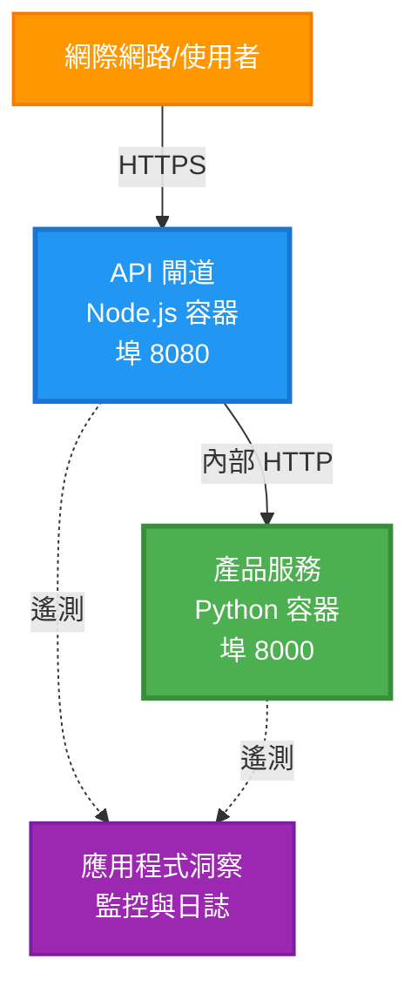
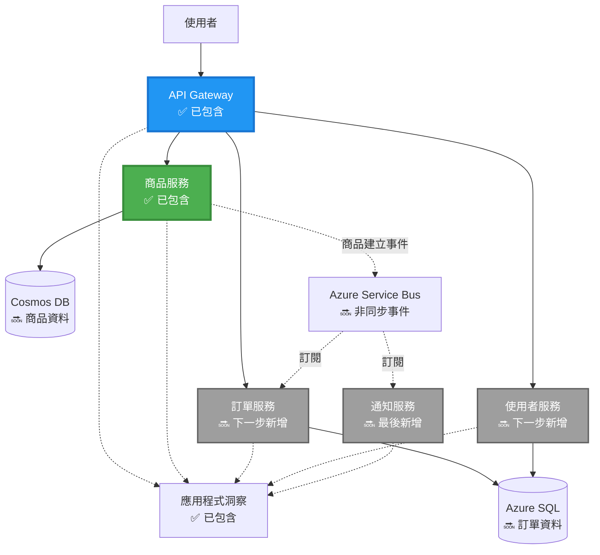
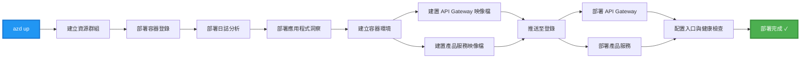
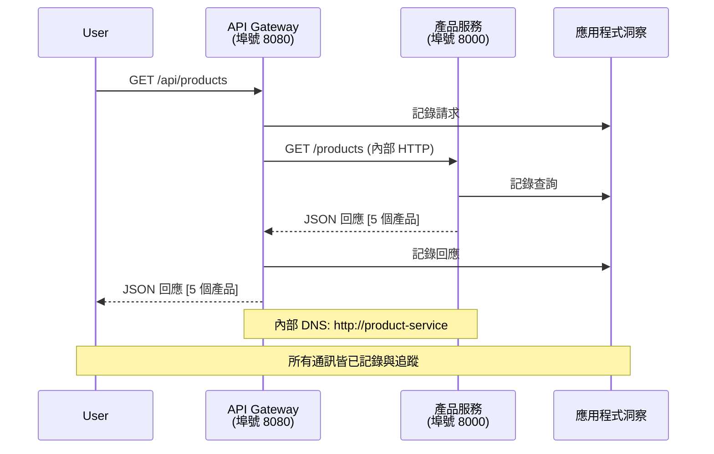

<!--
CO_OP_TRANSLATOR_METADATA:
{
  "original_hash": "eb3a4803a1e80a7f2e64f6bf63738c0f",
  "translation_date": "2025-11-19T16:17:57+00:00",
  "source_file": "examples/microservices/README.md",
  "language_code": "tw"
}
-->
# 微服務架構 - 容器應用範例

⏱️ **預估時間**：25-35 分鐘 | 💰 **預估成本**：~$50-100/月 | ⭐ **複雜度**：進階

**📚 學習路徑：**
- ← 前一章：[簡單 Flask API](../../../../examples/container-app/simple-flask-api) - 單一容器基礎
- 🎯 **目前位置**：微服務架構（兩個服務的基礎）
- → 下一章：[AI 整合](../../../../docs/ai-foundry) - 為服務添加智能功能
- 🏠 [課程首頁](../../README.md)

---

一個**簡化但功能完整**的微服務架構，使用 AZD CLI 部署到 Azure 容器應用。本範例展示了服務間通信、容器編排以及監控，並提供實用的兩個服務設置。

> **📚 學習方式**：此範例以最小的兩個服務架構（API Gateway + 後端服務）開始，您可以實際部署並學習。在掌握此基礎後，我們提供擴展到完整微服務生態系統的指導。

## 您將學到的內容

完成此範例後，您將能：
- 部署多個容器到 Azure 容器應用
- 使用內部網路實現服務間通信
- 配置基於環境的擴展和健康檢查
- 使用 Application Insights 監控分散式應用
- 理解微服務部署模式及最佳實踐
- 從簡單架構逐步擴展到複雜架構

## 架構

### 第一階段：我們正在構建的內容（此範例包含）


**元件詳情：**

| 元件 | 目的 | 存取 | 資源 |
|------|------|------|------|
| **API Gateway** | 將外部請求路由到後端服務 | 公開 (HTTPS) | 1 vCPU, 2GB RAM, 2-20 副本 |
| **產品服務** | 使用記憶體管理產品目錄 | 僅內部 | 0.5 vCPU, 1GB RAM, 1-10 副本 |
| **Application Insights** | 集中式日誌記錄和分散式追蹤 | Azure Portal | 每月 1-2 GB 資料攝取 |

**為什麼從簡單開始？**
- ✅ 快速部署並理解（25-35 分鐘）
- ✅ 學習核心微服務模式而不增加複雜性
- ✅ 可修改和實驗的工作代碼
- ✅ 學習成本較低（~$50-100/月 vs $300-1400/月）
- ✅ 在添加資料庫和消息隊列之前建立信心

**比喻**：這就像學開車。您先從空的停車場（兩個服務）開始，掌握基礎，然後進入城市交通（5+ 服務加上資料庫）。

### 第二階段：未來擴展（參考架構）

當您掌握了兩個服務架構後，可以擴展到：


請參閱文末的“擴展指南”部分以獲得逐步指導。

## 包含的功能

✅ **服務發現**：基於 DNS 的容器間自動發現  
✅ **負載均衡**：內建的副本間負載均衡  
✅ **自動擴展**：基於 HTTP 請求的獨立服務擴展  
✅ **健康監控**：兩個服務的存活性和準備性探測  
✅ **分散式日誌記錄**：使用 Application Insights 集中式日誌記錄  
✅ **內部網路**：安全的服務間通信  
✅ **容器編排**：自動部署和擴展  
✅ **零停機更新**：滾動更新和版本管理  

## 先決條件

### 必需工具

開始之前，請確認您已安裝以下工具：

1. **[Azure Developer CLI (azd)](https://learn.microsoft.com/azure/developer/azure-developer-cli/install-azd)**（版本 1.0.0 或更高）
   ```bash
   azd version
   # 預期輸出：azd 版本 1.0.0 或更高版本
   ```

2. **[Azure CLI](https://learn.microsoft.com/cli/azure/install-azure-cli)**（版本 2.50.0 或更高）
   ```bash
   az --version
   # 預期輸出：azure-cli 2.50.0 或更高版本
   ```

3. **[Docker](https://www.docker.com/get-started)**（用於本地開發/測試 - 可選）
   ```bash
   docker --version
   # 預期輸出：Docker 版本 20.10 或更高
   ```

### 驗證您的設置

執行以下命令以確認您已準備好：

```bash
# 檢查 Azure Developer CLI
azd version
# ✅ 預期：azd 版本 1.0.0 或更高

# 檢查 Azure CLI
az --version
# ✅ 預期：azure-cli 2.50.0 或更高

# 檢查 Docker（可選）
docker --version
# ✅ 預期：Docker 版本 20.10 或更高
```

**成功標準**：所有命令返回的版本號符合或超過最低要求。

### Azure 要求

- 一個有效的 **Azure 訂閱**（[創建免費帳戶](https://azure.microsoft.com/free/)）
- 創建資源的許可權
- 訂閱或資源群組的 **Contributor** 角色

### 知識要求

這是一個**進階級**範例。您應該具備：
- 完成 [簡單 Flask API 範例](../../../../examples/container-app/simple-flask-api) 
- 微服務架構的基本理解
- 熟悉 REST API 和 HTTP
- 理解容器概念

**容器應用新手？** 請先從 [簡單 Flask API 範例](../../../../examples/container-app/simple-flask-api) 開始學習基礎。

## 快速開始（逐步指南）

### 第一步：克隆並導航

```bash
git clone https://github.com/microsoft/AZD-for-beginners.git
cd AZD-for-beginners/examples/microservices
```

**✓ 成功檢查**：確認您看到 `azure.yaml`：
```bash
ls
# 預期：README.md, azure.yaml, infra/, src/
```

### 第二步：使用 Azure 認證

```bash
azd auth login
```

此操作會打開您的瀏覽器進行 Azure 認證。使用您的 Azure 資格登錄。

**✓ 成功檢查**：您應該看到：
```
Logged in to Azure.
```

### 第三步：初始化環境

```bash
azd init
```

**您將看到的提示**：
- **環境名稱**：輸入一個簡短名稱（例如 `microservices-dev`）
- **Azure 訂閱**：選擇您的訂閱
- **Azure 地區**：選擇一個區域（例如 `eastus`, `westeurope`）

**✓ 成功檢查**：您應該看到：
```
SUCCESS: New project initialized!
```

### 第四步：部署基礎設施和服務

```bash
azd up
```

**發生了什麼**（需要 8-12 分鐘）：


**✓ 成功檢查**：您應該看到：
```
SUCCESS: Your application was deployed to Azure in X minutes Y seconds.
Endpoint: https://api-gateway-<unique-id>.azurecontainerapps.io
```

**⏱️ 時間**：8-12 分鐘

### 第五步：測試部署

```bash
# 獲取網關端點
GATEWAY_URL=$(azd env get-values | grep API_GATEWAY_URL | cut -d '=' -f2 | tr -d '"')

# 測試 API 網關健康狀態
curl $GATEWAY_URL/health
```

**✅ 預期輸出：**
```json
{
  "status": "healthy",
  "service": "api-gateway",
  "timestamp": "2025-11-19T10:30:00Z"
}
```

**通過網關測試產品服務**：
```bash
# 列出產品
curl $GATEWAY_URL/api/products
```

**✅ 預期輸出：**
```json
[
  {"id":1,"name":"Laptop","price":999.99,"stock":50},
  {"id":2,"name":"Mouse","price":29.99,"stock":200},
  {"id":3,"name":"Keyboard","price":79.99,"stock":150}
]
```

**✓ 成功檢查**：兩個端點返回 JSON 數據且無錯誤。

---

**🎉 恭喜！** 您已成功部署微服務架構到 Azure！

## 專案結構

所有實現文件均已包含——這是一個完整的工作範例：

```
microservices/
│
├── README.md                         # This file
├── azure.yaml                        # AZD configuration
├── .gitignore                        # Git ignore patterns
│
├── infra/                           # Infrastructure as Code (Bicep)
│   ├── main.bicep                   # Main orchestration
│   ├── abbreviations.json           # Naming conventions
│   ├── core/                        # Shared infrastructure
│   │   ├── container-apps-environment.bicep  # Container environment + registry
│   │   └── monitor.bicep            # Application Insights + Log Analytics
│   └── app/                         # Service definitions
│       ├── api-gateway.bicep        # API Gateway container app
│       └── product-service.bicep    # Product Service container app
│
└── src/                             # Application source code
    ├── api-gateway/                 # Node.js API Gateway
    │   ├── app.js                   # Express server with routing
    │   ├── package.json             # Node dependencies
    │   └── Dockerfile               # Container definition
    └── product-service/             # Python Product Service
        ├── main.py                  # Flask API with product data
        ├── requirements.txt         # Python dependencies
        └── Dockerfile               # Container definition
```

**每個元件的作用：**

**基礎設施 (infra/)**：
- `main.bicep`：編排所有 Azure 資源及其依賴項
- `core/container-apps-environment.bicep`：創建容器應用環境和 Azure 容器註冊表
- `core/monitor.bicep`：設置 Application Insights 用於分散式日誌記錄
- `app/*.bicep`：個別容器應用定義，包含擴展和健康檢查

**API Gateway (src/api-gateway/)**：
- 面向公眾的服務，將請求路由到後端服務
- 實現日誌記錄、錯誤處理和請求轉發
- 展示服務間 HTTP 通信

**產品服務 (src/product-service/)**：
- 內部服務，包含產品目錄（簡化為記憶體）
- REST API，包含健康檢查
- 後端微服務模式範例

## 服務概述

### API Gateway (Node.js/Express)

**端口**：8080  
**存取**：公開（外部入口）  
**目的**：將進入的請求路由到適當的後端服務  

**端點**：
- `GET /` - 服務信息
- `GET /health` - 健康檢查端點
- `GET /api/products` - 轉發到產品服務（列出所有）
- `GET /api/products/:id` - 轉發到產品服務（按 ID 獲取）

**主要功能**：
- 使用 axios 進行請求路由
- 集中式日誌記錄
- 錯誤處理和超時管理
- 通過環境變數進行服務發現
- Application Insights 整合

**代碼亮點** (`src/api-gateway/app.js`)：
```javascript
// 內部服務通信
app.get('/api/products', async (req, res) => {
  const response = await axios.get(`${PRODUCT_SERVICE_URL}/products`, {
    timeout: 5000
  });
  res.json(response.data);
});
```

### 產品服務 (Python/Flask)

**端口**：8000  
**存取**：僅內部（無外部入口）  
**目的**：使用記憶體管理產品目錄  

**端點**：
- `GET /` - 服務信息
- `GET /health` - 健康檢查端點
- `GET /products` - 列出所有產品
- `GET /products/<id>` - 按 ID 獲取產品

**主要功能**：
- 使用 Flask 的 RESTful API
- 簡單的記憶體產品存儲（不需要資料庫）
- 使用探測進行健康監控
- 結構化日誌記錄
- Application Insights 整合

**數據模型**：
```python
{
  "id": 1,
  "name": "Laptop",
  "description": "High-performance laptop",
  "price": 999.99,
  "stock": 50
}
```

**為什麼僅內部存取？**
產品服務不對外公開。所有請求必須通過 API Gateway，這提供了：
- 安全性：受控的存取點
- 靈活性：可以更改後端而不影響客戶端
- 監控：集中式請求日誌記錄

## 理解服務通信

### 服務如何相互通信


在此範例中，API Gateway 使用**內部 HTTP 調用**與產品服務通信：

```javascript
// API Gateway (src/api-gateway/app.js)
const PRODUCT_SERVICE_URL = process.env.PRODUCT_SERVICE_URL;

// 發送內部 HTTP 請求
const response = await axios.get(`${PRODUCT_SERVICE_URL}/products`);
```

**關鍵點**：

1. **基於 DNS 的發現**：容器應用自動為內部服務提供 DNS
   - 產品服務 FQDN：`product-service.internal.<environment>.azurecontainerapps.io`
   - 簡化為：`http://product-service`（容器應用會解析）

2. **無公開暴露**：產品服務在 Bicep 中設置為 `external: false`
   - 僅在容器應用環境內可存取
   - 無法從互聯網存取

3. **環境變數**：服務 URL 在部署時注入
   - Bicep 將內部 FQDN 傳遞給網關
   - 應用代碼中無硬編碼 URL

**比喻**：這就像辦公室房間。API Gateway 是接待處（面向公眾），產品服務是辦公室房間（僅內部）。訪客必須通過接待處才能到達任何辦公室。

## 部署選項

### 完整部署（推薦）

```bash
# 部署基礎設施和兩個服務
azd up
```

此部署包括：
1. 容器應用環境
2. Application Insights
3. 容器註冊表
4. API Gateway 容器
5. 產品服務容器

**時間**：8-12 分鐘

### 部署單個服務

```bash
# 僅部署一個服務（在初始 azd up 之後）
azd deploy api-gateway

# 或部署產品服務
azd deploy product-service
```

**使用場景**：當您更新了一個服務的代碼並希望僅重新部署該服務。

### 更新配置

```bash
# 更改縮放參數
azd env set GATEWAY_MAX_REPLICAS 30

# 使用新配置重新部署
azd up
```

## 配置

### 擴展配置

兩個服務的 Bicep 文件中均配置了基於 HTTP 的自動擴展：

**API Gateway**：
- 最小副本：2（始終至少有 2 個以確保可用性）
- 最大副本：20
- 擴展觸發：每副本 50 個並發請求

**產品服務**：
- 最小副本：1（如果需要可以擴展到零）
- 最大副本：10
- 擴展觸發：每副本 100 個並發請求

**自定義擴展**（在 `infra/app/*.bicep` 中）：
```bicep
scale: {
  minReplicas: 1
  maxReplicas: 10
  rules: [
    {
      name: 'http-scale-rule'
      http: {
        metadata: {
          concurrentRequests: '100'  // Adjust this
        }
      }
    }
  ]
}
```

### 資源分配

**API Gateway**：
- CPU：1.0 vCPU
- 記憶體：2 GiB
- 原因：處理所有外部流量

**產品服務**：
- CPU：0.5 vCPU
- 記憶體：1 GiB
- 原因：輕量級記憶體操作

### 健康檢查

兩個服務均包含存活性和準備性探測：

```bicep
probes: [
  {
    type: 'Liveness'
    httpGet: {
      path: '/health'
      port: 8080
    }
    initialDelaySeconds: 10
    periodSeconds: 30
  }
  {
    type: 'Readiness'
    httpGet: {
      path: '/health'
      port: 8080
    }
    initialDelaySeconds: 5
    periodSeconds: 10
  }
]
```

**這意味著**：
- **存活性**：如果健康檢查失敗，容器應用會重新啟動容器
- **準備性**：如果未準備好，容器應用會停止向該副本路由流量

## 監控與可觀測性

### 查看服務日誌

```bash
# 從 API Gateway 串流日誌
azd logs api-gateway --follow

# 查看最近的產品服務日誌
azd logs product-service --tail 100

# 查看兩個服務的所有日誌
azd logs --follow
```

**預期輸出**：
```
[api-gateway] API Gateway listening on port 8080
[api-gateway] Product Service URL: http://product-service
[api-gateway] GET /api/products 200 - 45ms
[product-service] Retrieved 5 products
```

### Application Insights 查詢

在 Azure Portal 中訪問 Application Insights，然後運行以下查詢：

**查找慢速請求**：
```kusto
requests
| where timestamp > ago(1h)
| where duration > 1000  // Requests taking >1 second
| summarize count() by name, cloud_RoleName
| order by count_ desc
```

**追蹤服務間調用**：
```kusto
dependencies
| where timestamp > ago(1h)
| where type == "Http"
| project timestamp, name, target, duration, success
| order by timestamp desc
```

**按服務的錯誤率**：
```kusto
exceptions
| where timestamp > ago(24h)
| summarize errorCount = count() by cloud_RoleName, type
| order by errorCount desc
```

**請求量隨時間變化**：
```kusto
requests
| where timestamp > ago(1h)
| summarize requestCount = count() by bin(timestamp, 5m), cloud_RoleName
| render timechart
```

### 存取監控儀表板

```bash
# 取得應用程式洞察詳細資訊
azd env get-values | grep APPLICATIONINSIGHTS

# 開啟 Azure Portal 監控
az monitor app-insights component show \
  --app $(azd env get-values | grep APPLICATIONINSIGHTS_CONNECTION_STRING | cut -d '=' -f2) \
  --resource-group $(azd env get-values | grep AZURE_RESOURCE_GROUP | cut -d '=' -f2) \
  --query "appId" -o tsv
```

### 即時指標

1. 在 Azure Portal 中導航到 Application Insights
2. 點擊“即時指標”
3. 查看即時請求、失敗和性能
4. 測試運行：`curl $(azd env get-values | grep API_GATEWAY_URL | cut -d '=' -f2 | tr -d '"')/api/products`

## 實踐練習

### 練習 1：添加新產品端點 ⭐（簡單）

**目標**：添加一個 POST 端點以創建新產品

**起始點**：`src/product-service/main.py`

**步驟**：

1. 在 `main.py` 中的 `get_product` 函數後添加此端點：

```python
@app.route('/products', methods=['POST'])
def create_product():
    """Create a new product"""
    data = request.get_json()
    
    # 驗證必填欄位
    if not data or 'name' not in data or 'price' not in data:
        return jsonify({'error': 'Missing required fields: name, price'}), 400
    
    new_id = max(p['id'] for p in products) + 1
    new_product = {
        'id': new_id,
        'name': data['name'],
        'description': data.get('description', ''),
        'price': float(data['price']),
        'stock': int(data.get('stock', 0))
    }
    products.append(new_product)
    logger.info(f"Created product {new_id}")
    return jsonify(new_product), 201
```

2. 在 API Gateway 中添加 POST 路由（`src/api-gateway/app.js`）：

```javascript
// 在 GET /api/products 路由之後新增此內容
app.post('/api/products', async (req, res) => {
  try {
    console.log(`Forwarding POST request to ${PRODUCT_SERVICE_URL}/products`);
    const response = await axios.post(`${PRODUCT_SERVICE_URL}/products`, req.body, {
      timeout: 5000
    });
    res.status(201).json(response.data);
  } catch (error) {
    console.error('Error calling product service:', error.message);
    res.status(503).json({
      error: 'Product service unavailable',
      message: error.message
    });
  }
});
```

3. 重新部署兩個服務：

```bash
azd deploy product-service
azd deploy api-gateway
```

4. 測試新的端點：

```bash
GATEWAY_URL=$(azd env get-values | grep API_GATEWAY_URL | cut -d '=' -f2 | tr -d '"')

# 建立新產品
curl -X POST $GATEWAY_URL/api/products \
  -H "Content-Type: application/json" \
  -d '{"name":"USB Cable","price":9.99,"stock":500}'
```

**✅ 預期輸出：**
```json
{"id":6,"name":"USB Cable","description":"","price":9.99,"stock":500}
```

5. 驗證是否出現在清單中：

```bash
curl $GATEWAY_URL/api/products
# 現在應顯示6個產品，包括新的USB線
```

**成功標準**：
- ✅ POST 請求返回 HTTP 201
- ✅ 新產品出現在 GET /api/products 清單中
- ✅ 產品具有自動遞增的 ID

**時間**：10-15 分鐘

---

### 練習 2：修改自動調整規則 ⭐⭐ (中等)

**目標**：讓 Product Service 更積極地進行擴展

**起始點**：`infra/app/product-service.bicep`

**步驟**：

1. 打開 `infra/app/product-service.bicep`，找到 `scale` 區塊（大約在第 95 行）

2. 修改內容：
```bicep
scale: {
  minReplicas: 1
  maxReplicas: 10
  rules: [
    {
      name: 'http-scale-rule'
      http: {
        metadata: {
          concurrentRequests: '100'  // OLD
        }
      }
    }
  ]
}
```

改為：
```bicep
scale: {
  minReplicas: 2  // Always have 2 running
  maxReplicas: 20  // Allow more scaling
  rules: [
    {
      name: 'http-scale-rule'
      http: {
        metadata: {
          concurrentRequests: '20'  // Scale at lower threshold
        }
      }
    }
  ]
}
```

3. 重新部署基礎架構：

```bash
azd up
```

4. 驗證新的擴展配置：

```bash
az containerapp show \
  --name $(azd env get-values | grep PRODUCT_SERVICE | head -1 | cut -d '/' -f5) \
  --resource-group $(azd env get-values | grep AZURE_RESOURCE_GROUP | cut -d '=' -f2 | tr -d '"') \
  --query "properties.template.scale" -o json
```

**✅ 預期輸出：**
```json
{
  "minReplicas": 2,
  "maxReplicas": 20,
  "rules": [...]
}
```

5. 在負載下測試自動調整：

```bash
# 生成並發請求
for i in {1..500}; do curl $GATEWAY_URL/api/products & done

# 觀察擴展發生
azd logs product-service --follow
# 尋找：容器應用程式的擴展事件
```

**成功標準**：
- ✅ Product Service 始終至少運行 2 個副本
- ✅ 在負載下，擴展到超過 2 個副本
- ✅ Azure Portal 顯示新的擴展規則

**時間**：15-20 分鐘

---

### 練習 3：新增自訂監控查詢 ⭐⭐ (中等)

**目標**：建立自訂的 Application Insights 查詢以追蹤產品 API 的效能

**步驟**：

1. 前往 Azure Portal 的 Application Insights：
   - 打開 Azure Portal
   - 找到你的資源群組 (rg-microservices-*)
   - 點擊 Application Insights 資源

2. 在左側選單中點擊 "Logs"

3. 建立以下查詢：

```kusto
requests
| where timestamp > ago(1h)
| where name contains "products"
| summarize 
    RequestCount = count(),
    AvgDuration = avg(duration),
    P95Duration = percentile(duration, 95),
    SuccessRate = 100.0 * countif(success == true) / count()
  by bin(timestamp, 5m)
| render timechart
```

4. 點擊 "Run" 執行查詢

5. 儲存查詢：
   - 點擊 "Save"
   - 名稱："Product API Performance"
   - 類別："Performance"

6. 產生測試流量：

```bash
for i in {1..100}; do curl $GATEWAY_URL/api/products; sleep 1; done
```

7. 刷新查詢以查看數據

**✅ 預期輸出：**
- 顯示請求數量隨時間的變化圖表
- 平均持續時間 < 500ms
- 成功率 = 100%
- 5 分鐘的時間區間

**成功標準**：
- ✅ 查詢顯示 100+ 請求
- ✅ 成功率為 100%
- ✅ 平均持續時間 < 500ms
- ✅ 圖表顯示 5 分鐘的時間區間

**學習成果**：了解如何使用自訂查詢監控服務效能

**時間**：10-15 分鐘

---

### 練習 4：實現重試邏輯 ⭐⭐⭐ (進階)

**目標**：當 Product Service 暫時無法使用時，為 API Gateway 添加重試邏輯

**起始點**：`src/api-gateway/app.js`

**步驟**：

1. 安裝重試庫：

```bash
cd src/api-gateway
npm install axios-retry --save
cd ../..
```

2. 更新 `src/api-gateway/app.js`（在 axios 匯入後添加）：

```javascript
const axiosRetry = require('axios-retry');

// 配置重試邏輯
axiosRetry(axios, {
  retries: 3,
  retryDelay: (retryCount) => {
    return retryCount * 1000; // 1秒, 2秒, 3秒
  },
  retryCondition: (error) => {
    // 在網路錯誤或 5xx 回應時重試
    return axiosRetry.isNetworkOrIdempotentRequestError(error) ||
           (error.response && error.response.status >= 500);
  }
});

console.log('Retry logic configured: 3 retries with exponential backoff');
```

3. 重新部署 API Gateway：

```bash
azd deploy api-gateway
```

4. 模擬服務故障，測試重試行為：

```bash
# 將產品服務縮放至 0（模擬故障）
az containerapp update \
  --name $(azd env get-values | grep PRODUCT_SERVICE | head -1 | cut -d '/' -f5) \
  --resource-group $(azd env get-values | grep AZURE_RESOURCE_GROUP | cut -d '=' -f2 | tr -d '"') \
  --min-replicas 0 \
  --max-replicas 0

# 嘗試訪問產品（將重試 3 次）
time curl -v $GATEWAY_URL/api/products
# 觀察：回應需要約 6 秒（1 秒 + 2 秒 + 3 秒重試）

# 恢復產品服務
az containerapp update \
  --name $(azd env get-values | grep PRODUCT_SERVICE | head -1 | cut -d '/' -f5) \
  --resource-group $(azd env get-values | grep AZURE_RESOURCE_GROUP | cut -d '=' -f2 | tr -d '"') \
  --min-replicas 1 \
  --max-replicas 10
```

5. 查看重試日誌：

```bash
azd logs api-gateway --tail 50
# 尋找：重試嘗試訊息
```

**✅ 預期行為：**
- 請求在失敗前重試 3 次
- 每次重試的等待時間更長（1 秒、2 秒、3 秒）
- 服務重啟後請求成功
- 日誌顯示重試嘗試

**成功標準**：
- ✅ 請求在失敗前重試 3 次
- ✅ 每次重試的等待時間更長（指數回退）
- ✅ 服務重啟後請求成功
- ✅ 日誌顯示重試嘗試

**學習成果**：了解微服務中的韌性模式（斷路器、重試、超時）

**時間**：20-25 分鐘

---

## 知識檢查點

完成此範例後，驗證你的理解：

### 1. 服務通訊 ✓

測試你的知識：
- [ ] 你能解釋 API Gateway 如何發現 Product Service 嗎？（基於 DNS 的服務發現）
- [ ] 如果 Product Service 停止運行會發生什麼？（Gateway 返回 503 錯誤）
- [ ] 你會如何新增第三個服務？（建立新的 Bicep 檔案，添加到 main.bicep，建立 src 資料夾）

**實作驗證：**
```bash
# 模擬服務故障
az containerapp update --name <product-service-name> --min-replicas 0 --max-replicas 0
curl $GATEWAY_URL/api/products
# ✅ 預期：503 服務不可用

# 恢復服務
az containerapp update --name <product-service-name> --min-replicas 1 --max-replicas 10
```

### 2. 監控與可觀察性 ✓

測試你的知識：
- [ ] 你在哪裡可以看到分散式日誌？（Azure Portal 的 Application Insights）
- [ ] 你如何追蹤慢速請求？（Kusto 查詢：`requests | where duration > 1000`）
- [ ] 你能識別是哪個服務導致錯誤嗎？（檢查日誌中的 `cloud_RoleName` 欄位）

**實作驗證：**
```bash
# 生成慢速請求模擬
curl "$GATEWAY_URL/api/products?delay=2000"

# 查詢 Application Insights 以獲取慢速請求
# 前往 Azure Portal → Application Insights → Logs
# 執行：requests | where duration > 1000 | project timestamp, name, duration, cloud_RoleName
```

### 3. 擴展與效能 ✓

測試你的知識：
- [ ] 什麼會觸發自動調整？（HTTP 並發請求規則：Gateway 為 50，Product 為 100）
- [ ] 現在有多少副本在運行？（使用 `az containerapp revision list` 檢查）
- [ ] 你會如何將 Product Service 擴展到 5 個副本？（在 Bicep 中更新 minReplicas）

**實作驗證：**
```bash
# 產生負載以測試自動擴展
for i in {1..1000}; do curl $GATEWAY_URL/api/products & done

# 觀察副本增加
azd logs api-gateway --follow
# ✅ 預期：在日誌中看到擴展事件
```

**成功標準**：你能回答所有問題並通過實作命令驗證。

---

## 成本分析

### 預估每月成本（針對此 2 服務範例）

| 資源 | 配置 | 預估成本 |
|------|------|----------|
| API Gateway | 2-20 副本，1 vCPU，2GB RAM | $30-150 |
| Product Service | 1-10 副本，0.5 vCPU，1GB RAM | $15-75 |
| Container Registry | 基本層 | $5 |
| Application Insights | 1-2 GB/月 | $5-10 |
| Log Analytics | 1 GB/月 | $3 |
| **總計** | | **$58-243/月** |

### 按使用量的成本分解

**輕量流量**（測試/學習）：~$60/月
- API Gateway：2 副本 × 24/7 = $30
- Product Service：1 副本 × 24/7 = $15
- 監控 + Registry = $13

**中等流量**（小型生產環境）：~$120/月
- API Gateway：平均 5 副本 = $75
- Product Service：平均 3 副本 = $45
- 監控 + Registry = $13

**高流量**（繁忙時段）：~$240/月
- API Gateway：平均 15 副本 = $225
- Product Service：平均 8 副本 = $120
- 監控 + Registry = $13

### 成本優化提示

1. **開發環境縮減至零**：
   ```bicep
   scale: {
     minReplicas: 0  // Save $30-40/month when not in use
     maxReplicas: 10
   }
   ```

2. **對 Cosmos DB 使用消耗計劃**（當你添加它時）：
   - 只需支付使用量
   - 無最低收費

3. **設置 Application Insights 取樣**：
   ```javascript
   appInsights.defaultClient.config.samplingPercentage = 50; // 抽取50%的請求
   ```

4. **不需要時清理**：
   ```bash
   azd down --force --purge
   ```

### 免費層選項

針對學習/測試，考慮：
- ✅ 使用 Azure 免費額度（新帳戶前 30 天內 $200）
- ✅ 保持最低副本數（節省約 50% 成本）
- ✅ 測試後刪除（無持續費用）
- ✅ 學習期間縮減至零

**範例**：每天運行此範例 2 小時 × 30 天 = ~$5/月，而非 $60/月

---

## 疑難排解快速參考

### 問題：`azd up` 顯示 "Subscription not found"

**解決方案**：
```bash
# 再次登入並明確訂閱
az account set --subscription <your-subscription-id>
azd env set AZURE_SUBSCRIPTION_ID <your-subscription-id>
azd up
```

### 問題：API Gateway 返回 503 "Product service unavailable"

**診斷**：
```bash
# 檢查產品服務日誌
azd logs product-service --tail 50

# 檢查產品服務健康狀況
az containerapp show \
  --name $(azd env get-values | grep PRODUCT_SERVICE | head -1 | cut -d '/' -f5) \
  --resource-group $(azd env get-values | grep AZURE_RESOURCE_GROUP | cut -d '=' -f2 | tr -d '"') \
  --query "properties.runningStatus"
```

**常見原因**：
1. Product Service 未啟動（檢查 Python 錯誤日誌）
2. 健康檢查失敗（驗證 `/health` 端點是否正常）
3. 容器映像構建失敗（檢查 Registry 是否有映像）

### 問題：自動調整無法運作

**診斷**：
```bash
# 檢查目前的副本數量
az containerapp revision list \
  --name $(azd env get-values | grep API_GATEWAY | head -1 | cut -d '/' -f5) \
  --resource-group $(azd env get-values | grep AZURE_RESOURCE_GROUP | cut -d '=' -f2 | tr -d '"') \
  --query "[].properties.replicas"

# 產生負載進行測試
for i in {1..1000}; do curl $GATEWAY_URL/api/products & done

# 觀察擴展事件
azd logs api-gateway --follow | grep -i scale
```

**常見原因**：
1. 負載不足以觸發擴展規則（需要 >50 並發請求）
2. 已達到最大副本數（檢查 Bicep 配置）
3. Bicep 中的擴展規則配置錯誤（驗證 concurrentRequests 值）

### 問題：Application Insights 未顯示日誌

**診斷**：
```bash
# 驗證連接字串是否已設定
azd env get-values | grep APPLICATIONINSIGHTS

# 檢查服務是否正在傳送遙測數據
az monitor app-insights component show \
  --app $(azd env get-values | grep APPLICATIONINSIGHTS_NAME | cut -d '=' -f2 | tr -d '"') \
  --resource-group $(azd env get-values | grep AZURE_RESOURCE_GROUP | cut -d '=' -f2 | tr -d '"') \
  --query "properties.InstrumentationKey"
```

**常見原因**：
1. 連接字串未傳遞到容器（檢查環境變數）
2. Application Insights SDK 未配置（驗證程式碼中的匯入）
3. 防火牆阻止了遙測（罕見，檢查網路規則）

### 問題：本地 Docker 構建失敗

**診斷**：
```bash
# 測試 API Gateway 建置
cd src/api-gateway
docker build -t test-gateway .

# 測試 Product Service 建置
cd ../product-service
docker build -t test-product .
```

**常見原因**：
1. package.json/requirements.txt 中缺少依賴項
2. Dockerfile 語法錯誤
3. 下載依賴項時的網路問題

**仍有問題？** 請參閱 [常見問題指南](../../docs/troubleshooting/common-issues.md) 或 [Azure Container Apps 疑難排解](https://learn.microsoft.com/azure/container-apps/troubleshooting)

---

## 清理

為避免持續費用，刪除所有資源：

```bash
azd down --force --purge
```

**確認提示**：
```
? Total resources to delete: 6, are you sure you want to continue? (y/N)
```

輸入 `y` 以確認。

**刪除的內容**：
- Container Apps 環境
- 兩個 Container Apps（Gateway 和 Product Service）
- Container Registry
- Application Insights
- Log Analytics 工作區
- 資源群組

**✓ 驗證清理**：
```bash
az group list --query "[?starts_with(name,'rg-microservices')]" --output table
```

應返回空值。

---

## 擴展指南：從 2 個服務到 5+ 個服務

當你掌握了這個 2 服務架構後，以下是擴展的方法：

### 階段 1：新增資料庫持久化（下一步）

**為 Product Service 添加 Cosmos DB**：

1. 建立 `infra/core/cosmos.bicep`：
   ```bicep
   resource cosmosAccount 'Microsoft.DocumentDB/databaseAccounts@2023-04-15' = {
     name: name
     location: location
     kind: 'GlobalDocumentDB'
     properties: {
       databaseAccountOfferType: 'Standard'
       consistencyPolicy: { defaultConsistencyLevel: 'Session' }
       locations: [{ locationName: location, failoverPriority: 0 }]
     }
   }
   ```

2. 更新 Product Service 使用 Azure Cosmos DB Python SDK，而非記憶體數據

3. 預估額外成本：約 $25/月（無伺服器模式）

### 階段 2：新增第三個服務（訂單管理）

**建立 Order Service**：

1. 新資料夾：`src/order-service/`（Python/Node.js/C#）
2. 新 Bicep：`infra/app/order-service.bicep`
3. 更新 API Gateway 路由 `/api/orders`
4. 為訂單持久化添加 Azure SQL Database

**架構變為**：
```
API Gateway → Product Service (Cosmos DB)
           → Order Service (Azure SQL)
```

### 階段 3：新增非同步通訊（Service Bus）

**實現事件驅動架構**：

1. 添加 Azure Service Bus：`infra/core/servicebus.bicep`
2. Product Service 發佈 "ProductCreated" 事件
3. Order Service 訂閱產品事件
4. 添加 Notification Service 處理事件

**模式**：請求/回應（HTTP）+ 事件驅動（Service Bus）

### 階段 4：新增用戶身份驗證

**實現 User Service**：

1. 建立 `src/user-service/`（Go/Node.js）
2. 添加 Azure AD B2C 或自訂 JWT 身份驗證
3. API Gateway 在路由前驗證令牌
4. 服務檢查用戶權限

### 階段 5：生產環境準備

**添加以下組件**：
- ✅ Azure Front Door（全球負載均衡）
- ✅ Azure Key Vault（密鑰管理）
- ✅ Azure Monitor Workbooks（自訂儀表板）
- ✅ CI/CD Pipeline（GitHub Actions）
- ✅ 藍綠部署
- ✅ 所有服務的 Managed Identity

**完整生產架構成本**：~$300-1,400/月

---

## 了解更多

### 相關文件
- [Azure Container Apps 文件](https://learn.microsoft.com/azure/container-apps/)
- [微服務架構指南](https://learn.microsoft.com/azure/architecture/guide/architecture-styles/microservices)
- [Application Insights 分散式追蹤](https://learn.microsoft.com/azure/azure-monitor/app/distributed-tracing)
- [Azure Developer CLI 文件](https://learn.microsoft.com/azure/developer/azure-developer-cli/)

### 本課程的下一步
- ← 上一章：[簡單 Flask API](../../../../examples/container-app/simple-flask-api) - 初學者單容器範例
- → 下一章：[AI 整合指南](../../../../docs/ai-foundry) - 添加 AI 功能
- 🏠 [課程首頁](../../README.md)

### 比較：何時使用哪種架構

| 功能 | 單容器 | 微服務（本範例） | Kubernetes (AKS) |
|------|--------|------------------|------------------|
| **使用場景** | 簡單應用 | 複雜應用 | 企業級應用 |
| **可擴展性** | 單一服務 | 每服務擴展 | 最大靈活性 |
| **複雜性** | 低 | 中 | 高 |
| **團隊規模** | 1-3 開發者 | 3-10 開發者 | 10+ 開發者 |
| **成本** | ~$15-50/月 | ~$60-250/月 | ~$150-500/月 |
| **部署時間** | 5-10 分鐘 | 8-12 分鐘 | 15-30 分鐘 |
| **最佳適用** | MVPs、原型 | 生產應用程式 | 多雲、高級網路 |

**建議**：從 Container Apps 開始（本範例），只有在需要 Kubernetes 特定功能時才轉向 AKS。

---

## 常見問題解答

**問：為什麼只有 2 個服務，而不是 5 個以上？**  
答：教育進程。先用簡單的範例掌握基礎（服務通訊、監控、擴展），再增加複雜性。您在這裡學到的模式適用於 100 個服務的架構。

**問：我可以自己新增更多服務嗎？**  
答：當然可以！按照上面的擴展指南操作。每新增一個服務都遵循相同的模式：建立 src 資料夾、建立 Bicep 檔案、更新 azure.yaml，然後部署。

**問：這是生產環境準備好的嗎？**  
答：這是一個穩固的基礎。對於生產環境，請新增：受控身分識別、Key Vault、持久性資料庫、CI/CD 管道、監控警報和備份策略。

**問：為什麼不使用 Dapr 或其他服務網格？**  
答：為了學習保持簡單。一旦您了解了原生 Container Apps 網路，您可以在此基礎上添加 Dapr 以應對更高級的場景（狀態管理、pub/sub、綁定）。

**問：如何在本地進行除錯？**  
答：使用 Docker 在本地執行服務：  
```bash
cd src/api-gateway
docker build -t local-gateway .
docker run -p 8080:8080 -e PRODUCT_SERVICE_URL=http://localhost:8000 local-gateway
```
  
**問：我可以使用不同的程式語言嗎？**  
答：可以！本範例展示了 Node.js（gateway）+ Python（product service）。您可以混合使用任何能在容器中運行的語言：C#、Go、Java、Ruby、PHP 等。

**問：如果我沒有 Azure 點數怎麼辦？**  
答：使用 Azure 免費層（新帳戶前 30 天可獲得 $200 點數），或者進行短期測試後立即刪除部署。本範例每日成本約為 $2。

**問：這與 Azure Kubernetes Service (AKS) 有何不同？**  
答：Container Apps 更簡單（不需要 Kubernetes 知識），但靈活性較低。AKS 提供完整的 Kubernetes 控制，但需要更多專業知識。建議從 Container Apps 開始，必要時再升級到 AKS。

**問：我可以將這個與現有的 Azure 服務結合使用嗎？**  
答：可以！您可以連接到現有的資料庫、儲存帳戶、Service Bus 等。更新 Bicep 檔案以引用現有資源，而不是創建新的資源。

---

> **🎓 學習路徑總結**：您已學會部署具有自動擴展、內部網路、集中監控和生產就緒模式的多服務架構。這個基礎為您準備了應對複雜的分散式系統和企業微服務架構。

**📚 課程導航：**
- ← 上一章：[簡單 Flask API](../../../../examples/container-app/simple-flask-api)
- → 下一章：[資料庫整合範例](../../../../database-app)
- 🏠 [課程首頁](../../README.md)
- 📖 [Container Apps 最佳實踐](../../docs/deployment/deployment-guide.md)

---

**✨ 恭喜！** 您已完成微服務範例。現在，您已了解如何在 Azure Container Apps 上構建、部署和監控分散式應用程式。準備好添加 AI 功能了嗎？請查看 [AI 整合指南](../../../../docs/ai-foundry)！

---

<!-- CO-OP TRANSLATOR DISCLAIMER START -->
**免責聲明**：  
本文件已使用 AI 翻譯服務 [Co-op Translator](https://github.com/Azure/co-op-translator) 進行翻譯。儘管我們致力於提供準確的翻譯，請注意自動翻譯可能包含錯誤或不準確之處。原始文件的母語版本應被視為權威來源。對於關鍵資訊，建議使用專業人工翻譯。我們對於因使用此翻譯而產生的任何誤解或誤釋不承擔責任。
<!-- CO-OP TRANSLATOR DISCLAIMER END -->