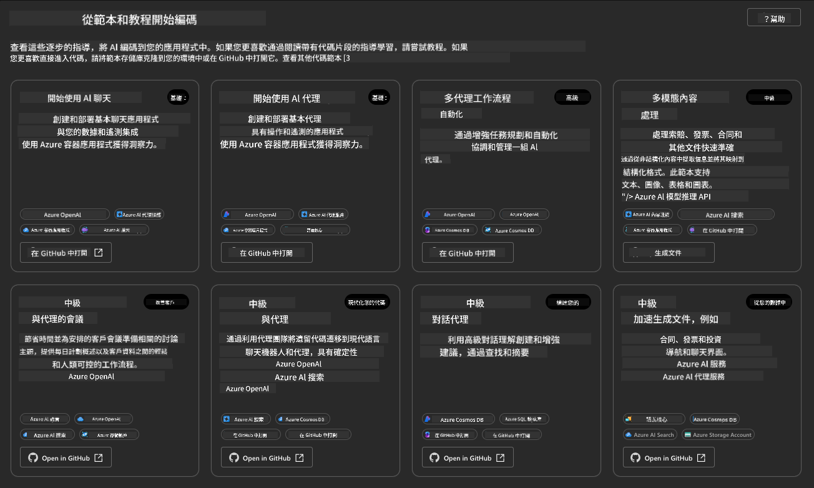
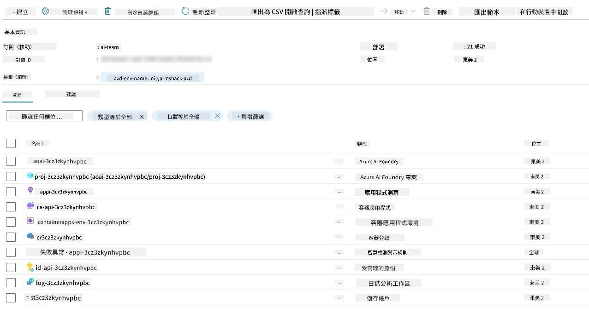
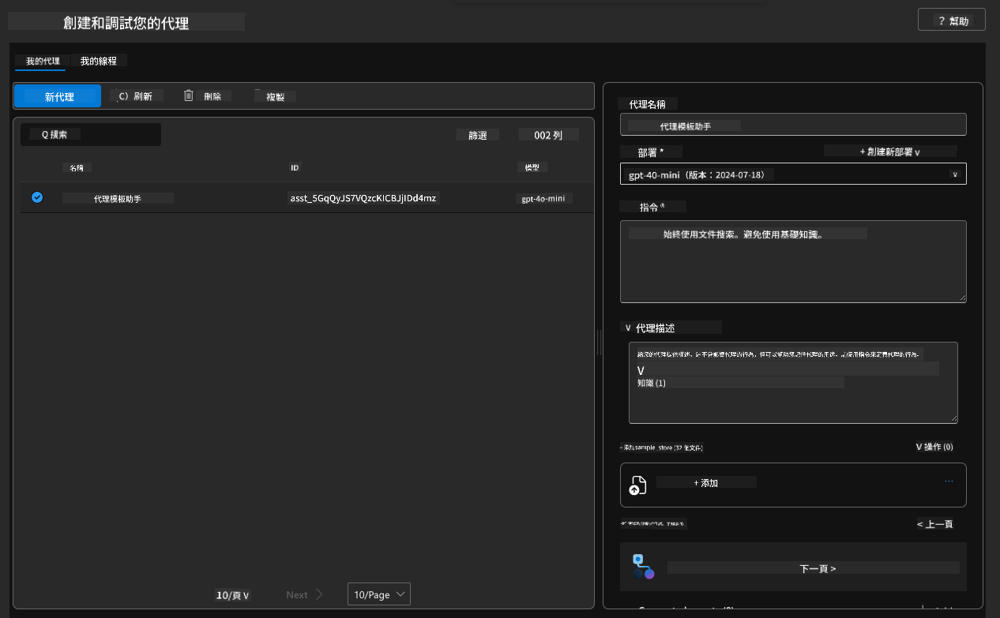

<!--
CO_OP_TRANSLATOR_METADATA:
{
  "original_hash": "7816c6ec50c694c331e7c6092371be4d",
  "translation_date": "2025-09-24T09:15:33+00:00",
  "source_file": "workshop/docs/instructions/2-Validate-AI-Template.md",
  "language_code": "tw"
}
-->
# 2. 驗證模板

!!! tip "完成本模組後，您將能夠"

    - [ ] 分析 AI 解決方案架構
    - [ ] 理解 AZD 部署工作流程
    - [ ] 使用 GitHub Copilot 獲取 AZD 使用幫助
    - [ ] **實驗 2：** 部署並驗證 AI Agents 模板

---

## 1. 介紹

[Azure Developer CLI](https://learn.microsoft.com/en-us/azure/developer/azure-developer-cli/) 或 `azd` 是一個開源的命令行工具，旨在簡化開發者在 Azure 上構建和部署應用程式的工作流程。

[AZD 模板](https://learn.microsoft.com/azure/developer/azure-developer-cli/azd-templates) 是標準化的倉庫，包含範例應用程式代碼、基礎設施即代碼資產以及 `azd` 配置文件，提供一個完整的解決方案架構。基礎設施的佈建只需一個 `azd provision` 命令，而使用 `azd up` 則可以一次性佈建基礎設施並部署應用程式！

因此，啟動您的應用程式開發過程只需找到最接近您應用程式和基礎設施需求的 _AZD 起始模板_，然後根據您的場景需求自定義倉庫。

在開始之前，請確保您已安裝 Azure Developer CLI。

1. 打開 VS Code 終端並輸入以下命令：

      ```bash title="" linenums="0"
      azd version
      ```

1. 您應該會看到類似以下的內容！

      ```bash title="" linenums="0"
      azd version 1.19.0 (commit b3d68cea969b2bfbaa7b7fa289424428edb93e97)
      ```

**現在您已準備好使用 azd 選擇並部署模板**

---

## 2. 模板選擇

Azure AI Foundry 平台提供了一組[推薦的 AZD 模板](https://learn.microsoft.com/en-us/azure/ai-foundry/how-to/develop/ai-template-get-started)，涵蓋了流行的解決方案場景，例如 _多代理工作流程自動化_ 和 _多模態內容處理_。您也可以通過訪問 Azure AI Foundry 入口網站來探索這些模板。

1. 訪問 [https://ai.azure.com/templates](https://ai.azure.com/templates)
1. 登錄 Azure AI Foundry 入口網站後，您將看到類似以下的內容。



**基本**選項是您的起始模板：

1. [ ] [Get Started with AI Chat](https://github.com/Azure-Samples/get-started-with-ai-chat)，部署一個基本的聊天應用程式（使用您的數據）到 Azure Container Apps。使用此模板探索基本的 AI 聊天機器人場景。
1. [X] [Get Started with AI Agents](https://github.com/Azure-Samples/get-started-with-ai-agents)，部署一個標準的 AI Agent（使用 Azure AI Agent Service）。使用此模板熟悉涉及工具和模型的代理式 AI 解決方案。

在新瀏覽器標籤中訪問第二個鏈接（或點擊相關卡片上的 `Open in GitHub`）。您應該會看到此 AZD 模板的倉庫。花點時間探索 README。應用程式架構如下所示：


---

## 3. 模板啟動

讓我們嘗試部署此模板並確保其有效。我們將遵循 [Getting Started](https://github.com/Azure-Samples/get-started-with-ai-agents?tab=readme-ov-file#getting-started) 部分中的指南。

1. 點擊[此鏈接](https://github.com/codespaces/new/Azure-Samples/get-started-with-ai-agents) - 確認默認操作為 `Create codespace`
1. 這將打開一個新的瀏覽器標籤 - 等待 GitHub Codespaces 會話完成加載
1. 在 Codespaces 中打開 VS Code 終端 - 輸入以下命令：

   ```bash title="" linenums="0"
   azd up
   ```

完成此命令觸發的工作流程步驟：

1. 系統會提示您登錄 Azure - 按照指示進行身份驗證
1. 輸入一個唯一的環境名稱 - 例如，我使用了 `nitya-mshack-azd`
1. 這將創建一個 `.azure/` 文件夾 - 您將看到一個包含環境名稱的子文件夾
1. 系統會提示您選擇訂閱名稱 - 選擇默認選項
1. 系統會提示您選擇位置 - 使用 `East US 2`

現在，等待佈建完成。**這需要 10-15 分鐘**

1. 完成後，您的控制台將顯示如下的成功消息：
      ```bash title="" linenums="0"
      SUCCESS: Your up workflow to provision and deploy to Azure completed in 10 minutes 17 seconds.
      ```

1. 您的 Azure 入口網站現在將有一個以環境名稱命名的資源組：

      

1. **現在您已準備好驗證已部署的基礎設施和應用程式**。

---

## 4. 模板驗證

1. 訪問 Azure 入口網站 [Resource Groups](https://portal.azure.com/#browse/resourcegroups) 頁面 - 按提示登錄
1. 點擊您的環境名稱的資源組 - 您將看到上述頁面

      - 點擊 Azure Container Apps 資源
      - 在 _Essentials_ 部分（右上角）點擊應用程式 URL

1. 您應該會看到一個託管的應用程式前端 UI，如下所示：

   

1. 嘗試詢問幾個[範例問題](https://github.com/Azure-Samples/get-started-with-ai-agents/blob/main/docs/sample_questions.md)

      1. 問：```What is the capital of France?``` 
      1. 問：```What's the best tent under $200 for two people, and what features does it include?```

1. 您應該會得到類似以下的答案。_但這是如何運作的？_

      

---

## 5. 代理驗證

Azure Container App 部署了一個端點，連接到此模板在 Azure AI Foundry 項目中佈建的 AI Agent。讓我們來看看這意味著什麼。

1. 返回 Azure 入口網站資源組的 _Overview_ 頁面

1. 點擊列表中的 `Azure AI Foundry` 資源

1. 您應該會看到以下內容。點擊 `Go to Azure AI Foundry Portal` 按鈕。
   

1. 您應該會看到您的 AI 應用程式的 Foundry 項目頁面
   

1. 點擊 `Agents` - 您將看到項目中佈建的默認代理
   

1. 選擇它 - 您將看到代理的詳細信息。注意以下內容：

      - 該代理默認使用文件搜索
      - 該代理的 `Knowledge` 表示已上傳 32 個文件（用於文件搜索）
      

1. 在左側菜單中找到 `Data+indexes` 選項並點擊查看詳細信息。

      - 您應該會看到上傳的 32 個數據文件。
      - 這些文件對應於 `src/files` 文件夾中的 12 個客戶文件和 20 個產品文件。
      

**您已驗證代理操作！**

1. 代理的回答基於這些文件中的知識。
1. 您現在可以詢問與這些數據相關的問題，並獲得基於數據的回答。
1. 範例：`customer_info_10.json` 描述了 "Amanda Perez" 的 3 次購買記錄。

返回瀏覽器標籤中的 Container App 端點並詢問：`What products does Amanda Perez own?`。您應該會看到類似以下的內容：


---

## 6. 代理遊樂場

讓我們通過在代理遊樂場中試用代理，來更深入了解 Azure AI Foundry 的功能。

1. 返回 Azure AI Foundry 中的 `Agents` 頁面 - 選擇默認代理
1. 點擊 `Try in Playground` 選項 - 您應該會看到如下的遊樂場 UI
1. 問同樣的問題：`What products does Amanda Perez own?`

    

您會得到相同（或類似）的回答 - 但您還會獲得額外的信息，用於理解代理應用程式的質量、成本和性能。例如：

1. 注意回答引用了用於 "基礎" 回答的數據文件
1. 將鼠標懸停在任何文件標籤上 - 數據是否與您的查詢和顯示的回答匹配？

您還會看到回答下方的 _統計_ 行。

1. 將鼠標懸停在任何指標上 - 例如，安全性。您會看到類似以下的內容
1. 評估的評級是否符合您對回答安全性水平的直覺？

      

---

## 7. 內建可觀測性

可觀測性是指為應用程式提供儀表化功能，以生成數據，用於理解、調試和優化其操作。要了解這一點：

1. 點擊 `View Run Info` 按鈕 - 您應該會看到此視圖。這是 [代理追蹤](https://learn.microsoft.com/en-us/azure/ai-foundry/how-to/develop/trace-agents-sdk#view-trace-results-in-the-azure-ai-foundry-agents-playground) 的示例。_您也可以通過點擊頂級菜單中的 Thread Logs 獲得此視圖_。

   - 瞭解代理執行的運行步驟和使用的工具
   - 理解回應的總 Token 數（與輸出 Token 使用量相比）
   - 理解延遲以及執行中花費時間的地方

      

1. 點擊 `Metadata` 標籤以查看運行的其他屬性，這些屬性可能為後續調試問題提供有用的上下文。

      

1. 點擊 `Evaluations` 標籤以查看對代理回答進行的自動評估。這些包括安全性評估（例如，自我傷害）和代理特定的評估（例如，意圖解析、任務遵守）。

      

1. 最後但同樣重要的是，點擊側邊欄菜單中的 `Monitoring` 標籤。

      - 在顯示的頁面中選擇 `Resource usage` 標籤 - 查看指標。
      - 跟蹤應用程式使用情況，包括成本（Token）和負載（請求）。
      - 跟蹤應用程式的延遲，包括第一字節（輸入處理）和最後字節（輸出）。

      

---

## 8. 環境變數

到目前為止，我們已經通過瀏覽器完成了部署，並驗證了基礎設施已佈建且應用程式正常運行。但要以 _代碼優先_ 的方式使用應用程式，我們需要配置本地開發環境，並設置相關的變數以使用這些資源。使用 `azd` 可以輕鬆完成。

1. Azure Developer CLI [使用環境變數](https://learn.microsoft.com/en-us/azure/developer/azure-developer-cli/manage-environment-variables?tabs=bash) 來存儲和管理應用程式部署的配置設置。

1. 環境變數存儲在 `.azure/<env-name>/.env` 中 - 這將其範圍限定為部署期間使用的 `env-name` 環境，並幫助您在同一倉庫中的不同部署目標之間隔離環境。

1. 環境變數會在 `azd` 執行特定命令（例如，`azd up`）時自動加載。注意，`azd` 不會自動讀取 _操作系統級_ 環境變數（例如，在 shell 中設置的變數） - 而是使用 `azd set env` 和 `azd get env` 在腳本中傳遞信息。

讓我們嘗試一些命令：

1. 獲取此環境中 `azd` 設置的所有環境變數：

      ```bash title="" linenums="0"
      azd env get-values
      ```
      
      您會看到類似以下的內容：

      ```bash title="" linenums="0"
      AZURE_AI_AGENT_DEPLOYMENT_NAME="gpt-4o-mini"
      AZURE_AI_AGENT_NAME="agent-template-assistant"
      AZURE_AI_EMBED_DEPLOYMENT_NAME="text-embedding-3-small"
      AZURE_AI_EMBED_DIMENSIONS=100
      ...
      ```

1. 獲取特定值 - 例如，我想知道是否設置了 `AZURE_AI_AGENT_MODEL_NAME` 值

      ```bash title="" linenums="0"
      azd env get-value AZURE_AI_AGENT_MODEL_NAME 
      ```
      
      您會看到類似以下的內容 - 默認情況下未設置！

      ```bash title="" linenums="0"
      ERROR: key 'AZURE_AI_AGENT_MODEL_NAME' not found in the environment values
      ```

1. 為 `azd` 設置新的環境變數。這裡，我們更新代理模型名稱。_注意：所做的任何更改將立即反映在 `.azure/<env-name>/.env` 文件中。

      ```bash title="" linenums="0"
      azd env set AZURE_AI_AGENT_MODEL_NAME gpt-4.1
      azd env set AZURE_AI_AGENT_MODEL_VERSION 2025-04-14
      azd env set AZURE_AI_AGENT_DEPLOYMENT_CAPACITY 150
      ```

      現在，我們應該會發現該值已設置：

      ```bash title="" linenums="0"
      azd env get-value AZURE_AI_AGENT_MODEL_NAME 
      ```

1. 注意某些資源是持久性的（例如，模型部署），需要更多操作而不僅僅是 `azd up` 才能強制重新部署。讓我們嘗試拆除原始部署並使用更改的環境變數重新部署。

1. **刷新** 如果您之前使用 azd 模板部署了基礎設施 - 您可以使用以下命令 _刷新_ 本地環境變數的狀態，基於當前的 Azure 部署狀態：


      ```bash title="" linenums="0"
      azd env refresh
      ```

      這是一種強大的方法，可以在兩個或多個本地開發環境之間同步環境變數（例如，擁有多位開發者的團隊），使部署的基礎設施成為環境變數狀態的最終依據。團隊成員只需刷新變數即可重新同步。

---

## 9. 恭喜 🎉

你剛剛完成了一個端到端的工作流程，其中包括：

- [X] 選擇了你想使用的 AZD 模板
- [X] 使用 GitHub Codespaces 啟動了模板
- [X] 部署了模板並驗證其正常運作

---

