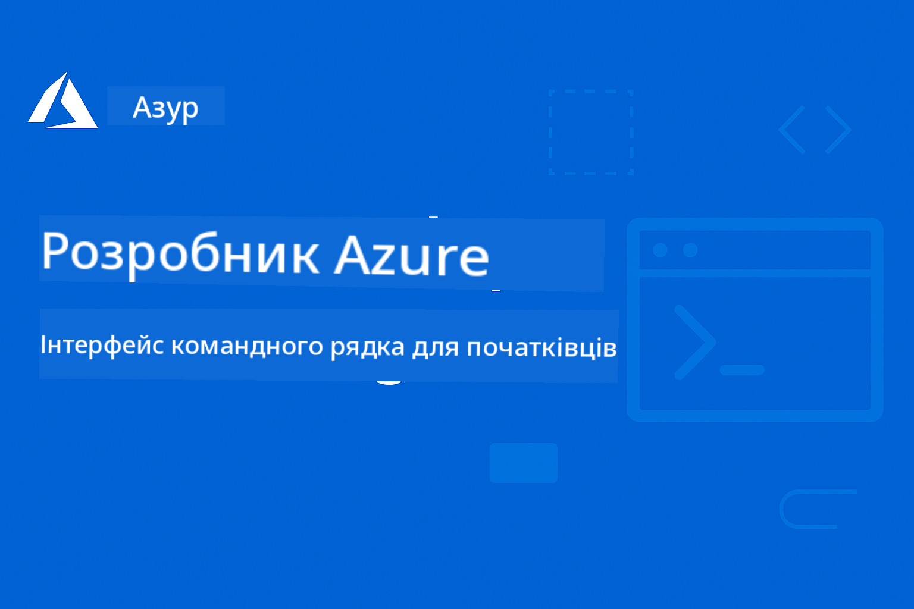

<!--
CO_OP_TRANSLATOR_METADATA:
{
  "original_hash": "6c3d0f9ef66c2cd692a55a2811d9c3e5",
  "translation_date": "2025-09-15T15:40:32+00:00",
  "source_file": "README.md",
  "language_code": "uk"
}
-->
# AZD Для Початківців

 

[](https://GitHub.com/microsoft/azd-for-beginners/watchers/)
[](https://GitHub.com/microsoft/azd-for-beginners/network/)
[](https://GitHub.com/microsoft/azd-for-beginners/stargazers/)

[](https://discord.gg/microsoft-azure)

[](https://discord.gg/kzRShWzttr)

Дотримуйтесь цих кроків, щоб почати використовувати ці ресурси:
1. **Форкніть репозиторій**: Натисніть [](https://GitHub.com/microsoft/azd-for-beginners/fork)
2. **Клонуйте репозиторій**:   `git clone https://github.com/microsoft/azd-for-beginners.git`
3. [**Приєднайтеся до спільнот Azure Discord та знайомтеся з експертами та іншими розробниками**](https://discord.com/invite/ByRwuEEgH4)

### Підтримка багатомовності

#### Підтримується через GitHub Action (Автоматично та завжди актуально)

[French](../fr/README.md) | [Spanish](../es/README.md) | [German](../de/README.md) | [Russian](../ru/README.md) | [Arabic](../ar/README.md) | [Persian (Farsi)](../fa/README.md) | [Urdu](../ur/README.md) | [Chinese (Simplified)](../zh/README.md) | [Chinese (Traditional, Macau)](../mo/README.md) | [Chinese (Traditional, Hong Kong)](../hk/README.md) | [Chinese (Traditional, Taiwan)](../tw/README.md) | [Japanese](../ja/README.md) | [Korean](../ko/README.md) | [Hindi](../hi/README.md) | [Bengali](../bn/README.md) | [Marathi](../mr/README.md) | [Nepali](../ne/README.md) | [Punjabi (Gurmukhi)](../pa/README.md) | [Portuguese (Portugal)](../pt/README.md) | [Portuguese (Brazil)](../br/README.md) | [Italian](../it/README.md) | [Polish](../pl/README.md) | [Turkish](../tr/README.md) | [Greek](../el/README.md) | [Thai](../th/README.md) | [Swedish](../sv/README.md) | [Danish](../da/README.md) | [Norwegian](../no/README.md) | [Finnish](../fi/README.md) | [Dutch](../nl/README.md) | [Hebrew](../he/README.md) | [Vietnamese](../vi/README.md) | [Indonesian](../id/README.md) | [Malay](../ms/README.md) | [Tagalog (Filipino)](../tl/README.md) | [Swahili](../sw/README.md) | [Hungarian](../hu/README.md) | [Czech](../cs/README.md) | [Slovak](../sk/README.md) | [Romanian](../ro/README.md) | [Bulgarian](../bg/README.md) | [Serbian (Cyrillic)](../sr/README.md) | [Croatian](../hr/README.md) | [Slovenian](../sl/README.md) | [Ukrainian](./README.md) | [Burmese (Myanmar)](../my/README.md)

**Якщо ви бажаєте додати підтримку інших мов, список доступних мов наведено [тут](https://github.com/Azure/co-op-translator/blob/main/getting_started/supported-languages.md)**

## Вступ

Ласкаво просимо до комплексного посібника з Azure Developer CLI (azd). Цей репозиторій створений для того, щоб допомогти розробникам будь-якого рівня — від студентів до професіоналів — навчитися та освоїти Azure Developer CLI для ефективного розгортання в хмарі, **з особливим акцентом на розгортання AI-додатків за допомогою Azure AI Foundry**. Цей структурований навчальний ресурс забезпечує практичний досвід роботи з хмарними розгортаннями Azure, вирішенням поширених проблем і впровадженням найкращих практик для успішного розгортання шаблонів AZD.

### **Чому цей посібник важливий для AI-розробників**
Згідно з нашим останнім опитуванням у спільноті Azure AI Foundry Discord, **45% розробників зацікавлені у використанні AZD для AI-навантажень**, але стикаються з такими проблемами:
- Складні архітектури AI з багатьма сервісами
- Найкращі практики розгортання AI у продакшн
- Інтеграція та конфігурація сервісів Azure AI
- Оптимізація витрат для AI-навантажень
- Вирішення специфічних проблем розгортання AI

## Цілі навчання

Працюючи з цим репозиторієм, ви:
- Освоїте основи та ключові концепції Azure Developer CLI
- Навчитеся розгортати та забезпечувати ресурси Azure за допомогою Infrastructure as Code
- Розвинете навички вирішення поширених проблем розгортання AZD
- Зрозумієте перевірку перед розгортанням і планування потужностей
- Впровадите найкращі практики безпеки та оптимізації витрат
- Набудете впевненості у розгортанні готових до продакшну додатків на Azure

## Результати навчання

Після завершення курсу ви зможете:
- Успішно встановлювати, налаштовувати та використовувати Azure Developer CLI
- Створювати та розгортати додатки за допомогою шаблонів AZD
- Вирішувати проблеми з автентифікацією, інфраструктурою та розгортанням
- Виконувати перевірки перед розгортанням, включаючи планування потужностей і вибір SKU
- Впроваджувати найкращі практики моніторингу, безпеки та управління витратами
- Інтегрувати робочі процеси AZD у CI/CD конвеєри

## Зміст

- [Що таке Azure Developer CLI?](../..)
- [Швидкий старт](../..)
- [Навчальний шлях](../..)
  - [Для AI-розробників (Рекомендовано почати тут!)](../..)
  - [Для студентів і початківців](../..)
  - [Для розробників](../..)
  - [Для інженерів DevOps](../..)
- [Документація](../..)
  - [Початок роботи](../..)
  - [Розгортання та забезпечення](../..)
  - [Перевірки перед розгортанням](../..)
  - [AI та Azure AI Foundry](../..)
  - [Вирішення проблем](../..)
- [Приклади та шаблони](../..)
  - [Рекомендовані: Шаблони Azure AI Foundry](../..)
  - [Рекомендовані: Сценарії Azure AI Foundry E2E](../..)
  - [Додаткові шаблони AZD](../..)
  - [Практичні лабораторії та воркшопи](../..)
- [Ресурси](../..)
- [Внесок](../..)
- [Підтримка](../..)
- [Спільнота](../..)

## Що таке Azure Developer CLI?

Azure Developer CLI (azd) — це орієнтований на розробників інтерфейс командного рядка, який прискорює процес створення та розгортання додатків на Azure. Він забезпечує:

- **Розгортання на основі шаблонів** - Використання готових шаблонів для поширених патернів додатків
- **Infrastructure as Code** - Управління ресурсами Azure за допомогою Bicep або Terraform
- **Інтегровані робочі процеси** - Безперешкодне забезпечення, розгортання та моніторинг додатків
- **Зручність для розробників** - Оптимізовано для продуктивності та досвіду розробників

### **AZD + Azure AI Foundry: Ідеально для AI-розгортань**

**Чому AZD для AI-рішень?** AZD вирішує основні проблеми, з якими стикаються AI-розробники:

- **Шаблони, готові до AI** - Попередньо налаштовані шаблони для Azure OpenAI, Cognitive Services та ML-навантажень
- **Безпечні AI-розгортання** - Вбудовані патерни безпеки для AI-сервісів, API-ключів та кінцевих точок моделей
- **Патерни AI для продакшну** - Найкращі практики для масштабованих, економічно ефективних AI-додатків
- **Повні AI-робочі процеси** - Від розробки моделі до розгортання у продакшн із належним моніторингом
- **Оптимізація витрат** - Розумне розподілення ресурсів і стратегії масштабування для AI-навантажень
- **Інтеграція з Azure AI Foundry** - Безперешкодне підключення до каталогу моделей AI Foundry та кінцевих точок

## Швидкий старт

### Попередні умови
- Підписка на Azure
- Встановлений Azure CLI
- Git (для клонування шаблонів)

### Встановлення
```bash
# Windows (PowerShell)
powershell -ex AllSigned -c "Invoke-RestMethod 'https://aka.ms/install-azd.ps1' | Invoke-Expression"

# macOS/Linux
curl -fsSL https://aka.ms/install-azd.sh | bash
```

### Ваше перше розгортання
```bash
# Initialize a new project
azd init --template todo-nodejs-mongo

# Provision Azure resources and deploy
azd up
```

### Ваше перше AI-розгортання
```bash
# Initialize an AI-powered chat application with Azure OpenAI
azd init --template azure-search-openai-demo

# Configure AI services and deploy
azd up

# Or try other AI templates:
azd init --template openai-chat-app-quickstart
azd init --template ai-document-processing
azd init --template contoso-chat
```

## Навчальний шлях

### Для AI-розробників (Рекомендовано почати тут!)
1. **Швидкий старт**: Спробуйте [azure-search-openai-demo](https://github.com/Azure-Samples/azure-search-openai-demo) шаблон
2. **Вивчіть основи**: [AZD Basics](docs/getting-started/azd-basics.md) + [Azure AI Foundry Integration](docs/ai-foundry/azure-ai-foundry-integration.md)
3. **Практика**: Завершіть [AI Workshop Lab](docs/ai-foundry/ai-workshop-lab.md)
4. **Готовність до продакшну**: Перегляньте [Production AI Best Practices](docs/ai-foundry/production-ai-practices.md)
5. **Розширений рівень**: Розгорніть [contoso-chat](https://github.com/Azure-Samples/contoso-chat) корпоративний шаблон

### Для студентів і початківців
1. Почніть із [AZD Basics](docs/getting-started/azd-basics.md)
2. Дотримуйтесь [Інструкції з встановлення](docs/getting-started/installation.md)
3. Завершіть [Ваш перший проєкт](docs/getting-started/first-project.md)
4. Практикуйтеся з [Простим прикладом веб-додатку](../../examples/simple-web-app)

### Для розробників
1. Перегляньте [Інструкцію з конфігурації](docs/getting-started/configuration.md)
2. Вивчіть [Інструкцію з розгортання](docs/deployment/deployment-guide.md)
3. Виконайте [Приклад додатку з базою даних](../../examples/database-app)
4. Досліджуйте [Приклад контейнерного додатку](../../examples/container-app)

### Для інженерів DevOps
1. Освойте [Забезпечення ресурсів](docs/deployment/provisioning.md)
2. Впровадьте [Перевірки перед розгортанням](docs/pre-deployment/preflight-checks.md)
3. Практикуйте [Планування потужностей](docs/pre-deployment/capacity-planning.md)
4. Розширений рівень: [Приклад мікросервісів](../../examples/microservices)

## Документація

### Початок роботи
- [**AZD Basics**](docs/getting-started/azd-basics.md) - Основні концепції та термінологія
- [**Встановлення та налаштування**](docs/getting-started/installation.md) - Інструкції з встановлення для різних платформ
- [**Конфігурація**](docs/getting-started/configuration.md) - Налаштування середовища та автентифікації
- [**Ваш перший проєкт**](docs/getting-started/first-project.md) - Покроковий посібник

### Розгортання та забезпечення
- [**Інструкція з розгортання**](docs/deployment/deployment-guide.md) - Повні робочі процеси розгортання
- [**Забезпечення ресурсів**](docs/deployment/provisioning.md) - Управління ресурсами Azure

### Перевірки перед розгортанням
- [**Планування потужностей**](docs/pre-deployment/capacity-planning.md) - Перевірка потужностей ресурсів Azure
- [**Вибір SKU**](docs/pre-deployment/sku-selection.md) - Вибір відповідних SKU Azure
- [**Перевірки перед розгортанням**](docs/pre-deployment/preflight-checks.md) - Автоматизовані скрипти перевірки

### AI та Azure AI Foundry
- [**Інтеграція з Azure AI Foundry**](docs/ai-foundry/azure-ai-foundry-integration.md) - Підключення AZD до сервісів Azure AI Foundry
- [**Патерни розгортання AI-моделей**](docs/ai-foundry/ai-model-deployment.md) - Розгортання та управління AI-моделями за допомогою AZD
- [**AI Workshop Lab**](docs/ai-foundry/ai-workshop-lab.md) - Практична лабораторія: Підготовка AI-рішень до AZD
- [**Найкращі практики для AI у продакшн**](docs/ai-foundry/production-ai-practices.md) - Безпека, масштабування та моніторинг AI-навантажень

### Вирішення проблем
- [**Поширені проблеми**](docs/troubleshooting/common-issues.md) - Часто зустрічаються проблеми та їх вирішення
- [**Посібник з налагодження**](docs/troubleshooting/debugging.md) - Покрокові стратегії налагодження  
- [**Вирішення проблем, пов'язаних з AI**](docs/troubleshooting/ai-troubleshooting.md) - Проблеми з сервісами AI та розгортанням моделей  

## Приклади та шаблони  

### [Рекомендовано: Шаблони Azure AI Foundry](https://ai.azure.com/resource/build/templates)  
**Почніть тут, якщо розгортаєте AI-додатки!**  

| Шаблон | Опис | Складність | Сервіси |  
|----------|-------------|------------|----------|  
| [**Початок роботи з AI-чатом**](https://github.com/Azure-Samples/get-started-with-ai-chat) | Створіть і розгорніть базовий чат-додаток, інтегрований з вашими даними та телеметрією, використовуючи Azure Container Apps |⭐⭐ | AzureOpenAI + Azure AI Model Inference API + Azure AI Search + Azure Container Apps + Application Insights |  
| [**Початок роботи з AI-агентами**](https://github.com/Azure-Samples/get-started-with-ai-agents) | Створіть і розгорніть базовий додаток агента з діями та телеметрією, використовуючи Azure Container Apps. |⭐⭐ | Azure AI Agent Service + AzureOpenAI + Azure AI Search + Azure Container Apps + Application Insights|  
| [**Автоматизація робочих процесів з багатьма агентами**](https://github.com/Azure-Samples/get-started-with-ai-chat) | Покращіть планування завдань та автоматизацію, оркеструючи та керуючи групою AI-агентів.|⭐⭐⭐ | AzureOpenAI + Azure AI Agent Service + Semantic Kernel + Azure CosmosDB + Azure Container Apps|  
| [**Генерація документів з ваших даних**](https://github.com/Azure-Samples/get-started-with-ai-chat) | Прискорте створення документів, таких як контракти, рахунки та інвестиційні пропозиції, знаходячи та підсумовуючи релевантну інформацію з ваших даних. |⭐⭐⭐  | AzureOpenAI + Azure AI Search + Azure AI Services + Azure CosmosDB|  
| [**Покращення зустрічей з клієнтами за допомогою агентів**](https://github.com/Azure-Samples/get-started-with-ai-chat) | Міграція застарілого коду на сучасні мови, використовуючи команду агентів. |⭐⭐⭐| AzureOpenAI + Azure AI Search + Azure CosmosDB + Azure SQL Database |  
| [**Модернізація вашого коду за допомогою агентів**](https://github.com/Azure-Samples/get-started-with-ai-chat) | Створіть і розгорніть базовий чат-додаток, інтегрований з вашими даними та телеметрією, використовуючи Azure Container Apps |⭐⭐⭐ | AzureOpenAI + Azure Agent Service + Semantic Kernel + Azure CosmosDB + Azure Container Apps|  
| [**Створіть свого розмовного агента**](https://github.com/Azure-Samples/get-started-with-ai-chat) | Використовуйте розширене розуміння розмов для створення та вдосконалення чат-ботів і агентів з детермінованими та контрольованими людьми робочими процесами. |⭐⭐⭐ | AI Language + AzureOpenAI + AI Search + Azure Storage + Azure Container Registry|  
| [**Розкрийте інсайти з розмовних даних**](https://github.com/Azure-Samples/get-started-with-ai-chat) | Покращіть ефективність контакт-центру, виявляючи інсайти з великих аудіо- та текстових наборів даних, використовуючи розширені можливості розуміння контенту. |⭐⭐⭐ | AzureOpenAI + AI Search + Semantic Kernel + Azure Agent Service + AI AI Content Understanding|  
| [**Обробка мультимодального контенту**](https://github.com/Azure-Samples/get-started-with-ai-chat) | Швидко та точно обробляйте претензії, рахунки, контракти та інші документи, витягуючи інформацію з неструктурованого контенту та перетворюючи її у структурований формат. Цей шаблон підтримує текст, зображення, таблиці та графіки. |⭐⭐⭐⭐ | AzureOpenAI + Azure Content Understanding + Azure CosmosDB + Azure Container Apps|  

### Рекомендовано: Azure AI Foundry E2E сценарії  
**Почніть тут, якщо розгортаєте AI-додатки!**  

| Шаблон | Опис | Складність | Сервіси |  
|----------|-------------|------------|----------|  
| [**openai-chat-app-quickstart**](https://github.com/Azure-Samples/openai-chat-app-quickstart) | Простий інтерфейс чату з Azure OpenAI | ⭐ | AzureOpenAI + Container Apps |  
| [**azure-search-openai-demo**](https://github.com/Azure-Samples/azure-search-openai-demo) | Додаток чату з підтримкою RAG з Azure OpenAI | ⭐⭐ | AzureOpenAI + Search + App Service |  
| [**ai-document-processing**](https://github.com/Azure-Samples/ai-document-processing) | Аналіз документів за допомогою AI-сервісів | ⭐⭐ | Azure Document Intelligence + Functions |  
| [**agent-openai-python-prompty**](https://github.com/Azure-Samples/agent-openai-python-prompty) | Фреймворк AI-агента з викликом функцій | ⭐⭐⭐ | AzureOpenAI + Azure Container Apps + Functions |  
| [**contoso-chat**](https://github.com/Azure-Samples/contoso-chat) | Корпоративний чат з оркестрацією AI | ⭐⭐⭐ | AzureOpenAI + Azure AI Search + Container Apps |  

### Додаткові шаблони AZD  
- [**Каталог прикладів**](examples/README.md) - Практичні приклади, шаблони та реальні сценарії  
- [**Шаблони Azure-Samples AZD**](https://github.com/Azure-Samples/azd-templates) - Офіційні шаблони Microsoft  
- [**Галерея Awesome AZD**](https://azure.github.io/awesome-azd/) - Шаблони, створені спільнотою  

### Практичні лабораторії та воркшопи  
- [**Лабораторія AI Workshop**](docs/ai-foundry/ai-workshop-lab.md) - **НОВЕ**: Зробіть ваші AI-рішення готовими до розгортання через AZD  
- [**Воркшоп для початківців AZD**](workshop/README.md) - Зосередження на розгортанні шаблонів AI-агентів через AZD  

## Ресурси  

### Швидкі посилання  
- [**Шпаргалка команд**](resources/cheat-sheet.md) - Основні команди azd  
- [**Глосарій**](resources/glossary.md) - Терміни Azure та azd  
- [**FAQ**](resources/faq.md) - Часті запитання  
- [**Посібник для навчання**](resources/study-guide.md) - Комплексні навчальні цілі та практичні вправи  

### Зовнішні ресурси  
- [Документація Azure Developer CLI](https://learn.microsoft.com/en-us/azure/developer/azure-developer-cli/)  
- [Центр архітектури Azure](https://learn.microsoft.com/en-us/azure/architecture/)  
- [Калькулятор цін Azure](https://azure.microsoft.com/pricing/calculator/)  
- [Статус Azure](https://status.azure.com/)  

## Внесок  

Ми вітаємо ваші внески! Будь ласка, ознайомтеся з нашим [Посібником для внесків](CONTRIBUTING.md) для деталей щодо:  
- Як подавати проблеми та запити на функції  
- Керівництво з внесення коду  
- Покращення документації  
- Стандарти спільноти  

## Підтримка  

- **Проблеми**: [Повідомляйте про помилки та запитуйте функції](https://github.com/microsoft/azd-for-beginners/issues)  
- **Обговорення**: [Спільнота Microsoft Azure Discord: Q&A та обговорення](https://discord.gg/microsoft-azure)  
- **Підтримка, пов'язана з AI**: Приєднуйтесь до [каналу #Azure](https://discord.gg/microsoft-azure) для обговорень AZD + AI Foundry  
- **Електронна пошта**: Для приватних запитів  
- **Microsoft Learn**: [Офіційна документація Azure Developer CLI](https://learn.microsoft.com/en-us/azure/developer/azure-developer-cli/)  

### Інсайти спільноти з Discord Azure AI Foundry  

**Результати опитування з каналу #Azure:**  
- **45%** розробників хочуть використовувати AZD для AI-навантажень  
- **Основні виклики**: Розгортання багатосервісних рішень, управління обліковими даними, готовність до продакшну  
- **Найбільш запитуване**: AI-специфічні шаблони, посібники з вирішення проблем, найкращі практики  

**Приєднуйтесь до нашої спільноти, щоб:**  
- Ділитися своїм досвідом AZD + AI та отримувати допомогу  
- Отримувати ранній доступ до нових AI-шаблонів  
- Вносити свій вклад у найкращі практики розгортання AI  
- Впливати на майбутній розвиток функцій AI + AZD  

## Ліцензія  

Цей проект ліцензований за ліцензією MIT - дивіться файл [LICENSE](../../LICENSE) для деталей.  

## Інші курси  

Наша команда створює інші курси! Ознайомтеся з:  

- [**НОВЕ** Протокол контексту моделі (MCP) для початківців](https://github.com/microsoft/mcp-for-beginners?WT.mc_id=academic-105485-koreyst)  
- [AI-агенти для початківців](https://github.com/microsoft/ai-agents-for-beginners?WT.mc_id=academic-105485-koreyst)  
- [Генеративний AI для початківців з використанням .NET](https://github.com/microsoft/Generative-AI-for-beginners-dotnet?WT.mc_id=academic-105485-koreyst)  
- [Генеративний AI для початківців](https://github.com/microsoft/generative-ai-for-beginners?WT.mc_id=academic-105485-koreyst)  
- [Генеративний AI для початківців з використанням Java](https://github.com/microsoft/generative-ai-for-beginners-java?WT.mc_id=academic-105485-koreyst)  
- [ML для початківців](https://aka.ms/ml-beginners?WT.mc_id=academic-105485-koreyst)  
- [Наука про дані для початківців](https://aka.ms/datascience-beginners?WT.mc_id=academic-105485-koreyst)  
- [AI для початківців](https://aka.ms/ai-beginners?WT.mc_id=academic-105485-koreyst)  
- [Кібербезпека для початківців](https://github.com/microsoft/Security-101??WT.mc_id=academic-96948-sayoung)  
- [Веб-розробка для початківців](https://aka.ms/webdev-beginners?WT.mc_id=academic-105485-koreyst)  
- [IoT для початківців](https://aka.ms/iot-beginners?WT.mc_id=academic-105485-koreyst)  
- [Розробка XR для початківців](https://github.com/microsoft/xr-development-for-beginners?WT.mc_id=academic-105485-koreyst)  
- [Опанування GitHub Copilot для парного програмування з AI](https://aka.ms/GitHubCopilotAI?WT.mc_id=academic-105485-koreyst)  
- [Опанування GitHub Copilot для розробників C#/.NET](https://github.com/microsoft/mastering-github-copilot-for-dotnet-csharp-developers?WT.mc_id=academic-105485-koreyst)  
- [Виберіть свою пригоду з Copilot](https://github.com/microsoft/CopilotAdventures?WT.mc_id=academic-105485-koreyst)  

---

**Навігація**  
- **Наступний урок**: [Основи AZD](docs/getting-started/azd-basics.md)  

---

**Відмова від відповідальності**:  
Цей документ був перекладений за допомогою сервісу автоматичного перекладу [Co-op Translator](https://github.com/Azure/co-op-translator). Хоча ми прагнемо до точності, будь ласка, майте на увазі, що автоматичні переклади можуть містити помилки або неточності. Оригінальний документ на його рідній мові слід вважати авторитетним джерелом. Для критичної інформації рекомендується професійний людський переклад. Ми не несемо відповідальності за будь-які непорозуміння або неправильні тлумачення, що виникли внаслідок використання цього перекладу.