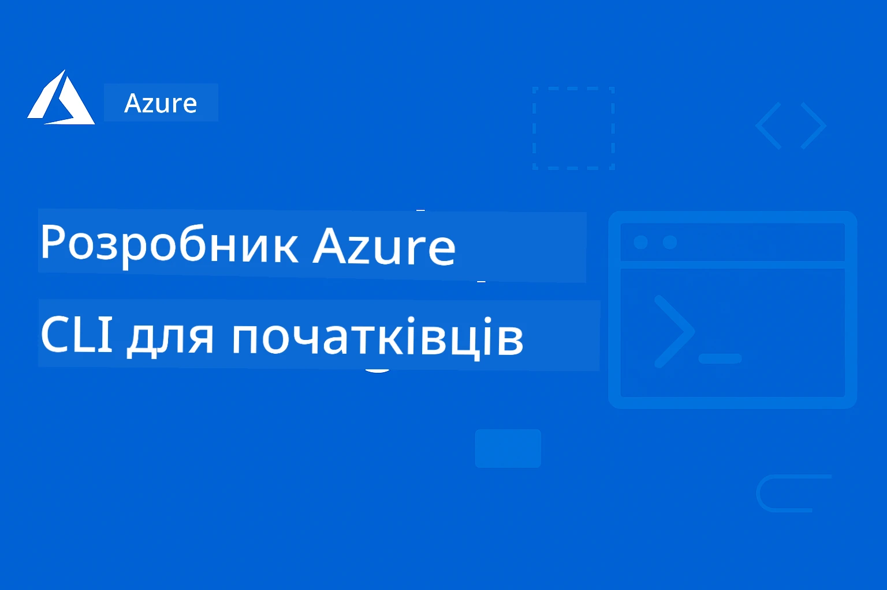

<!--
CO_OP_TRANSLATOR_METADATA:
{
  "original_hash": "068c87cc2641a81ca353ad7064ff326a",
  "translation_date": "2026-01-01T20:52:37+00:00",
  "source_file": "README.md",
  "language_code": "uk"
}
-->
# AZD для початківців: структурований навчальний шлях

 

[](https://GitHub.com/microsoft/azd-for-beginners/watchers/)
[](https://GitHub.com/microsoft/azd-for-beginners/network/)
[](https://GitHub.com/microsoft/azd-for-beginners/stargazers/)

[](https://discord.gg/microsoft-azure)
[](https://discord.gg/nTYy5BXMWG)

## Початок роботи з цим курсом

Виконайте ці кроки, щоб розпочати навчання AZD:

1. **Зробіть форк репозиторію**: Натисніть [](https://GitHub.com/microsoft/azd-for-beginners/fork)
2. **Клонувати репозиторій**: `git clone https://github.com/microsoft/azd-for-beginners.git`
3. **Приєднайтесь до спільноти**: [Спільноти Azure Discord](https://discord.com/invite/ByRwuEEgH4) для підтримки експертів
4. **Оберіть свій навчальний шлях**: Виберіть розділ нижче, який відповідає вашому рівню досвіду

### Підтримка кількох мов

#### Автоматичні переклади (завжди актуальні)

<!-- CO-OP TRANSLATOR LANGUAGES TABLE START -->
[Арабська](../ar/README.md) | [Бенгальська](../bn/README.md) | [Болгарська](../bg/README.md) | [Бірманська (Мʼянма)](../my/README.md) | [Китайська (спрощена)](../zh/README.md) | [Китайська (традиційна, Гонконг)](../hk/README.md) | [Китайська (традиційна, Макао)](../mo/README.md) | [Китайська (традиційна, Тайвань)](../tw/README.md) | [Хорватська](../hr/README.md) | [Чеська](../cs/README.md) | [Данська](../da/README.md) | [Нідерландська](../nl/README.md) | [Естонська](../et/README.md) | [Фінська](../fi/README.md) | [Французька](../fr/README.md) | [Німецька](../de/README.md) | [Грецька](../el/README.md) | [Іврит](../he/README.md) | [Гінді](../hi/README.md) | [Угорська](../hu/README.md) | [Індонезійська](../id/README.md) | [Італійська](../it/README.md) | [Японська](../ja/README.md) | [Каннада](../kn/README.md) | [Корейська](../ko/README.md) | [Литовська](../lt/README.md) | [Малайська](../ms/README.md) | [Малаялам](../ml/README.md) | [Мараті](../mr/README.md) | [Непальська](../ne/README.md) | [Нігерійський пі́дзин](../pcm/README.md) | [Норвезька](../no/README.md) | [Перська (фарсі)](../fa/README.md) | [Польська](../pl/README.md) | [Португальська (Бразилія)](../br/README.md) | [Португальська (Португалія)](../pt/README.md) | [Пенджабі (гурмухі)](../pa/README.md) | [Румунська](../ro/README.md) | [Російська](../ru/README.md) | [Сербська (кирилиця)](../sr/README.md) | [Словацька](../sk/README.md) | [Словенська](../sl/README.md) | [Іспанська](../es/README.md) | [Суахілі](../sw/README.md) | [Шведська](../sv/README.md) | [Тагальська (філіппінська)](../tl/README.md) | [Тамільська](../ta/README.md) | [Телугу](../te/README.md) | [Тайська](../th/README.md) | [Турецька](../tr/README.md) | [Українська](./README.md) | [Урду](../ur/README.md) | [Вʼєтнамська](../vi/README.md)
<!-- CO-OP TRANSLATOR LANGUAGES TABLE END -->

## Огляд курсу

Опановуйте Azure Developer CLI (azd) через структуровані розділи, розроблені для поступового навчання. **Особлива увага розгортанню застосунків ШІ з інтеграцією Microsoft Foundry.**

### Чому цей курс є важливим для сучасних розробників

На основі даних спільноти Microsoft Foundry Discord, **45% розробників хочуть використовувати AZD для робочих навантажень ШІ**, але стикаються з проблемами:
- Складні мультисервісні архітектури для ШІ
- Кращі практики розгортання ШІ у продакшн  
- Інтеграція та конфігурація сервісів Azure AI
- Оптимізація витрат на робочі навантаження ШІ
- Усунення несправностей при розгортанні, специфічних для ШІ

### Цілі навчання

Після завершення цього структурованого курсу ви:
- **Опануєте основи AZD**: базові концепції, встановлення та конфігурація
- **Розгортатимете ШІ-застосунки**: використовуючи AZD з сервісами Microsoft Foundry
- **Реалізуєте інфраструктуру як код**: керування ресурсами Azure за допомогою шаблонів Bicep
- **Усунете несправності при розгортаннях**: вирішення поширених проблем та налагодження
- **Оптимізуєте для продакшну**: безпека, масштабування, моніторинг та управління витратами
- **Створюватимете мультиагентні рішення**: розгортати складні архітектури ШІ

## 📚 Навчальні розділи

*Оберіть свій шлях навчання відповідно до рівня досвіду та цілей*

### 🚀 Розділ 1: Основи та швидкий старт
**Попередні вимоги**: підписка Azure, базові знання командного рядка  
**Тривалість**: 30-45 хвилин  
**Складність**: ⭐

#### Чого ви навчитеся
- Розуміння основ Azure Developer CLI
- Встановлення AZD на вашу платформу
- Ваше перше успішне розгортання

#### Ресурси для навчання
- **🎯 Почніть тут**: [What is Azure Developer CLI?](../..)
- **📖 Теорія**: [AZD Basics](docs/getting-started/azd-basics.md) - Основні концепції та термінологія
- **⚙️ Налаштування**: [Installation & Setup](docs/getting-started/installation.md) - Посібники для різних платформ
- **🛠️ Практика**: [Your First Project](docs/getting-started/first-project.md) - Покроковий підручник
- **📋 Швидка довідка**: [Command Cheat Sheet](resources/cheat-sheet.md)

#### Практичні завдання
```bash
# Швидка перевірка встановлення
azd version

# Розгорніть вашу першу програму
azd init --template todo-nodejs-mongo
azd up
```

**💡 Результат розділу**: Успішно розгорнути простий веб-застосунок в Azure за допомогою AZD

**✅ Підтвердження успіху:**
```bash
# Після завершення Розділу 1 ви зможете:
azd version              # Показує встановлену версію
azd init --template todo-nodejs-mongo  # Ініціалізує проєкт
azd up                  # Розгортає в Azure
azd show                # Показує URL запущеного додатка
# Додаток відкривається в браузері і працює
azd down --force --purge  # Очищає ресурси
```

**📊 Часова інвестиція:** 30-45 хвилин  
**📈 Рівень навичок після:** Може самостійно розгортати базові застосунки

**✅ Підтвердження успіху:**
```bash
# Після завершення Розділу 1 ви зможете:
azd version              # Показує встановлену версію
azd init --template todo-nodejs-mongo  # Ініціалізує проект
azd up                  # Розгортає в Azure
azd show                # Відображає URL запущеного додатку
# Додаток відкривається в браузері та працює
azd down --force --purge  # Очищає ресурси
```

**📊 Часова інвестиція:** 30-45 хвилин  
**📈 Рівень навичок після:** Може самостійно розгортати базові застосунки

---

### 🤖 Розділ 2: Розробка з пріоритетом на ШІ (Рекомендується для розробників ШІ)
**Попередні вимоги**: Розділ 1 пройдений  
**Тривалість**: 1-2 години  
**Складність**: ⭐⭐

#### Чого ви навчитеся
- Інтеграція Microsoft Foundry з AZD
- Розгортання застосунків на базі ШІ
- Розуміння конфігурацій сервісів ШІ

#### Ресурси для навчання
- **🎯 Почніть тут**: [Інтеграція Microsoft Foundry](docs/microsoft-foundry/microsoft-foundry-integration.md)
- **📖 Шаблони**: [Розгортання моделей ШІ](docs/microsoft-foundry/ai-model-deployment.md) - Розгорнути та керувати моделями ШІ
- **🛠️ Майстерня**: [AI Workshop Lab](docs/microsoft-foundry/ai-workshop-lab.md) - Підготуйте ваші ШІ-рішення для AZD
- **🎥 Інтерактивний посібник**: [Workshop Materials](workshop/README.md) - Навчання у браузері з MkDocs * середовище DevContainer
- **📋 Шаблони**: [Шаблони Microsoft Foundry](../..)
- **📝 Приклади**: [AZD Deployment Examples](examples/README.md)

#### Практичні завдання
```bash
# Розгорніть свій перший додаток зі штучним інтелектом
azd init --template azure-search-openai-demo
azd up

# Спробуйте додаткові шаблони ШІ
azd init --template openai-chat-app-quickstart
azd init --template agent-openai-python-prompty
```

**💡 Результат розділу**: Розгорнути та налаштувати чат-застосунок на базі ШІ з можливостями RAG

**✅ Підтвердження успіху:**
```bash
# Після розділу 2 ви зможете:
azd init --template azure-search-openai-demo
azd up
# Тестувати інтерфейс чату ШІ
# Задавати питання й отримувати відповіді, згенеровані ШІ, з посиланнями на джерела
# Перевірити, що інтеграція пошуку працює
azd monitor  # Перевірити, що Application Insights відображає телеметрію
azd down --force --purge
```

**📊 Часова інвестиція:** 1-2 години  
**📈 Рівень навичок після:** Може розгортати та налаштовувати готові до продакшну ШІ-застосунки  
**💰 Усвідомлення вартості:** Розуміння витрат на розробку $80-150/місяць, виробничих витрат $300-3500/місяць

#### 💰 Розгляд витрат для розгортань ШІ

**Середовище розробки (орієнтовно $80-150/місяць):**
- Azure OpenAI (Оплата за використання): $0-50/місяць (залежить від використання токенів)
- AI Search (базовий рівень): $75/місяць
- Container Apps (за споживанням): $0-20/місяць
- Сховище (стандартне): $1-5/місяць

**Виробниче середовище (орієнтовно $300-3,500+/місяць):**
- Azure OpenAI (PTU для стабільної продуктивності): $3,000+/місяць АБО оплата за використання при великому обсязі
- AI Search (стандартний рівень): $250/місяць
- Container Apps (виділені): $50-100/місяць
- Application Insights: $5-50/місяць
- Сховище (преміум): $10-50/місяць

**💡 Поради з оптимізації витрат:**
- Використовуйте **безкоштовний рівень** Azure OpenAI для навчання (включено 50 000 токенів/місяць)
- Запускайте `azd down`, щоб звільнити ресурси, коли не ведеться активна розробка
- Починайте з білінгу за споживанням, переходьте на PTU тільки для виробництва
- Використовуйте `azd provision --preview` для оцінки витрат перед розгортанням
- Увімкніть авто-масштабування: платіть лише за фактичне використання

**Моніторинг витрат:**
```bash
# Перевірте орієнтовні щомісячні витрати
azd provision --preview

# Відстежуйте фактичні витрати в порталі Azure
az consumption budget list --resource-group <your-rg>
```

---

### ⚙️ Розділ 3: Конфігурація та автентифікація
**Попередні вимоги**: Розділ 1 пройдений  
**Тривалість**: 45-60 хвилин  
**Складність**: ⭐⭐

#### Чого ви навчитеся
- Конфігурація та управління середовищами
- Кращі практики автентифікації та безпеки
- Іменування ресурсів та організація

#### Ресурси для навчання
- **📖 Конфігурація**: [Посібник з конфігурації](docs/getting-started/configuration.md) - Налаштування середовища
- **🔐 Безпека**: [Патерни автентифікації та керовані ідентичності](docs/getting-started/authsecurity.md) - Патерни автентифікації
- **📝 Приклади**: [Приклад додатку з базою даних](examples/database-app/README.md) - Приклади AZD для баз даних

#### Практичні завдання
- Налаштувати кілька середовищ (dev, staging, prod)
- Налаштувати автентифікацію через керовану ідентичність
- Реалізувати конфігурації, специфічні для середовищ

**💡 Результат розділу**: Керувати кількома середовищами з належною автентифікацією та безпекою

---

### 🏗️ Розділ 4: Інфраструктура як код і розгортання
**Попередні вимоги**: Розділи 1-3 пройдені  
**Тривалість**: 1-1.5 години  
**Складність**: ⭐⭐⭐

#### Чого ви навчитеся
- Розширені шаблони розгортання
- Інфраструктура як код за допомогою Bicep
- Стратегії надання ресурсів

#### Ресурси для навчання
- **📖 Розгортання**: [Посібник з розгортання](docs/deployment/deployment-guide.md) - Повні робочі процеси
- **🏗️ Надання ресурсів**: [Provisioning Resources](docs/deployment/provisioning.md) - Управління ресурсами Azure
- **📝 Приклади**: [Приклад контейнерного застосунку](../../examples/container-app) - Розгортання в контейнерах

#### Практичні завдання
- Створити кастомні шаблони Bicep
- Розгорнути багатосервісні застосунки
- Реалізувати стратегії blue-green розгортання

**💡 Результат розділу**: Розгортати складні багатосервісні застосунки з використанням кастомних шаблонів інфраструктури

---

### 🎯 Розділ 5: Рішення з мультиагентним ШІ (поглиблений рівень)
**Попередні вимоги**: Розділи 1-2 пройдені  
**Тривалість**: 2-3 години  
**Складність**: ⭐⭐⭐⭐

#### Чого ви навчитеся
- Шаблони архітектури мультиагентів
- Оркестрація та координація агентів
- Продакшн-готові розгортання ШІ

#### Ресурси для навчання
- **🤖 Рекомендований проект**: [Мультиагентне рішення для роздрібної торгівлі](examples/retail-scenario.md) - Повна реалізація
- **🛠️ ARM Templates**: [Пакет шаблонів ARM](../../examples/retail-multiagent-arm-template) - Розгортання в один клік
- **📖 Архітектура**: [Патерни координації мультиагентних систем](/docs/pre-deployment/coordination-patterns.md) - Патерни

#### Практичні вправи
```bash
# Розгорніть повне багатоагентне рішення для роздрібної торгівлі
cd examples/retail-multiagent-arm-template
./deploy.sh

# Дослідіть конфігурації агентів
az deployment group show --resource-group <rg-name> --name <deployment-name>
```

**💡 Результат розділу**: Розгорнути та керувати мультиагентним AI-рішенням, готовим для продакшну, з агентами Customer та Inventory

---

### 🔍 Розділ 6: Валідація та планування перед розгортанням
**Передумови**: Розділ 4 пройдений  
**Тривалість**: 1 година  
**Складність**: ⭐⭐

#### Чого ви навчитеся
- Планування потужностей та валідація ресурсів
- Стратегії вибору SKU
- Перевірки перед запуском і автоматизація

#### Навчальні матеріали
- **📊 Планування**: [Планування потужностей](docs/pre-deployment/capacity-planning.md) - Валідація ресурсів
- **💰 Вибір**: [Вибір SKU](docs/pre-deployment/sku-selection.md) - Вигідні за вартістю рішення
- **✅ Валідація**: [Перевірки перед запуском](docs/pre-deployment/preflight-checks.md) - Автоматизовані скрипти

#### Практичні вправи
- Запустити скрипти валідації потужностей
- Оптимізувати вибір SKU для зниження витрат
- Реалізувати автоматизовані перевірки перед розгортанням

**💡 Результат розділу**: Перевіряти та оптимізувати розгортання перед виконанням

---

### 🚨 Розділ 7: Виправлення неполадок та налагодження
**Передумови**: Будь-який розділ з розгортання завершено  
**Тривалість**: 1-1.5 години  
**Складність**: ⭐⭐

#### Чого ви навчитеся
- Систематичні підходи до налагодження
- Типові проблеми та рішення
- Усунення неполадок, специфічних для AI

#### Навчальні матеріали
- **🔧 Типові проблеми**: [Типові проблеми](docs/troubleshooting/common-issues.md) - FAQ та рішення
- **🕵️ Налагодження**: [Посібник з налагодження](docs/troubleshooting/debugging.md) - Покрокові стратегії
- **🤖 Проблеми AI**: [Усунення неполадок AI](docs/troubleshooting/ai-troubleshooting.md) - Проблеми сервісів AI

#### Практичні вправи
- Діагностувати збої розгортання
- Вирішити проблеми автентифікації
- Налагодити підключення до AI-сервісів

**💡 Результат розділу**: Самостійно діагностувати та вирішувати типові проблеми розгортання

---

### 🏢 Розділ 8: Патерни для продакшну та підприємств
**Передумови**: Розділи 1-4 завершено  
**Тривалість**: 2-3 години  
**Складність**: ⭐⭐⭐⭐

#### Чого ви навчитеся
- Стратегії розгортання в продакшн
- Патерни безпеки для підприємств
- Моніторинг та оптимізація витрат

#### Навчальні матеріали
- **🏭 Продакшн**: [Найкращі практики AI для продакшну](docs/microsoft-foundry/production-ai-practices.md) - Патерни для підприємств
- **📝 Приклади**: [Приклад мікросервісів](../../examples/microservices) - Складні архітектури
- **📊 Моніторинг**: [Інтеграція з Application Insights](docs/pre-deployment/application-insights.md) - Моніторинг

#### Практичні вправи
- Впровадити патерни безпеки для підприємств
- Налаштувати комплексний моніторинг
- Розгорнути в продакшн з належним управлінням

**💡 Результат розділу**: Розгорнути додатки, готові для підприємств, з повними можливостями продакшну

---

## 🎓 Огляд воркшопу: Практичний досвід навчання

> **⚠️ СТАТУС ВОРКШОПУ: Активна розробка**  
> Матеріали воркшопу наразі розробляються та уточнюються. Основні модулі функціонують, але деякі розширені розділи ще неповні. Ми активно працюємо над завершенням усього контенту. [Відстежити прогрес →](workshop/README.md)

### Інтерактивні матеріали воркшопу
**Повноцінне практичне навчання з інструментами в браузері та керованими вправами**

Наші матеріали воркшопу забезпечують структурований, інтерактивний навчальний досвід, що доповнює вище наведений курикулум по розділах. Воркшоп призначений як для самостійного вивчення, так і для занять під керівництвом інструктора.

#### 🛠️ Особливості воркшопу
- **Інтерфейс у браузері**: Повний воркшоп на базі MkDocs з пошуком, копіюванням та можливостями тем
- **Інтеграція з GitHub Codespaces**: Налаштування середовища розробки в один клік
- **Структурований шлях навчання**: 7-крокові керовані вправи (загалом 3,5 години)
- **Discovery → Deployment → Customization**: Прогресивна методологія
- **Інтерактивне середовище DevContainer**: Попередньо налаштовані інструменти та залежності

#### 📚 Структура воркшопу
Воркшоп слідує методології Виявлення → Розгортання → Налаштування:

1. **Фаза виявлення** (45 хв)
   - Дослідити шаблони та сервіси Microsoft Foundry
   - Зрозуміти патерни архітектури мультиагентних систем
   - Переглянути вимоги до розгортання та передумови

2. **Фаза розгортання** (2 години)
   - Практичне розгортання AI-додатків за допомогою AZD
   - Налаштувати сервіси Azure AI та кінцеві точки
   - Впровадити патерни безпеки та автентифікації

3. **Фаза налаштування** (45 хв)
   - Модифікувати додатки під конкретні випадки використання
   - Оптимізувати для продакшн-розгортання
   - Впровадити моніторинг та управління витратами

#### 🚀 Початок роботи з воркшопом
```bash
# Варіант 1: GitHub Codespaces (Рекомендовано)
# Натисніть "Code" → "Create codespace on main" у репозиторії

# Варіант 2: Локальна розробка
git clone https://github.com/microsoft/azd-for-beginners.git
cd azd-for-beginners/workshop
# Дотримуйтесь інструкцій із налаштування у workshop/README.md
```

#### 🎯 Результати навчання воркшопу
Після проходження воркшопу учасники:
- **Розгортати AI-додатки для продакшну**: Використовувати AZD з сервісами Microsoft Foundry
- **Опанувати архітектури мультиагентних систем**: Впроваджувати координовані рішення на основі AI-агентів
- **Впровадити найкращі практики безпеки**: Налаштувати автентифікацію та контроль доступу
- **Оптимізувати для масштабування**: Проєктувати економічні та продуктивні розгортання
- **Вирішувати проблеми розгортань**: Самостійно усувати типові проблеми

#### 📖 Ресурси воркшопу
- **🎥 Інтерактивний посібник**: [Матеріали воркшопу](workshop/README.md) - Навчальне середовище в браузері
- **📋 Покрокові інструкції**: [Керовані вправи](../../workshop/docs/instructions) - Детальні кроки
- **🛠️ Лабораторія AI воркшопу**: [AI Workshop Lab](docs/microsoft-foundry/ai-workshop-lab.md) - Вправи, орієнтовані на AI
- **💡 Швидкий старт**: [Керівництво з налаштування воркшопу](workshop/README.md#quick-start) - Налаштування середовища

**Ідеально для**: Корпоративного навчання, університетських курсів, самостійного навчання та інтенсивних курсів для розробників.

---

## 📖 Що таке Azure Developer CLI?

Azure Developer CLI (azd) — це орієнтований на розробника інтерфейс командного рядка, що прискорює процес створення та розгортання додатків в Azure. Він надає:

- **Розгортання на основі шаблонів** - Використовувати попередньо підготовлені шаблони для типових архітектур додатків
- **Інфраструктура як код** - Керувати ресурсами Azure за допомогою Bicep або Terraform  
- **Інтегровані робочі процеси** - Безшовно провізувати, розгортати та моніторити додатки
- **Дружній до розробника** - Оптимізований для продуктивності та зручності розробника

### **AZD + Microsoft Foundry: Ідеально для AI-розгортань**

**Чому AZD для AI-рішень?** AZD вирішує основні проблеми, з якими стикаються розробники AI:

- **Шаблони, готові для AI** - Попередньо налаштовані шаблони для Azure OpenAI, Cognitive Services та робочих навантажень ML
- **Безпечні AI-розгортання** - Вбудовані патерни безпеки для AI-сервісів, API-ключів та кінцевих точок моделей  
- **Патерни для AI у продакшн** - Найкращі практики для масштабованих та економічних розгортань AI-додатків
- **End-to-End AI робочі процеси** - Від розробки моделі до розгортання в продакшн з належним моніторингом
- **Оптимізація витрат** - Розумне виділення ресурсів та стратегії масштабування для AI-навантажень
- **Інтеграція з Microsoft Foundry** - Безшовне підключення до каталогу моделей Microsoft Foundry та кінцевих точок

---

## 🎯 Бібліотека шаблонів та прикладів

### Вибране: Шаблони Microsoft Foundry
**Почніть тут, якщо ви розгортаєте AI-додатки!**

> **Примітка:** Ці шаблони демонструють різні AI-патерни. Деякі є зовнішніми прикладами Azure Samples, інші — локальними реалізаціями.

| Шаблон | Розділ | Складність | Сервіси | Тип |
|----------|---------|------------|----------|------|
| [**Почніть з AI-чату**](https://github.com/Azure-Samples/get-started-with-ai-chat) | Розділ 2 | ⭐⭐ | AzureOpenAI + Azure AI Model Inference API + Azure AI Search + Azure Container Apps + Application Insights | Зовнішній |
| [**Почніть з AI-агентів**](https://github.com/Azure-Samples/get-started-with-ai-agents) | Розділ 2 | ⭐⭐ | Azure AI Agent Service + AzureOpenAI + Azure AI Search + Azure Container Apps + Application Insights| Зовнішній |
| [**Azure Search + OpenAI: демо**](https://github.com/Azure-Samples/azure-search-openai-demo) | Розділ 2 | ⭐⭐ | AzureOpenAI + Azure AI Search + App Service + Storage | Зовнішній |
| [**Швидкий старт OpenAI Chat App**](https://github.com/Azure-Samples/openai-chat-app-quickstart) | Розділ 2 | ⭐ | AzureOpenAI + Container Apps + Application Insights | Зовнішній |
| [**Agent OpenAI Python Prompty**](https://github.com/Azure-Samples/agent-openai-python-prompty) | Розділ 5 | ⭐⭐⭐ | AzureOpenAI + Azure Functions + Prompty | Зовнішній |
| [**Contoso Chat RAG**](https://github.com/Azure-Samples/contoso-chat) | Розділ 8 | ⭐⭐⭐⭐ | AzureOpenAI + AI Search + Cosmos DB + Container Apps | Зовнішній |
| [**Роздрібне мультиагентне рішення**](examples/retail-scenario.md) | Розділ 5 | ⭐⭐⭐⭐ | AzureOpenAI + AI Search + Storage + Container Apps + Cosmos DB | **Локально** |

### Вибране: Повні навчальні сценарії
**Шаблони додатків, готових до продакшну, зіставлені з навчальними розділами**

| Шаблон | Навчальний розділ | Складність | Ключове навчання |
|----------|------------------|------------|--------------|
| [**openai-chat-app-quickstart**](https://github.com/Azure-Samples/openai-chat-app-quickstart) | Розділ 2 | ⭐ | Базові патерни розгортання AI |
| [**azure-search-openai-demo**](https://github.com/Azure-Samples/azure-search-openai-demo) | Розділ 2 | ⭐⭐ | Реалізація RAG з Azure AI Search |
| [**ai-document-processing**](https://github.com/Azure-Samples/ai-document-processing) | Розділ 4 | ⭐⭐ | Інтеграція Document Intelligence |
| [**agent-openai-python-prompty**](https://github.com/Azure-Samples/agent-openai-python-prompty) | Розділ 5 | ⭐⭐⭐ | Фреймворк агентів та виклики функцій |
| [**contoso-chat**](https://github.com/Azure-Samples/contoso-chat) | Розділ 8 | ⭐⭐⭐ | Оркестрація корпоративного AI |
| [**retail-multi-agent-solution**](examples/retail-scenario.md) | Розділ 5 | ⭐⭐⭐⭐ | Мультиагентна архітектура з агентами Customer та Inventory |

### Навчання за типом прикладу

> **📌 Локальні проти зовнішніх прикладів:**  
> **Локальні приклади** (у цьому репозиторії) = Готові до використання негайно  
> **Зовнішні приклади** (Azure Samples) = Клонуйте з пов’язаних репозиторіїв

#### Локальні приклади (Готові до використання)
- [**Роздрібне мультиагентне рішення**](examples/retail-scenario.md) - Повна реалізація, готова для продакшну, з ARM-шаблонами
  - Мультиагентна архітектура (агенти Customer + Inventory)
  - Комплексний моніторинг та оцінювання
  - Розгортання в один клік через ARM-шаблон

#### Локальні приклади - Контейнерні додатки (Розділи 2-5)
**Розгорнуті приклади розгортання контейнерів у цьому репозиторії:**
- [**Приклади Container App**](examples/container-app/README.md) - Повний посібник з розгортання контейнерів
  - [Простий Flask API](../../examples/container-app/simple-flask-api) - Базовий REST API з масштабуванням до нуля
  - [Архітектура мікросервісів](../../examples/container-app/microservices) - Готове до продакшну розгортання з багатьма сервісами
  - Швидкий старт, продакшн та розширені патерни розгортання
  - Керівництво з моніторингу, безпеки та оптимізації витрат

#### Зовнішні приклади - Прості додатки (Розділи 1-2)
**Клонуйте ці репозиторії Azure Samples, щоб почати:**
- [Simple Web App - Node.js + MongoDB](https://github.com/Azure-Samples/todo-nodejs-mongo) - Базові патерни розгортання
- [Static Website - React SPA](https://github.com/Azure-Samples/todo-csharp-sql-swa-func) - Розгортання статичного контенту
- [Container App - Python Flask](https://github.com/Azure-Samples/container-apps-store-api-microservice) - Розгортання REST API

#### Зовнішні приклади - Інтеграція баз даних (Розділи 3-4)  
- [Database App - C# + SQL](https://github.com/Azure-Samples/todo-csharp-sql) - Патерни підключення до баз даних
- [Functions + Cosmos DB](https://github.com/Azure-Samples/todo-python-mongo-swa-func) - Серверлес-потік обробки даних

#### Зовнішні приклади - Просунуті патерни (Розділи 4-8)
- [Java Microservices](https://github.com/Azure-Samples/java-microservices-aca-lab) - Архітектури з багатьма сервісами
- [Container Apps Jobs](https://github.com/Azure-Samples/container-apps-jobs) - Фонові процеси  
- [Enterprise ML Pipeline](https://github.com/Azure-Samples/mlops-v2) - Продакшн-готові ML-патерни

### Зовнішні колекції шаблонів
- [**Official AZD Template Gallery**](https://azure.github.io/awesome-azd/) - Курована колекція офіційних та спільнотних шаблонів
- [**Azure Developer CLI Templates**](https://learn.microsoft.com/en-us/azure/developer/azure-developer-cli/azd-templates) - Документація шаблонів Microsoft Learn
- [**Examples Directory**](examples/README.md) - Локальні навчальні приклади з детальними поясненнями

---

## 📚 Навчальні ресурси та посилання

### Короткі довідники
- [**Шпаргалка команд**](resources/cheat-sheet.md) - Основні команди azd, впорядковані за розділами
- [**Глосарій**](resources/glossary.md) - Термінологія Azure та azd  
- [**Часті питання**](resources/faq.md) - Поширені запитання, впорядковані за навчальними розділами
- [**Навчальний посібник**](resources/study-guide.md) - Вичерпні практичні вправи

### Практичні майстер-класи
- [**Лабораторія AI-воркшопу**](docs/microsoft-foundry/ai-workshop-lab.md) - Зробіть ваші AI-рішення можливими для розгортання за допомогою AZD (2-3 hours)
- [**Інтерактивний посібник воркшопу**](workshop/README.md) - Воркшоп у браузері з MkDocs та середовищем DevContainer
- [**Структурований навчальний шлях**](../../workshop/docs/instructions) -7-крокові керовані вправи (Discovery → Deployment → Customization)
- [**Воркшоп AZD для початківців**](workshop/README.md) - Повні практичні матеріали воркшопу з інтеграцією GitHub Codespaces

### Зовнішні навчальні ресурси
- [Azure Developer CLI Documentation](https://learn.microsoft.com/en-us/azure/developer/azure-developer-cli/)
- [Azure Architecture Center](https://learn.microsoft.com/en-us/azure/architecture/)
- [Azure Pricing Calculator](https://azure.microsoft.com/pricing/calculator/)
- [Azure Status](https://status.azure.com/)

---

## 🔧 Швидкий посібник з усунення неполадок

**Типові проблеми, з якими стикаються початківці, та негайні рішення:**

### ❌ "azd: команда не знайдена"

```bash
# Спочатку встановіть AZD
# Windows (PowerShell):
winget install microsoft.azd

# macOS:
brew tap azure/azd && brew install azd

# Linux:
curl -fsSL https://aka.ms/install-azd.sh | bash

# Перевірте встановлення
azd version
```

### ❌ "Підписку не знайдено" or "Subscription not set"

```bash
# Перелічити доступні підписки
az account list --output table

# Встановити підписку за замовчуванням
az account set --subscription "<subscription-id-or-name>"

# Встановити для середовища AZD
azd env set AZURE_SUBSCRIPTION_ID "<subscription-id>"

# Перевірити
az account show
```

### ❌ "Недостатня квота" or "Quota exceeded"

```bash
# Спробуйте інший регіон Azure
azd env set AZURE_LOCATION "westus2"
azd up

# Або використовуйте менші SKU під час розробки
# Редагуйте infra/main.parameters.json:
{
  "sku": "B1"  // Instead of "P1V2"
}
```

### ❌ "azd up" fails halfway through

```bash
# Варіант 1: Очистити та повторити
azd down --force --purge
azd up

# Варіант 2: Просто виправити інфраструктуру
azd provision

# Варіант 3: Перевірити детальні журнали
azd show
azd logs
```

### ❌ "Аутентифікація не вдалася" or "Token expired"

```bash
# Повторно пройти автентифікацію
az logout
az login

azd auth logout
azd auth login

# Перевірити автентифікацію
az account show
```

### ❌ "Ресурс уже існує" or naming conflicts

```bash
# AZD генерує унікальні імена, але якщо виникає конфлікт:
azd down --force --purge

# Тоді повторіть спробу з новим оточенням
azd env new dev-v2
azd up
```

### ❌ Розгортання шаблону займає занадто багато часу

**Типові часи очікування:**
- Простий веб-додаток: 5-10 minutes
- Додаток із базою даних: 10-15 minutes
- AI-застосунки: 15-25 minutes (OpenAI provisioning is slow)

```bash
# Перевірити прогрес
azd show

# Якщо застрягли понад 30 хвилин, перевірте портал Azure:
azd monitor
# Шукайте невдалі розгортання
```

### ❌ "Доступ заборонено" or "Forbidden"

```bash
# Перевірте свою роль у Azure
az role assignment list --assignee $(az account show --query user.name -o tsv)

# Вам потрібна щонайменше роль "Contributor"
# Попросіть адміністратора Azure надати:
# - Contributor (для ресурсів)
# - User Access Administrator (для призначення ролей)
```

### ❌ Не вдається знайти URL розгорнутого застосунку

```bash
# Показати всі кінцеві точки сервісів
azd show

# Або відкрийте портал Azure
azd monitor

# Перевірте конкретний сервіс
azd env get-values
# Шукайте змінні *_URL
```

### 📚 Повні ресурси з усунення неполадок

- **Посібник з поширених проблем:** [Detailed Solutions](docs/troubleshooting/common-issues.md)
- **Проблеми, специфічні для AI:** [AI Troubleshooting](docs/troubleshooting/ai-troubleshooting.md)
- **Посібник з налагодження:** [Step-by-step Debugging](docs/troubleshooting/debugging.md)
- **Отримати допомогу:** [Azure Discord](https://discord.gg/microsoft-azure) #azure-developer-cli

---

## 🔧 Швидкий посібник з усунення неполадок

**Типові проблеми, з якими стикаються початківці, та негайні рішення:**

<details>
<summary><strong>❌ "azd: команда не знайдена"</strong></summary>

```bash
# Спочатку встановіть AZD
# Windows (PowerShell):
winget install microsoft.azd

# macOS:
brew tap azure/azd && brew install azd

# Linux:
curl -fsSL https://aka.ms/install-azd.sh | bash

# Перевірте встановлення
azd version
```
</details>

<details>
<summary><strong>❌ "Підписку не знайдено" or "Subscription not set"</strong></summary>

```bash
# Перелічити доступні підписки
az account list --output table

# Встановити підписку за замовчуванням
az account set --subscription "<subscription-id-or-name>"

# Встановити для середовища AZD
azd env set AZURE_SUBSCRIPTION_ID "<subscription-id>"

# Перевірити
az account show
```
</details>

<details>
<summary><strong>❌ "Недостатня квота" or "Quota exceeded"</strong></summary>

```bash
# Спробуйте інший регіон Azure
azd env set AZURE_LOCATION "westus2"
azd up

# Або використовуйте менші SKU під час розробки
# Редагуйте infra/main.parameters.json:
{
  "sku": "B1"  // Instead of "P1V2"
}
```
</details>

<details>
<summary><strong>❌ "azd up" fails halfway through</strong></summary>

```bash
# Варіант 1: Очистити та повторити
azd down --force --purge
azd up

# Варіант 2: Просто виправити інфраструктуру
azd provision

# Варіант 3: Перевірити детальні журнали
azd show
azd logs
```
</details>

<details>
<summary><strong>❌ "Аутентифікація не вдалася" or "Token expired"</strong></summary>

```bash
# Повторно автентифікувати
az logout
az login

azd auth logout
azd auth login

# Перевірити автентифікацію
az account show
```
</details>

<details>
<summary><strong>❌ "Ресурс уже існує" or naming conflicts</strong></summary>

```bash
# AZD генерує унікальні імена, але якщо виникає конфлікт:
azd down --force --purge

# Тоді повторіть спробу з новим середовищем
azd env new dev-v2
azd up
```
</details>

<details>
<summary><strong>❌ Розгортання шаблону займає занадто багато часу</strong></summary>

**Типові часи очікування:**
- Простий веб-додаток: 5-10 minutes
- Додаток із базою даних: 10-15 minutes
- AI-застосунки: 15-25 minutes (OpenAI provisioning is slow)

```bash
# Перевірте прогрес
azd show

# Якщо застрягли понад 30 хвилин, перевірте портал Azure:
azd monitor
# Шукайте невдалі розгортання
```
</details>

<details>
<summary><strong>❌ "Доступ заборонено" or "Forbidden"</strong></summary>

```bash
# Перевірте свою роль у Azure
az role assignment list --assignee $(az account show --query user.name -o tsv)

# Вам потрібна принаймні роль «Contributor»
# Попросіть адміністратора Azure надати:
# - Contributor (для ресурсів)
# - User Access Administrator (для призначення ролей)
```
</details>

<details>
<summary><strong>❌ Не вдається знайти URL розгорнутого застосунку</strong></summary>

```bash
# Показати всі кінцеві точки сервісів
azd show

# Або відкрийте портал Azure
azd monitor

# Перевірте конкретний сервіс
azd env get-values
# Шукайте змінні *_URL
```
</details>

### 📚 Повні ресурси з усунення неполадок

- **Посібник з поширених проблем:** [Detailed Solutions](docs/troubleshooting/common-issues.md)
- **Проблеми, специфічні для AI:** [AI Troubleshooting](docs/troubleshooting/ai-troubleshooting.md)
- **Посібник з налагодження:** [Step-by-step Debugging](docs/troubleshooting/debugging.md)
- **Отримати допомогу:** [Azure Discord](https://discord.gg/microsoft-azure) #azure-developer-cli

---

## 🎓 Завершення курсу та сертифікація

### Відстеження прогресу
Відстежуйте свій прогрес у вивченні за кожним розділом:

- [ ] **Розділ 1**: Основи та швидкий старт ✅
- [ ] **Розділ 2**: AI-орієнтована розробка ✅  
- [ ] **Розділ 3**: Налаштування та автентифікація ✅
- [ ] **Розділ 4**: Інфраструктура як код та розгортання ✅
- [ ] **Розділ 5**: Багатоагентні AI-рішення ✅
- [ ] **Розділ 6**: Передрозгортневе підтвердження та планування ✅
- [ ] **Розділ 7**: Усунення неполадок та налагодження ✅
- [ ] **Розділ 8**: Виробничі та корпоративні патерни ✅

### Перевірка навчання
Після завершення кожного розділу перевіряйте свої знання шляхом:
1. **Практична вправа**: Завершіть практичне розгортання розділу
2. **Перевірка знань**: Перегляньте розділ Частих питань для вашого розділу
3. **Обговорення в спільноті**: Поділіться своїм досвідом в Azure Discord
4. **Наступний розділ**: Перейдіть до наступного рівня складності

### Переваги після завершення курсу
Після завершення всіх розділів ви отримаєте:
- **Досвід у продакшні**: Розгорнуті реальні AI-застосунки в Azure
- **Професійні вміння**: Здатність розгортати рішення, готові для підприємств  
- **Визнання в спільноті**: Активний учасник спільноти розробників Azure
- **Кар'єрне зростання**: Бажані навички з AZD та розгортання AI

---

## 🤝 Спільнота та підтримка

### Отримати допомогу та підтримку
- **Технічні проблеми**: [Повідомити про помилки та запропонувати функції](https://github.com/microsoft/azd-for-beginners/issues)
- **Питання щодо навчання**: [Microsoft Azure Discord Community](https://discord.gg/microsoft-azure) та [](https://discord.gg/nTYy5BXMWG)
- **Допомога, специфічна для AI**: Приєднуйтесь до [](https://discord.gg/nTYy5BXMWG)
- **Документація**: [Офіційна документація Azure Developer CLI](https://learn.microsoft.com/en-us/azure/developer/azure-developer-cli/)

### Інсайти спільноти з Microsoft Foundry Discord

**Останні результати опитування з каналу #Azure:**
- **45%** розробників хочуть використовувати AZD для AI-навантажень
- **Найбільші виклики**: Розгортання з кількома сервісами, управління обліковими даними, готовність до продакшну  
- **Найбільш запитуване**: AI-специфічні шаблони, посібники з усунення неполадок, кращі практики

### Долучайтеся до нашої спільноти, щоб:
- Ділитися своїм досвідом з AZD + AI та отримувати допомогу
- Отримувати доступ до ранніх прев'ю нових AI-шаблонів
- Вносити свій вклад у кращі практики розгортання AI
- Впливати на майбутній розвиток функцій AI + AZD

### Участь у створенні курсу
Ми вітаємо внески! Будь ласка, прочитайте наш [Посібник з внесків](CONTRIBUTING.md) для деталей щодо:
- **Покращення контенту**: Покращуйте існуючі розділи та приклади
- **Нові приклади**: Додавайте реальні сценарії та шаблони  
- **Переклад**: Допоможіть у підтримці кількох мов
- **Повідомлення про помилки**: Покращуйте точність і зрозумілість
- **Стандарти спільноти**: Дотримуйтесь наших інклюзивних правил спільноти

---

## 📄 Інформація про курс

### Ліцензія
This project is licensed under the MIT License - see the [LICENSE](../../LICENSE) file for details.

### Супутні навчальні ресурси Microsoft

Наша команда створює й інші комплексні навчальні курси:

<!-- CO-OP TRANSLATOR OTHER COURSES START -->
### LangChain
[](https://aka.ms/langchain4j-for-beginners)
[](https://aka.ms/langchainjs-for-beginners?WT.mc_id=m365-94501-dwahlin)

---

### Azure / Edge / MCP / Agents
[](https://github.com/microsoft/AZD-for-beginners?WT.mc_id=academic-105485-koreyst)
[](https://github.com/microsoft/edgeai-for-beginners?WT.mc_id=academic-105485-koreyst)
[](https://github.com/microsoft/mcp-for-beginners?WT.mc_id=academic-105485-koreyst)
[](https://github.com/microsoft/ai-agents-for-beginners?WT.mc_id=academic-105485-koreyst)

---
 
### Серія генеративного AI
[](https://github.com/microsoft/generative-ai-for-beginners?WT.mc_id=academic-105485-koreyst)
[-9333EA?style=for-the-badge&labelColor=E5E7EB&color=9333EA)](https://github.com/microsoft/Generative-AI-for-beginners-dotnet?WT.mc_id=academic-105485-koreyst)
[-C084FC?style=for-the-badge&labelColor=E5E7EB&color=C084FC)](https://github.com/microsoft/generative-ai-for-beginners-java?WT.mc_id=academic-105485-koreyst)
[-E879F9?style=for-the-badge&labelColor=E5E7EB&color=E879F9)](https://github.com/microsoft/generative-ai-with-javascript?WT.mc_id=academic-105485-koreyst)

---
 
### Основне навчання
[](https://aka.ms/ml-beginners?WT.mc_id=academic-105485-koreyst)
[](https://aka.ms/datascience-beginners?WT.mc_id=academic-105485-koreyst)
[](https://aka.ms/ai-beginners?WT.mc_id=academic-105485-koreyst)
[](https://github.com/microsoft/Security-101?WT.mc_id=academic-96948-sayoung)
[](https://aka.ms/webdev-beginners?WT.mc_id=academic-105485-koreyst)
[](https://aka.ms/iot-beginners?WT.mc_id=academic-105485-koreyst)
[](https://github.com/microsoft/xr-development-for-beginners?WT.mc_id=academic-105485-koreyst)

---
 
### Серія Copilot
[](https://aka.ms/GitHubCopilotAI?WT.mc_id=academic-105485-koreyst)
[](https://github.com/microsoft/mastering-github-copilot-for-dotnet-csharp-developers?WT.mc_id=academic-105485-koreyst)
[](https://github.com/microsoft/CopilotAdventures?WT.mc_id=academic-105485-koreyst)
<!-- CO-OP TRANSLATOR OTHER COURSES END -->

---

## 🗺️ Навігація курсом

**🚀 Готові почати навчання?**

**Початківці**: Start with [Розділ 1: Основи та швидкий старт](../..)  
**Розробники ШІ**: Jump to [Розділ 2: Розробка, орієнтована на ШІ](../..)  
**Досвідчені розробники**: Begin with [Розділ 3: Конфігурація та автентифікація](../..)

**Наступні кроки**: [Почати Розділ 1 - Основи AZD](docs/getting-started/azd-basics.md) →

---

<!-- CO-OP TRANSLATOR DISCLAIMER START -->
**Відмова від відповідальності**:
Цей документ було перекладено з використанням сервісу перекладу штучного інтелекту [Co-op Translator](https://github.com/Azure/co-op-translator). Хоча ми прагнемо до точності, будь ласка, майте на увазі, що автоматичні переклади можуть містити помилки або неточності. Оригінальний документ його рідною мовою слід вважати авторитетним джерелом. Для критично важливої інформації рекомендується звертатися до професійного людського перекладу. Ми не несемо відповідальності за будь-які непорозуміння або неправильні тлумачення, що виникли внаслідок використання цього перекладу.
<!-- CO-OP TRANSLATOR DISCLAIMER END -->