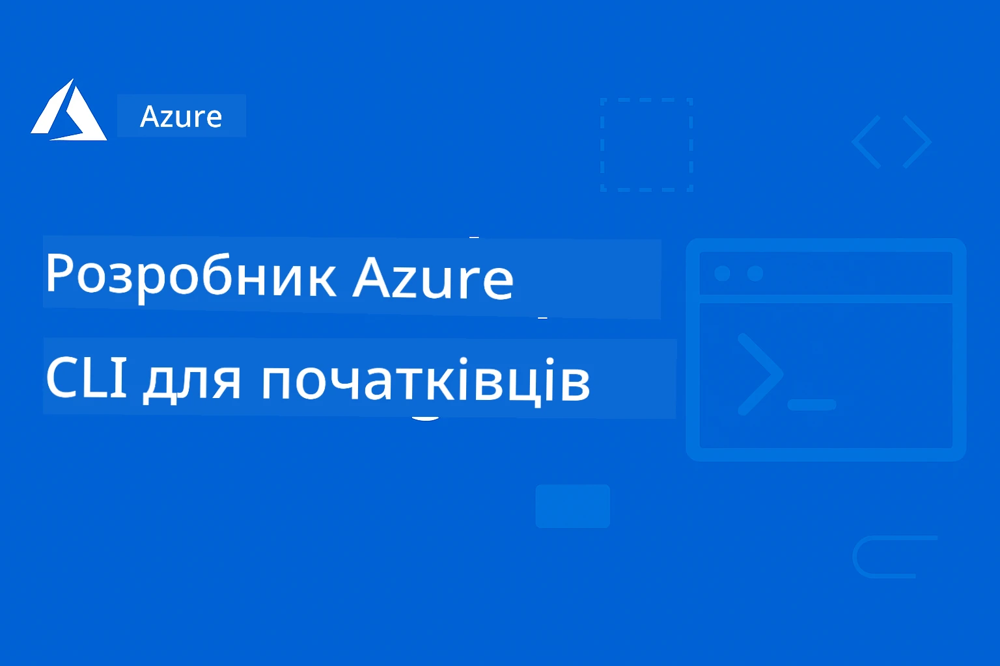

# AZD для початківців: структурована навчальна подорож

 

[](https://GitHub.com/microsoft/azd-for-beginners/watchers/)
[](https://GitHub.com/microsoft/azd-for-beginners/network/)
[](https://GitHub.com/microsoft/azd-for-beginners/stargazers/)

[](https://discord.com/invite/nkVh3dp)
[](https://discord.gg/nTYy5BXMWG)

---

### Автоматичні переклади (завжди актуальні)

<!-- CO-OP TRANSLATOR LANGUAGES TABLE START -->
[Арабська](../ar/README.md) | [Бенгальська](../bn/README.md) | [Болгарська](../bg/README.md) | [Бірманська (М’янма)](../my/README.md) | [Китайська (спрощена)](../zh-CN/README.md) | [Китайська (традиційна, Гонконг)](../zh-HK/README.md) | [Китайська (традиційна, Макао)](../zh-MO/README.md) | [Китайська (традиційна, Тайвань)](../zh-TW/README.md) | [Хорватська](../hr/README.md) | [Чеська](../cs/README.md) | [Датська](../da/README.md) | [Голландська](../nl/README.md) | [Естонська](../et/README.md) | [Фінська](../fi/README.md) | [Французька](../fr/README.md) | [Німецька](../de/README.md) | [Грецька](../el/README.md) | [Іврит](../he/README.md) | [Хінді](../hi/README.md) | [Угорська](../hu/README.md) | [Індонезійська](../id/README.md) | [Італійська](../it/README.md) | [Японська](../ja/README.md) | [Каннада](../kn/README.md) | [Кхмерська](../km/README.md) | [Корейська](../ko/README.md) | [Литовська](../lt/README.md) | [Малайська](../ms/README.md) | [Малаялам](../ml/README.md) | [Маратхі](../mr/README.md) | [Непальська](../ne/README.md) | [Нігерійський Піджін](../pcm/README.md) | [Норвезька](../no/README.md) | [Перська (фарсі)](../fa/README.md) | [Польська](../pl/README.md) | [Португальська (Бразилія)](../pt-BR/README.md) | [Португальська (Португалія)](../pt-PT/README.md) | [Панджабі (гурмухі)](../pa/README.md) | [Румунська](../ro/README.md) | [Російська](../ru/README.md) | [Сербська (кирилиця)](../sr/README.md) | [Словацька](../sk/README.md) | [Словенська](../sl/README.md) | [Іспанська](../es/README.md) | [Суахілі](../sw/README.md) | [Шведська](../sv/README.md) | [Тагалог (Філіппінська)](../tl/README.md) | [Тамільська](../ta/README.md) | [Телугу](../te/README.md) | [Тайська](../th/README.md) | [Турецька](../tr/README.md) | [Українська](./README.md) | [Урду](../ur/README.md) | [В’єтнамська](../vi/README.md)

> **Віддаєте перевагу клонуванню локально?**
>
> Цей репозиторій містить понад 50 мовних перекладів, що значно збільшує розмір завантаження. Щоб клонувати без перекладів, використовуйте sparse checkout:
>
> **Bash / macOS / Linux:**
> ```bash
> git clone --filter=blob:none --sparse https://github.com/microsoft/AZD-for-beginners.git
> cd AZD-for-beginners
> git sparse-checkout set --no-cone '/*' '!translations' '!translated_images'
> ```
>
> **CMD (Windows):**
> ```cmd
> git clone --filter=blob:none --sparse https://github.com/microsoft/AZD-for-beginners.git
> cd AZD-for-beginners
> git sparse-checkout set --no-cone "/*" "!translations" "!translated_images"
> ```
>
> Це дає вам усе необхідне для завершення курсу з набагато швидшим завантаженням.
<!-- CO-OP TRANSLATOR LANGUAGES TABLE END -->

## 🆕 Що нового у azd сьогодні

Azure Developer CLI вийшов за межі традиційних вебдодатків та API. Сьогодні azd — це єдиний інструмент для розгортання **будь-яких** додатків в Azure — включно з додатками на базі ШІ та інтелектуальними агентами.

Ось що це означає для вас:

- **Агенти ШІ тепер є першокласними робочими навантаженнями azd.** Ви можете ініціалізувати, розгортати та керувати проектами агентів ШІ за допомогою того ж робочого процесу `azd init` → `azd up`, який ви вже знаєте.
- **Інтеграція Microsoft Foundry** приносить розгортання моделей, хостинг агентів і конфігурацію сервісів ШІ безпосередньо у шаблонну екосистему azd.
- **Основний робочий процес не змінився.** Незалежно від того, чи розгортаєте ви todo-додаток, мікросервіс або мультиагентне рішення ШІ, команди залишаються однаковими.

Якщо ви вже використовували azd раніше, підтримка ШІ — це природне розширення, а не окремий інструмент чи просунутий курс. Якщо ви починаєте з нуля, ви вивчите один робочий процес, який підходить для всього.

---

## 🚀 Що таке Azure Developer CLI (azd)?

**Azure Developer CLI (azd)** — це зручний для розробників інструмент командного рядка, який спрощує розгортання додатків у Azure. Замість того, щоб вручну створювати та підключати десятки ресурсів Azure, ви можете розгорнути цілі додатки однією командою.

### Магія `azd up`

```bash
# Ця єдина команда робить усе:
# ✅ Створює всі ресурси Azure
# ✅ Налаштовує мережу та безпеку
# ✅ Збирає код вашого застосунку
# ✅ Розгортає в Azure
# ✅ Надає вам робоче посилання (URL)
azd up
```

**Ось і все!** Ніяких кліків в Azure Portal, складних ARM-шаблонів для вивчення чи ручної конфігурації — лише працюючі додатки в Azure.

---

## ❓ Azure Developer CLI проти Azure CLI: у чому різниця?

Це найпоширеніше запитання серед початківців. Ось проста відповідь:

| Функція | **Azure CLI (`az`)** | **Azure Developer CLI (`azd`)** |
|---------|---------------------|--------------------------------|
| **Призначення** | Керування окремими ресурсами Azure | Розгортання повних додатків |
| **Підхід** | Орієнтований на інфраструктуру | Орієнтований на додаток |
| **Приклад** | `az webapp create --name myapp...` | `azd up` |
| **Крива навчання** | Потрібно знати сервіси Azure | Потрібно знати лише свій додаток |
| **Кому підходить** | DevOps, інфраструктура | Розробникам, прототипування |

### Проста аналогія

- **Azure CLI** — це як мати всі інструменти для будівництва будинку: молотки, пили, цвяхи. Ви можете збудувати що завгодно, але треба знати будівництво.
- **Azure Developer CLI** — це як найняти підрядника: ви описуєте, що хочете, а він робить будівництво.

### Коли що використовувати

| Сценарій | Використовуйте це |
|----------|------------------|
| "Хочу швидко розгорнути свій вебдодаток" | `azd up` |
| "Потрібно створити лише обліковий запис сховища" | `az storage account create` |
| "Створюю повний AI-додаток" | `azd init --template azure-search-openai-demo` |
| "Потрібно відлагодити конкретний ресурс Azure" | `az resource show` |
| "Хочу готове для продакшна розгортання за кілька хвилин" | `azd up --environment production` |

### Вони працюють разом!

AZD використовує Azure CLI під капотом. Ви можете використовувати обидва:
```bash
# Розгорніть ваш додаток за допомогою AZD
azd up

# Потім тонко налаштуйте конкретні ресурси за допомогою Azure CLI
az webapp config set --name myapp --always-on true
```

---

## 🌟 Знаходьте шаблони в Awesome AZD

Не починайте з нуля! **Awesome AZD** — це спільнотна колекція готових до розгортання шаблонів:

| Ресурс | Опис |
|--------|------|
| 🔗 [**Awesome AZD Gallery**](https://azure.github.io/awesome-azd/) | Переглядайте понад 200 шаблонів з розгортанням в один клік |
| 🔗 [**Подати шаблон**](https://github.com/Azure/awesome-azd/issues) | Долучіть власний шаблон до спільноти |
| 🔗 [**GitHub-репозиторій**](https://github.com/Azure/awesome-azd) | Відзначайте зірочкою і досліджуйте вихідний код |

### Популярні ШІ-шаблони від Awesome AZD

```bash
# RAG-чат з моделями Microsoft Foundry та AI-пошуком
azd init --template azure-search-openai-demo

# Швидкий чат-додаток зі ШІ
azd init --template openai-chat-app-quickstart

# Агенти ШІ з використанням Foundry Agents
azd init --template get-started-with-ai-agents
```

---

## 🎯 Початок роботи за 3 кроки

Перед початком переконайтеся, що ваш комп’ютер готовий для розгортання вибраного шаблону:

**Windows:**
```powershell
.\validate-setup.ps1
```

**macOS / Linux:**
```bash
bash ./validate-setup.sh
```

Якщо будь-яка перевірка не проходить, спершу виправте це і тоді переходьте до швидкого старту.

### Крок 1: Встановіть AZD (2 хвилини)

**Windows:**
```powershell
winget install microsoft.azd
```

**macOS:**
```bash
brew tap azure/azd && brew install azd
```

**Linux:**
```bash
curl -fsSL https://aka.ms/install-azd.sh | bash
```

### Крок 2: Авторизуйтеся для AZD

```bash
# Необов'язково, якщо ви плануєте використовувати команди Azure CLI безпосередньо в цьому курсі
az login

# Необхідно для робочих процесів AZD
azd auth login
```

Якщо не впевнені, що саме потрібно, пройдіть повний процес налаштування в [Встановленні та налаштуваннях](docs/chapter-01-foundation/installation.md#authentication-setup).

### Крок 3: Розгорніть свій перший додаток

```bash
# Ініціалізувати з шаблону
azd init --template todo-nodejs-mongo

# Розгорнути в Azure (створює все!)
azd up
```

**🎉 Все!** Ваш додаток тепер працює в Azure.

### Очищення (не забудьте!)

```bash
# Remove all resources when done experimenting
azd down --force --purge
```

---

## 📚 Як користуватися цим курсом

Цей курс розроблений для **поступового навчання** — починайте там, де зручно, і рухайтесь далі:

| Ваш рівень досвіду | Починайте тут |
|--------------------|--------------|
| **Новачок у Azure** | [Розділ 1: Основа](#-chapter-1-foundation--quick-start) |
| **Знаєте Azure, але новачок у AZD** | [Розділ 1: Основа](#-chapter-1-foundation--quick-start) |
| **Хочете розгортати ШІ-додатки** | [Розділ 2: Розробка з акцентом на ШІ](#-chapter-2-ai-first-development-recommended-for-ai-developers) |
| **Потрібна практична робота** | [🎓 Інтерактивний воркшоп](workshop/README.md) — 3-4 години керованої практики |
| **Потрібні шаблони для продакшна** | [Розділ 8: Продакшн та корпоративні шаблони](#-chapter-8-production--enterprise-patterns) |

### Швидке налаштування

1. **Форкніть цей репозиторій**: [](https://GitHub.com/microsoft/azd-for-beginners/fork)
2. **Клонувати**: `git clone https://github.com/YOUR-USERNAME/azd-for-beginners.git`
3. **Отримати допомогу**: [Azure Discord Community](https://discord.com/invite/ByRwuEEgH4)

> **Віддаєте перевагу клонуванню локально?**

> Цей репозиторій містить понад 50 мовних перекладів, що значно збільшує розмір завантаження. Щоб клонувати без перекладів, використовуйте sparse checkout:
> ```bash
> git clone --filter=blob:none --sparse https://github.com/microsoft/AZD-for-beginners.git
> cd AZD-for-beginners
> git sparse-checkout set --no-cone '/*' '!translations' '!translated_images'
> ```
> Це дасть усе необхідне для проходження курсу з набагато швидшим завантаженням.


## Огляд курсу

Опановуйте Azure Developer CLI (azd) через структуровані розділи, розроблені для поступового навчання. **Особлива увага приділяється розгортанню ШІ-додатків з інтеграцією Microsoft Foundry.**

### Чому цей курс необхідний сучасним розробникам

Базуючись на інсайтах спільноти Microsoft Foundry Discord, **45% розробників хочуть використовувати AZD для робочих навантажень ШІ**, але стикаються з труднощами:
- Складні мультисервісні архітектури ШІ
- Кращі практики продакшн-розгортання ШІ  
- Інтеграція та налаштування сервісів Azure AI
- Оптимізація витрат для навантажень ШІ
- Усунення проблем специфічних для розгортання ШІ

### Навчальні цілі

Завершивши цей структурований курс, ви:
- **Оволодієте основами AZD:** ключові поняття, встановлення та налаштування
- **Розгортатимете AI-додатки:** використання AZD з сервісами Microsoft Foundry
- **Впроваджуватимете інфраструктуру як код:** керування ресурсами Azure за допомогою шаблонів Bicep
- **Вирішуватимете проблеми розгортання:** усунення поширених помилок і відлагодження
- **Оптимізуєте для продакшн:** безпека, масштабування, моніторинг і управління витратами
- **Створюватимете мультиагентні рішення:** розгортання складних архітектур ШІ

## Перед початком: акаунти, доступи та припущення

Перед тим, як почати Розділ 1, переконайтеся, що у вас налаштовано все необхідне. Кроки встановлення в цьому посібнику припускають, що ці базові умови вже виконані.
- **Підписка Azure**: Ви можете використовувати існуючу підписку з роботи або власного акаунта, або створити [безкоштовну пробну версію](https://aka.ms/azurefreetrial), щоб почати.
- **Дозвіл на створення ресурсів Azure**: Для більшості завдань вам потрібен доступ не нижче рівня **Contributor** до цільової підписки або групи ресурсів. У деяких розділах може знадобитися можливість створювати групи ресурсів, керовані ідентичності та призначення RBAC.
- [**Обліковий запис GitHub**](https://github.com): Корисний для форку репозиторію, відстеження власних змін та використання GitHub Codespaces під час воркшопу.
- **Необхідні локальні інструменти для шаблонів**: Деякі шаблони потребують локально встановлених інструментів, таких як Node.js, Python, Java або Docker. Запустіть валідатор налаштувань до початку роботи, щоб виявити відсутні інструменти на ранньому етапі.
- **Базове знайомство з терміналом**: Не обов’язково бути експертом, але слід комфортно виконувати команди на кшталт `git clone`, `azd auth login` і `azd up`.

> **Працюєте в корпоративній підписці?**  
> Якщо ваше Azure-середовище управляється адміністратором, заздалегідь уточніть, чи можете ви розгортати ресурси в цільовій підписці або групі ресурсів. Якщо ні, попросіть тестову підписку або доступ Contributor перед початком роботи.

> **Новачок в Azure?**  
> Почніть з власної пробної або платної підписки https://aka.ms/azurefreetrial, щоб змогти пройти всі вправи повністю, не очікуючи схвалення на рівні орендаря.

## 🗺️ Карта курсу: Швидка навігація за розділами

Кожен розділ має окремий README з навчальними цілями, швидкими стартами і вправами:

| Розділ | Тема | Уроки | Тривалість | Складність |
|---------|-------|---------|----------|------------|
| **[Розд 1: Основи](docs/chapter-01-foundation/README.md)** | Початок роботи | [Основи AZD](docs/chapter-01-foundation/azd-basics.md) &#124; [Встановлення](docs/chapter-01-foundation/installation.md) &#124; [Перший проект](docs/chapter-01-foundation/first-project.md) | 30-45 хв | ⭐ |
| **[Розд 2: Розробка AI](docs/chapter-02-ai-development/README.md)** | Програми з AI | [Інтеграція Foundry](docs/chapter-02-ai-development/microsoft-foundry-integration.md) &#124; [AI агенти](docs/chapter-02-ai-development/agents.md) &#124; [Розгортання моделі](docs/chapter-02-ai-development/ai-model-deployment.md) &#124; [Воркшоп](docs/chapter-02-ai-development/ai-workshop-lab.md) | 1-2 год | ⭐⭐ |
| **[Розд 3: Конфігурація](docs/chapter-03-configuration/README.md)** | Аутентифікація та безпека | [Конфігурація](docs/chapter-03-configuration/configuration.md) &#124; [Аутентифікація і безпека](docs/chapter-03-configuration/authsecurity.md) | 45-60 хв | ⭐⭐ |
| **[Розд 4: Інфраструктура](docs/chapter-04-infrastructure/README.md)** | IaC та розгортання | [Посібник з розгортання](docs/chapter-04-infrastructure/deployment-guide.md) &#124; [Провізіонування](docs/chapter-04-infrastructure/provisioning.md) | 1-1.5 год | ⭐⭐⭐ |
| **[Розд 5: Багатоагентні рішення](docs/chapter-05-multi-agent/README.md)** | AI агентські рішення | [Роздрібний сценарій](examples/retail-scenario.md) &#124; [Патерни координації](docs/chapter-06-pre-deployment/coordination-patterns.md) | 2-3 год | ⭐⭐⭐⭐ |
| **[Розд 6: Передрозгортання](docs/chapter-06-pre-deployment/README.md)** | Планування і верифікація | [Перевірки перед польотом](docs/chapter-06-pre-deployment/preflight-checks.md) &#124; [Планування ємності](docs/chapter-06-pre-deployment/capacity-planning.md) &#124; [Вибір SKU](docs/chapter-06-pre-deployment/sku-selection.md) &#124; [App Insights](docs/chapter-06-pre-deployment/application-insights.md) | 1 год | ⭐⭐ |
| **[Розд 7: Вирішення проблем](docs/chapter-07-troubleshooting/README.md)** | Налагодження і виправлення | [Типові проблеми](docs/chapter-07-troubleshooting/common-issues.md) &#124; [Налагодження](docs/chapter-07-troubleshooting/debugging.md) &#124; [Проблеми з AI](docs/chapter-07-troubleshooting/ai-troubleshooting.md) | 1-1.5 год | ⭐⭐ |
| **[Розд 8: Продуктивний запуск](docs/chapter-08-production/README.md)** | Корпоративні патерни | [Практики виробництва](docs/chapter-08-production/production-ai-practices.md) | 2-3 год | ⭐⭐⭐⭐ |
| **[🎓 Воркшоп](workshop/README.md)** | Практичне навчання | [Вступ](workshop/docs/instructions/0-Introduction.md) &#124; [Вибір](workshop/docs/instructions/1-Select-AI-Template.md) &#124; [Верифікація](workshop/docs/instructions/2-Validate-AI-Template.md) &#124; [Декомпозиція](workshop/docs/instructions/3-Deconstruct-AI-Template.md) &#124; [Конфігурація](workshop/docs/instructions/4-Configure-AI-Template.md) &#124; [Налаштування](workshop/docs/instructions/5-Customize-AI-Template.md) &#124; [Зняття інфраструктури](workshop/docs/instructions/6-Teardown-Infrastructure.md) &#124; [Підсумок](workshop/docs/instructions/7-Wrap-up.md) | 3-4 год | ⭐⭐ |

**Загальна тривалість курсу:** ~10-14 годин | **Рівень навичок:** Початківець → Готовий до виробництва

---

## 📚 Навчальні розділи

*Виберіть свій навчальний шлях відповідно до рівня досвіду та цілей*

### 🚀 Розділ 1: Основи та швидкий старт
**Вимоги:** Підписка Azure, базові знання командного рядка  
**Тривалість:** 30-45 хвилин  
**Складність:** ⭐

#### Чого ви навчитеся
- Основи Azure Developer CLI
- Встановлення AZD на вашу платформу
- Перше успішне розгортання

#### Навчальні ресурси
- **🎯 Почніть тут**: [Що таке Azure Developer CLI?](#what-is-azure-developer-cli)
- **📖 Теорія**: [Основи AZD](docs/chapter-01-foundation/azd-basics.md) - ключові поняття і терміни
- **⚙️ Налаштування**: [Встановлення і налаштування](docs/chapter-01-foundation/installation.md) - гіди по платформах
- **🛠️ Практика**: [Ваш перший проект](docs/chapter-01-foundation/first-project.md) - покрокове керівництво
- **📋 Шпаргалка**: [Чит-лист команд](resources/cheat-sheet.md)

#### Практичні вправи  
```bash
# Швидка перевірка установки
azd version

# Розгорніть вашу першу програму
azd init --template todo-nodejs-mongo
azd up
```
  
**💡 Результат розділу**: Успішне розгортання простого веб-додатку в Azure за допомогою AZD

**✅ Перевірка успіху:**  
```bash
# Після завершення Розділу 1 ви повинні вміти:
azd version              # Показує встановлену версію
azd init --template todo-nodejs-mongo  # Ініціалізує проект
azd up                  # Розгортає в Azure
azd show                # Відображає URL запущеного додатку
# Додаток відкривається в браузері та працює
azd down --force --purge  # Очищає ресурси
```
  
**📊 Час витрат:** 30-45 хв  
**📈 Рівень після:** Можна самостійно розгортати базові застосунки

---

### 🤖 Розділ 2: Розробка AI-First (Рекомендовано для AI-розробників)
**Вимоги:** Завершено розділ 1  
**Тривалість:** 1-2 год  
**Складність:** ⭐⭐

#### Чого ви навчитеся
- Інтеграція Microsoft Foundry з AZD
- Розгортання програм на базі AI
- Розуміння конфігурації AI-сервісів

#### Навчальні ресурси
- **🎯 Почніть тут**: [Інтеграція Microsoft Foundry](docs/chapter-02-ai-development/microsoft-foundry-integration.md)
- **🤖 AI агенти**: [Керівництво AI агентів](docs/chapter-02-ai-development/agents.md) -розгортання інтелектуальних агентів за допомогою AZD
- **📖 Патерни**: [Розгортання AI-моделей](docs/chapter-02-ai-development/ai-model-deployment.md) - розміщення та керування AI-моделями
- **🛠️ Воркшоп**: [Лабораторія AI](docs/chapter-02-ai-development/ai-workshop-lab.md) - зробіть ваші AI-рішення готовими до AZD
- **🎥 Інтерактивний посібник**: [Матеріали воркшопу](workshop/README.md) - навчання через браузер з MkDocs * середовище DevContainer
- **📋 Шаблони**: [Шаблони Microsoft Foundry](#ресурси-воркшопу)
- **📝 Приклади**: [Приклади розгортання AZD](examples/README.md)

#### Практичні вправи  
```bash
# Розгорніть свій перший додаток зі штучним інтелектом
azd init --template azure-search-openai-demo
azd up

# Спробуйте додаткові шаблони ШІ
azd init --template openai-chat-app-quickstart
azd init --template agent-openai-python-prompty
```
  
**💡 Результат розділу**: Розгортання і конфігурація чат-додатку на базі AI з можливостями RAG

**✅ Перевірка успіху:**  
```bash
# Після Розділу 2 ви зможете:
azd init --template azure-search-openai-demo
azd up
# Тестувати інтерфейс чат-бота на основі ШІ
# Задавати питання та отримувати відповіді на основі ШІ з джерелами
# Перевірити, що інтеграція пошуку працює
azd monitor  # Перевірити, що Application Insights показує телеметрію
azd down --force --purge
```
  
**📊 Час витрат:** 1-2 години  
**📈 Рівень після:** Можна розгортати і конфігурувати AI-застосунки готові до виробництва  
**💰 Розуміння витрат:** Від $80-150/місяць для розробки, $300-3500/місяць для продакшну

#### 💰 Витрати на розгортання AI

**Середовище розробки (приблизно $80-150/місяць):**  
- Microsoft Foundry Models (оплата за використання): $0-50/місяць (залежно від кількості токенів)  
- AI Search (базовий рівень): $75/місяць  
- Container Apps (за споживанням): $0-20/місяць  
- Сховище (стандартне): $1-5/місяць  

**Середовище продакшн (приблизно $300-3,500+/місяць):**  
- Microsoft Foundry Models (PTU для стабільної продуктивності): $3,000+/місяць АБО оплата за використання при великому обсязі  
- AI Search (стандартний рівень): $250/місяць  
- Container Apps (виділені): $50-100/місяць  
- Application Insights: $5-50/місяць  
- Сховище (преміум): $10-50/місяць  

**💡 Поради щодо оптимізації витрат:**  
- Використовуйте Microsoft Foundry Models в безкоштовному рівні для навчання (Azure OpenAI включає 50,000 токенів/місяць)  
- Запускайте `azd down` для деалокації ресурсів, коли не розробляєте активно  
- Починайте з тарифу за споживанням, переходьте на PTU тільки у виробничому середовищі  
- Використовуйте `azd provision --preview` для оцінки витрат до розгортання  
- Увімкніть авто-масштабування: платіть лише за фактичне використання  

**Моніторинг витрат:**  
```bash
# Перевірте приблизні щомісячні витрати
azd provision --preview

# Контролюйте фактичні витрати в порталі Azure
az consumption budget list --resource-group <your-rg>
```
  
---

### ⚙️ Розділ 3: Конфігурація та аутентифікація
**Вимоги:** Завершено розділ 1  
**Тривалість:** 45-60 хвилин  
**Складність:** ⭐⭐

#### Чого ви навчитеся
- Конфігурація і управління середовищами
- Кращі практики аутентифікації та безпеки
- Іменування і організація ресурсів

#### Навчальні ресурси
- **📖 Конфігурація**: [Посібник з налаштування](docs/chapter-03-configuration/configuration.md) - налаштування середовища
- **🔐 Безпека**: [Патерни аутентифікації та керовані ідентичності](docs/chapter-03-configuration/authsecurity.md)  
- **📝 Приклади**: [Приклад додатку з базою даних](examples/database-app/README.md) - AZD приклади баз даних

#### Практичні вправи  
- Налаштування кількох середовищ (dev, staging, prod)  
- Конфігурація аутентифікації з керованою ідентичністю  
- Впровадження конфігурацій, специфічних для середовищ  

**💡 Результат розділу**: Управління кількома середовищами з коректною аутентифікацією й безпекою

---

### 🏗️ Розділ 4: Інфраструктура як код і розгортання
**Вимоги:** Завершено розділи 1-3  
**Тривалість:** 1-1.5 год  
**Складність:** ⭐⭐⭐

#### Чого ви навчитеся
- Розширені патерни розгортання
- Інфраструктура як код за допомогою Bicep
- Стратегії провізіонування ресурсів

#### Навчальні ресурси
- **📖 Розгортання**: [Посібник з розгортання](docs/chapter-04-infrastructure/deployment-guide.md) - повні робочі процеси
- **🏗️ Провізіонування**: [Управління ресурсами Azure](docs/chapter-04-infrastructure/provisioning.md)
- **📝 Приклади**: [Приклад Container App](../../examples/container-app) - контейнери для розгортань

#### Практичні вправи  
- Створення кастомних Bicep шаблонів  
- Розгортання багатосервісних додатків  
- Впровадження стратегій розгортання blue-green

**💡 Результат розділу**: Розгортання складних багатосервісних додатків за допомогою кастомних інфраструктурних шаблонів

---

### 🎯 Розділ 5: Багатоагентні AI рішення (Просунутий рівень)
**Вимоги:** Завершено розділи 1-2  
**Тривалість:** 2-3 год  
**Складність:** ⭐⭐⭐⭐

#### Чого ви навчитеся
- Архітектурні патерни багатоагентної системи
- Оркестрація та координація агентів
- Готові до виробництва AI розгортання

#### Навчальні ресурси
- **🤖 Ключовий проект**: [Багатоагентне рішення для роздрібної торгівлі](examples/retail-scenario.md) - повна імплементація
- **🛠️ ARM шаблони**: [Пакет ARM шаблонів](../../examples/retail-multiagent-arm-template) - розгортання в один клік
- **📖 Архітектура**: [Патерни координації багато агентів](docs/chapter-06-pre-deployment/coordination-patterns.md)

#### Практичні вправи  
```bash
# Розгорнути повне роздрібне багатостатеве рішення
cd examples/retail-multiagent-arm-template
./deploy.sh

# Дослідити конфігурації агентів
az deployment group show --resource-group <rg-name> --name <deployment-name>
```
  
**💡 Результат розділу**: Розгортання і управління готовим до виробництва багатоагентним AI рішенням з агента по роботі з клієнтами і інвентарем

---

### 🔍 Розділ 6: Передрозгортання: Верифікація і планування
**Вимоги:** Завершено розділ 4  
**Тривалість:** 1 год  
**Складність:** ⭐⭐
#### Чого ви навчитеся
- Планування потужностей і валідація ресурсів
- Стратегії вибору SKU
- Перевірки перед запуском та автоматизація

#### Навчальні ресурси
- **📊 Планування**: [Capacity Planning](docs/chapter-06-pre-deployment/capacity-planning.md) - Валідація ресурсів
- **💰 Вибір**: [SKU Selection](docs/chapter-06-pre-deployment/sku-selection.md) - Вигідний вибір
- **✅ Валідація**: [Pre-flight Checks](docs/chapter-06-pre-deployment/preflight-checks.md) - Автоматичні скрипти

#### Практичні вправи
- Запуск скриптів валідації потужності
- Оптимізація вибору SKU для зниження вартості
- Впровадження автоматизованих перевірок перед розгортанням

**💡 Результат розділу**: Валідувати та оптимізувати розгортання перед запуском

---

### 🚨 Розділ 7: Виправлення помилок та налагодження
**Передумови**: будь-який завершений розділ з розгортання  
**Тривалість**: 1-1.5 години  
**Складність**: ⭐⭐

#### Чого ви навчитеся
- Систематичні підходи до налагодження
- Типові проблеми та їх вирішення
- Особливості налагодження AI-систем

#### Навчальні ресурси
- **🔧 Типові проблеми**: [Common Issues](docs/chapter-07-troubleshooting/common-issues.md) - FAQ та рішення
- **🕵️ Налагодження**: [Debugging Guide](docs/chapter-07-troubleshooting/debugging.md) - Покрокові стратегії
- **🤖 Проблеми AI**: [AI-Specific Troubleshooting](docs/chapter-07-troubleshooting/ai-troubleshooting.md) - Проблеми AI-сервісів

#### Практичні вправи
- Діагностика збоїв розгортання
- Вирішення проблем автентифікації
- Налагодження з’єднаності AI-сервісів

**💡 Результат розділу**: Самостійно діагностувати та вирішувати типові проблеми розгортання

---

### 🏢 Розділ 8: Продакшн та корпоративні шаблони
**Передумови**: виконано розділи 1-4  
**Тривалість**: 2-3 години  
**Складність**: ⭐⭐⭐⭐

#### Чого ви навчитеся
- Стратегії розгортання в продакшн
- Корпоративні шаблони безпеки
- Моніторинг і оптимізація вартості

#### Навчальні ресурси
- **🏭 Продакшн**: [Production AI Best Practices](docs/chapter-08-production/production-ai-practices.md) - Корпоративні шаблони
- **📝 Приклади**: [Microservices Example](../../examples/microservices) - Складні архітектури
- **📊 Моніторинг**: [Application Insights integration](docs/chapter-06-pre-deployment/application-insights.md) - Моніторинг

#### Практичні вправи
- Впровадження корпоративних шаблонів безпеки
- Налаштування комплексного моніторингу
- Розгортання в продакшн з належним управлінням

**💡 Результат розділу**: Розгортати додатки корпоративного класу з повним функціоналом продакшн

---

## 🎓 Огляд воркшопу: Практичне навчання

> **⚠️ СТАТУС ВОРКШОПУ: Активна розробка**  
> Матеріали воркшопу знаходяться на стадії розробки та доопрацювання. Основні модулі працюють, але деякі розділи ще не закінчені. Ми активно працюємо над завершенням всього контенту. [Стежити за прогресом →](workshop/README.md)

### Інтерактивні матеріали воркшопу
**Повноцінне практичне навчання з інструментами в браузері та керованими вправами**

Наші матеріали пропонують структурований, інтерактивний досвід навчання, що доповнює вищенаведену навчальну програму по розділах. Воркшоп розрахований як на самостійне вивчення, так і на заняття під керівництвом викладача.

#### 🛠️ Особливості воркшопу
- **Інтерфейс у браузері**: повноцінний воркшоп на MkDocs з пошуком, копіюванням та темами
- **Інтеграція з GitHub Codespaces**: один клік для налаштування середовища розробки
- **Структурований навчальний шлях**: 8 модулів керованих вправ (3-4 години загалом)
- **Прогресивна методологія**: Вступ → Вибір → Валідація → Деконструкція → Конфігурація → Налаштування → Демонтаж → Підсумок
- **Інтерактивне середовище DevContainer**: попередньо налаштовані інструменти і залежності

#### 📚 Структура модулів воркшопу
Воркшоп побудований за **8-модульною прогресивною методологією**, що веде від ознайомлення до майстерності розгортання:

| Модуль | Тема | Що ви зробите | Тривалість |
|--------|-------|----------------|------------|
| **0. Вступ** | Огляд воркшопу | Ознайомлення з цілями, передумовами та структурою воркшопу | 15 хв |
| **1. Вибір** | Пошук шаблонів | Вивчити AZD-шаблони і вибрати підходящий AI-шаблон для вашого сценарію | 20 хв |
| **2. Валідація** | Розгортання та перевірка | Розгорнути шаблон з `azd up` і перевірити працездатність інфраструктури | 30 хв |
| **3. Деконструкція** | Розуміння структури | Використати GitHub Copilot для вивчення архітектури шаблону, Bicep-файлів та організації коду | 30 хв |
| **4. Конфігурація** | Глибоке налаштування azure.yaml | Опановувати конфігурацію `azure.yaml`, хуки життєвого циклу та змінні середовища | 30 хв |
| **5. Налаштування** | Персоналізація | Увімкнути AI Search, трасування, оцінку й налаштувати під свій сценарій | 45 хв |
| **6. Демонтаж** | Очищення | Безпечно демонтувати ресурси `azd down --purge` | 15 хв |
| **7. Підсумок** | Наступні кроки | Огляд досягнень, ключових концепцій і подальше навчання | 15 хв |

**Порядок проведення воркшопу:**  
```
Introduction → Selection → Validation → Deconstruction → Configuration → Customization → Teardown → Wrap-up
     ↓            ↓           ↓              ↓               ↓              ↓            ↓           ↓
  Overview    Find the     Deploy &      Explore        Master         Customize     Clean up    Review &
             right        verify        code &        azure.yaml      for your      resources   next steps
             template                   structure                     scenario
```
  
#### 🚀 Початок роботи з воркшопом  
```bash
# Варіант 1: GitHub Codespaces (Рекомендовано)
# Натисніть "Code" → "Create codespace on main" в репозиторії

# Варіант 2: Локальна розробка
git clone https://github.com/microsoft/azd-for-beginners.git
cd azd-for-beginners/workshop
# Дотримуйтесь інструкцій з налаштування у workshop/README.md
```
  
#### 🎯 Результати навчання воркшопу  
Завершивши воркшоп, учасники зможуть:
- **Розгортати AI-додатки для продакшн**: Використовувати AZD з сервісами Microsoft Foundry  
- **Опановувати мультиагентну архітектуру**: Реалізовувати скоординовані AI-агентські рішення  
- **Впроваджувати найкращі практики безпеки**: Налаштовувати автентифікацію і контроль доступу  
- **Оптимізувати масштабування**: Проєктувати ефективні за вартістю, продуктивні розгортання  
- **Виправляти проблеми розгортання**: Самостійно вирішувати типові проблеми  

#### 📖 Ресурси воркшопу
- **🎥 Інтерактивний гід**: [Workshop Materials](workshop/README.md) - Навчальне середовище у браузері  
- **📋 Інструкції по модулях**:
  - [0. Introduction](workshop/docs/instructions/0-Introduction.md) - Огляд воркшопу та цілі  
  - [1. Selection](workshop/docs/instructions/1-Select-AI-Template.md) - Вибір AI-шаблонів  
  - [2. Validation](workshop/docs/instructions/2-Validate-AI-Template.md) - Розгортання і перевірка шаблонів  
  - [3. Deconstruction](workshop/docs/instructions/3-Deconstruct-AI-Template.md) - Огляд архітектури шаблонів  
  - [4. Configuration](workshop/docs/instructions/4-Configure-AI-Template.md) - Оволодіння azure.yaml  
  - [5. Customization](workshop/docs/instructions/5-Customize-AI-Template.md) - Налаштування для вашого сценарію  
  - [6. Teardown](workshop/docs/instructions/6-Teardown-Infrastructure.md) - Очищення ресурсів  
  - [7. Wrap-up](workshop/docs/instructions/7-Wrap-up.md) - Підсумки та подальші кроки  
- **🛠️ Лабораторія AI воркшопу**: [AI Workshop Lab](docs/chapter-02-ai-development/ai-workshop-lab.md) - Вправи з AI  
- **💡 Швидкий старт**: [Workshop Setup Guide](workshop/README.md#quick-start) - Налаштування середовища

**Ідеально підходить для**: корпоративного навчання, університетських курсів, самостійного вивчення та буткемпів для розробників.

---

## 📖 Детальний огляд можливостей AZD

Окрім базових функцій, AZD пропонує потужні можливості для продакшн-розгортання:

- **Розгортання на основі шаблонів** - Використовуйте готові шаблони для типових шаблонів додатків  
- **Інфраструктура як код** - Керуйте ресурсами Azure за допомогою Bicep або Terraform  
- **Інтегровані робочі процеси** - Плавно створюйте, розгортайте та моніторте додатки  
- **Зручність для розробників** - Оптимізовано для продуктивності та досвіду розробників

### **AZD + Microsoft Foundry: Ідеально для AI-розгортань**

**Чому AZD для AI-рішень?** AZD вирішує ключові проблеми розробників AI:

- **Шаблони, готові до AI** - Попередньо налаштовані шаблони для моделей Microsoft Foundry, когнітивних сервісів і ML-навантажень  
- **Безпечні AI-розгортання** - Вбудовані патерни безпеки для AI-сервісів, API-ключів і кінцевих точок моделей  
- **Продакшн шаблони AI** - Кращі практики для масштабованих, економічних AI-додатків  
- **End-to-End AI робочі процеси** - Від розробки моделей до продакшн-розгортання з моніторингом  
- **Оптимізація вартості** - Інтелектуальне виділення ресурсів та стратегії масштабування для AI-навантажень  
- **Інтеграція з Microsoft Foundry** - Безшовне підключення до каталогу моделей і кінцевих точок Microsoft Foundry

---

## 🎯 Бібліотека шаблонів та прикладів

### Рекомендовані: Microsoft Foundry шаблони
**Починайте звідси, якщо розгортаєте AI-додатки!**

> **Примітка:** Ці шаблони демонструють різні AI-патерни. Деякі — зовнішні Azure Samples, інші — локальні реалізації.

| Шаблон | Розділ | Складність | Сервіси | Тип |
|--------|---------|------------|----------|------|
| [**Get started with AI chat**](https://github.com/Azure-Samples/get-started-with-ai-chat) | Розділ 2 | ⭐⭐ | AzureOpenAI + Azure AI Model Inference API + Azure AI Search + Azure Container Apps + Application Insights | Зовнішній |
| [**Get started with AI agents**](https://github.com/Azure-Samples/get-started-with-ai-agents) | Розділ 2 | ⭐⭐ | Foundry Agents + AzureOpenAI + Azure AI Search + Azure Container Apps + Application Insights| Зовнішній |
| [**Azure Search + OpenAI Demo**](https://github.com/Azure-Samples/azure-search-openai-demo) | Розділ 2 | ⭐⭐ | AzureOpenAI + Azure AI Search + App Service + Storage | Зовнішній |
| [**OpenAI Chat App Quickstart**](https://github.com/Azure-Samples/openai-chat-app-quickstart) | Розділ 2 | ⭐ | AzureOpenAI + Container Apps + Application Insights | Зовнішній |
| [**Agent OpenAI Python Prompty**](https://github.com/Azure-Samples/agent-openai-python-prompty) | Розділ 5 | ⭐⭐⭐ | AzureOpenAI + Azure Functions + Prompty | Зовнішній |
| [**Contoso Chat RAG**](https://github.com/Azure-Samples/contoso-chat) | Розділ 8 | ⭐⭐⭐⭐ | AzureOpenAI + AI Search + Cosmos DB + Container Apps | Зовнішній |
| [**Retail Multi-Agent Solution**](examples/retail-scenario.md) | Розділ 5 | ⭐⭐⭐⭐ | AzureOpenAI + AI Search + Storage + Container Apps + Cosmos DB | **Локальний** |

### Рекомендовані: Комплексні сценарії навчання
**Шаблони додатків, готові для продакшн, відповідно до навчальних розділів**

| Шаблон | Навчальний розділ | Складність | Ключове навчання |
|--------|------------------|------------|------------------|
| [**openai-chat-app-quickstart**](https://github.com/Azure-Samples/openai-chat-app-quickstart) | Розділ 2 | ⭐ | Базові шаблони розгортання AI |
| [**azure-search-openai-demo**](https://github.com/Azure-Samples/azure-search-openai-demo) | Розділ 2 | ⭐⭐ | Впровадження RAG з Azure AI Search |
| [**ai-document-processing**](https://github.com/Azure-Samples/ai-document-processing) | Розділ 4 | ⭐⭐ | Інтеграція Document Intelligence |
| [**agent-openai-python-prompty**](https://github.com/Azure-Samples/agent-openai-python-prompty) | Розділ 5 | ⭐⭐⭐ | Агентська структура та виклик функцій |
| [**contoso-chat**](https://github.com/Azure-Samples/contoso-chat) | Розділ 8 | ⭐⭐⭐ | Оркестровка корпоративного AI |
| [**retail-multi-agent-solution**](examples/retail-scenario.md) | Розділ 5 | ⭐⭐⭐⭐ | Мультиагентна архітектура з агентами Клієнта і Інвентаризації |

### Навчання через тип прикладу

> **📌 Локальні vs. Зовнішні приклади:**  
> **Локальні приклади** (у цьому репозиторії) = Готові до використання одразу  
> **Зовнішні приклади** (Azure Samples) = Клонувати з прив’язаних репозиторіїв

#### Локальні приклади (готові до використання)
- [**Retail Multi-Agent Solution**](examples/retail-scenario.md) - Повна продакшн-реалізація з ARM шаблонами
  - Мультиагентна архітектура (агенти Клієнта + Інвентаризації)
  - Комплексний моніторинг і оцінка
  - Розгортання одним кліком через ARM шаблон

#### Локальні приклади - Контейнерні додатки (Розділи 2-5)
**Повні приклади розгортання контейнерів у цьому репозиторії:**  
- [**Container App Examples**](examples/container-app/README.md) - Повний посібник по контейнеризованих розгортаннях  
  - [Простий Flask API](../../examples/container-app/simple-flask-api) - Базовий REST API зі скейлінгом до нуля  
  - [Архітектура мікросервісів](../../examples/container-app/microservices) - Продакшн готове розгортання мультісервісів  
  - Шаблони швидкого старту, продакшн та просунуті патерни  
  - Керівництво по моніторингу, безпеці та оптимізації вартості

#### Зовнішні приклади - Простий додаток (Розділи 1-2)
**Клонуйте ці Azure Samples репозиторії, щоб почати:**  
- [Простий веб-додаток - Node.js + MongoDB](https://github.com/Azure-Samples/todo-nodejs-mongo) - Базові патерни розгортання  
- [Статичний сайт - React SPA](https://github.com/Azure-Samples/todo-csharp-sql-swa-func) - Розгортання статичного контенту  
- [Container App - Python Flask](https://github.com/Azure-Samples/container-apps-store-api-microservice) - Розгортання REST API

#### Зовнішні приклади - Інтеграція з базою даних (Розділи 3-4)  
- [Додаток бази даних - C# + SQL](https://github.com/Azure-Samples/todo-csharp-sql) - Патерни підключення до бази даних  
- [Функції + Cosmos DB](https://github.com/Azure-Samples/todo-python-mongo-swa-func) - Безсерверний робочий процес даних  

#### Зовнішні приклади - Розширені патерни (Розділи 4-8)
- [Java мікросервіси](https://github.com/Azure-Samples/java-microservices-aca-lab) - Архітектури з кількома сервісами  
- [Завдання Container Apps](https://github.com/Azure-Samples/container-apps-jobs) - Фонове опрацювання  
- [Потік ML для підприємств](https://github.com/Azure-Samples/mlops-v2) - Патерни ML, готові до виробництва  

### Зовнішні колекції шаблонів
- [**Офіційна галерея шаблонів AZD**](https://azure.github.io/awesome-azd/) - Кураторський збір офіційних та спільнотних шаблонів  
- [**Шаблони Azure Developer CLI**](https://learn.microsoft.com/en-us/azure/developer/azure-developer-cli/azd-templates) - Документація Microsoft Learn по шаблонах  
- [**Директорія прикладів**](examples/README.md) - Локальні навчальні приклади з докладними поясненнями  

---

## 📚 Ресурси для навчання та посилання

### Швидкі посилання  
- [**Шпаргалка команд**](resources/cheat-sheet.md) - Основні команди azd, організовані за розділами  
- [**Глосарій**](resources/glossary.md) - Терміни Azure та azd  
- [**FAQ**](resources/faq.md) - Часті запитання, організовані за навчальними розділами  
- [**Посібник для вивчення**](resources/study-guide.md) - Комплексні практичні вправи  

### Практичні майстер-класи  
- [**Майстерня AI Workshop Lab**](docs/chapter-02-ai-development/ai-workshop-lab.md) - Зробіть свої AI-рішення сумісними з AZD (2-3 години)  
- [**Інтерактивний майстер-клас**](workshop/README.md) - 8-модульні керовані вправи з MkDocs і GitHub Codespaces  
  - Послідовність: Вступ → Вибір → Перевірка → Деконструкція → Конфігурація → Налаштування → Завершення → Підсумок  

### Зовнішні ресурси для навчання  
- Документація Azure Developer CLI: [посилання](https://learn.microsoft.com/en-us/azure/developer/azure-developer-cli/)  
- Центр архітектури Azure: [посилання](https://learn.microsoft.com/en-us/azure/architecture/)  
- Калькулятор цін Azure: [посилання](https://azure.microsoft.com/pricing/calculator/)  
- Стан Azure: [посилання](https://status.azure.com/)  

### Навички AI-агента для вашого редактора  
- [**Навички Microsoft Azure на skills.sh**](https://skills.sh/microsoft/github-copilot-for-azure) - 37 відкритих навичок агентів для Azure AI, Foundry, розгортання, діагностики, оптимізації вартості та ін. Встановіть їх у GitHub Copilot, Cursor, Claude Code або будь-який підтримуваний агент:  
  ```bash
  npx skills add microsoft/github-copilot-for-azure
  ```
  
---

## 🔧 Короткий посібник з усунення несправностей

**Поширені проблеми у початківців та швидкі рішення:**

<details>
<summary><strong>❌ "azd: command not found"</strong></summary>

```bash
# Спочатку встановіть AZD
# Windows (PowerShell):
winget install microsoft.azd

# macOS:
brew tap azure/azd && brew install azd

# Linux:
curl -fsSL https://aka.ms/install-azd.sh | bash

# Перевірте встановлення
azd version
```
</details>

<details>
<summary><strong>❌ "No subscription found" або "Subscription not set"</strong></summary>

```bash
# Перелічити доступні підписки
az account list --output table

# Встановити підписку за замовчуванням
az account set --subscription "<subscription-id-or-name>"

# Встановити для середовища AZD
azd env set AZURE_SUBSCRIPTION_ID "<subscription-id>"

# Перевірити
az account show
```
</details>

<details>
<summary><strong>❌ "InsufficientQuota" або "Quota exceeded"</strong></summary>

```bash
# Спробуйте інший регіон Azure
azd env set AZURE_LOCATION "westus2"
azd up

# Або використовуйте менші SKU під час розробки
# Відредагуйте infra/main.parameters.json:
{
  "sku": "B1"  // Instead of "P1V2"
}
```
</details>

<details>
<summary><strong>❌ "azd up" не вдається на півдорозі виконання</strong></summary>

```bash
# Варіант 1: Очистити і повторити спробу
azd down --force --purge
azd up

# Варіант 2: Просто виправити інфраструктуру
azd provision

# Варіант 3: Перевірити детальний статус
azd show

# Варіант 4: Перевірити журнали в Azure Monitor
azd monitor --logs
```
</details>

<details>
<summary><strong>❌ "Authentication failed" або "Token expired"</strong></summary>

```bash
# Повторно автентифікуйтеся для AZD
azd auth logout
azd auth login

# Опціонально: оновіть Azure CLI, якщо ви виконуєте команди az
az logout
az login

# Перевірте автентифікацію
az account show
```
</details>

<details>
<summary><strong>❌ "Resource already exists" або конфлікти імен</strong></summary>

```bash
# AZD генерує унікальні імена, але якщо виникає конфлікт:
azd down --force --purge

# Тоді повторіть спробу з новим середовищем
azd env new dev-v2
azd up
```
</details>

<details>
<summary><strong>❌ Розгортання шаблону зайняло надто багато часу</strong></summary>

**Нормальні часи очікування:**  
- Проста вебпрограма: 5-10 хвилин  
- Програма з базою даних: 10-15 хвилин  
- AI-додатки: 15-25 хвилин (протягування OpenAI повільне)  

```bash
# Перевірити прогрес
azd show

# Якщо зависло більше 30 хвилин, перевірте Azure Portal:
azd monitor --overview
# Шукайте невдалі розгортання
```
</details>

<details>
<summary><strong>❌ "Permission denied" або "Forbidden"</strong></summary>

```bash
# Перевірте свою роль в Azure
az role assignment list --assignee $(az account show --query user.name -o tsv)

# Вам потрібна принаймні роль "Учасник"
# Попросіть свого адміністратора Azure надати:
# - Учасник (для ресурсів)
# - Адміністратор доступу користувачів (для призначень ролей)
```
</details>

<details>
<summary><strong>❌ Не вдається знайти URL розгорнутого застосунку</strong></summary>

```bash
# Показати всі кінцеві точки сервісу
azd show

# Або відкрити портал Azure
azd monitor

# Перевірити конкретний сервіс
azd env get-values
# Шукати змінні *_URL
```
</details>

### 📚 Повні ресурси з усунення несправностей

- **Посібник з поширених проблем:** [Детальні рішення](docs/chapter-07-troubleshooting/common-issues.md)  
- **Проблеми, пов’язані з AI:** [Усунення несправностей AI](docs/chapter-07-troubleshooting/ai-troubleshooting.md)  
- **Посібник з налагодження:** [Покрокове налагодження](docs/chapter-07-troubleshooting/debugging.md)  
- **Отримати допомогу:** [Azure Discord](https://discord.gg/microsoft-azure) #azure-developer-cli  

---

## 🎓 Завершення курсу та сертифікація

### Відстеження прогресу  
Відстежуйте свій прогрес навчання по кожному розділу:

- [ ] **Розділ 1**: Основи та швидкий старт ✅  
- [ ] **Розділ 2**: AI-орієнтована розробка ✅  
- [ ] **Розділ 3**: Конфігурація та автентифікація ✅  
- [ ] **Розділ 4**: Інфраструктура як код та розгортання ✅  
- [ ] **Розділ 5**: AI-рішення з мультиагентами ✅  
- [ ] **Розділ 6**: Передрозгортна перевірка та планування ✅  
- [ ] **Розділ 7**: Усунення несправностей та налагодження ✅  
- [ ] **Розділ 8**: Виробничі та корпоративні патерни ✅  

### Перевірка знань  
Після завершення кожного розділу перевірте свої знання шляхом:  
1. **Практичної вправи**: Виконайте практичне розгортання розділу  
2. **Перевірки знань**: Ознайомлення з розділом FAQ для цього розділу  
3. **Обговорень у спільноті**: Поділіться своїм досвідом у Azure Discord  
4. **Наступного розділу**: Переходьте до наступного рівня складності  

### Переваги завершення курсу  
Після завершення усіх розділів ви отримаєте:  
- **Досвід виробництва**: Розгорнуті реальні AI-додатки в Azure  
- **Професійні навички**: Можливість розгортання, готова для підприємств  
- **Визнання у спільноті**: Активний учасник спільноти розробників Azure  
- **Просування кар’єри**: Популярні знання AZD та розгортання AI  

---

## 🤝 Спільнота та підтримка

### Отримання допомоги та підтримки  
- **Технічні питання**: [Повідомлення про помилки та запити функцій](https://github.com/microsoft/azd-for-beginners/issues)  
- **Питання навчання**: [Спільнота Microsoft Azure Discord](https://discord.gg/microsoft-azure) та [](https://discord.gg/nTYy5BXMWG)  
- **Допомога по AI**: Приєднуйтесь до [](https://discord.gg/nTYy5BXMWG)  
- **Документація**: [Офіційна документація Azure Developer CLI](https://learn.microsoft.com/en-us/azure/developer/azure-developer-cli/)  

### Враження спільноти від Microsoft Foundry Discord  

**Останні результати опитування у каналі #Azure:**  
- **45%** розробників хочуть використовувати AZD для AI робочих навантажень  
- **Найпоширеніші виклики:** Розгортання з кількома сервісами, керування обліковими даними, готовність до виробництва  
- **Найбільш запитані:** AI-специфічні шаблони, посібники з усунення несправностей, найкращі практики  

**Приєднуйтесь до нашої спільноти, щоб:**  
- Ділитися досвідом AZD + AI та отримувати допомогу  
- Мати доступ до ранніх прев’ю нових AI-шаблонів  
- Робити внесок у найкращі практики розгортання AI  
- Впливати на майбутній розвиток AI + AZD  

### Внесок у курс  
Ми вітаємо ваш внесок! Будь ласка, прочитайте наш [Посібник з внеску](CONTRIBUTING.md) для деталей щодо:  
- **Покращення контенту**: Поліпшення існуючих розділів та прикладів  
- **Нові приклади**: Додавання реальних сценаріїв і шаблонів  
- **Переклад**: Допомога підтримувати багатомовність  
- **Звіти про помилки**: Підвищення точності та зрозумілості  
- **Стандарти спільноти**: Дотримання наших інклюзивних правил спільноти  

---

## 📄 Інформація про курс

### Ліцензія  
Цей проєкт ліцензований за ліцензією MIT - дивіться файл [LICENSE](../../LICENSE) для деталей.  

### Пов’язані навчальні ресурси Microsoft  

Наша команда створює інші комплексні навчальні курси:  

<!-- CO-OP TRANSLATOR OTHER COURSES START -->
### LangChain  
[](https://aka.ms/langchain4j-for-beginners)  
[](https://aka.ms/langchainjs-for-beginners?WT.mc_id=m365-94501-dwahlin)  
[](https://github.com/microsoft/langchain-for-beginners?WT.mc_id=m365-94501-dwahlin)  
---

### Azure / Edge / MCP / Агенти  
[](https://github.com/microsoft/AZD-for-beginners?WT.mc_id=academic-105485-koreyst)  
[](https://github.com/microsoft/edgeai-for-beginners?WT.mc_id=academic-105485-koreyst)  
[](https://github.com/microsoft/mcp-for-beginners?WT.mc_id=academic-105485-koreyst)  
[](https://github.com/microsoft/ai-agents-for-beginners?WT.mc_id=academic-105485-koreyst)  

---
 
### Серія Генеративного AI  
[](https://github.com/microsoft/generative-ai-for-beginners?WT.mc_id=academic-105485-koreyst)  
[-9333EA?style=for-the-badge&labelColor=E5E7EB&color=9333EA)](https://github.com/microsoft/Generative-AI-for-beginners-dotnet?WT.mc_id=academic-105485-koreyst)  
[-C084FC?style=for-the-badge&labelColor=E5E7EB&color=C084FC)](https://github.com/microsoft/generative-ai-for-beginners-java?WT.mc_id=academic-105485-koreyst)  
[-E879F9?style=for-the-badge&labelColor=E5E7EB&color=E879F9)](https://github.com/microsoft/generative-ai-with-javascript?WT.mc_id=academic-105485-koreyst)  

---
 
### Основи навчання  
[](https://aka.ms/ml-beginners?WT.mc_id=academic-105485-koreyst)
[](https://aka.ms/datascience-beginners?WT.mc_id=academic-105485-koreyst)
[](https://aka.ms/ai-beginners?WT.mc_id=academic-105485-koreyst)
[](https://github.com/microsoft/Security-101?WT.mc_id=academic-96948-sayoung)
[](https://aka.ms/webdev-beginners?WT.mc_id=academic-105485-koreyst)
[](https://aka.ms/iot-beginners?WT.mc_id=academic-105485-koreyst)
[](https://github.com/microsoft/xr-development-for-beginners?WT.mc_id=academic-105485-koreyst)

---
 
### Серія Copilot
[](https://aka.ms/GitHubCopilotAI?WT.mc_id=academic-105485-koreyst)
[](https://github.com/microsoft/mastering-github-copilot-for-dotnet-csharp-developers?WT.mc_id=academic-105485-koreyst)
[](https://github.com/microsoft/CopilotAdventures?WT.mc_id=academic-105485-koreyst)
<!-- CO-OP TRANSLATOR OTHER COURSES END -->

---

## 🗺️ Навігація курсом

**🚀 Готові почати навчання?**

**Початківці**: Почніть з [Розділ 1: Основи та швидкий старт](#-chapter-1-foundation--quick-start)  
**Розробники AI**: Перейдіть до [Розділ 2: Розробка з орієнтацією на AI](#-chapter-2-ai-first-development-recommended-for-ai-developers)  
**Досвідчені розробники**: Почніть з [Розділ 3: Конфігурація та автентифікація](#️-chapter-3-configuration--authentication)

**Наступні кроки**: [Почати Розділ 1 - Основи AZD](docs/chapter-01-foundation/azd-basics.md) →

---

<!-- CO-OP TRANSLATOR DISCLAIMER START -->
**Відмова від відповідальності**:  
Цей документ було перекладено за допомогою сервісу автоматичного перекладу [Co-op Translator](https://github.com/Azure/co-op-translator). Хоча ми прагнемо до точності, будь ласка, майте на увазі, що автоматичні переклади можуть містити помилки або неточності. Оригінальний документ рідною мовою слід вважати авторитетним джерелом. Для критичної інформації рекомендується звертатися до професійного людського перекладу. Ми не несемо відповідальність за будь-які непорозуміння чи неправильне тлумачення, що виникли внаслідок використання цього перекладу.
<!-- CO-OP TRANSLATOR DISCLAIMER END -->