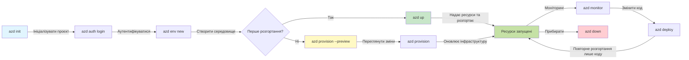
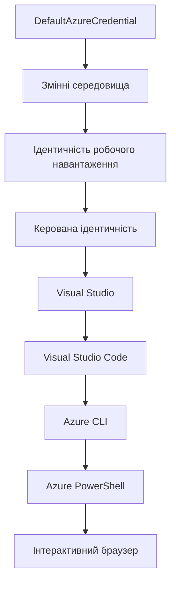

# AZD Основи - Розуміння Azure Developer CLI

# AZD Основи - Основні концепції та фундамент

**Навігація по розділах:**
- **📚 Домашня сторінка курсу**: [AZD для початківців](../../README.md)
- **📖 Поточний розділ**: Розділ 1 - Фундаменти та швидкий старт
- **⬅️ Попередній**: [Огляд курсу](../../README.md#-chapter-1-foundation--quick-start)
- **➡️ Наступний**: [Встановлення та налаштування](installation.md)
- **🚀 Наступний розділ**: [Розділ 2: Розробка з AI в основі](../chapter-02-ai-development/microsoft-foundry-integration.md)

## Вступ

Цей урок знайомить вас із Azure Developer CLI (azd) — потужним інструментом командного рядка, який прискорює ваш шлях від локальної розробки до розгортання в Azure. Ви дізнаєтесь основні концепції, ключові функції та зрозумієте, як azd спрощує розгортання хмарних додатків.

## Навчальні цілі

До кінця цього уроку ви зможете:
- Зрозуміти, що таке Azure Developer CLI та його основне призначення
- Вивчити основні поняття шаблонів, середовищ та сервісів
- Ознайомитися з ключовими функціями, включно з розробкою на основі шаблонів та інфраструктурою як кодом
- Зрозуміти структуру проекту azd і робочий процес
- Підготуватися до встановлення та налаштування azd для вашого середовища розробки

## Результати навчання

Після завершення цього уроку ви зможете:
- Пояснити роль azd у сучасних робочих процесах хмарної розробки
- Ідентифікувати компоненти структури проекту azd
- Описати, як шаблони, середовища та сервіси працюють разом
- Зрозуміти переваги Інфраструктури як коду з azd
- Визначити різні команди azd та їх призначення

## Що таке Azure Developer CLI (azd)?

Azure Developer CLI (azd) — це інструмент командного рядка, створений для прискорення вашого переходу від локальної розробки до розгортання в Azure. Він спрощує процес створення, розгортання та керування хмарними додатками на Azure.

### Що можна розгорнути за допомогою azd?

azd підтримує широкий спектр робочих навантажень — і список постійно зростає. Сьогодні ви можете використовувати azd для розгортання:

| Тип навантаження | Приклади | Чи однаковий робочий процес? |
|------------------|----------|------------------------------|
| **Традиційні додатки** | Веб-додатки, REST API, статичні сайти | ✅ `azd up` |
| **Сервіси та мікросервіси** | Container Apps, Function Apps, багато-сервісні бекенди | ✅ `azd up` |
| **Додатки з AI** | Чат-додатки з моделями Microsoft Foundry, рішення RAG з AI Search | ✅ `azd up` |
| **Інтелектуальні агенти** | Агенти, розміщені в Foundry, оркестрації багатьох агентів | ✅ `azd up` |

Ключовий висновок у тому, що **життєвий цикл azd залишається однаковим, незалежно від того, що ви розгортаєте**. Ви ініціалізуєте проект, провізуєте інфраструктуру, розгортаєте код, моніторите додаток і очищуєте ресурси — чи то простий веб-сайт, чи то складний AI агент.

Це зроблено навмисно. azd розглядає AI можливості як ще один тип сервісу, який ваш додаток може використовувати, а не як щось принципово інше. Точка доступу чат-бота на базі моделей Microsoft Foundry, з погляду azd, — це просто ще один сервіс для налаштування та розгортання.

### 🎯 Чому використовувати AZD? Порівняння на практиці

Порівняємо розгортання простого веб-додатку з базою даних:

#### ❌ БЕЗ AZD: Ручне розгортання в Azure (30+ хвилин)

```bash
# Крок 1: Створіть групу ресурсів
az group create --name myapp-rg --location eastus

# Крок 2: Створіть план служби додатків
az appservice plan create --name myapp-plan \
  --resource-group myapp-rg \
  --sku B1 --is-linux

# Крок 3: Створіть веб-додаток
az webapp create --name myapp-web-unique123 \
  --resource-group myapp-rg \
  --plan myapp-plan \
  --runtime "NODE:18-lts"

# Крок 4: Створіть обліковий запис Cosmos DB (10-15 хвилин)
az cosmosdb create --name myapp-cosmos-unique123 \
  --resource-group myapp-rg \
  --kind MongoDB

# Крок 5: Створіть базу даних
az cosmosdb mongodb database create \
  --account-name myapp-cosmos-unique123 \
  --resource-group myapp-rg \
  --name tododb

# Крок 6: Створіть колекцію
az cosmosdb mongodb collection create \
  --account-name myapp-cosmos-unique123 \
  --resource-group myapp-rg \
  --database-name tododb \
  --name todos

# Крок 7: Отримайте рядок з'єднання
CONN_STR=$(az cosmosdb keys list \
  --name myapp-cosmos-unique123 \
  --resource-group myapp-rg \
  --type connection-strings \
  --query "connectionStrings[0].connectionString" -o tsv)

# Крок 8: Налаштуйте параметри додатка
az webapp config appsettings set \
  --name myapp-web-unique123 \
  --resource-group myapp-rg \
  --settings MONGODB_URI="$CONN_STR"

# Крок 9: Увімкніть ведення журналу
az webapp log config --name myapp-web-unique123 \
  --resource-group myapp-rg \
  --application-logging filesystem \
  --detailed-error-messages true

# Крок 10: Налаштуйте Application Insights
az monitor app-insights component create \
  --app myapp-insights \
  --location eastus \
  --resource-group myapp-rg

# Крок 11: Зв'яжіть App Insights з веб-додатком
INSTRUMENTATION_KEY=$(az monitor app-insights component show \
  --app myapp-insights \
  --resource-group myapp-rg \
  --query "instrumentationKey" -o tsv)

az webapp config appsettings set \
  --name myapp-web-unique123 \
  --resource-group myapp-rg \
  --settings APPINSIGHTS_INSTRUMENTATIONKEY="$INSTRUMENTATION_KEY"

# Крок 12: Побудуйте додаток локально
npm install
npm run build

# Крок 13: Створіть пакет розгортання
zip -r app.zip . -x "*.git*" "node_modules/*"

# Крок 14: Розгорніть додаток
az webapp deployment source config-zip \
  --resource-group myapp-rg \
  --name myapp-web-unique123 \
  --src app.zip

# Крок 15: Почекайте і моліться, щоб все працювало 🙏
# (Автоматичної валідації немає, потрібне ручне тестування)
```

**Проблеми:**
- ❌ Потрібно пам’ятати і виконати понад 15 команд у правильному порядку
- ❌ 30-45 хвилин ручної роботи
- ❌ Легко зробити помилки (описки, невірні параметри)
- ❌ Рядки підключень доступні у історії термінала
- ❌ Відсутній автоматичний відкат при помилках
- ❌ Важко відтворити для членів команди
- ❌ Щоразу по-різному (не відтворюється)

#### ✅ З AZD: Автоматизоване розгортання (5 команд, 10-15 хвилин)

```bash
# Крок 1: Ініціалізація з шаблону
azd init --template todo-nodejs-mongo

# Крок 2: Аутентифікація
azd auth login

# Крок 3: Створення середовища
azd env new dev

# Крок 4: Перегляд змін (необов’язково, але рекомендовано)
azd provision --preview

# Крок 5: Розгорнути все
azd up

# ✨ Готово! Все розгорнуто, налаштовано та моніториться
```

**Переваги:**
- ✅ **5 команд** проти 15+ ручних кроків
- ✅ **10-15 хвилин** загального часу (переважно очікування Azure)
- ✅ **Менше ручних помилок** — послідовний шаблонно-керований робочий процес
- ✅ **Безпечне зберігання секретів** — багато шаблонів використовують Azure-кероване сховище секретів
- ✅ **Повторюване розгортання** — той самий робочий процес щоразу
- ✅ **Повністю відтворюване** — той самий результат щоразу
- ✅ **Готово для команди** — будь-хто може розгорнути з тими ж командами
- ✅ **Інфраструктура як код** — шаблони Bicep під контролем версій
- ✅ **Вбудований моніторинг** — Application Insights налаштовано автоматично

### 📊 Зменшення часу та кількості помилок

| Показник | Ручне розгортання | Розгортання з AZD | Покращення |
|:---------|:------------------|:------------------|:-----------|
| **Команди** | 15+ | 5 | На 67% менше |
| **Час** | 30-45 хв | 10-15 хв | На 60% швидше |
| **Кількість помилок** | ~40% | <5% | Зниження на 88% |
| **Послідовність** | Низька (ручна) | 100% (автоматизована) | Ідеальна |
| **Введення в роботу команди** | 2-4 години | 30 хвилин | На 75% швидше |
| **Час відкату** | 30+ хв (ручний) | 2 хв (автоматизований) | На 93% швидше |

## Основні концепції

### Шаблони
Шаблони — це основа azd. Вони містять:
- **Код програми** — ваш вихідний код та залежності
- **Опис інфраструктури** — ресурси Azure, визначені в Bicep або Terraform
- **Файли конфігурації** — налаштування та змінні середовища
- **Скрипти розгортання** — автоматизовані робочі процеси розгортання

### Середовища
Середовища представляють різні цілі розгортання:
- **Розробка** — для тестування і розробки
- **Проміжне** — середовище передпродукції
- **Продукція** — робоче виробниче середовище

Кожне середовище зберігає власні:
- Групу ресурсів Azure
- Налаштування конфігурації
- Стан розгортання

### Сервіси
Сервіси — це будівельні блоки вашого додатку:
- **Фронтенд** — веб-додатки, SPA
- **Бекенд** — API, мікросервіси
- **База даних** — рішення для зберігання даних
- **Сховище** — файлове та blob-сховище

## Ключові функції

### 1. Розробка на основі шаблонів
```bash
# Переглянути доступні шаблони
azd template list

# Ініціалізувати з шаблону
azd init --template <template-name>
```

### 2. Інфраструктура як код
- **Bicep** — доменно-специфічна мова Azure
- **Terraform** — багатохмарний інструмент для інфраструктури
- **ARM Шаблони** — шаблони Azure Resource Manager

### 3. Інтегровані робочі процеси
```bash
# Повний робочий процес розгортання
azd up            # Налаштування та розгортання, це безручне для першого налаштування

# 🧪 НОВИНКА: Попередній перегляд змін інфраструктури перед розгортанням (БЕЗПЕЧНО)
azd provision --preview    # Імітація розгортання інфраструктури без внесення змін

azd provision     # Створіть ресурси Azure, якщо ви оновлюєте інфраструктуру, використовуйте це
azd deploy        # Розгорніть код додатка або перерозгорніть код додатка після оновлення
azd down          # Очищення ресурсів
```

#### 🛡️ Безпечне планування інфраструктури з попереднім переглядом
Команда `azd provision --preview` — це прорив для безпечних розгортань:
- **Симуляція дій** — показує, що буде створено, змінено або видалено
- **Нульовий ризик** — відсутність реальних змін в Azure середовищі
- **Співпраця команди** — ділитися результатами перегляду перед розгортанням
- **Оцінка вартості** — зрозуміти вартість ресурсів перед використанням

```bash
# Приклад попереднього перегляду робочого процесу
azd provision --preview           # Подивіться, що зміниться
# Перегляньте результати, обговоріть з командою
azd provision                     # Застосуйте зміни з упевненістю
```

### 📊 Візуалізація: Робочий процес розробки з AZD



**Пояснення робочого процесу:**
1. **Ініціалізація** — початок з шаблону або нового проекту
2. **Аутентифікація** — входження в Azure
3. **Середовище** — створення ізольованого середовища розгортання
4. **Попередній перегляд** — 🆕 Завжди спочатку переглядайте зміни інфраструктури (безпечна практика)
5. **Провізування** — створення/оновлення ресурсів Azure
6. **Розгортання** — передача коду додатку
7. **Моніторинг** — спостереження за продуктивністю додатку
8. **Ітерація** — внесення змін і повторне розгортання коду
9. **Очищення** — видалення ресурсів по завершенні

### 4. Керування середовищами
```bash
# Створення та управління середовищами
azd env new <environment-name>
azd env select <environment-name>
azd env list
```

### 5. Розширення та команди AI

azd використовує систему розширень, щоб додавати можливості поза межами базового CLI. Це особливо корисно для робочих навантажень AI:

```bash
# Перелічити доступні розширення
azd extension list

# Встановити розширення агента Foundry
azd extension install azure.ai.agents

# Ініціалізувати проект AI агента з маніфесту
azd ai agent init -m agent-manifest.yaml

# Тестувати розгорнутий агент (показує затримку та час до першого байта)
azd ai agent invoke

# Запустити сервер MCP для розробки з підтримкою AI (Альфа)
azd mcp start
```

**Життєвий цикл агента від початку до кінця.** Після встановлення `azure.ai.agents` один робочий процес проведе вас від ідеї до запущеного, моніторингу агента. Вам не потрібні всі одразу — просто знайте, що вони існують:

| Етап | Команда | Що робить |
|------|---------|-----------|
| **Створення каркасу** | `azd ai agent init -m <manifest>` | Генерує проект агента з маніфесту |
| **Тестування** | `azd ai agent invoke` | Викликає агента і показує час відповіді |
| **Вимірювання** | `azd ai agent eval generate` | Створює датасет для оцінки агента |
| **Удосконалення** | `azd ai agent optimize` | Оптимізує інструкції агента на основі ваших даних |
| **Перевірка** | `azd ai agent endpoint show` | Показує конфігурацію активної кінцевої точки |
| **Очищення** | `azd ai agent delete` | Видаляє розміщеного агента та всі його версії |

> Детальніше про розширення у [Розділі 2: Розробка з AI в основі](../chapter-02-ai-development/agents.md) та у довідці [AZD AI CLI Commands](../chapter-08-production/production-ai-practices.md#azd-ai-cli-commands-and-extensions).

## 📁 Структура проекту

Типова структура проекту azd:
```
my-app/
├── .azd/                    # azd configuration
│   └── config.json
├── .azure/                  # Azure deployment artifacts
├── .devcontainer/          # Development container config
├── .github/workflows/      # GitHub Actions
├── .vscode/               # VS Code settings
├── infra/                 # Infrastructure code
│   ├── main.bicep        # Main infrastructure template
│   ├── main.parameters.json
│   └── modules/          # Reusable modules
├── src/                  # Application source code
│   ├── api/             # Backend services
│   └── web/             # Frontend application
├── azure.yaml           # azd project configuration
└── README.md
```

## 🔧 Файли конфігурації

### azure.yaml
Основний файл конфігурації проекту:
```yaml
name: my-awesome-app
metadata:
  template: my-template@1.0.0

services:
  web:
    project: ./src/web
    language: js
    host: appservice
  api:
    project: ./src/api
    language: js
    host: appservice

hooks:
  preprovision:
    shell: pwsh
    run: echo "Preparing to provision..."
```

### .azure/config.json
Конфігурація, специфічна для середовища:
```json
{
  "version": 1,
  "defaultEnvironment": "dev",
  "environments": {
    "dev": {
      "subscriptionId": "your-subscription-id",
      "location": "eastus"
    }
  }
}
```

## 🎪 Типові робочі процеси з практичними вправами

> **💡 Порада:** Виконуйте ці вправи послідовно, щоб поступово набувати навички роботи з AZD.

### 🎯 Вправа 1: Ініціалізація першого проекту

**Мета:** Створити проект AZD та дослідити його структуру

**Кроки:**
```bash
# Використовуйте перевірений шаблон
azd init --template todo-nodejs-mongo

# Ознайомтеся із згенерованими файлами
ls -la  # Перегляньте всі файли, включно із прихованими

# Створені ключові файли:
# - azure.yaml (основна конфігурація)
# - infra/ (код інфраструктури)
# - src/ (код застосунку)
```

**✅ Успіх:** У вас є директорії azure.yaml, infra/ та src/

---

### 🎯 Вправа 2: Розгортання в Azure

**Мета:** Завершити повне розгортання від початку до кінця

**Кроки:**
```bash
# 1. Авторизуватися
az login && azd auth login

# 2. Створити середовище
azd env new dev
azd env set AZURE_LOCATION eastus

# 3. Попередній перегляд змін (РЕКОМЕНДУЄТЬСЯ)
azd provision --preview

# 4. Розгорнути все
azd up

# 5. Перевірити розгортання
azd show    # Переглянути URL вашого додатку
```

**Очікуваний час:** 10-15 хвилин  
**✅ Успіх:** URL додатку відкривається в браузері

---

### 🎯 Вправа 3: Кілька середовищ

**Мета:** Розгорнути у dev та staging

**Кроки:**
```bash
# Вже є dev, створіть staging
azd env new staging
azd env set AZURE_LOCATION westus2
azd up

# Перемикайтеся між ними
azd env list
azd env select dev
```

**✅ Успіх:** Дві окремі групи ресурсів у порталі Azure

---

### 🛡️ Повне очищення: `azd down --force --purge`

Коли потрібно повністю скинути:

```bash
azd down --force --purge
```

**Що робить:**
- `--force`: Без підтверджень
- `--purge`: Видаляє всі локальні стани та ресурси Azure

**Використовуйте, коли:**
- Розгортання не вдалося посередині процесу
- Зміна проектів
- Потрібен чистий початок

---

## 🎪 Оригінальний робочий процес

### Початок нового проекту
```bash
# Метод 1: Використати існуючий шаблон
azd init --template todo-nodejs-mongo

# Метод 2: Почати з нуля
azd init

# Метод 3: Використати поточний каталог
azd init .
```

### Цикл розробки
```bash
# Налаштувати середовище розробки
azd auth login
azd env new dev
azd env select dev

# Розгорнути все
azd up

# Внести зміни та розгорнути заново
azd deploy

# Очистити після завершення
azd down --force --purge # команда в Azure Developer CLI є **жорстким скиданням** для вашого середовища — особливо корисним, коли ви усуваєте несправності невдалих розгортань, очищуєте залишені ресурси або готуєтеся до нового розгортання.
```

## Розуміння `azd down --force --purge`
Команда `azd down --force --purge` — потужний спосіб повністю видалити середовище azd разом з усіма пов’язаними ресурсами. Ось пояснення кожного прапорця:
```
--force
```
- Пропускає запити на підтвердження.
- Корисно для автоматизації або скриптів, де ручний ввод неможливий.
- Гарантує, що демонтаж відбувається без перерв, навіть якщо CLI виявляє розбіжності.

```
--purge
```
Видаляє **всі пов’язані метадані**, зокрема:
Стан середовища  
Локальну папку `.azure`  
Кешовану інформацію розгортання  
Запобігає «пам’яті» azd про попередні розгортання, що може викликати проблеми, як-от невідповідність груп ресурсів або застарілі посилання реєстру.

### Чому використовувати обидва?

Якщо ви зіткнулися з проблемами `azd up` через залишковий стан або часткові розгортання, ця комбінація забезпечує **чистий старт**.

Особливо корисна після ручного видалення ресурсів у порталі Azure або при зміні шаблонів, середовищ чи іменування груп ресурсів.

### Керування кількома середовищами
```bash
# Створити тестове середовище
azd env new staging
azd env select staging
azd up

# Повернутися до розробки
azd env select dev

# Порівняти середовища
azd env list
```

## 🔐 Аутентифікація та облікові дані

Розуміння аутентифікації є критично важливим для успішних розгортань з azd. Azure використовує кілька методів аутентифікації, і azd використовує ту ж ланцюжок облікових даних, що й інші Azure інструменти.

### Аутентифікація через Azure CLI (`az login`)

Перед використанням azd потрібно аутентифікуватися в Azure. Найпоширеніший метод — через Azure CLI:

```bash
# Інтерактивний вхід (відкриває браузер)
az login

# Вхід з конкретним орендарем
az login --tenant <tenant-id>

# Вхід за допомогою сервісного облікового запису
az login --service-principal -u <app-id> -p <password> --tenant <tenant-id>

# Перевірити поточний статус входу
az account show

# Список доступних підписок
az account list --output table

# Встановити підписку за замовчуванням
az account set --subscription <subscription-id>
```

### Потік аутентифікації
1. **Інтерактивний вхід**: Відкриває ваш браузер за замовчуванням для аутентифікації
2. **Потік з кодом пристрою**: Для середовищ без доступу до браузера
3. **Сервісний обліковий запис (Service Principal)**: Для автоматизації та CI/CD сценаріїв
4. **Керована ідентичність**: Для додатків, розміщених в Azure

### Ланцюг DefaultAzureCredential

`DefaultAzureCredential` — це тип облікових даних, який спрощує аутентифікацію, автоматично перевіряючи кілька джерел у певному порядку:

#### Порядок перевірки облікових даних


#### 1. Змінні середовища
```bash
# Встановіть змінні оточення для сервісного облікового запису
export AZURE_CLIENT_ID="<app-id>"
export AZURE_CLIENT_SECRET="<password>"
export AZURE_TENANT_ID="<tenant-id>"
```

#### 2. Workload Identity (Kubernetes/GitHub Actions)
Автоматично використовується в:
- Azure Kubernetes Service (AKS) з Workload Identity
- GitHub Actions з OIDC федерацією
- Інші сценарії федеративної ідентичності

#### 3. Керована ідентичність
Для ресурсів Azure, як от:
- Віртуальні машини
- App Service
- Azure Functions
- Container Instances

```bash
# Перевірте, чи запускається на ресурсі Azure з керованою ідентичністю
az account show --query "user.type" --output tsv
# Повертає: "servicePrincipal", якщо використовується керована ідентичність
```

#### 4. Інтеграція з інструментами розробника
- **Visual Studio**: Автоматично використовує зареєстрований обліковий запис
- **VS Code**: Використовує облікові дані розширення Azure Account
- **Azure CLI**: Використовує облікові дані `az login` (найпоширеніший варіант для локальної розробки)

### Налаштування аутентифікації AZD

```bash
# Метод 1: Використання Azure CLI (Рекомендується для розробки)
az login
azd auth login  # Використовує наявні облікові дані Azure CLI

# Метод 2: Прям аутентифікація azd
azd auth login --use-device-code  # Для безголових середовищ

# Метод 3: Перевірка стану аутентифікації
azd auth login --check-status

# Метод 4: Вихід та повторна аутентифікація
azd auth logout
azd auth login
```

### Рекомендації з аутентифікації

#### Для локальної розробки
```bash
# 1. Увійдіть за допомогою Azure CLI
az login

# 2. Перевірте правильність підписки
az account show
az account set --subscription "Your Subscription Name"

# 3. Використовуйте azd з існуючими обліковими даними
azd auth login
```

#### Для CI/CD конвеєрів
```yaml
# GitHub Actions example
- name: Azure Login
  uses: azure/login@v1
  with:
    creds: ${{ secrets.AZURE_CREDENTIALS }}

- name: Deploy with azd
  run: |
    azd auth login --client-id ${{ secrets.AZURE_CLIENT_ID }} \
                    --client-secret ${{ secrets.AZURE_CLIENT_SECRET }} \
                    --tenant-id ${{ secrets.AZURE_TENANT_ID }}
    azd up --no-prompt
```

#### Для продуктивних середовищ
- Використовуйте **керовану ідентичність** при роботі на ресурсах Azure
- Використовуйте **Service Principal** для сценаріїв автоматизації
- Уникайте зберігання облікових даних у коді або файлах конфігурації
- Використовуйте **Azure Key Vault** для конфіденційних налаштувань

### Загальні проблеми автентифікації та їх вирішення

#### Проблема: "Підписка не знайдена"
```bash
# Рішення: Встановити підписку за замовчуванням
az account list --output table
az account set --subscription "<subscription-id>"
azd env set AZURE_SUBSCRIPTION_ID "<subscription-id>"
```

#### Проблема: "Недостатньо прав"
```bash
# Рішення: Перевірити та призначити необхідні ролі
az role assignment list --assignee $(az account show --query user.name --output tsv)

# Загальні необхідні ролі:
# - Учасник (для управління ресурсами)
# - Адміністратор доступу користувачів (для призначення ролей)
```

#### Проблема: "Токен протермінувався"
```bash
# Рішення: Повторна аутентифікація
az logout
az login
azd auth logout
azd auth login
```

### Автентифікація у різних сценаріях

#### Локальна розробка
```bash
# Рахунок особистого розвитку
az login
azd auth login
```

#### Командна розробка
```bash
# Використовуйте конкретного орендаря для організації
az login --tenant contoso.onmicrosoft.com
azd auth login
```

#### Мультиорендні сценарії
```bash
# Перемикання між орендарями
az login --tenant tenant1.onmicrosoft.com
# Розгортання для орендаря 1
azd up

az login --tenant tenant2.onmicrosoft.com  
# Розгортання для орендаря 2
azd up
```

### Міркування щодо безпеки

1. **Зберігання облікових даних**: Ніколи не зберігайте облікові дані у вихідному коді
2. **Обмеження області дії**: Використовуйте принцип найменших привілеїв для service principals
3. **Ротація токенів**: Регулярно оновлюйте секрети service principal
4. **Аудит діяльності**: Моніторинг автентифікації та розгортання
5. **Безпека мережі**: Використовуйте приватні кінцеві точки, коли це можливо

### Вирішення проблем автентифікації

```bash
# Налагодження проблем автентифікації
azd auth login --check-status
az account show
az account get-access-token

# Загальні діагностичні команди
whoami                          # Поточний контекст користувача
az ad signed-in-user show      # Відомості про користувача Microsoft Entra ID
az group list                  # Тестування доступу до ресурсу
```

## Розуміння `azd down --force --purge`

### Виявлення
```bash
azd template list              # Перегляд шаблонів
azd template show <template>   # Деталі шаблону
azd init --help               # Варіанти ініціалізації
```

### Управління проектом
```bash
azd show                     # Огляд проекту
azd env list                # Доступні середовища та вибране за замовчуванням
azd config show            # Налаштування конфігурації
```

### Моніторинг
```bash
azd monitor                  # Відкрити моніторинг порталу Azure
azd monitor --logs           # Переглянути журнали застосунків
azd monitor --live           # Переглянути живі метрики
azd pipeline config          # Налаштувати CI/CD
```

## Кращі практики

### 1. Використовуйте осмислені імена
```bash
# Добре
azd env new production-east
azd init --template web-app-secure

# Уникати
azd env new env1
azd init --template template1
```

### 2. Використовуйте шаблони
- Починайте з наявних шаблонів
- Налаштовуйте під свої потреби
- Створюйте повторно використовувані шаблони для вашої організації

### 3. Ізольованість середовищ
- Використовуйте окремі середовища для dev/staging/prod
- Ніколи не розгортуйте прямо в продуктивне середовище з локальної машини
- Використовуйте CI/CD конвеєри для розгортання в продуктив

### 4. Управління конфігурацією
- Використовуйте змінні оточення для конфіденційних даних
- Зберігайте конфігурації у системі контролю версій
- Документуйте налаштування, специфічні для середовища

## Послідовність навчання

### Початковий рівень (тиждень 1-2)
1. Встановити azd та аутентифікуватись
2. Розгорнути простий шаблон
3. Зрозуміти структуру проекту
4. Вивчити базові команди (up, down, deploy)

### Середній рівень (тиждень 3-4)
1. Налаштовувати шаблони
2. Керувати кількома середовищами
3. Розуміти інфраструктурний код
4. Налаштовувати CI/CD конвеєри

### Просунутий рівень (тиждень 5+)
1. Створювати власні шаблони
2. Складні схеми інфраструктури
3. Розгортання у кількох регіонах
4. Конфігурації рівня підприємства

## Наступні кроки

**📖 Продовжуйте навчання з Розділу 1:**
- [Встановлення та налаштування](installation.md) - Встановіть azd та налаштуйте його
- [Ваш перший проект](first-project.md) - Виконайте практичне завдання
- [Посібник з конфігурації](configuration.md) - Розширені параметри конфігурації

**🎯 Готові до наступного розділу?**
- [Розділ 2: Розробка з орієнтацією на AI](../chapter-02-ai-development/microsoft-foundry-integration.md) - Почніть створення AI-застосунків

## Додаткові ресурси

- [Огляд Azure Developer CLI](https://learn.microsoft.com/en-us/azure/developer/azure-developer-cli/)
- [Галерея шаблонів](https://azure.github.io/awesome-azd/)
- [Приклади спільноти](https://github.com/Azure-Samples)

---

## 🙋 Часто задавані питання

### Загальні питання

**Питання: У чому різниця між AZD та Azure CLI?**

Відповідь: Azure CLI (`az`) використовується для керування окремими ресурсами Azure. AZD (`azd`) — для керування цілими застосунками:

```bash
# Azure CLI - низькорівневе керування ресурсами
az webapp create --name myapp --resource-group rg
az sql server create --name myserver --resource-group rg
# ...потрібно ще багато команд

# AZD - керування на рівні застосунку
azd up  # Розгортає весь застосунок з усіма ресурсами
```

**Подумайте так:**
- `az` = працює з окремими цеглинками Lego
- `azd` = працює з повними наборами Lego

---

**Питання: Чи потрібно знати Bicep або Terraform, щоб використовувати AZD?**

Відповідь: Ні! Починайте зі шаблонів:
```bash
# Використовуйте існуючий шаблон - знання IaC не потрібні
azd init --template todo-nodejs-mongo
azd up
```

Потім ви можете вивчити Bicep для налаштування інфраструктури. Шаблони — це робочі приклади для навчання.

---

**Питання: Скільки коштує запуск шаблонів AZD?**

Відповідь: Вартість залежить від шаблону. Більшість шаблонів для розробки коштують 50-150$ на місяць:

```bash
# Переглянути витрати перед розгортанням
azd provision --preview

# Завжди очищуйте після використання
azd down --force --purge  # Видаляє всі ресурси
```

**Радимо:** Використовуйте безплатні рівні, де доступно:
- App Service: рівень F1 (безплатний)
- Моделі Microsoft Foundry: Azure OpenAI 50,000 токенів на місяць безплатно
- Cosmos DB: безплатний рівень 1000 RU/s

---

**Питання: Чи можна використовувати AZD зі своїми існуючими ресурсами Azure?**

Відповідь: Так, але легше починати з нуля. AZD найкраще працює, коли управляє повним життєвим циклом. Для існуючих ресурсів:

```bash
# Варіант 1: Імпортувати існуючі ресурси (для просунутих користувачів)
azd init
# Потім змініть infra/ для посилання на існуючі ресурси

# Варіант 2: Почати з нуля (рекомендовано)
azd init --template matching-your-stack
azd up  # Створює нове середовище
```

---

**Питання: Як поділитися проектом з командою?**

Відповідь: Зафіксуйте проект AZD у Git (але НЕ папку .azure):

```bash
# Вже за замовчуванням у .gitignore
.azure/        # Містить секрети та дані оточення
*.env          # Змінні оточення

# Учасники команди тоді:
git clone <your-repo>
azd auth login
azd env new <their-name>-dev
azd up
```

Всі отримують однакову інфраструктуру зі спільних шаблонів.

---

### Питання з вирішення проблем

**Питання: Команда "azd up" зупинилась посередині. Що робити?**

Відповідь: Перевірте помилку, виправте її, потім спробуйте знову:

```bash
# Переглянути детальні журнали
azd show

# Загальні виправлення:

# 1. Якщо перевищено квоту:
azd env set AZURE_LOCATION "westus2"  # Спробуйте інший регіон

# 2. Якщо конфлікт імені ресурсу:
azd down --force --purge  # Почистити все
azd up  # Спробувати знову

# 3. Якщо термін дії автентифікації минув:
az login
azd auth login
azd up
```

**Найпоширеніша проблема:** Вибрана неправильна підписка Azure
```bash
az account list --output table
az account set --subscription "<correct-subscription>"
```

---

**Питання: Як розгорнути тільки зміни в коді, без повторного розгортання інфраструктури?**

Відповідь: Використовуйте `azd deploy` замість `azd up`:

```bash
azd up          # Перший раз: підготовка + розгортання (повільно)

# Вносьте зміни до коду...

azd deploy      # Наступні рази: лише розгортання (швидко)
```

Порівняння швидкості:
- `azd up`: 10-15 хвилин (розгортає інфраструктуру)
- `azd deploy`: 2-5 хвилин (тільки код)

---

**Питання: Чи можна налаштовувати шаблони інфраструктури?**

Відповідь: Так! Редагуйте файли Bicep у папці `infra/`:

```bash
# Після azd init
cd infra/
code main.bicep  # Редагувати у VS Code

# Попередній перегляд змін
azd provision --preview

# Застосувати зміни
azd provision
```

**Порада:** Починайте з малого — спочатку змінюйте SKU:
```bicep
// infra/main.bicep
sku: {
  name: 'B1'  // Change to 'P1V2' for production
}
```

---

**Питання: Як видалити все, що створив AZD?**

Відповідь: Однією командою можна видалити всі ресурси:

```bash
azd down --force --purge

# Це видаляє:
# - Всі ресурси Azure
# - Групу ресурсів
# - Стан локального середовища
# - Кешовані дані розгортання
```

**Завжди запускайте, коли:**
- Закінчили тестування шаблону
- Переключаєтеся на інший проект
- Хочете почати заново

**Економія:** Видалення невикористовуваних ресурсів = 0$ нарахувань

---

**Питання: Що робити, якщо випадково видалив ресурси у порталі Azure?**

Відповідь: Стан AZD може не відповідати дійсності. Кращий варіант — почати з чистої дошки:

```bash
# 1. Видалити локальний стан
azd down --force --purge

# 2. Почати заново
azd up

# Альтернатива: Дозволити AZD виявляти та виправляти
azd provision  # Створить відсутні ресурси
```

---

### Просунуті питання

**Питання: Чи можна використовувати AZD у CI/CD конвеєрах?**

Відповідь: Так! Приклад для GitHub Actions:

```yaml
# .github/workflows/deploy.yml
name: Deploy with AZD

on:
  push:
    branches: [main]

jobs:
  deploy:
    runs-on: ubuntu-latest
    steps:
      - uses: actions/checkout@v2
      
      - name: Install azd
        run: curl -fsSL https://aka.ms/install-azd.sh | bash
      
      - name: Azure Login
        run: |
          azd auth login \
            --client-id ${{ secrets.AZURE_CLIENT_ID }} \
            --client-secret ${{ secrets.AZURE_CLIENT_SECRET }} \
            --tenant-id ${{ secrets.AZURE_TENANT_ID }}
      
      - name: Deploy
        run: azd up --no-prompt
```

---

**Питання: Як працювати з секретами та конфіденційними даними?**

Відповідь: AZD автоматично інтегрується з Azure Key Vault:

```bash
# Секрети зберігаються в Key Vault, а не в коді
azd env set DATABASE_PASSWORD "$(openssl rand -base64 32)"

# AZD автоматично:
# 1. Створює Key Vault
# 2. Зберігає секрет
# 3. Надає доступ додатку через Managed Identity
# 4. Вставляє під час виконання
```

**Ніколи не комітьте:**
- Папку `.azure/` (містить дані середовища)
- `.env` файли (локальні секрети)
- Рядки підключення

---

**Питання: Чи можна розгортати у кількох регіонах одночасно?**

Відповідь: Так, створюйте окреме середовище для кожного регіону:

```bash
# Середовище Схід США
azd env new prod-eastus
azd env set AZURE_LOCATION eastus
azd up

# Середовище Західна Європа
azd env new prod-westeurope
azd env set AZURE_LOCATION westeurope
azd up

# Кожне середовище є незалежним
azd env list
```

Для справжніх мульти-регіональних застосунків налаштуйте Bicep шаблони для розгортання в кілька регіонів одночасно.

---

**Питання: Де можна отримати допомогу, якщо застряг?**

1. **Документація AZD:** https://learn.microsoft.com/azure/developer/azure-developer-cli/
2. **GitHub Issues:** https://github.com/Azure/azure-dev/issues
3. **Discord:** [Azure Discord](https://discord.gg/microsoft-azure) - канал #azure-developer-cli
4. **Stack Overflow:** тег `azure-developer-cli`
5. **Цей курс:** [Посібник з вирішення проблем](../chapter-07-troubleshooting/common-issues.md)

**Порада:** Перед запитом виконайте:
```bash
azd show       # Показує поточний стан
azd version    # Показує вашу версію
```
Включіть цю інформацію у своє питання для швидшої допомоги.

---

## 🎓 Що далі?

Тепер ви розумієте основи AZD. Виберіть свій шлях:

### 🎯 Для початківців:
1. **Далі:** [Встановлення та налаштування](installation.md) - Встановіть AZD на свою машину
2. **Потім:** [Ваш перший проект](first-project.md) - Розгорніть перший застосунок
3. **Практика:** Виконайте всі 3 вправи цього уроку

### 🚀 Для AI-розробників:
1. **Перейти до:** [Розділ 2: Розробка з орієнтацією на AI](../chapter-02-ai-development/microsoft-foundry-integration.md)
2. **Розгорнути:** Почніть з `azd init --template get-started-with-ai-chat`
3. **Вчитися:** Створюйте під час розгортання

### 🏗️ Для досвідчених розробників:
1. **Оглянути:** [Посібник з конфігурації](configuration.md) - Розширені налаштування
2. **Вивчити:** [Інфраструктура як код](../chapter-04-infrastructure/provisioning.md) - деталі Bicep
3. **Створювати:** Робіть власні шаблони для свого стеку

---

**Навігація розділом:**
- **📚 Головна сторінка курсу**: [AZD для початківців](../../README.md)
- **📖 Поточний розділ**: Розділ 1 - Основи та швидкий старт  
- **⬅️ Попередній**: [Огляд курсу](../../README.md#-chapter-1-foundation--quick-start)
- **➡️ Наступний**: [Встановлення та налаштування](installation.md)
- **🚀 Наступний розділ**: [Розділ 2: Розробка з орієнтацією на AI](../chapter-02-ai-development/microsoft-foundry-integration.md)

---

<!-- CO-OP TRANSLATOR DISCLAIMER START -->
**Відмова від відповідальності**:
Цей документ було перекладено за допомогою сервісу штучного інтелекту для перекладу [Co-op Translator](https://github.com/Azure/co-op-translator). Хоча ми прагнемо до точності, будь ласка, майте на увазі, що автоматичні переклади можуть містити помилки або неточності. Оригінальний документ рідною мовою слід вважати авторитетним джерелом. Для критично важливої інформації рекомендується професійний людський переклад. Ми не несемо відповідальності за будь-які непорозуміння або неправильні тлумачення, що виникли внаслідок використання цього перекладу.
<!-- CO-OP TRANSLATOR DISCLAIMER END -->