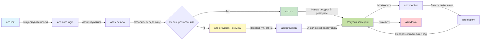

# AZD Basics - Розуміння Azure Developer CLI

# AZD Basics - Основні поняття та фундамент

**Chapter Navigation:**
- **📚 Course Home**: [AZD Для Початківців](../../README.md)
- **📖 Current Chapter**: Розділ 1 - Основи та Швидкий старт
- **⬅️ Previous**: [Огляд курсу](../../README.md#-chapter-1-foundation--quick-start)
- **➡️ Next**: [Встановлення та налаштування](installation.md)
- **🚀 Next Chapter**: [Розділ 2: Розробка з пріоритетом AI](../chapter-02-ai-development/microsoft-foundry-integration.md)

## Вступ

Цей урок знайомить вас із Azure Developer CLI (azd) — потужним інструментом командного рядка, який пришвидшує ваш шлях від локальної розробки до розгортання в Azure. Ви дізнаєтесь основні поняття, ключові функції та зрозумієте, як azd спрощує розгортання cloud-native застосунків.

## Цілі навчання

Після завершення цього уроку ви:
- Зрозумієте, що таке Azure Developer CLI і його основне призначення
- Вивчите основні поняття шаблонів, середовищ і сервісів
- Ознайомитесь із ключовими функціями, включно з розробкою на основі шаблонів та Інфраструктурою як Код
- Зрозумієте структуру проєкту azd та робочий процес
- Будете готові встановити та налаштувати azd для вашого середовища розробки

## Результати навчання

Після завершення цього уроку ви зможете:
- Пояснити роль azd у сучасних робочих процесах розробки для хмари
- Визначити компоненти структури проєкту azd
- Описати, як шаблони, середовища та сервіси працюють разом
- Зрозуміти переваги Інфраструктури як Коду з azd
- Розпізнати різні команди azd та їх призначення

## Що таке Azure Developer CLI (azd)?

Azure Developer CLI (azd) — це інструмент командного рядка, розроблений для прискорення вашого переходу від локальної розробки до розгортання в Azure. Він спрощує процес побудови, розгортання та керування cloud-native застосунками в Azure.

### 🎯 Чому варто використовувати AZD? Порівняння з реального світу

Порівняймо розгортання простого веб-додатка з базою даних:

#### ❌ WITHOUT AZD: Manual Azure Deployment (30+ minutes)

```bash
# Крок 1: Створити групу ресурсів
az group create --name myapp-rg --location eastus

# Крок 2: Створити план App Service
az appservice plan create --name myapp-plan \
  --resource-group myapp-rg \
  --sku B1 --is-linux

# Крок 3: Створити веб-додаток
az webapp create --name myapp-web-unique123 \
  --resource-group myapp-rg \
  --plan myapp-plan \
  --runtime "NODE:18-lts"

# Крок 4: Створити обліковий запис Cosmos DB (10-15 хвилин)
az cosmosdb create --name myapp-cosmos-unique123 \
  --resource-group myapp-rg \
  --kind MongoDB

# Крок 5: Створити базу даних
az cosmosdb mongodb database create \
  --account-name myapp-cosmos-unique123 \
  --resource-group myapp-rg \
  --name tododb

# Крок 6: Створити колекцію
az cosmosdb mongodb collection create \
  --account-name myapp-cosmos-unique123 \
  --resource-group myapp-rg \
  --database-name tododb \
  --name todos

# Крок 7: Отримати рядок підключення
CONN_STR=$(az cosmosdb keys list \
  --name myapp-cosmos-unique123 \
  --resource-group myapp-rg \
  --type connection-strings \
  --query "connectionStrings[0].connectionString" -o tsv)

# Крок 8: Налаштувати параметри додатка
az webapp config appsettings set \
  --name myapp-web-unique123 \
  --resource-group myapp-rg \
  --settings MONGODB_URI="$CONN_STR"

# Крок 9: Увімкнути логування
az webapp log config --name myapp-web-unique123 \
  --resource-group myapp-rg \
  --application-logging filesystem \
  --detailed-error-messages true

# Крок 10: Налаштувати Application Insights
az monitor app-insights component create \
  --app myapp-insights \
  --location eastus \
  --resource-group myapp-rg

# Крок 11: Підключити App Insights до веб-додатка
INSTRUMENTATION_KEY=$(az monitor app-insights component show \
  --app myapp-insights \
  --resource-group myapp-rg \
  --query "instrumentationKey" -o tsv)

az webapp config appsettings set \
  --name myapp-web-unique123 \
  --resource-group myapp-rg \
  --settings APPINSIGHTS_INSTRUMENTATIONKEY="$INSTRUMENTATION_KEY"

# Крок 12: Зібрати додаток локально
npm install
npm run build

# Крок 13: Створити пакет розгортання
zip -r app.zip . -x "*.git*" "node_modules/*"

# Крок 14: Розгорнути додаток
az webapp deployment source config-zip \
  --resource-group myapp-rg \
  --name myapp-web-unique123 \
  --src app.zip

# Крок 15: Чекати й молитися, щоб це спрацювало 🙏
# (Немає автоматичної перевірки, потрібне ручне тестування)
```

**Проблеми:**
- ❌ 15+ команд, які потрібно пам'ятати та виконувати у певному порядку
- ❌ 30-45 хвилин ручної роботи
- ❌ Легко зробити помилку (опечатки, неправильні параметри)
- ❌ Рядки підключення видимі в історії терміналу
- ❌ Немає автоматичного відкату у випадку помилки
- ❌ Важко відтворити для членів команди
- ❌ Щораз по-різному (не відтворювано)

#### ✅ WITH AZD: Automated Deployment (5 commands, 10-15 minutes)

```bash
# Крок 1: Ініціалізація з шаблону
azd init --template todo-nodejs-mongo

# Крок 2: Аутентифікація
azd auth login

# Крок 3: Створення середовища
azd env new dev

# Крок 4: Перегляд змін (необов'язково, але рекомендовано)
azd provision --preview

# Крок 5: Розгорнути все
azd up

# ✨ Готово! Усе розгорнуто, налаштовано та контролюється
```

**Переваги:**
- ✅ **5 команд** проти 15+ ручних кроків
- ✅ **10-15 хвилин** загальний час (в основному очікування на Azure)
- ✅ **Жодних помилок** — автоматизовано і протестовано
- ✅ **Секрети керуються безпечно** через Key Vault
- ✅ **Автоматичний відкат** у разі невдачі
- ✅ **Повністю відтворювано** — той самий результат щоразу
- ✅ **Готово для команди** — будь-хто може розгорнути з тими ж командами
- ✅ **Інфраструктура як Код** — шаблони Bicep під контролем версій
- ✅ **Вбудований моніторинг** — Application Insights налаштовано автоматично

### 📊 Скорочення часу та помилок

| Показник | Ручне розгортання | Розгортання з AZD | Покращення |
|:-------|:------------------|:---------------|:------------|
| **Команди** | 15+ | 5 | на 67% менше |
| **Час** | 30-45 хв | 10-15 хв | на 60% швидше |
| **Рівень помилок** | ~40% | <5% | зниження на 88% |
| **Послідовність** | Низька (ручне) | 100% (автоматизовано) | Ідеально |
| **Адаптація команди** | 2-4 години | 30 хвилин | на 75% швидше |
| **Час відкату** | 30+ хв (ручне) | 2 хв (автоматизовано) | на 93% швидше |

## Основні поняття

### Шаблони
Шаблони — це основа azd. Вони містять:
- **Код застосунку** - Ваш вихідний код та залежності
- **Визначення інфраструктури** - Ресурси Azure, визначені в Bicep або Terraform
- **Файли конфігурації** - Налаштування та змінні середовища
- **Сценарії розгортання** - Автоматизовані робочі процеси розгортання

### Середовища
Середовища представляють різні цілі розгортання:
- **Development** - Для тестування та розробки
- **Staging** - Передвиробниче середовище
- **Production** - Живе продуктивне середовище

Кожне середовище має власні:
- Azure resource group
- Налаштування конфігурації
- Стан розгортання

### Сервіси
Сервіси — це будівельні блоки вашого застосунку:
- **Frontend** - Веб-застосунки, SPA
- **Backend** - API, мікросервіси
- **Database** - Рішення для зберігання даних
- **Storage** - Файлове та Blob-сховище

## Ключові можливості

### 1. Template-Driven Development
```bash
# Переглянути доступні шаблони
azd template list

# Ініціалізувати з шаблону
azd init --template <template-name>
```

### 2. Infrastructure as Code
- **Bicep** - домен-специфічна мова Azure
- **Terraform** - інструмент інфраструктури для мультихмарних середовищ
- **ARM Templates** - шаблони Azure Resource Manager

### 3. Інтегровані робочі процеси
```bash
# Повний робочий процес розгортання
azd up            # Провізіонування + розгортання — працює без ручного втручання при першому налаштуванні

# 🧪 НОВЕ: Перегляд змін інфраструктури перед розгортанням (БЕЗПЕЧНО)
azd provision --preview    # Симулювати розгортання інфраструктури без внесення змін

azd provision     # Створити ресурси Azure — використовуйте це, якщо оновлюєте інфраструктуру
azd deploy        # Розгорнути код застосунку або повторно розгорнути код після оновлення
azd down          # Видалити ресурси
```

#### 🛡️ Безпечне планування інфраструктури з попереднім переглядом
Команда `azd provision --preview` змінює правила гри для безпечних розгортань:
- **Аналіз без внесення змін** - Показує, що буде створено, змінено або видалено
- **Нульовий ризик** - Жодних фактичних змін у вашому Azure середовищі
- **Співпраця в команді** - Діліться результатами попереднього перегляду перед розгортанням
- **Оцінка витрат** - Розумійте вартість ресурсів перед зобов'язанням

```bash
# Приклад робочого процесу попереднього перегляду
azd provision --preview           # Перегляньте, що зміниться
# Перегляньте результат, обговоріть з командою
azd provision                     # Застосуйте зміни з упевненістю
```

### 📊 Візуал: Робочий процес розробки з AZD


**Пояснення робочого процесу:**
1. **Init** - Почати із шаблону або нового проєкту
2. **Auth** - Автентифікуватися в Azure
3. **Environment** - Створити ізольоване середовище розгортання
4. **Preview** - 🆕 Завжди спочатку переглядайте зміни інфраструктури (безпечна практика)
5. **Provision** - Створити/оновити ресурси Azure
6. **Deploy** - Завантажити код вашого застосунку
7. **Monitor** - Спостерігати за продуктивністю застосунку
8. **Iterate** - Вносити зміни та повторно розгортати код
9. **Cleanup** - Видалити ресурси після завершення

### 4. Управління середовищами
```bash
# Створюйте та керуйте середовищами
azd env new <environment-name>
azd env select <environment-name>
azd env list
```

## 📁 Структура проєкту

Типова структура проєкту azd:
```
my-app/
├── .azd/                    # azd configuration
│   └── config.json
├── .azure/                  # Azure deployment artifacts
├── .devcontainer/          # Development container config
├── .github/workflows/      # GitHub Actions
├── .vscode/               # VS Code settings
├── infra/                 # Infrastructure code
│   ├── main.bicep        # Main infrastructure template
│   ├── main.parameters.json
│   └── modules/          # Reusable modules
├── src/                  # Application source code
│   ├── api/             # Backend services
│   └── web/             # Frontend application
├── azure.yaml           # azd project configuration
└── README.md
```

## 🔧 Файли конфігурації

### azure.yaml
Головний файл конфігурації проєкту:
```yaml
name: my-awesome-app
metadata:
  template: my-template@1.0.0

services:
  web:
    project: ./src/web
    language: js
    host: appservice
  api:
    project: ./src/api
    language: js
    host: appservice

hooks:
  preprovision:
    shell: pwsh
    run: echo "Preparing to provision..."
```

### .azure/config.json
Конфігурація, специфічна для середовища:
```json
{
  "version": 1,
  "defaultEnvironment": "dev",
  "environments": {
    "dev": {
      "subscriptionId": "your-subscription-id",
      "location": "eastus"
    }
  }
}
```

## 🎪 Типові робочі процеси з практичними вправами

> **💡 Порада для навчання:** Виконуйте ці вправи в порядку, щоб поступово побудувати свої навички з AZD.

### 🎯 Вправа 1: Ініціалізуйте свій перший проєкт

**Мета:** Створити проєкт AZD та дослідити його структуру

**Кроки:**
```bash
# Використовуйте перевірений шаблон
azd init --template todo-nodejs-mongo

# Перегляньте згенеровані файли
ls -la  # Перегляньте всі файли, включаючи приховані

# Ключові створені файли:
# - azure.yaml (основна конфігурація)
# - infra/ (код інфраструктури)
# - src/ (код додатка)
```

**✅ Успіх:** У вас є файл azure.yaml, папки infra/ та src/

---

### 🎯 Вправа 2: Розгорнути в Azure

**Мета:** Виконати наскрізне розгортання

**Кроки:**
```bash
# 1. Авторизуватися
az login && azd auth login

# 2. Створити середовище
azd env new dev
azd env set AZURE_LOCATION eastus

# 3. Переглянути зміни (РЕКОМЕНДОВАНО)
azd provision --preview

# 4. Розгорнути все
azd up

# 5. Перевірити розгортання
azd show    # Переглянути URL вашого додатка
```

**Очікуваний час:** 10-15 хвилин  
**✅ Успіх:** URL застосунку відкривається в браузері

---

### 🎯 Вправа 3: Кілька середовищ

**Мета:** Розгорнути в dev та staging

**Кроки:**
```bash
# Вже є dev, створіть staging
azd env new staging
azd env set AZURE_LOCATION westus2
azd up

# Перемикайтеся між ними
azd env list
azd env select dev
```

**✅ Успіх:** Дві окремі групи ресурсів у Azure Portal

---

### 🛡️ Повне очищення: `azd down --force --purge`

Коли потрібно повністю скинути:

```bash
azd down --force --purge
```

**Що це робить:**
- `--force`: Без запитів підтвердження
- `--purge`: Видаляє весь локальний стан і ресурси Azure

**Коли використовувати:**
- Розгортання зазнало невдачі посеред процесу
- Перехід між проєктами
- Потрібен чистий початок

---

## 🎪 Оригінальний робочий процес

### Starting a New Project
```bash
# Метод 1: Використати існуючий шаблон
azd init --template todo-nodejs-mongo

# Метод 2: Почати з нуля
azd init

# Метод 3: Використати поточний каталог
azd init .
```

### Development Cycle
```bash
# Налаштуйте середовище розробки
azd auth login
azd env new dev
azd env select dev

# Розгорніть все
azd up

# Внесіть зміни та розгорніть повторно
azd deploy

# Очистіть після завершення
azd down --force --purge # Команда в Azure Developer CLI — це **повне скидання** вашого середовища — особливо корисне, коли ви усуваєте неполадки внаслідок невдалих розгортань, очищуєте покинуті ресурси або готуєтеся до нового розгортання.
```

## Розуміння `azd down --force --purge`
Команда `azd down --force --purge` — це потужний спосіб повністю зруйнувати ваше azd середовище та всі пов'язані ресурси. Ось роз'яснення того, що робить кожен прапорець:
```
--force
```
- Пропускає запити підтвердження.
- Корисно для автоматизації або сценаріїв, де ручний ввід неможливий.
- Забезпечує виконання видалення без перерв, навіть якщо CLI виявляє невідповідності.

```
--purge
```
Видаляє **всі пов'язані метадані**, включно з:
Стан середовища
Локальна папка `.azure`
Кешована інформація про розгортання
Запобігає тому, щоб azd «пам'ятав» попередні розгортання, що може спричиняти проблеми, такі як невідповідні групи ресурсів або застарілі посилання на реєстри.


### Чому використовувати обидва?
Коли ви зіштовхнулись із проблемою при `azd up` через залишковий стан або часткові розгортання, ця комбінація забезпечує **чистий початок**.

Це особливо корисно після ручного видалення ресурсів у порталі Azure або при зміні шаблонів, середовищ або конвенцій іменування груп ресурсів.


### Управління кількома середовищами
```bash
# Створити проміжне (staging) середовище
azd env new staging
azd env select staging
azd up

# Переключитися назад на dev
azd env select dev

# Порівняти середовища
azd env list
```

## 🔐 Аутентифікація та облікові дані

Розуміння аутентифікації має вирішальне значення для успішних розгортань azd. Azure використовує кілька методів автентифікації, і azd використовує той самий ланцюжок облікових даних, що й інші інструменти Azure.

### Аутентифікація Azure CLI (`az login`)

Перш ніж використовувати azd, потрібно автентифікуватися в Azure. Найпоширеніший метод — використовувати Azure CLI:

```bash
# Інтерактивний вхід (відкриває браузер)
az login

# Вхід з конкретним орендарем
az login --tenant <tenant-id>

# Вхід за допомогою сервісного облікового запису
az login --service-principal -u <app-id> -p <password> --tenant <tenant-id>

# Перевірити поточний стан входу
az account show

# Перелічити доступні підписки
az account list --output table

# Встановити підписку за замовчуванням
az account set --subscription <subscription-id>
```

### Потік аутентифікації
1. **Interactive Login**: Відкриває ваш браузер за замовчуванням для аутентифікації
2. **Device Code Flow**: Для середовищ без доступу до браузера
3. **Service Principal**: Для автоматизації та сценаріїв CI/CD
4. **Managed Identity**: Для застосунків, що працюють в Azure

### Ланцюжок DefaultAzureCredential

`DefaultAzureCredential` — це тип облікових даних, який забезпечує спрощений досвід аутентифікації, автоматично перевіряючи кілька джерел облікових даних у певному порядку:

#### Порядок ланцюга облікових даних
```mermaid
graph TD
    A[Облікові дані за замовчуванням (DefaultAzureCredential)] --> B[Змінні середовища]
    B --> C[Ідентичність робочого навантаження]
    C --> D[Керована ідентичність]
    D --> E[Visual Studio]
    E --> F[Visual Studio Code]
    F --> G[Azure CLI]
    G --> H[Azure PowerShell]
    H --> I[Інтерактивний браузер]
```
#### 1. Змінні середовища
```bash
# Встановіть змінні середовища для службового облікового запису
export AZURE_CLIENT_ID="<app-id>"
export AZURE_CLIENT_SECRET="<password>"
export AZURE_TENANT_ID="<tenant-id>"
```

#### 2. Workload Identity (Kubernetes/GitHub Actions)
Використовується автоматично в:
- Azure Kubernetes Service (AKS) з Workload Identity
- GitHub Actions з OIDC federation
- Інші сценарії з федеративною ідентичністю

#### 3. Managed Identity
Для ресурсів Azure, таких як:
- Virtual Machines
- App Service
- Azure Functions
- Container Instances

```bash
# Перевіряє, чи виконується на ресурсі Azure з керованою ідентичністю
az account show --query "user.type" --output tsv
# Повертає: "servicePrincipal", якщо використовується керована ідентичність
```

#### 4. Інтеграція з інструментами для розробників
- **Visual Studio**: Автоматично використовує обліковий запис, у який ви увійшли
- **VS Code**: Використовує облікові дані розширення Azure Account
- **Azure CLI**: Використовує облікові дані `az login` (найпоширеніше для локальної розробки)

### Налаштування автентифікації AZD

```bash
# Метод 1: Використати Azure CLI (Рекомендується для розробки)
az login
azd auth login  # Використовує існуючі облікові дані Azure CLI

# Метод 2: Пряма автентифікація azd
azd auth login --use-device-code  # Для середовищ без інтерфейсу користувача

# Метод 3: Перевірити стан автентифікації
azd auth login --check-status

# Метод 4: Вийти та повторно автентифікуватися
azd auth logout
azd auth login
```

### Кращі практики автентифікації

#### Для локальної розробки
```bash
# 1. Увійдіть за допомогою Azure CLI
az login

# 2. Переконайтеся, що вибрана правильна підписка
az account show
az account set --subscription "Your Subscription Name"

# 3. Використовуйте azd з існуючими обліковими даними
azd auth login
```

#### Для CI/CD конвеєрів
```yaml
# GitHub Actions example
- name: Azure Login
  uses: azure/login@v1
  with:
    creds: ${{ secrets.AZURE_CREDENTIALS }}

- name: Deploy with azd
  run: |
    azd auth login --client-id ${{ secrets.AZURE_CLIENT_ID }} \
                    --client-secret ${{ secrets.AZURE_CLIENT_SECRET }} \
                    --tenant-id ${{ secrets.AZURE_TENANT_ID }}
    azd up --no-prompt
```

#### Для продуктивних середовищ
- Використовуйте **Managed Identity**, коли запускаєте на ресурсах Azure
- Використовуйте **Service Principal** для сценаріїв автоматизації
- Уникайте зберігання облікових даних у коді або файлах конфігурації
- Використовуйте **Azure Key Vault** для чутливої конфігурації

### Поширені проблеми з автентифікацією та рішення

#### Проблема: "No subscription found"
```bash
# Рішення: Встановити підписку за замовчуванням
az account list --output table
az account set --subscription "<subscription-id>"
azd env set AZURE_SUBSCRIPTION_ID "<subscription-id>"
```

#### Проблема: "Insufficient permissions"
```bash
# Рішення: Перевірити та призначити необхідні ролі
az role assignment list --assignee $(az account show --query user.name --output tsv)

# Загальні необхідні ролі:
# - Contributor (для керування ресурсами)
# - User Access Administrator (для призначення ролей)
```

#### Проблема: "Token expired"
```bash
# Рішення: повторно пройти автентифікацію
az logout
az login
azd auth logout
azd auth login
```

### Аутентифікація в різних сценаріях

#### Local Development
```bash
# Обліковий запис особистого розвитку
az login
azd auth login
```

#### Team Development
```bash
# Використовуйте конкретний тенант для організації
az login --tenant contoso.onmicrosoft.com
azd auth login
```

#### Multi-tenant Scenarios
```bash
# Переключитися між орендарями
az login --tenant tenant1.onmicrosoft.com
# Розгорнути для орендаря 1
azd up

az login --tenant tenant2.onmicrosoft.com  
# Розгорнути для орендаря 2
azd up
```

### Міркування щодо безпеки

1. **Зберігання облікових даних**: Ніколи не зберігайте облікові дані в коді джерела
2. **Обмеження області доступу**: Дотримуйтесь принципу найменших привілеїв для service principals
3. **Ротація токенів**: Регулярно оновлюйте секрети service principal
4. **Аудит**: Моніторте дії автентифікації та розгортання
5. **Мережна безпека**: Використовуйте приватні кінцеві точки, коли це можливо

### Виправлення проблем з автентифікацією

```bash
# Налагодження проблем з автентифікацією
azd auth login --check-status
az account show
az account get-access-token

# Типові діагностичні команди
whoami                          # Контекст поточного користувача
az ad signed-in-user show      # Відомості про користувача Azure AD
az group list                  # Перевірка доступу до ресурсу
```

## Розуміння `azd down --force --purge`

### Discovery
```bash
azd template list              # Перегляд шаблонів
azd template show <template>   # Деталі шаблону
azd init --help               # Параметри ініціалізації
```

### Project Management
```bash
azd show                     # Огляд проєкту
azd env show                 # Поточне середовище
azd config list             # Налаштування конфігурації
```

### Monitoring
```bash
azd monitor                  # Відкрийте моніторинг у порталі Azure
azd monitor --logs           # Перегляньте журнали додатка
azd monitor --live           # Перегляньте метрики в реальному часі
azd pipeline config          # Налаштуйте CI/CD
```

## Кращі практики

### 1. Use Meaningful Names
```bash
# Добре
azd env new production-east
azd init --template web-app-secure

# Уникати
azd env new env1
azd init --template template1
```

### 2. Використовуйте шаблони
- Починайте з існуючих шаблонів
- Налаштовуйте під свої потреби
- Створюйте повторно використовувані шаблони для вашої організації

### 3. Ізоляція середовищ
- Використовуйте окремі середовища для dev/staging/prod
- Ніколи не розгортайте безпосередньо в production з локальної машини
- Використовуйте CI/CD конвеєри для розгортань у production

### 4. Управління конфігурацією
- Використовуйте змінні середовища для чутливих даних
- Зберігайте конфігурацію під контролем версій
- Документуйте налаштування, специфічні для середовищ

## Прогрес навчання

### Beginner (Week 1-2)
1. Встановити azd та автентифікуватися
2. Розгорнути простий шаблон
3. Зрозуміти структуру проєкту
4. Вивчити базові команди (up, down, deploy)

### Intermediate (Week 3-4)
1. Налаштовувати шаблони
2. Керувати кількома середовищами
3. Зрозуміти код інфраструктури
4. Налаштувати CI/CD конвеєри

### Advanced (Week 5+)
1. Створювати власні шаблони
2. Складні шаблони інфраструктури
3. Розгортання в кілька регіонів
4. Конфігурації корпоративного рівня

## Наступні кроки

**📖 Продовжити вивчення Розділу 1:**
- [Встановлення та налаштування](installation.md) - Встановіть та налаштуйте azd
- [Ваш перший проект](first-project.md) - Повний практичний посібник
- [Посібник з конфігурації](configuration.md) - Розширені параметри конфігурації

**🎯 Готові до наступної глави?**
- [Розділ 2: Розробка, орієнтована на ШІ](../chapter-02-ai-development/microsoft-foundry-integration.md) - Почніть створювати додатки на базі ШІ

## Додаткові ресурси

- [Огляд Azure Developer CLI](https://learn.microsoft.com/en-us/azure/developer/azure-developer-cli/)
- [Галерея шаблонів](https://azure.github.io/awesome-azd/)
- [Приклади спільноти](https://github.com/Azure-Samples)

---

## 🙋 Часто задані питання

### Загальні питання

**Питання: У чому різниця між AZD та Azure CLI?**

Відповідь: Azure CLI (`az`) призначено для керування окремими ресурсами Azure. AZD (`azd`) — для керування цілими додатками:

```bash
# Azure CLI - керування ресурсами низького рівня
az webapp create --name myapp --resource-group rg
az sql server create --name myserver --resource-group rg
# ...потрібно ще багато команд

# AZD - управління на рівні додатка
azd up  # Розгортає весь додаток зі всіма ресурсами
```

**Подумайте про це так:**
- `az` = Працює з окремими цеглинками LEGO
- `azd` = Працює з повними наборами LEGO

---

**Питання: Чи потрібно знати Bicep або Terraform, щоб використовувати AZD?**

Відповідь: Ні! Почніть з шаблонів:
```bash
# Використовуйте існуючий шаблон - знання IaC не потрібні
azd init --template todo-nodejs-mongo
azd up
```

Ви можете вивчити Bicep пізніше, щоб налаштувати інфраструктуру. Шаблони надають робочі приклади для навчання.

---

**Питання: Скільки коштує запуск шаблонів AZD?**

Відповідь: Вартість залежить від шаблону. Більшість шаблонів для розробки коштують $50-150/month:

```bash
# Перегляньте витрати перед розгортанням
azd provision --preview

# Завжди очищайте, коли не використовуєте
azd down --force --purge  # Видаляє всі ресурси
```

**Порада:** Використовуйте безкоштовні рівні, де доступно:
- App Service: F1 (Free) tier
- Azure OpenAI: 50,000 токенів/month free
- Cosmos DB: 1000 RU/s free tier

---

**Питання: Чи можу я використовувати AZD з існуючими ресурсами Azure?**

Відповідь: Так, але легше почати з нуля. AZD краще працює, коли керує повним життєвим циклом. Для існуючих ресурсів:

```bash
# Варіант 1: Імпортувати існуючі ресурси (для просунутих)
azd init
# Потім змініть infra/, щоб посилатися на існуючі ресурси

# Варіант 2: Почати з нуля (рекомендовано)
azd init --template matching-your-stack
azd up  # Створює нове середовище
```

---

**Питання: Як поділитися проектом з колегами?**

Відповідь: Зафіксуйте (commit) проект AZD у Git (але НЕ папку .azure):

```bash
# Вже за замовчуванням у .gitignore
.azure/        # Містить секрети та дані середовища
*.env          # Змінні середовища

# Тоді члени команди:
git clone <your-repo>
azd auth login
azd env new <their-name>-dev
azd up
```

Усі отримують однакову інфраструктуру з тих самих шаблонів.

---

### Питання усунення неполадок

**Питання: `azd up` не вдалося виконати до кінця. Що робити?**

Відповідь: Перегляньте помилку, виправте її, потім спробуйте ще раз:

```bash
# Переглянути детальні логи
azd show

# Поширені виправлення:

# 1. Якщо квота перевищена:
azd env set AZURE_LOCATION "westus2"  # Спробуйте інший регіон

# 2. Якщо конфлікт імені ресурсу:
azd down --force --purge  # Почати з нуля
azd up  # Спробувати ще раз

# 3. Якщо термін дії автентифікації закінчився:
az login
azd auth login
azd up
```

**Найпоширеніша проблема:** Обрано неправильну підписку Azure
```bash
az account list --output table
az account set --subscription "<correct-subscription>"
```

---

**Питання: Як розгорнути лише зміни в коді без повторного провізування інфраструктури?**

Відповідь: Використовуйте `azd deploy` замість `azd up`:

```bash
azd up          # Вперше: підготовка та розгортання (повільно)

# Внесіть зміни в код...

azd deploy      # У наступні рази: лише розгортання (швидко)
```

Порівняння швидкості:
- `azd up`: 10-15 хвилин (провізує інфраструктуру)
- `azd deploy`: 2-5 хвилин (лише код)

---

**Питання: Чи можу я налаштувати шаблони інфраструктури?**

Відповідь: Так! Редагуйте файли Bicep у `infra/`:

```bash
# Після azd init
cd infra/
code main.bicep  # Редагувати у VS Code

# Попередній перегляд змін
azd provision --preview

# Застосувати зміни
azd provision
```

**Порада:** Почніть з малого - спочатку змініть SKUs:
```bicep
// infra/main.bicep
sku: {
  name: 'B1'  // Change to 'P1V2' for production
}
```

---

**Питання: Як видалити все, що створив AZD?**

Відповідь: Одна команда видаляє всі ресурси:

```bash
azd down --force --purge

# Це видаляє:
# - Усі ресурси Azure
# - Групу ресурсів
# - Локальний стан середовища
# - Кешовані дані розгортання
```

**Завжди запускайте цю команду коли:**
- Закінчили тестування шаблону
- Перехід до іншого проекту
- Хочете почати з нуля

**Економія коштів:** Видалення невикористаних ресурсів = $0 charges

---

**Питання: Що, якщо я випадково видалив ресурси в Azure Portal?**

Відповідь: Стан AZD може розсинхронізуватися. Скидання до чистого стану:

```bash
# 1. Видалити локальний стан
azd down --force --purge

# 2. Почати заново
azd up

# Альтернатива: нехай AZD виявить і виправить
azd provision  # Створить відсутні ресурси
```

---

### Розширені питання

**Питання: Чи можна використовувати AZD у CI/CD конвеєрах?**

Відповідь: Так! Приклад для GitHub Actions:

```yaml
# .github/workflows/deploy.yml
name: Deploy with AZD

on:
  push:
    branches: [main]

jobs:
  deploy:
    runs-on: ubuntu-latest
    steps:
      - uses: actions/checkout@v2
      
      - name: Install azd
        run: curl -fsSL https://aka.ms/install-azd.sh | bash
      
      - name: Azure Login
        run: |
          azd auth login \
            --client-id ${{ secrets.AZURE_CLIENT_ID }} \
            --client-secret ${{ secrets.AZURE_CLIENT_SECRET }} \
            --tenant-id ${{ secrets.AZURE_TENANT_ID }}
      
      - name: Deploy
        run: azd up --no-prompt
```

---

**Питання: Як працювати з секретами та конфіденційними даними?**

Відповідь: AZD автоматично інтегрується з Azure Key Vault:

```bash
# Секрети зберігаються в Key Vault, а не в коді
azd env set DATABASE_PASSWORD "$(openssl rand -base64 32)"

# AZD автоматично:
# 1. Створює Key Vault
# 2. Зберігає секрет
# 3. Надає додатку доступ через керовану ідентичність
# 4. Впроваджує під час виконання
```

**Ніколи не додавайте в коміт:**
- `.azure/` folder (містить дані середовища)
- `.env` files (локальні секрети)
- рядки підключення

---

**Питання: Чи можу я розгортати в кілька регіонів?**

Відповідь: Так, створіть середовище для кожного регіону:

```bash
# Середовище Східних США
azd env new prod-eastus
azd env set AZURE_LOCATION eastus
azd up

# Середовище Західної Європи
azd env new prod-westeurope
azd env set AZURE_LOCATION westeurope
azd up

# Кожне середовище незалежне
azd env list
```

Для справжніх багаторегіональних додатків налаштуйте шаблони Bicep, щоб розгортати в кілька регіонів одночасно.

---

**Питання: Де я можу отримати допомогу, якщо застрягну?**

1. **Документація AZD:** https://learn.microsoft.com/azure/developer/azure-developer-cli/
2. **Issues на GitHub:** https://github.com/Azure/azure-dev/issues
3. **Discord:** [Azure Discord](https://discord.gg/microsoft-azure) - канал #azure-developer-cli
4. **Stack Overflow:** Тег `azure-developer-cli`
5. **Цей курс:** [Посібник з усунення несправностей](../chapter-07-troubleshooting/common-issues.md)

**Порада:** Перед тим як звертатися, запустіть:
```bash
azd show       # Показує поточний стан
azd version    # Показує вашу версію
```
Включіть цю інформацію у ваше питання для швидшої допомоги.

---

## 🎓 Що далі?

Тепер ви розумієте основи AZD. Оберіть свій шлях:

### 🎯 Для початківців:
1. **Далі:** [Встановлення та налаштування](installation.md) - Встановіть AZD на вашому комп'ютері
2. **Потім:** [Ваш перший проект](first-project.md) - Розгорніть свій перший додаток
3. **Практика:** Виконайте всі 3 вправи в цьому уроці

### 🚀 Для розробників ШІ:
1. **Перейти до:** [Розділ 2: Розробка, орієнтована на ШІ](../chapter-02-ai-development/microsoft-foundry-integration.md)
2. **Розгорнути:** Почніть з `azd init --template get-started-with-ai-chat`
3. **Вчіться:** Розробляйте під час розгортання

### 🏗️ Для досвідчених розробників:
1. **Перегляньте:** [Посібник з конфігурації](configuration.md) - Розширені налаштування
2. **Дослідіть:** [Інфраструктура як код](../chapter-04-infrastructure/provisioning.md) - Детальне вивчення Bicep
3. **Будуйте:** Створіть користувацькі шаблони для вашого стека

---

**Навігація по розділу:**
- **📚 Головна курсу**: [AZD для початківців](../../README.md)
- **📖 Поточний розділ**: Розділ 1 - Основи та швидкий старт  
- **⬅️ Попередній**: [Огляд курсу](../../README.md#-chapter-1-foundation--quick-start)
- **➡️ Далі**: [Встановлення та налаштування](installation.md)
- **🚀 Наступний розділ**: [Розділ 2: Розробка, орієнтована на ШІ](../chapter-02-ai-development/microsoft-foundry-integration.md)

---

<!-- CO-OP TRANSLATOR DISCLAIMER START -->
Відмова від відповідальності:
Цей документ було перекладено за допомогою сервісу автоматичного перекладу на основі штучного інтелекту Co-op Translator (https://github.com/Azure/co-op-translator). Хоча ми прагнемо до точності, просимо врахувати, що автоматичні переклади можуть містити помилки або неточності. Оригінальний документ його оригінальною мовою слід вважати авторитетним джерелом. Для критично важливої інформації рекомендується звернутися до професійного перекладу, виконаного людиною. Ми не несемо відповідальності за будь-які непорозуміння або неправильні тлумачення, що виникли внаслідок використання цього перекладу.
<!-- CO-OP TRANSLATOR DISCLAIMER END -->