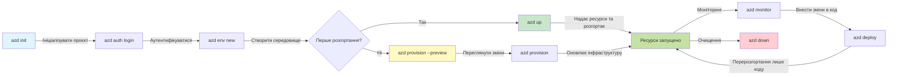
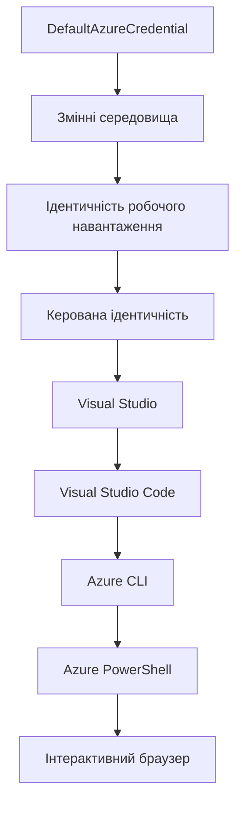

# AZD Basics - Розуміння Azure Developer CLI

# AZD Basics - Основні концепції та фундаментальні поняття

**Навігація по розділах:**
- **📚 Домашня сторінка курсу**: [AZD For Beginners](../../README.md)
- **📖 Поточний розділ**: Розділ 1 - Основи та швидкий старт
- **⬅️ Попередній**: [Огляд курсу](../../README.md#-chapter-1-foundation--quick-start)
- **➡️ Наступний**: [Встановлення та налаштування](installation.md)
- **🚀 Наступний розділ**: [Розділ 2: AI-First Development](../chapter-02-ai-development/microsoft-foundry-integration.md)

## Вступ

Цей урок ознайомить вас з Azure Developer CLI (azd), потужним інструментом командного рядка, який пришвидшує ваш шлях від локальної розробки до розгортання в Azure. Ви дізнаєтесь основні поняття, ключові функції та зрозумієте, як azd спрощує розгортання хмарних додатків.

## Цілі навчання

Після завершення цього уроку ви:
- Зрозумієте, що таке Azure Developer CLI і його основне призначення
- Вивчите основні поняття шаблонів, середовищ та сервісів
- Оглянете ключові функції, включно з розробкою на основі шаблонів та Infrastructure as Code
- Зрозумієте структуру проекту azd та робочий процес
- Будете готові встановити та налаштувати azd для вашого середовища розробки

## Результати навчання

Після проходження уроку ви зможете:
- Пояснити роль azd в сучасних хмарних робочих процесах розробки
- Визначити компоненти структури проекту azd
- Описати, як працюють шаблони, середовища та сервіси разом
- Зрозуміти переваги Infrastructure as Code з azd
- Розпізнати різні команди azd та їх призначення

## Що таке Azure Developer CLI (azd)?

Azure Developer CLI (azd) — це інструмент командного рядка, створений для пришвидшення вашого шляху від локальної розробки до розгортання в Azure. Він спрощує процес створення, розгортання та керування хмарними нативними додатками на Azure.

### Що можна розгорнути з azd?

azd підтримує широкий спектр навантажень — і цей список постійно зростає. Сьогодні ви можете використовувати azd для розгортання:

| Тип навантаження | Приклади | Такий самий робочий процес? |
|------------------|----------|-----------------------------|
| **Традиційні додатки** | Веб-додатки, REST API, статичні сайти | ✅ `azd up` |
| **Сервіси та мікросервіси** | Container Apps, Function Apps, мультисервісні бекенди | ✅ `azd up` |
| **Додатки з AI** | Чат-додатки з моделями Microsoft Foundry, RAG рішення з AI Search | ✅ `azd up` |
| **Інтелектуальні агенти** | Агенти, розміщені у Foundry, оркестрації з кількома агентами | ✅ `azd up` |

Головна ідея: **цикл життя azd залишається однаковим, незалежно від того, що ви розгортаєте**. Ви ініціалізуєте проєкт, створюєте інфраструктуру, розгортаєте код, моніторите додаток та очищуєте — чи то простий вебсайт, чи складний AI-агент.

Ця послідовність зроблена навмисне. azd розглядає AI-функції як ще один тип сервісу, який ваш додаток може використовувати, а не як щось принципово інше. Чат-ендпоінт з моделями Microsoft Foundry, з точки зору azd — це просто ще один сервіс для налаштування та розгортання.

### 🎯 Чому використовувати AZD? Порівняння у реальному світі

Порівняймо розгортання простого веб-додатку з базою даних:

#### ❌ БЕЗ AZD: Ручне розгортання в Azure (понад 30 хвилин)

```bash
# Крок 1: Створити групу ресурсів
az group create --name myapp-rg --location eastus

# Крок 2: Створити план App Service
az appservice plan create --name myapp-plan \
  --resource-group myapp-rg \
  --sku B1 --is-linux

# Крок 3: Створити веб-додаток
az webapp create --name myapp-web-unique123 \
  --resource-group myapp-rg \
  --plan myapp-plan \
  --runtime "NODE:18-lts"

# Крок 4: Створити акаунт Cosmos DB (10-15 хвилин)
az cosmosdb create --name myapp-cosmos-unique123 \
  --resource-group myapp-rg \
  --kind MongoDB

# Крок 5: Створити базу даних
az cosmosdb mongodb database create \
  --account-name myapp-cosmos-unique123 \
  --resource-group myapp-rg \
  --name tododb

# Крок 6: Створити колекцію
az cosmosdb mongodb collection create \
  --account-name myapp-cosmos-unique123 \
  --resource-group myapp-rg \
  --database-name tododb \
  --name todos

# Крок 7: Отримати рядок підключення
CONN_STR=$(az cosmosdb keys list \
  --name myapp-cosmos-unique123 \
  --resource-group myapp-rg \
  --type connection-strings \
  --query "connectionStrings[0].connectionString" -o tsv)

# Крок 8: Налаштувати параметри додатка
az webapp config appsettings set \
  --name myapp-web-unique123 \
  --resource-group myapp-rg \
  --settings MONGODB_URI="$CONN_STR"

# Крок 9: Увімкнути логування
az webapp log config --name myapp-web-unique123 \
  --resource-group myapp-rg \
  --application-logging filesystem \
  --detailed-error-messages true

# Крок 10: Налаштувати Application Insights
az monitor app-insights component create \
  --app myapp-insights \
  --location eastus \
  --resource-group myapp-rg

# Крок 11: Підключити App Insights до веб-додатку
INSTRUMENTATION_KEY=$(az monitor app-insights component show \
  --app myapp-insights \
  --resource-group myapp-rg \
  --query "instrumentationKey" -o tsv)

az webapp config appsettings set \
  --name myapp-web-unique123 \
  --resource-group myapp-rg \
  --settings APPINSIGHTS_INSTRUMENTATIONKEY="$INSTRUMENTATION_KEY"

# Крок 12: Зібрати додаток локально
npm install
npm run build

# Крок 13: Створити пакет розгортання
zip -r app.zip . -x "*.git*" "node_modules/*"

# Крок 14: Розгорнути додаток
az webapp deployment source config-zip \
  --resource-group myapp-rg \
  --name myapp-web-unique123 \
  --src app.zip

# Крок 15: Чекати і молитися, щоб усе працювало 🙏
# (Автоматичної перевірки немає, потрібне ручне тестування)
```

**Проблеми:**
- ❌ Потрібно пам’ятати і виконати понад 15 команд у правильному порядку
- ❌ 30-45 хвилин ручної роботи
- ❌ Висока ймовірність помилок (описки, неправильні параметри)
- ❌ Рядки підключення залишаються у історії термінала
- ❌ Відсутність автоматичного відкату у разі помилки
- ❌ Важко відтворити для інших членів команди
- ❌ Кожного разу результат різний (нераспроізводимо)

#### ✅ З AZD: Автоматизоване розгортання (5 команд, 10-15 хвилин)

```bash
# Крок 1: Ініціалізація з шаблону
azd init --template todo-nodejs-mongo

# Крок 2: Аутентифікація
azd auth login

# Крок 3: Створення середовища
azd env new dev

# Крок 4: Перегляд змін (необов’язково, але рекомендовано)
azd provision --preview

# Крок 5: Розгортання всього
azd up

# ✨ Готово! Усе розгорнуто, налаштовано та моніториться
```

**Переваги:**
- ✅ **5 команд** замість 15+ ручних кроків
- ✅ Загальний час **10-15 хвилин** (більшість часу — очікування Azure)
- ✅ Менше ручних помилок — стабільний, заснований на шаблонах робочий процес
- ✅ Захищене зберігання секретів — багато шаблонів використовують кероване Azure сховище секретів
- ✅ Повторювані розгортання — однаковий робочий процес щоразу
- ✅ Повністю відтворюваний результат
- ✅ Готово для командної роботи — будь-хто може розгорнути з тими ж командами
- ✅ Infrastructure as Code — шаблони Bicep під контролем версій
- ✅ Вбудований моніторинг — Application Insights налаштований автоматично

### 📊 Зменшення часу та помилок

| Метрика | Ручне розгортання | Розгортання з AZD | Покращення |
|:--------|:------------------|:------------------|:-----------|
| **Команди** | 15+ | 5 | Вденьше на 67% |
| **Час** | 30-45 хв | 10-15 хв | Вденьше на 60% |
| **Рівень помилок** | ~40% | <5% | Зменшення на 88% |
| **Стабільність** | Низька (ручна) | 100% (автоматизована) | Ідеальна |
| **Вступ у команду** | 2-4 години | 30 хвилин | Вденьше на 75% |
| **Час відкату** | 30+ хв (ручна) | 2 хв (автоматизована) | Вденьше на 93% |

## Основні поняття

### Шаблони
Шаблони — це основа azd. Вони містять:
- **Код додатка** — ваш вихідний код і залежності
- **Визначення інфраструктури** — ресурси Azure, описані в Bicep або Terraform
- **Файли налаштувань** — конфігурації та змінні середовища
- **Скрипти розгортання** — автоматизовані робочі процеси розгортання

### Середовища
Середовища представляють різні цілі розгортання:
- **Розробка** — для тестування і розробки
- **Тестування** — передвиробниче середовище
- **Виробництво** — живе середовище

Кожне середовище має власне:
- Групу ресурсів Azure
- Налаштування конфігурації
- Стан розгортання

### Сервіси
Сервіси — це будівельні блоки вашого додатку:
- **Фронтенд** — веб-додатки, односторінкові додатки
- **Бекенд** — API, мікросервіси
- **База даних** — рішення для зберігання даних
- **Сховище** — файлове та об’єктне сховище

## Ключові функції

### 1. Розробка на основі шаблонів
```bash
# Переглянути доступні шаблони
azd template list

# Ініціалізувати з шаблону
azd init --template <template-name>
```

### 2. Infrastructure as Code
- **Bicep** — доменнозалежна мова Azure
- **Terraform** — інструмент для мультихмарної інфраструктури
- **ARM Templates** — шаблони Azure Resource Manager

### 3. Інтегровані робочі процеси
```bash
# Повний робочий процес розгортання
azd up            # Забезпечення + Розгортання, це автоматично для першого налаштування

# 🧪 НОВЕ: Попередній перегляд змін інфраструктури перед розгортанням (БЕЗПЕЧНО)
azd provision --preview    # Імітувати розгортання інфраструктури без внесення змін

azd provision     # Створюйте ресурси Azure, якщо оновлюєте інфраструктуру, використовуйте це
azd deploy        # Розгорнути код програми або повторно розгорнути код після оновлення
azd down          # Очистити ресурси
```

#### 🛡️ Безпечне планування інфраструктури з попереднім переглядом
Команда `azd provision --preview` змінює правила гри для безпечних розгортань:
- **Аналіз на сухо (dry-run)** — показує, що буде створено, змінено або видалено
- **Нульовий ризик** — фактичних змін у вашому Azure середовищі не відбувається
- **Співпраця в команді** — можна ділитися результатами попереднього перегляду перед розгортанням
- **Оцінка вартості** — розуміння вартості ресурсів перед прийняттям рішення

```bash
# Приклад перегляду робочого процесу
azd provision --preview           # Подивіться, що зміниться
# Перегляньте результат, обговоріть з командою
azd provision                     # Впевнено застосуйте зміни
```

### 📊 Візуалізація: Робочий процес розробки AZD


**Пояснення робочого процесу:**
1. **Init** — початок з шаблону або нового проекту
2. **Auth** — автентифікація в Azure
3. **Environment** — створення ізольованого середовища розгортання
4. **Preview** — 🆕 Завжди спочатку переглядайте зміни інфраструктури (безпечна практика)
5. **Provision** — створення/оновлення ресурсів Azure
6. **Deploy** — завантаження коду додатку
7. **Monitor** — відстеження продуктивності додатку
8. **Iterate** — внесення змін і повторне розгортання коду
9. **Cleanup** — видалення ресурсів після завершення

### 4. Управління середовищами
```bash
# Створюйте та керуйте середовищами
azd env new <environment-name>
azd env select <environment-name>
azd env list
```

### 5. Розширення та AI-команди

azd використовує систему розширень для додавання можливостей поза основним CLI. Це особливо корисно для AI-навантажень:

```bash
# Перелік доступних розширень
azd extension list

# Встановити розширення агентів Foundry
azd extension install azure.ai.agents

# Ініціалізувати проект AI агента з манифесту
azd ai agent init -m agent-manifest.yaml

# Запустити сервер MCP для AI-підтримуваної розробки (Альфа)
azd mcp start
```

> Розширення детально описані в [Розділі 2: AI-First Development](../chapter-02-ai-development/agents.md) та довіднику [AZD AI CLI Commands](../chapter-08-production/production-ai-practices.md#azd-ai-cli-commands-and-extensions).

## 📁 Структура проекту

Типова структура проекту azd:
```
my-app/
├── .azd/                    # azd configuration
│   └── config.json
├── .azure/                  # Azure deployment artifacts
├── .devcontainer/          # Development container config
├── .github/workflows/      # GitHub Actions
├── .vscode/               # VS Code settings
├── infra/                 # Infrastructure code
│   ├── main.bicep        # Main infrastructure template
│   ├── main.parameters.json
│   └── modules/          # Reusable modules
├── src/                  # Application source code
│   ├── api/             # Backend services
│   └── web/             # Frontend application
├── azure.yaml           # azd project configuration
└── README.md
```

## 🔧 Файли конфігурації

### azure.yaml
Головний файл конфігурації проекту:
```yaml
name: my-awesome-app
metadata:
  template: my-template@1.0.0

services:
  web:
    project: ./src/web
    language: js
    host: appservice
  api:
    project: ./src/api
    language: js
    host: appservice

hooks:
  preprovision:
    shell: pwsh
    run: echo "Preparing to provision..."
```

### .azure/config.json
Конфігурація для конкретного середовища:
```json
{
  "version": 1,
  "defaultEnvironment": "dev",
  "environments": {
    "dev": {
      "subscriptionId": "your-subscription-id",
      "location": "eastus"
    }
  }
}
```

## 🎪 Поширені робочі процеси з практичними вправами

> **💡 Порада:** Виконуйте вправи послідовно, щоб поступово розвивати навички AZD.

### 🎯 Вправа 1: Ініціалізація першого проекту

**Мета:** Створити проект AZD та оглянути його структуру

**Кроки:**
```bash
# Використовуйте перевірений шаблон
azd init --template todo-nodejs-mongo

# Огляньте згенеровані файли
ls -la  # Перегляньте всі файли, включно з прихованими

# Створені ключові файли:
# - azure.yaml (головна конфігурація)
# - infra/ (код інфраструктури)
# - src/ (код застосунку)
```

**✅ Успіх:** У вас є каталоги azure.yaml, infra/ та src/

---

### 🎯 Вправа 2: Розгортання в Azure

**Мета:** Завершення повного циклу розгортання

**Кроки:**
```bash
# 1. Аутентифікуватися
az login && azd auth login

# 2. Створити середовище
azd env new dev
azd env set AZURE_LOCATION eastus

# 3. Попередній перегляд змін (РЕКОМЕНДОВАНО)
azd provision --preview

# 4. Розгорнути все
azd up

# 5. Перевірити розгортання
azd show    # Переглянути URL вашого додатку
```

**Очікуваний час:** 10-15 хвилин  
**✅ Успіх:** URL додатка відкривається у браузері

---

### 🎯 Вправа 3: Багатосерединкове розгортання

**Мета:** Розгорнути у dev та staging

**Кроки:**
```bash
# Вже є dev, створіть staging
azd env new staging
azd env set AZURE_LOCATION westus2
azd up

# Перемикання між ними
azd env list
azd env select dev
```

**✅ Успіх:** У порталі Azure створені дві окремі групи ресурсів

---

### 🛡️ Повне очищення: `azd down --force --purge`

Коли потрібно повністю скинути стан:

```bash
azd down --force --purge
```

**Що робить:**
- `--force`: Без підтверджень
- `--purge`: Видаляє весь локальний стан та ресурси Azure

**Використовуйте коли:**
- Розгортання завершилось неуспішно на півдорозі
- Потрібно переключитись на інший проект
- Потрібен чистий старт

---

## 🎪 Початковий робочий процес

### Початок нового проекту
```bash
# Метод 1: Використати існуючий шаблон
azd init --template todo-nodejs-mongo

# Метод 2: Почати з нуля
azd init

# Метод 3: Використати поточний каталог
azd init .
```

### Цикл розробки
```bash
# Налаштуйте середовище розробки
azd auth login
azd env new dev
azd env select dev

# Розгорніть все
azd up

# Внесіть зміни та повторно розгорніть
azd deploy

# Приберіть після завершення
azd down --force --purge # команда в Azure Developer CLI є **жорстким скиданням** для вашого середовища — особливо корисним, коли ви усуваєте неполадки невдалих розгортань, очищуєте покинуті ресурси або готуєтеся до нового розгортання.
```

## Розуміння `azd down --force --purge`
Команда `azd down --force --purge` дає змогу повністю видалити ваше середовище azd і всі пов'язані ресурси. Ось розбивка, що означає кожен параметр:
```
--force
```
- Пропускає запити підтвердження.
- Корисно для автоматизації або сценаріїв, де неможливо ввести дані вручну.
- Забезпечує безперервність видалення, навіть якщо CLI виявляє невідповідності.

```
--purge
```
Видаляє **всі пов’язані метадані**, включаючи:
Стан середовища  
Локальну папку `.azure`  
Кешовану інформацію про розгортання  
Запобігає тому, щоб azd «пам’ятав» попередні розгортання, що може викликати проблеми, наприклад, невідповідність груп ресурсів або застарілі посилання на реєстри.

### Чому використовувати обидва параметри?
Якщо ви зіткнулися з проблемами під час `azd up` через залишковий стан або часткові розгортання, ця комбінація гарантує **чистий початок**.

Це особливо корисно після ручного видалення ресурсів у порталі Azure або під час зміни шаблонів, середовищ чи конвенцій називання груп ресурсів.

### Управління кількома середовищами
```bash
# Створити середовище для проміжного тестування
azd env new staging
azd env select staging
azd up

# Повернутися до розробки
azd env select dev

# Порівняти середовища
azd env list
```

## 🔐 Аутентифікація та облікові дані

Розуміння аутентифікації є ключовим для успішних розгортань azd. Azure використовує кілька методів аутентифікації, а azd використовує той же ланцюжок облікових даних, що й інші інструменти Azure.

### Аутентифікація через Azure CLI (`az login`)

Перед використанням azd потрібно пройти автентифікацію в Azure. Найпоширеніший спосіб — через Azure CLI:

```bash
# Інтерактивний вхід (відкриває браузер)
az login

# Вхід з конкретним орендарем
az login --tenant <tenant-id>

# Вхід за допомогою сервісного облікового запису
az login --service-principal -u <app-id> -p <password> --tenant <tenant-id>

# Перевірити поточний статус входу
az account show

# Показати доступні підписки
az account list --output table

# Встановити підписку за замовчуванням
az account set --subscription <subscription-id>
```

### Потік аутентифікації
1. **Інтерактивний вхід**: відкриває браузер за замовчуванням для аутентифікації
2. **Device Code Flow**: для середовищ без доступу до браузера
3. **Service Principal**: для автоматизації та сценаріїв CI/CD
4. **Managed Identity**: для додатків, розміщених в Azure

### Ланцюжок DefaultAzureCredential

`DefaultAzureCredential` — це тип облікових даних, який спрощує аутентифікацію, автоматично перевіряючи кілька джерел у певному порядку:

#### Порядок ланцюжка облікових даних

#### 1. Змінні середовища
```bash
# Встановіть змінні оточення для сервісного облікового запису
export AZURE_CLIENT_ID="<app-id>"
export AZURE_CLIENT_SECRET="<password>"
export AZURE_TENANT_ID="<tenant-id>"
```

#### 2. Workload Identity (Kubernetes/GitHub Actions)
Використовується автоматично у:
- Azure Kubernetes Service (AKS) з Workload Identity
- GitHub Actions з OIDC федерацією
- Інші сценарії з федеративною ідентичністю

#### 3. Managed Identity
Для ресурсів Azure, таких як:
- Віртуальні машини
- App Service
- Azure Functions
- Container Instances

```bash
# Перевірте, чи запускається на ресурсі Azure з керованою ідентичністю
az account show --query "user.type" --output tsv
# Повертає: "servicePrincipal", якщо використовується керована ідентичність
```

#### 4. Інтеграція з інструментами розробника
- **Visual Studio**: автоматично використовує вхідний акаунт
- **VS Code**: використовує креденшіали розширення Azure Account
- **Azure CLI**: використовує креденшіали `az login` (найпоширеніший для локальної розробки)

### Налаштування аутентифікації AZD

```bash
# Метод 1: Використання Azure CLI (Рекомендується для розробки)
az login
azd auth login  # Використовує існуючі облікові дані Azure CLI

# Метод 2: Пряма автентифікація azd
azd auth login --use-device-code  # Для безголових середовищ

# Метод 3: Перевірка статусу автентифікації
azd auth login --check-status

# Метод 4: Вихід і повторна автентифікація
azd auth logout
azd auth login
```

### Кращі практики аутентифікації

#### Для локальної розробки
```bash
# 1. Увійдіть за допомогою Azure CLI
az login

# 2. Перевірте правильну підписку
az account show
az account set --subscription "Your Subscription Name"

# 3. Використовуйте azd з наявними обліковими даними
azd auth login
```

#### Для CI/CD пайплайнів
```yaml
# GitHub Actions example
- name: Azure Login
  uses: azure/login@v1
  with:
    creds: ${{ secrets.AZURE_CREDENTIALS }}

- name: Deploy with azd
  run: |
    azd auth login --client-id ${{ secrets.AZURE_CLIENT_ID }} \
                    --client-secret ${{ secrets.AZURE_CLIENT_SECRET }} \
                    --tenant-id ${{ secrets.AZURE_TENANT_ID }}
    azd up --no-prompt
```

#### Для виробничих середовищ
- Використовуйте **Managed Identity**, якщо запускаєте на ресурсах Azure
- Використовуйте **Service Principal** для автоматизації
- Уникайте зберігання облікових даних у коді чи конфігураційних файлах
- Використовуйте **Azure Key Vault** для конфіденційних налаштувань

### Поширені проблеми аутентифікації та рішення

#### Проблема: "No subscription found"
```bash
# Рішення: Встановити підписку за замовчуванням
az account list --output table
az account set --subscription "<subscription-id>"
azd env set AZURE_SUBSCRIPTION_ID "<subscription-id>"
```

#### Проблема: "Insufficient permissions"
```bash
# Рішення: перевірити та призначити необхідні ролі
az role assignment list --assignee $(az account show --query user.name --output tsv)

# Загальні необхідні ролі:
# - Співавтор (для керування ресурсами)
# - Адміністратор доступу користувачів (для призначення ролей)
```

#### Проблема: "Token expired"
```bash
# Рішення: Повторно авторизуйтесь
az logout
az login
azd auth logout
azd auth login
```

### Аутентифікація у різних сценаріях

#### Локальна розробка
```bash
# Рахунок особистого розвитку
az login
azd auth login
```

#### Командна розробка
```bash
# Використовуйте конкретного орендаря для організації
az login --tenant contoso.onmicrosoft.com
azd auth login
```

#### Багатокористувацькі сценарії
```bash
# Переключитися між орендарями
az login --tenant tenant1.onmicrosoft.com
# Розгорнути на орендарі 1
azd up

az login --tenant tenant2.onmicrosoft.com  
# Розгорнути на орендарі 2
azd up
```

### Аспекти безпеки
1. **Зберігання облікових даних**: Ніколи не зберігайте облікові дані у вихідному коді  
2. **Обмеження області застосування**: Використовуйте принцип найменших привілеїв для сервісних принципів  
3. **Обертання токенів**: Регулярно оновлюйте секрети сервісних принципів  
4. **Аудит**: Моніторте автентифікацію та дії розгортання  
5. **Безпека мережі**: Використовуйте приватні кінцеві точки, коли це можливо  

### Усунення несправностей автентифікації

```bash
# Налагодження проблем аутентифікації
azd auth login --check-status
az account show
az account get-access-token

# Поширені діагностичні команди
whoami                          # Поточний контекст користувача
az ad signed-in-user show      # Дані користувача Azure AD
az group list                  # Перевірка доступу до ресурсу
```
  
## Розуміння `azd down --force --purge`

### Виявлення  
```bash
azd template list              # Переглянути шаблони
azd template show <template>   # Деталі шаблону
azd init --help               # Параметри ініціалізації
```
  
### Управління проєктом  
```bash
azd show                     # Огляд проекту
azd env list                # Доступні середовища та обране за замовчуванням
azd config show            # Налаштування конфігурації
```
  
### Моніторинг  
```bash
azd monitor                  # Відкрити портал моніторингу Azure
azd monitor --logs           # Переглянути журнали додатків
azd monitor --live           # Переглянути живі метрики
azd pipeline config          # Налаштувати CI/CD
```
  
## Найкращі практики  

### 1. Використовуйте зрозумілі назви  
```bash
# Добре
azd env new production-east
azd init --template web-app-secure

# Уникати
azd env new env1
azd init --template template1
```
  
### 2. Використовуйте шаблони  
- Починайте з існуючих шаблонів  
- Налаштовуйте під свої потреби  
- Створюйте повторно використовувані шаблони для вашої організації  

### 3. Ізоляція середовищ  
- Використовуйте окремі середовища для розробки, етапу тестування та продакшена  
- Ніколи не розгортайте безпосередньо в продакшен з локальної машини  
- Використовуйте CI/CD конвеєри для розгортання в продакшені  

### 4. Управління конфігурацією  
- Використовуйте змінні середовища для чутливих даних  
- Зберігайте конфігурацію у системі контролю версій  
- Документуйте настройки, специфічні для середовища  

## Послідовність навчання  

### Початковий рівень (тиждень 1-2)  
1. Встановіть azd і автентифікуйтесь  
2. Розгорніть простий шаблон  
3. Ознайомтесь зі структурою проєкту  
4. Вивчіть базові команди (up, down, deploy)  

### Середній рівень (тиждень 3-4)  
1. Налаштуйте шаблони  
2. Керуйте кількома середовищами  
3. Розберіться з кодом інфраструктури  
4. Налаштуйте CI/CD конвеєри  

### Просунутий рівень (тиждень 5+)  
1. Створюйте власні шаблони  
2. Використовуйте просунуті патерни інфраструктури  
3. Розгортайте у кількох регіонах  
4. Конфігурації корпоративного рівня  

## Наступні кроки  

**📖 Продовжуйте навчання першої глави:**  
- [Встановлення та налаштування](installation.md) - Встановіть та налаштуйте azd  
- [Ваш перший проєкт](first-project.md) - Закінчіть практичний посібник  
- [Посібник з конфігурації](configuration.md) - Просунуті опції конфігурації  

**🎯 Готові до наступної глави?**  
- [Глава 2: Розробка з акцентом на ШІ](../chapter-02-ai-development/microsoft-foundry-integration.md) - Почніть створювати ШІ-додатки  

## Додаткові ресурси  

- [Огляд Azure Developer CLI](https://learn.microsoft.com/en-us/azure/developer/azure-developer-cli/)  
- [Галерея шаблонів](https://azure.github.io/awesome-azd/)  
- [Приклади спільноти](https://github.com/Azure-Samples)  

---

## 🙋 Часті запитання  

### Загальні питання  

**П: У чому різниця між AZD та Azure CLI?**  

В: Azure CLI (`az`) — для керування окремими ресурсами Azure. AZD (`azd`) — для керування цілими додатками:  

```bash
# Azure CLI - Управління ресурсами на низькому рівні
az webapp create --name myapp --resource-group rg
az sql server create --name myserver --resource-group rg
# ...потрібно багато інших команд

# AZD - Управління на рівні застосунку
azd up  # Розгортає весь додаток з усіма ресурсами
```
  
**Подумайте так:**  
- `az` = робота з окремими детальками Lego  
- `azd` = робота з повними наборами Lego  

---  

**П: Чи потрібно знати Bicep або Terraform для використання AZD?**  

В: Ні! Починайте з шаблонів:  
```bash
# Використовуйте існуючий шаблон - знання IaC не потрібні
azd init --template todo-nodejs-mongo
azd up
```
  
Пізніше ви можете вивчати Bicep для налаштування інфраструктури. Шаблони надають готові приклади для навчання.  

---  

**П: Скільки коштує запускати AZD шаблони?**  

В: Вартість залежить від шаблону. Більшість шаблонів для розробки коштують $50-150 на місяць:  

```bash
# Перегляньте витрати перед розгортанням
azd provision --preview

# Завжди очищуйте після використання
azd down --force --purge  # Видаляє всі ресурси
```
  
**Корисна порада:** Використовуйте безкоштовні рівні, де доступно:  
- App Service: рівень F1 (безкоштовний)  
- Microsoft Foundry Models: Azure OpenAI безплатно 50 000 токенів на місяць  
- Cosmos DB: безкоштовний рівень 1000 RU/s  

---  

**П: Чи можна використовувати AZD з наявними ресурсами Azure?**  

В: Так, але легше почати з нуля. AZD найкраще підходить для керування повним життєвим циклом. Для наявних ресурсів:  

```bash
# Варіант 1: Імпортувати існуючі ресурси (розширений)
azd init
# Потім змініть infra/ для посилання на існуючі ресурси

# Варіант 2: Почати з нуля (рекомендовано)
azd init --template matching-your-stack
azd up  # Створює нове середовище
```
  
---  

**П: Як поділитися проєктом з командою?**  

В: Комітіть проєкт AZD у Git (але НЕ папку .azure):  

```bash
# Вже за замовчуванням у .gitignore
.azure/        # Містить секрети та дані оточення
*.env          # Змінні оточення

# Члени команди тоді:
git clone <your-repo>
azd auth login
azd env new <their-name>-dev
azd up
```
  
Усі отримують ідентичну інфраструктуру з однакових шаблонів.  

---  

### Питання з усунення несправностей  

**П: Команда "azd up" зупинилась на півдорозі. Що робити?**  

В: Перевірте помилку, виправте і спробуйте знову:  

```bash
# Переглянути докладні журнали
azd show

# Загальні виправлення:

# 1. Якщо перевищено квоту:
azd env set AZURE_LOCATION "westus2"  # Спробуйте інший регіон

# 2. Якщо конфлікт імені ресурсу:
azd down --force --purge  # Почистіть дані
azd up  # Спробуйте ще раз

# 3. Якщо термін дії автентифікації минув:
az login
azd auth login
azd up
```
  
**Найпоширеніша проблема:** Обрано неправильну підписку Azure  
```bash
az account list --output table
az account set --subscription "<correct-subscription>"
```
  
---  

**П: Як розгорнути лише зміни коду, не перебудовуючи інфраструктуру?**  

В: Використовуйте `azd deploy` замість `azd up`:  

```bash
azd up          # Перший раз: забезпечення + розгортання (повільно)

# Внесіть зміни до коду...

azd deploy      # Наступні рази: лише розгортання (швидко)
```
  
Порівняння швидкості:  
- `azd up`: 10-15 хв (провізує інфраструктуру)  
- `azd deploy`: 2-5 хв (тільки код)  

---  

**П: Чи можна налаштовувати шаблони інфраструктури?**  

В: Так! Редагуйте файли Bicep в папці `infra/`:  

```bash
# Після azd init
cd infra/
code main.bicep  # Редагувати у VS Code

# Переглянути зміни
azd provision --preview

# Застосувати зміни
azd provision
```
  
**Порада:** Починайте з малого — спочатку змінюйте SKU:  
```bicep
// infra/main.bicep
sku: {
  name: 'B1'  // Change to 'P1V2' for production
}
```
  
---  

**П: Як видалити все, що створив AZD?**  

В: Одна команда видаляє всі ресурси:  

```bash
azd down --force --purge

# Це видаляє:
# - Всі ресурси Azure
# - Групу ресурсів
# - Локальний стан середовища
# - Кешовані дані розгортання
```
  
**Завжди запускайте, коли:**  
- Закінчили тестувати шаблон  
- Переключаєтесь на інший проєкт  
- Хочете почати заново  

**Економія:** Видалення непотрібних ресурсів = $0 витрат  

---  

**П: Що робити, якщо випадково видалив ресурси в Azure Portal?**  

В: Стан AZD може не збігатися. Підхід "чистого аркуша":  

```bash
# 1. Видалити локальний стан
azd down --force --purge

# 2. Почати з чистого аркуша
azd up

# Альтернатива: Дозволити AZD виявити та виправити
azd provision  # Створить відсутні ресурси
```
  
---  

### Просунуті питання  

**П: Чи можна використовувати AZD у CI/CD конвеєрах?**  

В: Так! Приклад для GitHub Actions:  

```yaml
# .github/workflows/deploy.yml
name: Deploy with AZD

on:
  push:
    branches: [main]

jobs:
  deploy:
    runs-on: ubuntu-latest
    steps:
      - uses: actions/checkout@v2
      
      - name: Install azd
        run: curl -fsSL https://aka.ms/install-azd.sh | bash
      
      - name: Azure Login
        run: |
          azd auth login \
            --client-id ${{ secrets.AZURE_CLIENT_ID }} \
            --client-secret ${{ secrets.AZURE_CLIENT_SECRET }} \
            --tenant-id ${{ secrets.AZURE_TENANT_ID }}
      
      - name: Deploy
        run: azd up --no-prompt
```
  
---  

**П: Як працювати з секретами та чутливими даними?**  

В: AZD автоматично інтегрується з Azure Key Vault:  

```bash
# Секрети зберігаються в Key Vault, а не в коді
azd env set DATABASE_PASSWORD "$(openssl rand -base64 32)"

# AZD автоматично:
# 1. Створює Key Vault
# 2. Зберігає секрет
# 3. Надає додатку доступ через Managed Identity
# 4. Вставляє під час виконання
```
  
**Ніколи не комітіть:**  
- Папку `.azure/` (містить дані середовища)  
- Файли `.env` (локальні секрети)  
- Рядки підключення  

---  

**П: Чи можна розгортати у кількох регіонах?**  

В: Так, створюйте середовище для кожного регіону:  

```bash
# Середовище Схід США
azd env new prod-eastus
azd env set AZURE_LOCATION eastus
azd up

# Середовище Західна Європа
azd env new prod-westeurope
azd env set AZURE_LOCATION westeurope
azd up

# Кожне середовище є незалежним
azd env list
```
  
Для справжніх мульти-регіональних додатків налаштуйте шаблони Bicep для одночасного розгортання у кількох регіонах.  

---  

**П: Де отримати допомогу, якщо застряг?**  

1. **Документація AZD:** https://learn.microsoft.com/azure/developer/azure-developer-cli/  
2. **GitHub Issues:** https://github.com/Azure/azure-dev/issues  
3. **Discord:** [Azure Discord](https://discord.gg/microsoft-azure) - канал #azure-developer-cli  
4. **Stack Overflow:** тег `azure-developer-cli`  
5. **Цей курс:** [Посібник з усунення несправностей](../chapter-07-troubleshooting/common-issues.md)  

**Корисна порада:** Перед запитом виконайте:  
```bash
azd show       # Показує поточний стан
azd version    # Показує вашу версію
```
  
Включіть цю інформацію у ваше питання для швидшої допомоги.  

---  

## 🎓 Що далі?  

Ви тепер розумієте основи AZD. Оберіть свій шлях:  

### 🎯 Для початківців:  
1. **Наступне:** [Встановлення та налаштування](installation.md) - Встановіть AZD на свій комп’ютер  
2. **Потім:** [Ваш перший проєкт](first-project.md) - Розгорніть свій перший додаток  
3. **Практика:** Виконайте всі 3 вправи цього уроку  

### 🚀 Для розробників ШІ:  
1. **Перейдіть до:** [Глава 2: Розробка з акцентом на ШІ](../chapter-02-ai-development/microsoft-foundry-integration.md)  
2. **Розгорніть:** Почніть з `azd init --template get-started-with-ai-chat`  
3. **Навчайтесь:** Розробляйте під час розгортання  

### 🏗️ Для досвідчених розробників:  
1. **Перегляньте:** [Посібник з конфігурації](configuration.md) - Просунуті налаштування  
2. **Вивчайте:** [Інфраструктура як код](../chapter-04-infrastructure/provisioning.md) - Поглиблене вивчення Bicep  
3. **Створюйте:** Розробляйте власні шаблони для вашого стеку  

---

**Навігація по главам:**  
- **📚 Домашня сторінка курсу**: [AZD Для початківців](../../README.md)  
- **📖 Поточна глава:** Глава 1 - Основи та швидкий старт  
- **⬅️ Попередня:** [Огляд курсу](../../README.md#-chapter-1-foundation--quick-start)  
- **➡️ Наступна:** [Встановлення та налаштування](installation.md)  
- **🚀 Наступна глава:** [Глава 2: Розробка з акцентом на ШІ](../chapter-02-ai-development/microsoft-foundry-integration.md)

---

<!-- CO-OP TRANSLATOR DISCLAIMER START -->
**Відмова від відповідальності**:  
Цей документ було перекладено за допомогою сервісу автоматичного перекладу [Co-op Translator](https://github.com/Azure/co-op-translator). Хоча ми прагнемо до точності, просимо враховувати, що автоматичні переклади можуть містити помилки або неточності. Оригінальний документ мовою оригіналу слід вважати авторитетним джерелом. Для критично важливої інформації рекомендується звертатися до професійного людського перекладу. Ми не несемо відповідальності за будь-які непорозуміння чи неправильні тлумачення, що виникли внаслідок використання цього перекладу.
<!-- CO-OP TRANSLATOR DISCLAIMER END -->