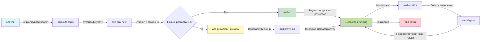
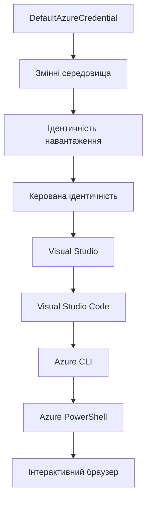

# AZD Basics - Розуміння Azure Developer CLI

# AZD Basics - Основні концепції та фундамент

**Навігація по розділах:**
- **📚 Головна сторінка курсу**: [AZD For Beginners](../../README.md)
- **📖 Поточний розділ**: Розділ 1 - Основи та швидкий старт
- **⬅️ Попередній**: [Огляд курсу](../../README.md#-chapter-1-foundation--quick-start)
- **➡️ Наступний**: [Інсталяція та налаштування](installation.md)
- **🚀 Наступний розділ**: [Розділ 2: Розробка з першим пріоритетом AI](../chapter-02-ai-development/microsoft-foundry-integration.md)

## Вступ

Цей урок знайомить вас з Azure Developer CLI (azd), потужним інструментом командного рядка, який прискорює ваш шлях від локальної розробки до розгортання в Azure. Ви дізнаєтеся основні концепції, ключові функції та зрозумієте, як azd спрощує розгортання хмарних додатків.

## Цілі навчання

Після проходження цього уроку ви:
- Зрозумієте, що таке Azure Developer CLI і його основне призначення
- Вивчите ключові концепції шаблонів, середовищ і сервісів
- Ознайомитесь з основними функціями, включно з розробкою на основі шаблонів і Infrastructure as Code
- Зрозумієте структуру проекту azd та робочий процес
- Будете готові встановлювати та налаштовувати azd для вашого середовища розробки

## Результати навчання

Після завершення уроку ви зможете:
- Пояснити роль azd у сучасних робочих процесах хмарної розробки
- Ідентифікувати компоненти структури проєкту azd
- Описати, як працюють разом шаблони, середовища і сервіси
- Зрозуміти переваги Infrastructure as Code з azd
- Розпізнати різні команди azd та їх призначення

## Що таке Azure Developer CLI (azd)?

Azure Developer CLI (azd) — це інструмент командного рядка, створений для прискорення переходу від локальної розробки до розгортання в Azure. Він спрощує процес створення, розгортання та управління хмарними додатками на Azure.

### Що можна розгорнути за допомогою azd?

azd підтримує широкий спектр робочих навантажень — і список постійно зростає. Сьогодні можна використовувати azd для розгортання:

| Тип навантаження | Приклади | Один і той же робочий процес? |
|------------------|----------|-------------------------------|
| **Традиційні додатки** | Веб-додатки, REST API, статичні сайти | ✅ `azd up` |
| **Сервіси та мікросервіси** | Container Apps, Function Apps, бекенди з кількома сервісами | ✅ `azd up` |
| **Додатки з AI** | Чат-додатки на моделях Microsoft Foundry, рішення RAG з AI Search | ✅ `azd up` |
| **Інтелектуальні агенти** | Агенти на Foundry, оркестрації з кількома агентами | ✅ `azd up` |

Головна ідея полягає в тому, що **життєвий цикл azd залишається однаковим незалежно від типу розгортання**. Ви ініціалізуєте проект, створюєте інфраструктуру, розгортаєте код, відстежуєте додаток і очищуєте ресурси — чи то простий вебсайт, чи складний AI-агент.

Ця послідовність реалізована за задумом. azd розглядає AI можливості як ще один вид сервісу, який ваш додаток може використовувати, а не як щось принципово інше. Кінцева точка чату, підтримувана Microsoft Foundry Models, з точки зору azd — це просто ще один сервіс для налаштування і розгортання.

### 🎯 Чому варто використовувати AZD? Порівняння на прикладі

Порівняймо розгортання простого веб-додатку з базою даних:

#### ❌ БЕЗ AZD: Ручне розгортання в Azure (30+ хвилин)

```bash
# Крок 1: Створіть групу ресурсів
az group create --name myapp-rg --location eastus

# Крок 2: Створіть план обслуговування додатків
az appservice plan create --name myapp-plan \
  --resource-group myapp-rg \
  --sku B1 --is-linux

# Крок 3: Створіть веб-додаток
az webapp create --name myapp-web-unique123 \
  --resource-group myapp-rg \
  --plan myapp-plan \
  --runtime "NODE:18-lts"

# Крок 4: Створіть обліковий запис Cosmos DB (10-15 хвилин)
az cosmosdb create --name myapp-cosmos-unique123 \
  --resource-group myapp-rg \
  --kind MongoDB

# Крок 5: Створіть базу даних
az cosmosdb mongodb database create \
  --account-name myapp-cosmos-unique123 \
  --resource-group myapp-rg \
  --name tododb

# Крок 6: Створіть колекцію
az cosmosdb mongodb collection create \
  --account-name myapp-cosmos-unique123 \
  --resource-group myapp-rg \
  --database-name tododb \
  --name todos

# Крок 7: Отримайте рядок підключення
CONN_STR=$(az cosmosdb keys list \
  --name myapp-cosmos-unique123 \
  --resource-group myapp-rg \
  --type connection-strings \
  --query "connectionStrings[0].connectionString" -o tsv)

# Крок 8: Налаштуйте параметри додатка
az webapp config appsettings set \
  --name myapp-web-unique123 \
  --resource-group myapp-rg \
  --settings MONGODB_URI="$CONN_STR"

# Крок 9: Увімкніть логування
az webapp log config --name myapp-web-unique123 \
  --resource-group myapp-rg \
  --application-logging filesystem \
  --detailed-error-messages true

# Крок 10: Налаштуйте Application Insights
az monitor app-insights component create \
  --app myapp-insights \
  --location eastus \
  --resource-group myapp-rg

# Крок 11: Зв’яжіть App Insights з веб-додатком
INSTRUMENTATION_KEY=$(az monitor app-insights component show \
  --app myapp-insights \
  --resource-group myapp-rg \
  --query "instrumentationKey" -o tsv)

az webapp config appsettings set \
  --name myapp-web-unique123 \
  --resource-group myapp-rg \
  --settings APPINSIGHTS_INSTRUMENTATIONKEY="$INSTRUMENTATION_KEY"

# Крок 12: Збірка додатка локально
npm install
npm run build

# Крок 13: Створіть пакет розгортання
zip -r app.zip . -x "*.git*" "node_modules/*"

# Крок 14: Розгорніть додаток
az webapp deployment source config-zip \
  --resource-group myapp-rg \
  --name myapp-web-unique123 \
  --src app.zip

# Крок 15: Чекайте і моліться, щоб все працювало 🙏
# (Автоматичної перевірки немає, потрібне ручне тестування)
```

**Проблеми:**
- ❌ Потрібно запам’ятати і виконати 15+ команд по черзі
- ❌ 30-45 хвилин ручної роботи
- ❌ Легко помилитись (опечатки, неправильні параметри)
- ❌ Рядки підключення видно в історії терміналу
- ❌ Немає автоматичного відкату у разі помилки
- ❌ Складно повторити для інших членів команди
- ❌ Кожного разу вихід різний (не відтворюється)

#### ✅ З AZD: Автоматизоване розгортання (5 команд, 10-15 хвилин)

```bash
# Крок 1: Ініціалізація з шаблону
azd init --template todo-nodejs-mongo

# Крок 2: Аутентифікація
azd auth login

# Крок 3: Створення середовища
azd env new dev

# Крок 4: Попередній перегляд змін (необов’язково, але рекомендовано)
azd provision --preview

# Крок 5: Розгортання всього
azd up

# ✨ Готово! Все розгорнуто, налаштовано та моніториться
```

**Переваги:**
- ✅ **5 команд** замість 15+ ручних кроків
- ✅ **10-15 хвилин** загального часу (переважно очікування Azure)
- ✅ **Нуль помилок** - автоматично і протестовано
- ✅ **Секрети надійно керовані** через Key Vault
- ✅ **Автоматичний відкат** при збоях
- ✅ **Повністю відтворювано** - однаковий результат кожного разу
- ✅ **Готово для команди** - будь-хто може розгорнути одними й тими ж командами
- ✅ **Infrastructure as Code** - шаблони Bicep під контролем версій
- ✅ **Вбудований моніторинг** - Application Insights налаштовано автоматично

### 📊 Скорочення часу і кількості помилок

| Метрика | Ручне розгортання | Розгортання за допомогою AZD | Покращення |
|:--------|:------------------|:----------------------------|:-----------|
| **Команди** | 15+ | 5 | На 67% менше |
| **Час** | 30-45 хв | 10-15 хв | На 60% швидше |
| **Рівень помилок** | ~40% | <5% | На 88% менше |
| **Послідовність** | Низька (ручне) | 100% (автоматизовано) | Ідеальна |
| **Навчання команди** | 2-4 години | 30 хвилин | На 75% швидше |
| **Час відкату** | 30+ хв (ручний) | 2 хв (автоматичний) | На 93% швидше |

## Основні концепції

### Шаблони
Шаблони є основою azd. Вони містять:
- **Код додатку** - Ваш вихідний код та залежності
- **Визначення інфраструктури** - Ресурси Azure, описані в Bicep або Terraform
- **Файли конфігурації** - Налаштування і змінні середовища
- **Сценарії розгортання** - Автоматизовані робочі процеси розгортання

### Середовища
Середовища представляють різні цілі розгортання:
- **Development** - для тестування і розробки
- **Staging** - передвиробниче середовище
- **Production** - робоче (продуктивне) середовище

Кожне середовище має власне:
- Групу ресурсів Azure
- Налаштування конфігурації
- Стан розгортання

### Сервіси
Сервіси — це будівельні блоки вашого додатку:
- **Фронтенд** - вебдодатки, SPA
- **Бекенд** - API, мікросервіси
- **База даних** - рішення зі зберігання даних
- **Сховище** - файлове та блоб-сховище

## Ключові функції

### 1. Розробка на основі шаблонів
```bash
# Переглянути доступні шаблони
azd template list

# Ініціалізувати з шаблону
azd init --template <template-name>
```

### 2. Infrastructure as Code
- **Bicep** — домен-специфічна мова Azure
- **Terraform** — інструмент мультихмарної інфраструктури
- **ARM Templates** — шаблони Azure Resource Manager

### 3. Інтегровані робочі процеси
```bash
# Повний робочий процес розгортання
azd up            # Забезпечення + Розгортання це автоматично для першого налаштування

# 🧪 НОВЕ: Перегляд змін інфраструктури перед розгортанням (БЕЗПЕЧНО)
azd provision --preview    # Імітація розгортання інфраструктури без внесення змін

azd provision     # Створюйте ресурси Azure, якщо оновлюєте інфраструктуру, використовуйте це
azd deploy        # Розгорніть код програми або розгорніть код програми повторно після оновлення
azd down          # Очищення ресурсів
```

#### 🛡️ Безпечне планування інфраструктури з прев’ю
Команда `azd provision --preview` змінює правила гри для безпечних розгортань:
- **Аналіз без виконання змін** — показує, що буде створено, змінено або видалено
- **Нульовий ризик** — жодних фактичних змін у вашому середовищі Azure не відбувається
- **Командна співпраця** — діліться результатами прев’ю до розгортання
- **Оцінка вартості** — розумійте витрати на ресурси перед підтвердженням

```bash
# Приклад перегляду робочого процесу
azd provision --preview           # Перегляньте, що зміниться
# Огляньте результат, обговоріть з командою
azd provision                     # Впевнено застосуйте зміни
```

### 📊 Візуалізація: Робочий процес розробки з AZD


**Пояснення робочого процесу:**
1. **Init** - Початок із шаблону або нового проекту
2. **Auth** - Аутентифікація в Azure
3. **Environment** - Створення ізольованого середовища розгортання
4. **Preview** - 🆕 Завжди спочатку переглядайте зміни інфраструктури (безпечна практика)
5. **Provision** - Створення/оновлення ресурсів Azure
6. **Deploy** - Відправка коду додатку
7. **Monitor** - Спостереження за продуктивністю додатку
8. **Iterate** - Внесення змін і повторне розгортання коду
9. **Cleanup** - Видалення ресурсів після завершення

### 4. Управління середовищами
```bash
# Створюйте та керуйте середовищами
azd env new <environment-name>
azd env select <environment-name>
azd env list
```

### 5. Розширення та AI-команди

azd використовує систему розширень для додавання можливостей поза базовою CLI. Це особливо корисно для AI-навантажень:

```bash
# Перелік доступних розширень
azd extension list

# Встановити розширення агентів Foundry
azd extension install azure.ai.agents

# Ініціалізувати проект AI агента з маніфесту
azd ai agent init -m agent-manifest.yaml

# Запустити сервер MCP для розробки з підтримкою AI (Альфа)
azd mcp start
```

> Розширення детально розглядаються в [Розділі 2: Розробка з першим пріоритетом AI](../chapter-02-ai-development/agents.md) та у довідці [AZD AI CLI Commands](../chapter-08-production/production-ai-practices.md#azd-ai-cli-commands-and-extensions).

## 📁 Структура проекту

Типова структура проекту azd:
```
my-app/
├── .azd/                    # azd configuration
│   └── config.json
├── .azure/                  # Azure deployment artifacts
├── .devcontainer/          # Development container config
├── .github/workflows/      # GitHub Actions
├── .vscode/               # VS Code settings
├── infra/                 # Infrastructure code
│   ├── main.bicep        # Main infrastructure template
│   ├── main.parameters.json
│   └── modules/          # Reusable modules
├── src/                  # Application source code
│   ├── api/             # Backend services
│   └── web/             # Frontend application
├── azure.yaml           # azd project configuration
└── README.md
```

## 🔧 Конфігураційні файли

### azure.yaml
Основний файл конфігурації проекту:
```yaml
name: my-awesome-app
metadata:
  template: my-template@1.0.0

services:
  web:
    project: ./src/web
    language: js
    host: appservice
  api:
    project: ./src/api
    language: js
    host: appservice

hooks:
  preprovision:
    shell: pwsh
    run: echo "Preparing to provision..."
```

### .azure/config.json
Конфігурації, специфічні для середовища:
```json
{
  "version": 1,
  "defaultEnvironment": "dev",
  "environments": {
    "dev": {
      "subscriptionId": "your-subscription-id",
      "location": "eastus"
    }
  }
}
```

## 🎪 Загальні робочі процеси з практичними вправами

> **💡 Порада:** Пройдіть ці вправи послідовно, щоб поступово розвивати навички роботи з AZD.

### 🎯 Вправа 1: Ініціалізація першого проекту

**Мета:** Створити проект AZD і ознайомитися зі структурою

**Кроки:**
```bash
# Використовуйте перевірений шаблон
azd init --template todo-nodejs-mongo

# Дослідіть створені файли
ls -la  # Перегляньте всі файли, включаючи приховані

# Створені ключові файли:
# - azure.yaml (основна конфігурація)
# - infra/ (код інфраструктури)
# - src/ (код застосунку)
```

**✅ Успіх:** У вас є директорії azure.yaml, infra/ і src/

---

### 🎯 Вправа 2: Розгортання в Azure

**Мета:** Повне розгортання від початку до кінця

**Кроки:**
```bash
# 1. Аутентифікуватися
az login && azd auth login

# 2. Створити середовище
azd env new dev
azd env set AZURE_LOCATION eastus

# 3. Попередній перегляд змін (РЕКОМЕНДОВАНО)
azd provision --preview

# 4. Розгорнути все
azd up

# 5. Перевірити розгортання
azd show    # Переглянути URL вашого додатка
```

**Очікуваний час:** 10-15 хвилин  
**✅ Успіх:** URL додатку відчиняється в браузері

---

### 🎯 Вправа 3: Кілька середовищ

**Мета:** Розгорнути у dev і staging

**Кроки:**
```bash
# Вже є dev, створити staging
azd env new staging
azd env set AZURE_LOCATION westus2
azd up

# Перемикання між ними
azd env list
azd env select dev
```

**✅ Успіх:** Дві окремі групи ресурсів у Azure Portal

---

### 🛡️ Чистий список: `azd down --force --purge`

Коли потрібно повністю скинути:

```bash
azd down --force --purge
```

**Що виконує:**
- `--force`: Без підтверджень
- `--purge`: Видаляє весь локальний стан та ресурси Azure

**Використовуйте, коли:**
- Розгортання зупинилося посередині
- Потрібно змінити проект
- Потрібен чистий старт

---

## 🎪 Оригінальна довідка по робочому процесу

### Початок нового проекту
```bash
# Метод 1: Використати існуючий шаблон
azd init --template todo-nodejs-mongo

# Метод 2: Почати з нуля
azd init

# Метод 3: Використати поточний каталог
azd init .
```

### Цикл розробки
```bash
# Налаштуйте середовище розробки
azd auth login
azd env new dev
azd env select dev

# Розгорніть все
azd up

# Внесіть зміни та повторно розгорніть
azd deploy

# Очистіть після завершення
azd down --force --purge # команда в Azure Developer CLI є **жорстким скиданням** вашого середовища — особливо корисна, коли ви усуваєте несправності з невдалими розгортаннями, очищуєте залишкові ресурси або готуєтесь до нового розгортання.
```

## Розуміння `azd down --force --purge`
Команда `azd down --force --purge` - потужний засіб для повного знищення вашого окруження azd і всіх пов’язаних ресурсів. Ось що означає кожен параметр:
```
--force
```
- Пропускає запити підтвердження.
- Корисно для автоматизації чи скриптів, де ручне введення неможливе.
- Гарантує безперебійне припинення роботи, навіть якщо в CLI виявлено неспівпадіння.

```
--purge
```
Видаляє **усю пов’язану метадані**, включно з:
Станом середовища
Локальною тѐкою `.azure`
Кешованою інформацією про розгортання
Запобігає тому, щоб azd «пам’ятав» попередні розгортання, що може викликати проблеми як невідповідність груп ресурсів або застарілі посилання на реєстри.

### Чому варто використовувати обидва?

Коли при виконанні `azd up` з'являються проблеми через залишковий стан або часткові розгортання, ця комбінація гарантує **чистий старт**.

Це особливо корисно після ручного видалення ресурсів в Azure порталі або при зміні шаблонів, середовищ чи найменування груп ресурсів.

### Управління кількома середовищами
```bash
# Створити тестове середовище
azd env new staging
azd env select staging
azd up

# Повернутися до розробки
azd env select dev

# Порівняти середовища
azd env list
```

## 🔐 Аутентифікація та облікові дані

Розуміння аутентифікації є ключовим для успішних розгортань azd. Azure підтримує кілька методів аутентифікації, а azd використовує той же ланцюжок облікових даних, що й інші інструменти Azure.

### Аутентифікація через Azure CLI (`az login`)

Перш ніж користуватися azd, треба аутентифікуватись в Azure. Найпоширеніший метод — через Azure CLI:

```bash
# Інтерактивний вхід (відкриває браузер)
az login

# Вхід з певним орендарем
az login --tenant <tenant-id>

# Вхід за допомогою сервісного облікового запису
az login --service-principal -u <app-id> -p <password> --tenant <tenant-id>

# Перевірити поточний статус входу
az account show

# Показати доступні підписки
az account list --output table

# Встановити підписку за замовчуванням
az account set --subscription <subscription-id>
```

### Послідовність аутентифікації
1. **Інтерактивний вхід**: Відкриває ваш браузер для аутентифікації
2. **Device Code Flow**: Для середовищ без доступу до браузера
3. **Service Principal**: Для автоматизації та CI/CD сценаріїв
4. **Managed Identity**: Для додатків, що працюють в Azure

### Ланцюжок DefaultAzureCredential

`DefaultAzureCredential` — тип облікових даних, який спрощує процес аутентифікації, автоматично підключаючи кілька джерел облікових даних у певному порядку:

#### Порядок перевірки облікових даних

#### 1. Змінні середовища
```bash
# Встановити змінні оточення для сервісного принципала
export AZURE_CLIENT_ID="<app-id>"
export AZURE_CLIENT_SECRET="<password>"
export AZURE_TENANT_ID="<tenant-id>"
```

#### 2. Workload Identity (Kubernetes/GitHub Actions)
Використовується автоматично в:
- Azure Kubernetes Service (AKS) з Workload Identity
- GitHub Actions з OIDC федерацією
- Інші сценарії з федеративною ідентичністю

#### 3. Managed Identity
Для ресурсів Azure, таких як:
- Віртуальні машини
- App Service
- Azure Functions
- Container Instances

```bash
# Перевірте, чи працює на ресурсі Azure з керованою ідентичністю
az account show --query "user.type" --output tsv
# Повертає: "servicePrincipal" якщо використовується керована ідентичність
```

#### 4. Інтеграція з інструментами розробника
- **Visual Studio**: автоматично використовує обліковий запис, у який користувач увійшов
- **VS Code**: використовує облікові дані розширення Azure Account
- **Azure CLI**: використовує облікові дані `az login` (найпоширеніший для локальної розробки)

### Налаштування аутентифікації AZD

```bash
# Метод 1: Використання Azure CLI (Рекомендовано для розробки)
az login
azd auth login  # Використовує наявні облікові дані Azure CLI

# Метод 2: Пряма автентифікація azd
azd auth login --use-device-code  # Для безголових середовищ

# Метод 3: Перевірка статусу автентифікації
azd auth login --check-status

# Метод 4: Вийти та повторно автентифікуватися
azd auth logout
azd auth login
```

### Рекомендації з аутентифікації

#### Для локальної розробки
```bash
# 1. Увійдіть за допомогою Azure CLI
az login

# 2. Перевірте правильність підписки
az account show
az account set --subscription "Your Subscription Name"

# 3. Використовуйте azd із наявними обліковими даними
azd auth login
```

#### Для CI/CD конвеєрів
```yaml
# GitHub Actions example
- name: Azure Login
  uses: azure/login@v1
  with:
    creds: ${{ secrets.AZURE_CREDENTIALS }}

- name: Deploy with azd
  run: |
    azd auth login --client-id ${{ secrets.AZURE_CLIENT_ID }} \
                    --client-secret ${{ secrets.AZURE_CLIENT_SECRET }} \
                    --tenant-id ${{ secrets.AZURE_TENANT_ID }}
    azd up --no-prompt
```

#### Для продуктивних середовищ
- Використовуйте **Managed Identity**, коли працюєте з ресурсами Azure
- Використовуйте **Service Principal** для сценаріїв автоматизації
- Уникайте зберігання облікових даних у коді або файлах конфігурації
- Використовуйте **Azure Key Vault** для конфіденційної інформації

### Поширені проблеми аутентифікації та їх рішення

#### Проблема: "No subscription found"
```bash
# Рішення: Встановити підписку за замовчуванням
az account list --output table
az account set --subscription "<subscription-id>"
azd env set AZURE_SUBSCRIPTION_ID "<subscription-id>"
```

#### Проблема: "Insufficient permissions"
```bash
# Рішення: Перевірити та призначити необхідні ролі
az role assignment list --assignee $(az account show --query user.name --output tsv)

# Загальні необхідні ролі:
# - Учасник (для керування ресурсами)
# - Адміністратор доступу користувачів (для призначення ролей)
```

#### Проблема: "Token expired"
```bash
# Рішення: Повторна автентифікація
az logout
az login
azd auth logout
azd auth login
```

### Аутентифікація в різних сценаріях

#### Локальна розробка
```bash
# Особистий рахунок розвитку
az login
azd auth login
```

#### Командна розробка
```bash
# Використовуйте конкретного орендаря для організації
az login --tenant contoso.onmicrosoft.com
azd auth login
```

#### Сценарії з кількома орендарями
```bash
# Перемикання між орендарями
az login --tenant tenant1.onmicrosoft.com
# Розгортання для орендаря 1
azd up

az login --tenant tenant2.onmicrosoft.com  
# Розгортання для орендаря 2
azd up
```

### Особливості безпеки
1. **Збереження облікових даних**: Ніколи не зберігайте облікові дані у вихідному коді  
2. **Обмеження прав**: Використовуйте принцип найменшого привілею для сервісних облікових записів  
3. **Ротація токенів**: Регулярно змінюйте секрети сервісних облікових записів  
4. **Журнал аудиту**: Моніторте автентифікацію та дії розгортання  
5. **Безпека мережі**: Використовуйте приватні кінцеві точки, коли це можливо  

### Вирішення проблем з автентифікацією

```bash
# Налагодження проблем автентифікації
azd auth login --check-status
az account show
az account get-access-token

# Поширені діагностичні команди
whoami                          # Поточний контекст користувача
az ad signed-in-user show      # Деталі користувача Azure AD
az group list                  # Тестування доступу до ресурсу
```

## Розуміння `azd down --force --purge`

### Виявлення
```bash
azd template list              # Перегляд шаблонів
azd template show <template>   # Деталі шаблону
azd init --help               # Параметри ініціалізації
```

### Управління проектом
```bash
azd show                     # Огляд проєкту
azd env show                 # Поточне середовище
azd config list             # Налаштування конфігурації
```

### Моніторинг
```bash
azd monitor                  # Відкрити моніторинг порталу Azure
azd monitor --logs           # Переглянути журнали застосунку
azd monitor --live           # Переглянути метрики в реальному часі
azd pipeline config          # Налаштувати CI/CD
```

## Найкращі практики

### 1. Використовуйте зрозумілі назви
```bash
# Добре
azd env new production-east
azd init --template web-app-secure

# Уникати
azd env new env1
azd init --template template1
```

### 2. Використовуйте шаблони
- Починайте з наявних шаблонів  
- Налаштовуйте під свої потреби  
- Створюйте багаторазові шаблони для вашої організації  

### 3. Ізоляція середовищ
- Використовуйте окремі середовища для dev/staging/prod  
- Ніколи не розгортайте безпосередньо в продакшн з локальної машини  
- Використовуйте CI/CD конвеєри для розгортання в продакшн  

### 4. Управління конфігурацією
- Використовуйте змінні середовища для чутливих даних  
- Зберігайте конфігурацію у системі контролю версій  
- Документуйте налаштування, специфічні для середовища  

## Послідовність навчання

### Початківець (тижні 1-2)
1. Встановити azd і автентифікуватися  
2. Розгорнути простий шаблон  
3. Зрозуміти структуру проекту  
4. Вивчити базові команди (up, down, deploy)  

### Середній рівень (тижні 3-4)
1. Налаштовувати шаблони  
2. Керувати кількома середовищами  
3. Розуміти інфраструктурний код  
4. Налаштувати CI/CD конвеєри  

### Просунутий рівень (тижні 5+)
1. Створювати кастомні шаблони  
2. Використовувати складні інфраструктурні патерни  
3. Розгортання у кількох регіонах  
4. Конфігурації корпоративного рівня  

## Наступні кроки

**📖 Продовжуйте навчання з розділу 1:**  
- [Встановлення та налаштування](installation.md) - Встановіть та налаштуйте azd  
- [Ваш перший проект](first-project.md) - Виконайте практичний посібник  
- [Посібник з конфігурації](configuration.md) - Розширені опції конфігурації  

**🎯 Готові до наступного розділу?**  
- [Розділ 2: Розробка з акцентом на ШІ](../chapter-02-ai-development/microsoft-foundry-integration.md) - Почніть створювати додатки на основі ШІ  

## Додаткові ресурси

- [Огляд Azure Developer CLI](https://learn.microsoft.com/en-us/azure/developer/azure-developer-cli/)  
- [Галерея шаблонів](https://azure.github.io/awesome-azd/)  
- [Приклади від спільноти](https://github.com/Azure-Samples)  

---

## 🙋 Часто задавані питання

### Загальні питання

**П: У чому різниця між AZD та Azure CLI?**

В: Azure CLI (`az`) призначений для керування окремими ресурсами Azure. AZD (`azd`) — для керування цілими додатками:

```bash
# Azure CLI - низькорівневе управління ресурсами
az webapp create --name myapp --resource-group rg
az sql server create --name myserver --resource-group rg
# ...потрібно набагато більше команд

# AZD - управління на рівні застосунку
azd up  # Розгортає весь додаток з усіма ресурсами
```
  
**Думайте так:**  
- `az` = Опрацювання окремих деталей конструктора Lego  
- `azd` = Робота з повним набором Lego  

---

**П: Чи потрібно знати Bicep або Terraform для використання AZD?**

В: Ні! Починайте з шаблонів:  
```bash
# Використовуйте існуючий шаблон - знання IaC не потрібні
azd init --template todo-nodejs-mongo
azd up
```
  
Пізніше ви можете вивчити Bicep для налаштування інфраструктури. Шаблони дають робочі приклади для навчання.  

---

**П: Скільки коштує запуск шаблонів AZD?**

В: Вартість залежить від шаблону. Більшість шаблонів для розробки коштують $50-150 на місяць:

```bash
# Переглянути витрати перед розгортанням
azd provision --preview

# Завжди очищуйте після використання
azd down --force --purge  # Видаляє всі ресурси
```
  
**Порада:** Використовуйте безкоштовні рівні там, де можливо:  
- App Service: рівень F1 (безкоштовний)  
- Microsoft Foundry Models: безкоштовно 50,000 токенів на місяць в Azure OpenAI  
- Cosmos DB: 1000 RU/s безкоштовно  

---

**П: Чи можна використовувати AZD з існуючими ресурсами Azure?**

В: Так, але легше почати з чистого листа. AZD працює найкраще, коли керує повним життєвим циклом. Для існуючих ресурсів:

```bash
# Варіант 1: Імпортувати існуючі ресурси (розширено)
azd init
# Потім змінити infra/ для посилання на існуючі ресурси

# Варіант 2: Почати з нуля (рекомендується)
azd init --template matching-your-stack
azd up  # Створює нове середовище
```
  
---

**П: Як поділитися проектом AZD з колегами?**

В: Збережіть проект AZD у Git (але НЕ папку .azure):

```bash
# Вже за замовчуванням у .gitignore
.azure/        # Містить секрети та дані середовища
*.env          # Змінні середовища

# Члени команди тоді:
git clone <your-repo>
azd auth login
azd env new <their-name>-dev
azd up
```
  
Всі отримають однакову інфраструктуру з тих самих шаблонів.  

---

### Питання з усунення несправностей

**П: "azd up" не виконалось до кінця. Що робити?**

В: Перевірте помилку, виправте і повторіть спробу:

```bash
# Переглянути детальні журнали
azd show

# Загальні виправлення:

# 1. Якщо перевищено квоту:
azd env set AZURE_LOCATION "westus2"  # Спробуйте інший регіон

# 2. Якщо конфлікт імені ресурсу:
azd down --force --purge  # Почистити
azd up  # Повторити спробу

# 3. Якщо термін дії автентифікації минув:
az login
azd auth login
azd up
```
  
**Найпоширеніша проблема:** Вибрана неправильна підписка Azure  
```bash
az account list --output table
az account set --subscription "<correct-subscription>"
```
  
---

**П: Як розгорнути лише зміни коду без повторного створення інфраструктури?**

В: Використовуйте `azd deploy` замість `azd up`:

```bash
azd up          # Вперше: підготовка + розгортання (повільно)

# Робимо зміни в коді...

azd deploy      # Наступні рази: лише розгортання (швидко)
```
  
Порівняння часу:  
- `azd up`: 10-15 хвилин (створення інфраструктури)  
- `azd deploy`: 2-5 хвилин (тільки код)  

---

**П: Чи можна налаштовувати шаблони інфраструктури?**

В: Так! Редагуйте файли Bicep у `infra/`:

```bash
# Після azd init
cd infra/
code main.bicep  # Редагувати у VS Code

# Попередній перегляд змін
azd provision --preview

# Застосувати зміни
azd provision
```
  
**Порада:** Починайте з малого — змініть спочатку SKU:  
```bicep
// infra/main.bicep
sku: {
  name: 'B1'  // Change to 'P1V2' for production
}
```
  
---

**П: Як видалити все, що створив AZD?**

В: Одна команда видаляє всі ресурси:

```bash
azd down --force --purge

# Це видаляє:
# - Усі ресурси Azure
# - Групу ресурсів
# - Стан локального середовища
# - Кешовані дані розгортання
```
  
**Завжди запускайте цю команду, коли:**  
- Тестування шаблону завершено  
- Переходите на інший проект  
- Хочете почати з чистого листа  

**Збереження коштів:** Видалення невикористаних ресурсів = $0 вартість  

---

**П: Що робити, якщо випадково видалив ресурси в Azure Portal?**

В: Стани AZD можуть бути не синхронізовані. Починайте заново:

```bash
# 1. Видалити локальний стан
azd down --force --purge

# 2. Почати заново
azd up

# Альтернатива: Дозволити AZD виявляти та виправляти
azd provision  # Створить відсутні ресурси
```
  
---

### Просунуті питання

**П: Чи можна використовувати AZD у CI/CD конвеєрах?**

В: Так! Приклад для GitHub Actions:

```yaml
# .github/workflows/deploy.yml
name: Deploy with AZD

on:
  push:
    branches: [main]

jobs:
  deploy:
    runs-on: ubuntu-latest
    steps:
      - uses: actions/checkout@v2
      
      - name: Install azd
        run: curl -fsSL https://aka.ms/install-azd.sh | bash
      
      - name: Azure Login
        run: |
          azd auth login \
            --client-id ${{ secrets.AZURE_CLIENT_ID }} \
            --client-secret ${{ secrets.AZURE_CLIENT_SECRET }} \
            --tenant-id ${{ secrets.AZURE_TENANT_ID }}
      
      - name: Deploy
        run: azd up --no-prompt
```
  
---

**П: Як працювати з секретами та чутливою інформацією?**

В: AZD автоматично інтегрується з Azure Key Vault:

```bash
# Секрети зберігаються в Key Vault, а не в коді
azd env set DATABASE_PASSWORD "$(openssl rand -base64 32)"

# AZD автоматично:
# 1. Створює Key Vault
# 2. Зберігає секрет
# 3. Надає доступ додатку через керовану ідентичність
# 4. Впроваджує під час виконання
```
  
**Ніколи не комітьте:**  
- папку `.azure/` (містить дані середовища)  
- файли `.env` (локальні секрети)  
- рядки підключення  

---

**П: Чи можна розгортати в кількох регіонах?**

В: Так, створіть окреме середовище для кожного регіону:

```bash
# Середовище Схід США
azd env new prod-eastus
azd env set AZURE_LOCATION eastus
azd up

# Середовище Західна Європа
azd env new prod-westeurope
azd env set AZURE_LOCATION westeurope
azd up

# Кожне середовище є незалежним
azd env list
```
  
Для справжніх багаторегіональних додатків налаштуйте Bicep шаблони для одночасного розгортання в кількох регіонах.  

---

**П: Де можна отримати допомогу, якщо застряг?**

1. **Документація AZD:** https://learn.microsoft.com/azure/developer/azure-developer-cli/  
2. **Проблеми на GitHub:** https://github.com/Azure/azure-dev/issues  
3. **Discord:** [Azure Discord](https://discord.gg/microsoft-azure) — канал #azure-developer-cli  
4. **Stack Overflow:** тег `azure-developer-cli`  
5. **Цей курс:** [Посібник з усунення проблем](../chapter-07-troubleshooting/common-issues.md)  

**Порада:** Перед запитом запустіть:  
```bash
azd show       # Показує поточний стан
azd version    # Показує вашу версію
```
  
Включіть цю інформацію у ваше питання для швидшої допомоги.  

---

## 🎓 Що далі?

Ви вже розумієте основи AZD. Оберіть свій шлях:

### 🎯 Для початківців:  
1. **Далі:** [Встановлення та налаштування](installation.md) - Встановіть AZD на ваш пристрій  
2. **Потім:** [Ваш перший проект](first-project.md) - Розгорніть свій перший додаток  
3. **Практика:** Виконайте всі 3 вправи цього уроку  

### 🚀 Для розробників ШІ:  
1. **Перейти до:** [Розділ 2: Розробка з акцентом на ШІ](../chapter-02-ai-development/microsoft-foundry-integration.md)  
2. **Розгортання:** Почніть з `azd init --template get-started-with-ai-chat`  
3. **Вивчення:** Розробляйте одночасно з розгортанням  

### 🏗️ Для досвідчених розробників:  
1. **Огляд:** [Посібник з конфігурації](configuration.md) - Розширені налаштування  
2. **Вивчення:** [Інфраструктура як код](../chapter-04-infrastructure/provisioning.md) - Детальний огляд Bicep  
3. **Створення:** Розробляйте власні шаблони для вашого стеку  

---

**Навігація по розділах:**  
- **📚 Головна сторінка курсу**: [AZD для початківців](../../README.md)  
- **📖 Поточний розділ:** Розділ 1 - Основи та швидкий старт  
- **⬅️ Попередній:** [Огляд курсу](../../README.md#-chapter-1-foundation--quick-start)  
- **➡️ Наступний:** [Встановлення та налаштування](installation.md)  
- **🚀 Наступний розділ:** [Розділ 2: Розробка з акцентом на ШІ](../chapter-02-ai-development/microsoft-foundry-integration.md)

---

<!-- CO-OP TRANSLATOR DISCLAIMER START -->
**Відмова від відповідальності**:  
Цей документ був перекладений за допомогою сервісу штучного інтелекту [Co-op Translator](https://github.com/Azure/co-op-translator). Хоч ми й прагнемо до точності, просимо враховувати, що автоматичні переклади можуть містити помилки або неточності. Оригінальний документ рідною мовою слід вважати авторитетним джерелом. Для критично важливої інформації рекомендується звертатися до професійного людського перекладу. Ми не несемо відповідальності за будь-які непорозуміння чи неправильне тлумачення, що виникли внаслідок використання цього перекладу.
<!-- CO-OP TRANSLATOR DISCLAIMER END -->