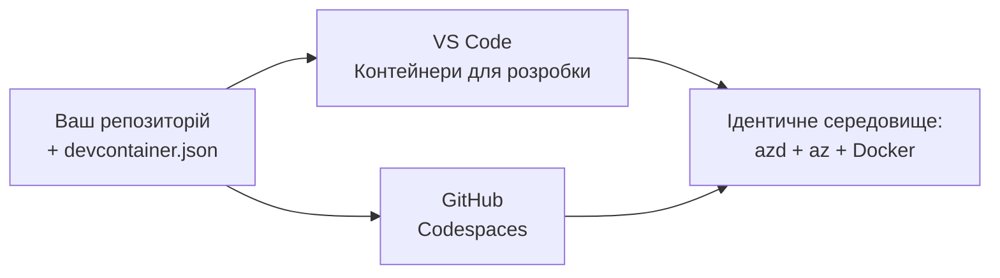

# Dev Containers & GitHub Codespaces для azd

**Навігація по розділу:**
- **📚 Головна сторінка курсу**: [AZD для початківців](../../README.md)
- **📖 Поточний розділ**: Розділ 1 - Основи та швидкий старт
- **⬅️ Попередній**: [Ваш власний додаток](bring-your-own-app.md)
- **🚀 Наступний розділ**: [Розділ 2: Розробка, орієнтована на ШІ](../chapter-02-ai-development/README.md)

> Перевірено з `azd 1.25.6` у червні 2026 року.

## Вступ

Встановлення azd, потрібного runtime мови, Docker і Azure CLI на кожному комп'ютері — це клопітно, і це головна причина, чому підручник, який «працює на моїй машині», може не працювати в когось іншого. **dev container** вирішує цю проблему, описуючи весь ваш тулчейн у файлі. Кожен, хто відкриває проєкт у VS Code або GitHub Codespaces, отримує точно таке саме середовище з попередньо встановленим azd. Цей урок покаже, як додати його.

## Цілі навчання

Після проходження цього уроку ви:
- Зрозумієте, що таке **dev container** і чому він допомагає з azd
- Додасте мінімальний `.devcontainer/devcontainer.json` до проєкту
- Включите azd, Azure CLI та Docker через функції Dev Container
- Відкриєте проєкт у GitHub Codespaces або VS Code

## Результати навчання

Після завершення цього уроку ви зможете:
- Створювати `devcontainer.json` для проєкту azd
- Додавати azd та інструменти Azure без ручних установок
- Запустити `azd up` зсередини контейнера або Codespace

---

## Що таке Dev Container?

Dev container — це середовище розробки на основі Docker, визначене файлом `.devcontainer/devcontainer.json` у вашому репозиторії. Коли ви відкриваєте проєкт:

- **VS Code** (з розширенням Dev Containers) будує контейнер і приєднується до нього.
- **GitHub Codespaces** будує той самий контейнер у хмарі та надає браузерний редактор.

У будь-якому разі кожен учасник отримує однакові інструменти—жодних «ти встановив azd?» у діагностиці.



---

## Крок 1: Створіть файл devcontainer

Створіть `.devcontainer/devcontainer.json` у корені вашого проєкту:

```json
{
  "name": "azd-project",
  "image": "mcr.microsoft.com/devcontainers/base:bookworm",
  "features": {
    "ghcr.io/devcontainers/features/azure-cli:1": {},
    "ghcr.io/azure/azure-dev/azd:latest": {},
    "ghcr.io/devcontainers/features/docker-in-docker:2": {},
    "ghcr.io/devcontainers/features/node:1": {}
  },
  "customizations": {
    "vscode": {
      "extensions": [
        "ms-azuretools.azure-dev",
        "ms-azuretools.vscode-bicep"
      ]
    }
  },
  "forwardPorts": [3000],
  "postCreateCommand": "azd version"
}
```

Що робить кожна частина:

| Ключ | Призначення |
|-----|---------|
| `image` | Базова ОС для контейнера |
| `features` | Готові інсталятори — тут: Azure CLI, **azd**, Docker і Node.js |
| `customizations.vscode.extensions` | Автоматично встановлює розширення azd та Bicep для VS Code |
| `forwardPorts` | Робить порт вашого додатка доступним у браузері |
| `postCreateCommand` | Виконується один раз після побудови контейнера (тут — перевірка працездатності) |

> Функція `ghcr.io/azure/azure-dev/azd:latest` — офіційний спосіб отримати azd у контейнері. Зафіксуйте конкретну версію (наприклад `azd:1.25.6`), якщо потрібна відтворюваність.

---

## Крок 2: Підібрати функцію під мову вашого додатка

Замініть функцію `node` на ту, яку використовує ваш додаток:

```jsonc
// Python project
"ghcr.io/devcontainers/features/python:1": {},

// .NET project
"ghcr.io/devcontainers/features/dotnet:2": {},

// Java project
"ghcr.io/devcontainers/features/java:1": {},

// Go project
"ghcr.io/devcontainers/features/go:1": {}
```

Залиште `docker-in-docker`, якщо ваш `host` — `containerapp`, `aks` або будь-що, що будує образ контейнера — azd потребує Docker для збірки та відправки образів.

---

## Крок 3: Відкрийте проєкт

**У VS Code:**
1. Встановіть розширення **Dev Containers**.
2. Відкрийте папку проєкту.
3. Натисніть **Reopen in Container**, коли з’явиться підказка (або запустіть *Dev Containers: Reopen in Container*).

**У GitHub Codespaces:**
1. Запуште репозиторій на GitHub.
2. Клацніть **Code → Codespaces → Create codespace on main**.
3. Чекайте на побудову контейнера — azd буде готовий у терміналі.

---

## Крок 4: Розгорніть ізсередини контейнера

У контейнері azd попередньо встановлено, тому звичний робочий процес просто працює:

```bash
azd auth login --use-device-code   # Код пристрою зручний у Codespaces
azd up
```

> **Чому `--use-device-code`?** У віддаленому контейнері або Codespace немає локального браузера для перенаправлення, тож вхід через device-code — надійний спосіб. Ви вставите код у вкладку браузера, щоб завершити вхід.

---

## Типові помилки

| Проблема | Виправлення |
|---------|-----|
| `azd up` не може зібрати образ | Додайте функцію `docker-in-docker` |
| Вхід через браузер зависає в Codespaces | Використовуйте `azd auth login --use-device-code` |
| Інструменти різняться між учасниками команди | Зафіксуйте версії функцій (наприклад `azd:1.25.6`) |
| Додаток недоступний у браузері | Додайте порт до `forwardPorts` |

---

## Підсумок

- Dev container робить ваш інструментарій azd відтворюваним для всіх.
- Додавайте azd, Azure CLI та Docker через функції Dev Container.
- Підберіть функцію мови під ваш додаток і зберігайте `docker-in-docker` для хостів контейнерів.
- Використовуйте вхід через device-code під час роботи у Codespaces.

---

## 🔗 Навігація

| Напрям | Ресурс |
|-----------|----------|
| **Попередній** | [Ваш власний додаток](bring-your-own-app.md) |
| **Головна розділу** | [Розділ 1: Основи та швидкий старт](README.md) |
| **Наступний розділ** | [Розділ 2: Розробка, орієнтована на ШІ](../chapter-02-ai-development/README.md) |

## 📖 Пов'язані ресурси

- [Встановлення та налаштування](installation.md)
- [Шпаргалка команд](../../resources/cheat-sheet.md)
- [Офіційна специфікація Dev Containers](https://containers.dev/)
- [Функція Dev Container для azd](https://github.com/Azure/azure-dev/tree/main/ext/devcontainer)

---

<!-- CO-OP TRANSLATOR DISCLAIMER START -->
**Відмова від відповідальності**:
Цей документ було перекладено за допомогою сервісу штучного інтелекту для перекладу [Co-op Translator](https://github.com/Azure/co-op-translator). Хоча ми прагнемо до точності, будь ласка, майте на увазі, що автоматичні переклади можуть містити помилки або неточності. Оригінальний документ рідною мовою слід вважати авторитетним джерелом. Для критично важливої інформації рекомендується професійний людський переклад. Ми не несемо відповідальності за будь-які непорозуміння або неправильні тлумачення, що виникли внаслідок використання цього перекладу.
<!-- CO-OP TRANSLATOR DISCLAIMER END -->