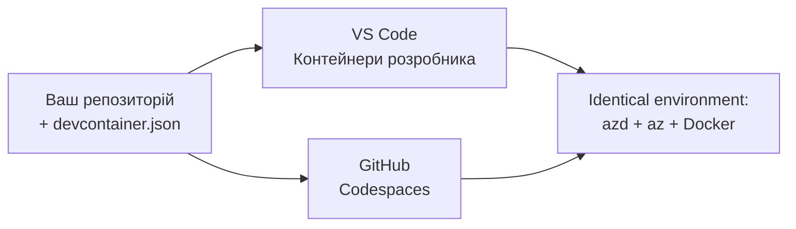

# Дев-контейнери й GitHub Codespaces для azd

**Навігація по розділах:**
- **📚 Головна сторінка курсу**: [AZD для початківців](../../README.md)
- **📖 Поточний розділ**: Розділ 1 - Основи та швидкий старт
- **⬅️ Попередній**: [Ваша власна апка](bring-your-own-app.md)
- **🚀 Наступний розділ**: [Розділ 2: Розробка з AI в центрі](../chapter-02-ai-development/README.md)

> Перевірено на версії `azd 1.27.1` у липні 2026 року.

## Вступ

Встановлення azd, відповідного виконуваного середовища для мови, Docker та Azure CLI на кожному комп'ютері — це складно, і це головна причина, чому керівництво, що "працює на моєму комп'ютері", не працює у когось іншого. **Дев-контейнер** вирішує цю проблему, описуючи весь ваш інструментарій у файлі. Кожен, хто відкриває проєкт у VS Code або GitHub Codespaces, отримує точно таке ж середовище з уже встановленим azd. У цьому уроці показано, як додати такий контейнер.

## Цілі навчання

Наприкінці цього уроку ви:
- Зрозумієте, що таке дев-контейнер і чому він допомагає з azd
- Додасте мінімальний файл `.devcontainer/devcontainer.json` до проєкту
- Включите azd, Azure CLI та Docker через *features* дев-контейнера
- Відкриєте проєкт у GitHub Codespaces або VS Code

## Результати навчання

Після завершення уроку ви зможете:
- Створити `devcontainer.json` для проєкту azd
- Додати azd та інструменти Azure без ручного встановлення
- Запустити `azd up` всередині контейнера або Codespace

---

## Що таке дев-контейнер?

Дев-контейнер — це оточення розробки на основі Docker, визначене файлом `.devcontainer/devcontainer.json` у вашому репозиторії. Коли ви відкриваєте проєкт:

- **VS Code** (з розширенням Dev Containers) створює контейнер і підключається до нього.
- **GitHub Codespaces** створює той самий контейнер у хмарі та надає браузерний редактор.

У будь-якому випадку всі учасники проєкту отримують однакові інструменти — жодних проблем із «встановив ти azd?».



---

## Крок 1: Створіть файл девконтейнера

Створіть `.devcontainer/devcontainer.json` у корені вашого проєкту:

```json
{
  "name": "azd-project",
  "image": "mcr.microsoft.com/devcontainers/base:bookworm",
  "features": {
    "ghcr.io/devcontainers/features/azure-cli:1": {},
    "ghcr.io/azure/azure-dev/azd:latest": {},
    "ghcr.io/devcontainers/features/docker-in-docker:2": {},
    "ghcr.io/devcontainers/features/node:1": {}
  },
  "customizations": {
    "vscode": {
      "extensions": [
        "ms-azuretools.azure-dev",
        "ms-azuretools.vscode-bicep"
      ]
    }
  },
  "forwardPorts": [3000],
  "postCreateCommand": "azd version"
}
```

Що робить кожна частина:

| Ключ | Призначення |
|-----|------------|
| `image` | Базова ОС для контейнера |
| `features` | Вбудовані інсталятори — тут: Azure CLI, **azd**, Docker та Node.js |
| `customizations.vscode.extensions` | Автоматично встановлює розширення azd і Bicep для VS Code |
| `forwardPorts` | Відкриває порт додатку у вашому браузері |
| `postCreateCommand` | Виконується один раз після створення контейнера (тут перевірка цілісності) |

> Функція `ghcr.io/azure/azure-dev/azd:latest` — офіційний спосіб встановлення azd у контейнер. Закріпіть конкретну версію (наприклад, `azd:1.27.1`), якщо вам потрібна повторюваність.

---

## Крок 2: Оберіть фічу для мови вашого додатку

Замініть фічу `node` на ту, що потрібна вашому додатку:

```jsonc
// Python project
"ghcr.io/devcontainers/features/python:1": {},

// .NET project
"ghcr.io/devcontainers/features/dotnet:2": {},

// Java project
"ghcr.io/devcontainers/features/java:1": {},

// Go project
"ghcr.io/devcontainers/features/go:1": {}
```

Залиште `docker-in-docker`, якщо вашим `host` є `containerapp`, `aks` або будь-що, що створює образ контейнера — azd потрібно Docker для створення й пушування образів.

---

## Крок 3: Відкрийте його

**У VS Code:**
1. Встановіть розширення **Dev Containers**.
2. Відкрийте папку з проєктом.
3. Коли з'явиться запит, натисніть **Reopen in Container** (або виконайте *Dev Containers: Reopen in Container*).

**У GitHub Codespaces:**
1. Запуште репозиторій на GitHub.
2. Натисніть **Code → Codespaces → Create codespace on main**.
3. Почекайте, поки контейнер створиться — azd буде готовий у терміналі.

---

## Крок 4: Розгортання зсередини контейнера

Контейнер має azd попередньо встановленим, тож звичайний робочий процес працює просто:

```bash
azd auth login --use-device-code   # код пристрою зручний у Codespaces
azd up
```

> **Чому `--use-device-code`?** У віддаленому контейнері чи Codespace немає локального браузера для переадресації, тож вхід за допомогою коду пристрою — надійний варіант. Ви введете код у вкладці браузера, щоб завершити вхід.

---

## Типові помилки

| Помилка | Виправлення |
|---------|------------|
| `azd up` не може створити образ | Додайте фічу `docker-in-docker` |
| Вхід у браузері зависає в Codespaces | Використовуйте `azd auth login --use-device-code` |
| Інструменти відрізняються між учасниками | Закріпіть версії фіч (наприклад, `azd:1.27.1`) |
| Додаток недоступний у браузері | Додайте порт до `forwardPorts` |

---

## Підсумок

- Дев-контейнер робить ваш інструментарій azd відтворюваним для всіх.
- Додайте azd, Azure CLI та Docker через *features* дев-контейнера.
- Підібрати мовну фічу відповідно до вашого додатку й залишати `docker-in-docker` для host-контейнерів.
- Використовуйте вхід за допомогою коду пристрою, коли працюєте в Codespaces.

---

## 🔗 Навігація

| Напрямок | Ресурс |
|---------|---------|
| **Попередній** | [Ваша власна апка](bring-your-own-app.md) |
| **Головна розділу** | [Розділ 1: Основи та швидкий старт](README.md) |
| **Наступний розділ** | [Розділ 2: Розробка з AI в центрі](../chapter-02-ai-development/README.md) |

## 📖 Пов’язані ресурси

- [Встановлення та налаштування](installation.md)
- [Шпаргалка з команд](../../resources/cheat-sheet.md)
- [Офіційна специфікація Dev Containers](https://containers.dev/)
- [Фіча azd Dev Container](https://github.com/Azure/azure-dev/tree/main/ext/devcontainer)

---

<!-- CO-OP TRANSLATOR DISCLAIMER START -->
**Відмова від відповідальності**:
Цей документ було перекладено за допомогою сервісу штучного інтелекту для перекладу [Co-op Translator](https://github.com/Azure/co-op-translator). Хоча ми прагнемо до точності, будь ласка, майте на увазі, що автоматичні переклади можуть містити помилки або неточності. Оригінальний документ рідною мовою слід вважати авторитетним джерелом. Для критично важливої інформації рекомендується професійний людський переклад. Ми не несемо відповідальності за будь-які непорозуміння або неправильні тлумачення, що виникли внаслідок використання цього перекладу.
<!-- CO-OP TRANSLATOR DISCLAIMER END -->