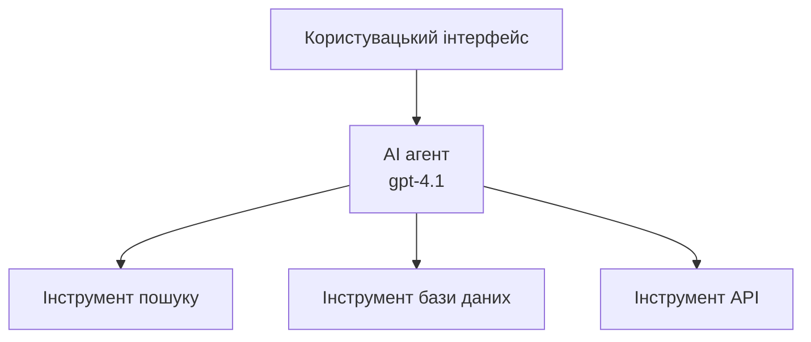
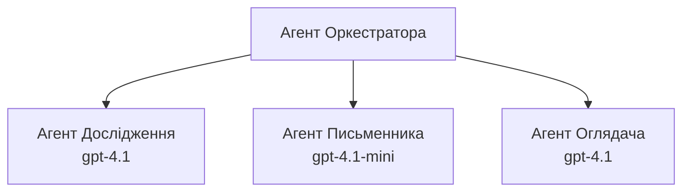

# AI агенти з Azure Developer CLI

**Навігація по главі:**
- **📚 Головна курсу**: [AZD Для початківців](../../README.md)
- **📖 Поточна глава**: Глава 2 - Розробка з акцентом на ШІ
- **⬅️ Попередня**: [Інтеграція Microsoft Foundry](microsoft-foundry-integration.md)
- **➡️ Наступна**: [Розгортання ШІ-моделі](ai-model-deployment.md)
- **🚀 Для просунутих**: [Мультиагентні рішення](../../examples/retail-scenario.md)

---

## Вступ

AI агенти — це автономні програми, які можуть сприймати своє оточення, приймати рішення і виконувати дії для досягнення конкретних цілей. На відміну від простих чатботів, що відповідають на запити, агенти можуть:

- **Використовувати інструменти** – Викликати API, шукати в базах даних, виконувати код
- **Планувати та міркувати** – Розбивати складні завдання на кроки
- **Вчитися з контексту** – Зберігати пам’ять і адаптувати свою поведінку
- **Співпрацювати** – Працювати з іншими агентами (мультиагентні системи)

Цей посібник покаже, як розгорнути AI агентів в Azure за допомогою Azure Developer CLI (azd).

## Мети навчання

Пройшовши цей посібник, ви:
- Зрозумієте, що таке AI агенти і чим вони відрізняються від чатботів
- Розгорнете готові шаблони AI агентів за допомогою AZD
- Налаштуєте Foundry Agents для створення власних агентів
- Реалізуєте базові патерни агентів (використання інструментів, RAG, мультиагентність)
- Навчитесь моніторити та налагоджувати розгорнуті агенти

## Очікувані результати

Після завершення ви зможете:
- Розгортати AI агентів в Azure однією командою
- Налаштовувати інструменти та можливості агентів
- Реалізувати retrieval-augmented generation (RAG) з агентами
- Проєктувати мультиагентні архітектури для складних робочих процесів
- Вирішувати типові проблеми при розгортанні агентів

---

## 🤖 Чим агент відрізняється від чатбота?

| Функція | Чатбот | AI Агент |
|---------|---------|----------|
| **Поведіна** | Відповідає на запити | Виконує автономні дії |
| **Інструменти** | Немає | Може викликати API, шукати, виконувати код |
| **Пам'ять** | Лише сесійна | Постійна пам’ять між сесіями |
| **Планування** | Один відповідь | Роздуми у кілька кроків |
| **Співпраця** | Одна сутність | Працює з іншими агентами |

### Проста аналогія

- **Чатбот** = Корисна людина, що відповідає на питання біля інформаційної стійки
- **AI Агент** = Особистий асистент, який може телефонувати, записувати на прийом і виконувати завдання для вас

---

## 🚀 Швидкий старт: розгорніть свого першого агента

### Варіант 1: Шаблон Foundry Agents (Рекомендується)

```bash
# Ініціалізувати шаблон агентів ШІ
azd init --template get-started-with-ai-agents

# Розгорнути на Azure
azd up
```

**Що розгортається:**
- ✅ Foundry Agents
- ✅ Моделі Microsoft Foundry (gpt-4.1)
- ✅ Azure AI Search (для RAG)
- ✅ Azure Container Apps (веб-інтерфейс)
- ✅ Application Insights (моніторинг)

**Час:** ~15-20 хвилин  
**Вартість:** ~$100-150/місяць (розробка)

### Варіант 2: OpenAI агент з Prompty

```bash
# Ініціалізувати шаблон агента на базі Prompty
azd init --template agent-openai-python-prompty

# Розгорнути в Azure
azd up
```

**Що розгортається:**
- ✅ Azure Functions (безсерверне виконання агента)
- ✅ Моделі Microsoft Foundry
- ✅ Файли конфігурації Prompty
- ✅ Приклад реалізації агента

**Час:** ~10-15 хвилин  
**Вартість:** ~$50-100/місяць (розробка)

### Варіант 3: RAG чат-агент

```bash
# Ініціалізувати шаблон чату RAG
azd init --template azure-search-openai-demo

# Розгорнути на Azure
azd up
```

**Що розгортається:**
- ✅ Моделі Microsoft Foundry
- ✅ Azure AI Search з прикладними даними
- ✅ Конвеєр обробки документів
- ✅ Чат-інтерфейс із посиланнями на джерела

**Час:** ~15-25 хвилин  
**Вартість:** ~$80-150/місяць (розробка)

### Варіант 4: Ініціалізація AZD AI агента (на основі маніфесту)

Якщо у вас є файл маніфесту агента, можна використати команду `azd ai`, щоб згенерувати проект сервісу Foundry Agent безпосередньо:

```bash
# Встановити розширення AI агентів
azd extension install azure.ai.agents

# Ініціалізувати з маніфесту агента
azd ai agent init -m agent-manifest.yaml

# Розгорнути в Azure
azd up
```

**Коли використовувати `azd ai agent init` vs `azd init --template`:**

| Підхід | Найкраще для | Як працює |
|----------|----------|------|
| `azd init --template` | Початок з робочого зразка аплікації | Клонує повний репозиторій шаблону з кодом і інфраструктурою |
| `azd ai agent init -m` | Створення на основі власного маніфесту агента | Генерує структуру проекту згідно з вашим визначенням агента |

> **Підказка:** Використовуйте `azd init --template` для навчання (варіанти 1-3 вище). Використовуйте `azd ai agent init` для створення продакшн-агентів за власними маніфестами. Повний перелік команд дивіться у [AZD AI CLI Commands](../chapter-08-production/production-ai-practices.md#azd-ai-cli-commands-and-extensions).

---

## 🏗️ Патерни архітектури агентів

### Патерн 1: Один агент з інструментами

Найпростіший патерн – один агент, який може використовувати кілька інструментів.


**Найкраще для:**
- Чатботи підтримки клієнтів
- Помічники для досліджень
- Агенти аналізу даних

**Шаблон AZD:** `azure-search-openai-demo`

### Патерн 2: RAG агент (Генерація з підкріпленням через пошук)

Агент, який спершу отримує релевантні документи, а потім формує відповіді.


**Найкраще для:**
- Корпоративні бази знань
- Системи запитань і відповідей по документах
- Дослідження відповідності та юридичні перевірки

**Шаблон AZD:** `azure-search-openai-demo`

### Патерн 3: Мультиагентна система

Декілька спеціалізованих агентів, що працюють разом над складними завданнями.


**Найкраще для:**
- Складне генеративне створення контенту
- Багатокрокові робочі процеси
- Завдання, що вимагають різної експертизи

**Дізнатись більше:** [Патерни координації мультиагентів](../chapter-06-pre-deployment/coordination-patterns.md)

---

## ⚙️ Налаштування інструментів агента

Агенти стають потужними, коли можуть використовувати інструменти. Ось як налаштувати поширені інструменти:

### Конфігурація інструментів у Foundry Agents

```python
# agent_config.py
from azure.ai.projects import AIProjectClient
from azure.ai.projects.models import FunctionTool, CodeInterpreterTool

# Визначте користувацькі інструменти
search_tool = FunctionTool(
    name="search_knowledge_base",
    description="Search the company knowledge base for relevant documents",
    parameters={
        "type": "object",
        "properties": {
            "query": {
                "type": "string",
                "description": "The search query"
            }
        },
        "required": ["query"]
    }
)

# Створіть агента з інструментами
agent = project_client.agents.create_agent(
    model="gpt-4.1",
    name="Support Agent",
    instructions="You are a helpful support agent. Use the search tool to find relevant information.",
    tools=[search_tool, CodeInterpreterTool()]
)
```

### Налаштування середовища

```bash
# Встановити змінні середовища, специфічні для агента
azd env set AZURE_OPENAI_MODEL "gpt-4.1"
azd env set AGENT_INSTRUCTIONS "You are a helpful assistant..."
azd env set ENABLE_CODE_INTERPRETER "true"
azd env set ENABLE_FILE_SEARCH "true"

# Розгорнути з оновленою конфігурацією
azd deploy
```

---

## 📊 Моніторинг агентів

### Інтеграція з Application Insights

Всі шаблони агентів AZD мають Application Insights для моніторингу:

```bash
# Відкрити панель моніторингу
azd monitor --overview

# Переглянути живі журнали
azd monitor --logs

# Переглянути живі метрики
azd monitor --live
```

### Важливі метрики для відстеження

| Метрика | Опис | Ціль |
|--------|-------------|--------|
| Затримка відповіді | Час генерації відповіді | < 5 секунд |
| Використання токенів | Токени на запит | Відстежувати для контролю вартості |
| Успішність виклику інструментів | % успішних виконань інструментів | > 95% |
| Кількість помилок | Невдалі запити агента | < 1% |
| Задоволення користувачів | Оцінки зворотного зв'язку | > 4.0/5.0 |

### Кастомне логування для агентів

```python
import os
from azure.monitor.opentelemetry import configure_azure_monitor
from opentelemetry import trace

# Налаштування Azure Monitor з OpenTelemetry
configure_azure_monitor(
    connection_string=os.environ["APPLICATIONINSIGHTS_CONNECTION_STRING"]
)

tracer = trace.get_tracer(__name__)

def log_agent_interaction(user_query, agent_response, tools_used, latency_ms):
    with tracer.start_as_current_span("agent_interaction") as span:
        span.set_attributes({
            "user_query": user_query,
            "response_length": len(agent_response),
            "tools_used": tools_used,
            "latency_ms": latency_ms
        })
```

> **Примітка:** Встановіть необхідні пакети: `pip install azure-monitor-opentelemetry opentelemetry`

---

## 💰 Вартість

### Оцінка місячних витрат за патернами

| Патерн | Розробка | Продакшн |
|---------|-----------------|------------|
| Один агент | $50-100 | $200-500 |
| RAG агент | $80-150 | $300-800 |
| Мультиагентна система (2-3 агенти) | $150-300 | $500-1,500 |
| Корпоративна мультиагентна система | $300-500 | $1,500-5,000+ |

### Поради щодо оптимізації вартості

1. **Використовуйте gpt-4.1-mini для простих завдань**  
   ```bash
   azd env set AZURE_OPENAI_MODEL "gpt-4.1-mini"
   ```
  
2. **Реалізуйте кешування для повторних запитів**  
   ```python
   from functools import lru_cache
   
   @lru_cache(maxsize=1000)
   def get_cached_response(query_hash):
       return agent.run(query_hash)
   ```
  
3. **Встановлюйте ліміти токенів на один запуск**  
   ```python
   # Встановіть max_completion_tokens при запуску агента, а не під час створення
   run = project_client.agents.create_run(
       thread_id=thread.id,
       agent_id=agent.id,
       max_completion_tokens=1000  # Обмежте довжину відповіді
   )
   ```
  
4. **Автоматично зменшуйте масштаб до нуля, коли не використовується**  
   ```bash
   # Контейнерні додатки автоматично масштабуються до нуля
   azd env set MIN_REPLICAS "0"
   ```
  
---

## 🔧 Усунення неполадок агентів

### Типові проблеми та рішення

<details>
<summary><strong>❌ Агент не відповідає на виклики інструментів</strong></summary>

```bash
# Перевірте, чи інструменти належним чином зареєстровані
azd show

# Перевірте розгортання OpenAI
az cognitiveservices account deployment list \
  --name $AZURE_OPENAI_NAME \
  --resource-group $RG_NAME

# Перевірте журнали агента
azd monitor --logs
```
  
**Поширені причини:**  
- Невідповідність сигнатури функції інструменту  
- Відсутність необхідних дозволів  
- Недоступний API-ендпоінт  
</details>

<details>
<summary><strong>❌ Висока затримка у відповідях агента</strong></summary>

```bash
# Перевірте Application Insights на наявність вузьких місць
azd monitor --live

# Розгляньте можливість використання швидшої моделі
azd env set AZURE_OPENAI_MODEL "gpt-4.1-mini"
azd deploy
```
  
**Поради з оптимізації:**  
- Використовуйте стрімінг відповідей  
- Впровадьте кешування відповідей  
- Зменште розмір контекстного вікна  
</details>

<details>
<summary><strong>❌ Агент повертає неправильну або вигадану інформацію</strong></summary>

```python
# Покращити за допомогою кращих системних підказок
instructions = """
You are a helpful assistant. IMPORTANT:
- Only answer based on provided context
- If you don't know, say "I don't know"
- Always cite your sources
- Never make up information
"""

# Додати витяг для обґрунтування
agent = project_client.agents.create_agent(
    model="gpt-4.1",
    instructions=instructions,
    tools=[FileSearchTool()]  # Обґрунтувати відповіді у документах
)
```
</details>

<details>
<summary><strong>❌ Помилки перевищення ліміту токенів</strong></summary>

```python
# Реалізувати управління контекстним вікном
def truncate_context(messages, max_tokens=8000, model="gpt-4.1"):
    """Keep only recent messages within token limit."""
    import tiktoken
    encoding = tiktoken.encoding_for_model(model)
    total_tokens = 0
    truncated = []
    
    for msg in reversed(messages):
        msg_tokens = len(encoding.encode(msg.content))
        if total_tokens + msg_tokens > max_tokens:
            break
        truncated.insert(0, msg)
        total_tokens += msg_tokens
    
    return truncated
```
</details>

---

## 🎓 Практичні вправи

### Вправа 1: Розгорніть базового агента (20 хвилин)

**Мета:** Розгорнути свого першого AI агента за допомогою AZD

```bash
# Крок 1: Ініціалізувати шаблон
azd init --template get-started-with-ai-agents

# Крок 2: Увійти до Azure
azd auth login

# Крок 3: Розгорнути
azd up

# Крок 4: Протестувати агент
# Очікуваний результат після розгортання:
#   Розгортання завершено!
#   Кінцева точка: https://<app-name>.<region>.azurecontainerapps.io
# Відкрийте URL, показаний у виводі, і спробуйте поставити запитання

# Крок 5: Переглянути моніторинг
azd monitor --overview

# Крок 6: Очистити середовище
azd down --force --purge
```
  
**Критерії успіху:**  
- [ ] Агент відповідає на питання  
- [ ] Можливість доступу до панелі моніторингу через `azd monitor`  
- [ ] Ресурси очищені успішно

### Вправа 2: Додайте власний інструмент (30 хвилин)

**Мета:** Розширити агента власним інструментом

1. Розгорніть шаблон агента:  
   ```bash
   azd init --template get-started-with-ai-agents
   azd up
   ```
  
2. Створіть нову функцію інструменту у коді агента:  
   ```python
   def get_weather(location: str) -> str:
       """Get current weather for a location."""
       # Виклик API до сервісу погоди
       return f"Weather in {location}: Sunny, 72°F"
   ```
  
3. Зареєструйте інструмент у агенті:  
   ```python
   from azure.ai.projects.models import FunctionTool

   weather_tool = FunctionTool(
       name="get_weather",
       description="Get current weather for a location",
       parameters={
           "type": "object",
           "properties": {
               "location": {"type": "string", "description": "City name"}
           },
           "required": ["location"]
       }
   )

   agent = project_client.agents.create_agent(
       model="gpt-4.1",
       name="Weather Agent",
       tools=[weather_tool]
   )
   ```
  
4. Перерозгорніть і протестуйте:  
   ```bash
   azd deploy
   # Спитайте: "Яка погода в Сіетлі?"
   # Очікувано: Агент викликає get_weather("Seattle") і повертає інформацію про погоду
   ```
  
**Критерії успіху:**  
- [ ] Агент розпізнає запити, пов’язані з погодою  
- [ ] Інструмент викликається правильно  
- [ ] Відповідь містить інформацію про погоду

### Вправа 3: Створіть RAG агента (45 хвилин)

**Мета:** Створити агента, який відповідає на питання за вашими документами

```bash
# Крок 1: Розгортання шаблону RAG
azd init --template azure-search-openai-demo
azd up

# Крок 2: Завантажте свої документи
# Помістіть файли PDF/TXT у теку data/, потім запустіть:
python scripts/prepdocs.py

# Крок 3: Тестування з доменними питаннями
# Відкрийте URL веб-додатку з виводу azd up
# Задавайте питання про свої завантажені документи
# Відповіді мають містити посилання на цитати, наприклад [doc.pdf]
```
  
**Критерії успіху:**  
- [ ] Агент відповідає на основі завантажених документів  
- [ ] Відповіді містять посилання на джерела  
- [ ] Відсутні вигадки при питаннях поза сферою докладної інформації

---

## 📚 Наступні кроки

Тепер, коли ви розумієте AI агентів, дослідіть ці просунуті теми:

| Тема | Опис | Посилання |
|-------|-------------|------|
| **Мультиагентні системи** | Створення систем з кількома агентами, що співпрацюють | [Приклад мультиагентного рітейлу](../../examples/retail-scenario.md) |
| **Патерни координації** | Вивчення патернів оркестрації та комунікації | [Патерни координації](../chapter-06-pre-deployment/coordination-patterns.md) |
| **Виробниче розгортання** | Розгортання агентів корпоративного рівня | [Практики виробничого AI](../chapter-08-production/production-ai-practices.md) |
| **Оцінка агентів** | Тестування і оцінка продуктивності агентів | [Вирішення проблем з AI](../chapter-07-troubleshooting/ai-troubleshooting.md) |
| **AI Workshop Lab** | Практичні вправи: зробіть своє AI рішення готовим до AZD | [AI Workshop Lab](ai-workshop-lab.md) |

---

## 📖 Додаткові ресурси

### Офіційна документація
- [Azure AI Agent Service](https://learn.microsoft.com/azure/ai-services/agents/)
- [Azure AI Foundry Agent Service Quickstart](https://learn.microsoft.com/azure/ai-services/agents/quickstart)
- [Semantic Kernel Agent Framework](https://learn.microsoft.com/semantic-kernel/)

### Шаблони AZD для агентів
- [Початок роботи з AI агентами](https://github.com/Azure-Samples/get-started-with-ai-agents)
- [Agent OpenAI Python Prompty](https://github.com/Azure-Samples/agent-openai-python-prompty)
- [Azure Search OpenAI Demo](https://github.com/Azure-Samples/azure-search-openai-demo)

### Ресурси спільноти
- [Awesome AZD - Шаблони агентів](https://azure.github.io/awesome-azd/?tags=ai-agents)
- [Azure AI Discord](https://discord.gg/microsoft-azure)
- [Microsoft Foundry Discord](https://discord.gg/nTYy5BXMWG)

### Навички агентів для вашого редактора
- [**Microsoft Azure Agent Skills**](https://skills.sh/microsoft/github-copilot-for-azure) – Встановіть повторно використовувані навички AI агентів для Azure розробки в GitHub Copilot, Cursor та інших підтримуваних агентах. Включає навички для [Azure AI](https://skills.sh/microsoft/github-copilot-for-azure/azure-ai), [Microsoft Foundry](https://skills.sh/microsoft/github-copilot-for-azure/microsoft-foundry), [розгортання](https://skills.sh/microsoft/github-copilot-for-azure/azure-deploy) та [діагностики](https://skills.sh/microsoft/github-copilot-for-azure/azure-diagnostics):  
  ```bash
  npx skills add microsoft/github-copilot-for-azure
  ```

---

**Навігація**
- **Попередній урок**: [Інтеграція Microsoft Foundry](microsoft-foundry-integration.md)
- **Наступний урок**: [Розгортання ШІ-моделі](ai-model-deployment.md)

---

<!-- CO-OP TRANSLATOR DISCLAIMER START -->
**Відмова від відповідальності**:  
Цей документ був перекладений за допомогою сервісу машинного перекладу [Co-op Translator](https://github.com/Azure/co-op-translator). Хоча ми прагнемо до точності, будь ласка, майте на увазі, що автоматичні переклади можуть містити помилки або неточності. Оригінальний документ рідною мовою слід вважати авторитетним джерелом. Для важливої інформації рекомендується звернутися до професійного перекладу людиною. Ми не несемо відповідальності за будь-які непорозуміння або неправильне тлумачення, що виникли внаслідок використання цього перекладу.
<!-- CO-OP TRANSLATOR DISCLAIMER END -->