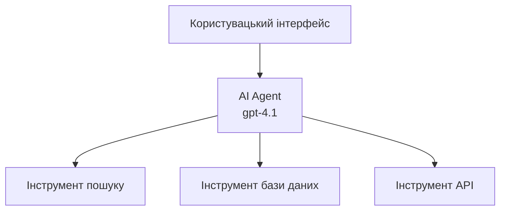
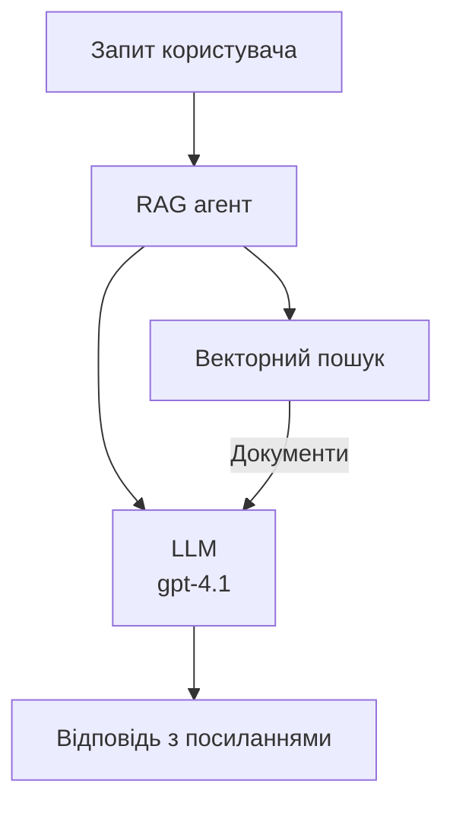
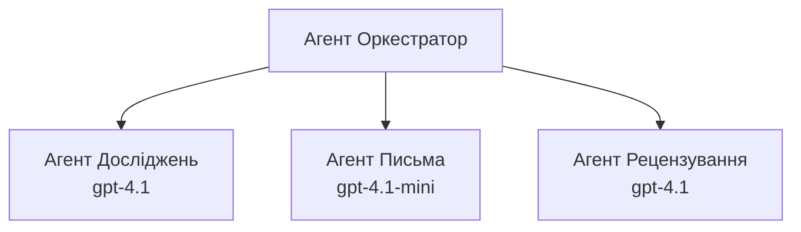

# AI Агенти з Azure Developer CLI

**Навігація по розділах:**
- **📚 Домашня сторінка курсу**: [AZD For Beginners](../../README.md)
- **📖 Поточний розділ**: Розділ 2 - AI-орієнтована розробка
- **⬅️ Попередній**: [Інтеграція Microsoft Foundry](microsoft-foundry-integration.md)
- **➡️ Наступний**: [Розгортання AI-моделі](ai-model-deployment.md)
- **🚀 Продвинуті**: [Багатоагентні рішення](../../examples/retail-scenario.md)

---

## Вступ

AI агенти — це автономні програми, які можуть сприймати своє оточення, приймати рішення та виконувати дії для досягнення певних цілей. На відміну від простих чатботів, які відповідають на запити, агенти можуть:

- **Використовувати інструменти** — Викликати API, шукати в базах даних, виконувати код
- **Планувати та міркувати** — Розбивати складні завдання на кроки
- **Вчитися на контексті** — Підтримувати пам’ять та адаптувати поведінку
- **Співпрацювати** — Працювати з іншими агентами (багатоагентні системи)

Цей посібник покаже, як розгорнути AI агентів в Azure за допомогою Azure Developer CLI (azd).

> **Примітка про валідацію (2026-03-25):** Цей посібник був перевірений на `azd` версії `1.23.12` та `azure.ai.agents` `0.1.18-preview`. Досвід роботи з `azd ai` поки що базується на прев’ю, тому перевіряйте допомогу розширення, якщо у вас встановлені інші прапорці.

## Навчальні цілі

Виконавши цей посібник, ви:
- Зрозумієте, що таке AI агенти і чим вони відрізняються від чатботів
- Розгорнете готові шаблони AI агентів за допомогою AZD
- Налаштуєте Foundry Agents для кастомних агентів
- Реалізуєте базові патерни агентів (використання інструментів, RAG, багатоагентність)
- Моніторитимете та налагоджуватимете розгорнуті агенти

## Результати навчання

Після завершення ви зможете:
- Розгортати AI агентські додатки в Azure однією командою
- Налаштовувати інструменти та можливості агента
- Реалізовувати генерацію з підсиленням пошуком (RAG) з агентами
- Проєктувати багатоагентні архітектури для складних робочих процесів
- Вирішувати типові проблеми з розгортанням агентів

---

## 🤖 Чим агент відрізняється від чатбота?

| Ознака | Чатбот | AI Агент |
|---------|---------|----------|
| **Поведінка** | Відповідає на запити | Виконує автономні дії |
| **Інструменти** | Відсутні | Може викликати API, шукати, виконувати код |
| **Пам’ять** | Лише сесійна | Постійна пам’ять між сесіями |
| **Планування** | Одна відповідь | Багатокрокове міркування |
| **Співпраця** | Окрема одиниця | Може працювати з іншими агентами |

### Проста аналогія

- **Чатбот** = Корисна людина, що відповідає на питання на інформаційній стійці
- **AI агент** = Особистий помічник, який може телефонувати, записувати зустрічі та виконувати завдання

---

## 🚀 Швидкий старт: розгорніть першого агента

### Варіант 1: Шаблон Foundry Agents (Рекомендовано)

```bash
# Ініціалізувати шаблон агентів ШІ
azd init --template get-started-with-ai-agents

# Розгорнути в Azure
azd up
```

**Що розгортається:**
- ✅ Foundry Agents
- ✅ Microsoft Foundry Models (gpt-4.1)
- ✅ Azure AI Search (для RAG)
- ✅ Azure Container Apps (вебінтерфейс)
- ✅ Application Insights (моніторинг)

**Час:** ~15-20 хвилин
**Вартість:** ~$100-150/місяць (для розробки)

### Варіант 2: OpenAI Agent з Prompty

```bash
# Ініціалізувати шаблон агента на основі Prompty
azd init --template agent-openai-python-prompty

# Розгорнути в Azure
azd up
```

**Що розгортається:**
- ✅ Azure Functions (безсерверне виконання агента)
- ✅ Microsoft Foundry Models
- ✅ Конфігураційні файли Prompty
- ✅ Приклад реалізації агента

**Час:** ~10-15 хвилин
**Вартість:** ~$50-100/місяць (для розробки)

### Варіант 3: RAG Chat Agent

```bash
# Ініціалізувати шаблон чат RAG
azd init --template azure-search-openai-demo

# Розгорнути в Azure
azd up
```

**Що розгортається:**
- ✅ Microsoft Foundry Models
- ✅ Azure AI Search з прикладними даними
- ✅ Конвеєр обробки документів
- ✅ Чатінтерфейс із посиланнями

**Час:** ~15-25 хвилин
**Вартість:** ~$80-150/місяць (для розробки)

### Варіант 4: AZD AI Agent Init (Попередній перегляд на основі маніфесту чи шаблону)

Якщо у вас є маніфест агента, ви можете використати команду `azd ai` для швидкого створення проєкту Foundry Agent Service. Останні прев’ю-релізи також додали підтримку ініціалізації на основі шаблонів, тому точний сценарій може трохи відрізнятись залежно від версії вашого розширення.

```bash
# Встановіть розширення агентів ШІ
azd extension install azure.ai.agents

# Необов’язково: перевірте встановлену прев’ю-версію
azd extension show azure.ai.agents

# Ініціалізуйте з маніфесту агента
azd ai agent init -m agent-manifest.yaml

# Розгорніть на Azure
azd up
```

**Коли використовувати `azd ai agent init` проти `azd init --template`:**

| Підхід | Найкраще підходить для | Як працює |
|----------|----------|------|
| `azd init --template` | Початок від робочого прикладу | Клонує повний репозиторій шаблону з кодом і інфраструктурою |
| `azd ai agent init -m` | Побудова на основі власного маніфесту агента | Створює структуру проєкту з вашого опису агента |

> **Порада:** Використовуйте `azd init --template` при навчанні (Варіанти 1-3 вище). Використовуйте `azd ai agent init` при створенні виробничих агентів зі своїми маніфестами. Докладніше дивіться [Команди AZD AI CLI](../chapter-08-production/production-ai-practices.md#azd-ai-cli-commands-and-extensions).

---

## 🏗️ Патерни архітектури агентів

### Патерн 1: Один агент з інструментами

Найпростіший патерн – один агент, який може використовувати декілька інструментів.


**Найкраще підходить для:**
- Чатботів служби підтримки
- Помічників у дослідженнях
- Агентів аналізу даних

**Шаблон AZD:** `azure-search-openai-demo`

### Патерн 2: RAG агент (генерація з підсиленням пошуком)

Агент, який шукає релевантні документи перед генеруванням відповіді.


**Найкраще підходить для:**
- Корпоративних баз знань
- Систем документальних запитань-відповідей
- Комплаєнсу та юридичних досліджень

**Шаблон AZD:** `azure-search-openai-demo`

### Патерн 3: Багатоагентна система

Декілька спеціалізованих агентів, які працюють разом над складними завданнями.


**Найкраще підходить для:**
- Складного створення контенту
- Багатокрокових робочих процесів
- Завдань, що вимагають різної експертизи

**Детальніше:** [Патерни координації багатоагентних систем](../chapter-06-pre-deployment/coordination-patterns.md)

---

## ⚙️ Налаштування інструментів агента

Агенти стають потужними, коли можуть використовувати інструменти. Ось як налаштувати поширені інструменти:

### Налаштування інструментів у Foundry Agents

```python
# agent_config.py
from azure.ai.projects import AIProjectClient
from azure.ai.projects.models import FunctionTool, CodeInterpreterTool

# Визначити користувацькі інструменти
search_tool = FunctionTool(
    name="search_knowledge_base",
    description="Search the company knowledge base for relevant documents",
    parameters={
        "type": "object",
        "properties": {
            "query": {
                "type": "string",
                "description": "The search query"
            }
        },
        "required": ["query"]
    }
)

# Створити агента з інструментами
agent = project_client.agents.create_agent(
    model="gpt-4.1",
    name="Support Agent",
    instructions="You are a helpful support agent. Use the search tool to find relevant information.",
    tools=[search_tool, CodeInterpreterTool()]
)
```

### Конфігурація оточення

```bash
# Встановити змінні оточення, специфічні для агента
azd env set AZURE_OPENAI_MODEL "gpt-4.1"
azd env set AGENT_INSTRUCTIONS "You are a helpful assistant..."
azd env set ENABLE_CODE_INTERPRETER "true"
azd env set ENABLE_FILE_SEARCH "true"

# Розгорнути з оновленою конфігурацією
azd deploy
```

---

## 📊 Моніторинг агентів

### Інтеграція Application Insights

Всі шаблони AZD агентів включають Application Insights для моніторингу:

```bash
# Відкрити панель моніторингу
azd monitor --overview

# Переглянути живі журнали
azd monitor --logs

# Переглянути живі метрики
azd monitor --live
```

### Основні метрики для відстеження

| Метрика | Опис | Ціль |
|--------|-------------|--------|
| Затримка відповіді | Час генерації відповіді | < 5 секунд |
| Використання токенів | Токени за запит | Моніторинг вартості |
| Успішність викликів інструментів | % успішних виконань | > 95% |
| Рівень помилок | Відмови агента | < 1% |
| Задоволеність користувачів | Оцінки зворотного зв’язку | > 4.0/5.0 |

### Кастомне логування для агентів

```python
import os
from azure.monitor.opentelemetry import configure_azure_monitor
from opentelemetry import trace

# Налаштуйте Azure Monitor за допомогою OpenTelemetry
configure_azure_monitor(
    connection_string=os.environ["APPLICATIONINSIGHTS_CONNECTION_STRING"]
)

tracer = trace.get_tracer(__name__)

def log_agent_interaction(user_query, agent_response, tools_used, latency_ms):
    with tracer.start_as_current_span("agent_interaction") as span:
        span.set_attributes({
            "user_query": user_query,
            "response_length": len(agent_response),
            "tools_used": tools_used,
            "latency_ms": latency_ms
        })
```

> **Примітка:** Встановіть необхідні пакети: `pip install azure-monitor-opentelemetry opentelemetry`

---

## 💰 Вартість

### Орієнтовні щомісячні витрати за патерном

| Патерн | Середовище розробки | Продакшн |
|---------|-----------------|------------|
| Один агент | $50-100 | $200-500 |
| RAG агент | $80-150 | $300-800 |
| Багатоагентна (2-3 агенти) | $150-300 | $500-1,500 |
| Корпоративна багатоагентна | $300-500 | $1,500-5,000+ |

### Поради з оптимізації витрат

1. **Використовуйте gpt-4.1-mini для простих завдань**
   ```bash
   azd env set AZURE_OPENAI_MODEL "gpt-4.1-mini"
   ```

2. **Реалізуйте кешування для повторних запитів**
   ```python
   from functools import lru_cache
   
   @lru_cache(maxsize=1000)
   def get_cached_response(query_hash):
       return agent.run(query_hash)
   ```

3. **Встановіть ліміти токенів на один запуск**
   ```python
   # Встановіть max_completion_tokens при запуску агента, а не під час створення
   run = project_client.agents.create_run(
       thread_id=thread.id,
       agent_id=agent.id,
       max_completion_tokens=1000  # Обмежте довжину відповіді
   )
   ```

4. **Масштабуйте до нуля, коли не використовуєте**
   ```bash
   # Контейнерні додатки автоматично масштабуются до нуля
   azd env set MIN_REPLICAS "0"
   ```

---

## 🔧 Усунення несправностей агентів

### Поширені проблеми і рішення

<details>
<summary><strong>❌ Агент не відповідає на виклики інструментів</strong></summary>

```bash
# Перевірте, чи інструменти правильно зареєстровані
azd show

# Перевірте розгортання OpenAI
az cognitiveservices account deployment list \
  --name $AZURE_OPENAI_NAME \
  --resource-group $RG_NAME

# Перевірте журнали агента
azd monitor --logs
```

**Типові причини:**
- Несумісність сигнатури функції інструмента
- Відсутність необхідних дозволів
- Недоступність API кінцевої точки
</details>

<details>
<summary><strong>❌ Висока затримка у відповідях агента</strong></summary>

```bash
# Перевірте Application Insights на наявність вузьких місць
azd monitor --live

# Розгляньте можливість використання швидшої моделі
azd env set AZURE_OPENAI_MODEL "gpt-4.1-mini"
azd deploy
```

**Поради з оптимізації:**
- Використовуйте потокові відповіді
- Реалізуйте кешування відповідей
- Зменшіть розмір контекстного вікна
</details>

<details>
<summary><strong>❌ Агент повертає неправильну або вигадану інформацію</strong></summary>

```python
# Покращити за допомогою кращих системних підказок
instructions = """
You are a helpful assistant. IMPORTANT:
- Only answer based on provided context
- If you don't know, say "I don't know"
- Always cite your sources
- Never make up information
"""

# Додати отримання для підкріплення
agent = project_client.agents.create_agent(
    model="gpt-4.1",
    instructions=instructions,
    tools=[FileSearchTool()]  # Підкріплювати відповіді документами
)
```
</details>

<details>
<summary><strong>❌ Перевищення ліміту токенів</strong></summary>

```python
# Реалізувати управління контекстним вікном
def truncate_context(messages, max_tokens=8000, model="gpt-4.1"):
    """Keep only recent messages within token limit."""
    import tiktoken
    encoding = tiktoken.encoding_for_model(model)
    total_tokens = 0
    truncated = []
    
    for msg in reversed(messages):
        msg_tokens = len(encoding.encode(msg.content))
        if total_tokens + msg_tokens > max_tokens:
            break
        truncated.insert(0, msg)
        total_tokens += msg_tokens
    
    return truncated
```
</details>

---

## 🎓 Практичні вправи

### Вправа 1: Розгорніть базового агента (20 хвилин)

**Мета:** Розгорнути вашого першого AI агента за допомогою AZD

```bash
# Крок 1: Ініціалізувати шаблон
azd init --template get-started-with-ai-agents

# Крок 2: Увійти в Azure
azd auth login
# Якщо ви працюєте з кількома орендарями, додайте --tenant-id <tenant-id>

# Крок 3: Розгорнути
azd up

# Крок 4: Перевірити агента
# Очікуваний вивід після розгортання:
#   Розгортання завершено!
#   Кінцева точка: https://<app-name>.<region>.azurecontainerapps.io
# Відкрийте URL, вказане у виводі, і спробуйте поставити запитання

# Крок 5: Переглянути моніторинг
azd monitor --overview

# Крок 6: Прибрати після роботи
azd down --force --purge
```

**Критерії успіху:**
- [ ] Агент відповідає на питання
- [ ] Доступ до панелі моніторингу через `azd monitor`
- [ ] Ресурси успішно очищені

### Вправа 2: Додайте кастомний інструмент (30 хвилин)

**Мета:** Розширити агента кастомним інструментом

1. Розгорніть шаблон агента:
   ```bash
   azd init --template get-started-with-ai-agents
   azd up
   ```
2. Створіть нову функцію інструмента у коді агента:
   ```python
   def get_weather(location: str) -> str:
       """Get current weather for a location."""
       # Виклик API до сервісу погоди
       return f"Weather in {location}: Sunny, 72°F"
   ```
3. Зареєструйте інструмент з агентом:
   ```python
   from azure.ai.projects.models import FunctionTool

   weather_tool = FunctionTool(
       name="get_weather",
       description="Get current weather for a location",
       parameters={
           "type": "object",
           "properties": {
               "location": {"type": "string", "description": "City name"}
           },
           "required": ["location"]
       }
   )

   agent = project_client.agents.create_agent(
       model="gpt-4.1",
       name="Weather Agent",
       tools=[weather_tool]
   )
   ```
4. Повторно розгорніть та протестуйте:
   ```bash
   azd deploy
   # Запитайте: "Яка погода в Сіетлі?"
   # Очікується: Агент викликає get_weather("Seattle") і повертає інформацію про погоду
   ```

**Критерії успіху:**
- [ ] Агент розпізнає запити про погоду
- [ ] Інструмент викликається коректно
- [ ] Відповідь містить інформацію про погоду

### Вправа 3: Створіть RAG агента (45 хвилин)

**Мета:** Створити агента, який відповідає на запитання з ваших документів

```bash
# Крок 1: Розгорніть шаблон RAG
azd init --template azure-search-openai-demo
azd up

# Крок 2: Завантажте ваші документи
# Помістіть файли PDF/TXT у каталог data/, потім виконайте:
python scripts/prepdocs.py

# Крок 3: Тестуйте з питаннями, специфічними для домену
# Відкрийте URL веб-додатку з виводу azd up
# Задавайте питання про завантажені документи
# Відповіді повинні містити посилання на цитати, наприклад [doc.pdf]
```

**Критерії успіху:**
- [ ] Агент відповідає з урахуванням завантажених документів
- [ ] Відповіді містять посилання на джерела
- [ ] Відсутня галюцинація на запити поза сферою охоплення

---

## 📚 Наступні кроки

Тепер, коли ви зрозуміли AI агентів, вивчайте ці просунуті теми:

| Тема | Опис | Посилання |
|-------|-------------|------|
| **Багатоагентні системи** | Побудова систем з кількома агентами, що співпрацюють | [Приклад багатьох агентів у роздрібній торгівлі](../../examples/retail-scenario.md) |
| **Патерни координації** | Вивчайте патерни оркестрації та комунікації | [Патерни координації](../chapter-06-pre-deployment/coordination-patterns.md) |
| **Виробниче розгортання** | Розгортання агентів для підприємств | [Практики AI для продакшну](../chapter-08-production/production-ai-practices.md) |
| **Оцінка агентів** | Тестування та оцінка продуктивності агентів | [Усунення несправностей AI](../chapter-07-troubleshooting/ai-troubleshooting.md) |
| **Лабораторія AI Workshop** | Практика: підготуйте ваше AI-рішення до AZD | [AI Workshop Lab](ai-workshop-lab.md) |

---

## 📖 Додаткові ресурси

### Офіційна документація
- [Azure AI Agent Service](https://learn.microsoft.com/azure/ai-services/agents/)
- [Azure AI Foundry Agent Service Quickstart](https://learn.microsoft.com/azure/ai-services/agents/quickstart)
- [Semantic Kernel Agent Framework](https://learn.microsoft.com/semantic-kernel/)

### AZD шаблони для агентів
- [Початок роботи з AI агентами](https://github.com/Azure-Samples/get-started-with-ai-agents)
- [Agent OpenAI Python Prompty](https://github.com/Azure-Samples/agent-openai-python-prompty)
- [Azure Search OpenAI Demo](https://github.com/Azure-Samples/azure-search-openai-demo)

### Ресурси спільноти
- [Awesome AZD - шаблони агентів](https://azure.github.io/awesome-azd/?tags=ai-agents)
- [Azure AI Discord](https://discord.gg/microsoft-azure)
- [Microsoft Foundry Discord](https://discord.gg/nTYy5BXMWG)

### Навички агента для вашого редактора
- [**Microsoft Azure Agent Skills**](https://skills.sh/microsoft/github-copilot-for-azure) – Встановіть багаторазові навички AI агентів для розробки Azure в GitHub Copilot, Cursor або будь-якому підтримуваному агенті. Включає навички для [Azure AI](https://skills.sh/microsoft/github-copilot-for-azure/azure-ai), [Microsoft Foundry](https://skills.sh/microsoft/github-copilot-for-azure/microsoft-foundry), [розгортання](https://skills.sh/microsoft/github-copilot-for-azure/azure-deploy) та [діагностики](https://skills.sh/microsoft/github-copilot-for-azure/azure-diagnostics):
  ```bash
  npx skills add microsoft/github-copilot-for-azure
  ```

---

**Навігація**
- **Попередній урок**: [Інтеграція Microsoft Foundry](microsoft-foundry-integration.md)
- **Наступний урок**: [Розгортання AI-моделі](ai-model-deployment.md)

---

<!-- CO-OP TRANSLATOR DISCLAIMER START -->
**Відмова від відповідальності**:
Цей документ було перекладено за допомогою сервісу автоматичного перекладу [Co-op Translator](https://github.com/Azure/co-op-translator). Хоча ми прагнемо до точності, будь ласка, майте на увазі, що автоматичні переклади можуть містити помилки або неточності. Оригінальний документ рідною мовою слід вважати офіційним джерелом інформації. Для критично важливої інформації рекомендується звертатися до професійного людського перекладу. Ми не несемо відповідальності за будь-які непорозуміння або неправильні тлумачення, що виникли внаслідок використання цього перекладу.
<!-- CO-OP TRANSLATOR DISCLAIMER END -->