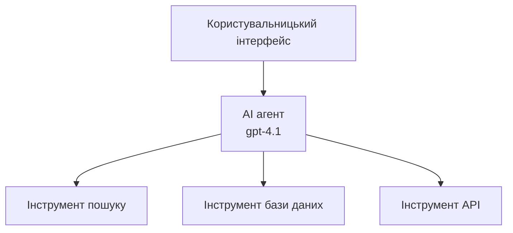
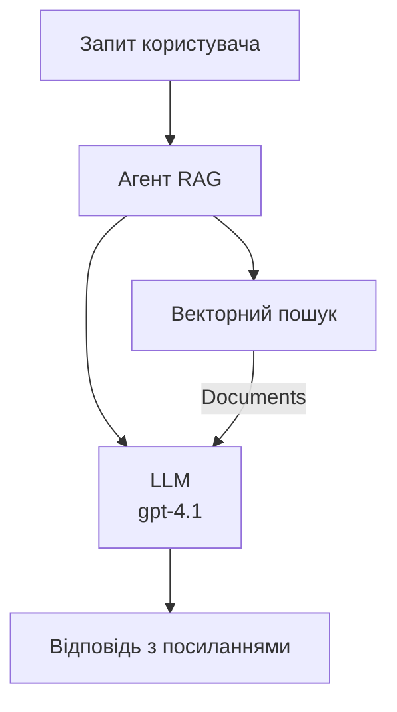
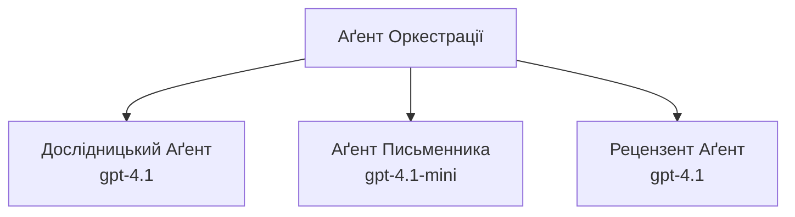

# Агенти ШІ з Azure Developer CLI

**Навігація по розділах:**
- **📚 Домашня сторінка курсу**: [AZD для початківців](../../README.md)
- **📖 Поточний розділ**: Розділ 2 - Розробка з використанням ШІ першочергово
- **⬅️ Попередній**: [Інтеграція Microsoft Foundry](microsoft-foundry-integration.md)
- **➡️ Наступний**: [Розгортання моделей ШІ](ai-model-deployment.md)
- **🚀 Просунуті теми**: [Багатоагентні рішення](../../examples/retail-scenario.md)

---

## Вступ

Агенти ШІ — це автономні програми, які можуть сприймати своє середовище, приймати рішення та виконувати дії для досягнення конкретних цілей. На відміну від простих чатботів, які відповідають на запити, агенти можуть:

- **Використовувати інструменти** — Викликати API, шукати в базах даних, виконувати код
- **Планувати і логічно міркувати** — Розбивати комплексні завдання на кроки
- **Навчатися на контексті** — Зберігати пам’ять та адаптувати поведінку
- **Співпрацювати** — Працювати з іншими агентами (багатоагентні системи)

Цей посібник показує, як розгорнути агентів ШІ в Azure за допомогою Azure Developer CLI (azd).

> **Примітка щодо валідації (2026-07-13):** Цей посібник перевірено для `azd` версії `1.27.1` і `azure.ai.agents` `1.0.0-beta.5`. Досвід `azd ai` все ще перебуває в прев’ю-режимі, тож перевіряйте допомогу розширення, якщо встановлені у вас прапори відрізняються.

## Цілі навчання

Виконавши цей посібник, ви:
- Зрозумієте, що таке агенти ШІ і чим вони відрізняються від чатботів
- Розгорнете готові шаблони агентів за допомогою AZD
- Налаштуєте Foundry Agents для кастомних агентів
- Реалізуєте базові шаблони агента (використання інструментів, RAG, багатоагентні системи)
- Моніторитимете та налагоджуватимете розгорнуті агенти

## Результати навчання

Після завершення ви зможете:
- Розгортати застосунки агентів ШІ в Azure однією командою
- Налаштовувати інструменти та можливості агентів
- Реалізувати retrieval-augmented generation (RAG) з агентами
- Проєктувати багатоагентні архітектури для складних робочих процесів
- Вирішувати типові проблеми розгортання агентів

---

## 🤖 Чим агент відрізняється від чатбота?

| Ознака | Чатбот | Агент ШІ |
|---------|---------|----------|
| **Поведінка** | Відповідає на запити | Виконує автономні дії |
| **Інструменти** | Відсутні | Може викликати API, шукати, виконувати код |
| **Пам’ять** | Лише сесійна | Постійна пам’ять між сесіями |
| **Планування** | Одноразова відповідь | Логічне міркування в кілька кроків |
| **Співпраця** | Одна сутність | Може працювати з іншими агентами |

### Проста аналогія

- **Чатбот** = Помічник, що відповідає на питання на інформаційній стійці
- **Агент ШІ** = Особистий помічник, що телефонує, бронює зустрічі та виконує завдання для вас

---

## 🚀 Швидкий старт: Розгорніть свого першого агента

### Варіант 1: Шаблон Foundry Agents (Рекомендовано)

```bash
# Ініціалізуйте шаблон агентів ШІ
azd init --template get-started-with-ai-agents

# Розгорнути в Azure
azd up
```

**Що розгортається:**
- ✅ Foundry Agents
- ✅ Моделі Microsoft Foundry (gpt-4.1)
- ✅ Azure AI Search (для RAG)
- ✅ Azure Container Apps (веб-інтерфейс)
- ✅ Application Insights (моніторинг)

**Час:** ~15-20 хвилин
**Вартість:** ~$100-150/місяць (розробка)

### Варіант 2: Агент OpenAI з Prompty

```bash
# Ініціалізуйте шаблон агента на основі Prompty
azd init --template agent-openai-python-prompty

# Розгорнути в Azure
azd up
```

**Що розгортається:**
- ✅ Azure Functions (безсерверне виконання агента)
- ✅ Моделі Microsoft Foundry
- ✅ Файли конфігурації Prompty
- ✅ Приклад реалізації агента

**Час:** ~10-15 хвилин
**Вартість:** ~$50-100/місяць (розробка)

### Варіант 3: RAG чат-агент

```bash
# Ініціалізувати шаблон чату RAG
azd init --template azure-search-openai-demo

# Розгорнути в Azure
azd up
```

**Що розгортається:**
- ✅ Моделі Microsoft Foundry
- ✅ Azure AI Search з прикладними даними
- ✅ Конвеєр обробки документів
- ✅ Чат-інтерфейс з посиланнями на джерела

**Час:** ~15-25 хвилин
**Вартість:** ~$80-150/місяць (розробка)

### Варіант 4: Ініціалізація агента AZD AI (Прев’ю на основі маніфесту чи шаблону)

Якщо у вас є файл маніфесту агента, можна використати команду `azd ai` для створення проекту сервісу Foundry Agent напряму. Останні прев’ю-релізи також додали підтримку ініціалізації на основі шаблонів, тож точний потік підказок може трохи відрізнятися залежно від версії розширення у вас.

```bash
# Встановіть розширення агентів ШІ
azd extension install azure.ai.agents

# Необов’язково: перевірте встановлену попередню версію
azd extension show azure.ai.agents

# Ініціалізуйте з маніфесту агента
azd ai agent init -m agent-manifest.yaml

# Розгорніть у Azure
azd up

# Перевірте розгорнутий агент (показує затримку + час до першого байта)
azd ai agent invoke
```

**Коли використовувати `azd ai agent init`, а коли `azd init --template`:**

| Підхід | Найкраще для | Як працює |
|----------|----------|------|
| `azd init --template` | Початок з робочого прикладу | Клонує повний шаблонний репозиторій з кодом + інфраструктурою |
| `azd ai agent init -m` | Розробка на основі власного маніфесту агента | Створює структуру проекту з вашого визначення агента |

> **Порада:** Використовуйте `azd init --template` під час навчання (варіанти 1-3 вище). Використовуйте `azd ai agent init` під час створення продуктивних агентів з власними маніфестами.

Після `azd up` те ж розширення допоможе вам протягом усього життєвого циклу агента: `azd ai agent invoke` для тестування, `azd ai agent eval generate` і `azd ai agent optimize` для вимірювання та покращення якості, а також `azd ai agent delete` для очищення. Повний довідник див. у [AZD AI CLI Commands](../chapter-08-production/production-ai-practices.md#azd-ai-cli-commands-and-extensions).

---

## 🏗️ Архітектурні шаблони агентів

### Шаблон 1: Один агент з інструментами

Найпростіший шаблон агента — один агент, який може використовувати декілька інструментів.



**Найкраще підходить для:**
- Ботів підтримки клієнтів
- Помічників у дослідженнях
- Агентів аналізу даних

**Шаблон AZD:** `azure-search-openai-demo`

### Шаблон 2: Агент RAG (retrieval-augmented generation)

Агент, що перед генерацією відповідей шукає релевантні документи.



**Найкраще підходить для:**
- Корпоративних баз знань
- Систем запитань і відповідей по документах
- Досліджень на відповідність і в юридичній сфері

**Шаблон AZD:** `azure-search-openai-demo`

### Шаблон 3: Багатоагентна система

Кілька спеціалізованих агентів, що працюють разом над комплексними завданнями.



**Найкраще підходить для:**
- Генерації складного контенту
- Багатокрокових робочих процесів
- Завдань, що потребують різної експертизи

**Дізнатися більше:** [Шаблони координації багатоагентних систем](../chapter-06-pre-deployment/coordination-patterns.md)

---

## ⚙️ Налаштування інструментів агента

Агенти стають потужними, коли можуть використовувати інструменти. Ось як налаштувати найпоширеніші інструменти:

### Налаштування інструментів у Foundry Agents

```python
# agent_config.py
from azure.ai.projects import AIProjectClient
from azure.ai.projects.models import FunctionTool, CodeInterpreterTool

# Визначити користувацькі інструменти
search_tool = FunctionTool(
    name="search_knowledge_base",
    description="Search the company knowledge base for relevant documents",
    parameters={
        "type": "object",
        "properties": {
            "query": {
                "type": "string",
                "description": "The search query"
            }
        },
        "required": ["query"]
    }
)

# Створити агента з інструментами
agent = project_client.agents.create_agent(
    model="gpt-4.1",
    name="Support Agent",
    instructions="You are a helpful support agent. Use the search tool to find relevant information.",
    tools=[search_tool, CodeInterpreterTool()]
)
```

### Налаштування середовища

```bash
# Налаштуйте змінні оточення, специфічні для агента
azd env set AZURE_OPENAI_MODEL "gpt-4.1"
azd env set AGENT_INSTRUCTIONS "You are a helpful assistant..."
azd env set ENABLE_CODE_INTERPRETER "true"
azd env set ENABLE_FILE_SEARCH "true"

# Розгорнути з оновленою конфігурацією
azd deploy
```

---

## 📊 Моніторинг агентів

### Інтеграція Application Insights

Всі шаблони з AZD агента включають Application Insights для моніторингу:

```bash
# Відкрити панель моніторингу
azd monitor --overview

# Переглядати живі логи
azd monitor --logs

# Переглядати живі метрики
azd monitor --live
```

### Основні метрики для відстеження

| Метрика | Опис | Ціль |
|--------|-------------|--------|
| Затримка відповіді | Час на генерацію відповіді | < 5 секунд |
| Використання токенів | Токени на запит | Моніторинг витрат |
| Відсоток успішних викликів інструментів | % успішного виконання інструментів | > 95% |
| Рівень помилок | Неуспішні запити агента | < 1% |
| Задоволеність користувачів | Оцінки фідбеку | > 4.0/5.0 |

### Користувацьке логування для агентів

```python
import os
from azure.monitor.opentelemetry import configure_azure_monitor
from opentelemetry import trace

# Налаштуйте Azure Monitor за допомогою OpenTelemetry
configure_azure_monitor(
    connection_string=os.environ["APPLICATIONINSIGHTS_CONNECTION_STRING"]
)

tracer = trace.get_tracer(__name__)

def log_agent_interaction(user_query, agent_response, tools_used, latency_ms):
    with tracer.start_as_current_span("agent_interaction") as span:
        span.set_attributes({
            "user_query": user_query,
            "response_length": len(agent_response),
            "tools_used": tools_used,
            "latency_ms": latency_ms
        })
```

> **Примітка:** Встановіть необхідні пакети: `pip install azure-monitor-opentelemetry opentelemetry`

---

## 💰 Вартість

### Орієнтовна щомісячна вартість за шаблонами

| Шаблон | Середовище розробки | Продакшен |
|---------|-----------------|------------|
| Один агент | $50-100 | $200-500 |
| Агент RAG | $80-150 | $300-800 |
| Багатоагентна система (2-3 агенти) | $150-300 | $500-1,500 |
| Підприємницька багатоагентна система | $300-500 | $1,500-5,000+ |

### Поради з оптимізації витрат

1. **Використовуйте gpt-4.1-mini для простих завдань**
   ```bash
   azd env set AZURE_OPENAI_MODEL "gpt-4.1-mini"
   ```

2. **Реалізуйте кешування для повторюваних запитів**
   ```python
   from functools import lru_cache
   
   @lru_cache(maxsize=1000)
   def get_cached_response(query_hash):
       return agent.run(query_hash)
   ```

3. **Встановіть обмеження на кількість токенів за запуск**
   ```python
   # Встановлюйте max_completion_tokens під час запуску агента, а не при створенні
   run = project_client.agents.create_run(
       thread_id=thread.id,
       agent_id=agent.id,
       max_completion_tokens=1000  # Обмежте довжину відповіді
   )
   ```

4. **Автоматично масштабуйтесь до нуля, коли агент не використовується**
   ```bash
   # Контейнери застосунків автоматично масштабуються до нуля
   azd env set MIN_REPLICAS "0"
   ```

---

## 🔧 Усунення несправностей агентів

### Типові проблеми та їх рішення

<details>
<summary><strong>❌ Агент не відповідає на виклики інструментів</strong></summary>

```bash
# Перевірте, чи інструменти правильно зареєстровані
azd show

# Перевірте розгортання OpenAI
az cognitiveservices account deployment list \
  --name $AZURE_OPENAI_NAME \
  --resource-group $RG_NAME

# Перевірте журнали агента
azd monitor --logs
```

**Поширені причини:**
- Невідповідність сигнатури функції інструменту
- Відсутні необхідні дозволи
- Не доступна кінцева точка API
</details>

<details>
<summary><strong>❌ Висока затримка відповідей агента</strong></summary>

```bash
# Перевірте Application Insights на предмет вузьких місць
azd monitor --live

# Розгляньте можливість використання швидшої моделі
azd env set AZURE_OPENAI_MODEL "gpt-4.1-mini"
azd deploy
```

**Поради з оптимізації:**
- Використовуйте потокові відповіді
- Реалізуйте кешування відповідей
- Зменшіть розмір контекстного вікна
</details>

<details>
<summary><strong>❌ Агент повертає некоректну або вигадану інформацію</strong></summary>

```python
# Покращити за допомогою кращих системних підказок
instructions = """
You are a helpful assistant. IMPORTANT:
- Only answer based on provided context
- If you don't know, say "I don't know"
- Always cite your sources
- Never make up information
"""

# Додати пошук для підтвердження
agent = project_client.agents.create_agent(
    model="gpt-4.1",
    instructions=instructions,
    tools=[FileSearchTool()]  # Обґрунтувати відповіді документами
)
```
</details>

<details>
<summary><strong>❌ Помилки перевищення ліміту токенів</strong></summary>

```python
# Реалізуйте керування контекстним вікном
def truncate_context(messages, max_tokens=8000, model="gpt-4.1"):
    """Keep only recent messages within token limit."""
    import tiktoken
    encoding = tiktoken.encoding_for_model(model)
    total_tokens = 0
    truncated = []
    
    for msg in reversed(messages):
        msg_tokens = len(encoding.encode(msg.content))
        if total_tokens + msg_tokens > max_tokens:
            break
        truncated.insert(0, msg)
        total_tokens += msg_tokens
    
    return truncated
```
</details>

---

## 🎓 Практичні вправи

### Вправа 1: Розгорнути базового агента (20 хвилин)

**Мета:** Розгорнути свого першого агента ШІ за допомогою AZD

```bash
# Крок 1: Ініціалізація шаблону
azd init --template get-started-with-ai-agents

# Крок 2: Вхід в Azure
azd auth login
# Якщо ви працюєте через різні орендарі, додайте --tenant-id <tenant-id>

# Крок 3: Розгортання
azd up

# Крок 4: Тестування агента
# Очікуваний вивід після розгортання:
#   Розгортання завершено!
#   Кінцева точка: https://<app-name>.<region>.azurecontainerapps.io
# Відкрийте URL, показаний у виводі, і спробуйте поставити запитання

# Крок 5: Перегляд моніторингу
azd monitor --overview

# Крок 6: Очистка
azd down --force --purge
```

**Критерії успіху:**
- [ ] Агент відповідає на запитання
- [ ] Можливість доступу до панелі моніторингу через `azd monitor`
- [ ] Ресурси успішно очищені після завершення

### Вправа 2: Додати кастомний інструмент (30 хвилин)

**Мета:** Розширити агента кастомним інструментом

1. Розгорніть шаблон агента:
   ```bash
   azd init --template get-started-with-ai-agents
   azd up
   ```
2. Створіть нову функцію інструменту у вашому коді агента:
   ```python
   def get_weather(location: str) -> str:
       """Get current weather for a location."""
       # Виклик API до служби погоди
       return f"Weather in {location}: Sunny, 72°F"
   ```
3. Зареєструйте інструмент у агента:
   ```python
   from azure.ai.projects.models import FunctionTool

   weather_tool = FunctionTool(
       name="get_weather",
       description="Get current weather for a location",
       parameters={
           "type": "object",
           "properties": {
               "location": {"type": "string", "description": "City name"}
           },
           "required": ["location"]
       }
   )

   agent = project_client.agents.create_agent(
       model="gpt-4.1",
       name="Weather Agent",
       tools=[weather_tool]
   )
   ```
4. Повторно розгорніть і протестуйте:
   ```bash
   azd deploy
   # Запитайте: "Яка погода в Сіетлі?"
   # Очікується: Агент викликає get_weather("Seattle") і повертає інформацію про погоду
   ```

**Критерії успіху:**
- [ ] Агент розпізнає запити, пов’язані з погодою
- [ ] Інструмент викликається коректно
- [ ] Відповіді містять інформацію про погоду

### Вправа 3: Побудова агента RAG (45 хвилин)

**Мета:** Створити агента, який відповідає на запитання з ваших документів

```bash
# Крок 1: Розгорнути шаблон RAG
azd init --template azure-search-openai-demo
azd up

# Крок 2: Завантажте свої документи
# Помістіть PDF/TXT файли в каталог data/, потім виконайте:
python scripts/prepdocs.py

# Крок 3: Тестуйте з доменними питаннями
# Відкрийте URL веб-додатку з виводу azd up
# Задавайте питання про ваші завантажені документи
# Відповіді повинні містити посилання на цитати, як-от [doc.pdf]
```

**Критерії успіху:**
- [ ] Агент відповідає на основі завантажених документів
- [ ] Відповіді містять посилання на джерела
- [ ] Відсутність вигадок для запитань поза межами сфери

---

## 📚 Наступні кроки

Тепер, коли ви ознайомилися з агентами ШІ, вивчіть ці просунуті теми:

| Тема | Опис | Посилання |
|-------|-------------|------|
| **Багатоагентні системи** | Створення систем з кількома агентами, що співпрацюють | [Приклад багатоагентної системи для роздрібної торгівлі](../../examples/retail-scenario.md) |
| **Шаблони координації** | Вивчення патернів оркестрації та комунікації | [Шаблони координації](../chapter-06-pre-deployment/coordination-patterns.md) |
| **Виробниче розгортання** | Виробниче розгортання агентів на підприємстві | [Практики штучного інтелекту для виробництва](../chapter-08-production/production-ai-practices.md) |
| **Оцінка агентів** | Тестування та оцінка продуктивності агентів | [Усунення несправностей ШІ](../chapter-07-troubleshooting/ai-troubleshooting.md) |
| **Лабораторія AI Workshop** | Практика: зробіть ваше AI-рішення готовим до AZD | [Лабораторія AI Workshop](ai-workshop-lab.md) |

---

## 📖 Додаткові ресурси

### Офіційна документація
- [Microsoft Foundry Agent Service](https://learn.microsoft.com/azure/ai-services/agents/)
- [Microsoft Foundry Agent Service Quickstart](https://learn.microsoft.com/azure/ai-services/agents/quickstart)
- [Semantic Kernel Agent Framework](https://learn.microsoft.com/semantic-kernel/)

### Шаблони AZD для агентів
- [Початок роботи з агентами ШІ](https://github.com/Azure-Samples/get-started-with-ai-agents)
- [Agent OpenAI Python Prompty](https://github.com/Azure-Samples/agent-openai-python-prompty)
- [Azure Search OpenAI Demo](https://github.com/Azure-Samples/azure-search-openai-demo)

### Ресурси спільноти
- [Awesome AZD - шаблони агентів](https://azure.github.io/awesome-azd/?tags=ai-agents)
- [Azure AI Discord](https://discord.gg/microsoft-azure)
- [Microsoft Foundry Discord](https://discord.gg/nTYy5BXMWG)

### Навички агентів для вашого редактора
- [**Навички агентів Microsoft Azure**](https://skills.sh/microsoft/github-copilot-for-azure) — Встановіть багаторазові навички агента ШІ для розробки Azure у GitHub Copilot, Cursor або будь-якому підтримуваному агенті. Включає навички для [Azure AI](https://skills.sh/microsoft/github-copilot-for-azure/azure-ai), [Microsoft Foundry](https://skills.sh/microsoft/github-copilot-for-azure/microsoft-foundry), [розгортання](https://skills.sh/microsoft/github-copilot-for-azure/azure-deploy) та [діагностики](https://skills.sh/microsoft/github-copilot-for-azure/azure-diagnostics):
  ```bash
  npx skills add microsoft/github-copilot-for-azure
  ```

---

**Навігація**
- **Попередній урок**: [Інтеграція Microsoft Foundry](microsoft-foundry-integration.md)
- **Наступний урок**: [Розгортання моделей ШІ](ai-model-deployment.md)

---

<!-- CO-OP TRANSLATOR DISCLAIMER START -->
**Відмова від відповідальності**:
Цей документ було перекладено за допомогою сервісу штучного інтелекту для перекладу [Co-op Translator](https://github.com/Azure/co-op-translator). Хоча ми прагнемо до точності, будь ласка, майте на увазі, що автоматичні переклади можуть містити помилки або неточності. Оригінальний документ рідною мовою слід вважати авторитетним джерелом. Для критично важливої інформації рекомендується професійний людський переклад. Ми не несемо відповідальності за будь-які непорозуміння або неправильні тлумачення, що виникли внаслідок використання цього перекладу.
<!-- CO-OP TRANSLATOR DISCLAIMER END -->