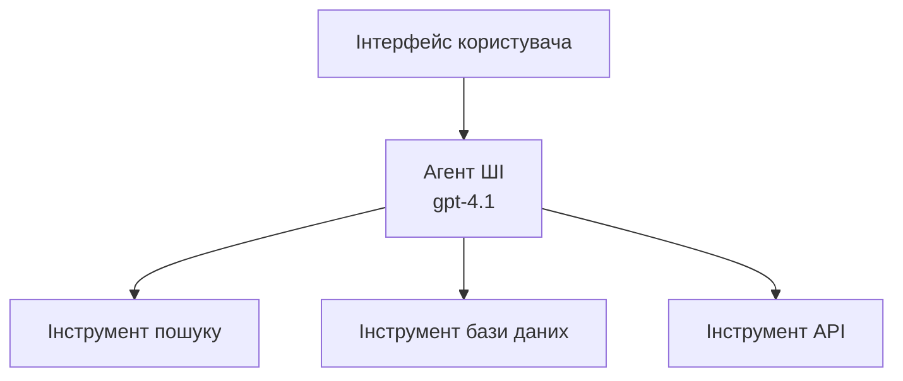
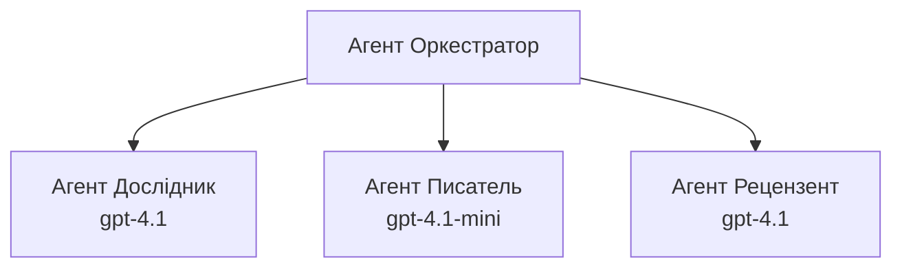

# AI-агенти з Azure Developer CLI

**Навігація по розділах:**
- **📚 Головна сторінка курсу**: [AZD For Beginners](../../README.md)
- **📖 Поточний розділ**: Розділ 2 - Розробка з фокусом на AI
- **⬅️ Попередній**: [Інтеграція Microsoft Foundry](microsoft-foundry-integration.md)
- **➡️ Наступний**: [Розгортання AI-моделей](ai-model-deployment.md)
- **🚀 Розширені можливості**: [Багатоагентні рішення](../../examples/retail-scenario.md)

---

## Вступ

AI-агенти — це автономні програми, які можуть сприймати своє оточення, приймати рішення і здійснювати дії для досягнення певних цілей. На відміну від простих чатботів, які відповідають на запити, агенти можуть:

- **Використовувати інструменти** — Викликати API, шукати в базах даних, виконувати код
- **Планувати та міркувати** — Розбивати складні завдання на кроки
- **Навчатися з контексту** — Зберігати пам'ять і адаптувати поведінку
- **Співпрацювати** — Працювати з іншими агентами (багатоагентні системи)

Цей посібник показує, як розгорнути AI-агентів в Azure за допомогою Azure Developer CLI (azd).

> **Примітка про перевірку (2026-03-25):** Цей посібник переглянутий для `azd` версії `1.23.12` та `azure.ai.agents` `0.1.18-preview`. Досвід роботи з `azd ai` все ще перебуває у стані прев’ю, тому перевіряйте допомогу розширення, якщо встановлені у вас флаги відрізняються.

## Цілі навчання

Виконавши цей посібник, ви:
- Зрозумієте, що таке AI-агенти і чим вони відрізняються від чатботів
- Розгорнете готові шаблони AI-агентів з використанням AZD
- Налаштуєте Foundry Agents для власних агентів
- Реалізуєте базові патерни агентів (використання інструментів, RAG, багатоагентні системи)
- Моніторитимете та відлагоджуватимете розгорнуті агентів

## Результати навчання

Після завершення ви зможете:
- Розгортати AI-агентів в Azure однією командою
- Налаштовувати інструменти та можливості агентів
- Реалізувати генерування з підкріпленням пошуком (RAG) з агентами
- Проєктувати багатоагентну архітектуру для складних робочих процесів
- Вирішувати типові проблеми розгортання агентів

---

## 🤖 Чим агент відрізняється від чатбота?

| Особливість | Чатбот | AI Агент |
|-------------|---------|----------|
| **Поведінка** | Відповідає на запити | Виконує автономні дії |
| **Інструменти** | Відсутні | Може викликати API, шукати, виконувати код |
| **Пам'ять** | Лише сесійна | Збережена пам'ять між сесіями |
| **Планування** | Одна відповідь | Багатокрокове міркування |
| **Співпраця** | Один об’єкт | Може працювати з іншими агентами |

### Проста аналогія

- **Чатбот** = Допоміжна людина, що відповідає на запитання на інформаційній стійці
- **AI Агент** = Особистий помічник, який може дзвонити, записувати зустрічі і виконувати завдання для вас

---

## 🚀 Швидкий старт: розгорніть свій перший агент

### Варіант 1: Шаблон Foundry Agents (Рекомендовано)

```bash
# Ініціалізувати шаблон агентів ШІ
azd init --template get-started-with-ai-agents

# Розгорнути на Azure
azd up
```

**Що розгортається:**
- ✅ Foundry Agents
- ✅ Microsoft Foundry Models (gpt-4.1)
- ✅ Azure AI Search (для RAG)
- ✅ Azure Container Apps (веб-інтерфейс)
- ✅ Application Insights (моніторинг)

**Час:** приблизно 15-20 хвилин  
**Вартість:** близько $100-150/місяць (розробка)

### Варіант 2: OpenAI агент з Prompty

```bash
# Ініціалізувати шаблон агента на основі Prompty
azd init --template agent-openai-python-prompty

# Розгорнути в Azure
azd up
```

**Що розгортається:**
- ✅ Azure Functions (безсерверне виконання агента)
- ✅ Microsoft Foundry Models
- ✅ Файли конфігурації Prompty
- ✅ Зразкова реалізація агента

**Час:** приблизно 10-15 хвилин  
**Вартість:** близько $50-100/місяць (розробка)

### Варіант 3: RAG чат-агент

```bash
# Ініціалізація шаблону чату RAG
azd init --template azure-search-openai-demo

# Розгортання в Azure
azd up
```

**Що розгортається:**
- ✅ Microsoft Foundry Models
- ✅ Azure AI Search з тестовими даними
- ✅ Конвеєр обробки документів
- ✅ Чат-інтерфейс з посиланнями

**Час:** приблизно 15-25 хвилин  
**Вартість:** близько $80-150/місяць (розробка)

### Варіант 4: Ініціалізація агента AZD AI (на основі маніфесту або шаблону, прев’ю)

Якщо у вас є файл маніфесту агента, ви можете скористатися командою `azd ai` для створення проекту Foundry Agent Service безпосередньо. Останні прев’ю-релізи також додали підтримку ініціалізації на основі шаблонів, тож точний потік запитів може дещо відрізнятися залежно від версії встановленого розширення.

```bash
# Встановіть розширення AI agents
azd extension install azure.ai.agents

# За бажанням: перевірте встановлену прев'ю-версію
azd extension show azure.ai.agents

# Ініціалізуйте з маніфесту агента
azd ai agent init -m agent-manifest.yaml

# Розгорніть на Azure
azd up

# Тестуйте розгорнутий агент (показує затримку + час до першого байта)
azd ai agent invoke
```

**Коли використовувати `azd ai agent init` замість `azd init --template`:**

| Підхід | Найкращий для | Як працює |
|--------|---------------|-----------|
| `azd init --template` | Початок з робочого прикладу | Клонує повний репозиторій шаблону з кодом та інфраструктурою |
| `azd ai agent init -m` | Створення зі свого маніфесту агента | Створює структуру проекту згідно з визначенням агента |

> **Порада:** Використовуйте `azd init --template` для навчання (Варіанти 1-3 вище). Використовуйте `azd ai agent init` для створення виробничих агентів зі своїми маніфестами.

Після `azd up` це саме розширення супроводжує вас далі в життєвому циклі агента: `azd ai agent invoke` для тестування, `azd ai agent eval generate` та `azd ai agent optimize` для вимірювання й покращення якості, а також `azd ai agent delete` для очищення. Див. [Команди AZD AI CLI](../chapter-08-production/production-ai-practices.md#azd-ai-cli-commands-and-extensions) для повного довідника.

---

## 🏗️ Архітектурні патерни агентів

### Патерн 1: Один агент з інструментами

Найпростіший патерн агента — один агент, що може використовувати кілька інструментів.



**Найкраще підходить для:**
- Ботів підтримки клієнтів
- Помічників у дослідженнях
- Агентів з аналізу даних

**Шаблон AZD:** `azure-search-openai-demo`

### Патерн 2: RAG агент (генерація з додаванням пошуку)

Агент, який перед відповіддю шукає релевантні документи.


**Найкраще підходить для:**
- Корпоративних баз знань
- Систем запитань-відповідей по документах
- Комплаєнсу та юридичних досліджень

**Шаблон AZD:** `azure-search-openai-demo`

### Патерн 3: Багатоагентна система

Кілька спеціалізованих агентів, які працюють разом над складними завданнями.



**Найкраще підходить для:**
- Складного генерації контенту
- Багатокрокових робочих процесів
- Завдань, які потребують різної експертизи

**Дізнатись більше:** [Патерни координації багатоагентних систем](../chapter-06-pre-deployment/coordination-patterns.md)

---

## ⚙️ Налаштування інструментів агента

Агенти стають потужними, коли можуть використовувати інструменти. Ось як налаштувати поширені інструменти:

### Конфігурація інструментів у Foundry Agents

```python
# agent_config.py
from azure.ai.projects import AIProjectClient
from azure.ai.projects.models import FunctionTool, CodeInterpreterTool

# Визначити користувальницькі інструменти
search_tool = FunctionTool(
    name="search_knowledge_base",
    description="Search the company knowledge base for relevant documents",
    parameters={
        "type": "object",
        "properties": {
            "query": {
                "type": "string",
                "description": "The search query"
            }
        },
        "required": ["query"]
    }
)

# Створити агента з інструментами
agent = project_client.agents.create_agent(
    model="gpt-4.1",
    name="Support Agent",
    instructions="You are a helpful support agent. Use the search tool to find relevant information.",
    tools=[search_tool, CodeInterpreterTool()]
)
```

### Налаштування середовища

```bash
# Встановити змінні середовища, специфічні для агента
azd env set AZURE_OPENAI_MODEL "gpt-4.1"
azd env set AGENT_INSTRUCTIONS "You are a helpful assistant..."
azd env set ENABLE_CODE_INTERPRETER "true"
azd env set ENABLE_FILE_SEARCH "true"

# Розгорнути з оновленою конфігурацією
azd deploy
```

---

## 📊 Моніторинг агентів

### Інтеграція Application Insights

Всі шаблони агентів AZD включають Application Insights для моніторингу:

```bash
# Відкрити панель моніторингу
azd monitor --overview

# Переглянути живі журнали
azd monitor --logs

# Переглянути живі метрики
azd monitor --live
```

### Ключові метрики для відстеження

| Метрика | Опис | Ціль |
|---------|-------|------|
| Затримка відповіді | Час генерації відповіді | < 5 секунд |
| Використання токенів | Токени за запит | Моніторинг витрат |
| Успішність виклику інструментів | % успішного виконання інструментів | > 95% |
| Рівень помилок | Помилки агентів | < 1% |
| Задоволеність користувачів | Оцінки зворотного зв’язку | > 4.0/5.0 |

### Кастомне логування для агентів

```python
import os
from azure.monitor.opentelemetry import configure_azure_monitor
from opentelemetry import trace

# Налаштуйте Azure Monitor з OpenTelemetry
configure_azure_monitor(
    connection_string=os.environ["APPLICATIONINSIGHTS_CONNECTION_STRING"]
)

tracer = trace.get_tracer(__name__)

def log_agent_interaction(user_query, agent_response, tools_used, latency_ms):
    with tracer.start_as_current_span("agent_interaction") as span:
        span.set_attributes({
            "user_query": user_query,
            "response_length": len(agent_response),
            "tools_used": tools_used,
            "latency_ms": latency_ms
        })
```

> **Примітка:** Встановіть потрібні пакети: `pip install azure-monitor-opentelemetry opentelemetry`

---

## 💰 Врахування вартості

### Оцінка щомісячних витрат за патернами

| Патерн | Середовище розробки | Виробництво |
|--------|---------------------|-------------|
| Один агент | $50-100 | $200-500 |
| RAG агент | $80-150 | $300-800 |
| Багатоагентна (2-3 агенти) | $150-300 | $500-1,500 |
| Корпоративний багатоагентний | $300-500 | $1,500-5,000+ |

### Поради щодо оптимізації витрат

1. **Використовуйте gpt-4.1-mini для простих завдань**
   ```bash
   azd env set AZURE_OPENAI_MODEL "gpt-4.1-mini"
   ```

2. **Застосовуйте кешування для повторних запитів**
   ```python
   from functools import lru_cache
   
   @lru_cache(maxsize=1000)
   def get_cached_response(query_hash):
       return agent.run(query_hash)
   ```

3. **Встановлюйте обмеження токенів на виконання**
   ```python
   # Встановіть max_completion_tokens під час запуску агента, а не під час створення
   run = project_client.agents.create_run(
       thread_id=thread.id,
       agent_id=agent.id,
       max_completion_tokens=1000  # Обмежте довжину відповіді
   )
   ```

4. **Переключайте на нульове споживання, коли не використовується**
   ```bash
   # Контейнери Apps автоматично масштабуються до нуля
   azd env set MIN_REPLICAS "0"
   ```

---

## 🔧 Вирішення проблем з агентами

### Поширені проблеми та рішення

<details>
<summary><strong>❌ Агент не відповідає на виклики інструментів</strong></summary>

```bash
# Перевірте, чи інструменти правильно зареєстровані
azd show

# Перевірте розгортання OpenAI
az cognitiveservices account deployment list \
  --name $AZURE_OPENAI_NAME \
  --resource-group $RG_NAME

# Перевірте журнали агента
azd monitor --logs
```

**Поширені причини:**
- Невідповідність сигнатури функції інструменту
- Відсутні необхідні дозволи
- Недоступність API-ендпоінту
</details>

<details>
<summary><strong>❌ Висока затримка у відповідях агента</strong></summary>

```bash
# Перевірте Application Insights на наявність вузьких місць
azd monitor --live

# Розгляньте можливість використання швидшої моделі
azd env set AZURE_OPENAI_MODEL "gpt-4.1-mini"
azd deploy
```

**Поради з оптимізації:**
- Використовуйте потокові відповіді
- Застосуйте кешування відповідей
- Зменшіть розмір контекстного вікна
</details>

<details>
<summary><strong>❌ Агент повертає неправильну або вигадану інформацію</strong></summary>

```python
# Покращити за допомогою кращих системних підказок
instructions = """
You are a helpful assistant. IMPORTANT:
- Only answer based on provided context
- If you don't know, say "I don't know"
- Always cite your sources
- Never make up information
"""

# Додати отримання для прив’язки
agent = project_client.agents.create_agent(
    model="gpt-4.1",
    instructions=instructions,
    tools=[FileSearchTool()]  # Прив’язати відповіді до документів
)
```
</details>

<details>
<summary><strong>❌ Помилки через перевищення ліміту токенів</strong></summary>

```python
# Реалізуйте управління контекстним вікном
def truncate_context(messages, max_tokens=8000, model="gpt-4.1"):
    """Keep only recent messages within token limit."""
    import tiktoken
    encoding = tiktoken.encoding_for_model(model)
    total_tokens = 0
    truncated = []
    
    for msg in reversed(messages):
        msg_tokens = len(encoding.encode(msg.content))
        if total_tokens + msg_tokens > max_tokens:
            break
        truncated.insert(0, msg)
        total_tokens += msg_tokens
    
    return truncated
```
</details>

---

## 🎓 Практичні завдання

### Завдання 1: Розгорніть базового агента (20 хвилин)

**Мета:** Розгорнути свого першого AI-агента за допомогою AZD

```bash
# Крок 1: Ініціалізуйте шаблон
azd init --template get-started-with-ai-agents

# Крок 2: Увійдіть у Azure
azd auth login
# Якщо ви працюєте через орендарів, додайте --tenant-id <tenant-id>

# Крок 3: Розгорніть
azd up

# Крок 4: Перевірте агента
# Очікуваний результат після розгортання:
#   Розгортання завершено!
#   Кінцева точка: https://<app-name>.<region>.azurecontainerapps.io
# Відкрийте URL, показаний у виводі, і спробуйте поставити запитання

# Крок 5: Перегляньте моніторинг
azd monitor --overview

# Крок 6: Очистіть ресурси
azd down --force --purge
```

**Критерії успіху:**
- [ ] Агент відповідає на питання
- [ ] Можливість доступу до панелі моніторингу через `azd monitor`
- [ ] Ресурси успішно звільнені

### Завдання 2: Додайте власний інструмент (30 хвилин)

**Мета:** Розширити агента новим інструментом

1. Розгорніть шаблон агента:  
   ```bash
   azd init --template get-started-with-ai-agents
   azd up
   ```
  
2. Створіть нову функцію інструменту у коді агента:  
   ```python
   def get_weather(location: str) -> str:
       """Get current weather for a location."""
       # Виклик API до служби погоди
       return f"Weather in {location}: Sunny, 72°F"
   ```
  
3. Зареєструйте інструмент у агента:  
   ```python
   from azure.ai.projects.models import FunctionTool

   weather_tool = FunctionTool(
       name="get_weather",
       description="Get current weather for a location",
       parameters={
           "type": "object",
           "properties": {
               "location": {"type": "string", "description": "City name"}
           },
           "required": ["location"]
       }
   )

   agent = project_client.agents.create_agent(
       model="gpt-4.1",
       name="Weather Agent",
       tools=[weather_tool]
   )
   ```
  
4. Повторно розгорніть та протестуйте:  
   ```bash
   azd deploy
   # Запитайте: "Яка погода в Сіетлі?"
   # Очікується: Агент викликає get_weather("Seattle") і повертає інформацію про погоду
   ```

**Критерії успіху:**
- [ ] Агент розпізнає запити, пов'язані з погодою
- [ ] Інструмент викликається коректно
- [ ] Відповіді містять інформацію про погоду

### Завдання 3: Побудуйте RAG агента (45 хвилин)

**Мета:** Створити агента, який відповідає на основі ваших документів

```bash
# Крок 1: Розгорніть шаблон RAG
azd init --template azure-search-openai-demo
azd up

# Крок 2: Завантажте ваші документи
# Помістіть файли PDF/TXT у каталог data/, потім запустіть:
python scripts/prepdocs.py

# Крок 3: Перевірте за запитаннями, специфічними для домену
# Відкрийте URL веб-додатку з виводу azd up
# Задавайте питання про ваші завантажені документи
# Відповіді повинні містити посилання на джерела, наприклад [doc.pdf]
```

**Критерії успіху:**
- [ ] Агент відповідає з використанням завантажених документів
- [ ] Відповіді містять посилання на джерела
- [ ] Відсутня вигадана інформація на запити поза контекстом

---

## 📚 Наступні кроки

Тепер, коли ви зрозуміли AI-агентів, досліджуйте ці розширені теми:

| Тема | Опис | Посилання |
|-------|-------------|------|
| **Багатоагентні системи** | Побудова систем з кількома агентами, що співпрацюють | [Приклад багатоагентної системи для рітейлу](../../examples/retail-scenario.md) |
| **Патерни координації** | Вивчення оркестрації та комунікації між агентами | [Патерни координації](../chapter-06-pre-deployment/coordination-patterns.md) |
| **Виробниче розгортання** | Розгортання агентів для підприємств | [Практики AI для виробництва](../chapter-08-production/production-ai-practices.md) |
| **Оцінка агентів** | Тестування і оцінка продуктивності агентів | [Вирішення проблем AI](../chapter-07-troubleshooting/ai-troubleshooting.md) |
| **Лабораторія AI-Workshops** | Практичне: зробіть ваше AI-рішення готовим до AZD | [Лабораторія AI Workshop](ai-workshop-lab.md) |

---

## 📖 Додаткові ресурси

### Офіційна документація
- [Microsoft Foundry Agent Service](https://learn.microsoft.com/azure/ai-services/agents/)
- [Microsoft Foundry Agent Service Quickstart](https://learn.microsoft.com/azure/ai-services/agents/quickstart)
- [Semantic Kernel Agent Framework](https://learn.microsoft.com/semantic-kernel/)

### Шаблони AZD для агентів
- [Початок роботи з AI агентами](https://github.com/Azure-Samples/get-started-with-ai-agents)
- [Agent OpenAI Python Prompty](https://github.com/Azure-Samples/agent-openai-python-prompty)
- [Azure Search OpenAI Demo](https://github.com/Azure-Samples/azure-search-openai-demo)

### Ресурси спільноти
- [Awesome AZD - Шаблони агентів](https://azure.github.io/awesome-azd/?tags=ai-agents)
- [Azure AI Discord](https://discord.gg/microsoft-azure)
- [Microsoft Foundry Discord](https://discord.gg/nTYy5BXMWG)

### Навички агентів для вашого редактора
- [**Навички агентів Microsoft Azure**](https://skills.sh/microsoft/github-copilot-for-azure) – Встановіть повторно використовувані AI-навички агентів для розробки в Azure в GitHub Copilot, Cursor чи будь-якому підтримуваному агенті. Включає навички для [Azure AI](https://skills.sh/microsoft/github-copilot-for-azure/azure-ai), [Microsoft Foundry](https://skills.sh/microsoft/github-copilot-for-azure/microsoft-foundry), [розгортання](https://skills.sh/microsoft/github-copilot-for-azure/azure-deploy) та [діагностики](https://skills.sh/microsoft/github-copilot-for-azure/azure-diagnostics):  
  ```bash
  npx skills add microsoft/github-copilot-for-azure
  ```

---

**Навігація**
- **Попередній урок**: [Інтеграція Microsoft Foundry](microsoft-foundry-integration.md)
- **Наступний урок**: [Розгортання AI-моделі](ai-model-deployment.md)

---

<!-- CO-OP TRANSLATOR DISCLAIMER START -->
**Відмова від відповідальності**:
Цей документ було перекладено за допомогою сервісу штучного інтелекту для перекладу [Co-op Translator](https://github.com/Azure/co-op-translator). Хоча ми прагнемо до точності, будь ласка, майте на увазі, що автоматичні переклади можуть містити помилки або неточності. Оригінальний документ рідною мовою слід вважати авторитетним джерелом. Для критично важливої інформації рекомендується професійний людський переклад. Ми не несемо відповідальності за будь-які непорозуміння або неправильні тлумачення, що виникли внаслідок використання цього перекладу.
<!-- CO-OP TRANSLATOR DISCLAIMER END -->