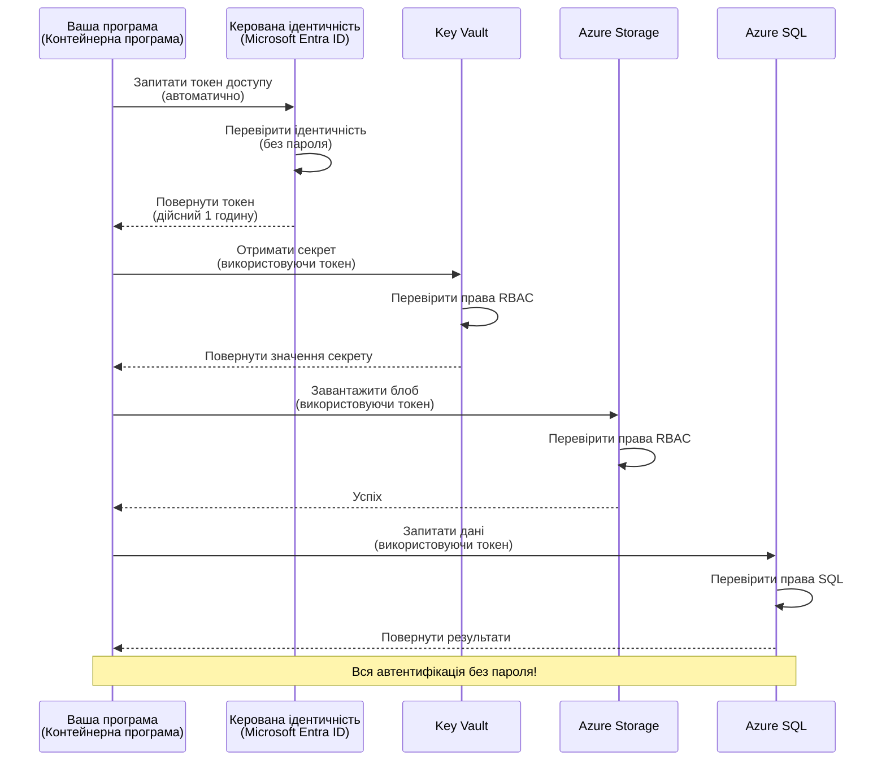
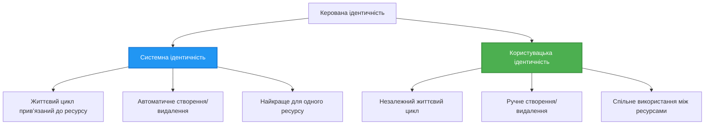

# Шаблони автентифікації та керована ідентичність

⏱️ **Оцінений час**: 45-60 хвилин | 💰 **Вплив на вартість**: Безкоштовно (без додаткової плати) | ⭐ **Складність**: Середній рівень

**📚 Навчальний шлях:**
- ← Попередня: [Управління конфігурацією](configuration.md) - Управління змінними середовища та секретами
- 🎯 **Ви тут**: Автентифікація та безпека (керована ідентичність, Key Vault, безпечні шаблони)
- → Далі: [Перший проєкт](first-project.md) - Побудова першого застосунку AZD
- 🏠 [Головна сторінка курсу](../../README.md)

---

## Чого ви навчитеся

Після проходження цього уроку ви:
- Зрозумієте шаблони аутентифікації Azure (ключі, рядки підключення, керована ідентичність)
- Реалізуєте **керовану ідентичність** для автентифікації без паролів
- Захистите секрети за допомогою інтеграції з **Azure Key Vault**
- Налаштуєте **керування доступом на основі ролей (RBAC)** для розгортань AZD
- Застосуєте найкращі практики безпеки в Container Apps та сервісах Azure
- Виконаєте міграцію від аутентифікації на основі ключів до аутентифікації за допомогою ідентичності

## Чому важлива керована ідентичність

### Проблема: Традиційна автентифікація

**До керованої ідентичності:**
```javascript
// ❌ РИЗИК БЕЗПЕКИ: Жорстко закодовані секрети в коді
const connectionString = "Server=mydb.database.windows.net;User=admin;Password=P@ssw0rd123";
const storageKey = "xK7mN9pQ2wR5tY8uI0oP3aS6dF1gH4jK...";
const cosmosKey = "C2x7B9n4M1p8Q5w3E6r0T2y5U8i1O4p7...";
```

**Проблеми:**
- 🔴 **Відкриті секрети** у коді, файлах конфігурації, змінних середовища
- 🔴 **Ротація облікових даних** потребує змін у коді та повторного розгортання
- 🔴 **Проблеми з аудитом** – хто, коли і що отримував?
- 🔴 **Розпорошення** – секрети розкидані по багатьох системах
- 🔴 **Ризики відповідності** – провали безпекових аудитів

### Рішення: Керована ідентичність

**Після впровадження керованої ідентичності:**
```javascript
// ✅ БЕЗПЕЧНО: Немає секретів у коді
const credential = new DefaultAzureCredential();
const client = new BlobServiceClient(
  "https://mystorageaccount.blob.core.windows.net",
  credential  // Azure автоматично обробляє автентифікацію
);
```

**Переваги:**
- ✅ **Жодних секретів** у коді або конфігурації
- ✅ **Автоматична ротація** – Azure керує цим
- ✅ **Повний аудит** у журналах Microsoft Entra ID
- ✅ **Централізована безпека** – керування через портал Azure
- ✅ **Відповідність стандартам** – відповідає вимогам безпеки

**Аналогія**: Традиційна автентифікація – це як мати кілька фізичних ключів для різних дверей. Керована ідентичність – це як пропуск, який автоматично надає доступ в залежності від вашої особи – ніяких ключів губити, копіювати чи міняти.

---

## Огляд архітектури

### Потік автентифікації з керованою ідентичністю



### Види керованих ідентичностей



| Особливість | Призначена системою | Призначена користувачем |
|-------------|---------------------|-------------------------|
| **Життєвий цикл** | Прив’язана до ресурсу | Незалежна |
| **Створення** | Автоматично з ресурсом | Створення вручну |
| **Видалення** | Видаляється разом з ресурсом | Зберігається після видалення ресурсу |
| **Спільне використання** | Один ресурс | Декілька ресурсів |
| **Використання** | Прості сценарії | Складні багаторесурсні сценарії |
| **За замовчуванням AZD** | ✅ Рекомендовано | Опціонально |

---

## Передумови

### Необхідні інструменти

Ви повинні вже мати їх встановленими з попередніх уроків:

```bash
# Перевірте Azure Developer CLI
azd version
# ✅ Очікується: версія azd 1.0.0 або вище

# Перевірте Azure CLI
az --version
# ✅ Очікується: azure-cli 2.50.0 або вище
```

### Вимоги Azure

- Активна підписка Azure
- Дозволи на:
  - Створення керованих ідентичностей
  - Призначення ролей RBAC
  - Створення ресурсів Key Vault
  - Розгортання Container Apps

### Попередні знання

Ви мали завершити:
- [Посібник з інсталяції](installation.md) – налаштування AZD
- [Основи AZD](azd-basics.md) – базові поняття
- [Управління конфігурацією](configuration.md) – змінні середовища

---

## Урок 1: Розуміння шаблонів автентифікації

### Шаблон 1: Рядки підключення (Застарілий - уникати)

**Як працює:**
```bash
# Рядок підключення містить облікові дані
STORAGE_CONNECTION_STRING="DefaultEndpointsProtocol=https;AccountName=myaccount;AccountKey=xK7mN9pQ2wR5..."
COSMOS_CONNECTION_STRING="AccountEndpoint=https://myaccount.documents.azure.com:443/;AccountKey=C2x7..."
SQL_CONNECTION_STRING="Server=myserver.database.windows.net;User=admin;Password=P@ssw0rd..."
```

**Проблеми:**
- ❌ Секрети видно у змінних середовища
- ❌ Логуються в системах розгортання
- ❌ Важко оновлювати
- ❌ Немає журналу доступу

**Коли використовувати:** Лише для локальної розробки, ніколи в продакшені.

---

### Шаблон 2: Посилання на Key Vault (Краще)

**Як працює:**
```bicep
// Store secret in Key Vault
resource keyVault 'Microsoft.KeyVault/vaults@2023-02-01' = {
  name: 'mykv'
  properties: {
    enableRbacAuthorization: true
  }
}

// Reference in Container App
env: [
  {
    name: 'STORAGE_KEY'
    secretRef: 'storage-key'  // References Key Vault
  }
]
```

**Переваги:**
- ✅ Секрети зберігаються безпечно в Key Vault
- ✅ Централізоване управління секретами
- ✅ Ротація без змін у коді

**Обмеження:**
- ⚠️ Все ще використовуються ключі/паролі
- ⚠️ Потрібно керувати доступом до Key Vault

**Коли використовувати:** Перехідний крок від рядків підключення до керованої ідентичності.

---

### Шаблон 3: Керована ідентичність (Найкраща практика)

**Як працює:**
```bicep
// Enable managed identity
resource containerApp 'Microsoft.App/containerApps@2023-05-01' = {
  name: 'myapp'
  identity: {
    type: 'SystemAssigned'  // Automatically creates identity
  }
}

// Grant permissions
resource roleAssignment 'Microsoft.Authorization/roleAssignments@2022-04-01' = {
  scope: storageAccount
  properties: {
    roleDefinitionId: storageBlobDataContributorRole
    principalId: containerApp.identity.principalId
  }
}
```

**Код застосунку:**
```javascript
// Ніяких секретів не потрібно!
const { DefaultAzureCredential } = require('@azure/identity');
const { BlobServiceClient } = require('@azure/storage-blob');

const credential = new DefaultAzureCredential();
const blobServiceClient = new BlobServiceClient(
  'https://mystorageaccount.blob.core.windows.net',
  credential
);
```

**Переваги:**
- ✅ Жодних секретів у коді/конфігурації
- ✅ Автоматична ротація облікових даних
- ✅ Повний аудит доступу
- ✅ Дозволи на основі ролей RBAC
- ✅ Відповідність стандартам безпеки

**Коли використовувати:** Завжди, для виробничих застосунків.

---

### Шаблон 4: Сервісні облікові записи (CI/CD та автоматизація)

Керована ідентичність – золотий стандарт *для ресурсів, що працюють усередині Azure*. Але що робити з тим, що працює **поза Azure** – наприклад, CI/CD pipeline на агенті або скрипт на ноутбуку, який не може використати інтерактивний логін? Тут приходить на допомогу **сервісний обліковий запис**: нежива ідентичність зі своїми обліковими даними, під якою автоматичний процес може автентифікуватися.

**Як це працює:**

Створіть сервісний обліковий запис зі сферою дії ресурсної групи (найменші права):

```bash
az ad sp create-for-rbac \
  --name "myapp-cicd" \
  --role contributor \
  --scopes /subscriptions/<sub-id>/resourceGroups/<rg-name>
```

Це виведе клієнтський ID, секрет і tenant ID. azd може увійти без інтерактивності:

```bash
azd auth login \
  --client-id "<appId>" \
  --client-secret "<password>" \
  --tenant-id "<tenant>"
```

**Віддавайте перевагу федеративним обліковим даним (OIDC) над секретами.** Замість довгострокового клієнтського секрету налаштуйте федеративний обліковий запис, щоб pipeline обмінювався короткоживучим токеном — без секретів для витоку або обов’язку ротації:

```bash
azd auth login \
  --client-id "<appId>" \
  --federated-credential-provider "github" \
  --tenant-id "<tenant>"
```

> `azd pipeline config` виконає це автоматично. Див. інтеграцію CI/CD у [Розділі 8](../chapter-08-production/production-ai-practices.md).

**Переваги:**
- ✅ Працює поза Azure (агенти збірки, локальні системи, інші хмари)
- ✅ Можна обмежити сферу дії однією ресурсною групою та роллю
- ✅ Федеративна (OIDC) версія не зберігає секретів

**Недоліки:**
- ⚠️ Варіант на основі секретів потребує ретельного зберігання та ротації
- ⚠️ Витік секрету дає повноваження, які має сервісний обліковий запис — тримайте права суворо обмеженими

**Коли використовувати:** У CI/CD pipelines і автоматизації, які не можуть використовувати керовану ідентичність. Завжди віддавайте перевагу **федеративному/OIDC** варіанту над клієнтським секретом і віддавайте перевагу керованій ідентичності, коли робоче навантаження працює всередині Azure.

**Безпечне зберігання облікових даних:**
- Ніколи не записуйте секрети у код – використовуйте сховища секретів pipeline (секрети GitHub Actions, групи змінних Azure DevOps / Key Vault).
- Обмежуйте сферу дії сервісного облікового запису до мінімуму.
- Встановлюйте термін дії секретів і регулярно міняйте їх, або уникайте секретів, використовуючи OIDC.

---

## Урок 2: Реалізація керованої ідентичності з AZD

### Покрокова реалізація

Створимо захищений Container App, який використовує керовану ідентичність для доступу до Azure Storage і Key Vault.

### Структура проєкту

```
secure-app/
├── azure.yaml                 # AZD configuration
├── infra/
│   ├── main.bicep            # Main infrastructure
│   ├── core/
│   │   ├── identity.bicep    # Managed identity setup
│   │   ├── keyvault.bicep    # Key Vault configuration
│   │   └── storage.bicep     # Storage with RBAC
│   └── app/
│       └── container-app.bicep
└── src/
    ├── app.js                # Application code
    ├── package.json
    └── Dockerfile
```

### 1. Налаштуйте AZD (azure.yaml)

```yaml
name: secure-app
metadata:
  template: secure-app@1.0.0

services:
  api:
    project: ./src
    language: js
    host: containerapp

# Enable managed identity (AZD handles this automatically)
```

### 2. Інфраструктура: Увімкніть керовану ідентичність

**Файл: `infra/main.bicep`**

```bicep
targetScope = 'subscription'

param environmentName string
param location string = 'eastus'

var tags = { 'azd-env-name': environmentName }

// Resource group
resource rg 'Microsoft.Resources/resourceGroups@2021-04-01' = {
  name: 'rg-${environmentName}'
  location: location
  tags: tags
}

// Storage Account
module storage './core/storage.bicep' = {
  name: 'storage'
  scope: rg
  params: {
    name: 'st${uniqueString(rg.id)}'
    location: location
    tags: tags
  }
}

// Key Vault
module keyVault './core/keyvault.bicep' = {
  name: 'keyvault'
  scope: rg
  params: {
    name: 'kv-${uniqueString(rg.id)}'
    location: location
    tags: tags
  }
}

// Container App with Managed Identity
module containerApp './app/container-app.bicep' = {
  name: 'container-app'
  scope: rg
  params: {
    name: 'ca-${environmentName}'
    location: location
    tags: tags
    storageAccountName: storage.outputs.name
    keyVaultName: keyVault.outputs.name
  }
}

// Grant Container App access to Storage
module storageRoleAssignment './core/role-assignment.bicep' = {
  name: 'storage-role'
  scope: rg
  params: {
    principalId: containerApp.outputs.identityPrincipalId
    roleDefinitionId: 'ba92f5b4-2d11-453d-a403-e96b0029c9fe'  // Storage Blob Data Contributor
    targetResourceId: storage.outputs.id
  }
}

// Grant Container App access to Key Vault
module kvRoleAssignment './core/role-assignment.bicep' = {
  name: 'kv-role'
  scope: rg
  params: {
    principalId: containerApp.outputs.identityPrincipalId
    roleDefinitionId: '4633458b-17de-408a-b874-0445c86b69e6'  // Key Vault Secrets User
    targetResourceId: keyVault.outputs.id
  }
}

// Outputs
output AZURE_STORAGE_ACCOUNT_NAME string = storage.outputs.name
output AZURE_KEY_VAULT_NAME string = keyVault.outputs.name
output APP_URL string = containerApp.outputs.url
```

### 3. Container App із системною призначеною ідентичністю

**Файл: `infra/app/container-app.bicep`**

```bicep
param name string
param location string
param tags object = {}
param storageAccountName string
param keyVaultName string

resource containerApp 'Microsoft.App/containerApps@2023-05-01' = {
  name: name
  location: location
  tags: tags
  identity: {
    type: 'SystemAssigned'  // 🔑 Enable managed identity
  }
  properties: {
    configuration: {
      ingress: {
        external: true
        targetPort: 3000
      }
    }
    template: {
      containers: [
        {
          name: 'api'
          image: 'myregistry.azurecr.io/api:latest'
          resources: {
            cpu: json('0.5')
            memory: '1Gi'
          }
          env: [
            {
              name: 'AZURE_STORAGE_ACCOUNT_NAME'
              value: storageAccountName
            }
            {
              name: 'AZURE_KEY_VAULT_NAME'
              value: keyVaultName
            }
            // 🔑 No secrets - managed identity handles authentication!
          ]
        }
      ]
    }
  }
}

// Output the identity for RBAC assignments
output identityPrincipalId string = containerApp.identity.principalId
output id string = containerApp.id
output url string = 'https://${containerApp.properties.configuration.ingress.fqdn}'
```

### 4. Модуль призначення ролі RBAC

**Файл: `infra/core/role-assignment.bicep`**

```bicep
param principalId string
param roleDefinitionId string  // Azure built-in role ID
param targetResourceId string

resource roleAssignment 'Microsoft.Authorization/roleAssignments@2022-04-01' = {
  name: guid(principalId, roleDefinitionId, targetResourceId)
  scope: resourceId('Microsoft.Resources/resourceGroups', resourceGroup().name)
  properties: {
    roleDefinitionId: subscriptionResourceId('Microsoft.Authorization/roleDefinitions', roleDefinitionId)
    principalId: principalId
    principalType: 'ServicePrincipal'
  }
}

output id string = roleAssignment.id
```

### 5. Код застосунку з керованою ідентичністю

**Файл: `src/app.js`**

```javascript
const express = require('express');
const { DefaultAzureCredential } = require('@azure/identity');
const { BlobServiceClient } = require('@azure/storage-blob');
const { SecretClient } = require('@azure/keyvault-secrets');

const app = express();
const PORT = process.env.PORT || 3000;

// 🔑 Ініціалізація облікових даних (працює автоматично з керованою ідентичністю)
const credential = new DefaultAzureCredential();

// Налаштування Azure Storage
const storageAccountName = process.env.AZURE_STORAGE_ACCOUNT_NAME;
const blobServiceClient = new BlobServiceClient(
  `https://${storageAccountName}.blob.core.windows.net`,
  credential  // Ключі не потрібні!
);

// Налаштування Key Vault
const keyVaultName = process.env.AZURE_KEY_VAULT_NAME;
const secretClient = new SecretClient(
  `https://${keyVaultName}.vault.azure.net`,
  credential  // Ключі не потрібні!
);

// Перевірка стану
app.get('/health', (req, res) => {
  res.json({ status: 'healthy', authentication: 'managed-identity' });
});

// Завантажити файл у блоб-сховище
app.post('/upload', async (req, res) => {
  try {
    const containerClient = blobServiceClient.getContainerClient('uploads');
    await containerClient.createIfNotExists();
    
    const blobName = `file-${Date.now()}.txt`;
    const blockBlobClient = containerClient.getBlockBlobClient(blobName);
    
    await blockBlobClient.upload('Hello from managed identity!', 30);
    
    res.json({
      success: true,
      blobName: blobName,
      message: 'File uploaded using managed identity!'
    });
  } catch (error) {
    console.error('Upload error:', error);
    res.status(500).json({ error: error.message });
  }
});

// Отримати секрет з Key Vault
app.get('/secret/:name', async (req, res) => {
  try {
    const secretName = req.params.name;
    const secret = await secretClient.getSecret(secretName);
    
    res.json({
      name: secretName,
      value: secret.value,
      message: 'Secret retrieved using managed identity!'
    });
  } catch (error) {
    console.error('Secret error:', error);
    res.status(500).json({ error: error.message });
  }
});

// Перелік контейнерів блобів (демонструє доступ на читання)
app.get('/containers', async (req, res) => {
  try {
    const containers = [];
    for await (const container of blobServiceClient.listContainers()) {
      containers.push(container.name);
    }
    
    res.json({
      containers: containers,
      count: containers.length,
      message: 'Containers listed using managed identity!'
    });
  } catch (error) {
    console.error('List error:', error);
    res.status(500).json({ error: error.message });
  }
});

app.listen(PORT, () => {
  console.log(`Secure API listening on port ${PORT}`);
  console.log('Authentication: Managed Identity (passwordless)');
});
```

**Файл: `src/package.json`**

```json
{
  "name": "secure-app",
  "version": "1.0.0",
  "dependencies": {
    "express": "^4.18.2",
    "@azure/identity": "^4.0.0",
    "@azure/storage-blob": "^12.17.0",
    "@azure/keyvault-secrets": "^4.7.0"
  },
  "scripts": {
    "start": "node app.js"
  }
}
```

### 6. Розгортання і тестування

```bash
# Ініціалізувати середовище AZD
azd init

# Розгорнути інфраструктуру та застосунок
azd up

# Отримати URL застосунку
APP_URL=$(azd env get-values | grep APP_URL | cut -d '=' -f2 | tr -d '"')

# Перевірити стан здоров'я (health check)
curl $APP_URL/health
```

**✅ Очікуваний результат:**
```json
{
  "status": "healthy",
  "authentication": "managed-identity"
}
```

**Тест завантаження blob:**
```bash
curl -X POST $APP_URL/upload
```

**✅ Очікуваний результат:**
```json
{
  "success": true,
  "blobName": "file-1700404800000.txt",
  "message": "File uploaded using managed identity!"
}
```

**Тест виведення контейнерів:**
```bash
curl $APP_URL/containers
```

**✅ Очікуваний результат:**
```json
{
  "containers": ["uploads"],
  "count": 1,
  "message": "Containers listed using managed identity!"
}
```

---

## Поширені ролі Azure RBAC

### Вбудовані Role IDs для керованої ідентичності

| Сервіс | Назва ролі | Role ID | Дозволи |
|--------|------------|---------|---------|
| **Storage** | Storage Blob Data Reader | `2a2b9908-6b94-4a3d-8e5a-a7d8f8cc8a12` | Читання blob та контейнерів |
| **Storage** | Storage Blob Data Contributor | `ba92f5b4-2d11-453d-a403-e96b0029c9fe` | Читання, запис, видалення blob |
| **Storage** | Storage Queue Data Contributor | `974c5e8b-45b9-4653-ba55-5f855dd0fb88` | Читання, запис, видалення повідомлень черги |
| **Key Vault** | Key Vault Secrets User | `4633458b-17de-408a-b874-0445c86b69e6` | Читання секретів |
| **Key Vault** | Key Vault Secrets Officer | `b86a8fe4-44ce-4948-aee5-eccb2c155cd7` | Читання, запис, видалення секретів |
| **Cosmos DB** | Cosmos DB Built-in Data Reader | `00000000-0000-0000-0000-000000000001` | Читання даних Cosmos DB |
| **Cosmos DB** | Cosmos DB Built-in Data Contributor | `00000000-0000-0000-0000-000000000002` | Читання, запис даних Cosmos DB |
| **SQL Database** | SQL DB Contributor | `9b7fa17d-e63e-47b0-bb0a-15c516ac86ec` | Керування SQL базами даних |
| **Service Bus** | Azure Service Bus Data Owner | `090c5cfd-751d-490a-894a-3ce6f1109419` | Відправка, отримання, керування повідомленнями |

### Як знайти Role IDs

```bash
# Перелік усіх вбудованих ролей
az role definition list --query "[].{Name:roleName, ID:name}" --output table

# Пошук конкретної ролі
az role definition list --query "[?contains(roleName, 'Storage Blob')].{Name:roleName, ID:name}" --output table

# Отримати деталі ролі
az role definition list --name "Storage Blob Data Contributor"
```

---

## Практичні вправи

### Вправа 1: Увімкнення керованої ідентичності для існуючого застосунку ⭐⭐ (Середній рівень)

**Мета**: Додати керовану ідентичність в існуюче розгортання Container App

**Сценарій**: У вас Container App, що використовує рядки підключення. Переведіть його на керовану ідентичність.

**Початкова точка**: Container App з такою конфігурацією:

```bicep
// ❌ Current: Using connection string
env: [
  {
    name: 'STORAGE_CONNECTION_STRING'
    secretRef: 'storage-connection'
  }
]
```

**Кроки**:

1. **Увімкніть керовану ідентичність у Bicep:**

```bicep
resource containerApp 'Microsoft.App/containerApps@2023-05-01' = {
  name: 'myapp'
  identity: {
    type: 'SystemAssigned'  // Add this
  }
  // ... rest of configuration
}
```

2. **Надайте доступ до Storage:**

```bicep
// Get storage account reference
resource storageAccount 'Microsoft.Storage/storageAccounts@2023-01-01' existing = {
  name: storageAccountName
}

// Assign role
resource roleAssignment 'Microsoft.Authorization/roleAssignments@2022-04-01' = {
  name: guid(containerApp.id, 'ba92f5b4-2d11-453d-a403-e96b0029c9fe', storageAccount.id)
  scope: storageAccount
  properties: {
    roleDefinitionId: subscriptionResourceId('Microsoft.Authorization/roleDefinitions', 'ba92f5b4-2d11-453d-a403-e96b0029c9fe')
    principalId: containerApp.identity.principalId
    principalType: 'ServicePrincipal'
  }
}
```

3. **Оновіть код застосунку:**

**До (рядок підключення):**
```javascript
const { BlobServiceClient } = require('@azure/storage-blob');

const blobServiceClient = BlobServiceClient.fromConnectionString(
  process.env.STORAGE_CONNECTION_STRING
);
```

**Після (керована ідентичність):**
```javascript
const { DefaultAzureCredential } = require('@azure/identity');
const { BlobServiceClient } = require('@azure/storage-blob');

const credential = new DefaultAzureCredential();
const blobServiceClient = new BlobServiceClient(
  `https://${process.env.STORAGE_ACCOUNT_NAME}.blob.core.windows.net`,
  credential
);
```

4. **Оновіть змінні середовища:**

```bicep
env: [
  {
    name: 'STORAGE_ACCOUNT_NAME'
    value: storageAccountName  // Just the name, no secrets!
  }
  // Remove STORAGE_CONNECTION_STRING
]
```

5. **Розгорніть і протестуйте:**

```bash
# Повторно розгорнути
azd up

# Перевірте, що це все ще працює
curl https://myapp.azurecontainerapps.io/upload
```

**✅ Критерії успіху:**
- ✅ Застосунок розгортається без помилок
- ✅ Операції зі Storage працюють (завантаження, перелік, завантаження)
- ✅ Немає рядків підключення у змінних середовища
- ✅ Ідентичність видно в Azure Portal у вкладці "Identity"

**Перевірка:**

```bash
# Перевірте, чи увімкнено керовану ідентичність
az containerapp show \
  --name myapp \
  --resource-group rg-myapp \
  --query "identity.type"
# ✅ Очікувано: "SystemAssigned"

# Перевірте призначення ролі
az role assignment list \
  --assignee $(az containerapp show --name myapp --resource-group rg-myapp --query "identity.principalId" -o tsv) \
  --scope /subscriptions/{sub-id}/resourceGroups/rg-myapp/providers/Microsoft.Storage/storageAccounts/mystorageaccount
# ✅ Очікувано: Показує роль "Storage Blob Data Contributor"
```

**Час**: 20-30 хвилин

---

### Вправа 2: Доступ до кількох сервісів із користувацькою ідентичністю ⭐⭐⭐ (Просунутий рівень)

**Мета**: Створити призначену користувачем ідентичність, спільну для кількох Container Apps

**Сценарій**: У вас 3 мікросервіси, і всі вони мають доступ до одного акаунту Storage та Key Vault.

**Кроки**:

1. **Створіть призначену користувачем ідентичність:**

**Файл: `infra/core/identity.bicep`**

```bicep
param name string
param location string
param tags object = {}

resource userAssignedIdentity 'Microsoft.ManagedIdentity/userAssignedIdentities@2023-01-31' = {
  name: name
  location: location
  tags: tags
}

output id string = userAssignedIdentity.id
output principalId string = userAssignedIdentity.properties.principalId
output clientId string = userAssignedIdentity.properties.clientId
```

2. **Призначте ролі користувацькій ідентичності:**

```bicep
// In main.bicep
module userIdentity './core/identity.bicep' = {
  name: 'user-identity'
  scope: rg
  params: {
    name: 'id-${environmentName}'
    location: location
    tags: tags
  }
}

// Grant Storage access
resource storageRoleAssignment 'Microsoft.Authorization/roleAssignments@2022-04-01' = {
  name: guid(userIdentity.outputs.principalId, 'storage-contributor')
  scope: storageAccount
  properties: {
    roleDefinitionId: subscriptionResourceId('Microsoft.Authorization/roleDefinitions', 'ba92f5b4-2d11-453d-a403-e96b0029c9fe')
    principalId: userIdentity.outputs.principalId
    principalType: 'ServicePrincipal'
  }
}

// Grant Key Vault access
resource kvRoleAssignment 'Microsoft.Authorization/roleAssignments@2022-04-01' = {
  name: guid(userIdentity.outputs.principalId, 'kv-secrets-user')
  scope: keyVault
  properties: {
    roleDefinitionId: subscriptionResourceId('Microsoft.Authorization/roleDefinitions', '4633458b-17de-408a-b874-0445c86b69e6')
    principalId: userIdentity.outputs.principalId
    principalType: 'ServicePrincipal'
  }
}
```

3. **Призначте ідентичність кільком Container Apps:**

```bicep
resource apiGateway 'Microsoft.App/containerApps@2023-05-01' = {
  name: 'api-gateway'
  identity: {
    type: 'UserAssigned'
    userAssignedIdentities: {
      '${userIdentity.outputs.id}': {}
    }
  }
  // ... rest of config
}

resource productService 'Microsoft.App/containerApps@2023-05-01' = {
  name: 'product-service'
  identity: {
    type: 'UserAssigned'
    userAssignedIdentities: {
      '${userIdentity.outputs.id}': {}
    }
  }
  // ... rest of config
}

resource orderService 'Microsoft.App/containerApps@2023-05-01' = {
  name: 'order-service'
  identity: {
    type: 'UserAssigned'
    userAssignedIdentities: {
      '${userIdentity.outputs.id}': {}
    }
  }
  // ... rest of config
}
```

4. **Код застосунку (усі сервіси використовують один шаблон):**

```javascript
const { DefaultAzureCredential, ManagedIdentityCredential } = require('@azure/identity');

// Для користувацької ідентичності вкажіть ідентифікатор клієнта
const credential = new ManagedIdentityCredential(
  process.env.AZURE_CLIENT_ID  // Ідентифікатор клієнта користувацької ідентичності
);

// Або використовуйте DefaultAzureCredential (автоматичне визначення)
const credential = new DefaultAzureCredential();

const blobServiceClient = new BlobServiceClient(
  `https://${process.env.STORAGE_ACCOUNT_NAME}.blob.core.windows.net`,
  credential
);
```

5. **Розгорніть і перевірте:**

```bash
azd up

# Перевірте, чи всі служби можуть отримати доступ до сховища
curl https://api-gateway.azurecontainerapps.io/upload
curl https://product-service.azurecontainerapps.io/upload
curl https://order-service.azurecontainerapps.io/upload
```

**✅ Критерії успіху:**
- ✅ Одна ідентичність спільна для всіх 3 сервісів
- ✅ Усі сервіси мають доступ до Storage і Key Vault
- ✅ Ідентичність зберігається, якщо видалити один сервіс
- ✅ Централізоване управління дозволами

**Переваги користувацької ідентичності:**
- Одна ідентичність для керування
- Консистентні дозволи для всіх сервісів
- Залишається після видалення сервісу
- Краще для складних архітектур

**Час**: 30-40 хвилин

---

### Вправа 3: Реалізація ротації секретів Key Vault ⭐⭐⭐ (Просунутий рівень)

**Мета**: Зберігати сторонні API ключі в Key Vault і отримувати їх через керовану ідентичність

**Сценарій**: Ваш застосунок повинен викликати зовнішні API (OpenAI, Stripe, SendGrid), які вимагають API ключі.

**Кроки**:

1. **Створіть Key Vault з RBAC:**

**Файл: `infra/core/keyvault.bicep`**

```bicep
param name string
param location string
param tags object = {}

resource keyVault 'Microsoft.KeyVault/vaults@2023-02-01' = {
  name: name
  location: location
  tags: tags
  properties: {
    enableRbacAuthorization: true  // Use RBAC instead of access policies
    sku: {
      family: 'A'
      name: 'standard'
    }
    tenantId: subscription().tenantId
    enableSoftDelete: true
    softDeleteRetentionInDays: 90
  }
}

// Allow Container App to read secrets
output id string = keyVault.id
output name string = keyVault.name
output uri string = keyVault.properties.vaultUri
```

2. **Збережіть секрети у Key Vault:**

```bash
# Отримати ім’я сховища ключів
KV_NAME=$(azd env get-values | grep AZURE_KEY_VAULT_NAME | cut -d '=' -f2 | tr -d '"')

# Зберігати ключі API сторонніх сервісів
az keyvault secret set \
  --vault-name $KV_NAME \
  --name "OpenAI-ApiKey" \
  --value "sk-proj-xxxxxxxxxxxxx"

az keyvault secret set \
  --vault-name $KV_NAME \
  --name "Stripe-ApiKey" \
  --value "sk_live_xxxxxxxxxxxxx"

az keyvault secret set \
  --vault-name $KV_NAME \
  --name "SendGrid-ApiKey" \
  --value "SG.xxxxxxxxxxxxx"
```

3. **Код застосунку для отримання секретів:**

**Файл: `src/config.js`**

```javascript
const { DefaultAzureCredential } = require('@azure/identity');
const { SecretClient } = require('@azure/keyvault-secrets');

class Config {
  constructor() {
    this.credential = new DefaultAzureCredential();
    this.secretClient = new SecretClient(
      `https://${process.env.AZURE_KEY_VAULT_NAME}.vault.azure.net`,
      this.credential
    );
    this.cache = {};
  }

  async getSecret(secretName) {
    // Спочатку перевірте кеш
    if (this.cache[secretName]) {
      return this.cache[secretName];
    }

    try {
      const secret = await this.secretClient.getSecret(secretName);
      this.cache[secretName] = secret.value;
      console.log(`✅ Retrieved secret: ${secretName}`);
      return secret.value;
    } catch (error) {
      console.error(`❌ Failed to get secret ${secretName}:`, error.message);
      throw error;
    }
  }

  async getOpenAIKey() {
    return this.getSecret('OpenAI-ApiKey');
  }

  async getStripeKey() {
    return this.getSecret('Stripe-ApiKey');
  }

  async getSendGridKey() {
    return this.getSecret('SendGrid-ApiKey');
  }
}

module.exports = new Config();
```

4. **Використання секретів у застосунку:**

**Файл: `src/app.js`**

```javascript
const express = require('express');
const config = require('./config');
const { OpenAI } = require('openai');

const app = express();

// ініціалізувати OpenAI з ключем із сховища ключів
let openaiClient;

async function initializeServices() {
  const openaiKey = await config.getOpenAIKey();
  openaiClient = new OpenAI({ apiKey: openaiKey });
  console.log('✅ Services initialized with secrets from Key Vault');
}

// Викликати при запуску
initializeServices().catch(console.error);

app.post('/chat', async (req, res) => {
  try {
    const completion = await openaiClient.chat.completions.create({
      model: 'gpt-4.1',
      messages: [{ role: 'user', content: 'Hello!' }]
    });
    
    res.json({
      response: completion.choices[0].message.content,
      authentication: 'Key from Key Vault via Managed Identity'
    });
  } catch (error) {
    res.status(500).json({ error: error.message });
  }
});

app.listen(3000, () => {
  console.log('Secure API with Key Vault integration running');
});
```

5. **Розгорніть і протестуйте:**

```bash
azd up

# Перевірте, що ключі API працюють
curl -X POST https://myapp.azurecontainerapps.io/chat \
  -H "Content-Type: application/json" \
  -d '{"message":"Hello AI"}'
```

**✅ Критерії успіху:**
- ✅ Немає API ключів у коді або змінних середовища
- ✅ Додаток отримує ключі з Key Vault
- ✅ API сторонніх розробників працюють правильно
- ✅ Можна змінювати ключі без змін у коді

**Змінити секрет:**

```bash
# Оновити секрет у Key Vault
az keyvault secret set \
  --vault-name $KV_NAME \
  --name "OpenAI-ApiKey" \
  --value "sk-proj-NEW_KEY_HERE"

# Перезапустити додаток, щоб застосувати новий ключ
az containerapp revision restart \
  --name myapp \
  --resource-group rg-myapp
```

**Час**: 25-35 хвилин

---

## Контроль знань

### 1. Шаблони аутентифікації ✓

Перевірте свої знання:

- [ ] **Питання 1**: Які три основні шаблони аутентифікації? 
  - **Відповідь**: Рядки підключення (старі), посилання Key Vault (перехідні), керована ідентичність (кращий)

- [ ] **Питання 2**: Чому керована ідентичність краща за рядки підключення?
  - **Відповідь**: Немає секретів у коді, автоматичне оновлення, повний журнал аудиту, права RBAC

- [ ] **Питання 3**: Коли слід використовувати призначену користувачем ідентичність замість системної?
  - **Відповідь**: Коли ідентичність потрібно спільно використовувати між кількома ресурсами або якщо життєвий цикл ідентичності незалежний від ресурсу

**Практична перевірка:**
```bash
# Перевірте, який тип ідентичності використовує ваш додаток
az containerapp show \
  --name myapp \
  --resource-group rg-myapp \
  --query "identity.type"

# Перелічіть всі призначення ролей для ідентичності
az role assignment list \
  --assignee $(az containerapp show --name myapp --resource-group rg-myapp --query "identity.principalId" -o tsv)
```

---

### 2. RBAC та дозволи ✓

Перевірте свої знання:

- [ ] **Питання 1**: Який ідентифікатор ролі для "Storage Blob Data Contributor"?
  - **Відповідь**: `ba92f5b4-2d11-453d-a403-e96b0029c9fe`

- [ ] **Питання 2**: Які права дає роль "Key Vault Secrets User"?
  - **Відповідь**: Доступ лише для читання секретів (не може створювати, оновлювати або видаляти)

- [ ] **Питання 3**: Як надати Container App доступ до Azure SQL?
  - **Відповідь**: Призначити роль "SQL DB Contributor" або налаштувати аутентифікацію Microsoft Entra ID для SQL

**Практична перевірка:**
```bash
# Знайти конкретну роль
az role definition list --name "Storage Blob Data Contributor"

# Перевірте, які ролі призначені вашій особистості
PRINCIPAL_ID=$(az containerapp show --name myapp --resource-group rg-myapp --query "identity.principalId" -o tsv)
az role assignment list --assignee $PRINCIPAL_ID --output table
```

---

### 3. Інтеграція Key Vault ✓

Перевірте свої знання:

- [ ] **Питання 1**: Як увімкнути RBAC для Key Vault замість політик доступу?
  - **Відповідь**: Встановити `enableRbacAuthorization: true` у Bicep

- [ ] **Питання 2**: Яка бібліотека Azure SDK відповідає за аутентифікацію з керованою ідентичністю?
  - **Відповідь**: `@azure/identity` з класом `DefaultAzureCredential`

- [ ] **Питання 3**: Як довго секрети Key Vault зберігаються у кеші?
  - **Відповідь**: Залежить від додатку; реалізуйте власну стратегію кешування

**Практична перевірка:**
```bash
# Тестування доступу до Key Vault
az keyvault secret show \
  --vault-name $KV_NAME \
  --name "OpenAI-ApiKey" \
  --query "value"

# Перевірте, чи увімкнено RBAC
az keyvault show \
  --name $KV_NAME \
  --query "properties.enableRbacAuthorization"
# ✅ Очікувано: true
```

---

## Найкращі практики безпеки

### ✅ РАДИМО:

1. **Завжди використовувати керовану ідентичність у продакшені**
   ```bicep
   identity: {
     type: 'SystemAssigned'
   }
   ```

2. **Використовуйте ролі RBAC з мінімальними правами**
   - Використовуйте ролі "Reader", коли можливо
   - Уникайте ролей "Owner" або "Contributor", якщо це не потрібно

3. **Зберігайте ключі сторонніх сервісів у Key Vault**
   ```javascript
   const apiKey = await secretClient.getSecret('ThirdPartyApiKey');
   ```

4. **Увімкніть аудит логування**
   ```bicep
   diagnosticSettings: {
     logs: [{ category: 'AuditEvent', enabled: true }]
   }
   ```

5. **Використовуйте різні ідентичності для dev/staging/prod середовищ**
   ```bash
   azd env new dev
   azd env new staging
   azd env new prod
   ```

6. **Регулярно оновлюйте секрети**
   - Встановлюйте терміни дії для секретів Key Vault
   - Автоматизуйте оновлення за допомогою Azure Functions

### ❌ НЕ РАДИМО:

1. **Ніколи не вписуйте секрети у код**
   ```javascript
   // ❌ ПОГАНО
   const apiKey = "sk-proj-xxxxxxxxxxxxx";
   ```

2. **Не використовуйте рядки підключення в продакшені**
   ```javascript
   // ❌ ПОГАНО
   BlobServiceClient.fromConnectionString(process.env.STORAGE_CONNECTION_STRING)
   ```

3. **Не надавайте надмірних прав**
   ```bicep
   // ❌ BAD - too much access
   roleDefinitionId: 'Owner'
   
   // ✅ GOOD - least privilege
   roleDefinitionId: 'Storage Blob Data Reader'
   ```

4. **Не логгируйте секрети**
   ```javascript
   // ❌ ПОГАНО
   console.log('API Key:', apiKey);
   
   // ✅ ДОБРЕ
   console.log('API Key retrieved successfully');
   ```

5. **Не використовуйте однакові ідентичності в різних середовищах продакшену**
   ```bicep
   // ❌ BAD - same identity for dev and prod
   // ✅ GOOD - separate identities per environment
   ```

---

## Довідник з усунення несправностей

### Проблема: "Unauthorized" при доступі до Azure Storage

**Симптоми:**
```
Error: Unauthorized (403)
AuthorizationPermissionMismatch: This request is not authorized to perform this operation
```

**Діагностика:**

```bash
# Перевірте, чи ввімкнено керовану ідентичність
az containerapp show \
  --name myapp \
  --resource-group rg-myapp \
  --query "identity.type"
# ✅ Очікувано: "SystemAssigned" або "UserAssigned"

# Перевірте призначення ролей
PRINCIPAL_ID=$(az containerapp show --name myapp --resource-group rg-myapp --query "identity.principalId" -o tsv)
az role assignment list --assignee $PRINCIPAL_ID

# Очікувано: Повинно бути "Storage Blob Data Contributor" або подібна роль
```

**Рішення:**

1. **Надайте правильну роль RBAC:**
```bash
STORAGE_ID=$(az storage account show --name mystorageaccount --resource-group rg-myapp --query "id" -o tsv)
az role assignment create \
  --assignee $PRINCIPAL_ID \
  --role "Storage Blob Data Contributor" \
  --scope $STORAGE_ID
```

2. **Зачекайте поширення змін (може зайняти 5-10 хвилин):**
```bash
# Перевірити статус призначення ролі
az role assignment list --assignee $PRINCIPAL_ID --scope $STORAGE_ID
```

3. **Перевірте, що додаток використовує правильний обліковий запис:**
```javascript
// Переконайтеся, що ви використовуєте DefaultAzureCredential
const credential = new DefaultAzureCredential();
```

---

### Проблема: Відмова у доступі до Key Vault

**Симптоми:**
```
Error: Forbidden (403)
The user, group or application does not have secrets get permission
```

**Діагностика:**

```bash
# Перевірте, чи увімкнено RBAC для Key Vault
az keyvault show \
  --name $KV_NAME \
  --query "properties.enableRbacAuthorization"
# ✅ Очікувано: true

# Перевірте призначення ролей
az role assignment list \
  --assignee $PRINCIPAL_ID \
  --scope /subscriptions/{sub-id}/resourceGroups/rg-myapp/providers/Microsoft.KeyVault/vaults/$KV_NAME
```

**Рішення:**

1. **Увімкніть RBAC для Key Vault:**
```bash
az keyvault update \
  --name $KV_NAME \
  --enable-rbac-authorization true
```

2. **Надайте роль Key Vault Secrets User:**
```bash
KV_ID=$(az keyvault show --name $KV_NAME --query "id" -o tsv)
az role assignment create \
  --assignee $PRINCIPAL_ID \
  --role "Key Vault Secrets User" \
  --scope $KV_ID
```

---

### Проблема: DefaultAzureCredential не працює локально

**Симптоми:**
```
Error: DefaultAzureCredential failed to retrieve a token
CredentialUnavailableError: No credential available
```

**Діагностика:**

```bash
# Перевірте, чи ви увійшли в систему
az account show

# Перевірте автентифікацію Azure CLI
az ad signed-in-user show
```

**Рішення:**

1. **Увійдіть в Azure CLI:**
```bash
az login
```

2. **Встановіть підписку Azure:**
```bash
az account set --subscription "Your Subscription Name"
```

3. **Для локальної розробки використовуйте змінні середовища:**
```bash
export AZURE_TENANT_ID="your-tenant-id"
export AZURE_CLIENT_ID="your-client-id"
export AZURE_CLIENT_SECRET="your-client-secret"
```

4. **Або використовуйте інший обліковий запис локально:**
```javascript
const { DefaultAzureCredential, AzureCliCredential } = require('@azure/identity');

// Використовуйте AzureCliCredential для локальної розробки
const credential = process.env.NODE_ENV === 'production' 
  ? new DefaultAzureCredential()
  : new AzureCliCredential();
```

---

### Проблема: Видача ролі занадто довго поширюється

**Симптоми:**
- Роль призначена успішно
- Постійні помилки 403
- Перемінний доступ (іноді працює, іноді ні)

**Пояснення:**
Зміни RBAC в Azure можуть поширюватися від 5 до 10 хвилин глобально.

**Рішення:**

```bash
# Зачекайте та повторіть спробу
echo "Waiting for RBAC propagation..."
sleep 300  # Зачекайте 5 хвилин

# Перевірте доступ
curl https://myapp.azurecontainerapps.io/upload

# Якщо проблема не зникає, перезапустіть додаток
az containerapp revision restart \
  --name myapp \
  --resource-group rg-myapp
```

---

## Вартість

### Витрати на керовану ідентичність

| Ресурс | Вартість |
|----------|------|
| **Керована ідентичність** | 🆓 **БЕЗКОШТОВНО** - без плати |
| **Призначення ролей RBAC** | 🆓 **БЕЗКОШТОВНО** - без плати |
| **Запити токенів Microsoft Entra ID** | 🆓 **БЕЗКОШТОВНО** - у вартості |
| **Операції Key Vault** | $0.03 за 10 000 операцій |
| **Зберігання секретів Key Vault** | $0.024 за секрет на місяць |

**Керована ідентичність економить кошти, бо:**
- ✅ Відсутні операції Key Vault для аутентифікації сервісів
- ✅ Менше інцидентів безпеки (секрети не потікли)
- ✅ Менше операційних труднощів (немає ручного оновлення)

**Приклад порівняння вартості (за місяць):**

| Сценарій | Рядки підключення | Керована ідентичність | Економія |
|----------|-------------------|-----------------|---------|
| Малий додаток (1M запитів) | ~50$ (Key Vault + операції) | ~0$ | 50$/місяць |
| Середній додаток (10M запитів) | ~200$ | ~0$ | 200$/місяць |
| Великий додаток (100M запитів) | ~1,500$ | ~0$ | 1,500$/місяць |

---

## Дізнайтеся більше

### Офіційна документація
- [Azure Managed Identity](https://learn.microsoft.com/entra/identity/managed-identities-azure-resources/overview)
- [Azure RBAC](https://learn.microsoft.com/azure/role-based-access-control/overview)
- [Azure Key Vault](https://learn.microsoft.com/azure/key-vault/general/overview)
- [DefaultAzureCredential](https://learn.microsoft.com/dotnet/api/azure.identity.defaultazurecredential)

### Документація SDK
- [@azure/identity (Node.js)](https://www.npmjs.com/package/@azure/identity)
- [Azure.Identity (C#)](https://www.nuget.org/packages/Azure.Identity/)
- [azure-identity (Python)](https://pypi.org/project/azure-identity/)

### Наступні кроки в курсі
- ← Попередній: [Configuration Management](configuration.md)
- → Наступний: [First Project](first-project.md)
- 🏠 [Головна сторінка курсу](../../README.md)

### Приклади за темою
- [Приклад чатів Microsoft Foundry Models](../../../../examples/azure-openai-chat) - Використовує керовану ідентичність для Microsoft Foundry Models
- [Приклад мікросервісів](../../../../examples/microservices) - Шаблони аутентифікації для багатосервісних додатків

---

## Підсумок

**Ви дізналися:**
- ✅ Три шаблони аутентифікації (рядки підключення, Key Vault, керована ідентичність)
- ✅ Як увімкнути і налаштувати керовану ідентичність в AZD
- ✅ Призначення ролей RBAC для Azure сервісів
- ✅ Інтеграцію Key Vault для секретів сторонніх сервісів
- ✅ Відмінності користувацьких та системних ідентичностей
- ✅ Найкращі практики безпеки та усунення неполадок

**Основні висновки:**
1. **Завжди використовуйте керовану ідентичність у продакшені** - Немає секретів, автоматичне оновлення
2. **Використовуйте ролі RBAC з мінімально необхідними правами** 
3. **Зберігайте ключі сторонніх сервісів у Key Vault** - Централізоване управління секретами
4. **Розділяйте ідентичності для різних середовищ** - Ізоляція dev, staging, prod
5. **Увімкніть аудит логування** - Відслідковуйте, хто і коли отримував доступ

**Наступні кроки:**
1. Завершіть практичні вправи вище
2. Міґруйте існуючий додаток з рядків підключення на керовану ідентичність
3. Побудуйте свій перший проект AZD із безпекою з першого дня: [First Project](first-project.md)

---

<!-- CO-OP TRANSLATOR DISCLAIMER START -->
**Відмова від відповідальності**:
Цей документ було перекладено за допомогою сервісу штучного інтелекту для перекладу [Co-op Translator](https://github.com/Azure/co-op-translator). Хоча ми прагнемо до точності, будь ласка, майте на увазі, що автоматичні переклади можуть містити помилки або неточності. Оригінальний документ рідною мовою слід вважати авторитетним джерелом. Для критично важливої інформації рекомендується професійний людський переклад. Ми не несемо відповідальності за будь-які непорозуміння або неправильні тлумачення, що виникли внаслідок використання цього перекладу.
<!-- CO-OP TRANSLATOR DISCLAIMER END -->