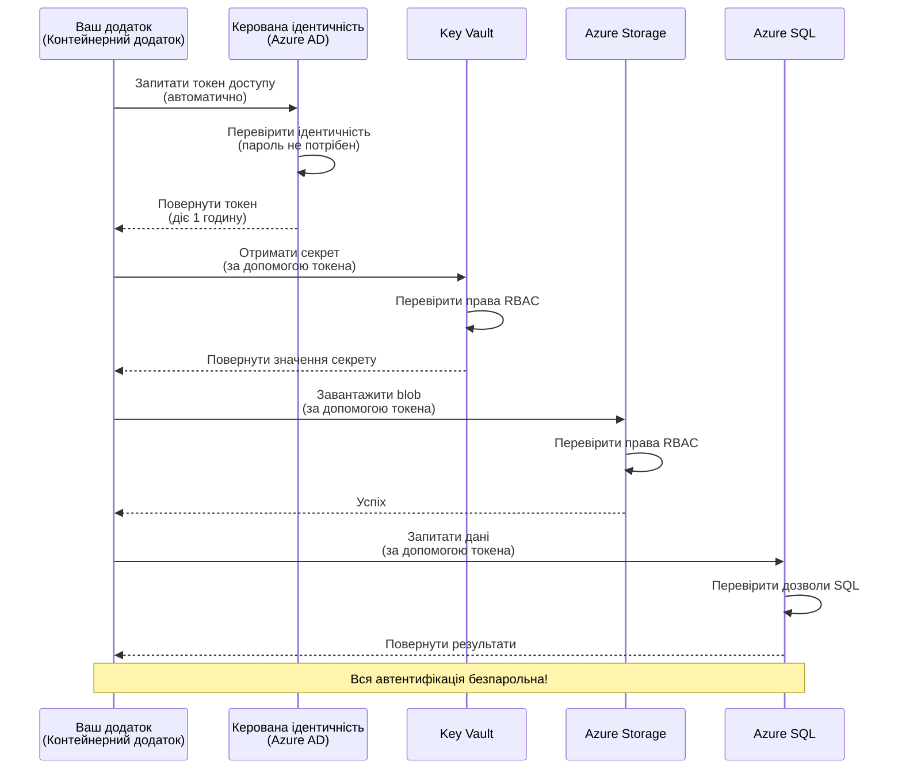
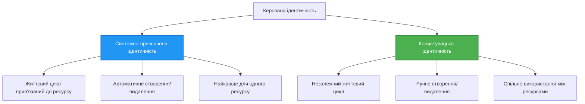

# Authentication Patterns and Managed Identity

⏱️ **Орієнтовний час**: 45-60 хвилин | 💰 **Вплив вартості**: Безкоштовно (без додаткових витрат) | ⭐ **Складність**: Середній

**📚 Маршрут навчання:**
- ← Попередня: [Configuration Management](configuration.md) - Керування змінними середовища та секретами
- 🎯 **Ви тут**: Authentication & Security (Managed Identity, Key Vault, безпечні шаблони)
- → Наступна: [First Project](first-project.md) - Створіть свій перший AZD додаток
- 🏠 [Course Home](../../README.md)

---

## Чого ви навчитеся

Завершивши цей урок, ви:
- Зрозумієте шаблони автентифікації в Azure (ключі, рядки підключення, Managed Identity)
- Реалізуєте **Managed Identity** для автентифікації без паролів
- Захистите секрети за допомогою інтеграції з **Azure Key Vault**
- Налаштуєте **ролі на основі доступу (RBAC)** для розгортань AZD
- Застосуєте найкращі практики безпеки в Container Apps та сервісах Azure
- Міґруєте від автентифікації на основі ключів до автентифікації на основі ідентичності

## Чому Managed Identity важливий

### Проблема: Традиційна автентифікація

**До Managed Identity:**
```javascript
// ❌ РИЗИК БЕЗПЕКИ: Хардкодовані секрети в коді
const connectionString = "Server=mydb.database.windows.net;User=admin;Password=P@ssw0rd123";
const storageKey = "xK7mN9pQ2wR5tY8uI0oP3aS6dF1gH4jK...";
const cosmosKey = "C2x7B9n4M1p8Q5w3E6r0T2y5U8i1O4p7...";
```

**Проблеми:**
- 🔴 **Відкриті секрети** в коді, файлах конфігурації, змінних середовища
- 🔴 **Ротація облікових даних** вимагає змін коду та перевпровадження
- 🔴 **Проблеми з аудитом** — хто і коли отримував доступ?
- 🔴 **Розкиданість** — секрети розпорошені по різних системах
- 🔴 **Ризики відповідності** — провали в перевірках безпеки

### Рішення: Managed Identity

**Після Managed Identity:**
```javascript
// ✅ БЕЗПЕЧНО: Жодних секретів у коді
const credential = new DefaultAzureCredential();
const client = new BlobServiceClient(
  "https://mystorageaccount.blob.core.windows.net",
  credential  // Azure автоматично обробляє автентифікацію
);
```

**Переваги:**
- ✅ **Жодних секретів** у коді або конфігурації
- ✅ **Автоматична ротація** — обробляється Azure
- ✅ **Повний журнал аудиту** в логах Azure AD
- ✅ **Централізована безпека** — керування в Azure Portal
- ✅ **Готовність до відповідності** — відповідає стандартам безпеки

**Аналогія**: Традиційна автентифікація — це як носити багато фізичних ключів для різних дверей. Managed Identity — це як пропуск, що автоматично надає доступ залежно від того, хто ви — немає ключів, які можна загубити, скопіювати чи перезаточувати.

---

## Огляд архітектури

### Потік автентифікації з Managed Identity


### Типи Managed Identity


| Feature | System-Assigned | User-Assigned |
|---------|----------------|---------------|
| **Lifecycle** | Tied to resource | Independent |
| **Creation** | Automatic with resource | Manual creation |
| **Deletion** | Deleted with resource | Persists after resource deletion |
| **Sharing** | One resource only | Multiple resources |
| **Use Case** | Simple scenarios | Complex multi-resource scenarios |
| **AZD Default** | ✅ Recommended | Optional |

---

## Необхідні умови

### Потрібні інструменти

Ви повинні вже мати встановлені ці інструменти з попередніх уроків:

```bash
# Перевірте Azure Developer CLI
azd version
# ✅ Очікується: azd версія 1.0.0 або новіша

# Перевірте Azure CLI
az --version
# ✅ Очікується: azure-cli 2.50.0 або новіша
```

### Вимоги до Azure

- Активна підписка Azure
- Права для:
  - Створення керованих ідентичностей
  - Призначення ролей RBAC
  - Створення ресурсів Key Vault
  - Розгортання Container Apps

### Необхідні знання

Ви повинні виконати:
- [Installation Guide](installation.md) - Налаштування AZD
- [AZD Basics](azd-basics.md) - Основні концепції
- [Configuration Management](configuration.md) - Змінні середовища

---

## Урок 1: Розуміння шаблонів автентифікації

### Шаблон 1: Рядки підключення (Legacy - уникати)

**Як це працює:**
```bash
# Рядок підключення містить облікові дані
STORAGE_CONNECTION_STRING="DefaultEndpointsProtocol=https;AccountName=myaccount;AccountKey=xK7mN9pQ2wR5..."
COSMOS_CONNECTION_STRING="AccountEndpoint=https://myaccount.documents.azure.com:443/;AccountKey=C2x7..."
SQL_CONNECTION_STRING="Server=myserver.database.windows.net;User=admin;Password=P@ssw0rd..."
```

**Проблеми:**
- ❌ Секрети видно в змінних середовища
- ❌ Логуються в системах розгортання
- ❌ Важко проводити ротацію
- ❌ Немає сліду аудиту доступу

**Коли використовувати:** Лише для локальної розробки, ніколи у продакшені.

---

### Шаблон 2: Посилання на Key Vault (Краще)

**Як це працює:**
```bicep
// Store secret in Key Vault
resource keyVault 'Microsoft.KeyVault/vaults@2023-02-01' = {
  name: 'mykv'
  properties: {
    enableRbacAuthorization: true
  }
}

// Reference in Container App
env: [
  {
    name: 'STORAGE_KEY'
    secretRef: 'storage-key'  // References Key Vault
  }
]
```

**Переваги:**
- ✅ Секрети зберігаються безпечно в Key Vault
- ✅ Централізоване керування секретами
- ✅ Ротація без змін у коді

**Обмеження:**
- ⚠️ Все ще використовуються ключі/паролі
- ⚠️ Потрібно керувати доступом до Key Vault

**Коли використовувати:** Крок переходу від рядків підключення до Managed Identity.

---

### Шаблон 3: Managed Identity (Найкраща практика)

**Як це працює:**
```bicep
// Enable managed identity
resource containerApp 'Microsoft.App/containerApps@2023-05-01' = {
  name: 'myapp'
  identity: {
    type: 'SystemAssigned'  // Automatically creates identity
  }
}

// Grant permissions
resource roleAssignment 'Microsoft.Authorization/roleAssignments@2022-04-01' = {
  scope: storageAccount
  properties: {
    roleDefinitionId: storageBlobDataContributorRole
    principalId: containerApp.identity.principalId
  }
}
```

**Код додатку:**
```javascript
// Секрети не потрібні!
const { DefaultAzureCredential } = require('@azure/identity');
const { BlobServiceClient } = require('@azure/storage-blob');

const credential = new DefaultAzureCredential();
const blobServiceClient = new BlobServiceClient(
  'https://mystorageaccount.blob.core.windows.net',
  credential
);
```

**Переваги:**
- ✅ Жодних секретів у коді/конфігу
- ✅ Автоматична ротація облікових даних
- ✅ Повний журнал аудиту
- ✅ Дозволи на основі RBAC
- ✅ Готово до відповідності

**Коли використовувати:** Завжди, для виробничих додатків.

---

## Урок 2: Впровадження Managed Identity з AZD

### Покрокова реалізація

Побудуємо захищений Container App, який використовує managed identity для доступу до Azure Storage та Key Vault.

### Структура проекту

```
secure-app/
├── azure.yaml                 # AZD configuration
├── infra/
│   ├── main.bicep            # Main infrastructure
│   ├── core/
│   │   ├── identity.bicep    # Managed identity setup
│   │   ├── keyvault.bicep    # Key Vault configuration
│   │   └── storage.bicep     # Storage with RBAC
│   └── app/
│       └── container-app.bicep
└── src/
    ├── app.js                # Application code
    ├── package.json
    └── Dockerfile
```

### 1. Налаштування AZD (azure.yaml)

```yaml
name: secure-app
metadata:
  template: secure-app@1.0.0

services:
  api:
    project: ./src
    language: js
    host: containerapp

# Enable managed identity (AZD handles this automatically)
```

### 2. Інфраструктура: Увімкнення Managed Identity

**Файл: `infra/main.bicep`**

```bicep
targetScope = 'subscription'

param environmentName string
param location string = 'eastus'

var tags = { 'azd-env-name': environmentName }

// Resource group
resource rg 'Microsoft.Resources/resourceGroups@2021-04-01' = {
  name: 'rg-${environmentName}'
  location: location
  tags: tags
}

// Storage Account
module storage './core/storage.bicep' = {
  name: 'storage'
  scope: rg
  params: {
    name: 'st${uniqueString(rg.id)}'
    location: location
    tags: tags
  }
}

// Key Vault
module keyVault './core/keyvault.bicep' = {
  name: 'keyvault'
  scope: rg
  params: {
    name: 'kv-${uniqueString(rg.id)}'
    location: location
    tags: tags
  }
}

// Container App with Managed Identity
module containerApp './app/container-app.bicep' = {
  name: 'container-app'
  scope: rg
  params: {
    name: 'ca-${environmentName}'
    location: location
    tags: tags
    storageAccountName: storage.outputs.name
    keyVaultName: keyVault.outputs.name
  }
}

// Grant Container App access to Storage
module storageRoleAssignment './core/role-assignment.bicep' = {
  name: 'storage-role'
  scope: rg
  params: {
    principalId: containerApp.outputs.identityPrincipalId
    roleDefinitionId: 'ba92f5b4-2d11-453d-a403-e96b0029c9fe'  // Storage Blob Data Contributor
    targetResourceId: storage.outputs.id
  }
}

// Grant Container App access to Key Vault
module kvRoleAssignment './core/role-assignment.bicep' = {
  name: 'kv-role'
  scope: rg
  params: {
    principalId: containerApp.outputs.identityPrincipalId
    roleDefinitionId: '4633458b-17de-408a-b874-0445c86b69e6'  // Key Vault Secrets User
    targetResourceId: keyVault.outputs.id
  }
}

// Outputs
output AZURE_STORAGE_ACCOUNT_NAME string = storage.outputs.name
output AZURE_KEY_VAULT_NAME string = keyVault.outputs.name
output APP_URL string = containerApp.outputs.url
```

### 3. Container App зі системно-призначеною ідентичністю

**Файл: `infra/app/container-app.bicep`**

```bicep
param name string
param location string
param tags object = {}
param storageAccountName string
param keyVaultName string

resource containerApp 'Microsoft.App/containerApps@2023-05-01' = {
  name: name
  location: location
  tags: tags
  identity: {
    type: 'SystemAssigned'  // 🔑 Enable managed identity
  }
  properties: {
    configuration: {
      ingress: {
        external: true
        targetPort: 3000
      }
    }
    template: {
      containers: [
        {
          name: 'api'
          image: 'myregistry.azurecr.io/api:latest'
          resources: {
            cpu: json('0.5')
            memory: '1Gi'
          }
          env: [
            {
              name: 'AZURE_STORAGE_ACCOUNT_NAME'
              value: storageAccountName
            }
            {
              name: 'AZURE_KEY_VAULT_NAME'
              value: keyVaultName
            }
            // 🔑 No secrets - managed identity handles authentication!
          ]
        }
      ]
    }
  }
}

// Output the identity for RBAC assignments
output identityPrincipalId string = containerApp.identity.principalId
output id string = containerApp.id
output url string = 'https://${containerApp.properties.configuration.ingress.fqdn}'
```

### 4. Модуль призначення ролей RBAC

**Файл: `infra/core/role-assignment.bicep`**

```bicep
param principalId string
param roleDefinitionId string  // Azure built-in role ID
param targetResourceId string

resource roleAssignment 'Microsoft.Authorization/roleAssignments@2022-04-01' = {
  name: guid(principalId, roleDefinitionId, targetResourceId)
  scope: resourceId('Microsoft.Resources/resourceGroups', resourceGroup().name)
  properties: {
    roleDefinitionId: subscriptionResourceId('Microsoft.Authorization/roleDefinitions', roleDefinitionId)
    principalId: principalId
    principalType: 'ServicePrincipal'
  }
}

output id string = roleAssignment.id
```

### 5. Код додатку з Managed Identity

**Файл: `src/app.js`**

```javascript
const express = require('express');
const { DefaultAzureCredential } = require('@azure/identity');
const { BlobServiceClient } = require('@azure/storage-blob');
const { SecretClient } = require('@azure/keyvault-secrets');

const app = express();
const PORT = process.env.PORT || 3000;

// 🔑 Ініціалізація облікових даних (працює автоматично з керованою ідентичністю)
const credential = new DefaultAzureCredential();

// Налаштування Azure Storage
const storageAccountName = process.env.AZURE_STORAGE_ACCOUNT_NAME;
const blobServiceClient = new BlobServiceClient(
  `https://${storageAccountName}.blob.core.windows.net`,
  credential  // Ключі не потрібні!
);

// Налаштування Key Vault
const keyVaultName = process.env.AZURE_KEY_VAULT_NAME;
const secretClient = new SecretClient(
  `https://${keyVaultName}.vault.azure.net`,
  credential  // Ключі не потрібні!
);

// Перевірка стану
app.get('/health', (req, res) => {
  res.json({ status: 'healthy', authentication: 'managed-identity' });
});

// Завантажити файл у Blob Storage
app.post('/upload', async (req, res) => {
  try {
    const containerClient = blobServiceClient.getContainerClient('uploads');
    await containerClient.createIfNotExists();
    
    const blobName = `file-${Date.now()}.txt`;
    const blockBlobClient = containerClient.getBlockBlobClient(blobName);
    
    await blockBlobClient.upload('Hello from managed identity!', 30);
    
    res.json({
      success: true,
      blobName: blobName,
      message: 'File uploaded using managed identity!'
    });
  } catch (error) {
    console.error('Upload error:', error);
    res.status(500).json({ error: error.message });
  }
});

// Отримати секрет із Key Vault
app.get('/secret/:name', async (req, res) => {
  try {
    const secretName = req.params.name;
    const secret = await secretClient.getSecret(secretName);
    
    res.json({
      name: secretName,
      value: secret.value,
      message: 'Secret retrieved using managed identity!'
    });
  } catch (error) {
    console.error('Secret error:', error);
    res.status(500).json({ error: error.message });
  }
});

// Перелічити контейнери blob (демонструє доступ для читання)
app.get('/containers', async (req, res) => {
  try {
    const containers = [];
    for await (const container of blobServiceClient.listContainers()) {
      containers.push(container.name);
    }
    
    res.json({
      containers: containers,
      count: containers.length,
      message: 'Containers listed using managed identity!'
    });
  } catch (error) {
    console.error('List error:', error);
    res.status(500).json({ error: error.message });
  }
});

app.listen(PORT, () => {
  console.log(`Secure API listening on port ${PORT}`);
  console.log('Authentication: Managed Identity (passwordless)');
});
```

**Файл: `src/package.json`**

```json
{
  "name": "secure-app",
  "version": "1.0.0",
  "dependencies": {
    "express": "^4.18.2",
    "@azure/identity": "^4.0.0",
    "@azure/storage-blob": "^12.17.0",
    "@azure/keyvault-secrets": "^4.7.0"
  },
  "scripts": {
    "start": "node app.js"
  }
}
```

### 6. Розгортання та тестування

```bash
# Ініціалізувати середовище AZD
azd init

# Розгорнути інфраструктуру та застосунок
azd up

# Отримати URL застосунку
APP_URL=$(azd env get-values | grep APP_URL | cut -d '=' -f2 | tr -d '"')

# Перевірити працездатність
curl $APP_URL/health
```

**✅ Очікуваний вивід:**
```json
{
  "status": "healthy",
  "authentication": "managed-identity"
}
```

**Тест завантаження BLOB:**
```bash
curl -X POST $APP_URL/upload
```

**✅ Очікуваний вивід:**
```json
{
  "success": true,
  "blobName": "file-1700404800000.txt",
  "message": "File uploaded using managed identity!"
}
```

**Тест переліку контейнерів:**
```bash
curl $APP_URL/containers
```

**✅ Очікуваний вивід:**
```json
{
  "containers": ["uploads"],
  "count": 1,
  "message": "Containers listed using managed identity!"
}
```

---

## Поширені ролі Azure RBAC

### Вбудовані ідентифікатори ролей для Managed Identity

| Сервіс | Назва ролі | `Role ID` | Права |
|---------|-----------|---------|-------------|
| **Storage** | Storage Blob Data Reader | `2a2b9908-6b94-4a3d-8e5a-a7d8f8cc8a12` | Читання blob-об'єктів та контейнерів |
| **Storage** | Storage Blob Data Contributor | `ba92f5b4-2d11-453d-a403-e96b0029c9fe` | Читання, запис, видалення blob-об'єктів |
| **Storage** | Storage Queue Data Contributor | `974c5e8b-45b9-4653-ba55-5f855dd0fb88` | Читання, запис, видалення повідомлень черги |
| **Key Vault** | Key Vault Secrets User | `4633458b-17de-408a-b874-0445c86b69e6` | Читання секретів |
| **Key Vault** | Key Vault Secrets Officer | `b86a8fe4-44ce-4948-aee5-eccb2c155cd7` | Читання, запис, видалення секретів |
| **Cosmos DB** | Cosmos DB Built-in Data Reader | `00000000-0000-0000-0000-000000000001` | Читання даних Cosmos DB |
| **Cosmos DB** | Cosmos DB Built-in Data Contributor | `00000000-0000-0000-0000-000000000002` | Читання, запис даних Cosmos DB |
| **SQL Database** | SQL DB Contributor | `9b7fa17d-e63e-47b0-bb0a-15c516ac86ec` | Керування базами даних SQL |
| **Service Bus** | Azure Service Bus Data Owner | `090c5cfd-751d-490a-894a-3ce6f1109419` | Надсилання, отримання та керування повідомленнями |

### Як знайти ідентифікатори ролей

```bash
# Перелічити всі вбудовані ролі
az role definition list --query "[].{Name:roleName, ID:name}" --output table

# Шукати конкретну роль
az role definition list --query "[?contains(roleName, 'Storage Blob')].{Name:roleName, ID:name}" --output table

# Отримати деталі ролі
az role definition list --name "Storage Blob Data Contributor"
```

---

## Практичні вправи

### Вправа 1: Увімкнення Managed Identity для існуючого застосунку ⭐⭐ (Середній)

**Мета**: Додати managed identity до існуючого розгортання Container App

**Сценарій**: У вас є Container App, що використовує рядки підключення. Перетворіть його на Managed Identity.

**Початкова точка**: Container App з такою конфігурацією:

```bicep
// ❌ Current: Using connection string
env: [
  {
    name: 'STORAGE_CONNECTION_STRING'
    secretRef: 'storage-connection'
  }
]
```

**Кроки**:

1. **Увімкніть managed identity у Bicep:**

```bicep
resource containerApp 'Microsoft.App/containerApps@2023-05-01' = {
  name: 'myapp'
  identity: {
    type: 'SystemAssigned'  // Add this
  }
  // ... rest of configuration
}
```

2. **Надати доступ до Storage:**

```bicep
// Get storage account reference
resource storageAccount 'Microsoft.Storage/storageAccounts@2023-01-01' existing = {
  name: storageAccountName
}

// Assign role
resource roleAssignment 'Microsoft.Authorization/roleAssignments@2022-04-01' = {
  name: guid(containerApp.id, 'ba92f5b4-2d11-453d-a403-e96b0029c9fe', storageAccount.id)
  scope: storageAccount
  properties: {
    roleDefinitionId: subscriptionResourceId('Microsoft.Authorization/roleDefinitions', 'ba92f5b4-2d11-453d-a403-e96b0029c9fe')
    principalId: containerApp.identity.principalId
    principalType: 'ServicePrincipal'
  }
}
```

3. **Оновіть код додатку:**

**До (рядок підключення):**
```javascript
const { BlobServiceClient } = require('@azure/storage-blob');

const blobServiceClient = BlobServiceClient.fromConnectionString(
  process.env.STORAGE_CONNECTION_STRING
);
```

**Після (Managed Identity):**
```javascript
const { DefaultAzureCredential } = require('@azure/identity');
const { BlobServiceClient } = require('@azure/storage-blob');

const credential = new DefaultAzureCredential();
const blobServiceClient = new BlobServiceClient(
  `https://${process.env.STORAGE_ACCOUNT_NAME}.blob.core.windows.net`,
  credential
);
```

4. **Оновіть змінні середовища:**

```bicep
env: [
  {
    name: 'STORAGE_ACCOUNT_NAME'
    value: storageAccountName  // Just the name, no secrets!
  }
  // Remove STORAGE_CONNECTION_STRING
]
```

5. **Розгорніть і протестуйте:**

```bash
# Повторно розгорнути
azd up

# Перевірте, що все ще працює
curl https://myapp.azurecontainerapps.io/upload
```

**✅ Критерії успіху:**
- ✅ Застосунок розгортається без помилок
- ✅ Операції зі Storage працюють (завантаження, перелік, завантаження)
- ✅ Немає рядків підключення в змінних середовища
- ✅ Ідентичність видно в Azure Portal на вкладці "Identity"

**Перевірка:**

```bash
# Перевірте, що керована ідентичність увімкнена
az containerapp show \
  --name myapp \
  --resource-group rg-myapp \
  --query "identity.type"
# ✅ Очікувано: "SystemAssigned"

# Перевірте призначення ролі
az role assignment list \
  --assignee $(az containerapp show --name myapp --resource-group rg-myapp --query "identity.principalId" -o tsv) \
  --scope /subscriptions/{sub-id}/resourceGroups/rg-myapp/providers/Microsoft.Storage/storageAccounts/mystorageaccount
# ✅ Очікувано: Показує роль "Storage Blob Data Contributor"
```

**Час**: 20-30 хвилин

---

### Вправа 2: Доступ кількох сервісів з User-Assigned Identity ⭐⭐⭐ (Просунутий)

**Мета**: Створити user-assigned identity, яку спільно використовують кілька Container Apps

**Сценарій**: У вас є 3 мікросервіси, яким усім потрібен доступ до тієї самої Storage account та Key Vault.

**Кроки**:

1. **Створити user-assigned identity:**

**Файл: `infra/core/identity.bicep`**

```bicep
param name string
param location string
param tags object = {}

resource userAssignedIdentity 'Microsoft.ManagedIdentity/userAssignedIdentities@2023-01-31' = {
  name: name
  location: location
  tags: tags
}

output id string = userAssignedIdentity.id
output principalId string = userAssignedIdentity.properties.principalId
output clientId string = userAssignedIdentity.properties.clientId
```

2. **Призначити ролі user-assigned identity:**

```bicep
// In main.bicep
module userIdentity './core/identity.bicep' = {
  name: 'user-identity'
  scope: rg
  params: {
    name: 'id-${environmentName}'
    location: location
    tags: tags
  }
}

// Grant Storage access
resource storageRoleAssignment 'Microsoft.Authorization/roleAssignments@2022-04-01' = {
  name: guid(userIdentity.outputs.principalId, 'storage-contributor')
  scope: storageAccount
  properties: {
    roleDefinitionId: subscriptionResourceId('Microsoft.Authorization/roleDefinitions', 'ba92f5b4-2d11-453d-a403-e96b0029c9fe')
    principalId: userIdentity.outputs.principalId
    principalType: 'ServicePrincipal'
  }
}

// Grant Key Vault access
resource kvRoleAssignment 'Microsoft.Authorization/roleAssignments@2022-04-01' = {
  name: guid(userIdentity.outputs.principalId, 'kv-secrets-user')
  scope: keyVault
  properties: {
    roleDefinitionId: subscriptionResourceId('Microsoft.Authorization/roleDefinitions', '4633458b-17de-408a-b874-0445c86b69e6')
    principalId: userIdentity.outputs.principalId
    principalType: 'ServicePrincipal'
  }
}
```

3. **Призначити ідентичність кільком Container Apps:**

```bicep
resource apiGateway 'Microsoft.App/containerApps@2023-05-01' = {
  name: 'api-gateway'
  identity: {
    type: 'UserAssigned'
    userAssignedIdentities: {
      '${userIdentity.outputs.id}': {}
    }
  }
  // ... rest of config
}

resource productService 'Microsoft.App/containerApps@2023-05-01' = {
  name: 'product-service'
  identity: {
    type: 'UserAssigned'
    userAssignedIdentities: {
      '${userIdentity.outputs.id}': {}
    }
  }
  // ... rest of config
}

resource orderService 'Microsoft.App/containerApps@2023-05-01' = {
  name: 'order-service'
  identity: {
    type: 'UserAssigned'
    userAssignedIdentities: {
      '${userIdentity.outputs.id}': {}
    }
  }
  // ... rest of config
}
```

4. **Код додатку (усі сервіси використовують один і той же підхід):**

```javascript
const { DefaultAzureCredential, ManagedIdentityCredential } = require('@azure/identity');

// Для призначеної користувачем ідентичності вкажіть ідентифікатор клієнта
const credential = new ManagedIdentityCredential(
  process.env.AZURE_CLIENT_ID  // Ідентифікатор клієнта призначеної користувачем ідентичності
);

// Або використовуйте DefaultAzureCredential (автоматично виявляє)
const credential = new DefaultAzureCredential();

const blobServiceClient = new BlobServiceClient(
  `https://${process.env.STORAGE_ACCOUNT_NAME}.blob.core.windows.net`,
  credential
);
```

5. **Розгорнути і перевірити:**

```bash
azd up

# Перевірити, що всі сервіси можуть отримати доступ до сховища
curl https://api-gateway.azurecontainerapps.io/upload
curl https://product-service.azurecontainerapps.io/upload
curl https://order-service.azurecontainerapps.io/upload
```

**✅ Критерії успіху:**
- ✅ Одна ідентичність спільно використовується трьома сервісами
- ✅ Усі сервіси можуть отримувати доступ до Storage та Key Vault
- ✅ Ідентичність зберігається, якщо видалити один сервіс
- ✅ Централізоване керування дозволами

**Переваги user-assigned identity:**
- Єдина ідентичність для керування
- Послідовні дозволи для всіх сервісів
- Зберігається при видаленні сервісу
- Краще для складних архітектур

**Час**: 30-40 хвилин

---

### Вправа 3: Реалізація ротації секретів у Key Vault ⭐⭐⭐ (Просунутий)

**Мета**: Зберігати ключі сторонніх API в Key Vault і доступатися до них за допомогою managed identity

**Сценарій**: Ваш додаток повинен викликати зовнішній API (OpenAI, Stripe, SendGrid), який вимагає API-ключів.

**Кроки**:

1. **Створити Key Vault з RBAC:**

**Файл: `infra/core/keyvault.bicep`**

```bicep
param name string
param location string
param tags object = {}

resource keyVault 'Microsoft.KeyVault/vaults@2023-02-01' = {
  name: name
  location: location
  tags: tags
  properties: {
    enableRbacAuthorization: true  // Use RBAC instead of access policies
    sku: {
      family: 'A'
      name: 'standard'
    }
    tenantId: subscription().tenantId
    enableSoftDelete: true
    softDeleteRetentionInDays: 90
  }
}

// Allow Container App to read secrets
output id string = keyVault.id
output name string = keyVault.name
output uri string = keyVault.properties.vaultUri
```

2. **Зберегти секрети в Key Vault:**

```bash
# Отримати ім'я сховища ключів
KV_NAME=$(azd env get-values | grep AZURE_KEY_VAULT_NAME | cut -d '=' -f2 | tr -d '"')

# Зберігати ключі API сторонніх сервісів
az keyvault secret set \
  --vault-name $KV_NAME \
  --name "OpenAI-ApiKey" \
  --value "sk-proj-xxxxxxxxxxxxx"

az keyvault secret set \
  --vault-name $KV_NAME \
  --name "Stripe-ApiKey" \
  --value "sk_live_xxxxxxxxxxxxx"

az keyvault secret set \
  --vault-name $KV_NAME \
  --name "SendGrid-ApiKey" \
  --value "SG.xxxxxxxxxxxxx"
```

3. **Код додатку для отримання секретів:**

**Файл: `src/config.js`**

```javascript
const { DefaultAzureCredential } = require('@azure/identity');
const { SecretClient } = require('@azure/keyvault-secrets');

class Config {
  constructor() {
    this.credential = new DefaultAzureCredential();
    this.secretClient = new SecretClient(
      `https://${process.env.AZURE_KEY_VAULT_NAME}.vault.azure.net`,
      this.credential
    );
    this.cache = {};
  }

  async getSecret(secretName) {
    // Спочатку перевірте кеш
    if (this.cache[secretName]) {
      return this.cache[secretName];
    }

    try {
      const secret = await this.secretClient.getSecret(secretName);
      this.cache[secretName] = secret.value;
      console.log(`✅ Retrieved secret: ${secretName}`);
      return secret.value;
    } catch (error) {
      console.error(`❌ Failed to get secret ${secretName}:`, error.message);
      throw error;
    }
  }

  async getOpenAIKey() {
    return this.getSecret('OpenAI-ApiKey');
  }

  async getStripeKey() {
    return this.getSecret('Stripe-ApiKey');
  }

  async getSendGridKey() {
    return this.getSecret('SendGrid-ApiKey');
  }
}

module.exports = new Config();
```

4. **Використати секрети в додатку:**

**Файл: `src/app.js`**

```javascript
const express = require('express');
const config = require('./config');
const { OpenAI } = require('openai');

const app = express();

// Ініціалізувати OpenAI за допомогою ключа з Key Vault
let openaiClient;

async function initializeServices() {
  const openaiKey = await config.getOpenAIKey();
  openaiClient = new OpenAI({ apiKey: openaiKey });
  console.log('✅ Services initialized with secrets from Key Vault');
}

// Викликати при запуску
initializeServices().catch(console.error);

app.post('/chat', async (req, res) => {
  try {
    const completion = await openaiClient.chat.completions.create({
      model: 'gpt-4',
      messages: [{ role: 'user', content: 'Hello!' }]
    });
    
    res.json({
      response: completion.choices[0].message.content,
      authentication: 'Key from Key Vault via Managed Identity'
    });
  } catch (error) {
    res.status(500).json({ error: error.message });
  }
});

app.listen(3000, () => {
  console.log('Secure API with Key Vault integration running');
});
```

5. **Розгорнути і протестувати:**

```bash
azd up

# Перевірити, що API-ключі працюють
curl -X POST https://myapp.azurecontainerapps.io/chat \
  -H "Content-Type: application/json" \
  -d '{"message":"Hello AI"}'
```

**✅ Критерії успіху:**
- ✅ Ніяких API-ключів у коді або змінних середовища
- ✅ Додаток отримує ключі з Key Vault
- ✅ Сторонні API працюють коректно
- ✅ Можна проводити ротацію ключів без змін у коді

**Провести ротацію секрету:**

```bash
# Оновити секрет у Key Vault
az keyvault secret set \
  --vault-name $KV_NAME \
  --name "OpenAI-ApiKey" \
  --value "sk-proj-NEW_KEY_HERE"

# Перезапустити додаток, щоб застосувати новий ключ
az containerapp revision restart \
  --name myapp \
  --resource-group rg-myapp
```

**Час**: 25-35 хвилин

---

## Перевірка знань

### 1. Шаблони автентифікації ✓

Перевірте свої знання:

- [ ] **Q1**: Які три основні шаблони автентифікації? 
  - **A**: Рядки підключення (legacy), посилання на Key Vault (перехід), Managed Identity (найкраще)

- [ ] **Q2**: Чому managed identity кращий за рядки підключення?
  - **A**: Немає секретів у коді, автоматична ротація, повний журнал аудиту, дозволи RBAC

- [ ] **Q3**: Коли варто використовувати user-assigned identity замість system-assigned?
  - **A**: Коли потрібно ділитися ідентичністю між кількома ресурсами або коли життєвий цикл ідентичності незалежний від життєвого циклу ресурсу

**Практична перевірка:**
```bash
# Перевірте, який тип ідентичності використовує ваш додаток
az containerapp show \
  --name myapp \
  --resource-group rg-myapp \
  --query "identity.type"

# Перелічте всі призначення ролей для цієї ідентичності
az role assignment list \
  --assignee $(az containerapp show --name myapp --resource-group rg-myapp --query "identity.principalId" -o tsv)
```

---

### 2. RBAC та дозволи ✓

Перевірте свої знання:

- [ ] **Q1**: Який ідентифікатор ролі для "Storage Blob Data Contributor"?
  - **A**: `ba92f5b4-2d11-453d-a403-e96b0029c9fe`

- [ ] **Q2**: Які права надає "Key Vault Secrets User"?
  - **A**: Права лише на читання секретів (не може створювати, оновлювати чи видаляти)

- [ ] **Q3**: Як надати Container App доступ до Azure SQL?
  - **A**: Призначити роль "SQL DB Contributor" або налаштувати автентифікацію Azure AD для SQL

**Практична перевірка:**
```bash
# Знайти конкретну роль
az role definition list --name "Storage Blob Data Contributor"

# Перевірте, які ролі призначені вашій ідентичності
PRINCIPAL_ID=$(az containerapp show --name myapp --resource-group rg-myapp --query "identity.principalId" -o tsv)
az role assignment list --assignee $PRINCIPAL_ID --output table
```

---

### 3. Інтеграція з Key Vault ✓
- [ ] **Q1**: Як увімкнути RBAC для Key Vault замість політик доступу?
  - **A**: Задайте `enableRbacAuthorization: true` у Bicep

- [ ] **Q2**: Яка бібліотека Azure SDK обробляє автентифікацію за допомогою керованої ідентичності?
  - **A**: `@azure/identity` з класом `DefaultAzureCredential`

- [ ] **Q3**: Як довго секрети Key Vault залишаються в кеші?
  - **A**: Залежить від додатка; реалізуйте власну стратегію кешування

**Hands-On Verification:**
```bash
# Перевірити доступ до Key Vault
az keyvault secret show \
  --vault-name $KV_NAME \
  --name "OpenAI-ApiKey" \
  --query "value"

# Перевірити, чи ввімкнено RBAC
az keyvault show \
  --name $KV_NAME \
  --query "properties.enableRbacAuthorization"
# ✅ Очікувано: true
```

---

## Кращі практики безпеки

### ✅ РОБІТЬ:

1. **Завжди використовуйте керовану ідентичність у продакшені**
   ```bicep
   identity: {
     type: 'SystemAssigned'
   }
   ```

2. **Використовуйте ролі RBAC з мінімальними привілеями**
   - Використовуйте роль "Reader", коли це можливо
   - Уникайте "Owner" або "Contributor", якщо це не потрібно

3. **Зберігайте ключі третіх сторін у Key Vault**
   ```javascript
   const apiKey = await secretClient.getSecret('ThirdPartyApiKey');
   ```

4. **Увімкніть журналювання аудиту**
   ```bicep
   diagnosticSettings: {
     logs: [{ category: 'AuditEvent', enabled: true }]
   }
   ```

5. **Використовуйте різні ідентичності для dev/staging/prod**
   ```bash
   azd env new dev
   azd env new staging
   azd env new prod
   ```

6. **Регулярно ротируйте секрети**
   - Встановлюйте терміни дії для секретів Key Vault
   - Автоматизуйте ротацію за допомогою Azure Functions

### ❌ НЕ РОБІТЬ:

1. **Ніколи не вбудовуйте секрети в код**
   ```javascript
   // ❌ ПОГАНО
   const apiKey = "sk-proj-xxxxxxxxxxxxx";
   ```

2. **Не використовуйте рядки підключення у продакшені**
   ```javascript
   // ❌ ПОГАНО
   BlobServiceClient.fromConnectionString(process.env.STORAGE_CONNECTION_STRING)
   ```

3. **Не надавайте надмірні дозволи**
   ```bicep
   // ❌ BAD - too much access
   roleDefinitionId: 'Owner'
   
   // ✅ GOOD - least privilege
   roleDefinitionId: 'Storage Blob Data Reader'
   ```

4. **Не записуйте секрети у журнали**
   ```javascript
   // ❌ ПОГАНО
   console.log('API Key:', apiKey);
   
   // ✅ ДОБРЕ
   console.log('API Key retrieved successfully');
   ```

5. **Не діліться продакшен-ідентичностями між середовищами**
   ```bicep
   // ❌ BAD - same identity for dev and prod
   // ✅ GOOD - separate identities per environment
   ```

---

## Керівництво з усунення неполадок

### Проблема: "Unauthorized" при доступі до Azure Storage

**Симптоми:**
```
Error: Unauthorized (403)
AuthorizationPermissionMismatch: This request is not authorized to perform this operation
```

**Діагностика:**

```bash
# Перевірте, чи увімкнено керовану ідентичність
az containerapp show \
  --name myapp \
  --resource-group rg-myapp \
  --query "identity.type"
# ✅ Очікується: "SystemAssigned" або "UserAssigned"

# Перевірте призначення ролей
PRINCIPAL_ID=$(az containerapp show --name myapp --resource-group rg-myapp --query "identity.principalId" -o tsv)
az role assignment list --assignee $PRINCIPAL_ID

# Очікується: має бути видно роль "Storage Blob Data Contributor" або схожу роль
```

**Рішення:**

1. **Наділіть правильну роль RBAC:**
```bash
STORAGE_ID=$(az storage account show --name mystorageaccount --resource-group rg-myapp --query "id" -o tsv)
az role assignment create \
  --assignee $PRINCIPAL_ID \
  --role "Storage Blob Data Contributor" \
  --scope $STORAGE_ID
```

2. **Почекайте поширення (може зайняти 5-10 хвилин):**
```bash
# Перевірити стан призначення ролі
az role assignment list --assignee $PRINCIPAL_ID --scope $STORAGE_ID
```

3. **Перевірте, що код додатку використовує правильні облікові дані:**
```javascript
// Переконайтеся, що ви використовуєте DefaultAzureCredential
const credential = new DefaultAzureCredential();
```

---

### Проблема: відмовлено у доступі до Key Vault

**Симптоми:**
```
Error: Forbidden (403)
The user, group or application does not have secrets get permission
```

**Діагностика:**

```bash
# Перевірити, що RBAC для Key Vault увімкнено
az keyvault show \
  --name $KV_NAME \
  --query "properties.enableRbacAuthorization"
# ✅ Очікувано: true

# Перевірити призначення ролей
az role assignment list \
  --assignee $PRINCIPAL_ID \
  --scope /subscriptions/{sub-id}/resourceGroups/rg-myapp/providers/Microsoft.KeyVault/vaults/$KV_NAME
```

**Рішення:**

1. **Увімкніть RBAC для Key Vault:**
```bash
az keyvault update \
  --name $KV_NAME \
  --enable-rbac-authorization true
```

2. **Наділіть роль Key Vault Secrets User:**
```bash
KV_ID=$(az keyvault show --name $KV_NAME --query "id" -o tsv)
az role assignment create \
  --assignee $PRINCIPAL_ID \
  --role "Key Vault Secrets User" \
  --scope $KV_ID
```

---

### Проблема: DefaultAzureCredential не працює локально

**Симптоми:**
```
Error: DefaultAzureCredential failed to retrieve a token
CredentialUnavailableError: No credential available
```

**Діагностика:**

```bash
# Перевірте, чи ви увійшли
az account show

# Перевірте автентифікацію Azure CLI
az ad signed-in-user show
```

**Рішення:**

1. **Увійдіть в Azure CLI:**
```bash
az login
```

2. **Встановіть підписку Azure:**
```bash
az account set --subscription "Your Subscription Name"
```

3. **Для локальної розробки використовуйте змінні середовища:**
```bash
export AZURE_TENANT_ID="your-tenant-id"
export AZURE_CLIENT_ID="your-client-id"
export AZURE_CLIENT_SECRET="your-client-secret"
```

4. **Або використовуйте інший спосіб автентифікації локально:**
```javascript
const { DefaultAzureCredential, AzureCliCredential } = require('@azure/identity');

// Використовуйте AzureCliCredential для локальної розробки
const credential = process.env.NODE_ENV === 'production' 
  ? new DefaultAzureCredential()
  : new AzureCliCredential();
```

---

### Проблема: призначення ролі занадто довго поширюється

**Симптоми:**
- Роль призначено успішно
- Все ще отримуєте помилки 403
- Періодичний доступ (іноді працює, іноді ні)

**Пояснення:**
Зміни в Azure RBAC можуть займати 5-10 хвилин для глобального поширення.

**Рішення:**

```bash
# Зачекайте та повторіть
echo "Waiting for RBAC propagation..."
sleep 300  # Зачекайте 5 хвилин

# Перевірте доступ
curl https://myapp.azurecontainerapps.io/upload

# Якщо все ще не працює, перезапустіть додаток
az containerapp revision restart \
  --name myapp \
  --resource-group rg-myapp
```

---

## Питання витрат

### Витрати на керовані ідентичності

| Ресурс | Вартість |
|----------|------|
| **Managed Identity** | 🆓 **БЕЗКОШТОВНО** - Без плати |
| **RBAC Role Assignments** | 🆓 **БЕЗКОШТОВНО** - Без плати |
| **Azure AD Token Requests** | 🆓 **БЕЗКОШТОВНО** - Включено |
| **Key Vault Operations** | $0.03 per 10,000 operations |
| **Key Vault Storage** | $0.024 per secret per month |

**Керована ідентичність економить гроші за рахунок:**
- ✅ Усунення операцій Key Vault для автентифікації сервіс‑до‑сервісу
- ✅ Зменшення інцидентів безпеки (відсутність витоків облікових даних)
- ✅ Зниження операційного навантаження (немає ручної ротації)

**Приклад порівняння витрат (щомісячно):**

| Сценарій | Рядки підключення | Керована ідентичність | Заощадження |
|----------|-------------------|-----------------|---------|
| Малий додаток (1M requests) | ~$50 (Key Vault + ops) | ~$0 | $50/місяць |
| Середній додаток (10M requests) | ~$200 | ~$0 | $200/місяць |
| Великий додаток (100M requests) | ~$1,500 | ~$0 | $1,500/місяць |

---

## Дізнатися більше

### Офіційна документація
- [Керована ідентичність Azure](https://learn.microsoft.com/entra/identity/managed-identities-azure-resources/overview)
- [Azure RBAC](https://learn.microsoft.com/azure/role-based-access-control/overview)
- [Azure Key Vault](https://learn.microsoft.com/azure/key-vault/general/overview)
- [DefaultAzureCredential](https://learn.microsoft.com/dotnet/api/azure.identity.defaultazurecredential)

### Документація SDK
- [@azure/identity (Node.js)](https://www.npmjs.com/package/@azure/identity)
- [Azure.Identity (C#)](https://www.nuget.org/packages/Azure.Identity/)
- [azure-identity (Python)](https://pypi.org/project/azure-identity/)

### Наступні кроки в цьому курсі
- ← Попередній: [Керування конфігурацією](configuration.md)
- → Наступний: [Перший проєкт](first-project.md)
- 🏠 [Головна курсу](../../README.md)

### Пов'язані приклади
- [Azure OpenAI Chat Example](../../../../examples/azure-openai-chat) - Використовує керовану ідентичність для Azure OpenAI
- [Microservices Example](../../../../examples/microservices) - Шаблони автентифікації для багатьох сервісів

---

## Підсумок

**Ви дізналися:**
- ✅ Три схеми автентифікації (рядки підключення, Key Vault, керована ідентичність)
- ✅ Як увімкнути та налаштувати керовану ідентичність в AZD
- ✅ Призначення ролей RBAC для сервісів Azure
- ✅ Інтеграція Key Vault для секретів третіх сторін
- ✅ Користувацькі (user-assigned) проти системних (system-assigned) ідентичностей
- ✅ Кращі практики безпеки та усунення неполадок

**Ключові висновки:**
1. **Завжди використовуйте керовану ідентичність у продакшені** - Нуль секретів, автоматична ротація
2. **Використовуйте ролі RBAC з мінімальними привілеями** - Надавайте лише необхідні дозволи
3. **Зберігайте ключі третіх сторін у Key Vault** - Централізоване управління секретами
4. **Розділяйте ідентичності по середовищах** - Ізоляція dev, staging, prod
5. **Увімкніть журналювання аудиту** - Відстежуйте, хто і що отримував

**Наступні кроки:**
1. Виконайте практичні вправи вище
2. Перенесіть існуючий додаток з рядків підключення на керовану ідентичність
3. Побудуйте ваш перший проєкт AZD з безпекою з першого дня: [Перший проєкт](first-project.md)

---

<!-- CO-OP TRANSLATOR DISCLAIMER START -->
Відмова від відповідальності:
Цей документ було перекладено за допомогою сервісу автоматичного перекладу штучного інтелекту [Co-op Translator](https://github.com/Azure/co-op-translator). Хоча ми прагнемо до точності, зауважте, що автоматичні переклади можуть містити помилки або неточності. Оригінальний документ його рідною мовою слід вважати авторитетним джерелом. Для критично важливої інформації рекомендується професійний переклад, виконаний людиною. Ми не несемо відповідальності за будь-які непорозуміння або неправильні тлумачення, що виникли внаслідок використання цього перекладу.
<!-- CO-OP TRANSLATOR DISCLAIMER END -->