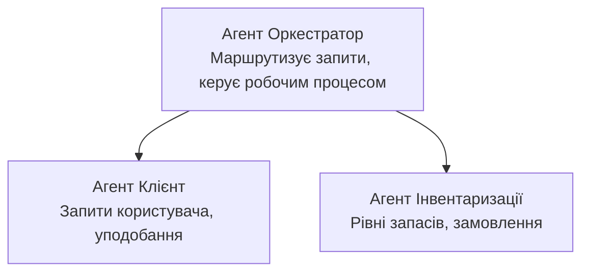

# Розділ 5: Рішення Multi-Agent AI

**📚 Курс**: [AZD для початківців](../../README.md) | **⏱️ Тривалість**: 2-3 години | **⭐ Складність**: Поглиблений

---

## Огляд

У цьому розділі розглядаються складні шаблони архітектури багатьох агентів, оркестрація агентів та готові до виробництва AI-розгортання для складних сценаріїв.

> Перевірено за допомогою `azd 1.25.6` у червні 2026 року.

## Навчальні цілі

Опрацювавши цей розділ, ви:
- Зрозумієте шаблони архітектури багатьох агентів
- Розгорнете координовані системи AI-агентів
- Реалізуєте спілкування між агентами
- Побудуєте готові до виробництва рішення з багатьма агентами

---

## 📚 Уроки

| # | Урок | Опис | Час |
|---|--------|-------------|------|
| 1 | [Основи Multi-Agent](multi-agent-basics.md) | Практичне заняття: розгорнути працездатний додаток багатьох агентів за допомогою `azd up` | 45 хв |
| 2 | [Шаблони координації](../chapter-06-pre-deployment/coordination-patterns.md) | Стратегії оркестрації агентів (продовження в Розділі 6) | 30 хв |
| 3 | [Розгортання ARM Template](../../examples/retail-multiagent-arm-template/README.md) | Приклад розгортання в один клік | 30 хв |

> **Почніть з Уроку 1.** Це єдиний повністю практичний урок, готовий до розгортання у цьому розділі. Урок 2 знаходиться в Розділі 6 (розділяється з плануванням перед розгортанням), а [Рішення Retail Multi-Agent](../../examples/retail-scenario.md) — це архітектурний шаблон — довідковий дизайн, а не шаблон для одноразової команди.

---

## 🚀 Швидкий старт

```bash
# Варіант 1: Розгортання з шаблону
azd init --template agent-openai-python-prompty
azd up

# Варіант 2: Розгортання з маніфесту агента (потрібно розширення azure.ai.agents)
azd extension install azure.ai.agents
azd ai agent init -m agent-manifest.yaml
azd up
```

> **Який підхід обрати?** Використовуйте `azd init --template`, щоб почати з робочого зразка. Використовуйте `azd ai agent init`, коли у вас є власний маніфест агента. Докладніше дивіться в [довіднику AZD AI CLI](../chapter-08-production/production-ai-practices.md#azd-ai-cli-commands-and-extensions).

---

## 🤖 Архітектура багатьох агентів



---

## 🎯 Представлене рішення: Retail Multi-Agent

[Рішення Retail Multi-Agent](../../examples/retail-scenario.md) демонструє:

- **Агент клієнта**: Обробляє взаємодію з користувачем та переваги
- **Агент інвентаря**: Керує запасами та обробкою замовлень
- **Оркестратор**: Координує роботу між агентами
- **Спільна пам'ять**: Керування контекстом між агентами

### Використані сервіси

| Сервіс | Призначення |
|---------|---------|
| Microsoft Foundry Models | Розуміння мови |
| Azure AI Search | Каталог продукції |
| Cosmos DB | Стан агентів та пам'ять |
| Container Apps | Хостинг агентів |
| Application Insights | Моніторинг |

---

## 🔗 Навігація

| Напрямок | Розділ |
|-----------|---------|
| **Попередній** | [Розділ 4: Інфраструктура](../chapter-04-infrastructure/README.md) |
| **Наступний** | [Розділ 6: Перед розгортанням](../chapter-06-pre-deployment/README.md) |

---

## 📖 Супутні ресурси

- [Посібник з AI агентів](../chapter-02-ai-development/agents.md)
- [Практики виробничого AI](../chapter-08-production/production-ai-practices.md)
- [Вирішення проблем AI](../chapter-07-troubleshooting/ai-troubleshooting.md)

---

<!-- CO-OP TRANSLATOR DISCLAIMER START -->
**Відмова від відповідальності**:
Цей документ було перекладено за допомогою сервісу штучного інтелекту для перекладу [Co-op Translator](https://github.com/Azure/co-op-translator). Хоча ми прагнемо до точності, будь ласка, майте на увазі, що автоматичні переклади можуть містити помилки або неточності. Оригінальний документ рідною мовою слід вважати авторитетним джерелом. Для критично важливої інформації рекомендується професійний людський переклад. Ми не несемо відповідальності за будь-які непорозуміння або неправильні тлумачення, що виникли внаслідок використання цього перекладу.
<!-- CO-OP TRANSLATOR DISCLAIMER END -->