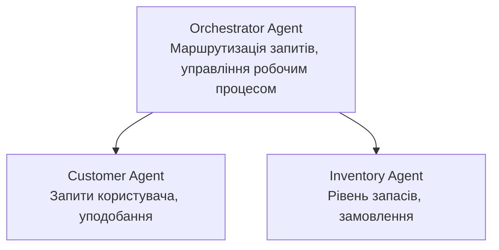

# Розділ 5: Багатоярусні рішення з ШІ

**📚 Курс**: [AZD для початківців](../../README.md) | **⏱️ Тривалість**: 2-3 години | **⭐ Складність**: Висока

---

## Огляд

У цьому розділі розглядаються просунуті архітектурні патерни багатоярусних агентів, оркестрація агентів і готові до виробництва рішення зі ШІ для складних сценаріїв.

## Навчальні цілі

Після проходження цього розділу ви зможете:
- Розуміти архітектурні патерни багатоярусних агентів
- Розгортати скоординовані системи агентів зі ШІ
- Реалізувати взаємодію між агентами
- Створювати готові до виробництва багатоярусні рішення

---

## 📚 Уроки

| # | Урок | Опис | Час |
|---|--------|-------------|------|
| 1 | [Роздрібне багатоярусне рішення](../../examples/retail-scenario.md) | Повний покроковий огляд реалізації | 90 хв |
| 2 | [Патерни координації](../chapter-06-pre-deployment/coordination-patterns.md) | Стратегії оркестрації агентів | 30 хв |
| 3 | [Розгортання ARM шаблону](../../examples/retail-multiagent-arm-template/README.md) | Розгортання в один клік | 30 хв |

---

## 🚀 Швидкий початок

```bash
# Варіант 1: Розгортання з шаблону
azd init --template agent-openai-python-prompty
azd up

# Варіант 2: Розгортання з маніфесту агента (потрібне розширення azure.ai.agents)
azd extension install azure.ai.agents
azd ai agent init -m agent-manifest.yaml
azd up
```

> **Який підхід обрати?** Використовуйте `azd init --template`, щоб розпочати з робочого прикладу. Використовуйте `azd ai agent init`, коли маєте власний маніфест агента. Деталі дивіться в [довіднику AZD AI CLI](../chapter-08-production/production-ai-practices.md#azd-ai-cli-commands-and-extensions).

---

## 🤖 Архітектура багатоярусних агентів


---

## 🎯 Представлене рішення: Роздрібний багатоярусний агент

[Роздрібне багатоярусне рішення](../../examples/retail-scenario.md) демонструє:

- **Агент клієнта**: Обробка взаємодії та переваг користувача
- **Агент інвентарю**: Управління запасами та обробкою замовлень
- **Оркестр**: Координація між агентами
- **Спільна пам’ять**: Управління контекстом між агентами

### Використані служби

| Служба | Призначення |
|---------|---------|
| Microsoft Foundry Models | Розуміння мови |
| Azure AI Search | Каталог продуктів |
| Cosmos DB | Стан і пам'ять агентів |
| Container Apps | Хостинг агентів |
| Application Insights | Моніторинг |

---

## 🔗 Навігація

| Напрямок | Розділ |
|-----------|---------|
| **Попередній** | [Розділ 4: Інфраструктура](../chapter-04-infrastructure/README.md) |
| **Наступний** | [Розділ 6: Передрозгортання](../chapter-06-pre-deployment/README.md) |

---

## 📖 Пов’язані ресурси

- [Посібник з агентів ШІ](../chapter-02-ai-development/agents.md)
- [Практики виробничого ШІ](../chapter-08-production/production-ai-practices.md)
- [Усунення неполадок ШІ](../chapter-07-troubleshooting/ai-troubleshooting.md)

---

<!-- CO-OP TRANSLATOR DISCLAIMER START -->
**Відмова від відповідальності**:  
Цей документ був перекладений за допомогою сервісу автоматичного перекладу [Co-op Translator](https://github.com/Azure/co-op-translator). Хоч ми і прагнемо до точності, будь ласка, майте на увазі, що автоматизований переклад може містити помилки чи неточності. Оригінальний документ рідною мовою слід вважати авторитетним джерелом. Для важливої інформації рекомендується звертатися до професійного людського перекладу. Ми не несемо відповідальності за будь-які непорозуміння чи неправильні тлумачення, що виникли в результаті використання цього перекладу.
<!-- CO-OP TRANSLATOR DISCLAIMER END -->