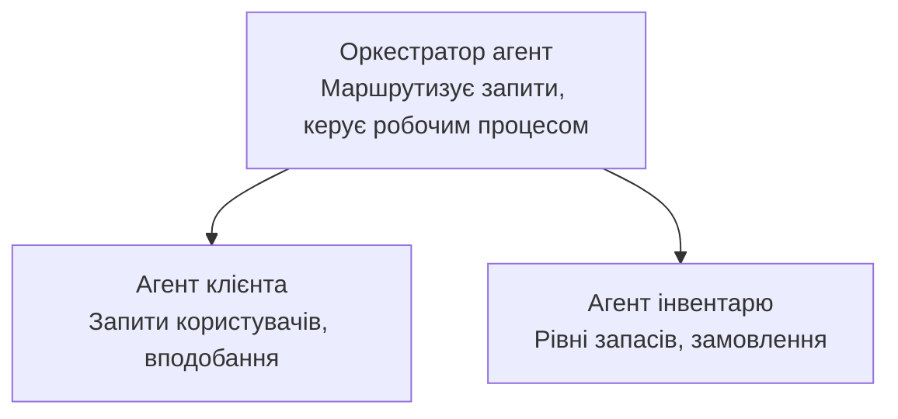

# Розділ 5: Багатоагентні рішення ШІ

**📚 Курс**: [AZD Для початківців](../../README.md) | **⏱️ Тривалість**: 2-3 години | **⭐ Складність**: Висока

---

## Огляд

У цьому розділі розглядаються просунуті патерни багатофункціональної архітектури, оркестрація агентів та розгортання ШІ, готового для продуктивного використання у складних сценаріях.

> Перевірено за `azd 1.27.1` у липні 2026 року.

## Цілі навчання

Виконавши цей розділ, ви:
- Зрозумієте патерни багатоагентної архітектури
- Розгорнете скоординовані системи агентів ШІ
- Реалізуєте зв’язок між агентами
- Побудуєте багатоагентні рішення, готові до продуктивного використання

---

## 📚 Уроки

| # | Урок | Опис | Час |
|---|--------|-------------|------|
| 1 | [Основи багатоагентності](multi-agent-basics.md) | Практично: розгорнути працюючий багатоагентний додаток за допомогою `azd up` | 45 хв |
| 2 | [Патерни координації](../chapter-06-pre-deployment/coordination-patterns.md) | Стратегії оркестрації агентів (продовження у розділі 6) | 30 хв |
| 3 | [Розгортання за допомогою ARM Template](../../examples/retail-multiagent-arm-template/README.md) | Приклад розгортання в один клік | 30 хв |

> **Починайте з уроку 1.** Це єдиний повністю практичний урок з можливістю розгортання в цьому розділі. Урок 2 знаходиться у розділі 6 (він спільний для планування перед розгортанням), а [Роздрібне багатоагентне рішення](../../examples/retail-scenario.md) є архітектурним шаблоном — проектною довідкою, а не шаблоном для одноразової команди.

---

## 🚀 Швидкий старт

```bash
# Варіант 1: Розгортання з шаблону
azd init --template agent-openai-python-prompty
azd up

# Варіант 2: Розгортання з маніфесту агента (потрібне розширення azure.ai.agents)
azd extension install azure.ai.agents
azd ai agent init -m agent-manifest.yaml
azd up
```

> **Який підхід?** Використовуйте `azd init --template` щоб почати з робочого зразка. Використовуйте `azd ai agent init`, якщо у вас є власний маніфест агента. Детальніше дивіться у [довідці AZD AI CLI](../chapter-08-production/production-ai-practices.md#azd-ai-cli-commands-and-extensions).

---

## 🤖 Багатоагентна архітектура



---

## 🎯 Відображене рішення: Роздрібний багатоагентний

[Роздрібне багатоагентне рішення](../../examples/retail-scenario.md) демонструє:

- **Агент клієнта**: обробляє взаємодію з користувачем і вподобання
- **Агент запасів**: керує запасами та обробкою замовлень
- **Оркестратор**: координує між агентами
- **Спільна пам’ять**: управління контекстом між агентами

### Використані сервіси

| Сервіс | Призначення |
|---------|---------|
| Microsoft Foundry Models | Розуміння мови |
| Azure AI Search | Каталог продукції |
| Cosmos DB | Стан і пам’ять агента |
| Container Apps | Хостинг агента |
| Application Insights | Моніторинг |

---

## 🔗 Навігація

| Напрямок | Розділ |
|-----------|---------|
| **Попередній** | [Розділ 4: Інфраструктура](../chapter-04-infrastructure/README.md) |
| **Наступний** | [Розділ 6: Перед розгортанням](../chapter-06-pre-deployment/README.md) |

---

## 📖 Пов’язані ресурси

- [Посібник з агентів ШІ](../chapter-02-ai-development/agents.md)
- [Практики продуктивного використання ШІ](../chapter-08-production/production-ai-practices.md)
- [Усунення несправностей ШІ](../chapter-07-troubleshooting/ai-troubleshooting.md)

---

<!-- CO-OP TRANSLATOR DISCLAIMER START -->
**Відмова від відповідальності**:
Цей документ було перекладено за допомогою сервісу штучного інтелекту для перекладу [Co-op Translator](https://github.com/Azure/co-op-translator). Хоча ми прагнемо до точності, будь ласка, майте на увазі, що автоматичні переклади можуть містити помилки або неточності. Оригінальний документ рідною мовою слід вважати авторитетним джерелом. Для критично важливої інформації рекомендується професійний людський переклад. Ми не несемо відповідальності за будь-які непорозуміння або неправильні тлумачення, що виникли внаслідок використання цього перекладу.
<!-- CO-OP TRANSLATOR DISCLAIMER END -->