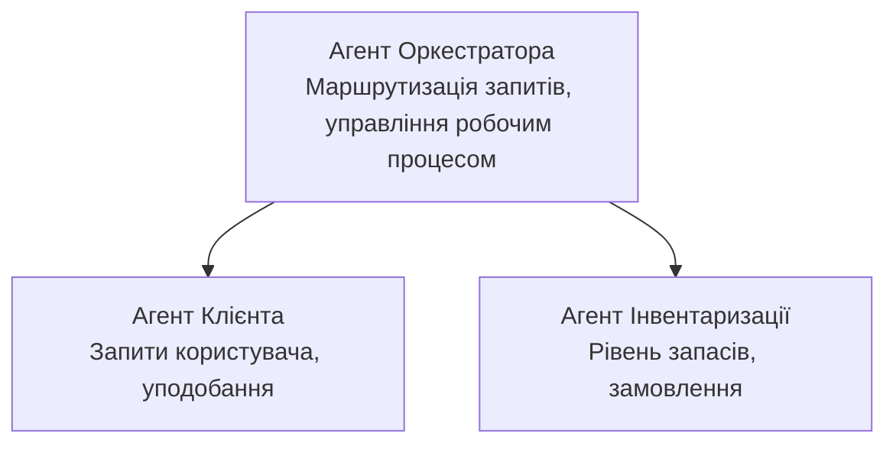

# Розділ 5: Багатоагентні AI-рішення

**📚 Курс**: [AZD For Beginners](../../README.md) | **⏱️ Тривалість**: 2-3 години | **⭐ Складність**: Високий рівень

---

## Огляд

У цьому розділі розглядаються розширені патерни архітектури багатоагентних систем, оркестрація агентів та готові до виробництва AI-рішення для складних сценаріїв.

> Перевірено на `azd 1.23.12` у березні 2026 року.

## Цілі навчання

Після проходження цього розділу ви зможете:
- Розуміти патерни архітектури багатоагентних систем
- Розгортати координовані системи AI-агентів
- Реалізувати взаємодію між агентами
- Створювати готові до виробництва багатоагентні рішення

---

## 📚 Уроки

| # | Урок | Опис | Час |
|---|--------|-------------|------|
| 1 | [Роздрібне багатоагентне рішення](../../examples/retail-scenario.md) | Повний покроковий розбір реалізації | 90 хв |
| 2 | [Патерни координації](../chapter-06-pre-deployment/coordination-patterns.md) | Стратегії оркестрації агентів | 30 хв |
| 3 | [Розгортання за допомогою ARM шаблону](../../examples/retail-multiagent-arm-template/README.md) | Розгортання в один клік | 30 хв |

---

## 🚀 Швидкий старт

```bash
# Варіант 1: Розгорнути з шаблону
azd init --template agent-openai-python-prompty
azd up

# Варіант 2: Розгорнути з маніфесту агента (потребує розширення azure.ai.agents)
azd extension install azure.ai.agents
azd ai agent init -m agent-manifest.yaml
azd up
```

> **Який підхід обрати?** Використовуйте `azd init --template` для початку з робочого прикладу. Використовуйте `azd ai agent init`, коли у вас є власний маніфест агента. Повний опис дивіться у [довідці AZD AI CLI](../chapter-08-production/production-ai-practices.md#azd-ai-cli-commands-and-extensions).

---

## 🤖 Архітектура багатоагентних систем


---

## 🎯 Представлене рішення: Роздрібне багатоагентне рішення

[Роздрібне багатоагентне рішення](../../examples/retail-scenario.md) демонструє:

- **Агент клієнта**: Обробляє взаємодії з користувачем та його вподобання
- **Агент інвентаризації**: Керує запасами та обробкою замовлень
- **Оркестратор**: Координує роботу між агентами
- **Спільна пам’ять**: Управління контекстом між агентами

### Використані сервіси

| Сервіс | Призначення |
|---------|---------|
| Microsoft Foundry Models | Розуміння мови |
| Azure AI Search | Каталог продуктів |
| Cosmos DB | Стан та пам’ять агентів |
| Container Apps | Розміщення агентів |
| Application Insights | Моніторинг |

---

## 🔗 Навігація

| Напрямок | Розділ |
|-----------|---------|
| **Попередній** | [Розділ 4: Інфраструктура](../chapter-04-infrastructure/README.md) |
| **Наступний** | [Розділ 6: Перед розгортанням](../chapter-06-pre-deployment/README.md) |

---

## 📖 Пов’язані ресурси

- [Посібник з AI агентів](../chapter-02-ai-development/agents.md)
- [Практики виробничого AI](../chapter-08-production/production-ai-practices.md)
- [Вирішення проблем AI](../chapter-07-troubleshooting/ai-troubleshooting.md)

---

<!-- CO-OP TRANSLATOR DISCLAIMER START -->
**Відмова від відповідальності**:  
Цей документ було перекладено за допомогою сервісу автоматичного перекладу [Co-op Translator](https://github.com/Azure/co-op-translator). Хоча ми прагнемо до точності, будь ласка, враховуйте, що автоматичні переклади можуть містити помилки чи неточності. Оригінальний документ рідною мовою слід вважати авторитетним джерелом. Для критичної інформації рекомендовано звертатися до професійного людського перекладу. Ми не несемо відповідальності за будь-які непорозуміння чи неправильні тлумачення, що виникли внаслідок використання цього перекладу.
<!-- CO-OP TRANSLATOR DISCLAIMER END -->