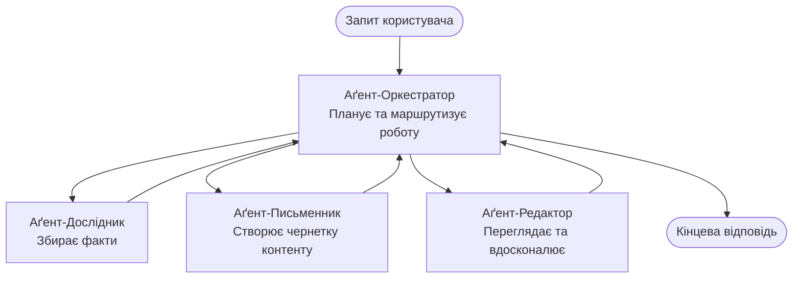

# Основи багатокористувацьких агентів - Розгорніть вашу першу координовану AI-систему

**Навігація по розділах:**
- **📚 Головна сторінка курсу**: [AZD Для початківців](../../README.md)
- **📖 Поточний розділ**: Розділ 5 - Багатокористувацькі AI-рішення
- **⬅️ Попередній**: [Розділ 4: Інфраструктура](../chapter-04-infrastructure/README.md)
- **➡️ Наступний**: [Патерни координації](../chapter-06-pre-deployment/coordination-patterns.md)

> Перевірено на `azd 1.27.1` у липні 2026 року.

## Вступ

У попередніх розділах ви розгорнули одну програму—а в Розділі 2 ви розгорнули одного AI-агента. Цей урок робить наступний крок: розгортання **багатокористувацької системи**, в якій кілька спеціалізованих агентів працюють разом, щоб вирішити задачу, яку жоден агент не зміг би ефективно виконати самостійно.

Гарна новина для початківців: **не потрібні нові команди.** Багатокористувацьке рішення — це все ще проєкт azd. Ви будете `azd init`, `azd up`, тестувати і `azd down` — саме той робочий процес, який ви вже знаєте. Змінюється лише *форма* програми всередині.

## Цілі навчання

До кінця цього уроку ви:
- Зрозумієте, що означає "багатокористувацький" та коли це виправдано додатковою складністю
- Впізнаєте загальні ролі в багатокористувацькій системі (оркестратор + спеціалісти)
- Розгорнете реальний робочий шаблон багатокористувацької системи командою `azd up`
- Зрозумієте ресурси Azure, що підтримують багатокористувацький додаток
- Дізнаєтесь, як безпечно перевіряти, налаштовувати та знімати рішення

## Результати навчання

Після завершення уроку ви зможете:
- Пояснити різницю між одним агентом і багатокористувацькою системою
- Обрати між одним агентом з інструментами та справжнім багатокористувацьким дизайном
- Розгорнути і протестувати багатокористувацький шаблон повністю за допомогою azd
- Визначити, де запускається кожен агент і як вони спілкуються
- Очистити всі ресурси, щоб уникнути подальших витрат

---

## Що таке багатокористувацька система?

Один AI-агент — це одна модель із набором інструкцій і (за потреби) декількома інструментами. Це добре працює для конкретних завдань. Але коли завдання зростає — дослідження, потім написання, потім редагування, потім перевірка фактів — розміщення всього в одному запиті робить агента повільнішим, менш надійним і важчим для налагодження.

**Багатокористувацька система** розділяє роботу на спеціалістів, кожен із яких добре виконує одну задачу, координованих оркестратором:



### Дві ролі, які ви завжди побачите

| Роль | Завдання | Приклад |
|------|-----|---------|
| **Оркестратор** | Вирішує *що буде далі* і маршрутизує роботу між агентами | "Спочатку дослідження, потім написання, потім редагування" |
| **Спеціаліст** | Виконує одну конкретну задачу і повертає результат | "дослідник", який лише збирає факти |

### Чи справді вам потрібні кілька агентів?

Починайте з простого. Вибирайте багатокористувацьку систему **тільки** коли виконується хоча б одна з умов:

- ✅ Завдання має **чіткі етапи**, які виграють від різних інструкцій (дослідження проти написання проти перевірки)
- ✅ Ви хочете, щоб спеціалісти працювали **паралельно** для економії часу
- ✅ Різні кроки потребують **різних інструментів або джерел даних**
- ✅ Кожен крок має бути **незалежно тестований і налагоджуваний**

Якщо ваше завдання — це одне питання і відповідь або простий виклик інструменту, **один агент з інструментами** (Розділ 2) простіший, дешевший та легший у користуванні.

> **Порада для початківців:** "Більше агентів" не означає "краще". Кожен агент додає затримку, вартість і новий компонент для моніторингу. Додавайте агентів лише тоді, коли проблема чітко розділяється на частини.

---

## Два способи створення багатокористувацької системи на Azure

| Підхід | Що це таке | Найкраще для |
|----------|-----------|----------|
| **Один агент + інструменти** | Один агент Foundry, що викликає функції/інструменти | Простих робочих процесів, початківців |
| **Кілька координованих агентів** | Кілька агентів з оркестратором | Чіткі етапи, паралельна робота, спеціалізація |

Цей урок сфокусований на другому підході з використанням **готового шаблону**, щоб ви могли побачити реальну багатокористувацьку систему в роботі, перш ніж створювати власну.

---

## Практика: Розгорніть робочий багатокористувацький додаток

Ми розгорнемо **Contoso Creative Writer**, офіційний приклад Azure, який використовує кілька агентів (дослідник, письменник, редактор), що координуються для створення статті. Це чудовий перший багатокористувацький додаток, оскільки ролі легко зрозуміти.

### Крок 1: Ініціалізуйте шаблон

```bash
# Створіть робочу папку
mkdir creative-writer && cd creative-writer

# Ініціалізуйте з офіційного шаблону мультиагентів
azd init --template contoso-creative-writer
```

> Завжди можете переглянути інші багатокористувацькі шаблони у [галереї Awesome AZD AI](https://azure.github.io/awesome-azd/?tags=ai). Інші варіанти для початківців включають `get-started-with-ai-agents` та `azure-ai-travel-agents`.

### Крок 2: Аутентифікація

```bash
# Потрібно для робочих процесів azd
azd auth login
```

### Крок 3: Створення середовища

```bash
azd env new dev
```

### Крок 4: Перегляд і розгортання

```bash
# Перегляньте, що буде створено, перш ніж щось витрачати (рекомендується)
azd provision --preview

# Забезпечте інфраструктуру та розгорніть усіх агентів за один крок
azd up
```

`azd up` попросить підписку і регіон, потім забезпечить ресурси Azure і розгорне додаток. Розгортання AI може займати більше часу, ніж простий веб-додаток — якщо ви розгортаєте більші моделі, можна подовжити таймаут розгортання:

```bash
azd deploy --timeout 1800
```

> **Увага на вартість та пропускну здатність:** Багатокористувацькі додатки розгортають AI-моделі, що споживають квоти і створюють витрати. Якщо `azd up` не проходить через квоту моделей, дивіться [Розділ усунення несправностей AI](../chapter-07-troubleshooting/ai-troubleshooting.md) для виправлення регіону і квоти, та Розділ 6 [Планування потужності](../chapter-06-pre-deployment/capacity-planning.md).

---

## Розуміння розгорнутого

Типовий багатокористувацький додаток, як цей, створює набір ресурсів Azure, що безпосередньо відповідають за ролі на діаграмі вище:

| Ресурс | Чому він потрібен |
|----------|----------------|
| **Microsoft Foundry / Моделі** | Хостить мовні моделі, які використовує кожен агент |
| **Azure AI Search** | Дає агенту-досліднику заземлені дані для пошуку |
| **Container Apps** (або App Service) | Розміщує код оркестратора і агентів |
| **Cosmos DB** (в деяких прикладах) | Зберігає спільний стан/пам’ять, що передається між агентами |
| **Application Insights** | Відстежує запити *між* агентами для налагодження процесу |

### Як агенти спілкуються між собою

У більшості azd прикладів багатокористувацьких систем **оркестратор запускається у вашому коді додатку** (наприклад, з використанням фреймворку Semantic Kernel або Microsoft Agent Framework). Оркестратор викликає по черзі кожного спеціаліста, передає результати і збирає фінальну відповідь. Агенти обмінюються контекстом через:

- **Виклики функцій/інструментів** — оркестратор викликає спеціаліста та отримує відповідь
- **Спільна пам’ять** — база даних (часто Cosmos DB) зберігає стан для читання обома агентами
- **Повідомлення/події** — для слабшого зв’язку агенти спілкуються через чергу або Service Bus

> **Чому це важливо при налагодженні:** оскільки кожен крок окремий, Application Insights показує, який саме агент був повільним або зазнав помилки. Це одна з головних причин розділяти роботу між агентами.

---

## Перевірка розгортання

Переконайтесь, що система справді працює, перш ніж рухатися далі:

```bash
# Показати розгорнуті кінцеві точки
azd show

# Відкрити панель моніторингу додатку
azd monitor

# Відстежувати логи, якщо щось виглядає підозріло
azd monitor --logs
```

Потім відкрийте URL додатка, отриманий з `azd show`, і спробуйте запит, який задіює всіх агентів (для Creative Writer — попросіть написати коротку статтю на тему). В Application Insights **transaction search** ви маєте побачити, як запит розгалужується через кроки дослідника, письменника і редактора.

**Критерії успіху:**
- ✅ `azd show` показує доступний кінцевий пункт
- ✅ Запит дає результат, що явно проходить через кілька етапів
- ✅ Application Insights показує трасування для більш ніж одного кроку агента

---

## Налаштування: Додайте або відрегулюйте агента

Оскільки кожен агент — це лише інструкції плюс інструменти, налаштування є досить простим:

1. **Знайдіть визначення агентів** в шаблоні (часто це набір файлів у `prompts/`, `agents/` або `*.prompty`).
2. **Налаштуйте інструкції агента** — наприклад, скажіть редактору застосовувати конкретний тон або обсяг тексту.
3. **Пере розгорніть лише код** (інфраструктура не змінюється):

   ```bash
   azd deploy
   ```

Щоб рухатися далі і створювати агентів зі свого *власного* маніфесту, використовуйте розширення агента і його повний життєвий цикл:

```bash
azd extension install azure.ai.agents
azd ai agent init -m agent-manifest.yaml
azd up
azd ai agent invoke      # тест, з часом відповіді
```

Дивіться [Розділ 2: Агенти](../chapter-02-ai-development/agents.md) та [довідник AZD AI CLI](../chapter-08-production/production-ai-practices.md#azd-ai-cli-commands-and-extensions) для повного життєвого циклу агента (`invoke`, `eval generate`, `optimize`, `delete`).

---

## Очистка

Багатокористувацькі додатки запускають кілька платних сервісів. Знімайте все, коли закінчите:

```bash
azd down --force --purge
```

Прапорець `--purge` також видаляє ресурси AI зі статусом soft-deleted (наприклад, облікові записи Foundry/Azure AI Services), щоб вони не блокували подальше розгортання і не створювали витрат.

---

## Примітка про виробничі багатокористувацькі системи

[Рішення для роздрібної торгівлі Multi-Agent](../../examples/retail-scenario.md) у цьому репозиторії — це **архітектурний шаблон**, а не набір команд для розгортання — воно демонструє, як може бути побудована виробнича роздрібна система (і вказує, що повна реалізація — це значне завдання). Використовуйте його як довідковий проєкт *після* того, як розгорнули робочий приклад звідси. Про виробничі аспекти (надійність, вартість, моніторинг, управління) дивіться далі у [Розділі 8: Виробничі AI-практики](../chapter-08-production/production-ai-practices.md).

---

## Підсумок

- Багатокористувацька система розподіляє роботу між спеціалістами, координованих оркестратором.
- Використовуйте її лише тоді, коли завдання має чіткі етапи, паралелізм або різні інструменти на крок — інакше краще один агент.
- Робочий процес azd не змінюється: `azd init` → `azd up` → тест → `azd down`.
- Реальний шаблон, як `contoso-creative-writer`, дає змогу сьогодні побачити і налаштувати робочу багатокористувацьку систему.
- Трасування в Application Insights між агентами — одна з найбільших практичних переваг багатокористувацького дизайну.

---

## 🔗 Навігація

| Напрямок | Урок |
|-----------|--------|
| **Попередній** | [Розділ 4: Інфраструктура](../chapter-04-infrastructure/README.md) |
| **Наступний** | [Патерни координації](../chapter-06-pre-deployment/coordination-patterns.md) |

## 📖 Пов’язані ресурси

- [Посібник з AI-агентів](../chapter-02-ai-development/agents.md)
- [Патерни координації](../chapter-06-pre-deployment/coordination-patterns.md)
- [Виробничі AI-практики](../chapter-08-production/production-ai-practices.md)
- [Усунення несправностей AI](../chapter-07-troubleshooting/ai-troubleshooting.md)

---

<!-- CO-OP TRANSLATOR DISCLAIMER START -->
**Відмова від відповідальності**:
Цей документ було перекладено за допомогою сервісу штучного інтелекту для перекладу [Co-op Translator](https://github.com/Azure/co-op-translator). Хоча ми прагнемо до точності, будь ласка, майте на увазі, що автоматичні переклади можуть містити помилки або неточності. Оригінальний документ рідною мовою слід вважати авторитетним джерелом. Для критично важливої інформації рекомендується професійний людський переклад. Ми не несемо відповідальності за будь-які непорозуміння або неправильні тлумачення, що виникли внаслідок використання цього перекладу.
<!-- CO-OP TRANSLATOR DISCLAIMER END -->