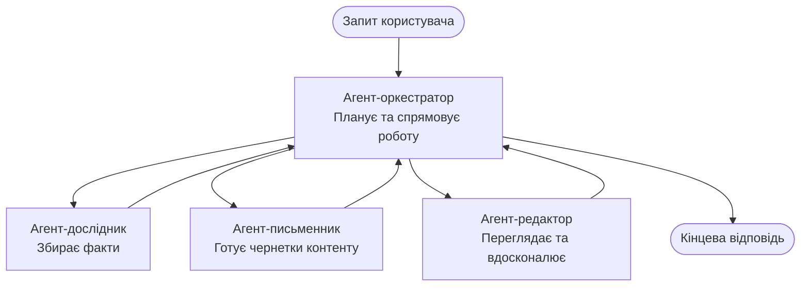

# Multi-Agent Basics - Deploy Your First Coordinated AI System

**Chapter Navigation:**
- **📚 Course Home**: [AZD For Beginners](../../README.md)
- **📖 Current Chapter**: Chapter 5 - Multi-Agent AI Solutions
- **⬅️ Previous**: [Chapter 4: Infrastructure](../chapter-04-infrastructure/README.md)
- **➡️ Next**: [Coordination Patterns](../chapter-06-pre-deployment/coordination-patterns.md)

> Перевірено з `azd 1.25.6` у червні 2026 року.

## Introduction

У попередніх розділах ви розгортали одну програму — а в Розділі 2 ви розгорнули одного AI-агента. У цьому уроці ми робимо наступний крок: розгортання **багатоагентної системи**, де кілька спеціалізованих агентів працюють разом, щоб вирішити задачу, яку жоден окремий агент не зміг би виконати добре самостійно.

Гарна новина для початківців: **не потрібні нові команди.** Багатоагентне рішення все ще є проєктом azd. Ви все так само `azd init`, `azd up`, тестуєте і `azd down` — точно той робочий процес, який ви вже знаєте. Змінюється лише *внутрішня структура* додатка.

## Learning Goals

До кінця цього уроку ви:
- Зрозумієте, що означає «багатоагентний» і коли вартий додаткової складності
- Впізнаєте поширені ролі в багатоагентній системі (оркестратор + спеціалісти)
- Розгорнете реальний робочий шаблон багатоагентної системи за допомогою `azd up`
- Зрозумієте, які Azure-ресурси підкладаються під багатоагентний додаток
- Дізнаєтеся, як перевірити, налаштувати та коректно видалити рішення

## Learning Outcomes

Після завершення цього уроку ви зможете:
- Пояснити різницю між одним агентом і багатоагентною системою
- Вибрати між одиночним агентом з інструментами та справжнім багатоагентним дизайном
- Розгорнути та протестувати шаблон багатоагентної системи від початку до кінця за допомогою azd
- Визначити, де запускається кожен агент і як вони взаємодіють
- Видалити всі ресурси, щоб уникнути подальших витрат

---

## What Is a Multi-Agent System?

Один AI-агент — це одна модель з набором інструкцій і (за потреби) деякими інструментами. Це добре працює для сфокусованих завдань. Але коли завдання зростає — дослідження, потім написання, потім редагування, потім перевірка фактів — втиснення всього в один промпт робить агента повільнішим, менш надійним і складнішим для відлагодження.

Багатоагентна система розбиває роботу на спеціалістів, кожен з яких добре виконує свою задачу, а всі працюють під координацією оркестратора:



### The two roles you'll always see

| Role | Job | Example |
|------|-----|---------|
| **Orchestrator** | Decides *what happens next* and routes work between agents | "First research, then write, then edit" |
| **Specialist** | Does one focused job and returns a result | A "researcher" that only gathers facts |

### Do you actually need multiple agents?

Почніть з простого. У звертайтеся до багатоагентного підходу **тільки** коли виконується одна з цих умов:

- ✅ Завдання має **чіткі етапи**, яким вигідно різні інструкції (дослідження проти написання проти перевірки)
- ✅ Ви хочете, щоб спеціалісти працювали **паралельно**, щоб зекономити час
- ✅ Різні кроки потребують **різних інструментів або джерел даних**
- ✅ Вам потрібно, щоб кожен крок був **незалежно тестованим і відлагоджуваним**

Якщо ваше завдання — одиночне питання-відповідь або простий виклик інструмента, **один агент з інструментами** (Розділ 2) простіший, дешевший і легший в експлуатації.

> **Порада для початківців:** «Більше агентів» не означає «краще». Кожен агент додає затримку, вартість і новий об’єкт для моніторингу. Додавайте агентів лише коли проблема явно розпадається на частини.

---

## Two Ways to Build Multi-Agent on Azure

| Approach | What it is | Best for |
|----------|-----------|----------|
| **Single agent + tools** | One Foundry agent that calls functions/tools | Simple workflows, getting started |
| **Multiple coordinated agents** | Several agents with an orchestrator | Distinct stages, parallel work, specialization |

Цей урок зосереджений на другому підході з використанням **готового шаблону**, щоб ви могли побачити реальну багатоагентну систему в роботі перед тим, як будувати власну.

---

## Hands-On: Deploy a Working Multi-Agent App

Ми розгорнемо **Contoso Creative Writer**, офіційний приклад Azure, який використовує кілька агентів (дослідник, письменник, редактор), скоординованих для створення статті. Це чудовий перший багатоагентний додаток, оскільки ролі легко зрозуміти.

### Step 1: Initialize the template

```bash
# Створити робочу папку
mkdir creative-writer && cd creative-writer

# Ініціалізувати з офіційного мультиагентного шаблону
azd init --template contoso-creative-writer
```

> Переглядайте більше шаблонів багатоагентних рішень у будь-який час в [Awesome AZD AI gallery](https://azure.github.io/awesome-azd/?tags=ai). Інші дружні для початківців варіанти включають `get-started-with-ai-agents` та `azure-ai-travel-agents`.

### Step 2: Authenticate

```bash
# Необхідно для робочих процесів azd
azd auth login
```

### Step 3: Create an environment

```bash
azd env new dev
```

### Step 4: Preview, then deploy

```bash
# Подивіться, що буде створено, перш ніж щось витрачати (рекомендується)
azd provision --preview

# Підготуйте інфраструктуру та розгорніть усіх агентів за один крок
azd up
```

`azd up` запропонує вибрати підписку та регіон, потім створить ресурси Azure і розгорне додаток. Розгортання AI може займати довше, ніж простий вебдодаток — якщо ви розгортаєте більші моделі, можна продовжити таймаут розгортання:

```bash
azd deploy --timeout 1800
```

> **Увага щодо витрат і потужностей:** Багатоагентні додатки розгортають AI-моделі, які споживають квоти та генерують витрати. Якщо `azd up` не вдається через квоти моделі, див. [AI Troubleshooting](../chapter-07-troubleshooting/ai-troubleshooting.md) для виправлення регіону та квот, а також Розділ 6 [Capacity Planning](../chapter-06-pre-deployment/capacity-planning.md).

---

## Understanding What You Deployed

Типовий багатоагентний додаток, як цей, створює набір ресурсів Azure, які прямо відображають відповідальності на діаграмі вище:

| Resource | Why it's there |
|----------|----------------|
| **Microsoft Foundry / Models** | Hosts the language models each agent uses |
| **Azure AI Search** | Gives the researcher agent grounded data to search |
| **Container Apps** (or App Service) | Hosts the orchestrator and agent code |
| **Cosmos DB** (in some samples) | Stores shared state/memory passed between agents |
| **Application Insights** | Traces requests *across* agents so you can debug the flow |

### How the agents talk to each other

У більшості azd зразків багатоагентних додатків **оркестратор запускається в коді вашого додатка** (наприклад, із використанням фреймворку на кшталт Semantic Kernel або Microsoft Agent Framework). Оркестратор викликає кожного спеціаліста по черзі, передає результати і збирає фінальну відповідь. Агенти діляться контекстом через:

- **Function/tool calls** — оркестратор викликає спеціаліста і отримує результат назад
- **Shared memory** — база даних (часто Cosmos DB) зберігає стан, який можуть читати обидва агенти
- **Messages/events** — для менш жорсткого зв’язування агенти спілкуються через чергу або Service Bus

> **Чому це важливо для відлагодження:** оскільки кожен крок окремий, Application Insights показує, *який* агент був повільним або зазнав помилки. Це важлива причина розподіляти роботу між агентами.

---

## Verify the Deployment

Підтвердіть, що система дійсно працює, перш ніж рухатися далі:

```bash
# Показати розгорнуті кінцеві точки
azd show

# Відкрити панель моніторингу додатка
azd monitor

# Слідкувати за логами, якщо щось виглядає не так
azd monitor --logs
```

Потім відкрийте URL додатка з `azd show` і спробуйте запит, що задіює всіх агентів (для Creative Writer — попросіть написати коротку статтю на тему). У розділі Application Insights **transaction search** ви повинні побачити, як запит розгалужується через кроки дослідника, письменника та редактора.

**Критерії успіху:**
- ✅ `azd show` показує доступну кінцеву точку
- ✅ Запит дає результат, який явно пройшов через кілька етапів
- ✅ Application Insights показує трасування для більше ніж одного кроку агента

---

## Customize: Add or Adjust an Agent

Оскільки кожен агент — це просто інструкції плюс інструменти, налаштування доступне:

1. **Знайдіть визначення агентів** у шаблоні (зазвичай це файли `prompts/`, `agents/` або набір `*.prompty`).
2. **Налаштуйте інструкції агента** — наприклад, скажіть агенту-редактору дотримуватися певного тону або обмеження за кількістю слів.
3. **Пере-розгорніть лише код** (інфраструктура незмінна):

   ```bash
   azd deploy
   ```

Щоб рухатися далі і створювати агентів зі свого *власного* маніфесту, використовуйте розширення агента та його повний життєвий цикл:

```bash
azd extension install azure.ai.agents
azd ai agent init -m agent-manifest.yaml
azd up
azd ai agent invoke      # тест, з часом відповіді
```

Див. [Chapter 2: Agents](../chapter-02-ai-development/agents.md) і [AZD AI CLI reference](../chapter-08-production/production-ai-practices.md#azd-ai-cli-commands-and-extensions) для повного циклу життя агента (`invoke`, `eval generate`, `optimize`, `delete`).

---

## Clean Up

Багатоагентні додатки запускають кілька платних сервісів. Видаліть усе, коли закінчите:

```bash
azd down --force --purge
```

Прапорець `--purge` також видаляє ресурси AI, що були пом’якшено видалені (наприклад, Foundry/Azure AI Services accounts), щоб вони не блокували майбутнє повторне розгортання або не продовжували приносити витрати.

---

## A Note on Production Multi-Agent Systems

The [Retail Multi-Agent Solution](../../examples/retail-scenario.md) in this repo is an **architecture blueprint**, not a one-command template—it documents how a production retail system *would* be built (and is explicit that a full build is a substantial effort). Use it as a design reference *after* you've deployed a working sample here. For production concerns (resilience, cost, monitoring, governance), continue to [Chapter 8: Production AI Practices](../chapter-08-production/production-ai-practices.md).

---

## Summary

- A multi-agent system splits work across specialists coordinated by an orchestrator.
- Use it only when the task has distinct stages, parallelism, or different tools per step—otherwise prefer a single agent.
- The azd workflow is unchanged: `azd init` → `azd up` → test → `azd down`.
- A real template like `contoso-creative-writer` lets you see and customize a working multi-agent app today.
- Application Insights tracing across agents is one of the biggest practical benefits of the multi-agent design.

---

## 🔗 Navigation

| Direction | Lesson |
|-----------|--------|
| **Previous** | [Chapter 4: Infrastructure](../chapter-04-infrastructure/README.md) |
| **Next** | [Coordination Patterns](../chapter-06-pre-deployment/coordination-patterns.md) |

## 📖 Related Resources

- [AI Agents Guide](../chapter-02-ai-development/agents.md)
- [Coordination Patterns](../chapter-06-pre-deployment/coordination-patterns.md)
- [Production AI Practices](../chapter-08-production/production-ai-practices.md)
- [AI Troubleshooting](../chapter-07-troubleshooting/ai-troubleshooting.md)

---

<!-- CO-OP TRANSLATOR DISCLAIMER START -->
**Відмова від відповідальності**:
Цей документ було перекладено за допомогою сервісу штучного інтелекту для перекладу [Co-op Translator](https://github.com/Azure/co-op-translator). Хоча ми прагнемо до точності, будь ласка, майте на увазі, що автоматичні переклади можуть містити помилки або неточності. Оригінальний документ рідною мовою слід вважати авторитетним джерелом. Для критично важливої інформації рекомендується професійний людський переклад. Ми не несемо відповідальності за будь-які непорозуміння або неправильні тлумачення, що виникли внаслідок використання цього перекладу.
<!-- CO-OP TRANSLATOR DISCLAIMER END -->