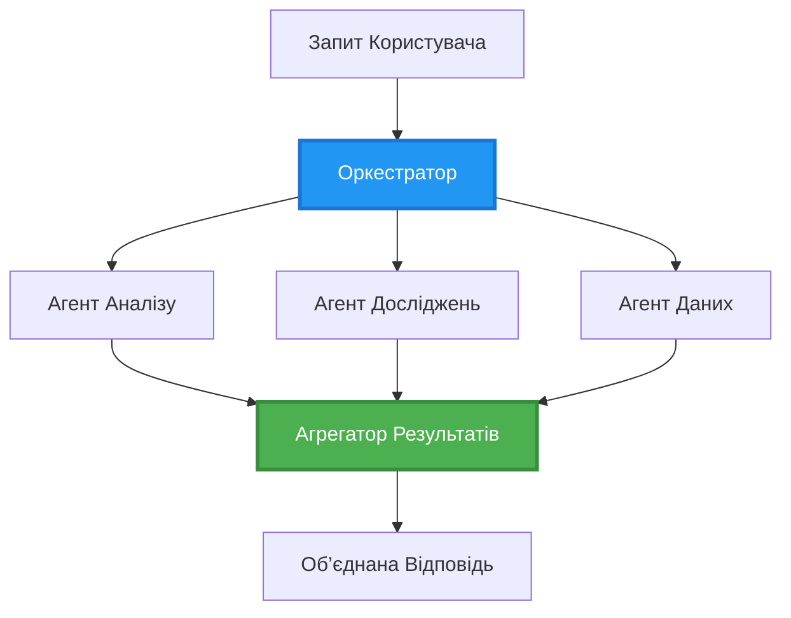
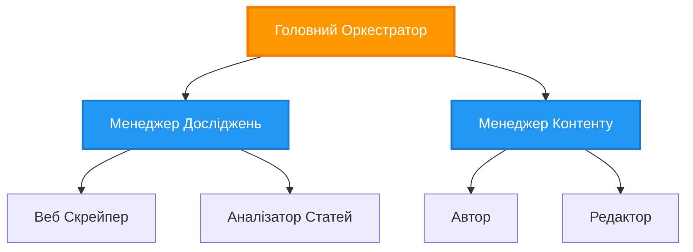
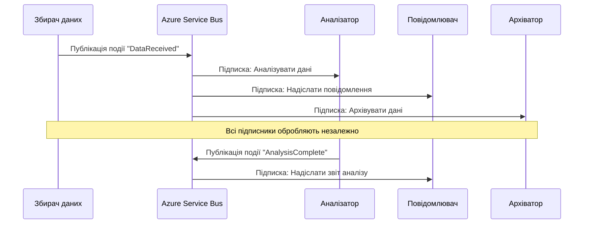
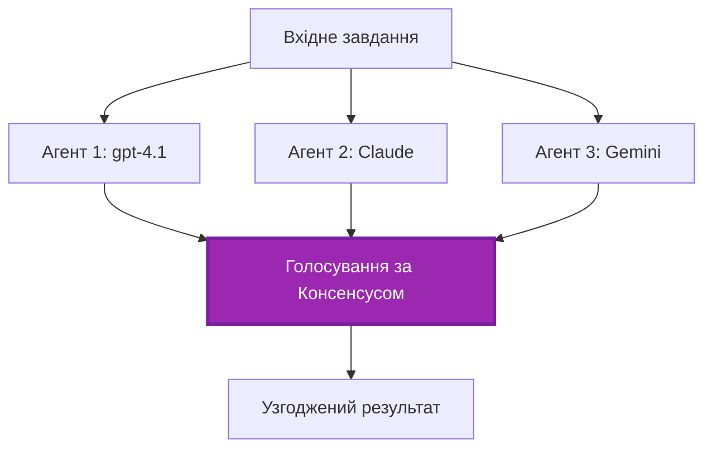
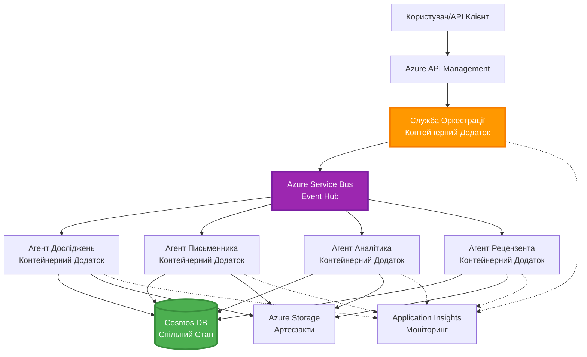

# Моделі координації багатьох агентів

⏱️ **Орієнтовний час**: 60-75 хвилин | 💰 **Орієнтовна вартість**: ~$100-300/місяць | ⭐ **Складність**: Висока

**📚 Навчальний шлях:**
- ← Попередній: [Планування потужностей](capacity-planning.md) - стратегії масштабування та підбір ресурсів
- 🎯 **Ви тут**: Моделі координації багатьох агентів (Оркестрація, комунікація, керування станом)
- → Наступний: [Вибір SKU](sku-selection.md) - підбір потрібних сервісів Azure
- 🏠 [Головна сторінка курсу](../../README.md)

---

## Чого Ви навчитесь

Після завершення цього уроку ви:
- Зрозумієте моделі **архітектури багатьох агентів** та коли їх застосовувати
- Реалізуєте **моделі оркестрації** (централізовані, децентралізовані, ієрархічні)
- Розробите стратегії **комунікації агентів** (синхронні, асинхронні, подієво-орієнтовані)
- Керуєте **загальним станом** між розподіленими агентами
- Розгорнете **системи багатьох агентів** в Azure за допомогою AZD
- Застосуєте **моделі координації** для реальних сценаріїв AI
- Відслідковуватимете та відлагоджуватимете розподілені агентські системи

## Чому важлива координація багатьох агентів

### Еволюція: від одного агента до багатьох

**Один агент (просто):**
```
User → Agent → Response
```
- ✅ Легко зрозуміти та реалізувати
- ✅ Швидко для простих завдань
- ❌ Обмежено можливостями одного моделю
- ❌ Неможливо розпаралелювати складні завдання
- ❌ Відсутність спеціалізації

**Система багатьох агентів (складно):**
```mermaid
graph TD
    Orchestrator[Оркестратор] --> Agent1[Агент1<br/>План]
    Orchestrator --> Agent2[Агент2<br/>Код]
    Orchestrator --> Agent3[Агент3<br/>Огляд]
```- ✅ Спеціалізовані агенти для конкретних завдань
- ✅ Паралельне виконання для пришвидшення
- ✅ Модульність та підтримуваність
- ✅ Краща ефективність при складних робочих процесах
- ⚠️ Потрібна логіка координації

**Аналогія**: Один агент — це як одна людина, що виконує всі завдання. Багато агентів — це команда, де кожен має спеціалізовані навички (дослідник, програміст, рецензент, редактор), які працюють разом.

---

## Основні моделі координації

### Модель 1: Послідовна координація (Ланцюг відповідальності)

**Коли застосовувати**: завдання повинні виконуватись у певному порядку, кожен агент базується на результатах попереднього.

```mermaid
sequenceDiagram
    participant User
    participant Orchestrator
    participant Agent1 as Агент досліджень
    participant Agent2 as Агент письменника
    participant Agent3 as Агент редактора
    
    User->>Orchestrator: "Напишіть статтю про ШІ"
    Orchestrator->>Agent1: Дослідити тему
    Agent1-->>Orchestrator: Результати дослідження
    Orchestrator->>Agent2: Написати чернетку (з використанням дослідження)
    Agent2-->>Orchestrator: Чернетка статті
    Orchestrator->>Agent3: Редагувати та покращити
    Agent3-->>Orchestrator: Остаточна стаття
    Orchestrator-->>User: Відшліфована стаття
    
    Note over User,Agent3: Послідовно: Кожен крок чекає попереднього
```
**Переваги:**
- ✅ Чіткий потік даних
- ✅ Легко відлагоджувати
- ✅ Передбачуваний порядок виконання

**Обмеження:**
- ❌ Повільніше (немає паралелізму)
- ❌ Один збій зупиняє всю ланку
- ❌ Не обробляє взаємозалежні завдання

**Приклади використання:**
- Конвеєр створення контенту (дослідження → написання → редагування → публікація)
- Генерація коду (планування → реалізація → тестування → розгортання)
- Формування звітів (збір даних → аналіз → візуалізація → підсумок)

---

### Модель 2: Паралельна координація (Fan-Out/Fan-In)

**Коли застосовувати**: незалежні завдання можна виконувати одночасно, а результати об’єднуються наприкінці.


**Переваги:**
- ✅ Швидко (паралельне виконання)
- ✅ Відмовостійкість (прийнятні часткові результати)
- ✅ Горизонтально масштабоване

**Обмеження:**
- ⚠️ Результати можуть надходити в довільному порядку
- ⚠️ Потрібна логіка агрегації
- ⚠️ Складне керування станом

**Приклади використання:**
- Збір даних з різних джерел (API, бази даних, веб-скрапінг)
- Конкурентний аналіз (декілька моделей генерують рішення, вибирається найкраще)
- Послуги перекладу (одночасний переклад на кілька мов)

---

### Модель 3: Ієрархічна координація (Менеджер-Працівник)

**Коли застосовувати**: складні робочі процеси з підзавданнями, потрібне делегування.


**Переваги:**
- ✅ Обробляє складні робочі процеси
- ✅ Модульна та підтримувана архітектура
- ✅ Чіткі межі відповідальності

**Обмеження:**
- ⚠️ Складніша архітектура
- ⚠️ Вища затримка (кілька рівнів координації)
- ⚠️ Вимагає складної оркестрації

**Приклади використання:**
- Обробка документів підприємства (класифікація → маршрутизація → обробка → архівація)
- Багатоступеневі конвеєри даних (збір → очищення → трансформація → аналіз → звітування)
- Складні автоматизації (планування → розподіл ресурсів → виконання → моніторинг)

---

### Модель 4: Подієво-орієнтована координація (Publish-Subscribe)

**Коли застосовувати**: агенти повинні реагувати на події, потрібне слабке зв’язування.


**Переваги:**
- ✅ Слабке зв’язування між агентами
- ✅ Легко додавати агентів (підписка)
- ✅ Асинхронна обробка
- ✅ Стійкість (персистентність повідомлень)

**Обмеження:**
- ⚠️ Врешті-решт консистентність
- ⚠️ Складне відлагодження
- ⚠️ Проблеми з порядком повідомлень

**Приклади використання:**
- Системи моніторингу в реальному часі (оповіщення, дашборди, журнали)
- Сповіщення по кількох каналах (електронна пошта, SMS, push, Slack)
- Конвеєри обробки даних (кілька споживачів одних даних)

---

### Модель 5: Координація на основі консенсусу (Голосування/Кворум)

**Коли застосовувати**: потрібне погодження кількох агентів перед переходом до наступного кроку.


**Переваги:**
- ✅ Вища точність (кілька думок)
- ✅ Відмовостійкість (можливі поодинокі збої)
- ✅ Вбудована перевірка якості

**Обмеження:**
- ❌ Дорого (багато викликів моделей)
- ❌ Повільніше (очікування всіх агентів)
- ⚠️ Потрібне розв’язання конфліктів

**Приклади використання:**
- Модерація контенту (перевірка кількома моделями)
- Рев’ю коду (кілька лінтерів/аналізаторів)
- Медична діагностика (кілька AI-моделей, підтвердження експертом)

---

## Огляд архітектури

### Повна система багатьох агентів на Azure


**Основні компоненти:**

| Компонент | Призначення | Сервіс Azure |
|-----------|-------------|--------------|
| **API Gateway** | Точка входу, обмеження швидкості, автентифікація | API Management |
| **Orchestrator** | Координує робочі процеси агентів | Container Apps |
| **Message Queue** | Асинхронна комунікація | Service Bus / Event Hubs |
| **Agents** | Спеціалізовані AI працівники | Container Apps / Functions |
| **State Store** | Спільний стан, відслідковування завдань | Cosmos DB |
| **Artifact Storage** | Документи, результати, логи | Blob Storage |
| **Monitoring** | Розподілене трасування, логи | Application Insights |

---

## Необхідні умови

### Потрібні інструменти

```bash
# Перевірка Azure Developer CLI
azd version
# ✅ Очікується: версія azd 1.0.0 або вище

# Перевірка Azure CLI
az --version
# ✅ Очікується: azure-cli 2.50.0 або вище

# Перевірка Docker (для локального тестування)
docker --version
# ✅ Очікується: версія Docker 20.10 або вище
```

### Вимоги Azure

- Активна підписка Azure
- Права на створення:
  - Container Apps
  - Просторів імен Service Bus
  - Облікових записів Cosmos DB
  - Облікових записів зберігання
  - Application Insights

### Потрібні знання

Ви маєте пройти:
- [Керування конфігурацією](../chapter-03-configuration/configuration.md)
- [Аутентифікація та безпека](../chapter-03-configuration/authsecurity.md)
- [Приклад мікросервісів](../../../../examples/microservices)

---

## Посібник з реалізації

### Структура проекту

```
multi-agent-system/
├── azure.yaml                    # AZD configuration
├── infra/
│   ├── main.bicep               # Main infrastructure
│   ├── core/
│   │   ├── servicebus.bicep     # Message queue
│   │   ├── cosmos.bicep         # State store
│   │   ├── storage.bicep        # Artifact storage
│   │   └── monitoring.bicep     # Application Insights
│   └── app/
│       ├── orchestrator.bicep   # Orchestrator service
│       └── agent.bicep          # Agent template
└── src/
    ├── orchestrator/            # Orchestration logic
    │   ├── app.py
    │   ├── workflows.py
    │   └── Dockerfile
    ├── agents/
    │   ├── research/            # Research agent
    │   ├── writer/              # Writer agent
    │   ├── analyst/             # Analyst agent
    │   └── reviewer/            # Reviewer agent
    └── shared/
        ├── state_manager.py     # Shared state logic
        └── message_handler.py   # Message handling
```

---

## Урок 1: Модель послідовної координації

### Реалізація: Конвеєр створення контенту

Побудуємо послідовний конвеєр: Дослідження → Написання → Редагування → Публікація

### 1. Конфігурація AZD

**Файл: `azure.yaml`**

```yaml
name: content-pipeline
metadata:
  template: multi-agent-sequential@1.0.0

services:
  orchestrator:
    project: ./src/orchestrator
    language: python
    host: containerapp
  
  research-agent:
    project: ./src/agents/research
    language: python
    host: containerapp
  
  writer-agent:
    project: ./src/agents/writer
    language: python
    host: containerapp
  
  editor-agent:
    project: ./src/agents/editor
    language: python
    host: containerapp
```

### 2. Інфраструктура: Service Bus для координації

**Файл: `infra/core/servicebus.bicep`**

```bicep
param name string
param location string
param tags object = {}

resource serviceBusNamespace 'Microsoft.ServiceBus/namespaces@2022-10-01-preview' = {
  name: name
  location: location
  tags: tags
  sku: {
    name: 'Standard'
    tier: 'Standard'
  }
  properties: {
    minimumTlsVersion: '1.2'
  }
}

// Queue for orchestrator → research agent
resource researchQueue 'Microsoft.ServiceBus/namespaces/queues@2022-10-01-preview' = {
  parent: serviceBusNamespace
  name: 'research-tasks'
  properties: {
    maxDeliveryCount: 3
    lockDuration: 'PT5M'
    deadLetteringOnMessageExpiration: true
  }
}

// Queue for research agent → writer agent
resource writerQueue 'Microsoft.ServiceBus/namespaces/queues@2022-10-01-preview' = {
  parent: serviceBusNamespace
  name: 'writer-tasks'
  properties: {
    maxDeliveryCount: 3
    lockDuration: 'PT5M'
  }
}

// Queue for writer agent → editor agent
resource editorQueue 'Microsoft.ServiceBus/namespaces/queues@2022-10-01-preview' = {
  parent: serviceBusNamespace
  name: 'editor-tasks'
  properties: {
    maxDeliveryCount: 3
    lockDuration: 'PT5M'
  }
}

output namespace string = serviceBusNamespace.name
output connectionString string = listKeys('${serviceBusNamespace.id}/AuthorizationRules/RootManageSharedAccessKey', serviceBusNamespace.apiVersion).primaryConnectionString
```

### 3. Менеджер спільного стану

**Файл: `src/shared/state_manager.py`**

```python
from azure.cosmos import CosmosClient, PartitionKey
from datetime import datetime
import os

class StateManager:
    """Manages shared state across agents using Cosmos DB"""
    
    def __init__(self):
        endpoint = os.environ['COSMOS_ENDPOINT']
        key = os.environ['COSMOS_KEY']
        
        self.client = CosmosClient(endpoint, key)
        self.database = self.client.get_database_client('agent-state')
        self.container = self.database.get_container_client('tasks')
    
    def create_task(self, task_id: str, task_type: str, input_data: dict):
        """Create a new task"""
        task = {
            'id': task_id,
            'type': task_type,
            'status': 'pending',
            'input': input_data,
            'created_at': datetime.utcnow().isoformat(),
            'steps': []
        }
        self.container.create_item(task)
        return task
    
    def update_task_step(self, task_id: str, step_name: str, result: dict):
        """Update task with completed step"""
        task = self.container.read_item(task_id, partition_key=task_id)
        
        task['steps'].append({
            'name': step_name,
            'completed_at': datetime.utcnow().isoformat(),
            'result': result
        })
        
        self.container.replace_item(task_id, task)
        return task
    
    def complete_task(self, task_id: str, final_result: dict):
        """Mark task as complete"""
        task = self.container.read_item(task_id, partition_key=task_id)
        task['status'] = 'completed'
        task['result'] = final_result
        task['completed_at'] = datetime.utcnow().isoformat()
        self.container.replace_item(task_id, task)
        return task
    
    def get_task(self, task_id: str):
        """Retrieve task state"""
        return self.container.read_item(task_id, partition_key=task_id)
```

### 4. Сервіс Оркестратора

**Файл: `src/orchestrator/app.py`**

```python
from flask import Flask, request, jsonify
from azure.servicebus import ServiceBusClient, ServiceBusMessage
import json
import uuid
import os
from shared.state_manager import StateManager

app = Flask(__name__)
state_manager = StateManager()

# Підключення до Service Bus
servicebus_connection_str = os.environ['SERVICEBUS_CONNECTION_STRING']
servicebus_client = ServiceBusClient.from_connection_string(servicebus_connection_str)

@app.route('/health', methods=['GET'])
def health():
    return jsonify({'status': 'healthy', 'service': 'orchestrator'})

@app.route('/create-content', methods=['POST'])
def create_content():
    """
    Sequential workflow: Research → Write → Edit → Publish
    """
    data = request.json
    topic = data.get('topic')
    
    if not topic:
        return jsonify({'error': 'Topic required'}), 400
    
    # Створити завдання у сховищі стану
    task_id = str(uuid.uuid4())
    task = state_manager.create_task(
        task_id=task_id,
        task_type='content_creation',
        input_data={'topic': topic}
    )
    
    # Надіслати повідомлення агенту з досліджень (перший крок)
    sender = servicebus_client.get_queue_sender('research-tasks')
    message = ServiceBusMessage(
        body=json.dumps({
            'task_id': task_id,
            'topic': topic,
            'next_queue': 'writer-tasks'  # Куди надсилати результати
        }),
        content_type='application/json'
    )
    
    with sender:
        sender.send_messages(message)
    
    return jsonify({
        'task_id': task_id,
        'status': 'started',
        'workflow': 'sequential',
        'steps': ['research', 'write', 'edit', 'publish'],
        'message': 'Content creation pipeline initiated'
    }), 202

@app.route('/task/<task_id>', methods=['GET'])
def get_task_status(task_id):
    """Check task status"""
    try:
        task = state_manager.get_task(task_id)
        return jsonify(task)
    except Exception as e:
        return jsonify({'error': str(e)}), 404

if __name__ == '__main__':
    app.run(host='0.0.0.0', port=8080)
```

### 5. Агент досліджень

**Файл: `src/agents/research/app.py`**

```python
from azure.servicebus import ServiceBusClient, ServiceBusMessage
from openai import AzureOpenAI
import json
import os
import time
from shared.state_manager import StateManager

# Ініціалізувати клієнтів
state_manager = StateManager()
servicebus_client = ServiceBusClient.from_connection_string(
    os.environ['SERVICEBUS_CONNECTION_STRING']
)

openai_client = AzureOpenAI(
    api_key=os.environ['AZURE_OPENAI_API_KEY'],
    api_version="2024-02-01",
    azure_endpoint=os.environ['AZURE_OPENAI_ENDPOINT']
)

def process_research_task(message_data):
    """Process research request and pass to writer"""
    task_id = message_data['task_id']
    topic = message_data['topic']
    next_queue = message_data['next_queue']
    
    print(f"🔬 Researching: {topic}")
    
    # Викликати моделі Microsoft Foundry для дослідження
    response = openai_client.chat.completions.create(
        model="gpt-4.1",
        messages=[
            {"role": "system", "content": "You are a research assistant. Provide comprehensive research on the given topic."},
            {"role": "user", "content": f"Research this topic thoroughly: {topic}"}
        ],
        max_tokens=1500
    )
    
    research_results = response.choices[0].message.content
    
    # Оновити стан
    state_manager.update_task_step(
        task_id=task_id,
        step_name='research',
        result={'research': research_results}
    )
    
    # Відправити до наступного агента (письменника)
    sender = servicebus_client.get_queue_sender(next_queue)
    message = ServiceBusMessage(
        body=json.dumps({
            'task_id': task_id,
            'topic': topic,
            'research': research_results,
            'next_queue': 'editor-tasks'
        }),
        content_type='application/json'
    )
    
    with sender:
        sender.send_messages(message)
    
    print(f"✅ Research complete for task {task_id}")

def main():
    """Listen to research queue"""
    receiver = servicebus_client.get_queue_receiver('research-tasks')
    
    print("🔬 Research Agent started, listening for tasks...")
    
    with receiver:
        while True:
            messages = receiver.receive_messages(max_wait_time=5)
            for message in messages:
                try:
                    message_data = json.loads(str(message))
                    process_research_task(message_data)
                    receiver.complete_message(message)
                except Exception as e:
                    print(f"❌ Error processing message: {e}")
                    receiver.abandon_message(message)

if __name__ == '__main__':
    main()
```

### 6. Агент письменника

**Файл: `src/agents/writer/app.py`**

```python
from azure.servicebus import ServiceBusClient, ServiceBusMessage
from openai import AzureOpenAI
import json
import os
from shared.state_manager import StateManager

state_manager = StateManager()
servicebus_client = ServiceBusClient.from_connection_string(
    os.environ['SERVICEBUS_CONNECTION_STRING']
)

openai_client = AzureOpenAI(
    api_key=os.environ['AZURE_OPENAI_API_KEY'],
    api_version="2024-02-01",
    azure_endpoint=os.environ['AZURE_OPENAI_ENDPOINT']
)

def process_writing_task(message_data):
    """Write article based on research"""
    task_id = message_data['task_id']
    topic = message_data['topic']
    research = message_data['research']
    next_queue = message_data['next_queue']
    
    print(f"✍️ Writing article: {topic}")
    
    # Викликати Microsoft Foundry Models для написання статті
    response = openai_client.chat.completions.create(
        model="gpt-4.1",
        messages=[
            {"role": "system", "content": "You are a professional writer. Write engaging, well-structured articles."},
            {"role": "user", "content": f"Based on this research:\n\n{research}\n\nWrite a comprehensive article about: {topic}"}
        ],
        max_tokens=2000
    )
    
    article_draft = response.choices[0].message.content
    
    # Оновити стан
    state_manager.update_task_step(
        task_id=task_id,
        step_name='writing',
        result={'draft': article_draft}
    )
    
    # Відправити редактору
    sender = servicebus_client.get_queue_sender(next_queue)
    message = ServiceBusMessage(
        body=json.dumps({
            'task_id': task_id,
            'topic': topic,
            'draft': article_draft
        }),
        content_type='application/json'
    )
    
    with sender:
        sender.send_messages(message)
    
    print(f"✅ Article draft complete for task {task_id}")

def main():
    """Listen to writer queue"""
    receiver = servicebus_client.get_queue_receiver('writer-tasks')
    
    print("✍️ Writer Agent started, listening for tasks...")
    
    with receiver:
        while True:
            messages = receiver.receive_messages(max_wait_time=5)
            for message in messages:
                try:
                    message_data = json.loads(str(message))
                    process_writing_task(message_data)
                    receiver.complete_message(message)
                except Exception as e:
                    print(f"❌ Error: {e}")
                    receiver.abandon_message(message)

if __name__ == '__main__':
    main()
```

### 7. Агент редактора

**Файл: `src/agents/editor/app.py`**

```python
from azure.servicebus import ServiceBusClient
from openai import AzureOpenAI
import json
import os
from shared.state_manager import StateManager

state_manager = StateManager()
servicebus_client = ServiceBusClient.from_connection_string(
    os.environ['SERVICEBUS_CONNECTION_STRING']
)

openai_client = AzureOpenAI(
    api_key=os.environ['AZURE_OPENAI_API_KEY'],
    api_version="2024-02-01",
    azure_endpoint=os.environ['AZURE_OPENAI_ENDPOINT']
)

def process_editing_task(message_data):
    """Edit and finalize article"""
    task_id = message_data['task_id']
    topic = message_data['topic']
    draft = message_data['draft']
    
    print(f"📝 Editing article: {topic}")
    
    # Викликати моделі Microsoft Foundry для редагування
    response = openai_client.chat.completions.create(
        model="gpt-4.1",
        messages=[
            {"role": "system", "content": "You are an expert editor. Improve grammar, clarity, and structure."},
            {"role": "user", "content": f"Edit and improve this article:\n\n{draft}"}
        ],
        max_tokens=2000
    )
    
    final_article = response.choices[0].message.content
    
    # Позначити завдання як виконане
    state_manager.complete_task(
        task_id=task_id,
        final_result={
            'topic': topic,
            'final_article': final_article,
            'word_count': len(final_article.split())
        }
    )
    
    print(f"✅ Article finalized for task {task_id}")

def main():
    """Listen to editor queue"""
    receiver = servicebus_client.get_queue_receiver('editor-tasks')
    
    print("📝 Editor Agent started, listening for tasks...")
    
    with receiver:
        while True:
            messages = receiver.receive_messages(max_wait_time=5)
            for message in messages:
                try:
                    message_data = json.loads(str(message))
                    process_editing_task(message_data)
                    receiver.complete_message(message)
                except Exception as e:
                    print(f"❌ Error: {e}")
                    receiver.abandon_message(message)

if __name__ == '__main__':
    main()
```

### 8. Розгортання та тестування

```bash
# Варіант A: Розгортання на основі шаблону
azd init
azd up

# Варіант B: Розгортання через маніфест агента (вимагає розширення)
azd extension install azure.ai.agents
azd ai agent init -m agent-manifest.yaml
azd up
```

> Див. [Команди AZD AI CLI](../chapter-08-production/production-ai-practices.md#azd-ai-cli-commands-and-extensions) для всіх прапорців і опцій `azd ai`.

```bash
# Отримати URL оркестратора
ORCHESTRATOR_URL=$(azd env get-values | grep ORCHESTRATOR_URL | cut -d '=' -f2 | tr -d '"')

# Створити вміст
curl -X POST $ORCHESTRATOR_URL/create-content \
  -H "Content-Type: application/json" \
  -d '{"topic": "The Future of AI in Healthcare"}'
```

**✅ Очікуваний результат:**
```json
{
  "task_id": "a1b2c3d4-e5f6-7890-abcd-ef1234567890",
  "status": "started",
  "workflow": "sequential",
  "steps": ["research", "write", "edit", "publish"],
  "message": "Content creation pipeline initiated"
}
```

**Перевірка прогресу завдань:**
```bash
TASK_ID="a1b2c3d4-e5f6-7890-abcd-ef1234567890"
curl $ORCHESTRATOR_URL/task/$TASK_ID
```

**✅ Очікуваний результат (завершено):**
```json
{
  "id": "a1b2c3d4-e5f6-7890-abcd-ef1234567890",
  "type": "content_creation",
  "status": "completed",
  "steps": [
    {
      "name": "research",
      "completed_at": "2025-11-19T10:30:00Z",
      "result": {"research": "..."}
    },
    {
      "name": "writing",
      "completed_at": "2025-11-19T10:32:00Z",
      "result": {"draft": "..."}
    }
  ],
  "result": {
    "topic": "The Future of AI in Healthcare",
    "final_article": "...",
    "word_count": 1500
  }
}
```

---

## Урок 2: Модель паралельної координації

### Реалізація: Аггрегатор багатоджерельних досліджень

Побудуємо паралельну систему, що збирає інформацію одночасно з декількох джерел.

### Паралельний Оркестратор

**Файл: `src/orchestrator/parallel_workflow.py`**

```python
from flask import Flask, request, jsonify
from azure.servicebus import ServiceBusClient, ServiceBusMessage
import json
import uuid
import os
from shared.state_manager import StateManager

app = Flask(__name__)
state_manager = StateManager()

servicebus_client = ServiceBusClient.from_connection_string(
    os.environ['SERVICEBUS_CONNECTION_STRING']
)

@app.route('/research-parallel', methods=['POST'])
def research_parallel():
    """
    Parallel workflow: Multiple agents work simultaneously
    """
    data = request.json
    query = data.get('query')
    
    task_id = str(uuid.uuid4())
    task = state_manager.create_task(
        task_id=task_id,
        task_type='parallel_research',
        input_data={
            'query': query,
            'agents': ['web', 'academic', 'news', 'social']
        }
    )
    
    # Розгалуження: Надіслати всім агентам одночасно
    agents = [
        ('web-research-queue', 'web'),
        ('academic-research-queue', 'academic'),
        ('news-research-queue', 'news'),
        ('social-research-queue', 'social')
    ]
    
    for queue_name, agent_type in agents:
        sender = servicebus_client.get_queue_sender(queue_name)
        message = ServiceBusMessage(
            body=json.dumps({
                'task_id': task_id,
                'query': query,
                'agent_type': agent_type,
                'result_queue': 'aggregation-queue'
            }),
            content_type='application/json'
        )
        
        with sender:
            sender.send_messages(message)
    
    return jsonify({
        'task_id': task_id,
        'status': 'started',
        'workflow': 'parallel',
        'agents_dispatched': 4,
        'message': 'Parallel research initiated'
    }), 202

if __name__ == '__main__':
    app.run(host='0.0.0.0', port=8080)
```

### Логіка агрегації

**Файл: `src/agents/aggregator/app.py`**

```python
from azure.servicebus import ServiceBusClient
import json
import os
from collections import defaultdict
from shared.state_manager import StateManager

state_manager = StateManager()
servicebus_client = ServiceBusClient.from_connection_string(
    os.environ['SERVICEBUS_CONNECTION_STRING']
)

# Відстежувати результати за завданням
task_results = defaultdict(list)
expected_agents = 4  # веб, академічний, новини, соціальний

def process_result(message_data):
    """Aggregate results from parallel agents"""
    task_id = message_data['task_id']
    agent_type = message_data['agent_type']
    result = message_data['result']
    
    # Зберегти результат
    task_results[task_id].append({
        'agent': agent_type,
        'data': result
    })
    
    print(f"📊 Received result from {agent_type} agent ({len(task_results[task_id])}/{expected_agents})")
    
    # Перевірити, чи всі агенти завершили (об’єднання)
    if len(task_results[task_id]) == expected_agents:
        print(f"✅ All agents completed for task {task_id}. Aggregating...")
        
        # Поєднати результати
        aggregated = {
            'query': message_data['query'],
            'sources': task_results[task_id],
            'summary': generate_summary(task_results[task_id])
        }
        
        # Позначити як завершене
        state_manager.complete_task(task_id, aggregated)
        
        # Очистити
        del task_results[task_id]
        
        print(f"✅ Aggregation complete for task {task_id}")

def generate_summary(results):
    """Generate summary from all sources"""
    summaries = [r['data'].get('summary', '') for r in results]
    return '\n\n'.join(summaries)

def main():
    """Listen to aggregation queue"""
    receiver = servicebus_client.get_queue_receiver('aggregation-queue')
    
    print("📊 Aggregator started, listening for results...")
    
    with receiver:
        while True:
            messages = receiver.receive_messages(max_wait_time=5)
            for message in messages:
                try:
                    message_data = json.loads(str(message))
                    process_result(message_data)
                    receiver.complete_message(message)
                except Exception as e:
                    print(f"❌ Error: {e}")
                    receiver.abandon_message(message)

if __name__ == '__main__':
    main()
```

**Переваги паралельної моделі:**
- ⚡ **в 4 рази швидше** (агенти працюють одночасно)
- 🔄 **відмовостійкість** (прийнятні часткові результати)
- 📈 **масштабованість** (легко додавати агентів)

---

## Практичні вправи

### Вправа 1: Додати обробку таймауту ⭐⭐ (Середній рівень)

**Мета**: Реалізувати логіку таймауту, щоб агрегатор не чекав вічно на повільних агентів.

**Кроки**:

1. **Додати відстеження таймауту в агрегатор:**

```python
from datetime import datetime, timedelta

task_timeouts = {}  # task_id -> час_спливу

def process_result(message_data):
    task_id = message_data['task_id']
    
    # Встановити тайм-аут на перший результат
    if task_id not in task_timeouts:
        task_timeouts[task_id] = datetime.utcnow() + timedelta(seconds=30)
    
    task_results[task_id].append({
        'agent': message_data['agent_type'],
        'data': message_data['result']
    })
    
    # Перевірити, чи завершено АБО час вийшов
    if len(task_results[task_id]) == expected_agents or \
       datetime.utcnow() > task_timeouts[task_id]:
        
        print(f"📊 Aggregating with {len(task_results[task_id])}/{expected_agents} results")
        
        aggregated = {
            'query': message_data['query'],
            'sources': task_results[task_id],
            'completed_agents': len(task_results[task_id]),
            'timed_out': len(task_results[task_id]) < expected_agents
        }
        
        state_manager.complete_task(task_id, aggregated)
        
        # Очистка
        del task_results[task_id]
        del task_timeouts[task_id]
```

2. **Тест з штучною затримкою:**

```python
# В одному агенті додайте затримку, щоб імітувати повільну обробку
import time
time.sleep(35)  # Перевищує 30-секундний тайм-аут
```

3. **Розгорнути та перевірити:**

```bash
azd deploy aggregator

# Надіслати завдання
curl -X POST $ORCHESTRATOR_URL/research-parallel \
  -H "Content-Type: application/json" \
  -d '{"query": "AI safety research"}'

# Перевірити результати через 30 секунд
curl $ORCHESTRATOR_URL/task/$TASK_ID
```

**✅ Критерії успіху:**
- ✅ Завдання завершується за 30 секунд, навіть якщо агенти не всі закінчили
- ✅ Відповідь вказує на часткові результати (`"timed_out": true`)
- ✅ Повертаються доступні результати (3 із 4 агентів)

**Час**: 20-25 хвилин

---

### Вправа 2: Реалізувати логіку повторних спроб ⭐⭐⭐ (Високий рівень)

**Мета**: Автоматично повторювати невдалі завдання агентів перед тим, як здатися.

**Кроки**:

1. **Додати відстеження спроб у оркестратор:**

```python
from dataclasses import dataclass
from typing import Dict

@dataclass
class RetryConfig:
    max_retries: int = 3
    backoff_seconds: int = 5

retry_counts: Dict[str, int] = {}  # message_id -> кількість_повторів

def send_with_retry(queue_name: str, message_data: dict, retry_config: RetryConfig):
    """Send message with retry metadata"""
    message_id = message_data.get('message_id', str(uuid.uuid4()))
    message_data['message_id'] = message_id
    message_data['retry_count'] = retry_counts.get(message_id, 0)
    message_data['max_retries'] = retry_config.max_retries
    
    sender = servicebus_client.get_queue_sender(queue_name)
    message = ServiceBusMessage(
        body=json.dumps(message_data),
        content_type='application/json',
        message_id=message_id
    )
    
    with sender:
        sender.send_messages(message)
```

2. **Додати обробник повторних спроб в агенти:**

```python
def process_with_retry(message, receiver, process_func):
    """Process message with automatic retry on failure"""
    try:
        message_data = json.loads(str(message))
        
        # Обробити повідомлення
        process_func(message_data)
        
        # Успіх - завершено
        receiver.complete_message(message)
        
    except Exception as e:
        message_id = message.message_id
        retry_count = message_data.get('retry_count', 0)
        max_retries = message_data.get('max_retries', 3)
        
        if retry_count < max_retries:
            # Повторити: відмовитись та поставити назад у чергу із збільшеним лічильником
            print(f"⚠️ Retry {retry_count + 1}/{max_retries} for message {message_id}")
            
            message_data['retry_count'] = retry_count + 1
            
            # Відправити назад у ту ж чергу з затримкою
            time.sleep(5 * (retry_count + 1))  # Експоненційне наростання затримки
            send_with_retry(queue_name, message_data, RetryConfig())
            
            receiver.complete_message(message)  # Видалити оригінал
        else:
            # Перевищено максимальну кількість повторних спроб - перемістити до черги мертвих листів
            print(f"❌ Max retries exceeded for message {message_id}")
            receiver.dead_letter_message(
                message,
                reason="MaxRetriesExceeded",
                error_description=str(e)
            )
```

3. **Моніторинг dead letter queue:**

```python
def monitor_dead_letters():
    """Check dead letter queue for failed messages"""
    receiver = servicebus_client.get_queue_receiver(
        'research-queue',
        sub_queue='deadletter'
    )
    
    with receiver:
        messages = receiver.receive_messages(max_wait_time=5)
        for message in messages:
            print(f"☠️ Dead letter: {message.message_id}")
            print(f"Reason: {message.dead_letter_reason}")
            print(f"Description: {message.dead_letter_error_description}")
```

**✅ Критерії успіху:**
- ✅ Невдалі завдання автоматично повторюються (до 3 разів)
- ✅ Експоненційні паузи між спробами (5с, 10с, 15с)
- ✅ Після максимум спроб повідомлення потрапляє в dead letter queue
- ✅ Dead letter queue можна моніторити та повторювати

**Час**: 30-40 хвилин

---

### Вправа 3: Реалізувати Circuit Breaker ⭐⭐⭐ (Високий рівень)

**Мета**: Запобігти каскадним відмовам, припиняючи запити до проблемних агентів.

**Кроки**:

1. **Створити клас circuit breaker:**

```python
from enum import Enum
from datetime import datetime, timedelta

class CircuitState(Enum):
    CLOSED = "closed"      # Нормальна робота
    OPEN = "open"          # Збій, відхилення запитів
    HALF_OPEN = "half_open"  # Перевірка відновлення

class CircuitBreaker:
    def __init__(self, failure_threshold=5, timeout_seconds=60):
        self.failure_threshold = failure_threshold
        self.timeout_seconds = timeout_seconds
        self.failure_count = 0
        self.last_failure_time = None
        self.state = CircuitState.CLOSED
    
    def call(self, func):
        """Execute function with circuit breaker protection"""
        if self.state == CircuitState.OPEN:
            # Перевірте, чи минув час очікування
            if datetime.utcnow() - self.last_failure_time > timedelta(seconds=self.timeout_seconds):
                self.state = CircuitState.HALF_OPEN
                print("🔄 Circuit breaker: HALF_OPEN (testing)")
            else:
                raise Exception(f"Circuit breaker OPEN for agent. Try again in {self.timeout_seconds}s")
        
        try:
            result = func()
            
            # Успіх
            if self.state == CircuitState.HALF_OPEN:
                self.state = CircuitState.CLOSED
                self.failure_count = 0
                print("✅ Circuit breaker: CLOSED (recovered)")
            
            return result
            
        except Exception as e:
            self.failure_count += 1
            self.last_failure_time = datetime.utcnow()
            
            if self.failure_count >= self.failure_threshold:
                self.state = CircuitState.OPEN
                print(f"🔴 Circuit breaker: OPEN (too many failures)")
            
            raise e
```

2. **Застосувати до викликів агентів:**

```python
# В оркестраторові
agent_circuits = {
    'web': CircuitBreaker(failure_threshold=5, timeout_seconds=60),
    'academic': CircuitBreaker(failure_threshold=5, timeout_seconds=60),
    'news': CircuitBreaker(failure_threshold=5, timeout_seconds=60),
    'social': CircuitBreaker(failure_threshold=5, timeout_seconds=60)
}

def send_to_agent(agent_type, message_data):
    """Send with circuit breaker protection"""
    circuit = agent_circuits[agent_type]
    
    try:
        circuit.call(lambda: send_message(agent_type, message_data))
    except Exception as e:
        print(f"⚠️ Skipping {agent_type} agent: {e}")
        # Продовжити з іншими агентами
```

3. **Перевірити роботу circuit breaker:**

```bash
# Імітувати повторювані збої (зупинити одного агента)
az containerapp stop --name web-research-agent --resource-group rg-agents

# Відправити кілька запитів
for i in {1..10}; do
  curl -X POST $ORCHESTRATOR_URL/research-parallel \
    -H "Content-Type: application/json" \
    -d '{"query": "test query '$i'"}'
  sleep 2
done

# Перевірити логи - після 5 збоїв має відкритися ланцюг
# Використовуйте Azure CLI для логів Container App:
az containerapp logs show --name orchestrator --resource-group $RG_NAME --tail 50
```

**✅ Критерії успіху:**
- ✅ Після 5 помилок схема відкривається (відхиляє запити)
- ✅ Після 60 секунд схема переходить у напіввідкритий стан (тестує відновлення)
- ✅ Інші агенти продовжують працювати звичайно
- ✅ Схема закривається автоматично при відновленні агента

**Час**: 40-50 хвилин

---

## Моніторинг та відлагодження

### Розподілене трасування з Application Insights

**Файл: `src/shared/tracing.py`**

```python
from opencensus.ext.azure.log_exporter import AzureLogHandler
from opencensus.ext.azure.trace_exporter import AzureExporter
from opencensus.trace import config_integration
from opencensus.trace.tracer import Tracer
from opencensus.trace.samplers import AlwaysOnSampler
import logging
import os

# Налаштувати трасування
config_integration.trace_integrations(['requests', 'logging'])

connection_string = os.environ.get('APPLICATIONINSIGHTS_CONNECTION_STRING')

# Створити трекер
tracer = Tracer(
    exporter=AzureExporter(connection_string=connection_string),
    sampler=AlwaysOnSampler()
)

# Налаштувати логування
logger = logging.getLogger(__name__)
logger.addHandler(AzureLogHandler(connection_string=connection_string))
logger.setLevel(logging.INFO)

def trace_agent_call(agent_name, task_id, operation):
    """Trace agent operations"""
    with tracer.span(name=f'{agent_name}.{operation}') as span:
        span.add_attribute('agent', agent_name)
        span.add_attribute('task_id', task_id)
        span.add_attribute('operation', operation)
        
        try:
            result = operation()
            span.add_attribute('status', 'success')
            return result
        except Exception as e:
            span.add_attribute('status', 'error')
            span.add_attribute('error', str(e))
            raise
```

### Запити до Application Insights

**Відстеження робочих процесів багатьох агентів:**

```kusto
// Trace complete workflow for a task
traces
| where customDimensions.task_id == "a1b2c3d4-..."
| project timestamp, message, customDimensions.agent, customDimensions.operation
| order by timestamp asc
```

**Порівняння продуктивності агентів:**

```kusto
// Compare agent execution times
dependencies
| where name contains "agent"
| summarize 
    avg_duration = avg(duration),
    p95_duration = percentile(duration, 95),
    count = count()
  by agent = tostring(customDimensions.agent)
| order by avg_duration desc
```

**Аналіз помилок:**

```kusto
// Find which agents fail most
exceptions
| where customDimensions.agent != ""
| summarize 
    failure_count = count(),
    unique_errors = dcount(outerMessage)
  by agent = tostring(customDimensions.agent)
| order by failure_count desc
```

---

## Аналіз вартості

### Вартість системи багатьох агентів (щомісячні оцінки)

| Компонент | Конфігурація | Вартість |
|-----------|--------------|---------|
| **Оркестратор** | 1 Container App (1 vCPU, 2GB) | $30-50 |
| **4 агенти** | 4 Container Apps (0.5 vCPU, 1GB кожен) | $60-120 |
| **Service Bus** | Стандартний рівень, 10 млн повідомлень | $10-20 |
| **Cosmos DB** | Серверлес, 5ГБ сховища, 1млн RUs | $25-50 |
| **Blob Storage** | 10ГБ сховища, 100K операцій | $5-10 |
| **Application Insights** | 5ГБ інжестінг | $10-15 |
| **Моделі Microsoft Foundry** | gpt-4.1, 10 млн токенів | $100-300 |
| **Всього** |  | **$240-565/місяць** |

### Стратегії оптимізації вартості

1. **Використовуйте серверлес, де можливо:**
   ```bicep
   // Cosmos DB serverless (no minimum cost)
   properties: {
     databaseAccountOfferType: 'Standard'
     capabilities: [{ name: 'EnableServerless' }]
   }
   ```

2. **Масштабуйте агенти до нуля у простої:**
   ```bicep
   scale: {
     minReplicas: 0  // Scale to zero when no messages
     maxReplicas: 10
   }
   ```

3. **Використовуйте батчинг для Service Bus:**
   ```python
   # Надсилати повідомлення пакетами (дешевше)
   sender.send_messages([message1, message2, message3])
   ```

4. **Кешуйте часто використовувані результати:**
   ```python
   # Використовуйте Azure Cache для Redis
   if cache.exists(query_hash):
       return cache.get(query_hash)
   ```

---

## Найкращі практики

### ✅ РАДИМО:

1. **Використовуйте ідемпотентні операції**
   ```python
   # Агент може безпечно обробляти одне й те саме повідомлення кілька разів
   def process_task(task_id):
       if state_manager.task_exists(task_id):
           print(f"Task {task_id} already processed, skipping")
           return
       # Обробка завдання...
   ```

2. **Реалізуйте всебічний логінг**
   ```python
   logger.info(f"Agent: {agent_name}, Task: {task_id}, Action: {action}")
   ```

3. **Використовуйте correlation ID**
   ```python
   # Передати task_id через весь робочий процес
   message_data = {
       'task_id': task_id,  # Ідентифікатор кореляції
       'timestamp': datetime.utcnow().isoformat()
   }
   ```

4. **Встановлюйте TTL повідомленням (час життя)**
   ```bicep
   properties: {
     defaultMessageTimeToLive: 'PT1H'  // 1 hour max
   }
   ```

5. **Моніторьте dead letter queues**
   ```python
   # Регулярний моніторинг неуспішних повідомлень
   monitor_dead_letters()
   ```

### ❌ НЕ РАДИМО:

1. **Не створюйте циклічних залежностей**
   ```python
   # ❌ ПОГАНО: Агент А → Агент Б → Агент А (нескінченний цикл)
   # ✅ ДОБРЕ: Визначте чіткий орієнтований ациклічний граф (DAG)
   ```

2. **Не блоковуйте потоки агента**
   ```python
   # ❌ ПОГАНО: Синхронне очікування
   while not task_complete:
       time.sleep(1)
   
   # ✅ ДОБРЕ: Використовуйте виклики зворотного зв’язку черги повідомлень
   ```

3. **Не ігноруйте часткові збої**
   ```python
   # ❌ Погано: Завершити весь робочий процес, якщо один агент виходить з ладу
   # ✅ Добре: Повернути часткові результати з індикаторами помилок
   ```

4. **Не використовуйте нескінченні повторні спроби**
   ```python
   # ❌ ПОГАНО: повторювати нескінченно
   # ✅ ДОБРЕ: max_retries = 3, потім відправити у мертву чергу
   ```

---

## Посібник з усунення несправностей

### Проблема: Повідомлення застрягли в черзі

**Симптоми:**
- Повідомлення накопичуються в черзі
- Агенти не обробляють
- Статус завдання застряг на "очікуванні"

**Діагностика:**
```bash
# Перевірте глибину черги
az servicebus queue show \
  --namespace-name mybus \
  --name research-tasks \
  --query "countDetails"

# Перевірте журнали агента за допомогою Azure CLI
az containerapp logs show --name research-agent --resource-group $RG_NAME --tail 50
```

**Рішення:**

1. **Збільште кількість реплік агентів:**
   ```bash
   az containerapp update \
     --name research-agent \
     --min-replicas 3 \
     --max-replicas 10
   ```

2. **Перевірте чергу Dead Letter:**
   ```bash
   az servicebus queue show \
     --namespace-name mybus \
     --name research-tasks \
     --query "countDetails.deadLetterMessageCount"
   ```

---

### Проблема: Завдання дає таймаут/ніколи не завершується

**Симптоми:**
- Статус завдання лишається "в роботі"
- Деякі агенти завершують, інші – ні
- Немає повідомлень про помилки

**Діагностика:**
```bash
# Перевірити стан завдання
curl $ORCHESTRATOR_URL/task/$TASK_ID

# Перевірити Application Insights
# Виконати запит: traces | where customDimensions.task_id == "..."
```

**Рішення:**

1. **Реалізуйте таймаут в агрегаторі (Вправа 1)**

2. **Перевірте збої агентів за допомогою Azure Monitor:**
   ```bash
   # Переглядайте логи через azd monitor
   azd monitor --logs
   
   # Або використовуйте Azure CLI для перевірки логів конкретного контейнерного додатка
   az containerapp logs show --name <agent-name> --resource-group $RG_NAME --follow | grep "ERROR\|FAIL"
   ```

3. **Переконайтеся, що всі агенти працюють:**
   ```bash
   az containerapp list \
     --resource-group rg-agents \
     --query "[].{name:name, status:properties.runningStatus}"
   ```

---

## Дізнатися більше

### Офіційна документація
- [Azure Service Bus](https://learn.microsoft.com/azure/service-bus-messaging/service-bus-messaging-overview)
- [Cosmos DB](https://learn.microsoft.com/azure/cosmos-db/introduction)
- [Container Apps DAPR](https://learn.microsoft.com/azure/container-apps/dapr-overview)
- [Патерни багатагентної системи](https://learn.microsoft.com/azure/architecture/guide/ai/multi-agent-systems)

### Наступні кроки в цьому курсі
- ← Попередній: [Планування потужностей](capacity-planning.md)
- → Далі: [Вибір SKU](sku-selection.md)
- 🏠 [Головна сторінка курсу](../../README.md)

### Пов’язані приклади
- [Приклад мікросервісів](../../../../examples/microservices) - Патерни комунікації сервісів
- [Приклад Microsoft Foundry Models](../../../../examples/azure-openai-chat) - Інтеграція AI

---

## Підсумок

**Ви дізналися:**
- ✅ П’ять патернів координації (послідовний, паралельний, ієрархічний, подієвий, консенсус)
- ✅ Багатагентна архітектура на Azure (Service Bus, Cosmos DB, Container Apps)
- ✅ Управління станом між розподіленими агентами
- ✅ Обробка таймаутів, повторних спроб і "автоматичних вимикачів"
- ✅ Моніторинг та налагодження розподілених систем
- ✅ Стратегії оптимізації вартості

**Основні висновки:**
1. **Обирайте правильний патерн** – Послідовний для впорядкованих процесів, паралельний для швидкості, подієвий для гнучкості
2. **Аккуратно управляйте станом** – Використовуйте Cosmos DB або подібне для спільного стану
3. **Граціозно обробляйте збої** – Таймаути, повторні спроби, автоматичні вимикачі, черги Dead Letter
4. **Моніторте все** – Розподілене трасування критично для налагодження
5. **Оптимізуйте вартість** – Масштабуйте до нуля, використовуйте serverless, реалізуйте кешування

**Наступні кроки:**
1. Заверште практичні вправи
2. Побудуйте багатагентну систему для свого випадку використання
3. Вивчіть [Вибір SKU](sku-selection.md) для оптимізації продуктивності та вартості

---

<!-- CO-OP TRANSLATOR DISCLAIMER START -->
**Відмова від відповідальності**:
Цей документ було перекладено за допомогою сервісу AI-перекладу [Co-op Translator](https://github.com/Azure/co-op-translator). Хоча ми прагнемо до точності, будь ласка, майте на увазі, що автоматичні переклади можуть містити помилки або неточності. Оригінальний документ рідною мовою слід вважати авторитетним джерелом. Для критичної інформації рекомендується професійний людський переклад. Ми не несемо відповідальності за будь-які непорозуміння або неправильні тлумачення, що виникли внаслідок використання цього перекладу.
<!-- CO-OP TRANSLATOR DISCLAIMER END -->